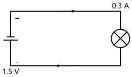
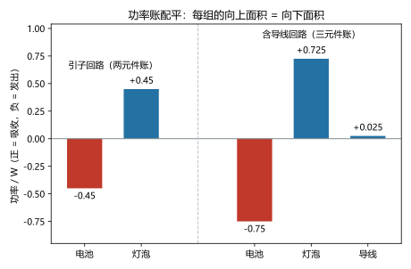

# 第 01 讲：电路模型与基本变量

> **前置**：无，这是全课程第一讲。
> **预计时间**：约 2.5 小时（含作业）。
>
> **一句话定位**：全课程的第一课不是"算电路"，而是"立规矩"——先把三样基本量的严格含义（电流、电压、功率）讲透，再建立本课程使用最频繁的一条记账约定：参考方向。之后每一讲都踩在这一讲的地基上。
>
> **本讲回答什么**：
> 1. 电路图上的电池、灯泡、导线，为什么和实物长得不一样？"模型"到底是什么意思？
> 2. 电流会被元件"用掉"吗？参考方向是"真实方向"吗？设错了会怎样？
> 3. 电压是"哪一点"的量？说"某点电压 3V"严谨吗？
> 4. 功率的正负号怎么读出"谁吸收、谁发出"？
>
> **这一讲有真实验证**：参考方向的记账对照表、换参考点的电位平移、引子回路电路图（脚本 `scripts/lec01-01_verify_reference_direction.py`）；引子回路的功率平衡账与含导线三元件账（脚本 `scripts/lec01-02_verify_power_balance.py`）。

## 本讲怎么走（脉络图）

```
引子：一节电池 + 一只灯泡（0.45 W 的账，先把争论摆上桌）
  │
  ├─ 1. 从真实器件到电路模型（电池凭什么能画成两条线）
  ├─ 2. 电流：流动的主角，与"参考方向"这套记账规矩
  ├─ 3. 电压与电位：两点之间的事，与"先假设哪端高"
  ├─ 4. 功率：电路的"交易"（引子在这里对上账）
  └─ 常见误区 → 本讲小结 → 掌握度自测 → 作业
```

> 下一站：§引子。我们先从一个"两派争论"里的真实小电路开始——它简单到初中生都会算，却能让不少人对"那天到底该往哪个方向标箭头"卡壳。

---

## 引子：一节电池、一只灯泡、两个朋友

桌上摆着一个最简单的电路：一节 1.5 V 的干电池、一只小灯泡、两根短导线把它们接成一个回路。灯泡亮着，一切正常。

你用万用表量了两个数，记在纸上：

- 电池两端的电压：1.5 V
- 回路里的电流：0.3 A

现在问一个初中的问题：**这只灯泡的功率是多少？**

0.45 W——你可能脱口而出（1.5 × 0.3；这个式子为什么成立，第 4 节会给它一个严格的来历）。但真正较真的问题在后面。

朋友 A 盯着灯泡看了一会儿，说：

> "灯泡把电流用掉了一部分——电流点亮灯丝发光发热，出来的时候肯定变小了，就像水流过水车会变慢。"

朋友 B 反驳：

> "串联回路里电流处处相等，灯泡后面的电流还是 0.3 A，一格都不少。"

这个争论本讲必须给出精确答案。先剧透一句：**B 的结论对**（电流确实不变），**但 A 的疑问也不是无理取闹**——灯泡里确实发生了"消耗"，只是被消耗的那个东西另有其人（第 4 节揭晓）。

除了这场争论，还有一类问题你可能从没认真想过：

- 你写下"0.3 A"的时候，有没有想过在图上它的**方向**该怎么标？从电池正极流向灯泡，还是反过来？凭什么这么标？
- "电池两端 1.5 V"——这个 1.5 V 是"哪一端比哪一端高"？图上的"+"号该画在哪边？
- 如果方向或高低设反了，算出来的答案会不会全错？

这三件事——**电流怎么记方向、电压怎么记高低、功率怎么记进出**——是全课程的第一套规矩。它们听起来都是老熟人，但没有立好，后面每一个方程都会跟着乱。本讲就干这一件事：把规矩立起来。而第一件要做的事，是承认一个事实：图上的电池和灯泡，其实都不是"真的"。

---

## 1. 从真实器件到电路模型

### 1.1 电路图不是照片

把一节真电池拿在手里：它是一截金属筒，里面装着化学物质，两端是电极。真灯泡是一颗玻璃泡，里面悬着一根细灯丝。但工程师画出来的电路图长这样：



> **图 1 怎么读**：左边长短短线是电池的符号，右边带交叉线的圆圈是灯泡的符号，中间是两根导线。图上还标了两种东西：一些**箭头**（表示电流的参考方向，第 2 节正式讲）和电池旁的 **+、-** 号（表示电压的参考极性，第 3 节正式讲）。现在先混个脸熟：这张图就是接下来三节的"教具"。

对比实物和图，你会发现画图的人做了三件"不老实"的事：

1. **电池**没有画成金属筒，画成了两条长短平行线；
2. **灯泡**没有画成玻璃泡和灯丝，画成了圆圈加一个叉；
3. **导线**画成了没有粗细的直线——而现实的铜线是有电阻的。

这不是偷懒，这是整门课程的核心方法：**电路分析的第一个动作，永远是把真实的物理器件替换成一个"电路模型"（circuit model）**。模型不是照片，是给分析"裁过"的图纸——保留电气行为，砍掉与电气行为无关的物理细节。下面把这三处替换讲清楚。

### 1.2 三处替换：理想元件、理想导线、集总假设

**替换一：器件 → 理想元件。**

电池的"电气性格"是什么？它是两端能够维持一定电压的器件。灯泡的"电气性格"是什么？它让电流通过时两端产生一定电压，并把能量转成光和热。这两句话里没有一个字提到金属筒或玻璃——**器件在电路里留给我们的信息，其实就是"两端电压"与"流过的电流"之间的关系**。

这种关系的正式名字叫**伏安关系**（volt-ampere relationship）：先记住它是"元件两端电压与流过电流之间的约束"，完整定义和每类元件的具体形态，是第 02 讲的主题。本讲对元件的要求很低：把它们当作只露两个端子的"黑箱"，我们关心的全部内容就是端子上的电压和电流。

（细则的坑在第 02 讲逐个填，比如电阻的伏安关系是不是一条直线、实际电池和理想电池差在哪。）

**替换二：导线 → 理想导线。**

真铜线有电阻，但短而粗的导线上电压损失小到可以忽略。为了简单，电路初学阶段一律把连接导线当成**理想导线**：电阻为零，电压处处为零，只负责连接。

这是一个**可以随时反悔的简化**——本讲第 4 节就有一个例子：当导线"偷走"的那一点点电压不可忽略时，我们不再反悔重画图，而是把导线"升级"成一个电阻元件放回电路里。模型不怕修改，只怕你不知道它简了什么。

**替换三：一切元件的位置 → 集中在端子上（集总参数假设）。**

**集总参数假设**（lumped-parameter assumption）：把所有元件的电气行为集中到它的端子上处理，导线只当连接、不当"传输线"。

这个假设什么时候成立？直观判据：**电路的物理尺寸远小于信号在电路里变化一个来回所对应的长度**。对于 50 Hz 的市电，波长约为 6000 km，任何实验室电路都"短"得可以放心；但如果电路里跑的是几百 MHz 以上的高速信号，导线本身就要当元件处理了（那时该学"传输线"——本课程不展开，第 25 讲的接口地图里会提它在哪）。

一句话收拢这三处替换：

> **电路模型 = 理想元件 + 理想导线 + 集总假设。**

以后说"分析这个电路"，一律指的是"分析这张模型图"，而不是那张桌上的实物。

### 1.3 模型是给谁用的：一份契约

到这里你可能想问一个很哲学的问题：**模型和实物差这么多，凭什么算出来的答案能信？**

两个层次的回答。

第一，**选简化不是随便选的**：砍掉的东西（玻璃壳、金属筒的形状）恰好是对我们关心的电气量没有可观测影响的东西；留下的东西（端电压、电流的关系）恰好是能测、能验的。这是"裁剪"和"乱删"的区别。

第二，**模型给结论，实验来背书**：模型上算出的每一个数，都可以拿到实物上测。测得上——模型可用；测不上——回头改模型（比如给导线补一个电阻，见第 4 节），而不是绝望。这门课的"可信度"就靠这套契约成立。

> 下一站：模型摆好了，图也画了。图上的主角是谁？是"流过去"和"高与低"。§2 先讲第一个主角——电流，以及"方向"这笔一开始就要记对的账。

---

## 2. 电流：流动的主角与它的记账方式

### 2.1 电流是什么

> **电流**（current）：电荷的定向移动。它的大小用"单位时间内通过某个横截面的电荷量"度量：
>
> $$i = \frac{\mathrm{d}q}{\mathrm{d}t}$$
>
> 其中 $q$ 是电荷量（单位：库仑，C），$i$ 是电流（单位：安培，A；$1\,\mathrm{A} = 1\,\mathrm{C/s}$）。如果电流大小和方向都不随时间变化（本课程前半程的主角），习惯用大写 $I$ 表示，并称它为**直流**（direct current，DC）。

这个定义里有两个不起眼但要命的细节：

**细节一：电流是"通过截面"的量，天生自带一个"朝向问题"。** 电荷在动，就有"往哪边动"。说"这个回路的电流是 0.3 A"是不完整的——图上的 0.3 A 必须配一个**方向**才构成完整信息。

**细节二：电流的单位是"每秒多少库仑"，不是"每秒多少电子"。** 顺带解开一个很多人从小到大的疑惑：导线里的电子其实爬得极慢（每秒不到一毫米），但按下开关灯几乎立刻亮——因为动起来的不是某一批电子跑完全程，而是"推动"这个效应以接近光速在导线里传开，导线里本来就到处都是电子。**电流是"流过的速率"，不是"某批电荷的旅行进度"。**

### 2.2 参考方向：先假设，再修正

现在处理"朝向问题"。你想标出电流的方向，遇到的第一个困难是：**分析开始之前，你并不知道真实方向。** 不仅不知道，方向本身还依赖电路里其他元件的数值——算出来之前，谁是高电位一端都说不准。

全课程的第一个大规矩由此诞生：

> **参考方向**（reference direction）：在图上给每段电流**先假设**一个方向，用小箭头标出；全部分析自始至终按这个方向写方程。这个方向只是记账约定，不是物理断言。

"假设一个方向"听起来像耍赖，其实恰恰相反，它把"未知"变成了"可计算"：

- 如果算出来的结果是**正数**（例如 $I = 0.3\,\mathrm{A}$）：说明你假设的方向和真实方向一致；
- 如果算出来的结果是**负数**（例如 $I = -0.3\,\mathrm{A}$）：说明真实方向与你假设的相反，大小是 0.3 A。

换句话说：**"一个数 + 一个约定"就是一条完整的电流信息。** 负号不是"错误"，是"和你猜的相反"这句大白话的数学写法。

看一个具体的记账例子。假设某段支路（"支路"指串联走的一段路，正式定义在第 02 讲）的电流参考方向标为从 a 指向 b，解方程得到：

| 解出来的值（参考方向 a → b） | 读法 |
|---|---|
| $+0.3\,\mathrm{A}$ | 真实电流从 a 流向 b，大小 0.3 A |
| $-0.3\,\mathrm{A}$ | 真实电流从 b 流向 a，大小 0.3 A |
| $0\,\mathrm{A}$ | 这条路上没有任何电流通过 |

（脚本 `scripts/lec01-01_verify_reference_direction.py` 里有一张更细的对照表，把"参考方向设反"前后所有符号的变化完整列了出来。）

### 2.3 电流守恒：灯泡"用掉"的到底是什么

回到引子的争论。朋友 A 说"灯泡用掉了电流"，朋友 B 说"电流处处相等"。谁对？

先给结论，再讲机制：

> **在同一段串联路径上（回路没有分岔的那些路段），电流处处相等。电流不会被元件"用掉"。**

机制是**电荷守恒**：电荷既不能凭空产生，也不能在某处堆积下来（在大小不随时间变化的稳态下）。每秒钟有什么量从这段路的一头涌进去，就必须有同样的量从另一头涌出来——只是这些电荷在"挤过"灯泡的灯丝时丢掉了能量（那才是"消耗"的主角，第 4 节讲）。灯泡的灯丝对电荷来说不是"收费站"，更像"陡坡"：车一辆不少地开过去，但每辆都从坡上滑下去一段，撞出了光和热。

不过要提醒一句：**"电流处处相等"说的是"同一段没有分岔的路"**。如果电路里有分岔点（好几条路汇合、又分开），电流会"分流"和"汇合"——进出分岔点的电流之间有一种严格的平衡关系。这个规矩有个大名鼎鼎的名字叫**基尔霍夫电流定律**（KCL），是第 02 讲的主角；本讲只需要记住它在"不分岔路段"上的特例已经够用。

### 2.4 电流家族先见一面

本讲和接下来的好几讲，研究的基本都是**直流**（大小、方向都不变）。但现实里的电流还有"方向变""大小变""方向大小一起变"的——比如墙上的交流电，一秒钟变方向 100 次。它们不是另一个世界的生物：描述它们照样用电流的定义（每秒钟通过截面的电荷量），本章的记账规矩也照用，只是"$\mathrm{d}q/\mathrm{d}t$"这个定义开始显威力——它本来就是为"变动的小量"准备的。

变化电流的完整玩法要到第 09 讲（电容电感）和第 13 讲（相量法）才展开。现在你只需要在视线里给它们留一个座位。

> **态度表（电流部分）**
>
> | 内容 | 态度 |
> |---|---|
> | 电流的定义 $i = \mathrm{d}q/\mathrm{d}t$ | **能复述**，能解释"它是速率，不是电荷旅行进度" |
> | 参考方向"先假设、再修正" | **焊成直觉**：看到电路图先找箭头，符号反着读不慌 |
> | 负值的读法 | **能复述**：负数 = 真实方向与假设相反 |
> | "电流不会被用掉" | **焊成直觉**，并在分岔点上知道"有分流规矩（KCL，第 02 讲）" |
>
> 下一站：主角之一到位。但没有"高低"就没有"流动"——为什么电流会流动？§3 讲电压，以及它凭什么是"两点之间"才能谈的量。

---

## 3. 电压与电位：两点之间的事

### 3.1 电压是什么

电流为什么会流动？先说一句总结性的回答：**因为有"高低差"推着电荷走**。现在把这个"高低差"翻译成精确的定义。

> **电压**（voltage）：电路中 a、b 两点间的电压，数值上等于把单位正电荷从 a 端移到 b 端、经过这段路时**转移的能量**：
>
> $$U_{ab} = \frac{W_{ab}}{q}$$
>
> 其中 $q$ 是电荷量（C），$W_{ab}$ 是这部分电荷在从 a 到 b 的过程中失去（或在电源里获得）的能量（J），$U_{ab}$ 就是 a、b 之间的电压（V）。$1\,\mathrm{V} = 1\,\mathrm{J/C}$。

把话说直：**电压是"每库仑电荷身上能转移多少能量"的报价。** 在负载（灯泡这样的元件）上，电荷从一端挪到另一端会被"取走"一部分能量（变成光和热）；在电池内部相反——化学力把电荷从低处"举"到高处，电荷在电池里是**获得**能量的。

两个要点：

1. **电压是"两点之间"的量。** 表层原因看定义就懂：能量转移总发生在"从 a 到 b"的路上，单独一个点没有"转移"可言。深层一点说：**流动的驱动力源于"差"，差值才有方向。**
2. **电压和电流是一对分工**：电流管"每秒运多少电荷"（流量），电压管"每库仑电荷携带/交出多少能量"（单价）。**能量转移的速率 = 流量 × 单价**——这句话的第 4 节版本就是功率公式 $p = ui$，现在先记住它的意思。

日常的电压标尺（建立量感）：一节干电池 1.5 V；手机充电器输出 5 V；家里的市电 220 V；特高压输电线路可到 1000 kV 量级。同一个电路里，电压等级的分布决定"哪里危险、哪里器件扛不住"，这是工程上盯电压的原因。

### 3.2 电压的参考极性：和电流同一套逻辑

电流做分析前要"先假设方向"，电压同理——分析前你同样**不知道哪一端高**，所以：

> **参考极性**（reference polarity）：在图上先假设电压的高端，把 "+" 标在假设的高的一端、"-" 标在低的一端（或者用双下标记法 $U_{ab}$，表示"从 a 到 b"）。全部分析按这个假设写方程。

读法和电流完全同构：

| 解出来的值（a 端为假设的 "+"） | 读法 |
|---|---|
| $U_{ab} = +1.5\,\mathrm{V}$ | 实际 a 端比 b 端高，电压 1.5 V |
| $U_{ab} = -1.5\,\mathrm{V}$ | 实际 b 端比 a 端高，电压 1.5 V |
| $U_{ab} = 0\,\mathrm{V}$ | 两端等电位（例如一段理想导线两端） |

一个必须会用的等式，来自"换边走能量就反号"这一事实：

$$U_{ab} = -U_{ba}$$

拿它当翻译器：看到 $-U_{ab}$ 就念"b 比 a 高多少"，不用重新推理。

到这里你可以回头看一眼图 1 了：图上电池旁的 +、- 号，就是它的电压参考极性；导线上的箭头，就是电流参考方向。**"图上一堆箭头和加减号"不是装饰，是这门课的记账符号系统**——记住这一点，以后自己画图也会主动去标。

### 3.3 电位与参考点：一个更好用的说法

在电路里到处说"某两点间的电压"很累。像地理课解决"海拔"那样，电路里也选一个**基准点**：规定它的电位为零，往后一切"高多少、低多少"都相对它来说。

- **参考点**（reference point）：电路中选定的零电位点。惯例上叫**地**（ground），在电路图里用一个"三根横线"的符号表示。
- **电位**（potential）：某点的电位 = 该点与参考点之间的电压。记作 $V_a$（a 点的电位）。
- 于是两点间的电压就是电位差：$U_{ab} = V_a - V_b$。

关于"参考点随便选吗"，有两件事要分清——这也是本节最重要的性质：

> **换参考点：所有电位整体平移；任意两点间的电压不变。**

用一个具体数字感受一下（脚本 `scripts/lec01-01_verify_reference_direction.py` 实测）：某支路上三点 a、b、c 对原参考点的电位是 $V_a = 10\,\mathrm{V}$、$V_b = 6\,\mathrm{V}$、$V_c = 0\,\mathrm{V}$。现在把参考点换到 b 点：

| 量 | 换之前 | 换之后（以 b 为参考） | 变了吗 |
|---|---|---|---|
| $V_a$ | 10 V | 4 V | 变了（整体平移） |
| $V_b$ | 6 V | 0 V | 变了 |
| $V_c$ | 0 V | −6 V | 变了 |
| $U_{ab} = V_a - V_b$ | 4 V | 4 V | **没变** |
| $U_{bc} = V_b - V_c$ | 6 V | 6 V | **没变** |

**电压是"物理事实"，电位是"相对参考点的话术"。** 这话术很快会变成你的主要语言——第 04、05 讲的结点电压法、第 24 讲的矩阵形式，主角全是"电位"。

最后一句防身话：日常说"某点电压 3 V"，省掉了"（相对参考点）"几个字——口语没问题，但写方程、答题时要清楚它严格含义是"该点与参考点之间的电压"。

### 3.4 三个量看齐

| 量 | 是什么 | 自带的方向问题 | 解决方式 |
|---|---|---|---|
| 电流 | 通过截面的电荷速率 $i=\mathrm{d}q/\mathrm{d}t$ | 往哪边流 | 参考方向（箭头） |
| 电压 | 两点之间每库仑的能量转移 | 哪端更高 | 参考极性（+、-） |
| 电位 | 一点相对参考点的高度 | （参考点定则唯一） | 先选参考点 |

> **态度表（电压与电位部分）**
>
> | 内容 | 态度 |
> |---|---|
> | 电压的定义（"每库仑的能量报价"） | **能复述** |
> | 参考极性与负值读法 | **焊成直觉**（与电流同构） |
> | $U_{ab} = -U_{ba}$ | **能默写、随手用** |
> | 参考点平移性质（电位变、电压不变） | **能复述 + 能举数字例子** |
> | 电位语言 | 会用：后续所有分析方法的主要语言 |

> 下一站：两个主角（电流、电压）带齐了符号系统。现在把它们乘起来——功率，也就是电路的"交易速率"，引子的那笔账在 §4 结清。

---

## 4. 功率：电路的"交易"

### 4.1 $p = ui$ 的来历

功率的定义很朴素：

> **功率**（power）：能量转化的速率，$p = \dfrac{\mathrm{d}w}{\mathrm{d}t}$，单位瓦特（W，$1\,\mathrm{W} = 1\,\mathrm{J/s}$）。不随时间变化时用大写 $P$。

把电流和电压的定义乘起来，就得到电路里功率的算法：

$$p = \frac{\mathrm{d}w}{\mathrm{d}t} = \underbrace{\frac{\mathrm{d}w}{\mathrm{d}q}}_{=\,u} \cdot \underbrace{\frac{\mathrm{d}q}{\mathrm{d}t}}_{=\,i} = u \cdot i$$

看最后一行：第一个因子"每库仑多少钱"（就是电压），第二个因子"每秒多少库仑"（就是电流），单价 × 流量 = 每秒交易额（功率）。**引子里那个 1.5 × 0.3 = 0.45 W 的"初中公式"，到这里才有了真正的来历。**

注意一个细节：式中的 $u$ 和 $i$ 必须是**同一个元件**两侧的量——"这个元件两端的电压"乘"流过这个元件的电流"，得到的是这个元件的功率。

### 4.2 关联参考方向：让符号干净的一条约定

$p = ui$ 直接算有个麻烦：你现在已经知道，$u$ 的参考极性可以随便假设、$i$ 的参考方向也可以随便假设。四种假设组合混在一起，同一个元件算出的 p 有时正代表"吸收"、有时正代表"发出"——符号语言就乱套了。

工程界对这件事的处理是一句约定：

> **关联参考方向**（associated reference direction）：电流的参考方向**从电压参考"+"端流入**元件（"+"端进，"-"端出），称这对参考方向为"关联"。

在这条约定下，符号变得非常干净：

| 参考约定 | 计算式 | $p > 0$ | $p < 0$ | 记忆法 |
|---|---|---|---|---|
| 关联 | $p = ui$ | 吸收功率 | 发出功率 | 约定对上，"直读" |
| 非关联 | $p = -ui$ | 吸收功率 | 发出功率 | 约定对着干，"读完取反" |

（两种算法统一口径：**算出的都是"吸收功率"**。正 = 真吸收，负 = 不吸反吐，即发出。）

一个很好用的口诀：**"先看箭头对不对加号"**——箭头指进"+"端，就是关联，直接乘；箭头从"+"端出去，就是非关联，乘完加负号。养成习惯：拿到任何元件，先把它那两个符号的关系看明白，再动笔算功率。

把上面的规矩固化成一个**三步模板**——以后问任何元件"吸收还是发出、多少功率"，照做即可：

> **① 定关系**（看参考方向：电流从"+"端进 = 关联；从"+"端出 = 非关联）→ **② 套式子**（关联 $p = ui$；非关联 $p = -ui$；算出的数值一律先当"吸收功率"）→ **③ 读符号**（$p > 0$ 吸收；$p < 0$ 发出——负的"吸收"就是往外供）。

后面两本账（引子回路、含导线回路）就是这张模板的填数示范。

### 4.3 引子对账：第一本功率账

用这套规矩把引子的回路算一遍（脚本 `scripts/lec01-02_verify_power_balance.py` 实测）：

**电池**：电流从它的"+"端流出（看图 1 的箭头），属于**非关联**：

$$p_{\text{电池}} = -ui = -(1.5)(0.3) = -0.45\,\mathrm{W}$$

负号 = 不吸收 = **发出 0.45 W**（电池在供电，符合直觉）。

**灯泡**：电流从"+"端流入，**关联**：

$$p_{\text{灯泡}} = ui = (1.5)(0.3) = +0.45\,\mathrm{W}$$

正号 = **吸收 0.45 W**（灯泡在耗能，符合直觉）。

一发出、一吸收，数值相等——引子那笔账平了。这个"平"不是巧合，是下一节的普适规矩。

### 4.4 功率平衡：全课程的第一把验算尺

> **功率平衡**：对任何电路，全部元件**发出**的功率之和 = 全部元件**吸收**的功率之和。（等价说法：把所有元件的"吸收功率"加起来，总和为零。）

道理就是能量守恒：一个元件"发出"的能量不会消失，必然被别的元件吸收——**功率只在电路内部转移，总量守恒**。引子里电池发出 0.45 W、灯泡吸收 0.45 W，正是这个守恒的最小案例。

这条件在课程里的身份不是"一条定理"，而是**一把验算尺**——以后每算完一个电路，你都有两种复核方式：把解回的电压电流代回定律（第 02 讲起），或者算一遍全电路的功率账。两个都对上，答案基本跑不掉。这门课会反复执行这个动作：**先算，再验账**。

数值细节顺便说一句：电脑按上面的算法做账，误差在 $10^{-16}$ 量级（脚本输出里打印的"残差"就是这个数）——在浮点数世界里，那就是"零"的长相。

### 4.5 能量与"用掉"的谜底

功率是"每秒的节奏"，乘上时间就是总量：

$$W = P\,t \qquad (\text{直流})$$

单位焦耳（J）。日常计量用电用**千瓦时**（kWh，"度"）：$1\,\mathrm{kWh} = 3.6 \times 10^6\,\mathrm{J}$（1000 W 的电器工作 1 小时耗 1 度电）。

现在回到引子，把谜底完整揭晓：

- 灯泡"用掉"的吗？——**用掉的是能量**。每秒有 $0.45\,\mathrm{J}$ 从电路转移进灯泡，变成光和热。
- 电流呢？——§2.3 已经答过：电流在回路上处处相等，一格不少。电流是**能量的搬运方式**，不是能量本身。朋友 B 的结论是对的；朋友 A 说的"消耗"确实存在，但它记在**能量**的账上，不是记在电流的账上。

一句话收拢：**电流守恒与能量守恒是两本独立的账**——各自都平，各自都要会算。

### 4.6 模型升级：给导线补一笔账

承诺兑现时间。§1.2 说过"导线可以随时从'理想'降级成'有电阻'"，现在看一个真的例子。

同样是一节 1.5 V 电池点亮灯泡，但这次用的是长导线，于是导线上的那点损失不再是零。实测三个数：**导线两端 0.05 V、灯泡两端 1.45 V、回路电流 0.5 A**（脚本 `scripts/lec01-02_verify_power_balance.py` 实测）。

三本账按规矩算：

| 元件 | 参考约定 | 计算 | 判定 |
|---|---|---|---|
| 电池 | 非关联（电流从 + 流出） | $p = -(1.5)(0.5) = -0.75\,\mathrm{W}$ | 发出 0.75 W |
| 灯泡 | 关联 | $p = (1.45)(0.5) = +0.725\,\mathrm{W}$ | 吸收 0.725 W |
| 导线 | 关联 | $p = (0.05)(0.5) = +0.025\,\mathrm{W}$ | 吸收 0.025 W |

验账：吸收合计 $0.725 + 0.025 = 0.75\,\mathrm{W}$ = 发出 0.75 W。**账多了新成员，照样平。**



> **图 2 怎么读**：左组是引子的两元件账（电池 −0.45、灯泡 +0.45），右组是本节的三元件账（电池 −0.75、灯泡 +0.725、导线 +0.025）。向上的条是吸收、向下的条是发出，每组里上下面积恰好互相抵消。多看一眼右边的"导线"条：它微小但不为零——**现实里"电线自己发热"的线损，最微型的版本就是它。**

### 4.7 态度表（功率部分）

| 内容 | 态度 |
|---|---|
| $p = ui$ 及其来历（单价 × 流量） | **能复述推导** |
| 关联参考方向与判定表 | **默写判定表**；读图第一步"看箭头对不对加号" |
| 功率平衡 | **焊成纪律**：每算完一个电路必须验账 |
| 能量 $W = Pt$ 与"度" | 知道有这回事，会换算 |

---

## 常见误区（本节零新知识，只破误）

> 以下每条只是"对答案 + 校准"，没有新知识——每一句都已在正文系统小节里教过。

1. **"电流经灯泡后被用掉了一部分"**（§2.3、§4.5）。错。电流处处相等；被用掉的是能量。
2. **"参考方向必须猜对；猜错了答案就错了"**（§2.2、§3.2）。错。参考方向是先假设、后修正的记账约定；猜错了只会让解出来的数值带负号，"一个数 + 一个约定"照样是完整信息。
3. **"解出负的电流/电压说明我算错了"**（§2.2、§3.2）。错。负号是"真实情况与假设相反"的正常读法，不是错误警报。
4. **"电压是某一点自己的属性"**（§3.3）。不严谨。电压是两点的差价；"某点电压"省掉的是"（相对参考点）"四个字。
5. **"功率算出正号就是元件在耗能"**（§4.2）。错。必须先看参考约定：关联时正号 = 吸收；非关联时正号 = 发出。不区分约定就读符号，必翻车。
6. **"电池一定发出功率、灯泡一定吸收功率"**（§4.2 的推论）。不一定。发出还是吸收由参考方向与数值共同决定——充电中的电池就在**吸收**功率（它这时是个负载）。
7. **"功率平衡只是一种巧合的验证"**（§4.4）。不是巧合，是能量守恒；它对任何电路无条件成立，是法定的验算尺。

---

## 本讲小结

一页纸的骨架：

- **电路模型**：真实器件 → 理想元件 + 理想导线 + 集总参数假设。模型是给分析裁过的图纸；简化有边界（导线电阻、高频传输线），且可以随时"升级"。
- **电流**：$i = \mathrm{d}q/\mathrm{d}t$，通过截面的电荷速率；方向未知所以先设**参考方向**；负值 = 与假设相反；同一段不分岔的路电流处处相等（不被用掉）。
- **电压**：两点之间每库仑的能量转移；先设**参考极性**；$U_{ab} = -U_{ba}$；**电位** = 相对参考点的高度，换参考点电位平移、电压不变。
- **功率**：$p = ui$（单价 × 流量）；**关联参考方向**下 $p = ui$ 直读吸收功率（正吸负发），非关联则 $p = -ui$；**功率平衡**是万能验算尺。
- **能量**：$W = Pt$；"用掉的"是能量不是电流——两本账（电流守恒、能量守恒）各自独立。

## 掌握度自测

- [ ] 我能说出电路模型的三处替换（理想元件、理想导线、集总假设），并各举一个"简化会失效"的情形。
- [ ] 我能解释"电流像水流会被用掉"错在哪，并说清"用掉的到底是什么"。
- [ ] 我能说明参考方向的作用，并给出"解出 −0.3 A"的正确读法。
- [ ] 我能说清"电压是两点之间的量"，并解释为什么"某点电压"是不完整的说法。
- [ ] 我能数字举例说明"换参考点：电位全变、电压不变"。
- [ ] 我能默写关联/非关联的功率判定表，并随手判定"这个元件在吸收还是发出"。
- [ ] 我能默写 $p=ui$ 的一行推导（单价 × 流量）。
- [ ] 我能独立算一本两元件账和一本三元件账（含导线），并验平衡。
- [ ] 我能换算 1 度电是多少焦耳，并算一件电器一段时间的耗能。
- [ ] 我能复跑 `scripts/lec01-01` 与 `lec01-02`，并解释输出里的每一个数字（0.45、−0.75、0.725、0.025、残差、10/6/0 → 4/0/−6）。

## 作业

> 答案只能用**已教概念**（本讲范围：电路模型与集总假设、电流与参考方向、电流守恒（不分岔路段）、电压与参考极性、电位与参考点、功率 $p=ui$、关联参考方向、吸收/发出判定、功率平衡、能量 $W=Pt$）。先独立做，再对答案。

### 基础

**Q1. 概念辨析**：判断下列说法对不对，并给一句话理由。

(a) "电流流过灯泡，出来时会小一半，因为灯泡消耗了电流。"
(b) "参考方向设反了，这道题就肯定解错了。"
(c) "解出电池的端电压是 −6 V，说明数据错了。"
(d) "a 点的电压是 5 V——这句话本身就是完整的。"
(e) "元件功率算出来是正数，说明它在吸收能量。"

**参考答案**：

(a) 错。电流在不分岔路段处处相等（电荷守恒）；灯泡消耗的是**能量**，不是电流。
(b) 错。参考方向是记账约定，只是先假设；设反了会让结果带负号，读出来即可，答案依然正确。
(c) 错。负值本身不是错误，只是表示实际极性与假设相反；数据是否错了要靠别的证据（比如功率平衡、测量记录）。
(d) 不严谨。电压是两点之间的量；这句话省掉了"（相对参考点）"，严格说法是"a 点相对参考点的电位是 5 V"。
(e) 不完整。必须先看参考约定：**关联**参考方向下正号才是吸收；非关联下正号反而表示发出。
验算：五小题都能用同一句话表述判据——"先查前提（约定/定义域），再读符号"。

**Q2. 计算·两元件账**：一个 6 V 电池点亮灯泡（导线很短，按理想导线处理）。万用表测得回路电流为 0.25 A，灯泡两端电压 6 V。求：(1) 灯泡的功率；(2) 电池的功率（按参考约定算，并说明吸收还是发出）；(3) 验证功率平衡。

**参考答案**：

(1) 灯泡：电流从 + 端流入，关联，$p = 6 \times 0.25 = +1.5\,\mathrm{W}$，**吸收 1.5 W**。
(2) 电池：电流从 + 端流出，非关联，$p = -(6)(0.25) = -1.5\,\mathrm{W}$，即**发出 1.5 W**。
(3) 平衡：发出 1.5 W = 吸收 1.5 W，账平。
验算：把两元件按"吸收口径"相加：$+1.5 + (-1.5) = 0$ ✓。

**Q3. 计算·加长导线**：同上的电路，但换用了长导线，测得：导线两端 0.2 V、灯泡两端 5.8 V、回路电流仍为 0.25 A。求导线与灯泡各自的功率、电池的功率，并验证平衡。

**参考答案**：

- 电池（非关联）：$p = -(6)(0.25) = -1.5\,\mathrm{W}$，发出 1.5 W；
- 灯泡（关联）：$p = (5.8)(0.25) = +1.45\,\mathrm{W}$，吸收 1.45 W；
- 导线（关联）：$p = (0.2)(0.25) = +0.05\,\mathrm{W}$，吸收 0.05 W；
- 验账：$1.45 + 0.05 = 1.5$ ✓ 平衡。
验算：另一条路——电池电压 6 = 导线 0.2 + 灯泡 5.8，电压分配对上了，功率账才可能平。

### 提高

**Q4. 参考方向反设对照**：某元件，其两端的实际电压为 2 V（左端高），实际电流为 0.5 A（从左端流入）。

(1) 若按"电流从 + 端（左端）流入"设定参考方向（关联）：写出的电压、电流读数值各是多少？算出 p，判断吸收/发出。
(2) 若把电流的参考方向反过来设成"从右端流入"（非关联）：这时记录的电流值是多少？再算一遍 p，判断吸收/发出。
(3) 两个约定下的"物理事实"相同吗？用一句话说明。

**参考答案**：

(1) 电压参考 + 在左、电流从左流入 → 关联。读数：$u = +2\,\mathrm{V}$、$i = +0.5\,\mathrm{A}$。$p = ui = +1.0\,\mathrm{W}$，**吸收**。
(2) 电流参考方向反设后，真实电流（从左入）与参考方向（从左出）相反，故读数 $i = -0.5\,\mathrm{A}$。此时为非关联，$p = -ui = -(2)(-0.5) = +1.0\,\mathrm{W}$，**仍是吸收**。
(3) 相同。两套约定只是记账方式不同，物理事实（左端高 2 V、电流 0.5 A 从左流入、"该元件吸收 1 W"）完全一致。
验算：(1)(2) 两次判定结果必须一致——这是"约定不改变物理"的直接检验。

**Q5. 电位与电压**：某电路三点 a、b、c，以 c 点为参考点时 $V_a = 10\,\mathrm{V}$、$V_b = 6\,\mathrm{V}$、$V_c = 0\,\mathrm{V}$。

(1) 求 $U_{ab}$、$U_{ba}$、$U_{bc}$。
(2) 若把参考点改选为 b 点，三点电位各变成多少？重新求 $U_{ab}$、$U_{bc}$，与 (1) 比较。

**参考答案**：

(1) $U_{ab} = V_a - V_b = 4\,\mathrm{V}$；$U_{ba} = -U_{ab} = -4\,\mathrm{V}$；$U_{bc} = V_b - V_c = 6\,\mathrm{V}$。
(2) 参考点移到 b：$V_a = 4\,\mathrm{V}$、$V_b = 0\,\mathrm{V}$、$V_c = -6\,\mathrm{V}$（全体平移 −6 V）。此时 $U_{ab} = 4 - 0 = 4\,\mathrm{V}$、$U_{bc} = 0 - (-6) = 6\,\mathrm{V}$——与 (1) 完全相同。
验算：电位平移了同一个常数，"差值"自然不变——这正是"电压是物理事实、电位是话术"的原因。

**Q6. 验账抓错**：某同学报告一组测量数据：电池发出 2.0 W；灯泡吸收 1.85 W；导线吸收 0.05 W。请用功率平衡核查这组数据，并说明你的结论。

**参考答案**：

核查：吸收合计 $1.85 + 0.05 = 1.90\,\mathrm{W} \ne 2.0\,\mathrm{W}$，**账不平，差 0.1 W**。
结论：数据中存在错误——要么某次测量不准，要么电路里还有未被计入的元件（比如第二根导线的损耗）。
验算：把电池改为发出 1.9 W 则账平；或把灯泡改为 1.95 W 也平——具体哪一项错，要靠重测确认，但"账必须平"这条判据可以直接判"这组数据不可信"。

### 综合（回扣本讲主任务）

**Q7. 完整走一遍**：一块 4.5 V 的电池给一个小风扇供电。测得回路电流 0.2 A，风扇两端 4.5 V（导线按理想处理）。

(1) 在纸上画出回路，给电流标一个参考方向、给电池和风扇标上参考极性（画完看看：你的标注是关联还是非关联？其实两种都行——写清你的设定）；
(2) 算风扇与电池的功率，判断吸收/发出；
(3) 验证功率平衡；
(4) 风扇工作 10 分钟消耗多少能量（焦耳）？
(5) 回答引子朋友 A 的问题：风扇"用掉"的是什么？

**参考答案**：

(1) 略（自检点：图上电流箭头与电压 +、- 齐全，且你自己能说清每组是关联还是非关联）。
(2) 风扇（按关联算）：$p = 4.5 \times 0.2 = +0.9\,\mathrm{W}$，吸收；电池（按非关联算）：$p = -0.9\,\mathrm{W}$，发出 0.9 W。
(3) 平衡：0.9 W = 0.9 W ✓。
(4) $W = Pt = 0.9 \times 600 = 540\,\mathrm{J}$。
(5) 用掉的是**能量**（540 J 转成了风扇的转动与发热）；电流在回路上处处相等，不被用掉。
验算：(4) 换成"度"：$540\,\mathrm{J} \div 3.6\times10^6 \approx 1.5\times10^{-4}$ 度——小电器的量级感对上了。

**Q8. 开放简答·标称值**：一个充电宝外壳印着"输出 5 V 2 A"。有朋友说："这意思是它永远在输出 10 W 的电功率。"请用本讲的语言解释这句话哪里不准确（提示：从"电压 × 电流 = 功率"出发，想想这两个数什么时候才是真的）。

**参考答案**：

"5 V 2 A"是充电宝的输出**能力上限**（能维持 5 V、最多供 2 A）。实际功率 = 实际电压 × 实际电流，而实际电流取决于接了什么设备、设备要"抽"多少——给一只小功率耳机充电时电流可能只有 0.1 A，实际功率是 0.5 W，而不是 10 W。
所以准确的说法是："它最多能输出 10 W"。10 W 只有在满载（正好 2 A）时才成立。
验算：对照 §4 的算式——功率是"实时单价 × 实时流量"，标称上限只是"单价 × 最大流量"的容量声明。

---

*下一讲预告：第 02 讲《电路元件与基尔霍夫定律》——本讲立好了记账规矩，但图上的元件还是"黑箱"。下一讲正式给三类元件"上户口"（电阻、电源、受控源），再加上两条支配全图的定律（KCL 与 KVL）；从下一讲起，你就能独立解出真正的电路了。*