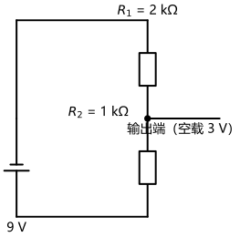
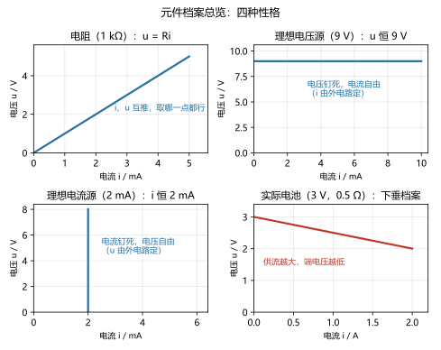
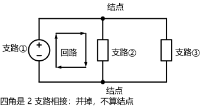
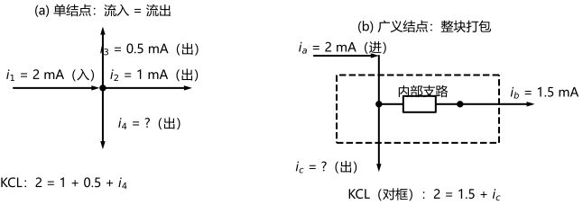
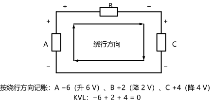
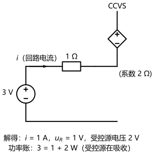
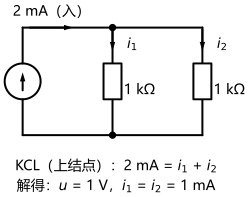
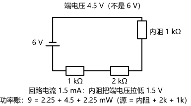

# 第 02 讲：电路元件与基尔霍夫定律

> **前置**：第 01 讲（参考方向、功率符号约定、功率平衡）。
> **预计时间**：约 3 小时（含作业）。
>
> **一句话定位**：第 01 讲把元件当"黑箱"（只从两个端子看它）处理；这一讲打开黑箱——给三类元件各立一份"端子行为伏安关系"，再补上两条支配全图的连接定律（KCL 与 KVL）。两样东西一凑齐，"解电路"这件事就从"测量"升级成了"计算"，本讲的引子就是一个真正的小设计任务。
>
> **本讲回答什么**：
> 1. 电阻、理想电源、受控源各自的"电气特性"（伏安关系）是什么？
> 2. KCL、KVL 凭什么成立，标准列法（模板）怎么用？
> 3. "解电路"到底在联立什么？为什么方程数恰好够？
> 4. 受控源画着电源的样子，为什么说"它不是电源"？
>
> **这一讲有真实验证**：分压器全解、单结点对、含受控源回路、实际电池带载四个求解实验（脚本 `scripts/lec02-01_verify_solve_basics.py`）；四类"元件伏安关系"的取样扫描（脚本 `scripts/lec02-02_verify_element_iv.py`）；六张配图——支路/结点/回路、KCL、KVL 与三个实验电路图（脚本 `scripts/lec02-03_verify_circuit_figures.py`）。

---

## 引子：一个 3 V 的分压器

给定材料：一个 9 V 的电池、两只电阻（2 kΩ 和 1 kΩ）、导线若干。

任务：**接出一个"3 V 输出端"**——从电路里取出一个相对电池负极为 3 V 的点。

（为什么会有这种任务？真实工程里到处都是：传感器电路要用的参考电压、电子仪器的校准点、音量旋钮……"从电源电压里切出一小片"是最常见的电路基本功之一。）

用初中物理即可解决：串联分压、电阻按比例分配——把两只电阻串起来接在电池两端，从**中间那个连接点**取电压。接法如图：

> **图 1 怎么读**：左边是 9 V 电池（长线是正极），右侧竖着串了两只电阻：上面 $R_1 = 2\,\mathrm{k\Omega}$、下面 $R_2 = 1\,\mathrm{k\Omega}$；两只电阻之间的连接点引出一条线，就是"输出端"。（图上标的"空载"：这一端先不接任何东西、就这么空着——接上东西会怎样，§4 见分晓。）为什么这样接能出 3 V，§4 会给出计算。

这张图很老实，但它背后藏着三个初中没跟你较真的问题：

1. **"先有鸡还是先有蛋"？** 要说清电流多大，得先知道电压怎么分；要说清电压怎么分，又得先知道电流多大——你的初中算法"电流 = 总电压 ÷ 总电阻"，其实偷偷跳过了这个循环。它凭什么成立？
2. **"电池保持 9 V"——真的吗？** 真实电池在往外供电时，**端电压**（电池两个接线端之间的电压）会悄悄"下垂"一点。（第 01 讲你的引子里那个 1.5 V，其实只是"没怎么出力"时的读数。）
3. **"输出 3 V"完整吗？** 不对谁而言的 3 V？空手去取是 3 V，接上要用电的东西之后还是吗？

这三个问题，正好对应本讲的三块内容：

- **元件的伏安关系**（每个元件端子上的固定约束——"伏安关系"）：问题 1、2；
- **基尔霍夫定律**（连线的两条连接定律——KCL 与 KVL）：问题 1、3；
- **"联立求解"的心智模型**：问题 1 的直接答案。

三块零件凑齐，分压器在 §4 复算。

---

## 1. 电阻元件：正比关系

### 1.1 欧姆定律：u 与 i 的正比关系

第 01 讲我们把元件当黑箱（只从两个端子看它）：只关心端子上的电压 $u$ 和电流 $i$，不管里面是什么。这一讲给出每个元件的端子电压与端子电流之间，都有一个**固定的约束关系**，这就是它的**伏安关系**（第 01 讲已提过名字）。伏安关系（元件两端电压与电流之间的固定约束）：知道了它，$u$ 和 $i$ 里知道一个就能推另一个。

最老的伏安关系属于电阻：

> **欧姆定律**（Ohm's law）：在关联参考方向下，线性电阻两端的电压与流过它的电流成正比：
>
> $$u = R\,i$$
>
> $R$ 叫**电阻**（resistance），单位**欧姆**（$\Omega$）。焦耳/库仑再除以安培……不用绕，记住这个单位的实际意义：$1\,\Omega = 1\,\mathrm{V/A}$——每安培电流需要多少伏电压"推着走"。

在 $u$-$i$ 平面上（横轴电流、纵轴电压），$u = Ri$ 是一条**过原点的直线**，斜率就是 $R$（这也是"线性电阻"名字的来历）。一个小数组感受一下（脚本 `scripts/lec02-02_verify_element_iv.py` 实测）：$R = 1\,\mathrm{k\Omega}$ 时，电流每加 1 mA，电压就加 1 V：

| 电流 $i$ | 0 mA | 1 mA | 2 mA | 3 mA | 4 mA | 5 mA |
|---|---|---|---|---|---|---|
| 电压 $u = Ri$ | 0 V | 1 V | 2 V | 3 V | 4 V | 5 V |

两个方向的读法都要会：$i$ 已知推 $u$（上表往右读），$u$ 已测推 $i$（"$\div R$"往左读）。写成公式就是 $i = u/R$——同一份伏安关系的两种写法。

（对齐方向的提醒：这是第 01 讲立下的规矩——伏安关系里的比例关系成立的前提是 $u$ 和 $i$ 取关联参考方向。写方程前先确认方向。）

### 1.2 两个极端值：短路与开路

$R$ 取两个极端，伏安关系会发生有趣的变化：

- **短路**（$R = 0$）：$u = 0 \times i \equiv 0$——无论流多大电流，两端电压恒为零。**理想导线**（第 01 讲的"替换二"）在这里拿到了正式的元件身份：它就是一只 $0\,\Omega$ 的电阻。
- **开路**（$R = \infty$）：$i = 0$——无论两端电压多大，电流恒为零。"断开了"，伏安关系说"此路不通"。

这两个极端是"极限情形"而非可以买到的元件，但在后面处理"开关断开/闭合""某支路被短路"这类题时天天用。

### 1.3 现实元件与元件模型

买来的电阻都有精度等级（5%、1%……），阻值还随温度轻微漂移；白炽灯的灯丝更夸张——冷态与热态电阻能差十倍以上。那我们凭什么用一个"常数 $R$"去描述它们？

答案还是第 01 讲那份**模型契约**（"模型给结论、实验来背书"）：在你要解决的问题里，"近似成常数"带来的误差如果可忽略，这只电阻元件就够用；如果不可忽略（比如要精确算灯丝的启动电流），就换更细的模型或升级伏安关系。**伏安关系是给分析用的，不是对实物下的结论。**

顺带立下两个分类术语（混个脸熟，本课程大部分时间都在"线性、时不变"的世界里）：

| 分类 | 判据 | 例子 |
|---|---|---|
| 线性 / 非线性电阻 | 伏安关系是过原点直线（$R$ 为常数）/ 不是直线 | 普通电阻 / 二极管、白炽灯丝 |
| 时不变 / 时变电阻 | 伏安关系不随时间变 / 随时间变 | 普通电阻 / 某些传感器材料 |

### 1.4 欧姆定律的边界：它不是万能公式

这一小节专门破一个几乎所有人都会犯的"想当然"：

> **$u = Ri$ 只是电阻的伏安关系，不是"电压电流的普适公式"。**

- 电容、电感的电压电流也互相约束，但伏安关系格式完全不同（它们记的是"变化量"之间的关系，是微积分，第 09 讲正式展开）——对它们套 $u = Ri$ 必错；
- 非线性电阻（二极管这类）的伏安关系是一条**曲线**，$u = Ri$ 只能用"在某一点附近的等效斜率"近似；
- 至于电源，伏安关系更不一样——它们的 $u$ 与 $i$ 干脆"各管各的"（下一节看）。

所以以后听到"任何元件都服从欧姆定律"这种话，可以判断为错误：**欧姆定律只是"线性电阻"这一个家族的族规。**

### 1.5 电阻的功率：永远只进不出

把伏安关系代进第 01 讲的功率公式（关联参考方向，$p = ui$）：

$$p = u i = (Ri)\, i = R i^2 = \frac{u^2}{R}$$

三种写法轮流用，看已知量挑最顺手的。更要紧的是观察**符号**：$R > 0$ 时 $p = Ri^2$ 恒大于等于零——**电阻永远只吸收功率，从不发出**。（它把电能变成热，是电路的"耗散元件"。）这个观察在 §4 的功率验证里会反复出现在等式的"吸收"一侧。

工程提醒一句话（认识层）：现实电阻有**额定功率**（常见 1/4 W、1/8 W 等），实际功率超过额定值会烧毁——$p = u^2/R$ 不只是功率计算，也是选型判据。

> **态度表（电阻部分）**
>
> | 内容 | 态度 |
> |---|---|
> | 欧姆定律 $u = Ri$ 与 $i = u/R$ | **焊成直觉**（两个方向自由切换） |
> | "欧姆定律不是万能公式" | **能辨析**：只对线性电阻成立 |
> | 短路、开路两个极端 | 认识 + 会在题里处理 |
> | 电阻功率三写法与"恒吸收" | **能默写 + 会挑式** |
>
---

## 2. 独立源与受控源

### 2.1 理想电压源：稳住电压

> **理想电压源**（ideal voltage source）：两端电压恒为给定值 $U_S$，**与流过它的电流无关**；流过它的电流由外部电路决定：
>
> $$u = U_S \quad (\text{对任意 } i)$$

伏安关系写出来就这一行，但两个半句都要嚼——"$u$ 恒定"是它的承诺，"$i$ 由外电路定"是它的自由。看个例子（$U_S = 9\,\mathrm{V}$）：

| 外电路（接在 9 V 源两端） | 流过的电流 | 两端电压 |
|---|---|---|
| 1 kΩ 电阻 | 9 V ÷ 1 kΩ = 9 mA | 9 V |
| 2 kΩ 电阻 | 4.5 mA | 9 V |
| 开路 | 0 | 9 V |

**电压纹丝不动，电流随你接什么而变**——这就是"理想电压源"的特性。它还有一个退化情形：$U_S = 0$ 的电压源，伏安关系变成"$u \equiv 0$、$i$ 任意"——正是短路的伏安关系（一段理想导线）。

### 2.2 理想电流源：稳住电流

把上一小节的"承诺"与"自由"对调，就是电流源：

> **理想电流源**（ideal current source）：流过它的电流恒为给定值 $I_S$，**与它两端的电压无关**；它两端的电压由外部电路决定：
>
> $$i = I_S \quad (\text{对任意 } u)$$

同样看数组（$I_S = 2\,\mathrm{mA}$）：

| 外电路（接在 2 mA 源两端） | 两端电压 | 流过电流 |
|---|---|---|
| 1 kΩ 电阻 | 2 mA × 1 kΩ = 2 V | 2 mA |
| 2 kΩ 电阻 | 4 V | 2 mA |
| 短路 | 0 V | 2 mA |

**电流纹丝不动，电压随你接什么而变。** 退化情形：$I_S = 0$ 的电流源=开路。

现实里"接近恒流"的器件是有的（光伏电池在一定照度下的输出、恒流充电电路），但和电压源一样，"理想"是模型，真家伙另有下垂问题——马上讲。

### 2.3 真实电源：内阻与"下垂伏安关系"

真实的电池在"偷懒"（不带负载——**负载**就是接上来"吃电"的元件，比如灯泡）时，端电压静悄悄；一旦开始供电，端电压就会往下掉一点——供电越多，掉得越多。这是可以实测的事实，用两个数据感受（脚本 `scripts/lec02-02_verify_element_iv.py` 实测的一只"3 V、内阻 0.5 Ω"的电池）：

| 输出电流 $i$ | 0 A | 0.5 A | 1 A | 2 A |
|---|---|---|---|---|
| 端电压 $u$ | 3.00 V | 2.75 V | 2.50 V | 2.00 V |

伏安关系升级的写法：**在理想电压源外面串一只电阻**——$U_S$ 串 $R_i$。这只电阻叫**内阻**（internal resistance），是电源"内部损耗"的替身。端电压的伏安关系因此变成一条下垂的直线：

$$u = U_S - R_i\, i$$

**把这行伏安关系对照上表看**：$i$ 每增加 0.5 A，端电压掉 $0.5\,\Omega \times 0.5\,\mathrm{A} = 0.25\,\mathrm{V}$——数字全对上了。这就是"真实电池凭什么画成理想源 + 电阻"的答案（第 01 讲 §1.2 留下的问题——"实际电池和理想电池差在哪"，在此兑现）；而"两种画法的互换"则是第 03 讲的正题。

量级感（认识层）：干电池内阻约几欧姆，铅酸蓄电池只有毫欧量级——所以手机、汽车在"大电流干活"时才看得出压降的厉害。

### 2.4 受控源：被遥控的"源"，与它为什么不是电源

最后一位新成员登场。现实的器件里有一大类"接口行为"长这样：**某个端子上的输出，被另一个端子上的信号指挥**。晶体管放大器的集电极电流受基极电流控制；运算放大器的输出受两个输入端之间的电压控制……这类行为用一个新元件来描述最方便：

> **受控源**（controlled source，也叫"非独立源"）：一个"源"的电压或电流值不是常数，而是**受电路中另一处的电压或电流控制**——控制量在哪里，它就跟到哪里。

**"出什么"与"被什么控制"是全排列**，于是有四类（"电压/电流"两两组合）。命名规则很好记：`控制量-输出量`，全称的第一个缩写字母对应控制量（V=电压、C=电流），后面是输出：

| 受控源 | 读法 | 伏安关系（控制量 → 输出） | 控制系数 |
|---|---|---|---|
| VCVS（电压控制电压源） | "压控压源" | $u_2 = \mu\, u_1$ | $\mu$ 无量纲 |
| VCCS（电压控制电流源） | "压控流源" | $i_2 = g\, u_1$ | $g$ 单位 A/V |
| CCVS（电流控制电压源） | "流控压源" | $u_2 = r\, i_1$ | $r$ 单位 Ω |
| CCCS（电流控制电流源） | "流控流源" | $i_2 = \beta\, i_1$ | $\beta$ 无量纲 |

（$u_1$、$i_1$ 是"控制量"——电路中某处的电压或电流；$u_2$、$i_2$ 是受控源输出的电压或电流。系数符号各书略有出入，认"哪个控哪个"即可。）

**画法上的记号**：独立源画在圆圈里（或电池符号），受控源画成**菱形**——看到菱形，就知道"它的值要去看别处的信号"。

现在回答那个关键问题：**为什么说"它不是电源"？**

三个层次，一层比一层明确：

1. **它不携带能量**。理想电压源背后的能量来自化学能、太阳能、插座电网；而受控源只是"用两条线描述一个器件的接口行为"——运放输出端的能量归根结底来自给运放供电的电源。受控源是**有源器件在模型里的替身**，能量源头另有其人。
2. **它自己的功率照样要算**。受控源在电路里一样有电压、有电流，也可能吸收功率（把能量变成热）或发出功率（把来自别处的能量送出去）——§4 会看到它的功率计算结果。
3. **它的值不是"自由给定"，而是"随控制量走"**。独立源是"数据"，受控源是"函数"。

**写法纪律（本讲只需要一条，后续方法课会反复用）**：控制量在哪，就把那处的电压/电流当未知量"引"过来，与受控源一起**联立**——不要试图预先把它"等效掉"。（细节处理在各方法里展开；本讲 §4 先跑一个最小的例子。）

> **态度表（电源与受控源部分）**
>
> | 内容 | 态度 |
> |---|---|
> | 理想电压源/电流源的伏安关系与"半句自由" | **能复述**："稳住一个量，另一个交给外电路" |
> | 退化：0 V 源=短路、0 A 源=开路 | 认识 |
> | 真实电源=理想源+内阻（下垂直线 $u = U_S - R_i i$） | **会算、会解释**；互换留给第 03 讲 |
> | 受控源四类命名与系数 | **能对表转换**：给一句话条件，能说出是哪一类 |
> | "受控源不是电源"的三层含义 | **能复述**（能量源头/功率照样要算/函数而非数据） |
>

### 2.5 伏安关系总览：一幅图看齐四种特性

把至今立好的几份固定伏安关系——电阻、理想电压源、理想电流源，外加"实际电源"这只升级版——画到同一张 $u$-$i$ 平面上，特性一目了然（**受控源画不进这张图**：它的值由别处的控制量决定，没有固定的 $u$-$i$ 曲线——这正是"函数而非数据"的意思）：

> **图 2 怎么读**：横轴电流、纵轴电压，四条曲线各自是某个元件的完整伏安关系。**电阻**：过原点的斜线（$i$ 与 $u$ 互相推算，全在线上的哪一点都行）；**理想电压源**：水平线（电压被钉死在 $U_S$，电流随便取）；**理想电流源**：竖直线（电流被钉死在 $I_S$，电压随便取）；**实际电源**：从 $U_S$ 出发、缓慢下垂的斜线（供电流越大，端电压越低）。解电路时，每个元件从"自己的曲线"上待命，**取哪一点由邻居们和连接定律共同决定**——这正是下一节以及 §4 要反复演示的机制。

---

## 3. 基尔霍夫定律：两条连接定律

### 3.1 三件词汇：支路、结点、回路

写定律之前先立词汇（第 01 讲就对"支路"说了"正式定义在第 02 讲"——现在兑现）：

- **支路**（branch）：两个连接点之间、一路串联没有分岔的一段路。一段支路可能只含一个元件，也可能是几个元件串成一串。**同一支路上电流处处相等**——这是第 01 讲"不分岔路段电流守恒"的正式版本。
- **结点**（node）：支路与支路的交汇点。惯例：只连接两条支路的连接点通常"并掉"（两侧视为同一条支路的一部分）；**三条或以上支路交汇**才作为正式的结点参与分析。
- **回路**（loop）：沿着支路走一圈、回到出发点的闭合路径。

拿引子的分压器（图 1）练一遍眼力：电池是一条支路；$R_1$ 是一条支路；$R_2$ 是一条支路；顶部和底部的导线与相邻元件串联，并入相应支路。$R_1$ 与 $R_2$ 之间的连接点——空载时它只连着两条支路，按惯例可以并掉；**一旦输出端接上了负载**（引出第三条支路），它就变成一个标准的"三支路结点"。词汇会随着接线方式改变，分析前先认清结构，是所有方法的起手式。

> **图 3 怎么读**：刚才的分压器空载时连正经结点都凑不出来（两处连接点都只连有两条支路）——换这张三支路的电路，把三个词汇落成实物：左侧（含电源）是支路①，中间的电阻是支路②，右侧的电阻是支路③。上、下两条导线把三条支路的两端分别接在一起，于是出现**两个正式结点**（黑点标出：各有三条支路交汇）；而四个角上只有两条支路相接，按惯例"并掉"、不算结点。框内箭头圈出的就是一圈**回路**：从左网孔绕一圈可以（支路①+②），从右网孔绕一圈也可以（支路②+③），沿最外圈绕一大圈同样是一圈回路（支路①+③）。（**网孔**：内部不再套着别的支路的最小回路——第 04 讲回路法将正式使用它。）分析前先拿这张图练一遍：数支路、点结点、圈回路。

### 3.2 KCL：结点的电流平衡

> **基尔霍夫电流定律**（Kirchhoff's Current Law，KCL）：对电路中任一结点，**流入的电流之和等于流出的电流之和**；等价写法：将流入（或流出）的电流统一取一个符号后求和，代数式为零。

**凭什么成立**：电荷守恒 + 稳态不堆积（**稳态**：各处电压电流都稳定、不随时间变化的状态——本课程绝大多数场景）。电荷不会在结点里"囤货"——每秒钟流入多少库仑，就必须流出多少库仑（否则结点处电荷会越积越多，那不是一个稳态电路的样子）。所以 KCL 是**电荷守恒的直接结果**。

**标准列法（模板）——对任何结点都是同一套动作，三步照做：**

1. **标方向**：给每条支路电流标好参考方向（永远的第一步）；
2. **定符号**：全课程统一一条规矩——**流出取 $+$，流入取 $-$**；
3. **填模板**：各支路电流按规矩带符号相加，令其为零：

$$\sum (\pm i) = 0 \qquad (\text{流出取}\,+，\text{流入取}\,-，\text{全课程统一})$$

等价的另一种写法是 $\sum i_{出} = \sum i_{入}$（移项就是上一行；两种写法随便挑，但**全篇只用一个规矩**）。

拿一道例题填一遍模板：某结点接 4 条支路，已标参考方向：$i_1 = 2\,\mathrm{mA}$（流入）、$i_2 = 1\,\mathrm{mA}$（流出）、$i_3 = 0.5\,\mathrm{mA}$（流出）；求流出方向的 $i_4$。

> 模板代入：$(-2) + 1 + 0.5 + i_4 = 0$，解得 $i_4 = 0.5\,\mathrm{mA}$（流出）。
> 验证：进 $2$、出 $1 + 0.5 + 0.5 = 2$，平衡。

**怎么用**：模板只管"怎么列"；列出后与元件伏安关系联立、求解、回代验算——就是 §3.4 五步流程的 ③→④→⑤。这套动作对单结点、广义结点、乃至第 05 讲结点电压法的方程组全部通用；以后列 KCL 就是"标方向、定符号、填模板"三步，不用每次对着图重新推敲。

**广义结点（超级结点）**：KCL 还能"打包用"——把电路中**一整块**（若干个结点抱团）圈起来当作一个超级结点，则"进出这一整块的所有电流代数和为零"（道理完全相同：这块里面的电荷也不堆积）。当一块电路内部支路错综复杂、但对外只有少数几条连线时，把整块当作一个结点写 KCL 往往一步到位。后面 04、05 讲的方法会大量使用这招，现在先认识它的存在。

> **图 4 怎么读**：(a) 就是前面那道例题的图形版——四条支路汇于一个结点，箭头是各电流的参考方向，关系是"流入 2 = 流出 1 + 0.5 + $i_4$"。(b) 把两个结点连同它们之间的**内部支路**用虚线框打包成一个"广义结点"：框内怎么连都不用管，只数**穿过虚线的**电流——进框 $2\,\mathrm{mA}$，出框 $1.5\,\mathrm{mA}$ 和 $i_c$，对框写 KCL 即 $2 = 1.5 + i_c$。框可以套在任意一块电路上——这一招在 04、05 讲的方法课里会反复出现。

### 3.3 KVL：回路的电压平衡

> **基尔霍夫电压定律**（Kirchhoff's Voltage Law，KVL）：沿电路中任一回路、按任一绕行方向走一圈，**各元件电压降的代数和为零**；等价说法：绕行中"电压升"的总量等于"电压降"的总量。

**凭什么成立**：能量守恒。第 01 讲定义了电压是"单位电荷的能量报价"——现在让单位电荷沿着回路走一圈回到出发点：它在某些元件上被"提升"了能量（电压升），在另一些元件上"交出"了能量（电压降）；回到原点，净收支必须为零。所以 KVL 是**能量守恒的直接结果**。

**标准列法（模板）——三步永不变**（这是全课程最常用的动作，值得背下来）：

1. **标极性**：每个元件的电压参考极性（"+"在哪端）先标上；没有就先假设。
2. **选走向**：顺时针或逆时针任选一个（通常顺时针；选反了会整体变号、等式照样成立，见后文）。
3. **填模板**：口诀一条——**沿走向"降取正、升取负"**：从"+"端走到"−"端（电压降）取 $+u$，从"−"端走到"+"端（电压升）取 $-u$；逐项带符号相加，令其为零：

$$\sum (\pm u) = 0 \qquad (\text{沿绕行方向：降取}\,+，\text{升取}\,-)$$

等价的另一种写法：$\sum u_{降} = \sum u_{升}$（绕一圈，升的总量与降的总量相抵）。

拿一个最小演算，把模板填一遍：

> 沿某回路绕行一周，依次经过三个元件（极性已标、绕行方向已选）：
> - 元件 A：从"−"端走到"+"端（升 6 V）→ 记 $-6$；
> - 元件 B：从"+"端走到"−"端（降 2 V）→ 记 $+2$；
> - 元件 C：从"+"端走到"−"端（降 4 V）→ 记 $+4$。
>
> KVL：$-6 + 2 + 4 = 0$ ✓。人话版："升了 6、总共降了 6，两边相等。"

**怎么用**：三步照做即可；往下就是把各元件伏安关系（$u = Ri$ 等）代进这行模板、联立求解——五步流程的 ③→④→⑤（下面 §4 的四个例子原样重演）。

> **图 5 怎么读**：三个框 A、B、C 代表上面例子里的三个元件；框内的箭头是选定的**绕行方向**（顺时针），元件两端的 "+"、"−" 是电压参考极性。代入符号规则就是：沿走向在 A 上从"−"端走到"+"端（升 6 V）→ 记 $-6$；在 B 上从"+"端走到"−"端（降 2 V）→ 记 $+2$；C 同理记 $+4$；三项相加为零。以后做任何 KVL 题，都该在脑里画出这张图：**先看极性、再看走向、然后按"降取正、升取负"逐项对号**。

至于"绕行方向选反会怎样"——每一项都会**全部变号**（升变降、降变升），等式乘以 $-1$ 依然成立。**约定可以随便选，物理结果不会变**——这是第 01 讲那句"约定会变、物理不变"的又一次现身。

**路径版（KVL 的推广）**：任意两点 a、b 之间，**沿不同路径从 a 走到 b 的"净电压降"必然相等**（两条路径一正一反正好构成回路，差值只能为零）。所以要求"两点间电压"时，你可以任挑一条好走的路径算——这个思想在后面算电位、查电路时天天用。

### 3.4 两类约束，凑齐方程数：解电路为什么"总是够"

到这里，电路的**全部约束**都集齐了，数一数：

- **元件约束（伏安关系）**：$b$ 条支路，每条一份伏安关系 → $b$ 条方程；
- **拓扑约束（连接定律）**：KCL 若干条 + KVL 若干条。

为什么"若干"？先粗算：$b$ 条支路有 $2b$ 个未知量（每条支路的电压、电流各一个）；而可以证明（第 04 讲正式处理"独立方程"的计数）：独立 KCL 有 $n - 1$ 条（$n$ 个结点，其中一个是"重复的"）、独立 KVL 有 $b - n + 1$ 条。合起来：

$$b + (n-1) + (b - n + 1) = 2b$$

**方程数恰好等于未知量数**——两类约束正好把电路完全确定。（一般电路如此；计数与"独立性"的细节是第 04 讲的正题，本讲只需看到这个系统是完备的。）后面的一切"方法"，无论是回路法、结点法还是各种定理，无非是在**聪明地挑选和组合这 2b 条约束**，少写几条、少解几步而已。所以把"解电路"的通用流程立在这里——**这是全课程固化的标准流程，每次照做、不用重新发明顺序**（以后每一讲都会重演；其中 ③ 的"按结点写 KCL、按回路写 KVL"，就是前面两套模板）：

> **① 标参考方向/极性 → ② 给每条支路写元件伏安关系 → ③ 按结点写 KCL、按回路写 KVL → ④ 联立求解 → ⑤ 回代验算（KCL/KVL + 功率平衡）。**

### 3.5 边界：集总参数前提

最后钉住适用范围：KCL 与 KVL 成立的前提，正是第 01 讲的**集总参数假设**（元件行为集中在端子上、导线不产生"沿途效应"）。当电路尺寸与信号波长可比（高频/长线）时，这两条定律要升级为分布参数下的传输线方程——超出本课程射程（第 26 讲《与后续的接口》会提到它）。在集总世界里，放心用。

> **态度表（基尔霍夫定律部分）**
>
> | 内容 | 态度 |
> |---|---|
> | 支路/结点/回路的定义 | 能认、能数（"并掉两条支路点"的惯例会用） |
> | KCL：物理根源与标准列法（模板） | **能复述"电荷守恒" + 能照模板写方程** |
> | 广义结点 | 认识其合法性；后面方法课会用 |
> | KVL：标准列法（模板，三步含符号规则） | **背到能直接执行** |
> | 路径版 KVL | 会用（求两点电压时挑路径） |
> | "2b 计数"思想 | 能口语说清"两类约束为什么够"；独立方程细节留给第 04 讲 |
>
---

## 4. 解电路初体验

### 4.1 心智模型：联立，没有先后

先说破引子问题 1 的答案："先有电压还是先有电流？"——**都不先有**。$u$ 与 $i$ 之间是互相约束的：元件伏安关系把它们绑在一起，拓扑约束又让不同元件的变量互相牵连。所以"解电路"从来不是"一层层推出来"的单行道，而是**把全部伏安关系和连接定律摆上桌、一起联立**。初中口诀"电流 = 总电压 ÷ 总电阻"也不是"先算"——它是单回路特例下联立方程的最终结果，只是公式背熟了看不见过程。§4 就把这些过程补出来，在四个小电路上把同一套五步流程跑四遍。

### 4.2 引子收尾：分压器全解

按 §3.4 的五步流程走（数字全部来自脚本 `scripts/lec02-01_verify_solve_basics.py` 实测）：

**① 标方向**：设回路电流 $i$（顺时针方向，整个串联回路上处处相同——第 01 讲的电流守恒）；电池电压参考"+"在上端；$R_1$、$R_2$ 的电压参考"+"在上端（电流从 "+" 流入，构成关联参考方向，伏安关系可以直接用）。

**② 元件伏安关系**：$u_1 = 2000\,i$，$u_2 = 1000\,i$。

**③ KVL**（顺时针绕行）：从电池下端出发向上走（"−"→"+"，记 $-9$），沿右侧向下依次过 $R_1$、$R_2$（都是"+"→"−"，记 $+u_1$、$+u_2$）：

$$-9 + u_1 + u_2 = 0$$

**④ 联立**：把伏安关系代进去：$9 = 2000i + 1000i = 3000i$，解得

$$i = 3\,\mathrm{mA}，\qquad u_1 = 6\,\mathrm{V}，\qquad u_2 = 3\,\mathrm{V}$$

**⑤ 验算**：回代 KVL，$6 + 3 = 9$ ✓；再上功率平衡（第 01 讲的纪律）：电池发出 $9 \times 3\,\mathrm{mA} = 27\,\mathrm{mW}$；$R_1$ 吸收 $6 \times 3 = 18\,\mathrm{mW}$；$R_2$ 吸收 $3 \times 3 = 9\,\mathrm{mW}$；$18 + 9 = 27$ ✓。

**任务达成**：输出端（$R_2$ 上端）相对电池负极端电压 = $u_2 = \mathbf{3\,V}$。顺带收获"分压定律"的雏形——**输出比例就是电阻比例**（这就是分压公式的通用写法；正式展开与成立条件是第 03 讲的正题）：

$$u_2 = U \cdot \frac{R_2}{R_1 + R_2} \qquad \text{本例：}\ u_2 = 9 \times \frac{1000}{2000+1000} = 3\,\mathrm{V}$$

最后兑现引子问题 3 的**边界**：以上全建立在输出端**空载**上。接上负载后它会成为第三条支路，"3 V"就不是这个数了——"负载把分压器拽低"的完整处理，属于第 03 讲（等效）与第 07 讲（戴维南）的主题。今天记住一句话：**分压器说的 3 V，是"空载 3 V"。**

### 4.3 含受控源的单回路：联立遭遇"遥控"

有人可能会担心——"受控源和控制量互相缠住，方程会不会列混"？不会。看最小样本（脚本 `scripts/lec02-01_verify_solve_basics.py` 实测）：

**电路**：$3\,\mathrm{V}$ 独立电压源，串联一只 $1\,\Omega$ 电阻和一个 CCVS（流控压源，控制系数 $2\,\Omega$，控制量取回路电流 $i$）。

**① 标**：设回路电流 $i$；各元件极性按前述惯例标注。**② 伏安关系**：电阻 $u_R = 1 \cdot i$；受控源 $u' = 2 \cdot i$——看这一步：所谓"遥控"，写作方程就是**一条普通的伏安关系**（受控源的值 = 控制系数的函数）。**③ KVL**：$3 - u_R - u' = 0$，即 $3 - i - 2i = 0$。**④ 解**：$i = 1\,\mathrm{A}$；回代 $u_R = 1\,\mathrm{V}$、$u' = 2\,\mathrm{V}$。**⑤ 验算**：独立源发出 $3\,\mathrm{W}$；电阻吸收 $1\,\mathrm{W}$；受控源吸收 $2\,\mathrm{W}$（它此刻在"吃"功率，完全正常——受控源不是能量的白送者）；$1 + 2 = 3$ ✓。

> **图 6 怎么读**：左端 $3\,\mathrm{V}$ 独立源，顶部 $1\,\Omega$ 电阻，右端的**菱形**就是 CCVS（菱形=受控源的标准记号，表示"它的值要看别处的信号"）；顶部箭头标出回路电流 $i$，正是它的控制量（$u' = 2i$）。这一圈回路写 KVL，与电阻回路没有区别——只是伏安关系多了一项"受控"。

要点：**受控源是"伏安关系特殊的元件"，不是需要特殊恐惧的东西**。真正系统化的处理（在结点法/回路法里怎么摆它）是 04、05 讲的事；今天你只需要会"引控制量、一起联立"。

### 4.4 单结点对：KCL 的最小案例

把场景从回路换到结点（脚本 `scripts/lec02-01_verify_solve_basics.py` 实测）：

**电路**：$2\,\mathrm{mA}$ 理想电流源，并联两只 $1\,\mathrm{k\Omega}$ 电阻。

**① 标**：上结点两条电阻支路电流参考方向都设为向下（流出结点）。**② 伏安关系**：$i_1 = u/1000$，$i_2 = u/1000$（两只电阻接在**同一对结点**之间、电压相同——这就是"并联"；完整的串并联规则第 03 讲展开）。**③ KCL**（上结点）：$2\,\mathrm{mA} = i_1 + i_2$。**④ 解**：$2 = 2u/1000$ → $u = 1\,\mathrm{V}$；$i_1 = i_2 = 1\,\mathrm{mA}$。**⑤ 验算**：电流源发出 $2 \times 1 = 2\,\mathrm{mW}$；两只电阻各吸收 $1\,\mathrm{mW}$；$1 + 1 = 2$ ✓。

> **图 7 怎么读**：最左侧是 $2\,\mathrm{mA}$ 理想电流源（圆圈带箭头），中间和右侧是两只 $1\,\mathrm{k\Omega}$ 电阻，都接在**同一对结点**之间，属于并联。上结点的黑点就是这个 KCL 方程的立足点：左面进来 $2\,\mathrm{mA}$，下面分成 $i_1$、$i_2$ 两路出去。两只电阻阻值相同，电流正好平分——各 $1\,\mathrm{mA}$。

两句旁注：两只阻值相等时"平分电流"（分流的对称情形；不相等时怎么分——第 03 讲的分流公式）；以及**这个"单结点对 + KCL"的解法，就是第 05 讲结点电压法的最小版本**——第 05 讲将正式展开它。

### 4.5 "较真"问题 2 的兑现：实际电池带载

最后把引子问题 2 算完（脚本 `scripts/lec02-01_verify_solve_basics.py` 实测）。**声明在先**：为了让数字干净，这里把内阻取得很大（$1\,\mathrm{k\Omega}$）——真实电池远不是这个量级，但机制一模一样。

**电路**：$6\,\mathrm{V}$ 理想源串 $1\,\mathrm{k\Omega}$ 内阻（合起来=一只"实际电池"），再接 $3\,\mathrm{k\Omega}$ 的负载（$2\,\mathrm{k\Omega} + 1\,\mathrm{k\Omega}$ 串联）。

> **图 8 怎么读**：左边是 $6\,\mathrm{V}$ 理想源；右上的 $1\,\mathrm{k\Omega}$ 电阻是它的**内阻**，两者合起来才是"实际电池"（串联回路里谁先谁后不影响任何结果）。底部两只电阻串成 $3\,\mathrm{k\Omega}$ 负载。跟着下面的"全解"走：内阻把端电压"吃"掉 1.5 V，负载拿到的是 4.5 V。

**全解**：总电阻 $1 + 3 = 4\,\mathrm{k\Omega}$，$i = 6/4000 = 1.5\,\mathrm{mA}$；**端电压** $= 6 - 1000 \times 1.5\,\mathrm{mA} = 4.5\,\mathrm{V}$（比 6 V 少了 1.5 V——被内阻"吃"掉了）；负载上的分配：$u_{2k} = 3\,\mathrm{V}$、$u_{1k} = 1.5\,\mathrm{V}$。

**验算**：源发出 $6 \times 1.5\,\mathrm{mA} = 9\,\mathrm{mW}$；内阻吸收 $2.25\,\mathrm{mW}$；$2\,\mathrm{k\Omega}$ 吸收 $4.5\,\mathrm{mW}$；$1\,\mathrm{k\Omega}$ 吸收 $2.25\,\mathrm{mW}$；$2.25 + 4.5 + 2.25 = 9$ ✓。

**教点两条**：① "电池保持 6 V"是幻觉——它**对外**给出的是下垂后的 4.5 V（真实电池只是内阻小、下垂不明显，机制同款）；② 元件伏安关系"升级"（电池 → 源 + 内阻）之后，一切照算不改流程——第 01 讲模型契约的又一次兑现。

### 4.6 态度表（解电路初体验）

| 内容 | 态度 |
|---|---|
| "解电路 = 联立元件约束 + 拓扑约束" | **焊成直觉**（从此不再有"先算什么"之问） |
| 五步流程 | **能默写、闭眼套用**（后文每讲都会重演） |
| 受控源的联立处理 | 会做最小样本；系统化留给 04/05 |
| 功率验证纪律 | 承接第 01 讲：一次不落 |

---

## 常见误区（本节零新知识，只破误）

> 以下每条只是"对答案 + 校准"，没有新知识——每一句都已在正文系统小节里教过。

1. **"欧姆定律对一切元件成立"**（§1.4）。错。$u = Ri$ 只是线性电阻的伏安关系；电容、电感、二极管都不是这套。
2. **"受控源也是电源、可以独立供电"**（§2.4）。错。它不带能量源头，是"有源器件的接口行为模型"（函数而非数据），能量归根结底来自独立源。
3. **"理想电压源的电流由它自己决定"**（§2.1）。错。它只承诺"电压恒定"；电流由外电路决定（反之，电流源只承诺电流）。
4. **"真实电池的端电压就是标称值"**（§2.3、§4.5）。不对。供电流越大、端电压越低（内阻所致）；"6 V 的源对外给 4.5 V"是可以正常发生的。
5. **"KCL 只对三条以上支路的结点成立"**（§3.2）。不对。KCL 对任何"结点块"都成立（广义结点），只是分析时按惯例数正经结点。
6. **"绕行方向必须和电流方向一致，KVL 才不会错"**（§3.3）。不对。绕行方向任意选；选反了全部项变号，等式照样成立。
7. **"解电路必须'先算电流'（或先算电压）"**（§4.1）。错。$u$ 与 $i$ 互相约束，解电路 = 联立；"先算"只存在于特例的背书口诀里。

---

## 本讲小结

一页纸的骨架：

- **元件伏安关系**：电阻 $u = Ri$（功率恒吸收）；理想电压源 $u = U_S$（电流自由）；理想电流源 $i = I_S$（电压自由）；真实电源 = 理想源 + 内阻（$u = U_S - R_i i$，下垂）；受控源四类（VCVS/VCCS/CCVS/CCCS），菱形记号，"函数而非数据、不是能量源头"。
- **两条连接定律**：**KCL**（结点电流平衡：标准模板 $\sum(\pm i) = 0$，流出为正；广义结点打包用）；**KVL**（回路电压平衡：标准模板 $\sum(\pm u) = 0$，沿走向"降正升负"；路径版求两点电压）。二者与元件类型无关——它们是"拓扑约束"。
- **两类约束的计数**：$2b$ 个未知量 ↔ $b$ 条伏安关系 + $(n-1)$ 条 KCL + $(b-n+1)$ 条 KVL；独立方程细节第 04 讲。
- **解电路五步**：标方向 → 写伏安关系 → 写 KCL/KVL → 联立 → 验证。分压器（空载 3 V）、受控源回路、单结点对、实际电池带载四例全部走通。

## 掌握度自测

- [ ] 我能默写四类"伏安关系"：线性电阻、理想电压源、理想电流源、受控源（并说清每类的"承诺"与"自由"）。
- [ ] 我能看 $u$-$i$ 图判断元件类型（斜线/水平/竖直/下垂各是谁），并解释 0 V 源=短路、0 A 源=开路。
- [ ] 我能解释"实际电池为什么会下垂"，并写出 $u = U_S - R_i i$ 各符号含义。
- [ ] 我能说出四类受控源的名称、系数含义，并复述"受控源不是电源"的三层含义。
- [ ] 我能默写 KCL 与 KVL 的标准列法（模板、符号规矩、三步），并解释"绕行方向选反为什么不错"。
- [ ] 我能用广义结点一次性写出"打包版 KCL"。
- [ ] 我能口述 $2b$ 计数（两类约束各多少条、为什么恰好够）。
- [ ] 我能不看笔记把分压器从"标方向"走到"功率验证"（全套五步）。
- [ ] 我能做含受控源单回路的联立（并说明控制量怎么进方程）。
- [ ] 我能解释"分压器的 3 V 是空载 3 V"，并说清"带上负载会变"是谁的主题。
- [ ] 我能复跑 `scripts/lec02-01`、`lec02-02` 与 `lec02-03`，并解释输出里的每一个数字（3 mA、6/3 V、27/18/9 mW、1 A、1/2 W、1 V、4.5 V、1.5 mA、9/2.25/4.5/2.25 mW、四类伏安关系的取样数据、六张配图的标注含义）。

## 作业

> 答案只能用**已教概念**（本讲范围：欧姆定律与线性电阻、短路/开路、理想电压源/电流源、实际电源与内阻、受控源四类、支路/结点/回路、KCL（含广义结点）、KVL（含路径版）、2b 计数思想、解电路五步流程、功率平衡（承接第 01 讲））。先独立做，再对答案。

### 基础

**Q1. 概念辨析**：判断下列说法对不对，并给一句话理由。

(a) "受控源也是一种电源，可以单独接一个电路供电。"
(b) "理想电压源输出多少电流，是由它内部决定的。"
(c) "欧姆定律 $u = Ri$ 对所有元件都成立，是电路分析的基本公式。"
(d) "只有三条以上支路交汇的点才配用 KCL，两条支路的连接点不行。"
(e) "写 KVL 时绕行方向必须与电流方向一致，否则会算错。"

**参考答案**：

(a) 错。受控源不携带能量源头，它是"有源器件接口行为"的模型；它输出的能量最终来自独立源。且它是"函数"（值随控制量走），不是"数据"。
(b) 错。理想电压源只承诺"两端电压恒定"；流过它的电流由外电路（接了什么、多少阻值）决定。
(c) 错。$u = Ri$ 只是线性电阻的伏安关系；电容、电感、二极管等各有各的伏安关系。
(d) 错。KCL 对任何结点都成立，"广义结点"甚至可以打包一整块电路；三条以上只是分析时"正经结点"的计数惯例。
(e) 错。绕行方向任选；选反了只是让每一项全部变号，等式依然成立——约定会变、物理不变。
验算：五小题的公共判据——"是伏安关系还是连接定律？承诺是什么？约定管不管物理？"

**Q2. 计算·单回路全流程**：一个 $3\,\mathrm{V}$ 理想电压源、$100\,\Omega$ 与 $200\,\Omega$ 两只电阻串联成回路。按五步流程求：电流、两只电阻的电压、并做功率验证。

**参考答案**：

① 设回路电流 $i$（顺时针），各元件极性按惯例标注。② 伏安关系：$u_1 = 100i$，$u_2 = 200i$。③ KVL：$3 - u_1 - u_2 = 0$。④ 联立：$3 = 300i$ → $i = 10\,\mathrm{mA}$；$u_1 = 1\,\mathrm{V}$，$u_2 = 2\,\mathrm{V}$。⑤ 验算：源发出 $3 \times 10\,\mathrm{mA} = 30\,\mathrm{mW}$；吸收 $1 \times 10 + 2 \times 10 = 10 + 20 = 30\,\mathrm{mW}$ ✓。
验算：回代 KVL：$1 + 2 = 3$ ✓。

**Q3. 计算·单结点对**：$4\,\mathrm{mA}$ 理想电流源并联两只 $2\,\mathrm{k\Omega}$ 电阻。求两只电阻的电压与各自电流，并做功率验证。

**参考答案**：

KCL（上结点）：$4\,\mathrm{mA} = i_1 + i_2$；伏安关系：$i_1 = i_2 = u/2000$。联立：$4 = 2u/2000$ → $u = 4\,\mathrm{V}$；$i_1 = i_2 = 2\,\mathrm{mA}$。
验算：电流源发出 $4 \times 4 = 16\,\mathrm{mW}$；每只电阻吸收 $4 \times 2 = 8\,\mathrm{mW}$；$8 + 8 = 16$ ✓。
验算：两只等阻值电阻均分电流，各拿一半 ✓。

### 提高

**Q4. 计算·含受控源**：$6\,\mathrm{V}$ 理想电压源串联 $2\,\Omega$ 电阻与一个 CCVS（控制系数 $2\,\Omega$，控制量=回路电流 $i$）。求回路电流、两只元件的电压，并验证。

**参考答案**：

伏安关系：$u_R = 2i$；受控源 $u' = 2i$。KVL：$6 - 2i - 2i = 0$ → $i = 1.5\,\mathrm{A}$；$u_R = 3\,\mathrm{V}$，$u' = 3\,\mathrm{V}$。
验算：源发出 $6 \times 1.5 = 9\,\mathrm{W}$；电阻吸收 $3 \times 1.5 = 4.5\,\mathrm{W}$；受控源吸收 $3 \times 1.5 = 4.5\,\mathrm{W}$；$4.5 + 4.5 = 9$ ✓。
验算：受控源伏安关系代入后方程只剩一个未知量——"遥控"在方程里就是一条普通约束 ✓。

**Q5. 计算·分压器设计**：用 $12\,\mathrm{V}$ 电源设计一个输出 $4\,\mathrm{V}$ 的分压器（从两电阻之间取），要求用整数 kΩ 电阻。

**参考答案**：

输出比例 $4/12 = 1/3$，取 $R_1 = 2\,\mathrm{k\Omega}$（上）、$R_2 = 1\,\mathrm{k\Omega}$（下）：输出 $= 12 \times \frac{1}{1+2} = 4\,\mathrm{V}$ ✓。
电流 $i = 12/3000 = 4\,\mathrm{mA}$；$u_{2k} = 8\,\mathrm{V}$、$u_{1k} = 4\,\mathrm{V}$；验算：源发出 $12 \times 4 = 48\,\mathrm{mW}$；吸收 $8 \times 4 + 4 \times 4 = 32 + 16 = 48\,\mathrm{mW}$ ✓。
注意：这个 4 V 是**空载**读数；接上负载会变（第 03/07 讲处理）。
验算：分压比 = 电阻比：$u_2 = U \cdot R_2/(R_1+R_2)$ ✓。

**Q6. 路径与电压**：从 a 点沿一条路径走到 b 点，依次经过三个元件，沿走向的"电压降"读数分别是 $+2\,\mathrm{V}$、$+3\,\mathrm{V}$、$-1\,\mathrm{V}$（$-1$ 表示这是一次"升 $1\,\mathrm{V}$"）。求 $U_{ab}$（a 相对 b 的电压）。

(2) 如果 a、b 之间还有另一条路径，那条路径上从 a 到 b 的净电压降应该是多少？为什么？

**参考答案**：

(1) 净电压降 $= 2 + 3 + (-1) = 4\,\mathrm{V}$，即沿途一共"降"了 4 V：$U_{ab} = 4\,\mathrm{V}$（a 比 b 高 4 V）。
(2) 也必须是 $4\,\mathrm{V}$。否则两条路径一正一反构成回路，回路上的净电压降不为零，违反 KVL。
验算：把路径 b→a 反向读一遍：净降 $= -4\,\mathrm{V}$，即 $U_{ba} = -4\,\mathrm{V} = -U_{ab}$ ✓。

### 综合（回扣本讲主任务）

**Q7. 综合·实际电池带分压器**：一只"实际电池"（$12\,\mathrm{V}$ 理想源 + $0.4\,\mathrm{k\Omega}$ 内阻）接一个分压器（$1.6\,\mathrm{k\Omega}$ 上、$0.4\,\mathrm{k\Omega}$ 下）。

(1) 求回路电流与电池端电压；
(2) 求输出点（下电阻上端）相对电池负极的电压；
(3) 做功率验证。

**参考答案**：

(1) 总阻 $0.4 + 1.6 + 0.4 = 2.4\,\mathrm{k\Omega}$；$i = 12/2400 = 5\,\mathrm{mA}$；端电压 $= 12 - 0.4\,\mathrm{k\Omega} \times 5\,\mathrm{mA} = 12 - 2 = 10\,\mathrm{V}$。
(2) 输出点电压 $= u_{0.4k} = 0.4 \times 5 = 2\,\mathrm{V}$。（顺带：$u_{1.6k} = 8\,\mathrm{V}$，$2 + 8 = 10\,\mathrm{V}$ = 端电压 ✓。）
(3) 源发出 $12 \times 5 = 60\,\mathrm{mW}$；内阻吸收 $2 \times 5 = 10\,\mathrm{mW}$；$1.6\,\mathrm{k\Omega}$ 吸收 $8 \times 5 = 40\,\mathrm{mW}$；$0.4\,\mathrm{k\Omega}$ 吸收 $2 \times 5 = 10\,\mathrm{mW}$；$10 + 40 + 10 = 60$ ✓。
验算：与 §4.5 同型——先"元件升级"，再全程照算 ✓。

**Q8. 开放简答·两条连接定律的分工**：用一句话分别说出 KCL 与 KVL 背后的守恒律；再解释：为什么 KCL、KVL 这两条定律"与元件是什么无关"，而"解电路"还需要元件伏安关系？

**参考答案**：

KCL 对应**电荷守恒**（结点不积电荷，进出平衡）；KVL 对应**能量守恒**（电荷绕行一圈净能量收支为零）。
KCL/KVL 只依赖"电路的连接方式"（拓扑），无论元件是电阻、电源还是别的，进出结点、绕行回路的关系都成立；但它们**不给元件自己的伏安关系**——支路电压与电流之间如何相互约束，是每条支路伏安关系的事。所以解答 = **拓扑约束（管"怎么连"）+ 元件约束（管"元件什么特性"）**，两类约束缺一不可——这正是 §3.4"2b 计数"的直白版。

---

*下一讲预告：第 03 讲《等效变换》——本讲把电路"看全"了，下一讲开始"动手化简"：串并联、分压分流、Y-Δ、电源的两种模型互换，全部围绕一个精确的词——"对外等效"。引子分压器留下的两个问题（带载会变、真实电池的两种画法）都会在这里被接住。*
