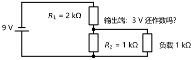
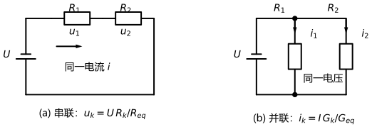
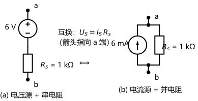
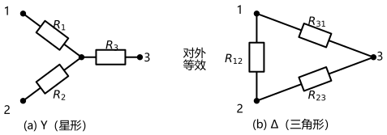
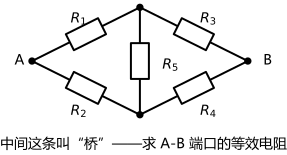
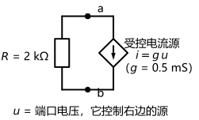

# 第 03 讲：等效变换

> **前置**：第 01、02 讲（参考方向、功率符号约定；元件伏安关系、KCL/KVL、解电路五步流程）。
> **预计时间**：约 3 小时（含作业）。
>
> **一句话定位**：第 02 讲把电路"看全"了；这一讲开始"动手化简"——串并联、分压分流、Y-Δ、电源的两种模型互换，全都围绕一个精确的词：**"对外等效"**。顺手把 02 讲留的两个问题（带载的分压器、电池的两种画法）当场结清。
>
> **本讲回答什么**：
>
> 1. "等效"到底是对谁等效？两个电路能叫"完全一样"吗？
> 2. 带载的分压器、两种画法的电池——那两个问题怎么结？
> 3. Y-Δ 的公式怎么用？什么时候该想起它？
> 4. 理想源能随意串并联吗？含受控源时还能"想并就并"吗？
>
> **这一讲有真实验证**：引子带载全解与串并联、分压分流公式核对（脚本 `scripts/lec03-01_verify_series_parallel.py`）；电源模型互换的端口伏安扫描与内部功率对比（脚本 `scripts/lec03-02_verify_source_transform.py`）；Y-Δ 双向核对、桥式化简与含受控源单口（脚本 `scripts/lec03-03_verify_wye_delta.py`）。

---

## 引子：接上负载之后

第 02 讲的分压器（9 V 电池 + 2 kΩ + 1 kΩ 串联）空载时输出 3 V，结尾留了一句"接上负载会变"。现在就把负载接上：**输出端挂一只 1 kΩ 电阻**（图 1），它还剩多少伏？

> **图 1 怎么读**：左边 9 V 电池；右上是 $R_1 = 2\,\mathrm{k\Omega}$、右下是 $R_2 = 1\,\mathrm{k\Omega}$——就是 02 讲那张图，只是在输出端（两电阻之间的结点）多引出一条支路，接了"负载 1 kΩ"。负载一接，原来"只连着两条支路、可以并掉"的结点，正式升级成三支路结点——电路结构变了，输出不再是 3 V 了。

要算"带载后还剩多少"，你不需要任何新定律——KCL、KVL、欧姆定律全都够用——你需要的是一套**化简方法**：把纠缠在一起的元件一步步换成更简单的样子，直到只剩"一步除法"。这门方法叫**等效变换**。而它有一个前提必须先讲清楚："等效"到底是什么意思？

（顺带，第 02 讲还有第二个尾巴：那只"6 V + 1 kΩ 内阻"的实际电池，为什么能换一种画法、换完还算得一样——§2 收。）

---

## 1. "对外等效"与串并联

### 1.1 "等效"的精确含义：对外等效

先给定义，再拆三层：

> **对外等效**：两个**单口网络**（只留两个端子对外说话的一块电路），如果对同一对端子呈现出**完全相同的伏安关系**（$u$-$i$ 关系），就说这两个网络对这对端子**对外等效**。

三个关键层次：

1. **"等效"永远是对某两个端子说的**——所以做任何等效前，先把端口圈出来。以后看到"求等效电阻""化简这个电路"，第一件事就是问：对哪两个端子？
2. **等效 ≠ 相同**。只要端口上的 $u$-$i$ 关系一致，内部可以完全不同：元件个数可以变、内部电流可以不同、内部功率损耗甚至可以差好几倍。§2.2 会给你一组实测数字，把"内部差异"具体化。
3. **因此有一条铁律**：要问"原来某只元件上的电压/电流/功率是多少"，必须**回到原电路**去算——等效网络在这些点上不承诺任何东西。

还有一个好用的性质：**等效可以链式进行**——先对某对端子把甲换成乙，乙再换成丙……每一步都只保证"对端口等效"，串起来整条链照样对外等效。本讲从头到尾都在做这件事，你不需要每换一步就重新论证一次。

（边界一句话：这门课处理的是线性元件的等效；非线性元件是另一套图景，不在本课程射程内。）

### 1.2 串联：一个电流，分电压

**识别**：几只元件首尾相接串成一条路，穿过的是**同一股电流**——串联。

**等效公式**：串联总电阻直接相加：

$$
R_{eq} = R_1 + R_2 + \cdots + R_n
$$

道理一行就够：同一股电流 $i$ 流过每一只，总电压 = 各电压之和 = $i(R_1 + \cdots + R_n)$，所以从端口看就是一只 $R_{eq}$ 的电阻。

**分压公式（标准列法，模板）**——串联里"每只元件各拿多少电压"，是这门课最常用的公式之一：

1. **确认**这段路是串联（同一电流、没有分岔）；
2. **算总阻** $R_{eq} = \sum R_k$；
3. **按阻值比分**——想求哪只元件的电压，就让它在分子上：

$$
u_k = U \cdot \frac{R_k}{R_{eq}}
$$

（$U$ 是这段串联路径**两端的总电压**。）人话版：电流一样，阻值大的"分"到的电压多。

**照模板填一遍**：9 V 电池分压器（空载，即 02 讲的电路）：

$$
u_2 = 9 \times \frac{1000}{2000 + 1000} = 3\,\mathrm{V}
$$

（与 02 讲直接联立的答案一字不差——脚本核对差为 0。）**怎么用**：分压公式只在"这段确实串联"时成立；一旦这段路上有旁路往外接（比如带载的分压器），直接套就错——§1.4 有现场案例。

### 1.3 并联：一个电压，分电流

**识别**：几只元件接在**同一对结点**之间——两端电压相同，并联。

**等效公式**：并联是"导纳相加"。记住导纳 $G = 1/R$（单位西门子，S），并联就是：

$$
G_{eq} = G_1 + G_2 + \cdots \quad \Longleftrightarrow \quad \frac{1}{R_{eq}} = \frac{1}{R_1} + \frac{1}{R_2} + \cdots
$$

两只电阻的特例最常用——**"积除和"**：

$$
R_{eq} = \frac{R_1 R_2}{R_1 + R_2}
$$

**分流公式（对偶模板）**——与分压完全镜像：

1. **确认**几只元件接在同一对结点上（同一电压）；
2. **算总导纳** $G_{eq} = \sum G_k$；
3. **按导纳比分**——想求哪条支路的电流，就让它的导纳在分子上：

$$
i_k = I \cdot \frac{G_k}{G_{eq}}
$$

两电阻特例写开更顺口：$i_1 = I \cdot \dfrac{R_2}{R_1 + R_2}$——**"分流看对面"**：想求支路 1 的电流，分子上放**对面**那只电阻的阻值（阻值大的那条路，分走的电流反而小）。

**照模板填一遍**（脚本实测）：6 mA 电流源并联 2 kΩ ∥ 3 kΩ：

$$
i_{2k} = 6 \times \frac{3}{2+3} = 3.6\,\mathrm{mA}, \qquad i_{3k} = 6 \times \frac{2}{5} = 2.4\,\mathrm{mA}
$$

核对：两只电阻上的电压都是 $3.6 \times 2000 = 2.4 \times 3000 = 7.2\,\mathrm{V}$（并联必须相等，差 $10^{-16}$ 量级）。

**串联与并联的对偶清单**（一条记忆挂两个公式）：

|          | 串联                                                              | 并联                                     |
| -------- | ----------------------------------------------------------------- | ---------------------------------------- |
| 共同的量 | 电流相同                                                          | 电压相同                                 |
| 等效     | $R_{eq} = \sum R_k$                                             | $G_{eq} = \sum G_k$（即 $1/R$ 相加） |
| 分配     | 分压：$u_k = U\,R_k / R_{eq}$ | 分流：$i_k = I\,G_k / G_{eq}$ |                                          |
| 直觉     | 阻值大的分压多                                                    | 阻值小的分流多（导纳大的分得多）         |

> **图 2 怎么读**：左图 (a) 串联——两只电阻串在一条路上，穿过"同一电流 $i$"，电压按阻值比分（$u_1$、$u_2$ 的标注位置就是各自的"分得量"）；右图 (b) 并联——两只电阻接在同一对结点之间，两端是"同一电压 $u$"，电流按导纳比分（$i_1$、$i_2$ 箭头）。两图的公式互为对偶：串换成并、"R 比"换成"G 比"，公式形状一模一样。

### 1.4 混联化简：由内向外，逐步合并（模板）

真实电路大多是串并混合。"一步一合并"是标准动作：

1. **找最内层**：从离端口最远的地方开始，找出"能一眼看出的纯串联或纯并联组合"；
2. **合并替换**：把它换成一只等效电阻，图上划掉、替换；
3. **重复**：回到第 1 步，直到端口之间只剩一个电阻；
4. **往回读**：需要各层内部的电流电压时，再从最外层往里逐层展开算。

**引子复算**——把图 1 从头化到尾（数字全部来自脚本 `scripts/lec03-01_verify_series_parallel.py` 实测）：

**① 最内层并联**：$R_2$ 与负载接在同一对结点上（输出结点与电池负极）：

$$
R_2 \parallel R_L = \frac{1 \times 1}{1 + 1} = 0.5\,\mathrm{k\Omega}
$$

**② 与 $R_1$ 串联**：总阻 $= 2 + 0.5 = 2.5\,\mathrm{k\Omega}$。

**③ 求总电流**（串联电流处处相同）：$i = \dfrac{9}{2500} = 3.6\,\mathrm{mA}$。

**④ 回到输出结点**：输出端电压 = 并联体的电压 $= 0.5\,\mathrm{k\Omega} \times 3.6\,\mathrm{mA} = \mathbf{1.8\,V}$。

**⑤ 验算**：功率平衡——源发出 $32.40\,\mathrm{mW}$；吸收 $25.92$（$R_1$）$+ 3.24$（$R_2$）$+ 3.24$（负载）$= 32.40\,\mathrm{mW}$（残差 $10^{-16}$ 量级）。再用一条**直接结点方程**交叉核对（对输出结点列 KCL）：

$$
V\left(\frac{1}{2\,\mathrm{k}} + \frac{1}{1\,\mathrm{k}} + \frac{1}{1\,\mathrm{k}}\right) = \frac{9}{2\,\mathrm{k}} \;\Rightarrow\; V = 1.80\,\mathrm{V}
$$

与化简法差 $10^{-16}$ 量级——**化简不是近似，是精确的等价**。

**结论**：空载 3 V → 带载 **1.8 V**。"负载把分压器拽低"第一次定量兑现。（第 07 讲还会给一个更省事的视角；今天先把"手算化简"这条基本功练稳。）

> **态度表（对外等效与串并联部分）**
>
> | 内容                       | 态度                                                         |
> | -------------------------- | ------------------------------------------------------------ |
> | "对外等效"的定义与三条纪律 | **能复述**（对哪对端子 / 等效≠相同 / 内部量回原电路） |
> | 串联/并联识别与等效公式    | **焊成直觉**（一眼分辨、随手合并）                     |
> | 分压、分流公式             | **能默写 + 会照模板填数**；会背"分流看对面"            |
> | 混联化简流程               | **能默写四步、闭眼执行**（由内向外）                   |
> | 引子全解（1.8 V）          | **能独立复现**（含功率验证与结点方程核对）             |
>
---

## 2. 电源的两种模型与互换

### 2.1 同一只电源的两种画法

第 02 讲说过：实际电池 = 理想电压源 $U_S$ 串一只内阻 $R_s$。现在补上它的第二种画法——**理想电流源 $I_S$ 并一只电阻 $R_s$**。两种画法对外完全等效，参数按一行公式换算：

$$
U_S = I_S \cdot R_s \qquad (R_s \text{ 在两种画法里是同一只电阻})
$$

**标准列法（模板）**：

1. **认结构**：确认手里是"源 + 电阻"的两端子结构；
2. **换数值**：两个方向共用一个式子 $U_S = I_S R_s$（$6\,\mathrm{V}$ 串 $1\,\mathrm{k\Omega}$ $\Longleftrightarrow$ $6\,\mathrm{mA}$ 并 $1\,\mathrm{k\Omega}$）；
3. **定方向**——本模板最容易忘的一步：**电流源的箭头，指向原电压源"+"端所在的那一端**（也就是"电流被从 + 端推出去"的方向）。

> **图 3 怎么读**：(a) 电压源模型：从 a 端出发，串一只 $6\,\mathrm{V}$ 源（"+"朝 a）再串 $1\,\mathrm{k\Omega}$ 到 b——电流从"+"端推出，经外电路回到 b。(b) 电流源模型：$6\,\mathrm{mA}$ 源与 $1\,\mathrm{k\Omega}$ **并联**在 a、b 之间，箭头指向 a 端——同样的"往外推"。互换公式居中，方向纪律写在旁边。以后做互换，先画箭头、再填数。

### 2.2 凭什么说"等效"：端口伏安实测 + 回答 02 的问题

**第一件事：拿数据说话。** 把两种模型都当成"接任意外部电路之前的电源"，扫描端口电压 $u$，看它们对外给出的电流 $i$ 是否处处相同（脚本实测）：

| 端口电压$u$    | −3 V    | 0 V      | 3 V      | 4.5 V    | 6 V      | 9 V        |
| ---------------- | -------- | -------- | -------- | -------- | -------- | ---------- |
| V 模型给出的电流 | 9.000 mA | 6.000 mA | 3.000 mA | 1.500 mA | 0.000 mA | −3.000 mA |
| I 模型给出的电流 | 9.000 mA | 6.000 mA | 3.000 mA | 1.500 mA | 0.000 mA | −3.000 mA |

每一格都相等（全扫描最大差 $10^{-15}\,\mathrm{mA}$ 量级）——这就叫"端口伏安关系完全相同"，也就是对外等效的定义。

**第二件事：回答 02 讲的问题。** 02 讲那只"6 V + 1 kΩ 内阻"的电池带 3 kΩ 负载，当时用电压源模型算得端电压 4.5 V。现在换成电流源模型重走一遍：

$$
u = 6\,\mathrm{mA} \times (1\,\mathrm{k\Omega} \parallel 3\,\mathrm{k\Omega}) = 6 \times 0.75 = 4.5\,\mathrm{V}
$$

负载电流 $4.5/3\,\mathrm{k} = 1.5\,\mathrm{mA}$——与 02 讲的答案一字不差。"两种画法互换"这件事，算清了。

**第三件事：把"等效 ≠ 相同"钉在数字上**（脚本实测的内部对比）：

|        | 源出力   | 内阻损耗 | 负载拿到 |
| ------ | -------- | -------- | -------- |
| V 模型 | 9.00 mW  | 2.25 mW  | 6.75 mW  |
| I 模型 | 27.00 mW | 20.25 mW | 6.75 mW  |

负载拿到的分毫不差；内部的源出力与损耗却差了近 9 倍（I 模型里那只 $R_s$ 上流过的电流大得多）。两个模型"对外等效"，但"内脏"完全不同——所以凡是要问"内部某处怎么算"（比如"这只电阻实际耗多少功率"），必须回到原电路。这就是 §1.1 那条铁律的现场证据。

### 2.3 互换的用法：把含源支路"变成同款"再合并

互换最大的用处是**给合并铺路**：把不同画法的含源支路统一成同款，然后像串并联一样合并。一个实测例子——"6 V 串 1 kΩ"与"3 mA 并 1 kΩ"两条支路并联：

1. 前者换成同款：$6\,\mathrm{V}$ 串 $1\,\mathrm{k\Omega}$ $\Rightarrow$ $6\,\mathrm{mA}$ 并 $1\,\mathrm{k\Omega}$；
2. 两个电流源并联：电流相加 $6 + 3 = 9\,\mathrm{mA}$；
3. 两只电阻并联：$1\,\mathrm{k\Omega} \parallel 1\,\mathrm{k\Omega} = 0.5\,\mathrm{k\Omega}$；
4. 换回电压源画法：$9\,\mathrm{mA} \times 0.5\,\mathrm{k\Omega} = 4.5\,\mathrm{V}$，即"$4.5\,\mathrm{V}$ 串 $0.5\,\mathrm{k\Omega}$"。

核对（脚本实测）：在 $u = 0,\ 1,\ 4.5,\ 9\,\mathrm{V}$ 四个点上，"逐支路求和"与"合并模型"给出的电流完全相同（最大差 $10^{-15}\,\mathrm{mA}$ 量级）。一句话：**互换不是目的，"变成同款、再合并"才是。**

### 2.4 禁区：理想源不能乱并、乱串

带着"等效"的手感，很容易产生一个想当然：**"电源嘛，并一并串一串总可以吧？"**——不行。两个禁区：

- **两个理想电压源不能直接并联**。不等值时：同一对端子被要求同时维持两个不同的电压——直接和 KVL 打架（绕着两源走一圈，电压差不归零）。相等时理论上可以，但没有意义（等于一只），现实中还危险：真实器件总有微小差异，差电压会在极小内阻上逼出巨大环流。
- **两个理想电流源不能直接串联**。同理：同一股电流被要求同时等于两个不同的值——和 KCL 打架。

合法的组合记住两条：**理想电压源可以串联**（总电压 = 各电压的代数和）；**理想电流源可以并联**（总电流 = 各电流的代数和）。带内阻的实际源不用背例外——互换之后就是普通串并联（§2.3 演示的就是两支路并联的合并）。

判断通则只有一句：**把每个器件对端口的"要求"摆在一起，看它们打不打架**。打架的，就是禁区。

> **态度表（电源模型部分）**
>
> | 内容                                | 态度                                        |
> | ----------------------------------- | ------------------------------------------- |
> | 两种模型与互换公式$U_S = I_S R_s$ | **能默写 + 方向不犯错**               |
> | 端口伏安扫描与"内部对比"          | **能复述要点**（对外相同 / 内部不同） |
> | "变同款再合并"的用法                | 会做小型组合（§2.3 那四步）                |
> | 两类禁区与判断通则                  | **能说出"为什么打架"**                |
>
---

## 3. Y-Δ 变换：桥式电路的解法

### 3.1 什么时候想起 Y-Δ：桥式电路

串并联能收拾的电路其实**很有限**——只要结构里出现"两不沾"的形状，眼力就失效了。最经典的一种叫**桥式电路**：四个连接点围成一圈、五只电阻（四条边加一条横跨中间的"对角线"），端口取在左右两侧的点上（就是图 5 的样子）。

对着桥求"两端看进去的等效电阻"，你会立刻卡住：想串联？每条路都通到中间，不存在"一串到底"；想并联？没有哪两只电阻共用同一对结点。串并联的方法在这里整体失效。

这时该从工具箱里掏出的，是专治"三个端子、两两互联"结构的 **Y-Δ 变换**。

### 3.2 Y-Δ 变换：三个端子上的两种接法

三个端子上的电阻有两种摆法：

- **Y（星形）**：三只电阻从同一个中心点分别接到三个端子——像三叉星；
- **Δ（三角形）**：三只电阻两两接在端子之间——三角形三条边。

> **图 4 怎么读**：两图端子编号相同（1、2、3）。左图 Y：三条"星臂" $R_1$、$R_2$、$R_3$ 从中心分别接到 1、2、3；右图 Δ：三条"边" $R_{12}$、$R_{23}$、$R_{31}$ 两两接在端子之间。**对这三个端子而言两种接法可以互相等效**——换完以后，电路往往就从"串并失效"变成"纯串并联"。

两套公式（标准形态，直接用）：

**Δ 换 Y**——星臂 = **夹着该结点的两条 Δ 边之积，除以三条边之和**：

$$
R_1 = \frac{R_{12}\,R_{31}}{R_{12}+R_{23}+R_{31}}, \qquad R_2 = \frac{R_{12}\,R_{23}}{\sum}, \qquad R_3 = \frac{R_{23}\,R_{31}}{\sum}
$$

（$\sum = R_{12}+R_{23}+R_{31}$；看脚标规律：$R_1$ 的分子是"碰到 1 端"的那两条边。）

**Y 换 Δ**——Δ 边 = **两两乘积之和，除以对面那条星臂**：

$$
R_{12} = \frac{R_1 R_2 + R_2 R_3 + R_3 R_1}{R_3} = R_1 + R_2 + \frac{R_1 R_2}{R_3}
$$

**对称情形**（三条边相等、或三条臂相等）是考试和工程里最常见的格子，单独记一条：**$R_\Delta = 3\,R_Y$**（对称时，三角形每条边是星形每条臂的 3 倍）。

**两道例行检验**（防记反、防笔误——脚本对多组参数逐对端口验证过）：

1. **对称校验**：取三边相等的例子，代公式应该恰好得到 $R_Y = R_\Delta / 3$；
2. **端口抽查**：随便挑一对端子算"端口电阻"——Δ 的 $R_{12} \parallel (R_{23}+R_{31})$ 必须等于 Y 的 $R_1 + R_2$（三条端子对全对才叫等效；实测差为 0；例如非对称组 $(1,2,3)\,\mathrm{k\Omega}$ 换成 $(3.6667,\ 11,\ 5.5)\,\mathrm{k\Omega}$ 后，三对端口全部对上）。

来历一句话（认识即可）：公式不是凭空来的——它要求"两边三对端子之间的端口电阻两两相等"（三个方程解三个未知数）解出来的。本课程不需要背推导，需要的是**会用、会验**。

### 3.3 回到桥：全解

> **图 5 怎么读**：左端点 A、右端点 B 是**端口**。五只电阻：左上臂 $R_1 = 1\,\mathrm{k\Omega}$、左下臂 $R_2 = 2\,\mathrm{k\Omega}$、右上臂 $R_3 = 3\,\mathrm{k\Omega}$、右下臂 $R_4 = 3\,\mathrm{k\Omega}$，中间横跨的那条 $R_5 = 3\,\mathrm{k\Omega}$ 就是"桥"。它不属于任何一串、也不与谁并联——串并联在这里卡住，这正需要 Y-Δ。

求解过程（数字来自脚本 `scripts/lec03-03_verify_wye_delta.py` 实测）：

**① 选三角形**：找出一组"三个端子两两相连"的 Δ——最顺眼的是右侧的"三角形"：结点 C（右上交点）—B（右端）—D（右下交点），三条边是 $R_3$、$R_4$、$R_5$。

**② Δ 换 Y**：三条边都是 $3\,\mathrm{k\Omega}$（对称），所以三条星臂都是 $3/3 = 1\,\mathrm{k\Omega}$：在三角形内部立一个新的中心点 n，从 n 分别接 $1\,\mathrm{k\Omega}$ 到 C、B、D 三个端点。

**③ 电路变成纯串并联**：

- 从 A 到 n 有两条路：$A \to C \to n$ 是 $1+1 = 2\,\mathrm{k\Omega}$，$A \to D \to n$ 是 $2+1 = 3\,\mathrm{k\Omega}$；
- 两条并联：$2 \parallel 3 = \dfrac{2 \times 3}{2+3} = 1.2\,\mathrm{k\Omega}$；
- 再与"n 到 B"的 $1\,\mathrm{k\Omega}$ 串联：

$$
R_{AB} = 1.2 + 1 = \mathbf{2.2\ k\Omega}
$$

**④ 验算**（脚本实算）：给端口加 $11\,\mathrm{V}$ 电源——电流应当是 $11/2.2\,\mathrm{k} = 5\,\mathrm{mA}$；回到**原桥**用两条结点方程核对：$V_C = 8\,\mathrm{V}$、$V_D = 7\,\mathrm{V}$，从 A 流出的两条电流 $3\,\mathrm{mA} + 2\,\mathrm{mA} = 5\,\mathrm{mA}$——一字不差。再扫 $u = 1,\ 2,\ 5,\ 11,\ 20\,\mathrm{V}$ 五个点，原桥与"2.2 kΩ"的端口电流相对差在 $10^{-19}$ 量级——**对外等效，坐实**。

### 3.4 顺带一格技巧：平衡电桥（边界要看清）

桥有一个漂亮的特殊情形：如果**两臂的电阻比例相等**，比如左上/右上 $= 1/2$、左下/右下 $= 2/4$，那么桥的上端电位 $V_C$ 与下端电位 $V_D$ 恰好相等（脚本实测：两点电位差为 0，三点扫描下电流差 $10^{-15}$ 量级）。此时：

- 中支路两端电压为 0、电流也为 0——**把它整个拿掉（开路）**，电路其余部分一动不动；
- 剩下的就是纯串并联：$(1+2) \parallel (2+4) = 3 \parallel 6 = \mathbf{2\ k\Omega}$。

**边界一句话**："拿掉中支路"只在**平衡**（两臂比例相等）时合法。看着"对称""像桥"就拿掉中支路——是错的；不平衡的桥必须老老实实做 Y-Δ（即 §3.3 的内容）。

> **态度表（Y-Δ 部分）**
>
> | 内容                            | 态度                                                                    |
> | ------------------------------- | ----------------------------------------------------------------------- |
> | Y/Δ 两种接法与"什么时候想起它" | **能认图、能判断"串并失效"**                                      |
> | 两组变换公式                    | **能默写**（两句口诀），对称情形 $R_\Delta = 3R_Y$ 必须条件反射 |
> | 两道例行检验                    | **会做**（对称校验 + 端口抽查）                                   |
> | 桥式全解（2.2 kΩ）             | **能独立复现**（含 11 V 验算）                                    |
> | 平衡电桥"拿掉中支路"            | 会用，且能说出**只在平衡时**合法                                  |
>
---

## 4. 含受控源的单口：输入电阻

前面"想并就并"的全套底气，在于电阻和独立源的端口行为都是**确定的**。受控源不一样——**它的值由别处的信号决定**：你不能"看不见它"就把它和相邻电阻并掉。那含受控源的单口怎么化简？先立一个概念：

> **输入电阻**（input resistance）：一个**不含独立源**的单口，如果从端口看进去的伏安关系是一条过原点的直线，这条直线就等效为一只电阻，记 $R_{in} = \dfrac{u}{i}$。

**标准列法（外施激励法，模板）**：

1. **施激励**：在端口加一个测试电压 $u$（或测试电流 $i$）——把它当作已知量；
2. **解关系**：用 KCL/KVL 和各元件伏安关系，解出端口的另一个量（加的是电压就解电流，反之亦然）；
3. **取比值**：$R_{in} = u/i$——如果 $u$ 与 $i$ 成正比（与 $u$ 大小无关），输入电阻存在，比值就是它。

> **图 6 怎么读**：端口 a、b 之间并着两条支路：一只 $2\,\mathrm{k\Omega}$ 电阻，和一个**受控电流源**（菱形）——它的电流 $i = g\,u$，由**端口电压 $u$ 自己**控制（$g = 0.5\,\mathrm{mS}$）。"想并就并"在这里说不出话：受控源不是定值，必须先联立。

**照模板填一遍**（脚本实测）：端口加电压 $u$，对 a 点列 KCL：

$$
i = \frac{u}{2\,\mathrm{k}} + g\,u = (0.5 + 0.5)\times 10^{-3}\,u = \frac{u}{1\,\mathrm{k}}
$$

于是 $R_{in} = u/i = \mathbf{1\,\mathrm{k\Omega}}$。核对（脚本扫描）：$u = 1 \sim 8\,\mathrm{V}$ 时 $i$ 始终等于 $u / 1\,\mathrm{k\Omega}$，偏差为 0。顺带一个反面数字：如果把受控源无视、直接报"2 kΩ"——误差 100%。

**边界一句话**：如果单口里**含独立源**，端口伏安一般是"一条不过原点的直线"——此时等效物是"源 + 电阻"的整体，而不是一只电阻。那是第 07 讲的主戏（戴维南定理）。

> **态度表（含受控源单口部分）**
>
> | 内容                       | 态度                                                 |
> | -------------------------- | ---------------------------------------------------- |
> | "受控源不能想并就并"的原因 | **能说清**（值由别处控制，不是定值）           |
> | 输入电阻的定义             | **能复述**（不含独立源、过原点直线、斜率倒数） |
> | 外施激励法三步             | **能默写、会填数**（复现 1 kΩ）               |
> | 含独立源的边界             | 认识（等效物是"源+电阻"，07 讲展开）                 |
>
---

## 5. 等效的射程：为什么后面还要"机械列方程"

回望这一讲的手感：从头到尾都在"**识别 + 手工变形**"——看出哪段是串、哪段是并、哪块是桥、哪个是"源 + 电阻"，然后一步一步换。小电路上它又快又优雅，但三个局限迟早出现：

- **识别是有负担的**：元件一多，"哪段能合并"本身就成了难题——眼力会先破产；
- **变形没有统一套路**：先并还是先串、换哪个三角形，依赖经验，没有"从图到答案"的固定流程；
- **有时绕远**：如果只想要某一只元件上的量，化简完往往还要"层层还原"。

所以从下一讲开始，补一整套**不挑形状、机械执行**的通用流程：**回路法**（04）与**结点法**（05）——不再依赖"看出来"，而是给电路编上号、按固定格式列方程、交给线性代数。再往后，定理（06、07）会把"对外等效"推到极致：连"源 + 电阻"都不用自己拼，直接量出来。

而本讲的化简方法不会过时：它将是那些方法里最常用的"预处理"——先把电路削小，列方程才不费劲。

---

## 常见误区（本节零新知识，只破误）

> 以下每条只是"对答案 + 校准"，没有新知识——每一句都已在正文系统小节里教过。

1. **"两个电路等效 = 两个电路完全一样"**（§1.1、§2.2）。错。只保证"对外"——端口伏安关系相同；内部电流、损耗都可能完全不同（内阻损耗 2.25 vs 20.25 mW）。
2. **"分压公式见电阻就能套"**（§1.2）。错。它只在"该段确实串联"时成立，且 $U$ 必须是这段路径两端的总电压；带旁路往外接时直接套就错（带载分压器就是反例）。
3. **"分流公式分子放自己的电阻"**（§1.3）。错，是"看对面"：$i_1 = I \cdot R_2/(R_1+R_2)$——自己阻值大，分到的电流反而小。
4. **"理想电压源可以直接并联、理想电流源可以直接串联"**（§2.4）。不行。不等值时直接和 KVL/KCL 打架；相等时无意义且现实中危险。电压源可**串**、电流源可**并**。
5. **"Y-Δ 公式方向记混了也没事"**（§3.2）。有事——但它有自检：先用对称校验（$R_\Delta = 3R_Y$），再抽查一对端口电阻。
6. **"桥式电路看起来对称，中间支路可以拿掉"**（§3.4）。错。只有**平衡**（两臂比例相等、中支路电流为 0）时才合法；不平衡的桥要老老实实做 Y-Δ。
7. **"含受控源的单口当普通电阻并"**（§4）。错。受控源的值随控制量走，必须用外施激励法把 $u$、$i$ 的关系解出来（本例真值 1 kΩ，无视受控源会报错一倍）。

---

## 本讲小结

一页纸的骨架：

- **对外等效**：同一对端子、伏安关系相同。三条纪律——先声明"对哪两个端子"；等效 ≠ 相同；求内部量回原电路。等效可链式进行。
- **串并联（对偶）**：串联同电流、$R_{eq} = \sum R$、分压 $u_k = U R_k/R_{eq}$；并联同电压、$G_{eq} = \sum G$、分流 $i_k = I G_k/G_{eq}$（两电阻："积除和"与"分流看对面"）。
- **混联化简**：由内向外逐步合并，四步流程；引子复算：带载分压器输出 **1.8 V**（空载 3 V）。
- **电源互换**：$U_S = I_S R_s$；方向=电流源箭头指向原"+"端；用途="变同款再合并"；禁区=理想电压源不并、理想电流源不串。电池的两个问题清了：4.5 V 两种算法同答案；内部对比 9=2.25+6.75 vs 27=20.25+6.75。
- **Y-Δ**：两句口诀（"夹着的两条边之积 ÷ 三边之和"；"两两积之和 ÷ 对面"）；对称 $R_\Delta = 3R_Y$；桥式全解 $R_{AB} = 2.2\,\mathrm{k\Omega}$；平衡电桥可拿掉中支路（仅平衡时）。
- **输入电阻**：不含独立源的单口，外施激励法三步求 $R_{in}$（本例 1 kΩ）。

## 掌握度自测

- [ ] 我能给"对外等效"下定义，并说出三条纪律。
- [ ] 我能默写串联/并联等效公式与分压/分流公式，并说出各自的成立条件。
- [ ] 我能按"由内向外"四步化简混联，并独立复现引子的 1.8 V 全解（含功率验证）。
- [ ] 我能完成电源模型互换（数值 + 方向），并复述"等效≠相同"的数字证据（2.25 / 20.25 mW，负载 6.75 mW 相同）。
- [ ] 我能说清两个禁区"为什么打架"，并列出合法组合（电压源可串、电流源可并）。
- [ ] 我能默写 Y-Δ 两个方向的公式，并用对称校验与端口抽查自检。
- [ ] 我能独立复现桥式全解（2.2 kΩ），并解释 11 V 验算里 8 V / 7 V 的来历。
- [ ] 我能说出平衡电桥的条件与"拿掉中支路"的边界；能解释为什么"看着对称"不够。
- [ ] 我能用外施激励法求含受控源单口的输入电阻（复现 1 kΩ），并说明无视受控源会错在哪。
- [ ] 我能复跑 `scripts/lec03-01`、`lec03-02`、`lec03-03`，并解释输出里的每一个数字（1.8 V、3.6 mA、32.4/25.92/3.24 mW、4.5 V、2.25/20.25/6.75 mW、2.2 kΩ、1 kΩ、2 kΩ 等）。

## 作业

> 答案只能用**已教概念**（本讲范围：对外等效定义与三条纪律、串并联等效与分压/分流公式、混联化简流程、电源两种模型与互换（含方向）、理想源并/串禁区、Y-Δ 公式与对称校验、平衡电桥、含受控源单口的输入电阻（外施激励法）；KCL/KVL 与功率平衡承接第 01–02 讲）。先独立做，再对答案。

### 基础

**Q1. 概念辨析**：判断下列说法对不对，并给一句话理由。

(a) "两个电路只要等效，就说明它们内部也一模一样。"
(b) "分压公式里电阻在分子上，所以随便哪只电阻的电压都能拿它方便地乘出来。"
(c) "两个理想电压源直接并联，没有什么问题。"
(d) "含受控源的单口，可以像普通电阻一样直接'并'出输入电阻。"
(e) "桥式电路只要画得对称，中间支路就可以拿掉。"

**参考答案**：

(a) 错。等效只保证"对外"（端口伏安关系相同）；内部电流、损耗可以完全不同（本讲电池两模型：内阻损耗 2.25 vs 20.25 mW，而负载两侧都是 6.75 mW）。
(b) 错。分压公式只在"该段确实串联"时成立，且 $U$ 必须是这段串联路径两端的总电压；有旁路外接时直接套会错（带载分压器 3 V → 1.8 V 就是反例）。
(c) 错。不等值时与 KVL 直接矛盾；相等时无意义而且现实中危险（微小差异会在极小内阻上逼出巨大环流）。
(d) 错。受控源的值由别处的信号决定，不是定值；要用外施激励法解出 $u$-$i$ 关系（本讲例子真值 1 kΩ，无视受控源会报 2 kΩ，偏差 100%）。
(e) 错。只有**平衡**（两臂电阻比例相等、中支路电流为 0）时才合法；不平衡的"对称"桥拿掉中支路会算错。
验算：五小题的公共判据——"这个动作保的是'对外'还是'内脏'？条件是否满足？"

**Q2. 计算·混联与分压分流**：$12\,\mathrm{V}$ 理想电压源串一只 $R_1 = 2\,\mathrm{k\Omega}$，之后接"$R_2 = 6\,\mathrm{k\Omega}$ 与 $R_3 = 3\,\mathrm{k\Omega}$ 并联"的一段。求：总电流、并联段电压、两支路电流，并做功率验证。

**参考答案**：

并联段等效：$6 \parallel 3 = \dfrac{6 \times 3}{6+3} = 2\,\mathrm{k\Omega}$；总阻 $2 + 2 = 4\,\mathrm{k\Omega}$。
总电流 $i = 12/4000 = 3\,\mathrm{mA}$；并联段电压 $= 2\,\mathrm{k\Omega} \times 3\,\mathrm{mA} = 6\,\mathrm{V}$（与分压公式核对：$u = 12 \times \frac{2}{2+2} = 6\,\mathrm{V}$ ✓）。
分流：并联段自己收到的总电流是 $3\,\mathrm{mA}$——用"分流看对面"：$i_2 = 3 \times \dfrac{3}{6+3} = 1\,\mathrm{mA}$（分子放对面的 $R_3$），$i_3 = 3 \times \dfrac{6}{6+3} = 2\,\mathrm{mA}$。
验算：$i_2 R_2 = 1 \times 6 = 6\,\mathrm{V}$ ✓，$i_3 R_3 = 2 \times 3 = 6\,\mathrm{V}$ ✓（并联等压）。
功率验证：源发出 $12 \times 3 = 36\,\mathrm{mW}$；$R_1$ 吸收 $3^2 \times 2 = 18\,\mathrm{mW}$；$R_2$ 吸收 $1^2 \times 6 = 6\,\mathrm{mW}$；$R_3$ 吸收 $2^2 \times 3 = 12\,\mathrm{mW}$；$18+6+12 = 36$ ✓。

**Q3. 计算·电源互换**：一只"$10\,\mathrm{V}$ 理想源串 $2\,\mathrm{k\Omega}$"的实际电源。(1) 写出它的电流源模型；(2) 接上 $3\,\mathrm{k\Omega}$ 负载，用电流源模型求负载电压，并和电压源模型的结果对照。

**参考答案**：

(1) $I_S = U_S / R_s = 10/2000 = 5\,\mathrm{mA}$，"$5\,\mathrm{mA}$ 电流源并 $2\,\mathrm{k\Omega}$"（箭头指向原"+"端）。
(2) 电流源模型：$5\,\mathrm{mA}$ 灌进 $2\,\mathrm{k\Omega} \parallel 3\,\mathrm{k\Omega} = 1.2\,\mathrm{k\Omega}$ → $u = 5 \times 1.2 = 6\,\mathrm{V}$。
电压源模型对照：$u = 10 \times \dfrac{3}{2+3} = 6\,\mathrm{V}$ ✓（分压公式直接核对）。
验算：负载电流 $6/3\,\mathrm{k} = 2\,\mathrm{mA}$；两种模型下端口都是 $6\,\mathrm{V}, 2\,\mathrm{mA}$ ✓。

### 提高

**Q4. 计算·Y-Δ 双向**：(1) 把 $\Delta(3\,\mathrm{k\Omega}, 3\,\mathrm{k\Omega}, 3\,\mathrm{k\Omega})$ 换成 Y；(2) 把 $Y(1\,\mathrm{k\Omega}, 1\,\mathrm{k\Omega}, 2\,\mathrm{k\Omega})$ 换成 Δ；(3) 对 (2) 的结果做一次端口抽查。

**参考答案**：

(1) 对称情形：三臂均为 $3/3 = 1\,\mathrm{k\Omega}$。
(2) 两两积之和：$1 \times 1 + 1 \times 2 + 2 \times 1 = 5$（单位 $\mathrm{k\Omega^2}$）；
$R_{12} = 5/2 = 2.5\,\mathrm{k\Omega}$（除以"对面"即 $R_3 = 2\,\mathrm{k\Omega}$）；$R_{23} = 5/1 = 5\,\mathrm{k\Omega}$；$R_{31} = 5/1 = 5\,\mathrm{k\Omega}$。
(3) 端口 1-2 抽查：Y 侧 $R_1 + R_2 = 2\,\mathrm{k\Omega}$；Δ 侧 $R_{12} \parallel (R_{23}+R_{31}) = 2.5 \parallel 10 = \dfrac{2.5 \times 10}{12.5} = 2\,\mathrm{k\Omega}$ ✓。
验算：再用对称情形核对公式方向：$\Delta(3,3,3) \to Y(1,1,1)$ 满足 $R_\Delta = 3R_Y$ ✓。

**Q5. 计算·桥式化简（放大的引例）**：桥式电路五只电阻：左上 $2\,\mathrm{k\Omega}$、左下 $4\,\mathrm{k\Omega}$、右上、右下、桥各 $6\,\mathrm{k\Omega}$。求端口 A-B 的等效电阻。

**参考答案**：

右侧三角形（右上、右下、桥，三条边都是 $6\,\mathrm{k\Omega}$）换成 Y：三臂都是 $6/3 = 2\,\mathrm{k\Omega}$。
从 A 到中心 n 两条路：$2+2 = 4\,\mathrm{k\Omega}$ 与 $4+2 = 6\,\mathrm{k\Omega}$，并联 $4 \parallel 6 = \dfrac{4 \times 6}{10} = 2.4\,\mathrm{k\Omega}$；再与"n 到 B"的 $2\,\mathrm{k\Omega}$ 串联：$R_{AB} = 2.4 + 2 = \mathbf{4.4\,\mathrm{k\Omega}}$。
验算：全程与 §3.3 的引例同型（本例是把它整体放大 2 倍），方法复演一遍即是最强检验。

**Q6. 计算·输入电阻**：单口内：$4\,\mathrm{k\Omega}$ 电阻与一只 VCCS（$g = 0.25\,\mathrm{mS}$，由端口电压控制）并联。求输入电阻。

**参考答案**：

外施激励法：端口加 $u$，a 点 KCL：$i = \dfrac{u}{4\,\mathrm{k}} + g\,u = (0.25 + 0.25) \times 10^{-3}\,u = \dfrac{u}{2\,\mathrm{k}}$ → $R_{in} = \mathbf{2\,\mathrm{k\Omega}}$。
验算：$u$ 与 $i$ 成正比（与 $u$ 无关），输入电阻存在；对照"无视受控源"会报 4 kΩ。

### 综合（回扣本讲主任务）

**Q7. 综合·带载的分压器（变奏）**：$12\,\mathrm{V}$ 电源 + $2\,\mathrm{k\Omega}$ 与 $2\,\mathrm{k\Omega}$ 串联的分压器，输出端接 $2\,\mathrm{k\Omega}$ 负载。

(1) 空载输出多少？(2) 带载后输出多少？(3) 做功率验证。

**参考答案**：

(1) 空载：$u = 12 \times \dfrac{2}{2+2} = 6\,\mathrm{V}$。
(2) 带载：$R_2 \parallel R_L = 2 \parallel 2 = 1\,\mathrm{k\Omega}$；总阻 $2 + 1 = 3\,\mathrm{k\Omega}$；$i = 12/3000 = 4\,\mathrm{mA}$；输出 $= 1\,\mathrm{k\Omega} \times 4\,\mathrm{mA} = \mathbf{4\,\mathrm{V}}$（被负载从 6 V 拽到 4 V）。
(3) 源发出 $12 \times 4 = 48\,\mathrm{mW}$；$R_1$ 吸收 $4^2 \times 2 = 32\,\mathrm{mW}$；$R_2$ 吸收 $4^2/2 = 8\,\mathrm{mW}$；负载 $8\,\mathrm{mW}$；$32 + 8 + 8 = 48$ ✓。
验算：与引子（9 V 版，3 V → 1.8 V）同型——先并联、再串联、再功率验证 ✓。

**Q8. 开放简答·"对外等效"与"等效≠相同"**：用本讲的两个电源模型的四个数字（负载 6.75 mW 相同；内阻损耗 2.25 vs 20.25 mW；源出力 9 vs 27 mW）解释：为什么"求内部量必须回原电路"？

**参考答案**：

"等效"的定义只约束**端口**：两个网络对同一对端子给出完全相同的 $u$-$i$ 关系（本讲扫描已验证到 $10^{-15}$ 量级），此后再接什么外部电路，对外行为都一样、负载拿到的功率也完全一样（都是 6.75 mW）。但定义对**内部**没有任何承诺——两个网络的元件构成不同，内部电流分配不同，于是源出力（9 vs 27 mW）与内阻损耗（2.25 vs 20.25 mW）可以差近 9 倍。所以凡是要算"某只具体元件上的电压/电流/功率"（内部量），都必须回到原电路——等效网络在这些点上会给出错误答案。

---

*下一讲预告：第 04 讲《支路电流法与回路电流法》——本讲的"化简"靠眼力识别；下一讲开始补一块"不挑形状"的板子：给电路编上号、机械地列方程、交给线性代数。第 02 讲见过的"2b 方程"计数，下一讲正式兑现。*
