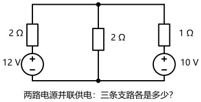
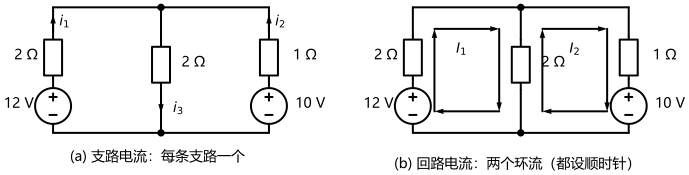
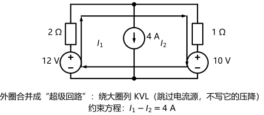
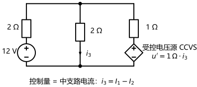

# 第 04 讲：支路电流法与回路电流法

> **前置**：第 01–03 讲（参考方向与功率符号约定；元件伏安关系与 KCL/KVL；等效变换）。
> **预计时间**：约 3 小时（含作业）。
>
> **一句话定位**：第 03 讲解电路靠"眼力识别 + 手工变形"——看得出来的电路很快，看不出来的就卡住。从这一讲起换路线：**给电路编上号、机械地列方程、交给线性代数**。第 02 讲留下的"独立方程数"问题，本讲正式兑现——支路电流法（把 b 个支路电流全摆上桌）与回路电流法（环流减元）就是同一套约束的两种粒度。
>
> **本讲回答什么**：
> 1. 面对一张电路图，到底该列几个方程？怎么下手？
> 2. 支路电流法为什么方程多？KCL 只要 $n-1$ 个——多列的行不行？
> 3. 回路电流是"绕着圈流的假电流"——假的凭什么能算出真答案？
> 4. 独立回路怎么选才不出错？方程里冒出电流源、受控源，回路法还照样转吗？
>
> **这一讲有真实验证**：引子电路（两路电源并联供电）的支路法与回路法两条路线全解与功率验证；"外圈方程 = 两网孔方程之和"的独立性实测与系数矩阵秩（脚本 `scripts/lec04-01_verify_branch_mesh.py`）；含受控源、含电流源变体的四类处理（脚本 `scripts/lec04-02_verify_special_branches.py`）。

## 本讲怎么走（脉络图）

```
引子：两路电源并联供电——三条支路各是多少？（化简能走，但换条"不挑形状"的路线）
  │
  ├─ 1. 先数清楚：未知量与独立方程（2b → b → b−n+1 的阶梯）
  ├─ 2. 支路电流法：把 b 个支路电流全摆上桌（模板 + 全解）
  ├─ 3. 回路电流法：环流减元（含义、独立回路、标准方程观察法）
  ├─ 4. 特殊支路：电流源三招、受控源三步
  └─ 5. 方法选择初窥 → 常见误区 → 本讲小结 → 掌握度自测 → 作业
```

> 下一站：§引子。先接一个带点工程味的活儿——两路电源并联供电。

---

## 引子：两路电源并联供电

工程里常见的接线：**两个电源并联，共同给一个负载供电**——充电电池组并联、双路冗余供电、多路电源模块并联都是这个形状。照图 1 接线：左路是"12 V 理想源串 2 Ω"，右路是"10 V 理想源串 1 Ω"，中支路是 2 Ω 的负载。



> **图 1 怎么读**：左、右两条支路各含一个电压源（圆圈，"+"在上）和一只串联电阻——正是第 03 讲"实际电源 = 理想源 + 内阻"的标准画法；中间竖着的 2 Ω 是负载。上、下两个结点各是"三支路交汇"，是正式的结点。任务：**三条支路各流多少电流？负载上电压多少？**

**先用 03 的方法试一把**（脚本实测，四步）——左路互换为"6 A 并 2 Ω"、右路互换为"10 A 并 1 Ω"，与负载并联：

$$i_{\text{合}} = 6+10 = 16\,\mathrm{A}, \qquad R_{\text{合}} = 2 \parallel 1 \parallel 2 = 0.5\,\Omega$$
$$V = 16 \times 0.5 = 8\,\mathrm{V} \;\Rightarrow\; i_1 = \frac{12-8}{2} = 2\,\mathrm{A},\quad i_2 = \frac{10-8}{1} = 2\,\mathrm{A},\quad i_3 = \frac{8}{2} = 4\,\mathrm{A}$$

四步拿下，很漂亮。但请注意两件事：

1. 这条捷径的**前提是"你看得出怎么变"**——电路稍一换装（拓扑怪一点、元件多一点），"识别 + 变形"的手感就说断就断；
2. 它其实一直偷偷绕过了一个问题：**"一张电路图到底该列几个方程？凭什么恰好够？"**——第 02 讲数的"两类约束"到此还只有结论、没有兑现。

本讲把"不挑形状"的机械路线立起来，顺便把这个疑问还清。第一条路线，就从最朴素的想法开始。

---

## 1. 先数清楚：未知量与独立方程

### 1.1 三个数：n、b 与两个计数公式

先复习图上的三个词汇（第 02 讲立过，这里按"这讲要用的口径"复述一遍）：

- **结点**（node）：三条或以上支路交汇的点（只连两条支路的连接点按惯例"并掉"，不算正式结点）；
- **支路**（branch）：两个结点之间、一路串联没有分岔的一段路；
- **回路**（loop）：沿支路走一圈回到出发点的路径。

一张电路画完，两个整数就确定了：结点数 $n$、支路数 $b$。它们决定了全部"计数"：

| 量 | 计数 | 说明 |
|---|---|---|
| 独立 KCL 方程 | $n-1$ | 每个结点列 KCL，但只有 $n-1$ 条是独立的 |
| 独立 KVL 方程 | $b-n+1$ | 每选一个"带来新支路"的回路，就能多列一条独立的 |
| 回路电流法未知量 | $b-n+1$ | 与独立 KVL 数相同（下面 §3 看为什么） |

**引子电路点一遍**：结点 $n = 2$（上、下），支路 $b = 3$（左、中、右）。独立 KCL 一条；独立 KVL 两条（左窗口、右窗口）；支路电流法列 3 个方程，回路电流法只需 2 个。

### 1.2 为什么 KCL 恰好 $n-1$ 条：一个"对消"的说明

为什么不是 $n$ 条、也不是更多？给一个人话版说明——**把前 $n-1$ 个结点的 KCL 相加**：

- 每一条"两头都在这 $n-1$ 个结点里"的支路，它的电流在一正一负两处出现，**两两对消**；
- 加完剩下的，全是"从第 $n$ 个结点连进这一堆"的支路电流——它们的和恰好是第 $n$ 个结点 KCL 的相反数。

也就是说：**第 $n$ 个结点的 KCL 是前 $n-1$ 条的"推论"，写出来也是白写**。所以独立方程恰好 $n-1$ 条——这就是"多列不犯错，但多列的方程不干活"的精确含义。

### 1.3 为什么 KVL 恰好 $b-n+1$ 条：数"新支路"

KVL 的计数一句话：**每多选一个回路，至少要踩到一条此前没踩过的支路；一条支路只能供一个新回路**。把新支路"用光"为止（总共有 $b$ 条支路，其中 $n-1$ 条被"连通树"用掉——细节不展开，记住口径），恰好能凑出 $b-n+1$ 个独立回路。对**平面电路**有个立刻可用的捷径：**独立回路 = 网孔**（把电路看成"几个网孔"，一个网孔一个）——引子电路一眼两个网孔，所以独立 KVL 就是两条。

**实测一个反面例子**（脚本）：两网孔之外再选"外圈大回路"多列一条——外圈方程的系数和右边，恰好等于两条网孔方程**相加**：

$$(4,-2)+(-2,3) = (2,1), \qquad 12+(-10) = 2 \;\Rightarrow\; 2I_1 + I_2 = 2$$

这就是"外圈回路"的方程——它不带来任何新信息；系数矩阵的秩是 2（等于未知量个数），说明"多列的方程"是冗余的。**系统化方法的目的是"刚好够"，不是"越多越好"**。

### 1.4 未知量的阶梯：2b → b → b−n+1

现在可以一口气看清整条路线了。同一张电路，方程有"三种颗粒度"：

| 颗粒度 | 未知量 | 方程构成 | 对应方法 |
|---|---|---|---|
| 最细（第 02 讲的原始约束） | $2b$（每条支路的 $u$ 与 $i$） | $b$ 条伏安关系 + $(n-1)$ KCL + $(b-n+1)$ KVL | "列出全部未知量" |
| 中档 | $b$（每条支路的电流） | 伏安关系把 $u$ 用它自己的 $i$ 替换掉 | **支路电流法** |
| 粗档 | $b-n+1$（回路电流） | 支路电流由环流组合出来 | **回路电流法** |

中间一步的替换：伏安关系替换后，未知量从 $2b$ 降为 $b$；方程从"$b+(n-1)+(b-n+1)$"里消掉 $b$ 条伏安关系，剩下 $(n-1)+(b-n+1) = b$ 条——**恰好 $b$ 个方程对应 $b$ 个未知量**。再粗一档（回路法）的合法性与算法，就是 §3 的正题。

> **态度表（计数部分）**
>
> | 内容 | 态度 |
> |---|---|
> | $n$、$b$ 数法（并点惯例） | 会数（对着图点一遍） |
> | 计数公式 $n-1$ 与 $b-n+1$ | **能默写、能解释**（对消论证、新支路论证） |
> | "多列行不行" | 能说出"不独立 = 不干活"（外圈 = 两网孔之和） |
> | 2b → b → b−n+1 阶梯 | **能复述**（每降一档丢什么、得什么） |
>
> 下一站：先从最忠实的颗粒度开刀——把 $b$ 个支路电流全摆上桌。

---

## 2. 支路电流法：把 b 个电流全摆上桌



> **图 2 怎么读**：同一张引子电路，两种标注哲学。(a) 支路电流：每条支路标一个电流（$i_1$、$i_2$ 向上，$i_3$ 向下）——本节用它，三个未知量；(b) 回路电流：每个网孔标一股环流（$I_1$、$I_2$ 都设顺时针）——§3 用它，两个未知量。注意两图的元件、数值完全一样，只是"符号口径"不同。

### 2.1 标准列法（模板）

1. **标方向**：给每条支路电流标参考方向（图 2a）；电压参考极性顺手一并标好；
2. **列 KCL**：选 $n-1$ 个结点，逐个套"流出为正"模板 $\sum(\pm i)=0$；
3. **列 KVL**：选 $b-n+1$ 个独立回路（平面电路就数网孔），沿设定方向绕行，把每个元件电压**当场用伏安关系换掉**——电阻用 $Ri$、电压源用常数、电流源支路特殊（§4 单说）；
4. **联立求解**；
5. **回代验算**（KCL/KVL + 功率平衡）。

### 2.2 引子全解（3 个方程）

**① 标方向**见图 2(a)：$i_1$、$i_2$ 向上，$i_3$ 向下。

**② KCL**（上结点，流出为正）：$i_1 + i_2 - i_3 = 0$。

**③ KVL**（两个网孔，顺时针绕行，伏安关系当场替换）——用"升起来的 = 降下去的"写法：

- 左回路：绕行中电池升 12 V；$2\,\Omega$ 上的 $i_1$ 与 $2\,\Omega$ 上的 $i_3$ 顺着电流方向走过，都是"降"：

$$2 i_1 + 2 i_3 = 12$$

- 右回路：电池升 10 V；同理：

$$i_2 + 2 i_3 = 10$$

**④ 联立求解**：三式联立得

$$i_1 = 2\,\mathrm{A}, \qquad i_2 = 2\,\mathrm{A}, \qquad i_3 = 4\,\mathrm{A}$$

**⑤ 验算**（脚本实测）：KVL 回代残差为 0；功率验证 $44\,\mathrm{W} = 32 + 8 + 4$（两电源发出 $12\times2 + 10\times2 = 44\,\mathrm{W}$；负载 $2\times4^2 = 32\,\mathrm{W}$、左阻 $2\times2^2 = 8\,\mathrm{W}$、右阻 $1\times2^2 = 4\,\mathrm{W}$）✓。负载电压 $= 8\,\mathrm{V}$——与引子里 03 捷径的答案完全一致。

### 2.3 支路电流法的特点

**优点**：最忠实、最无脑——图上有什么就摆什么，不需要"想"。**代价**：方程数 $= b$，是三种颗粒度里最多的；支路一多就累。举个小对比：引子电路 3 个方程还能忍；"田"字网络（$n=5$、$b=8$）就要列 8 个方程，而回路法只需要 4 个（$b-n+1$）——省一半。

> **态度表（支路电流法部分）**
>
> | 内容 | 态度 |
> |---|---|
> | 五步模板 | **能默写、闭眼执行** |
> | KVL 里"伏安关系当场替换" | 焊成直觉（写 KVL 就是写 $i$ 的方程） |
> | 引子全解（2/2/4 A，44 W 功率） | **能独立复现** |
> | 它的特点（直接但方程多） | 能说清，知道什么时候不用它 |
>
> 下一站：既然方程多，就该"减元"——让支路电流不是未知量，而是"少数几个环流的组合"。

---

## 3. 回路电流法：让"环流"替你减元

回到图 2 的 (b) 面板：同一张电路，这次不标三条支路电流，而是在左右两个网孔里各放**一股绕着圈流的电流** $I_1$、$I_2$（都设顺时针）。这种量在图上"哪条支路都没有它单独的身影"——一看就是人造的。它凭什么能用？先回答这个信任问题（这是本讲最核心的一段）。

### 3.1 回路电流：两个"假环流"凭什么算对？

三条事实，一条比一条关键：

**事实一：支路电流 = 环流的组合。** 每条支路要么只属于一个网孔，要么是两个网孔共享：

- 左支路只属于回路 1，而 $I_1$ 顺时针经过它**向上**——所以 $i_1 = I_1$；
- 右支路只属于回路 2，$I_2$ 顺时针经过它**向下**——所以 $i_2 = -I_2$（"向上为正"的标注下）；
- 中支路被两个环流"夹着"：$I_1$ 向下、$I_2$ 向上，净电流（向下）$= I_1 - I_2$。

**事实二：任何一组环流，组装出的支路电流自动满足全部 KCL。** 因为环流在每个结点都是"有进有出"——它在随便哪个结点上的进出电流代数和**自动为零**。这条约束（全电路所有结点的 KCL）从此刻起**永远不用再操心**。

**事实三：于是只剩 KVL 要凑。** 回路个数、环流个数、独立 KVL 条数——三者是一回事，都等于 $b-n+1$：方程数与未知量数恰好相等，系统可解。

"假的凭什么算出真答案"由此有了完整答案：**组装关系是线性的**；解出的环流组装成支路电流后，**KCL 自动满足、KVL 被方程保证、伏安关系在列 KVL 时全部用掉**——全部定律都核对过关。再由 §1 的计数保证"满足全部约束的解唯一"，所以这组支路电流就是唯一真解。**假的是中间变量，"出厂"的是真货。**

（符号读法照旧：$I_2 = -2\,\mathrm{A}$ 不是算错，只表示右网孔的实际环流与"顺时针"相反——与第 01 讲"负号 = 和假设相反"是同一句话。）

### 3.2 独立回路怎么选（选错会怎样）

- **平面电路**：独立回路 = 网孔。数网孔即可——引子电路两个网孔，选两个；
- **一般情形**：每次新选的回路，**至少要含一条此前没选过的支路**，选满 $b-n+1$ 个为止；
- **选错会怎样**：把"外圈大回路"也加进来（§1.3 实测过）——它的方程是两网孔方程之和，**线性相关**：白列一个方程、没有任何新信息（严重时让人误判"解不唯一"）；
- **本课程统一约定**：所有回路电流一律**默认顺时针**——这是"互阻取负"规矩成立的前提，全课程不再逐题重设。

### 3.3 标准列法（模板）——观察法直接写方程

有了"全顺时针"这个约定，方程可以不用推导、**观察着直接写**。对第 $k$ 个回路：

$$\textbf{自阻} \times I_k \;-\; \sum_{\text{邻回路 } j} \textbf{互阻} \times I_j \;=\; \textbf{本回路内电压源"升压"之和}$$

三个零件的读法：

- **自阻**：本回路里所有电阻之和（**永远取正**）；
- **互阻**：与相邻回路的公共支路上的电阻（全同向约定下**取负**——公共支路上两股环流方向相反，"邻流"对本回路的贡献是负的）；
- **右边**：沿本回路绕行方向，各电压源"升压"的代数和（从"−"走到"+"记正；从"+"走到"−"记负）。

**照模板写引子电路**（图 2b）：

- 回路 1：自阻 $= 2+2 = 4$；互阻 $= 2$；右边：电池 12 V 从"−"到"+"是升，记 $+12$：

$$4 I_1 - 2 I_2 = 12$$

- 回路 2：自阻 $= 1+2 = 3$；互阻 $= 2$；右边：沿顺时针经过右路的 10 V 电池是从"+"到"−"（降），记 $-10$：

$$-2 I_1 + 3 I_2 = -10$$

**解与组合还原**（脚本实测）：$I_1 = 2$、$I_2 = -2$；组合：

$$i_1 = I_1 = 2\,\mathrm{A}, \qquad i_2 = -I_2 = 2\,\mathrm{A}, \qquad i_3 = I_1 - I_2 = 4\,\mathrm{A}$$

与支路法完全一致（差 0）——两条路线，同一批数字。

**矩阵形式**顺带一提：两式合写成 $\mathbf{R}\mathbf{I} = \mathbf{U}_S$，其中 $\mathbf{R}$ 是**对称矩阵**（$R_{12} = R_{21} = -2$）。这是回路法最好用的一条自检：**写出来的系数矩阵不对称，一定有地方写反了。**

**模板的四条自检**：① 自阻必为正；② 矩阵对称；③ 右边符号对着图数一遍再落笔（升正降负）；④ 解完组合还原、回代验算。

> **态度表（回路电流法部分）**
>
> | 内容 | 态度 |
> |---|---|
> | 回路电流的含义与"三条事实" | **能复述**（组合、KCL 自动、只需 KVL） |
> | 独立回路判定 | 会数（平面数网孔 + 新支路原则） |
> | 观察法模板（自正互负、升正降负） | **能默写、闭眼执行**；矩阵对称自检 |
> | 引子重解（$2/-2$ → 组合 2/2/4 A） | **能独立复现** |
>
> 下一站：方程少了，但真实电路常带两类"钉子户"——理想电流源、受控源。§4 给它们各配一套规范动作。

---

## 4. 特殊支路：电流源三招、受控源三步

### 4.1 电流源三招

先问两个问题：**"有没有伴？"（旁边并没并着电阻）"占边还是夹心？"（单独占一条边支路，还是夹在两个网孔之间）**——答案一到，动作就定：

**第一招——"有伴"就互换。** 电流源旁边并着电阻，直接用第 03 讲的电源互换，换成"电压源串电阻"，回到标准模板。不需要新知识。

**第二招——"占边"就钉死。** 电流源单独占一条边支路时，它所在的那个回路电流**被它直接钉死**（对着图数一下正负号），只剩另一个回路要列方程。实测（把引子右路整个换成"4 A 电流源、向上"）：

- 约束直接给出：$I_2 = -4$（顺时针参照下，源实际向上推流）；
- 只剩回路 1：$4I_1 - 2\times(-4) = 12 \Rightarrow I_1 = 1\,\mathrm{A}$；
- 核对：负载电压 $V = 10\,\mathrm{V}$、负载电流 $5\,\mathrm{A}$、KCL：$1 + 4 = 5$ ✓；功率验证：$12 + 40 = 50 + 2$（负载 50 W、左阻 2 W）✓。

**第三招——"夹心"就超网孔。** **无伴**电流源夹在两个网孔之间（公共支路）时，它的"压降"是未知量——别碰它。把两个网孔**合并成一个超级回路（超网孔）**，用"两件套"收尾：

- **绕开列 KVL**：沿超级回路绕外圈一条 KVL，**跨过电流源、不写它的压降**；
- **补约束方程**：两个环流之差 = 电流源电流。



> **图 3 怎么读**：引子电路的中支路换成"4 A 理想电流源（向下）"。外圈箭头表示超级回路的绕行方向——它沿左路、顶、右路、底绕一大圈，**跳过电流源**（电流源的压降未知，是禁区）；下方注明配套的约束方程"中支路电流 = 两环流之差 = 4 A"。

**照模板做**（脚本实测）：

- 外圈 KVL：$2I_1 + I_2 = 12 - 10 = 2$（左路 $2I_1$；右路越过电池与 $1\,\Omega$ 整理后归并出 $I_2$ 与 $-10$）；
- 约束方程：$I_1 - I_2 = 4$；
- 解得 $I_1 = 2$、$I_2 = -2$；核对：$V = 8\,\mathrm{V}$，左路 2 A、右路 2 A（向上）、中支路 4 A 向下——KCL 满足；功率验证：$24 + 20 = 8 + 4 + 32$（左阻 8 W、右阻 4 W、电流源"吃掉"32 W）✓。

**三招记忆图**：有伴→互换；占边→钉死；夹心→超网孔（绕开 + 补约束）。

### 4.2 受控源三步（模板）

受控源不制造"电压未知"的麻烦（它有伏安关系），麻烦只在"值悬在别处"。标准动作：

1. **照写**：先把受控源当"名字暂时空着的独立源"写进方程（值先用符号 $u'$、$i'$ 代替）；
2. **补表达式**：加一条**控制量表达式**——把控制量用回路电流表示（全流程唯一的新动作）；
3. **代回求解**，组合还原、验算。



> **图 4 怎么读**：引子电路的右路 10 V 源换成一只**受控电压源**（菱形记号）：$u' = 1\,\Omega \cdot i_3$——它的电压由**中支路电流** $i_3$ 控制（中支路下段标出了 $i_3$ 的方向）。控制量"跨支路遥控"右边——第 02 讲说的"有源器件接口行为"，在电路图上就是这个样子。

**照模板做**（脚本实测）：

- 照写：网孔 1 不变：$4I_1 - 2I_2 = 12$；网孔 2：$-2I_1 + 3I_2 = -u'$；
- 补表达式：控制量 $i_3 = I_1 - I_2$，故 $u' = 1 \times (I_1 - I_2)$；
- 代回：$-2I_1 + 3I_2 = -(I_1 - I_2) \Rightarrow -I_1 + 2I_2 = 0$；与网孔 1 联立：

$$I_1 = 4\,\mathrm{A}, \qquad I_2 = 2\,\mathrm{A}, \qquad u' = 2\,\mathrm{V}$$

**组合还原**：左 4 A、中 $I_1 - I_2 = 2$ A、右 2 A。**验算**：功率验证 $48 = 32 + 8 + 4 + 4$（电源发出 48 W；左阻 32、中阻 8、右阻 4；受控源此刻吸收 4 W——它可不是能量的白送者）✓。

第 02 讲那句承诺再兑现一次：**"引控制量、一起联立"**——在标准方法里，它就是"多写一条控制量表达式"，就这么朴素。

> **态度表（特殊支路部分）**
>
> | 内容 | 态度 |
> |---|---|
> | 电流源三招（互换/钉死/超网孔） | **能对着图选招、能独立算**（两组实测：$1/-4$ 与 $2/-2$） |
> | 超网孔"两件套"（绕开列 KVL + 补约束） | 能默写 |
> | 受控源三步 | **能默写、闭眼执行**（独立复现 4/2 A 与 $u' = 2$ V） |
>
> 下一站：方法多了，选择就成了问题——§5 先看一眼"什么时候用哪个"。

---

## 5. 方法选择初窥

把本讲的两件方法摆在一起，选择的实质是**比方程数**：

| 方法 | 未知量 | 引子电路的方程数 |
|---|---|---|
| 支路电流法 | $b$ | 3 |
| 回路电流法 | $b-n+1$ | 2 |

- **哪边少用哪边**：$b$ 与 $b-n+1$ 都是"数一数"就知道的整数——**考试时先数方程，再动笔**；
- 元件分布也影响顺手程度（先留个感觉）：电流源"占边、夹心"的电路，回路法有现成的三招；
- 更大的视角：这些数（$n-1$、$b-n+1$）**只由电路的连接形状决定，与元件数值无关**——电路画完，方程数就定了。"独立方程数背后是电路的图结构在说话"，这句话现在有了过硬落点。

下一讲补上第三种方法——**结点电压法**（方程数 $n-1$，工程师最常用的那种），并把三种方法的选型对照一次拉全。

---

## 常见误区（本节零新知识，只破误）

> 以下每条只是"对答案 + 校准"，没有新知识——每一句都已在正文系统小节里教过。

1. **"KCL 给每个结点都列，列满 $n$ 个最保险"**（§1.2）。错。第 $n$ 条是前 $n-1$ 条的推论（对消论证）；多列的方程不干活。
2. **"回路多套几圈、多列几条更保险"**（§1.3、§3.2）。错。外圈方程 = 两网孔方程之和（实测），线性相关；白列，还可能让人误判"解不唯一"。
3. **"回路电流是真实电流"**（§3.1）。错。它是数学辅助量；真实支路电流要"组合还原"（外支路 = 本环流、公共支路 = 两环流之差）。
4. **"回路法符号凭感觉写"**（§3.3）。不行。规矩一套：**自阻正、互阻负（全同向约定）、右边升正降负**；写完用"矩阵对称"自检。
5. **"含无伴电流源就没法列方程了"**（§4.1）。有章法：占边→钉死、夹心→超网孔（绕开 + 补约束）、有伴→先互换。
6. **"受控源要特殊对待，不能进方程"**（§4.2）。恰恰相反：照独立源写进去，多补一条"控制量表达式"即可。

---

## 本讲小结

一页纸的骨架：

- **计数**：$n-1$ 条独立 KCL（对消论证）；$b-n+1$ 条独立 KVL（新支路原则；平面数网孔）；多列不独立（外圈 = 两网孔之和，实测）。
- **未知量阶梯**：$2b$（原始约束）→ $b$（支路电流法）→ $b-n+1$（回路电流法）。
- **支路电流法**：五步模板；引子全解 $i_1 = 2$、$i_2 = 2$、$i_3 = 4\,\mathrm{A}$；功率验证 $44 = 32+8+4\,\mathrm{W}$。
- **回路电流法**：环流组合（KCL 自动满足）；独立回路判定；观察法"自阻正、互阻负、右边升压正"；引子重解 $I_1 = 2$、$I_2 = -2$，组合还原差 0。
- **特殊支路**：电流源三招（互换 / 钉死 / 超网孔）；受控源三步（照写 / 补表达式 / 代回）。实测数字：占边 $1/-4$（$V = 10$ V）、超网孔 $2/-2$（$V = 8$ V、$44 = 8+4+32$ W）、CCVS $4/2$（$u' = 2$ V、$48 = 32+8+4+4$ W）。

## 掌握度自测

- [ ] 我能对给定电路数出 $n$、$b$，并说出独立 KCL、独立 KVL 各几条。
- [ ] 我能用"对消论证"解释 KCL 为什么只要 $n-1$ 条；能解释"外圈方程 = 两网孔之和"。
- [ ] 我能默写支路电流法五步模板，并独立复现引子全解（含 44 W 功率验证）。
- [ ] 我能复述"回路电流凭什么算对"的三条事实。
- [ ] 我能默写观察法模板，并用"矩阵对称"自检。
- [ ] 我能独立用回路法解引子电路（$I_1 = 2$、$I_2 = -2$ → 2/2/4 A）。
- [ ] 我能对着图选电流源的处理招数，并独立算出两组实测（钉死、超网孔）。
- [ ] 我能默写受控源三步，并独立复现 CCVS 变体（4/2 A、$u' = 2$ V、48 W 功率）。
- [ ] 我能说出"未知量阶梯"每一档丢什么、得什么。
- [ ] 我能复跑 `scripts/lec04-01` 与 `lec04-02`，并解释输出里的每一个数字。

## 作业

> 答案只能用**已教概念**（本讲范围：结点/支路计数与 $n-1$、$b-n+1$；支路电流法五步；回路电流含义与独立回路判定；观察法标准方程；电流源三招与超网孔；受控源三步；KCL/KVL、功率平衡与等效变换承接第 01–03 讲）。先独立做，再对答案。

### 基础

**Q1. 概念辨析**：判断下列说法对不对，并给一句话理由。

(a) "KCL 对每个结点都列，列满 $n$ 个最保险。"
(b) "回路电流不是真实电流，所以它只对公共支路有效，其他支路要另算。"
(c) "为了保险，在网孔之外再列一条外圈大回路的 KVL。"
(d) "含理想电流源的支路，可以随便假设一个电压变量参与 KVL。"
(e) "受控源不能当'源'写进回路方程，必须先等效掉。"

**参考答案**：

(a) 错。第 $n$ 个结点的 KCL 是前 $n-1$ 条的推论（求和时内部支路电流两两对消）——独立方程只有 $n-1$ 条，多列的不提供新信息。
(b) 错。"组合还原"对**每条支路**都有效：外支路 = 本环流、公共支路 = 两环流之差；还原出的支路电流满足全部 KCL/KVL，就是唯一真解。
(c) 错。外圈方程的系数与右边恰等于两网孔方程之和（实测 $(4,-2)+(-2,3)=(2,1)$、$12+(-10)=2$）——线性相关、白列；系数矩阵秩已等于未知量个数。
(d) 错。无伴电流源的电压是未知量，不能随意设；有章法——有伴先互换、占边钉死回路电流、夹心用超网孔。
(e) 错。受控源照独立源的位置写进方程（值先留符号），再补一条"控制量表达式"代回即可——三步模板。
验算：五小题的公共判据——"这个量独立吗？这个动作有章法吗？"

**Q2. 计数练习**：一个 2×2 的"田"字形电阻网络（形状像"田"字：外边一个方块，中间一横一竖）。

(1) 数出正式结点数 $n$ 与支路数 $b$（提示：四个"角"是两支路相接，按惯例并掉）；
(2) 写出独立 KCL、独立 KVL 的条数；
(3) 支路电流法与回路电流法各要列几个方程？

**参考答案**：

(1) 结点：四个"边中点"（各三支路交汇）+ 一个中心（四支路交汇）：$n = 5$；支路：四条"辐条"（边中点—中心）+ 四条"角路"（边中点经角到边中点）：$b = 8$。
(2) 独立 KCL $= n-1 = 4$；独立 KVL $= b-n+1 = 4$（恰好是 4 个小方格）。
(3) 支路电流法 8 个方程；回路电流法 4 个。
验算：$(n-1) + (b-n+1) = b$：$4+4 = 8$ ✓（与支路法的方程数对上）。

### 提高

**Q3. 计算·支路电流法**：两路电源并联供电变体：左路 12 V+3 Ω，右路 11 V+1 Ω，负载 3 Ω。按五步全解（三条支路电流 + 负载电压），并做功率验证。

**参考答案**：

设 $i_1$、$i_2$（左右支路）向上，$i_3$（负载）向下。
① 标注；② KCL（上结点）：$i_1 + i_2 - i_3 = 0$；③ KVL：左 $3i_1 + 3i_3 = 12$；右 $i_2 + 3i_3 = 11$；④ 解：$i_1 = 1$、$i_2 = 2$、$i_3 = 3\,\mathrm{A}$；负载电压 $= 9\,\mathrm{V}$；⑤ 验算：发出 $12\times1 + 11\times2 = 34\,\mathrm{W}$；吸收 $3\times1^2 + 1\times2^2 + 3\times3^2 = 3+4+27 = 34\,\mathrm{W}$ ✓。
验算：KVL 回代 $3+9 = 12$ ✓、$2+9 = 11$ ✓。

**Q4. 计算·回路电流法（同 Q3 电路）**：用观察法写出两个网孔方程并求解，组合还原三条支路电流，与 Q3 对照。

**参考答案**：

网孔 1：$6I_1 - 3I_2 = 12$；网孔 2：$-3I_1 + 4I_2 = -11$；解得 $I_1 = 1$、$I_2 = -2$；
组合：$i_1 = I_1 = 1$、$i_2 = -I_2 = 2$、$i_3 = I_1 - I_2 = 3\,\mathrm{A}$——与 Q3 完全一致 ✓。
验算：矩阵对称（互阻 $-3$ 两处）✓；方程数 2 < 3 ✓。

**Q5. 计算·超网孔**：把 Q3 电路的中支路换成"3 A 理想电流源（向下）"。用超网孔求两网孔电流。

**参考答案**：

约束方程：$I_1 - I_2 = 3$；外圈 KVL（绕开电流源）：$3I_1 + 1\times I_2 = 12 - 11 = 1$；
联立：$I_2 = I_1 - 3$ 代入：$3I_1 + I_1 - 3 = 1 \Rightarrow I_1 = 1$、$I_2 = -2$。
核对：左路 1 A、右路 2 A（向上）、中支路 3 A——KCL：$1 + 2 = 3$ ✓。
验算：与 Q3/Q4 是同一组数字骨架（1/2/3）——三招处理动的是"解法"，不是"问题"。

**Q6. 计算·受控源**：变体：左路 12 V+3 Ω，中支路 3 Ω，右支路 = 1 Ω + CCVS（$u' = 1\,\Omega \times i_3$，$i_3$ 为中支路电流）。用三步模板求三条支路电流与 $u'$，并验证。

**参考答案**：

照写：网孔 1 $6I_1 - 3I_2 = 12$；网孔 2 $-3I_1 + 4I_2 = -u'$；
补表达式：$u' = 1\times(I_1 - I_2)$；
代回：$-3I_1 + 4I_2 = -(I_1 - I_2) \Rightarrow -2I_1 + 3I_2 = 0$；
联立：$I_1 = 3$、$I_2 = 2$；组合：左 3 A、中 1 A、右 2 A；$u' = 1\,\mathrm{V}$。
验算：源发出 $12\times3 = 36\,\mathrm{W}$；吸收 $3\times3^2 + 3\times1^2 + 1\times2^2 + 1\times2 = 27 + 3 + 4 + 2 = 36\,\mathrm{W}$ ✓（末项为受控源吸收 $u'\times i_{右} = 1\times2$）。

### 综合（回扣本讲主任务）

**Q7. 综合·两路供电（含一"充电"的电源）**：左路 18 V+2 Ω，右路 6 V+2 Ω，负载 2 Ω。

(1) 求三条支路电流与负载电压；
(2) 判断右路电源在放电还是被充电，并做功率验证。

**参考答案**：

(1) 回路法：网孔 1 $4I_1 - 2I_2 = 18$；网孔 2 $-2I_1 + 4I_2 = -6$；解得 $I_1 = 5$、$I_2 = 1$。组合：$i_1 = 5\,\mathrm{A}$（向上）、$i_2 = -I_2 = -1\,\mathrm{A}$、$i_3 = I_1 - I_2 = 4\,\mathrm{A}$；负载电压 $= 4\times2 = 8\,\mathrm{V}$。
(2) $i_2$ 为负 = 右路实际电流**向下**：流入右源的"+"端——右源在**被充电**（吸收 $6\times1 = 6\,\mathrm{W}$）。
功率验证：18 V 源发出 $18\times5 = 90\,\mathrm{W}$；吸收：负载 $8^2/2 = 32\,\mathrm{W}$、左阻 $2\times5^2 = 50\,\mathrm{W}$、右阻 $2\times1^2 = 2\,\mathrm{W}$、右源 $6\,\mathrm{W}$——$32+50+2+6 = 90$ ✓。
验算：KCL（上结点，向上为正）：$i_1 + i_2 - i_3 = 5 + (-1) - 4 = 0$ ✓（$i_2$ 取负值参与——负号是"方向相反"的读法，不是错误）。

**Q8. 开放简答·"假环流"为什么合法**：用自己的话解释：回路电流只是数学辅助量，为什么用它列方程得到的支路电流一定是真实答案？（提示：三条事实 + 计数唯一性。）

**参考答案**：

① **组合**：任给一组环流值，都能组装出全部支路电流（外支路 = 本环流、公共支路 = 两环流之差），且组装是线性的；
② **KCL 自动**：环流在每个结点有进有出，组装出的支路电流自动满足全部结点的 KCL——所以 KCL 无需再列；
③ **KVL 被方程保证**，且元件伏安关系在列 KVL 时已经全部用掉；
④ **计数唯一**：$b-n+1$ 个独立方程对应 $b-n+1$ 个环流；满足全部电路定律的支路电流存在且唯一——所以组装出来的就是它。
一句话：环流是中间变量，最终得到的是满足全部定律的解。

---

*下一讲预告：第 05 讲《结点电压法》——本讲以"环流"为纲；下一讲换视角：以"结点电压"为纲，方程数只剩 $n-1$ 个，写方程还有更顺手的"观察法"。工程师最常用的那种方法，下一讲登场。*