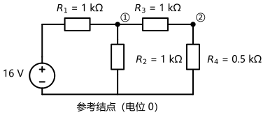
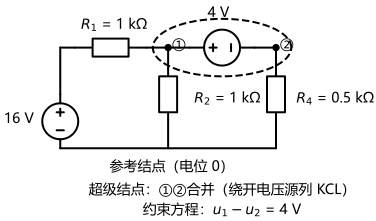
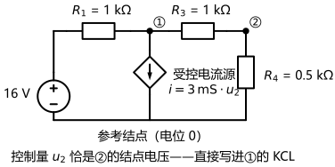

# 第 05 讲：结点电压法

> **前置**：第 01–04 讲（参考方向与功率记账；元件档案与 KCL/KVL；等效变换；支路电流法与回路电流法）。
> **预计时间**：约 3 小时（含作业）。
>
> **一句话定位**：回路法以"环流"为纲；这一讲换一个视角——以**结点电压**为纲。它方程数只剩 $n-1$ 个、写方程有更顺手的"观察法"，而且是所有电路仿真软件的地基。工程师最常用的那件武器，本讲上膛；顺便把三种方法的选择一次拉全。
>
> **本讲回答什么**：
> 1. 结点方程的"标准形"为什么长成"自导纳×本站电压 − 互导纳×邻站电压"这副模样？
> 2. 这套方程为什么对计算机特别友好、成了各种软件的地基？
> 3. 电路里有"无伴电压源"这种钉子户怎么办？
> 4. 参考结点随便选吗？换一个结果会不会变？含受控源会让标准形哪里变形？
>
> **这一讲有真实验证**：同一张 04 电路的"1 方程秒杀"；两级采样网络的基础列法、观察法、换参考点与程序化组装对照（脚本 `scripts/lec05-01_verify_node_method.py`）；无伴电压源两招与含受控源变体（脚本 `scripts/lec05-02_verify_special_nodes.py`）——全部零残差，作业数字全部脚本预验证。

## 本讲怎么走（脉络图）

```
引子：同一张 04 电路，结点法 1 个方程秒杀；再给一个"两级采样网络"
  │
  ├─ 1. 结点电压与参考结点：是什么、凭什么、参考点随便选吗
  ├─ 2. 标准形与观察法：自导纳、互导纳、注入电流；为什么计算机爱它
  ├─ 3. 两类钉子户的修正：无伴电压源两招、受控源三步
  ├─ 4. 矩阵视角：从观察法到"自动组装"（埋 25 讲的钩子）
  └─ 5. 三种方法选型 → 常见误区 → 本讲小结 → 掌握度自测 → 作业
```

> 下一站：§引子。先看一个"一个方程解决战斗"的现场。

---

## 引子：从"1 个方程"说起

第 04 讲那张两路电源并联供电的电路（12 V+2 Ω、10 V+1 Ω、负载 2 Ω），回路法用了 **2 个方程**。现在把它交给"结点电压法"试试——把底部公共点选为**参考结点**（电位记 0 V），设顶结点电压为 $V$，对顶结点列**一个 KCL**，电流全部用"结点电压÷电阻/电压差"写：

$$\frac{V-12}{2} + \frac{V-10}{1} + \frac{V}{2} = 0$$

整理：$4V = 32$，**一个方程**解出 $V = 8\,\mathrm{V}$（脚本实测）——支路电流 $2/2/4\,\mathrm{A}$、功率账 $44 = 32+8+4\,\mathrm{W}$，与 04 讲一字不差。同一张图：回路法 2 个方程，结点法 **1 个**。

为什么能少？因为结点法换了一套未知量：不再问"每条支路流多少电流"，而是问"每个结点比参考点高多少伏"——**未知量从 $b$ 个变成 $n-1$ 个**。这张图 $n = 2$，所以只剩一个。

再把规模升一档，看本讲的主任务：**两级采样网络**（图 1）——工程里常见的"从一根分压链上取两个参考电压"，比如给比较器电路同时提供两个基准点。



> **图 1 怎么读**：左边是 16 V 理想源（"+"在上）；$R_1 = 1\,\mathrm{k\Omega}$ 串在顶部横线上，把电源接到**结点①**（图中用 ① 标出）；结点①向下经 $R_2 = 1\,\mathrm{k\Omega}$ 接参考结点，向右经 $R_3 = 1\,\mathrm{k\Omega}$ 接**结点②**；结点②向下经 $R_4 = 0.5\,\mathrm{k\Omega}$ 接参考。底部的公共线是**参考结点**（电位 0）——注意：电容式的心智里它是"地"，但这里它只是一条被选为基准的线。任务：**两个结点各是多少伏？**（这就是那两个采样点的读数。）

---

## 1. 结点电压与参考结点

### 1.1 结点电压是什么

> **结点电压**：某个结点相对**参考结点**的电压——换句话说，就是第 01 讲讲的**电位**：$\varphi_k = u_{k,\text{ref}}$。

三个立即可用的推论：

1. **任何支路的电压 = 两端结点电压之差**（$u = \varphi_a - \varphi_b$）——第 01 讲"电压是两点之差"的直接回收；
2. **参考结点自己不需要未知量**（它是 0）；所以未知量个数 $= n-1$；
3. **算出结点电压后，全电路"处处可读"**：每支路电压做减法、每支路电流套档案——求解的"最后一公里"全在这里。

### 1.2 凭什么合法：电压是"组装"出来的

与第 04 讲"回路电流合法吗"完全对偶，这里有三条事实：

**事实一：任何一组结点电压，都能组装出全部支路电压、进而组装出全部支路电流**（每条支路上：电压 = 电位差 $\varphi_a - \varphi_b$，电流 = 电压套档案）。

**事实二：组装出的所有量自动满足全部 KVL。** 因为"电位"天生是保守量——沿着任何回路绕一圈，各段电位差"上升的和"与"下降的和"必然相等（每一项都是 $\varphi_{\text{后}}-\varphi_{\text{前}}$，首尾相接自动抵消）。KVL 这条约束**从此刻起永远不用再操心**——正好和回路法里"KCL 自动满足"对偶。

**事实三：于是只需凑 KCL。** $n-1$ 个非参考结点各列一条 KCL（节点电荷账），未知量也是 $n-1$ 个——恰好相等，系统可解。

**合法性收尾**：解出的结点电压组装成整套电压电流后，**KVL 自动满足、KCL 被方程保证、档案在组装时用掉**——全部定律盖章；再由 §1 的计数保证解的唯一性——所以它就是真解。（这一段的逻辑结构和第 04 讲"假环流为什么合法"是同一套模板：**组装 + 自动满足一半 + 方程管住另一半 + 计数唯一**。）

### 1.3 参考结点随便选吗

随便选——但有两条实用惯例：

- **选"最忙"的公共点**：最多支路交汇的那条线上（通常是底部公共线），后面写方程最省事；工程上就是"地"（$\perp$ 或接地符号）。**全电路只选一个**。
- **换一个参考点，结果会怎样？** 全体结点电压**整体平移**一个常数（这正是第 01 讲"换参考点电位平移"的性质），而**任意两点之差不变**——也就是说所有真实支路电压、支路电流、功率，一个字都不变。脚本实测（把参考点移到原结点②）：新解 $(4, -2)$，与原解 $(6, 2)$ 相差的正是整体平移 $2\,\mathrm{V}$；差值核对为零。
- 计算机程序则固定把参考结点编成"0 号节点"——**地是软件的锚**。

### 1.4 基础列法与引子全解

**基础列法（模板）**：

1. **选参考结点**，标 0；给其余结点编号；
2. **逐个非参考结点列 KCL**，电流全部用"结点电压差 ÷ 电阻"（电压源支路特殊，§3 处理）；
3. **联立求解**；
4. **组装**回支路电压/电流，回代验算。

**照模板解引子**（图 1，两个未知量 $u_1$、$u_2$、单位 mA，电阻用 kΩ）：

- 结点①：从 R1 流入 $(16-u_1)/1$，从 R2 流出 $u_1/1$，从 R3 流出 $(u_1-u_2)/1$：

$$\frac{u_1-16}{1} + \frac{u_1}{1} + \frac{u_1-u_2}{1} = 0 \;\Rightarrow\; 3u_1 - u_2 = 16$$

- 结点②：从 R3 流入 $(u_1-u_2)/1$，从 R4 流出 $u_2/0.5$：

$$\frac{u_2-u_1}{1} + \frac{u_2}{0.5} = 0 \;\Rightarrow\; -u_1 + 3u_2 = 0$$

**解**：$u_1 = 6\,\mathrm{V}$、$u_2 = 2\,\mathrm{V}$（脚本实测）。**组装与验算**：支路电流 $10/6/4/4\,\mathrm{mA}$（R1/R2/R3/R4）；两条结点 KCL 残差为零；功率账 $160 = 100 + 36 + 16 + 8\,\mathrm{mW}$ ✓。两个采样点：**6 V 和 2 V**。

> **态度表（概念部分）**
>
> | 内容 | 态度 |
> |---|---|
> | 结点电压 = 电位（相对参考结点） | **能复述**；与 01 讲电位直接挂钩 |
> | "组装论"三条事实 | 能说清"KVL 为什么自动满足" |
> | 参考结点选法与换点后果 | 会用（平移、差值不变；地是软件的锚） |
> | 基础列法四步 + 引子全解 | **能独立复现**（6/2 V、$160$ mW 账） |
>
> 下一站：两个方程里已经藏着"标准形"的规律——§2 把它看出来。

---

## 2. 标准形与观察法

### 2.1 从引子的两个方程"看出"规律

把 §1.4 的两个方程再看一遍：

$$3u_1 - u_2 = 16, \qquad -u_1 + 3u_2 = 0$$

盯三个位置：

- **对角线上的 3 和 3**：分别是结点①、②上**所有电阻的导纳之和**（①：$1+1+1$；②：$1+2$，单位 mS）——叫**自导纳**；
- **非对角线上的 −1**：两结点之间**公共电阻的导纳取负**——叫**互导纳**（对称位置必然相等）；
- **右边的 16 和 0**：**"注入"这个结点的电流**（mA）——结点①的 16 来自"16 V 源经 1 kΩ 串阻折算"（$g\cdot U_S = 1\,\mathrm{mS}\times 16\,\mathrm{V} = 16\,\mathrm{mA}$），结点②没有源注入就是 0。

这不是巧合——把**任意**电路的 KCL 按"结点电压 ÷ 电阻"展开整理，都会落成这个形状。

### 2.2 标准形（模板）——观察法直接写方程

> 对每个非参考结点 $k$：
> $$\textbf{自导纳} \times u_k \;-\; \sum_{\text{邻结点 } j} \textbf{互导纳} \times u_j \;=\; \textbf{注入电流之和}$$
> 约定：自导纳**恒正**；互导纳**取负**（矩阵对称）；右边**流入该结点的电流源/折算法代数和为正**。

**观察法三步**（对着一张图直接写，不用逐个列 KCL）：

1. **自导纳**：把该结点上所有支路的电导 $1/R$ 加起来，写在对角线；
2. **互导纳**：两个结点之间若隔着电阻，把 $1/R$ 取负写在对应位置；
3. **右边**：数注入——理想电流源直接写（流入为正）；**电压源 + 串联电阻**折算成 $g\,U_S$（方向随"+"端）；纯电压源支路是钉子户（§3）。

**矩阵形式**：$n-1$ 个方程合写为

$$\mathbf{G}\,\mathbf{U} = \mathbf{I}_S$$

$\mathbf{G}$ 为导纳矩阵（对称！）、$\mathbf{U}$ 为结点电压列、$\mathbf{I}_S$ 为注入电流列。**与回路法的对偶一览**：

| | 回路电流法 | 结点电压法 |
|---|---|---|
| 未知量 | 回路电流（$b-n+1$） | 结点电压（$n-1$） |
| 方程 | 回路 KVL | 结点 KCL |
| 对角 | 自阻（正） | 自导纳（正） |
| 非对角 | 互阻（负） | 互导纳（负） |
| 右端 | 电压源"升压"和 | 注入电流和（流入为正） |
| 钉子户 | 无伴电流源（钉死/超网孔/互换） | 无伴电压源（钉死/超级结点/互换） |
| 自动满足 | KCL | KVL |

### 2.3 观察法三十秒再解引子

对照图 1 直接写（mS、mA）：

$$\mathbf{G} = \begin{pmatrix} 1+1+1 & -1 \\ -1 & 1+2 \end{pmatrix} = \begin{pmatrix} 3 & -1 \\ -1 & 3 \end{pmatrix}, \qquad \mathbf{I}_S = \begin{pmatrix} 16 \\ 0 \end{pmatrix}$$

解之：$u_1 = 6$、$u_2 = 2$——与基础列法逐位相同（差 0，脚本实测）。

**两条自检**：① **矩阵对称**（不对称必有笔误）；② **右边符号**对着图数一遍再落笔（流入为正）。

### 2.4 为什么它是"计算机友好"的那一个

四个理由，一个比一个硬：

1. **方程数只由拓扑定**：$n-1$ 个——把电路连起来之前，方程数就定了；矩阵大小不随元件值改变；
2. **矩阵对称**：存一半、算得快（对称矩阵的求解是数值线性代数的看家本领）；
3. **组装规则是"局部"的**：每条支路只碰它两端的结点（对角加、互项减）——**不需要任何"看图的智慧"**，照着支路清单机械填数就行；
4. **参考结点固定为 0 号**：地是天生的"坐标原点"，程序不需要"选参考"。

这正是仿真软件（SPICE 一类的电路仿真器）每天在做的事——本讲末尾的 §4 还会让你亲眼看一次"自动组装"；第 25 讲会把这件事写成一行矩阵公式 $\mathbf{A}\mathbf{Y}\mathbf{A}^{\mathrm{T}}$。

> **态度表（标准形与观察法部分）**
>
> | 内容 | 态度 |
> |---|---|
> | 标准形三个零件（自导/互导/注入） | **能复述、能对图辨认** |
> | 观察法三步 | **能默写、闭眼执行**；矩阵对称自检 |
> | 与回路法的对偶 | 能画对照（未知量、方程、符号、钉子户） |
> | "计算机友好"四个理由 | 能说清（拓扑定数/对称/局部组装/地锚） |
>
> 下一站：电压源这位"钉子户"还没正式安顿——§3 无伴电压源两招与受控源三步。

---

## 3. 两类钉子户的修正

### 3.1 有伴电压源：一条折算进方程（其实就是互换）

电压源串着电阻（"有伴"）时，观察法第 3 步已经给了去处：**折算成注入电流 $g\,U_S$**（方向随"+"端）。引子里的 16 V+1 kΩ 折算成 $16\,\mathrm{mA}$ 注入结点①——它本来就是这么写进方程的。

这个"折算"不是新招：把它换成电流源并电阻（第 03 讲的互换），**并上的电阻进自导纳、电流源进右侧**——整理后与直接折算逐项相同。一句话：**有伴电压源不用换图，也能进方程。**

### 3.2 无伴电压源两招

**"无伴"**：理想电压源**单独**占一条支路（旁边没有可折算的电阻）。它的电流是未知量，写不进"电压差 ÷ 电阻"的格式——恰如无伴电流源之于回路法（对偶）。两招安顿它：

**第①招——一端接参考，直接钉死。** 把引子电路的 $R_4$（0.5 kΩ）换成一只 **2 V** 无伴电压源（"+"端朝结点②，即 $u_2 = 2\,\mathrm{V}$）：结点②电压**直接已知**，方程从 2 个减为 1 个：

$$3u_1 = 16 + 2 \;\Rightarrow\; u_1 = 6\,\mathrm{V}$$

（脚本实测：与引子同答案——数字是特意挑的：原来 $R_4$ 上恰好压着 2 V，"升级"成源后外部看到的电压条件不变。**但注意**：原来 $R_4$ 的电流被欧姆定律订死为 4 mA，换成源之后它的电流改由外电路决定——本例恰好也是 4 mA，纯属数字挑得刚好。）

**第②招——夹在两结点之间，超级结点。** 把 $R_3$ 换成一只 **4 V** 无伴电压源（"+"朝结点①，即 $u_1 - u_2 = 4\,\mathrm{V}$）：两个结点谁也不接参考，电压源横在中间。处理与 04 讲超网孔逐字对偶——**"两件套"**：

- **绕开列 KCL**：把结点①、②连同电压源打包成**超级结点**，沿外圈列一条 KCL（**跨过电压源、不写它的电流**——那是未知量，不碰它）；
- **补约束方程**：电压源直接给出两结点电压之差。



> **图 2 怎么读**：虚线椭圆把结点①②和它们之间的 4 V 源圈成一块——这就是"超级结点"。对它列 KCL 时，沿圈的**外边界**数进出电流（跨过内部那只源，不碰它）；再补一条约束：$u_1 - u_2 = 4\,\mathrm{V}$（源的"+"端朝①）。

**照两件套做**（脚本实测）：

- 外圈 KCL：$(16-u_1)/1 = u_1/1 + u_2/0.5 \;\Rightarrow\; u_1 + u_2 = 8$（解完后可见：经 R1 流入 10 mA = R2 的 6 mA + R4 的 4 mA，账是平的）；
- 约束方程：$u_1 - u_2 = 4$；
- 联立：$u_1 = 6\,\mathrm{V}$、$u_2 = 2\,\mathrm{V}$ ✓——与引子完全一致；新电压源的支路电流 = 原 $R_3$ 的 4 mA。

**两招记忆图**：一端接参考 → 钉死；夹心 → 超级结点（绕开 + 补约束）。**先看它接不接参考，再动手。**

### 3.3 含受控源：三步不变，还有一个最省事的特例

处理流程与 04 讲一字不差——**三步模板**：

1. **照写**：受控源当"值暂时空着的独立源"写进方程（值时留符号 $i'$、$u'$）；
2. **补表达式**：把控制量用**结点电压**表示——全流程唯一的新动作；
3. **代回求解**，组装还原、验算。

**最常见的特例**：控制量恰好是某个**结点电压**（比如压控电流源 $i = g\,u_2$）——表达式"顺手就在手边"，直接写。



> **图 3 怎么读**：引子电路的 $R_2$ 换成一只**受控电流源**（菱形，箭头向下）：$i = 3\,\mathrm{mS} \times u_2$——由**结点②的电压**控制。对结点①列 KCL 时，它是商店里的一笔"流出"；而它的值还没解出来——照写 $3u_2$ 即可：表达式已经天然用结点电压写好了。

**照三步做**（脚本实测）：

- 照写——结点①：$(16-u_1)/1 = 3u_2 + (u_1-u_2)/1 \;\Rightarrow\; u_1 + u_2 = 8$；
- 结点②：$(u_1-u_2)/1 = u_2/0.5 \;\Rightarrow\; u_1 = 3u_2$；
- 代入：$u_2 = 2\,\mathrm{V}$、$u_1 = 6\,\mathrm{V}$ ✓——受控源电流 $= 6\,\mathrm{mA}$；功率账 $160 = 100 + 36 + 16 + 8\,\mathrm{mW}$（受控源"吃" 36 mW）✓。

**如果控制量是支路电流**（CCCS/CCVS 的情形）：先把那条支路电流用结点电压表示（$i = (u_a-u_b)/R$），再代回——**步骤一模一样，只是表达式多算一步**。

> **态度表（修正情形部分）**
>
> | 内容 | 态度 |
> |---|---|
> | 有伴电压源：折算 $g\,U_S$（= 互换的方程版） | **会用**；知道它就是互换 |
> | 无伴电压源两招（钉死/超级结点） | **能对着图选招、能独立算**（两组实测：1 方程 6 V、超级结点 6/2 V） |
> | 受控源三步 | **能默写、闭眼执行**（复现 VCCS 变体 6/2 V、160 mW 账） |
> | 与回路法的对偶 | 能说出"超网孔 ↔ 超级结点""无伴电流源 ↔ 无伴电压源" |
>
> 下一站：把观察法"交给程序"看一遍——§4。

---

## 4. 矩阵视角：观察法只是"人手版的程序"

回头看引子的矩阵：

$$\mathbf{G} = \begin{pmatrix} 3 & -1 \\ -1 & 3 \end{pmatrix}, \qquad \mathbf{I}_S = \begin{pmatrix} 16 \\ 0 \end{pmatrix}$$

再想一遍观察法第 1、2 步的写法——"对角加、互项减"——你会发现它**根本不依赖"看图"**：每条支路只需要知道"两端是谁、阻值多少、有没有串联源"，就能往矩阵里填它那一份。脚本把这个思想写成了真程序（支路清单 → 自动组装）：

```
支路清单：(起点, 终点, 电导, 串联电压源)
每条支路只做局部贡献：对角 +g；两端都是未知结点时 互项 -g；源向一端注入 g*us
→ 程序组装 G = [[3, -1], [-1, 3]]    手写矩阵 G = [[3, -1], [-1, 3]]
→ 逐项一致；解 = [6.0, 2.0]
```

所以那句"想当然归纳"——"**这不就是矩阵方程的雏形吗？**"——可以升级成更准确的说法：**它不是雏形，它就是完整算法本身**。观察法 = 人手执行同一套局部规则；仿真程序 = 把同一套规则写成循环。第 25 讲还会给出它的"一行式"：$\mathbf{G} = \mathbf{A}\,\mathbf{Y}\,\mathbf{A}^{\mathrm{T}}$——其中 $\mathbf{A}$ 正是第 02 讲眉目间见过的"出度入度"式**关联矩阵**。伏笔伏到这里，收网的齿轮已经在转。

（工程体感一句：SPICE 类软件对几十万个结点的电路，就是自动列这条方程、解一个巨大的稀疏对称矩阵——你手算的"观察法"，是它的微缩原型。）

---

## 5. 三种方法选型

三种方法都到手了，最后把选择一次说全：

| 方法 | 未知量 | 方程数 | 什么时候顺手 |
|---|---|---|---|
| 支路电流法 | 支路电流 | $b$ | 电路很小；或想要"每条支路电流"的完整清单 |
| 回路电流法 | 回路电流 | $b-n+1$ | 回路少（平面电路数网孔）；电流源占边/夹心 |
| 结点电压法 | 结点电压 | $n-1$ | 结点少；电压源多；要读"结点电位"；程序化/大规模 |

**选择流程（模板）**：

1. **数** $n$、$b$；
2. **算** $n-1$ 与 $b-n+1$；
3. **哪个小选哪个**；
4. **微调**：特殊元件（无伴源、受控源）三套方法都有规范章法，一般不构成换方法的理由——只在两种方法方程数相差不多时，看哪边的"钉子户"更好安顿；
5. **动笔**，并用"矩阵对称"等自检纠错。

**回到"最常用"**：为什么工程师偏爱结点法？——$n-1$ 在多数电路里最小（"田"字网络：结点法 4 个方程 vs 支路法 8 个）；"地"是现成的参考点，读数即电势；四个计算机友好理由（拓扑定数/对称/局部组装/地锚）；以及一句行业事实——**几乎所有电路仿真软件的内核都是结点法**。

---

## 常见误区（本节零新知识，只破误）

> 以下每条只是"对答案 + 校准"，没有新知识——每一句都已在正文系统小节里教过。

1. **"KCL 要给每个结点列，参考结点也不例外"**（§1.1、§1.2）。错。参考结点不设未知量、不列方程；独立 KCL 恰好 $n-1$ 条。
2. **"换一个参考结点，答案会变"**（§1.3）。错。全体结点电压整体平移；支路电压、电流、功率一个都不变——"约定会变、物理不变"的又一次现身。
3. **"无伴电压源可以随便设一个电流硬塞进 KCL"**（§3.2）。不行。两招规范：一端接参考→钉死；夹心→超级结点（绕开列 KCL + 补约束）。
4. **"有伴电压源没法用观察法"**（§3.1）。可以。折算成 $g\,U_S$ 注入即可——它就是电源互换的方程版。
5. **"含受控源会让标准形失效"**（§3.3）。不会。三步照做；控制量是结点电压时最省事，是支路电流时先用结点电压表示它。
6. **"自导纳、互导纳矩阵只是巧合的排版"**（§2.1、§4）。恰恰相反：它是可程序化执行的**局部组装算法**——仿真软件的地基；第 25 讲将证明 $\mathbf{G} = \mathbf{A}\mathbf{Y}\mathbf{A}^{\mathrm{T}}$。

---

## 本讲小结

一页纸的骨架：

- **结点电压 = 电位**（相对参考结点）：支路电压 = 两端之差；未知量 $n-1$ 个；组装自动满足 **KVL**，方程只管 KCL。
- **参考结点**："最忙"的公共点；换点 = 整体平移，真实量不变；程序固定"0 号 = 地"。
- **标准形与观察法**：自导纳（正）×本点 − 互导纳（负）×邻点 = 注入电流和（流入为正）；$\mathbf{G}\mathbf{U} = \mathbf{I}_S$，矩阵**对称**；与回路法全表对偶。
- **计算机友好四理由**：拓扑定数、对称、局部组装、地锚。
- **钉子户**：有伴电压源→折算 $g\,U_S$（=互换）；无伴→一端参考钉死、夹心超级结点（绕开+约束）；受控源→三步模板（VCCS 变体 6/2 V、160 mW）。
- **引子数字**：两级采样网络 $u_1 = 6\,\mathrm{V}$、$u_2 = 2\,\mathrm{V}$；电流 10/6/4/4 mA；功率 $160 = 100+36+16+8$ mW；04 电路 1 方程得 $V = 8\,\mathrm{V}$。
- **三种方法选型**：$b$ vs $b-n+1$ vs $n-1$——先数再选。

## 掌握度自测

- [ ] 我能说出结点电压是什么（电位）、为什么未知量是 $n-1$ 个。
- [ ] 我能用"组装论"解释结点法为什么自动满足 KVL。
- [ ] 我能独立复现引子全解（基础列法 6/2 V、160 mW 账）。
- [ ] 我能默写观察法三步与标准形；会用"矩阵对称"自检。
- [ ] 我能说出"计算机友好"的四个理由，并复述 §4 的自动组装思想。
- [ ] 我能处理无伴电压源两种情形（钉死、超级结点），并独立算出两组实测。
- [ ] 我能默写受控源三步，独立复现 VCCS 变体（6/2 V、160 mW 账）。
- [ ] 我能解释"换参考点整体平移、真实量不变"。
- [ ] 我能画三种方法的选型表，并说清"先数再选"的流程。
- [ ] 我能复跑 `scripts/lec05-01` 与 `lec05-02`，并解释输出里的每一个数字。

## 作业

> 答案只能用**已教概念**（本讲范围：结点电压与参考结点、组装论、基础列法与观察法标准形、三种方法计数与选型、有伴电压源折算、无伴电压源两招、受控源三步；KCL/KVL、等效变换与回路法承接第 01–04 讲）。先独立做，再对答案。

### 基础

**Q1. 概念辨析**：判断下列说法对不对，并给一句话理由。

(a) "结点法要给每个结点列 KCL，参考结点也不例外。"
(b) "自导纳、互导纳矩阵只是巧合的排版，没什么用处。"
(c) "无伴电压源可以随便设一个未知电流，硬塞进 KCL。"
(d) "换一个参考结点，支路电流也会跟着变。"
(e) "含受控源时，观察法的标准形完全失效。"

**参考答案**：

(a) 错。参考结点是被约定的 0 电位，不设未知量、不列方程；独立 KCL 恰好 $n-1$ 条（每个非参考结点一条）。
(b) 错。它是可程序化执行的局部组装算法：每条支路"对角加、互项减"，不需要看图智慧——仿真软件的地基（第 25 讲 $\mathbf{G} = \mathbf{A}\mathbf{Y}\mathbf{A}^{\mathrm{T}}$）。
(c) 错。两招规范：一端接参考→钉死；夹心→超级结点（绕开列 KCL + 补约束方程）。
(d) 错。换参考点全体结点电压整体平移，支路电压（差值）不变，电流、功率随之不变——"约定会变、物理不变"。
(e) 错。三步照做：照写、补控制量表达式、代回；控制量是结点电压时最省事。
验算：五小题的公共判据——"谁被约定、谁被保证、规范动作是什么？"

**Q2. 计算·基础列法**：两级网络变体：12 V 源 + $1\,\mathrm{k\Omega}$ 串到结点①；①经 $2\,\mathrm{k\Omega}$ 到参考；①经 $1\,\mathrm{k\Omega}$ 到结点②；②经 $1\,\mathrm{k\Omega}$ 到参考。求 $u_1$、$u_2$、各支路电流，并做功率验账。

**参考答案**：

结点①：$(u_1-12)/1 + u_1/2 + (u_1-u_2)/1 = 0 \Rightarrow 2.5u_1 - u_2 = 12$；
结点②：$(u_2-u_1)/1 + u_2/1 = 0 \Rightarrow u_1 = 2u_2$；
联立：$u_2 = 3\,\mathrm{V}$、$u_1 = 6\,\mathrm{V}$。
电流（mA）：串阻 $(12-6)/1 = 6$；$2\,\mathrm{k\Omega}$：$6/2 = 3$；中支路：$6-3 = 3$；末电阻：$3$。
验账：源发出 $12 \times 6 = 72\,\mathrm{mW}$；吸收 $6^2 \times 1 + 3^2 \times 2 + 3^2 \times 1 + 3^2 \times 1 = 36 + 18 + 9 + 9 = 72\,\mathrm{mW}$ ✓。
验算：两条 KCL 回代残差为 0 ✓。

**Q3. 计算·观察法**：对 Q2 的电路，用观察法直接写出标准形矩阵并求解；做完检查矩阵对称性。

**参考答案**：

$$\mathbf{G} = \begin{pmatrix} 1 + 1/2 + 1 & -1 \\ -1 & 1 + 1 \end{pmatrix} = \begin{pmatrix} 2.5 & -1 \\ -1 & 2 \end{pmatrix} \;(\mathrm{mS}), \qquad \mathbf{I}_S = \begin{pmatrix} 12 \\ 0 \end{pmatrix} \;(\mathrm{mA})$$

解：$u_1 = 6\,\mathrm{V}$、$u_2 = 3\,\mathrm{V}$——与 Q2 一致 ✓。对称性：$G_{12} = G_{21} = -1$ ✓。
验算：自导纳为正（2.5、2）；互导纳取负；右边只有源注入 12 mA。

### 提高

**Q4. 计算·无伴电压源（夹心）**：在 Q2 电路里把中支路电阻换成 3 V 无伴电压源（"+"端朝①）。用超级结点求 $u_1$、$u_2$。

**参考答案**：

约束方程：$u_1 - u_2 = 3$；
超级结点外圈 KCL：$(12-u_1)/1 = u_1/2 + u_2/1 \Rightarrow 12 = 1.5u_1 + u_2$；
代入 $u_1 = u_2 + 3$：$12 = 1.5u_2 + 4.5 + u_2 \Rightarrow u_2 = 3\,\mathrm{V}$、$u_1 = 6\,\mathrm{V}$ ✓（与 Q2 同答案——替换的源电压恰等于原中支路上的电压）。
验算：源支路电流 = 原中支路的 3 mA；KCL 两侧残差为 0。

**Q5. 计算·受控源**：在 Q2 电路里把 $2\,\mathrm{k\Omega}$ 换成 VCCS（$i = 1\,\mathrm{mS} \times u_2$，方向流出结点①）。按三步模板求 $u_1$、$u_2$。

**参考答案**：

照写——结点①：$(12-u_1)/1 = 1\times u_2 + (u_1-u_2)/1 \Rightarrow 12 - u_1 = u_1 \Rightarrow u_1 = 6\,\mathrm{V}$；
结点②：$(u_1-u_2)/1 = u_2/1 \Rightarrow u_1 = 2u_2 \Rightarrow u_2 = 3\,\mathrm{V}$ ✓；
受控源电流 $= 1 \times 3 = 3\,\mathrm{mA}$（恰等于原 $2\,\mathrm{k\Omega}$ 支路电流）。
验算：控制量恰是结点电压，"表达式"已在方程里；KCL 残差为 0。

**Q6. 计算·两种方法对照**：04 讲的两路供电电路（12 V+2 Ω ∥ 2 Ω ∥ 10 V+1 Ω）。

(1) 用结点法（1 个方程）求顶结点电压与三条支路电流；
(2) 与 04 讲回路法（2 个方程）对照方程数。

**参考答案**：

(1) $\dfrac{V-12}{2} + \dfrac{V-10}{1} + \dfrac{V}{2} = 0 \Rightarrow 4V = 32 \Rightarrow V = 8\,\mathrm{V}$；电流 $2/2/4\,\mathrm{A}$。
(2) 回路法 2 个方程、结点法 1 个：$b-n+1 = 3-2+1 = 2$ 对 $n-1 = 1$——同一张图，未知量口径不同。
验算：功率账 $44 = 32 + 8 + 4\,\mathrm{W}$ ✓（04 讲已验）。

### 综合（回扣本讲主任务）

**Q7. 综合设计·两级采样网络**：用 16 V 电源设计一个"两级分压链"，使两个采样点（结点①、②，结构同图 1）分别输出 6 V 与 2 V。给出你的电阻方案并验算（kΩ 档整数，方案不唯一）。

**参考答案**（一种方案：图 1 原班人马）：

$R_1 = 1\,\mathrm{k\Omega}$（串）、$R_2 = 1\,\mathrm{k\Omega}$（①→参考）、$R_3 = 1\,\mathrm{k\Omega}$（①→②）、$R_4 = 0.5\,\mathrm{k\Omega}$（②→参考）。
验算：结点方程解得 $u_1 = 6$、$u_2 = 2\,\mathrm{V}$；电流 10/6/4/4 mA；功率账 $160 = 100+36+16+8\,\mathrm{mW}$ ✓。
设计思路：先定两级电流（此处 4 mA），再按"每级压降 ÷ 电流"反推电阻——由需求反推参数，是电路设计的日常姿态。

**Q8. 开放简答·"最常用"的底气**：用自己的话回答两个问题：(1) 为什么工程师偏爱结点电压法？(2) 为什么说它是"各种软件的地基"？

**参考答案**：

(1) 三个理由：方程数 $n-1$ 在常见电路里往往最少（对比支路法 $b$、回路法 $b-n+1$）；"地"是现成的参考点，读数即结点电位；写方程有观察法、还能对称自检。
(2) 因为它可以完全脱离"看图"：每条支路只对矩阵做局部贡献（对角加、互项减），矩阵天然对称、参考点是固定的 0 号——程序照着支路清单机械组装即可（本讲 §4 的程序化组装演示了这个过程）；第 25 讲把它写成 $\mathbf{G} = \mathbf{A}\mathbf{Y}\mathbf{A}^{\mathrm{T}}$，正是各类电路仿真内核的第一步。

---

*下一讲预告：第 06 讲《电路定理 I：叠加与替代》——方程会列了，但很多时候你只关心"某个元件上的响应"。有没有"少算一点"的捷径？线性性送来两件省力工具：叠加与替代。*