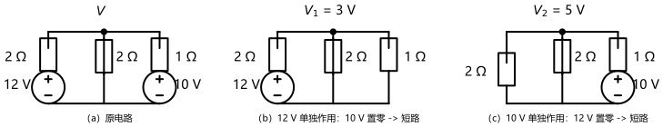
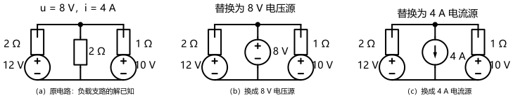

# 第 06 讲：电路定理 I：叠加与替代

> **前置**：第 01–05 讲（参考方向与功率符号约定；元件伏安关系与 KCL/KVL；等效变换；支路电流法与回路电流法；结点电压法）。
> **预计时间**：约 3 小时（含作业）。
>
> **一句话定位**：这一讲换一副眼镜——不再问"把电路解出来是多少"，而是问"**谁的贡献、能不能换个说法**"。叠加定理是线性性的直接推论；替代定理是"把已知的解钉成源"的换描述工具。记住基调：**定理是省力工具包，不是新知识**。
>
> **本讲回答什么**：
> 1. 什么时候用定理、什么时候硬解？分界线在哪？
> 2. 叠加定理凭什么成立？"每个源单独作用"具体怎么操作？不用的源画成什么样？
> 3. 功率为什么不能叠加？这条最容易出错，怎么一眼识破？
> 4. 替代定理到底在替代什么？它和"等效"是一回事吗？
> 5. 非线性电路还能用这些定理吗？
>
> **这一讲有真实验证**：04 电路的叠加分解（3 V + 5 V）、电流逐项分解、功率反例（32 vs 17）、混合源陷阱（10 vs 14 错误结果）——脚本 `scripts/lec06-01_verify_superposition.py`；替代定理两种换法、三源电路版本、05 讲回扣——脚本 `scripts/lec06-02_verify_substitution.py`。全部零残差，作业数字全部脚本预验证。

---

## 引子：两路电源各出了多少力

04 讲的两路电源并联供电（12 V+2 Ω、10 V+1 Ω、负载 2 Ω）已经解过两次：回路法 2 个方程、结点法 1 个方程，$V = 8\,\mathrm{V}$、负载电流 4 A。这次带着一个新问题来：

**负载上的 4 A 里，两路电源各出了多少？如果想评估"掉一路电源"的后果，是不是得重新解一遍？**——这两个问题，方程法都不直接回答；它们要的是"贡献分解"。**叠加定理**给出的正是这件事：

- **只留 12 V 源**（10 V 源"置零"）：$V_1 = 3\,\mathrm{V}$，负载分走 1.5 A；
- **只留 10 V 源**（12 V 源"置零"）：$V_2 = 5\,\mathrm{V}$，负载分走 2.5 A；
- **一起作用**：$3 + 5 = 8\,\mathrm{V}$ ✓——负载 1.5 + 2.5 = 4 A ✓（脚本实测，逐位吻合）。

> **图 1 怎么读**：（a）是原电路；（b）只留 12 V 源——**10 V 源"置零"画成一条短路线**（它宣布输出 0 V），注意它的 1 Ω 串联电阻**原地保留**；（c）只留 10 V 源，12 V 源同样短路成线、2 Ω 保留。两个分场景各自解得 $V_1 = 3\,\mathrm{V}$、$V_2 = 5\,\mathrm{V}$，加起来就是原答案 8 V。

这就是本讲的两件定理之一。另一件（替代）先提一句：你在 05 讲"把 $R_4$ 换成 2 V 源"时其实已经用过它——当时只能说"数字挑得刚好"，本讲 §3 会正式给它名字。

---

## 1. 定理的动机

### 1.1 定理是什么，不是什么

**不是新定律**：KCL、KVL、元件伏安关系已经管住了一切；定理不增加任何物理约束。

**是两样东西**：

- **线性的"使用说明书"**——把"方程解对源是线性的"这件数学事实，翻译成好用的操作流程（叠加）；
- **换描述的工具**——把"已知的解"重新包装成另一种等价的电路形态，方便下一步（替代）。

### 1.2 什么时候用（三类场景）

1. **概念问题**："某电源贡献多少""两路电源怎么互相影响""再并一路电源会改变什么"——这类"谁的贡献/边际影响"的问题，**只有叠加能直接回答**（引子刚演示过）；
2. **理论构件**：戴维南定理（07 讲）的证明靠替代，正弦稳态的相量法（13 讲起）与后续频域方法全靠叠加——它们是把"定理"当积木搭出来的；
3. **特殊结构省力**：对称电路里部分贡献对消；或者只想求"某个新加电源的边际影响"（其余部分解已知）。

### 1.3 什么时候别用（分界线）

**如果你要的只是"完整解一遍"，定理通常更费时**：叠加要解多个子电路、替代要先有解——这时回路法/结点法一步到位，直接用。

分界线一句话：

> **定理回答"谁的贡献、能不能换个说法"的问题；方程法回答"解出来是多少"的问题。**

还有两条实用戒律：**单源电路无从叠加**（没有第二个源）；**已经上手硬解时不要中途改道**（半途换方法只是把工作量翻倍）。

> **态度表（动机部分）**
>
> | 内容 | 态度 |
> |---|---|
> | 定理 ≠ 新定律（是说明书 + 换描述工具） | **能复述** |
> | 三类使用场景 + 分界线 | 能对号入座（给一道题能判断"用不用定理"） |
> | "单源电路无从叠加"等戒律 | 记住即可 |
>
---

## 2. 叠加定理

### 2.1 陈述与"为什么成立"

> **叠加定理**：在线性电路中，任一支路的电流（或任意两点间的电压），等于**每个独立源单独作用**时在该处产生的电流（电压）的**代数和**。

**为什么成立**——一行线性代数看穿。电路的方程（无论回路法还是结点法）都是 $\mathbf{A}\,\mathbf{x} = \mathbf{b}$ 的形状：左边 $\mathbf{A}$ 装着元件的"伏安关系系数"（电阻/导纳，**以及受控源的系数**），右边 $\mathbf{b}$ 装着**独立源**。把 $\mathbf{b}$ 按源拆开：$\mathbf{b} = \mathbf{b}_1 + \mathbf{b}_2 + \cdots$，解就自动拆开：

$$\mathbf{x} = \mathbf{A}^{-1}(\mathbf{b}_1 + \mathbf{b}_2 + \cdots) = \mathbf{x}_1 + \mathbf{x}_2 + \cdots$$

数学上就是分配律；物理上就是"每个源各自推一把，互不干扰地把结果加总"。

**关键洞察（受控源为什么不动）**：看这条分界——**独立源住在右端 $\mathbf{b}$，受控源住在左端 $\mathbf{A}$**（受控源是"伏安关系的一部分"，它的"值"由别的量决定）。所以"按源拆分"拆的只能是**独立源**；受控源从头到尾留在电路里、保持原样。

> **一句话回答"单独作用现实吗"**：单源作用的分场景**不是**"断电检修"的真实场景列举，而是解的两个**数学部件**——它们的和恰好是原解；不要拿"现实中不会只留一个源"来质疑它。

### 2.2 操作模板：四步与置零规则

1. **标**：在图上标出待求量（电流/电压的参考方向）；
2. **拆**：逐个独立源单独作用——**其余独立源置零**（规则见下表），**受控源全部保留**；
3. **解**：每个分场景各自求解（子电路用任何已学方法）；
4. **加**：把各分场景的同名量按**参考方向的符号**代数相加。

**置零规则表**（一条理由贯穿：置零 = 让该源的输出为 0）：

| 源 | 置零动作 | 为什么 |
|---|---|---|
| 理想电压源 | 换成**短路** | 输出 0 V = 两端电压恒为零 |
| 理想电流源 | 换成**开路** | 输出 0 A = 支路电流恒为零 |
| 受控源 | **不动** | 它不是激励，是伏安关系（§2.1 的分界） |

**务必记牢**：置零"置"的是**源本身**；**与它串联的电阻、与它并联的元件全部原地保留**——这是最常见的错误来源（§2.3 有实测）。

### 2.3 示范：04 电路全表 + 混合源

**示范 A**：引子电路的两个分场景已经算完，现在把"逐项相加"做全（脚本实测）：

| 量（约定方向） | 12 V 单独 | 10 V 单独 | 代数和 | 原解核对 |
|---|---|---|---|---|
| 结点电压 $V$ | 3 V | 5 V | **8 V** | 8 V ✓ |
| 左支路电流（源→结点） | 4.5 A | −2.5 A | **2 A** | 2 A ✓ |
| 右支路电流（结点→源） | 3 A | −5 A | **−2 A**（即 2 A 流入结点） | −2 A ✓ |
| 负载电流（结点→参考） | 1.5 A | 2.5 A | **4 A** | 4 A ✓ |

注意表中**负号**的出现：分场景的电流可以"反向"，代数和才是真实值——第 4 步"加"必须带方向。

**示范 B（混合源 + 陷阱）**：电路换成"12 V+2 Ω 支路、2 Ω 直接跨在结点与参考之间、再加 4 A 电流源注入结点"。直接解：$(V-12)/2 + V/2 = 4 \Rightarrow V = 10\,\mathrm{V}$。叠加分解：

- 12 V 单独作用：$2V = 12 \Rightarrow 6\,\mathrm{V}$；
- 4 A 单独作用（**12 V 源短路成线、它的 2 Ω 保留**）：两条 2 Ω 并联对源供流，$V/2 + V/2 = 4 \Rightarrow 4\,\mathrm{V}$；
- 合计 $6 + 4 = 10\,\mathrm{V}$ ✓（脚本实测）。

**对照错误结果**：如果"置零"时把整条支路连电阻一起拿掉，4 A 单独作用会算出 8 V，总和 14 V ≠ 10 V——脚本把这个错值也打出来存栏，提醒你不是小题大做。

### 2.4 功率为什么不能叠加

对引子电路算负载功率（2 Ω）：**正确**：$P = V^2/2 = 8^2/2 = 32\,\mathrm{W}$。**错误演示**：把部分电压的功率相加：$3^2/2 + 5^2/2 = 4.5 + 12.5 = 17\,\mathrm{W} \ne 32\,\mathrm{W}$。

差的那 15 W 去哪了？跑一个恒等式就明白：把 $i = i_1 + i_2$ 代入 $P = R i^2$：

$$R(i_1+i_2)^2 = \underbrace{Ri_1^2 + Ri_2^2}_{\text{部分功率和}} + \underbrace{2Ri_1i_2}_{\textbf{交叉项}}$$

**交叉项**（两源相互作用的"乘积项"）在"部分相加"时被整个丢掉了——$4.5 + 12.5 + 15 = 32$ ✓（脚本实测）。

**一眼识破的口诀**：

> **线性量才叠，乘积量不叠。** 电压、电流是一次的（线性量）——可叠；功率、能量、$i^2R$ 这类**含平方或乘积**的量——不可叠。想求功率：**先把各部分电压/电流叠好，再按功率公式算一次。**

（§9 讲起的动态电路里，能量与初始条件还会再遇到"不能乱叠"的场合——这条口诀在这些场合同样成立。）

> **态度表（叠加部分）**
>
> | 内容 | 态度 |
> |---|---|
> | 陈述 + "$\mathbf{A}\mathbf{x}=\mathbf{b}$ 拆分"证明 | 能复述；能说出"受控源在 A 不在 b" |
> | 四步模板 + 置零规则表 | **能默写、闭眼执行**；"电阻保留"务必记牢 |
> | 示范 A 全表 / 示范 B（含陷阱） | **能独立复现**（8 = 3+5、10 = 6+4、错误值 14） |
> | 功率不叠 + 交叉项 + "线性量才叠" | **能直接说出**；会先叠量后算功率 |
>
---

## 3. 替代定理

### 3.1 陈述与直白理解

> **替代定理**：设某条支路的电压为 $u_k$（或电流为 $i_k$）**已经求出**，则在解唯一的电路中，这条支路可以用**电压值为 $u_k$ 的理想电压源**替代，也可以用**电流值为 $i_k$ 的理想电流源**替代——电路中**其余各处的电压、电流全部不变**。

（更一般地：任一"二端网络"若其端口电压或电流已知，同样可以被对应值的源替代——分支版本是它的常用特例。）

**直白理解**：解已经知道时，这条支路在电路里的"作用"就浓缩成两个数字——端口电压和端口电流。用一个**恰好输出这两个数字的源**顶上去，外部世界"看到"的端口条件一模一样，方程一个字母都不用改——**解当然不变**。支路内部原来是什么（电阻、电阻串、甚至非线性元件）都无所谓，那部分信息在替代的一刻就被"用掉"了。

**为什么合法（一句话论证）**：替代后，其余部分电路的方程与边界条件（端口电压或电流）与原电路**逐字相同**；由解的唯一性，其余部分的解与原电路完全一致。而替代源自身的电流（或电压）由唯一性反推也恰好是原值——全电路严丝合缝。

**两种换法选哪个**：都合法。选哪个方便用哪个——想让"后续方程简单"就换电流源（如示范）；想"钉住某点电压"就换电压源。

> **图 2 怎么读**：（a）原电路，负载支路的解已知：$u = 8\,\mathrm{V}$、$i = 4\,\mathrm{A}$；（b）换成 8 V 电压源（"+"朝上，与原来的电压极性一致）；（c）换成 4 A 电流源（箭头朝下，与原来的电流方向一致）。两个替换版电路会给出与原电路**完全相同**的其余量——下面实测。

### 3.2 它和"等效"不是一回事

第 03 讲的等效变换和第 06 讲的替代定理容易被叫成一回事，对照表钉死区别：

| 维度 | 等效变换（03 讲） | 替代定理（06 讲） |
|---|---|---|
| 依据 | 内部参数重排后**对外的伏安关系**相同 | **当前这一组解**的具体值 $u_k$、$i_k$ |
| 前提 | 线性单口（或能求出 VCR） | 解存在且**唯一** |
| 对外适用 | **任何外接**都成立 | 只对**本电路这一组解**成立 |
| 产物 | 仍是元件组合（可能还是电阻） | 一个**源**（值 = 已解出的 $u$ 或 $i$） |
| 用途 | **化简**电路 | **换描述**：钉住端口条件、简化后续、理论推导 |

一句话：**等效是"造了个对外一样的替身"；替代是"把已经知道的事实用一个源说出口"。**等效不依赖解；替代依赖解。

### 3.3 示范、伍回与使用时机

**示范（引子电路，脚本实测）**：负载支路 $u = 8\,\mathrm{V}$、$i = 4\,\mathrm{A}$ 已解出。

- **换成 8 V 电压源**：求两条电源支路电流：左 $(12-8)/2 = 2\,\mathrm{A}$（流入结点）、右 $(8-10)/1 = -2\,\mathrm{A}$（即自 10 V 源流入结点 2 A）；结点 KCL：$2 + 2 = 4\,\mathrm{A}$ 全部流进替换源——与原来的负载电流一字不差 ✓；
- **换成 4 A 电流源**：结点方程 $(V-12)/2 + (V-10)/1 + 4 = 0$，**一个方程**得 $V = 8\,\mathrm{V}$ ✓——与原来一致。

**05 讲回扣（正式命名）**：05 讲 §3.2 里两次替换——$R_4$（压着 2 V）换成 2 V 源、$R_3$（压着 4 V）换成 4 V 源，答案保持 6 V / 2 V——当时只能说"数字挑得刚好"；现在可以光明正大地说：**它们本来就是替代定理的日常应用**（已知电压，换成同值电压源，其余不变）。

**使用时机**（什么时候想起它）：

1. **解已到手、还要"接着算"**：想换负载、想加支路、想评估改动——先把旧负载钉成源，前后两套计算无缝衔接；
2. **理论推导**：07 讲戴维南定理的证明主线就是替代；
3. **把"烦人的支路"钉成源**：某条支路后续处理麻烦（比如含复杂子电路的负载），用它的解换成源，其余部分清爽上阵。

> **态度表（替代部分）**
>
> | 内容 | 态度 |
> |---|---|
> | 陈述 + 一句话论证（端口条件不变 + 唯一性） | **能复述** |
> | 与等效的区别（五维对照表） | **能对答**（"依赖解吗？"是分水岭） |
> | 两种换法示范（2/2/4 A、1 方程 8 V） | **能独立复现** |
> | 05 回扣 + 三类使用时机 | 能讲给同学听 |
>
---

## 4. 适用条件汇总

| 定理 | 成立前提 | 失效边界 |
|---|---|---|
| **叠加** | 电路**线性**（全部元件含受控源都是线性的）；求**线性量**（$u$、$i$） | 非线性元件（方程不能再拆）；功率/能量等**乘积量** |
| **替代** | 解**存在且唯一**；已知 $u_k$ 或 $i_k$ | 解不唯一的病态电路不保险；替换值只能取"这组解"的值 |
| 等效（03 复习一行） | 线性单口 + 对外 | 内部量不保证相同；等效不依赖解（与替代相反） |

**三条边界各配一句白话**：

- **非线性为什么破叠加**：拆分的合法性来自 $\mathbf{A}\mathbf{x}=\mathbf{b}$ 的分配律——非线性电路根本不是这个形状（比如含 $i^2$ 档的元件），"先解一半再加"就不再等于整体解；
- **替代为什么不怕非线性**：它搬运的是"解的事实"，论证只用到端口条件与唯一性，**与线性无关**——这是两定理边界的漂亮错位（一个怕非线性，一个不怕）；
- **动态电路的预告**：09 讲起会遇到储能元件，"初始储能"也是一种要参与分解的"源"——那时"零输入 + 零状态"的拆解会再出现一次今天的情形，但处理时要更小心，别把"置零"机械照搬。

> **态度表（边界部分）**
>
> | 内容 | 态度 |
> |---|---|
> | 三行边界表 | **能默写**；配得上三句白话 |
> | "叠加怕非线性、替代不怕" | 能解释各自的原因 |

---

## 常见误区（本节零新知识，只破误）

> 以下每条只是"对答案 + 校准"，没有新知识——每一句都已在正文系统小节里教过。

1. **"置零就是把电压源开路、电流源短路"**（§2.2）。反了。置零 = 输出取 0：电压源 **0 V → 短路**，电流源 **0 A → 开路**。
2. **"置零时把整条支路一起拿掉"**（§2.2、§2.3）。错。置的是**源本身**，串联电阻、并联元件原地保留——实测错误值：14 V vs 正确 10 V。
3. **"受控源也要一起置零"**（§2.1）。错。独立源住在 $\mathbf{b}$、受控源住在 $\mathbf{A}$——受控源是伏安关系，置零等于改电路。
4. **"功率可以叠加"**（§2.4）。错。线性量才叠；$P=Ri^2$ 的交叉项会被丢掉——先叠电压/电流，再算功率。
5. **"替代定理就是等效变换"**（§3.2）。不是。等效不依赖解、对任何外接成立；替代依赖**当前解**、只对这一组解成立。分水岭一句话：**"依赖解吗？"**
6. **"替代定理只能用在直流线性电路里"**（§4）。错。只要解唯一，含非线性元件的电路同样可以替代——它只搬运"解的事实"。

---

## 本讲小结

一页纸的骨架：

- **基调**：定理 = 省力工具包 + 换描述工具，**不是新定律**；分界线：定理答"谁的贡献/换个说法"，方程法答"解出来是多少"。
- **叠加定理**：线性电路中响应 = 各独立源单独作用响应之和；证明 = $\mathbf{A}\mathbf{x}=\mathbf{b}$ 的分配律；**独立源在 $\mathbf{b}$、受控源在 $\mathbf{A}$**。
- **操作四步**：标 → 拆（其余独立源置零：**压源短路、流源开路**；受控源保留；**串联电阻原地保留**）→ 解 → 代数和（带方向）。
- **引子数字**：$V = 3 + 5 = 8\,\mathrm{V}$；负载 1.5 + 2.5 = 4 A；功率 $32 \ne 17$（交叉项 15 W 补齐）；混合源 $10 = 6 + 4$（错误值 14）。
- **功率口诀**：**线性量才叠，乘积量不叠**——先叠量、后算功率。
- **替代定理**：已知 $u_k$ / $i_k$ → 换成同值电压源 / 电流源，其余不变；论证 = 端口条件不变 + 唯一性；**两种换法任选**。
- **替代 vs 等效**：依赖解 vs 不依赖解；本组解 vs 任何外接；换描述 vs 化简。
- **边界**：叠加怕非线性（分配律失效），替代不怕（只搬运解的事实）；乘积量不叠。

## 掌握度自测

- [ ] 我能对着任意一道题判断"该用定理还是硬解"，并说出分界线。
- [ ] 我能复述叠加定理并从 $\mathbf{A}\mathbf{x}=\mathbf{b}$ 拆分解释为什么成立。
- [ ] 我能默写四步模板与置零规则表，并说出"为什么压源置零是短路"。
- [ ] 我能独立复现示范 A 全表（8 = 3 + 5、4 = 1.5 + 2.5 等）。
- [ ] 我能独立复现混合源示范（10 = 6 + 4）并指出"电阻保留"这条规矩。
- [ ] 我能用交叉项解释功率不叠，并直接说出"线性量才叠，乘积量不叠"。
- [ ] 我能复述替代定理的一句话论证，并说明两种换法各适合什么场合。
- [ ] 我能用五维对照表说清替代与等效的区别。
- [ ] 我能说清"叠加怕非线性、替代不怕"的各自原因。
- [ ] 我能复跑 `scripts/lec06-01` 与 `lec06-02`，并解释输出里的每一个数字。

## 作业

> 答案只能用**已教概念**（本讲范围：定理的动机与分界线、叠加定理（陈述/证明思路/四步/置零规则/受控源处理/功率不叠）、替代定理（陈述/论证/两换法/与等效区别）、适用条件；KCL/KVL、等效变换、回路法、结点法承接第 01–05 讲）。先独立做，再对答案。

### 基础

**Q1. 概念辨析**：判断下列说法对不对，并给一句话理由。

(a) "叠加时，不用的电压源画成开路、不用的电流源画成短路。"
(b) "把电源置零时，连它的串联电阻一起拿掉，电路更简单。"
(c) "受控源也应该在每次单独作用时置零。"
(d) "负载功率可以按'各电源单独作用时的功率之和'计算。"
(e) "替代定理和等效变换是一回事，都是简化的手段。"

**参考答案**：

(a) 错。置零 = 输出取 0：电压源 0 V → **短路**；电流源 0 A → **开路**。
(b) 错。置的是源本身；串联电阻、并联元件原地保留（错误值示范：14 V vs 10 V）。
(c) 错。独立源在右端 $\mathbf{b}$、受控源在左端 $\mathbf{A}$——受控源是伏安关系的一部分，必须保留。
(d) 错。$P = Ri^2$ 含平方/交叉项，"线性量才叠、乘积量不叠"；先叠电流/电压，再算功率。
(e) 错。等效不依赖解、对任何外接成立；替代依赖当前解、只对这一组解成立（分水岭："依赖解吗？"）。
验算：五小题各回一个"机制词"：输出取 0 / 源本身 / A 与 b / 交叉项 / 依赖解。

**Q2. 计算·叠加（含对消）**：12 V+2 Ω 与 6 V+2 Ω 两条支路并联、共同供 2 Ω 负载。用叠加求结点电压与三条支路电流，并指出哪条支路的"部分贡献"发生对消。

**参考答案**：

- 12 V 单独：$3V = 12 \Rightarrow 4\,\mathrm{V}$；6 V 单独：$3V = 6 \Rightarrow 2\,\mathrm{V}$；合计 $V = 6\,\mathrm{V}$。
- 电流（约定：左支路源→结点、右支路源→结点、负载向下）：左 $4 + (-1) = 3\,\mathrm{A}$；右 $2 + (-2) = 0\,\mathrm{A}$；负载 $2 + 1 = 3\,\mathrm{A}$。
- **右支路的两个部分贡献 $\pm2\,\mathrm{A}$ 完全对消**（6 V 源与结点电压同值、压差为零），总电流为 0 A。
验算：$V = 6$ 直接代入：左 $(12-6)/2 = 3$、右 $(6-6)/2 = 0$、负载 $6/2 = 3$，KCL $3 + 0 = 3$ ✓。

**Q3. 计算·三源叠加**：在引子电路上再给结点注入 2 A 电流源（第三源）。用叠加求结点电压与负载电流。

**参考答案**：

- 12 V 单独贡献 $3\,\mathrm{V}$、10 V 单独贡献 $5\,\mathrm{V}$（引子已算）；2 A 单独作用：三条支路并联导纳 $1/2 + 1 + 1/2 = 2\,\mathrm{S}$，$2V = 2 \Rightarrow 1\,\mathrm{V}$；
- 合计 $V = 3 + 5 + 1 = 9\,\mathrm{V}$；负载电流 $9/2 = 4.5\,\mathrm{A}$。
验算：直接解 $(V-12)/2 + (V-10)/1 + V/2 = 2 \Rightarrow 4V = 36 \Rightarrow 9$ ✓。

**Q4. 计算·功率陷阱**：对 Q3 的电路求负载功率；并演示"部分功率相加"错在哪。

**参考答案**：

正确：$P = 4.5^2 \times 2 = 40.5\,\mathrm{W}$。
错误演示：$1.5^2 \times 2 + 2.5^2 \times 2 + 0.5^2 \times 2 = 4.5 + 12.5 + 0.5 = 17.5 \ne 40.5\,\mathrm{W}$；差的 23 W 是交叉项——**线性量才叠，乘积量不叠**。
验算：$40.5 = 17.5 + 23$（交叉项恒等式）。

### 提高

**Q5. 计算·替代**：Q3 电路中负载支路已解出 $u = 9\,\mathrm{V}$、$i = 4.5\,\mathrm{A}$。

(1) 用 9 V 电压源替代负载，求两条电源支路电流与注入电流的去向；
(2) 用 4.5 A 电流源替代负载，一个方程求结点电压。

**参考答案**：

(1) 左 $(12-9)/2 = 1.5\,\mathrm{A}$、右 $(10-9)/1 = 1\,\mathrm{A}$，加上 2 A 注入：$1.5 + 1 + 2 = 4.5\,\mathrm{A}$ 全部流入替换源 ✓（= 原负载电流）。
(2) $(V-12)/2 + (V-10)/1 = 2 - 4.5 \Rightarrow 3V = 27 \Rightarrow V = 9\,\mathrm{V}$ ✓。
验算：两版结果与原电路一致——端口条件（$u = 9$ 或 $i = 4.5$）被替换源"钉住"，其余解不变。

**Q6. 概念·替代与等效的分水岭**：用五维对照表（依据 / 前提 / 对外适用 / 产物 / 用途）说明两个概念的区别，并各举本课程里出现过的一个例子。

**参考答案**：

- 等效（03 讲）：依据是内部重排后对外 VCR 相同；前提是线性单口；对任何外接成立；产物仍是元件组合；用途是化简。例子：两路电源并联电路的"12 V+2 Ω"用 3 A 电流源并 2 Ω 互换（03 讲），无论外接什么负载端口关系都不变。
- 替代（06 讲）：依据是当前解的值 $u_k$、$i_k$；前提是解唯一；只对本组解成立；产物是一个源；用途是换描述。例子：05 讲把压着 2 V 的 $R_4$ 换成 2 V 源（当时"数字挑得刚好"，本质是替代）。
- 分水岭一句话：**"依赖解吗？"**——依赖的是替代，不依赖的是等效。
验算：自检两例是否各自符合五维表逐项。

**Q7. 边界·非线性电路**：某电路含一只非线性电阻（伏安关系不是直线）。回答：(1) 叠加定理还能用吗？为什么？(2) 替代定理还能用吗？为什么？

**参考答案**：

(1) 不能（对含非线性元件的部分）。叠加的合法性来自 $\mathbf{A}\mathbf{x}=\mathbf{b}$ 的分拆，非线性电路不满足这个方程形状——"先解一半再加总"不再等于整体解。
(2) 能（只要解存在且唯一）。替代的论证只用"端口条件不变 + 唯一性"，与线性无关；把已知 $u_k$ / $i_k$ 的支路换成同值源即可，替换为非线性元件本身也可以（它内部的非线性在替代的一刻被"用掉"）。
验算：两问各回一句"机制词"：分配律失效 vs 只搬运解的事实。

### 综合

**Q8. 开放简答·"不省力为什么还要学"**：既然完整解题时硬解更快，为什么叠加定理仍然重要？请给出至少三条理由，并说说你会在什么场合主动想起它。

**参考答案**：

三条理由：① 概念问题只有它能答——"某电源贡献多少""两路电源如何互相影响""再多一路会怎样"（引子的两个问题就是例子）；② 理论构件——07 讲戴维南的证明靠替代、相量法与频域方法（13 讲起）全靠叠加，它是后续半本课的积木；③ 特定场合确实省力——对称对消、只求"新增源的边际影响"、部分信息问题。
主动想起它的场合：问题里出现"贡献/占比/影响/叠加/只改变某一路"这些词，或只要算"某量的一部分来源"时——先问自己"这是'谁的贡献'型问题吗？"
验算：对照 §1.2 三类场景与 §1.3 分界线逐条回看，能对号入座即达标。

---

*下一讲预告：第 07 讲《电路定理 II：戴维南、诺顿与最大功率》——最有名的一条定理登场：任何线性含源二端网络都能"浓缩"成一个电压源加一个电阻。开路电压、短路电流、等效电阻三件套，加上工程最爱的"最大功率传输"——届时 06 讲的两件定理都会作为证明的基础。*
