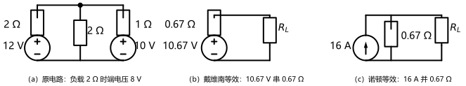
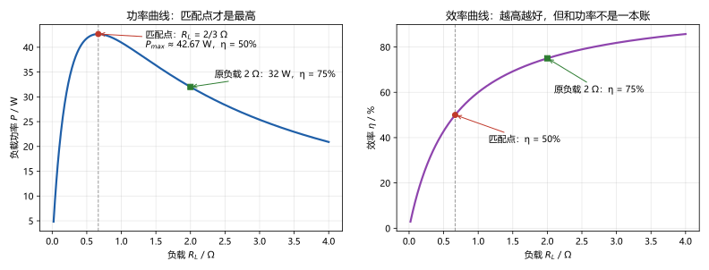

# 第 07 讲：电路定理 II：戴维南、诺顿与最大功率

> **前置**：第 01–06 讲（建模语言与两条定律；等效变换；回路法与结点法；叠加与替代定理）。
> **预计时间**：约 3 小时（含作业）。
>
> **一句话定位**：本讲是"定理 II"，也是全课程最有名的一块招牌——**戴维南定理**：任何线性含源二端网络，从端口看进去都能"浓缩"成一个电压源串一个电阻。它让"负载一变就要重算一遍"的苦差事，变成"一次浓缩、终身复用"。
>
> **本讲回答什么**：
> 1. "任何线性含源二端网络"都能浓缩成"一个源 + 一个电阻"？凭什么这么强？
> 2. 等效电阻三种求法（置零化简、外施激励、开路短路）分别什么时候用？
> 3. 开路电压法和短路电流法"打架"了怎么办？
> 4. 最大功率传输：负载多大时功率最大？为什么"匹配"时效率并不高？
> 5. 特勒根定理、互易定理要不要深学？
>
> **这一讲有真实验证**：04 电路第 4 次登场——三件套（$U_{oc} = 32/3$ V、$I_{sc} = 16$ A、$R_{eq} = 2/3$ Ω）、任意负载一步解逐点核对、内部量对照、含受控源迷你单口三法互验（脚本 `scripts/lec07-01_verify_thevenin.py`）；功率扫描与效率曲线、匹配点 $42.67$ W / η = 50%、作业数字预验证（脚本 `scripts/lec07-02_verify_maxpower.py`）。全部零残差。

## 本讲怎么走（脉络图）

```
引子：负载"可调"了怎么办？——把电源部分浓缩成一颗"胶囊"
  │
  ├─ 1. 戴维南定理：凭什么能浓缩（证明梗概 = 替代 + 叠加）；与 03 等效的关系；边界
  ├─ 2. 三件套怎么求：开路电压、短路电流、等效电阻（三招选择表、受控源规矩）
  ├─ 3. 诺顿定理：电流源版胶囊；两盒互换
  ├─ 4. 最大功率传输：匹配条件、P_max、效率为什么只有 50%
  ├─ 5. 认识层：特勒根与互易（知道有这回事 + 什么时候找它）
  └─ 常见误区 → 本讲小结 → 掌握度自测 → 作业
```

> 下一站：§引子。同一张电路第 4 次登场——这次它要回答一个"可复用"的问题。

---

## 引子：负载"可调"了怎么办

04 讲的电路已经陪我们走过三讲（12 V+2 Ω、10 V+1 Ω 两路供电，负载 2 Ω）。现在场景变了：**负载要"可调"**——比如从 0.5 Ω 调到 4 Ω 的一串实验（测电源特性、找最佳工作点），每换一个负载就重新解一遍整个电路？七、八个负载就是七、八遍。

戴维南定理说：不用。**从负载的接线端看进去，整个"电源部分"（两条支路 + 两个源）可以浓缩成一颗胶囊**——一个电压源串一个电阻：

- **开路电压** $U_{oc}$：把负载拔掉，端口空着时的电压 $= 32/3\ \mathrm{V} \approx 10.67\ \mathrm{V}$；
- **等效电阻** $R_{eq}$：把胶囊里所有独立源置零（电压源短路），从端口看进去的电阻 $= 2\ \Omega \parallel 1\ \Omega = 2/3\ \Omega \approx 0.67\ \Omega$；
- 换任何负载 $R_L$，端电压一步可得：$V = U_{oc}\dfrac{R_L}{R_{eq}+R_L}$。

**回扣验证**：$R_L = 2\ \Omega$（原负载）时 $V = \frac{32}{3}\cdot\frac{2}{2/3+2} = 8\ \mathrm{V}$ ✓——与前三讲一字不差（脚本逐点核对 0.5/1/2/4 Ω 四个负载，全部零残差）。



> **图 1 怎么读**：（a）原电路；（b）**戴维南等效**：$10.67\ \mathrm{V}$ 源串 $0.67\ \Omega$ 接负载——对负载而言与原电路不可区分；（c）**诺顿等效**：$16\ \mathrm{A}$ 源并 $0.67\ \Omega$（下一节见到来历）。胶囊内部的那些小数来自原网络参数的浓缩，不是随便取的。

---

## 1. 戴维南定理

### 1.1 陈述与"胶囊"直观

> **戴维南定理**：任何**线性含源二端网络**（单口），对外都等效于一个理想电压源串一个电阻——电压源的值为**端口开路电压** $U_{oc}$，电阻的值为网络的**等效电阻** $R_{eq}$（把网络内独立源全部置零后，从端口看进去的电阻）。
>
> **诺顿定理**（对偶版）：同一网络也等效于一个理想电流源并一个电阻——电流源为**端口短路电流** $I_{sc}$，电阻同为 $R_{eq}$。两版由"电源互换"互相转换。

**"线性含源二端网络"逐词读**：**线性**——内部只含线性元件（电阻、线性受控源，以及后面学的运放线性模型）；**含源**——内部有独立源（否则就是 03 讲的无源单口，$U_{oc} = 0$、只剩一个电阻）；**二端网络（单口）**——只伸出一对端子的"黑盒"。

### 1.2 凭什么这么强：证明梗概（06 讲两件武器的兑现）

06 讲预告过"最有名的招牌"要用两件武器搭出来——现在兑现。设端口接任意负载、端口电压 $u$、从负载流入网络端口的电流为 $i$：

1. **替代**（06 讲）：把负载整条支路换成电流源 $i$（值就是它的电流）——网络"看到"的端口条件不变，其余解不变；
2. **叠加**（06 讲）：对这个"网络 + 电流源 $i$"做两个分场景：
   - **内部独立源置零**：网络变成纯电阻单口（受控源保留），电流源 $i$ 单独作用——端口电压贡献为 $-R_{eq}\,i$（电流 $i$ 流进网络，在等效电阻上产生电压降）；
   - **内部独立源单独作用**：电流源置零（开路）——端口电压贡献为 $U_{oc}$；
3. **相加**：$u = U_{oc} - R_{eq}\,i$。

而 $u = U_{oc} - R_{eq}\,i$ 正是"$U_{oc}$ 串 $R_{eq}$"这条支路的伏安关系——胶囊与网络对外**逐点等价**。证明完毕。两件武器都没闲着：替代负责"换口"，叠加负责"拆账"。

### 1.3 它与 03 讲"等效变换"是什么关系

不重复，是接力：

- 03 讲的等效是**零件库**——串并联、分压分流、电源互换、Y-Δ，处理"无源部分"的手艺；它们也是求 $R_{eq}$ 的工具；
- 07 讲的戴维南是**统一出口**——不管网络内部多复杂、有多少源，对外**只有**一个源 + 一个电阻。它是"等效变换"这条路的终点站：一切线性含源单口，最终都能停靠到这里。

### 1.4 边界：对外等效，内部不保

戴维南胶囊是**对外**等效——对"接在端口上的世界"等效。**原网络内部的电流分布、内部损耗，胶囊一概不知、也答不了**。数值对照（脚本实测，$R_L = 2\ \Omega$）：

- 两版端口完全一致：$8\ \mathrm{V}$ / $4\ \mathrm{A}$；
- 但原网络内部"10 V+1 Ω"支路的电流是 $2\ \mathrm{A}$，而戴维南盒里的源输出 $4\ \mathrm{A}$——**内部量不同**（这正是 03 讲"等效 ≠ 相同"的又一例）。

> **态度表（戴维南定理部分）**
>
> | 内容 | 态度 |
> |---|---|
> | 陈述（含"线性/含源/二端"逐词读） | **能复述** |
> | 证明梗概（替代换口 + 叠加拆账） | **能自己讲一遍**；能说出两件武器各干了什么 |
> | 与 03 等效的关系（零件库 → 统一出口） | 能一句话说清 |
> | 边界（对外等效、内部不保） | **能脱口而出**；能给数值例子 |
>
> 下一站：胶囊的两个数字怎么来——§2 三件套。

---

## 2. 三件套怎么求

### 2.1 开路电压 $U_{oc}$

**做法**：把负载（或待求支路）**拔掉**，端口留空——此时端口电流为零，端口电压就是 $U_{oc}$。求法用任何已学武器（结点法/回路法/分压）。

**引子实测**：拔掉负载后网络只剩两条支路在结点上"顶牛"：$(V-12)/2 + (V-10)/1 = 0 \Rightarrow 3V = 32 \Rightarrow U_{oc} = 32/3\ \mathrm{V}$。

### 2.2 短路电流 $I_{sc}$

**做法**：把端口**短路**，测流过短路线的电流。**引子实测**：短路把端口电压钉成 0——两条支路各自独立工作：$I_{sc} = 12/2 + 10/1 = 16\ \mathrm{A}$（这一步甚至不用列方程）。

### 2.3 等效电阻 $R_{eq}$：三招与选择表

| 招式 | 操作 | 什么时候用 |
|---|---|---|
| ① 置零化简 | 独立源置零（压源短路、流源开路；**受控源保留**），从端口看进去做串并联化简 | **无受控源**的首选；快 |
| ② 外施激励 | 独立源置零后，端口外加测试源（如 1 A）→ 解端口电压 → $R_{eq} = u/i$ | **含受控源**时（受控源无法"化简"，只能联立"喂"回去） |
| ③ 开路短路 | $R_{eq} = U_{oc}/I_{sc}$（已算出两个量时的顺手除法） | 当 $U_{oc}$、$I_{sc}$ 已经算过——**还兼当"总核对"** |

**引子实测**：置零后 $2\ \Omega \parallel 1\ \Omega = 2/3\ \Omega$；互验 $U_{oc}/I_{sc} = (32/3)/16 = 2/3\ \Omega$——两招差 0。

**口诀**：**无源看进去（①），有源喂回去（②），两个都算了就除一下（③）。**

### 2.4 含受控源的情形与"两法打架"的诊断

含受控源时，三招**依然等价**，但多两条规矩、一个诊断：

**两条规矩**：

1. **受控源绝不置零**——它是网络"档案"的一部分（06 讲的 $\mathbf{A}$ 与 $\mathbf{b}$ 之分，全程有效）；
2. **控制量必须落在网络内部**——若受控源的控制量伸到端口外面（由外接负载决定），那它就不再是一个"自足"的二端网络，定理的前提不满足，不能硬套。

**一个诊断——"两法打架怎么办"**：对合法的线性单口，$U_{oc}/I_{sc}$ 与置零化简（或外施激励）**必须一致**；对不上，先别怀疑定理，按顺序查：① 有没有把受控源也置零了？② 短路/开路分析时、控制量所在支路是否被改动？③ 口径错没（$i$ 的方向、端口位置）？**不一致是操作错误的报警器。**

**迷你例（脚本三法全验）**：单口 = 端口经 $2\ \Omega$ 串一只 5 V 源（源另一端接地），外加一只 **VCCS 0.5 S 受控于端口电压**（向下）：

- 开路（端口空）：$(5-u)/2 = 0.5u \Rightarrow u = 2.5\ \mathrm{V}$——$U_{oc} = 2.5\ \mathrm{V}$；
- 短路（端口电压 = 0）：VCCS 随动归零，只剩 $5/2$——$I_{sc} = 2.5\ \mathrm{A}$；
- 等效电阻：独立源置零后再外施——$i = u/2 + 0.5u = u \Rightarrow R_{eq} = 1\ \Omega$；互验 $2.5/2.5 = 1\ \Omega$ ✓。

**两个对照错值**（脚本存档）：对受控源视而不见 → $R_{eq}$ 错算成 $2\ \Omega$；对含源网络直接外施却读 $u/i$ 而不是**斜率** → 错算成 $3.5\ \Omega$（端口关系 $u = i + 2.5$ 带着截距，$R$ 要读 $\Delta u/\Delta i = 1\ \Omega$）。

> **态度表（三件套部分）**
>
> | 内容 | 态度 |
> |---|---|
> | $U_{oc}$、$I_{sc}$ 求法 | **会用**（拔掉/短路 + 已学武器） |
> | 三招选择表 + 口诀 | **能默写**（无源看进去/有源喂回去/顺除） |
> | 两条规矩 + 打架诊断 | **能复述**；能说出"先查什么"的顺序 |
> | 迷你例三法全算 | **能独立复现**（2.5 V / 2.5 A / 1 Ω + 两个对照错值） |
>
> 下一站：胶囊的"电流源版"与互换——§3。

---

## 3. 诺顿定理与两盒互换

### 3.1 陈述与一句话证明

> **诺顿定理**：同一线性含源二端网络，对外也等效于一个理想电流源**并**一个电阻——电流源的值为**端口短路电流** $I_{sc}$，并联电阻同为等效电阻 $R_{eq}$。

**一句话证明**：把戴维南胶囊做一次**电源互换**（03 讲手艺）：$U_{oc}$ 串 $R_{eq}$ ↔ 电流 $U_{oc}/R_{eq}$ 并 $R_{eq}$；而由三件套互验 $R_{eq} = U_{oc}/I_{sc}$，所以互换出来的电流**恰好就是短路电流** $I_{sc}$——得到的就是诺顿胶囊。✓

**数一遍引子**：$32/3\ \mathrm{V}$ 串 $2/3\ \Omega$ 互换 → 电流 $= (32/3)\div(2/3) = 16\ \mathrm{A}$、并 $2/3\ \Omega$ ✓（图 1c）。

### 3.2 两盒怎么选、怎么换

**互换表**（两个数字的一步换算）：

| 从哪来 | 到哪去 | 换算 |
|---|---|---|
| 戴维南（$U_{oc}$ 串 $R_{eq}$） | 诺顿（$I_{sc}$ 并 $R_{eq}$） | $I_{sc} = U_{oc}/R_{eq}$ |
| 诺顿（$I_{sc}$ 并 $R_{eq}$） | 戴维南（$U_{oc}$ 串 $R_{eq}$） | $U_{oc} = I_{sc}\,R_{eq}$ |

**选哪个**：数学上完全等价，**选后续分析顺手的那盒**——后面的方程想用"并联注入"就用诺顿（结点法视角），想用"串联升降"就用戴维南（回路法视角）。工程直觉也有一份：更接近"电压源性格"的设备（电池、稳压器）习惯用戴维南描述；更接近"电流源性格"的（光电池、恒流源）习惯用诺顿。

> **态度表（诺顿部分）**
>
> | 内容 | 态度 |
> |---|---|
> | 陈述 + 一句话证明（互换 + $R_{eq} = U_{oc}/I_{sc}$） | **能复述** |
> | 互换表 | **能默写一步换算** |
> | 选盒原则 | 会用（跟着后续分析走） |
>
> 下一站：胶囊到手后，最经典的用法登场——§4 最大功率。

---

## 4. 最大功率传输

### 4.1 匹配条件怎么来的

场景：你手里有一颗胶囊（$U_{oc}$、$R_{eq}$ 已定），负载 $R_L$ **由你选**。问：$R_L$ 取多少，**负载上拿到的功率最大**？

负载电流 $i = U_{oc}/(R_{eq}+R_L)$，负载功率：

$$P_L = i^2 R_L = \frac{U_{oc}^2\,R_L}{(R_{eq}+R_L)^2}$$

对 $R_L$ 求导（商法则）：

$$\frac{\mathrm{d}P_L}{\mathrm{d}R_L} = U_{oc}^2\,\frac{(R_{eq}+R_L)^2 - 2R_L(R_{eq}+R_L)}{(R_{eq}+R_L)^4} = U_{oc}^2\,\frac{R_{eq}-R_L}{(R_{eq}+R_L)^3}$$

令导数为零：**$R_L = R_{eq}$**——负载电阻等于等效电阻时功率最大。这个条件叫**匹配**。代回：

$$P_{\max} = \frac{U_{oc}^2}{4R_{eq}} \;\left(= \frac{I_{sc}^2 R_{eq}}{4}\right)$$

**核对形状**：图 2 左panel——曲线从 0 升到峰值再落；匹配点两侧"陡升缓降"（分母里 $R_L$ 的平方项在变大时压制）。

### 4.2 数值与曲线

引子胶囊（$U_{oc} = 32/3\ \mathrm{V}$、$R_{eq} = 2/3\ \Omega$）脚本实测：

| $R_L$ | 0.1 Ω | 0.5 Ω | **2/3 Ω（匹配）** | 1 Ω | 2 Ω | 8/9 Ω | 4 Ω |
|---|---|---|---|---|---|---|---|
| $P$ / W | 19.36 | 41.80 | **42.67** | 40.96 | 32.00 | 41.80 | 20.90 |
| η | 13% | 42.9% | **50%** | 60% | 75% | 57.1% | 85.7% |

两个值得盯的细节：

- **对偶点对称**：$0.5\ \Omega$ 与 $8/9\ \Omega$ 的功率相同（$41.80$ W）——它们满足 $R_L \cdot R_L' = R_{eq}^2$，功率公式对 $R_L/R_{eq}$ 与 $R_{eq}/R_L$ 对称；
- 极点斜率（中心差分）$3.55 \times 10^{-9} \approx 0$——数值确认匹配点就是极值 ✓。



> **图 2 怎么读**：左：负载功率随 $R_L$ 先升后降，峰值在 $R_L = 2/3\ \Omega$（$42.67$ W）；原负载 $2\ \Omega$ 处 $32$ W。右：效率单调上升——匹配点只有 50%，$2\ \Omega$ 处 75%、$6\ \Omega$ 处 90%。**一个找峰值，一个追高地**。

### 4.3 两本账：功率与效率

**效率** $\eta = \dfrac{P_L}{P_{\text{源发出}}} = \dfrac{R_L}{R_L + R_{eq}}$——它**对 $R_L$ 单调上升**，所以：

> **匹配点功率最大，但效率只有 50%**（一半功率烧在胶囊内部的 $R_{eq}$ 上）。"功率最大"与"效率最高"是**两本账**，永远不能同时满足。

**工程的两条路线**：

- **电力系统：效率账优先**——发电机内阻做小、负载电阻远大于它（$R_L \gg R_{eq}$），效率接近 100%；若去匹配，一半电能白白烧在内阻上，是灾难；
- **通信/小信号：功率账优先**——信号本来微弱，首要目标是"负载上尽量多拿到一点"，于是追求匹配（$R_L = R_{eq}$），接受 50% 的效率；喇叭、天线、射频链路都是这门账。

**一句话回答本讲问题 4**：匹配时效率不高，是因为"分给负载的比例" $\eta = R_L/(R_L+R_{eq})$ 在匹配点只有一半——想效率高就得让 $R_L$ 远大于 $R_{eq}$，但那样功率又掉下去了。

> **态度表（最大功率部分）**
>
> | 内容 | 态度 |
> |---|---|
> | 匹配条件 $R_L = R_{eq}$ 的推导 | **能默写**（设函数 → 求导 → 令零 → 代回） |
> | $P_{\max}$ 公式 + $42.67$ W 实例 | **能独立复现**；记住对偶点对称 |
> | 两本账 + 工程两路线 | **能讲给同学听**（含"匹配效率 50%"的标准答案） |
>
> 下一站：两块"了解即可"的牌子——§5。

---

## 5. 认识层：特勒根与互易

这两条定理大纲只要求"了解"——本节目标是**知道它们讲什么、条件是什么、将来在哪见**，不深学、不练习。

**特勒根定理**（Tellegen）：拿两张**拓扑结构相同**（连接方式一样、元件参数可以完全不同）的电路，把对应支路的电压、电流**交叉配对相乘再求和**，结果恒为零：$\sum_k u_k\,i_k' = 0$（反向配对也成立）。它是功率守恒的推广形式——"能量账"在两张"同图纸"的电路之间的对偶版本。用途：它是一系列定理（包括互易）的统一证明工具。

**互易定理**（Reciprocity）：在**线性、且不含受控源**的网络里，激励与响应可以"换位"：在 A 处加一个源、在 B 处测到的响应，等于把同样的源搬到 B 处、在 A 处测到的响应。注意条件——**含受控源的网络一般不互易**（受控源是"单向的传声筒"）。用途：第 22 讲二端口网络的互易参数（少几个独立参数）就是它的直接后果；天线、滤波器理论里也常用。

**记忆锚点**：特勒根 = "跨电路的能量配对账"；互易 = "激励响应可对调"，条件"线性无受控源"。

---

## 常见误区（本节零新知识，只破误）

> 以下每条只是"对答案 + 校准"，没有新知识——每一句都已在正文系统小节里教过。

1. **"戴维南等效能算出原网络内部的电流"**（§1.4）。不能。对外等效——端口一致（8 V/4 A），内部量不同（原网络内部 2 A vs 盒里 4 A）。
2. **"求等效电阻时把受控源也置零"**（§2.3、§2.4）。错。置零只针对独立源；受控源保留——对受控源视而不见会算出错误电阻（迷你例错值 $2\ \Omega$）。
3. **"对含源单口直接外施激励，效阻读 u/i"**（§2.4）。错。含源单口的端口关系带截距，效阻要看**斜率** $\Delta u/\Delta i$（错值 $3.5\ \Omega$ 的来历）；标准姿势是**独立源置零后**再外施。
4. **"三招各算各的，对不上属正常"**（§2.4）。错。对合法单口，三招**必须一致**——对不上是操作错误的报警器，按"受控源置零了没→控制量动没动→口径错没"的顺序查。
5. **"匹配时效率最高"**（§4.3）。错。匹配点功率最大但效率只有 50%；效率随负载电阻单调升，是另一本账。
6. **"戴维南等效只对电阻负载成立"**（§1.1）。错。胶囊与网络对外**逐点**等价，负载无论线性、非线性都照用——前提在**网络一侧**（网络线性）。

---

## 本讲小结

一页纸的骨架：

- **戴维南定理**：线性含源二端网络 = $U_{oc}$ 串 $R_{eq}$；**诺顿** = $I_{sc}$ 并 $R_{eq}$；两盒互换 $U_{oc} = I_{sc} R_{eq}$。
- **证明梗概**：替代（负载换成电流源 $i$）+ 叠加（拆成 $-R_{eq}i$ 与 $U_{oc}$）→ $u = U_{oc} - R_{eq}i$——06 讲两件武器的兑现。
- **三件套**：$U_{oc}$（拔掉负载）、$I_{sc}$（短路端口）、$R_{eq}$（三招：**无源看进去 / 有源喂回去 / 顺除互验**）。
- **受控源规矩**：不置零；控制量须在网络内部；三招必须一致（不一致=查错报警器）。
- **引子数字**：$U_{oc} = 32/3\ \mathrm{V}$、$I_{sc} = 16\ \mathrm{A}$、$R_{eq} = 2/3\ \Omega$；$R_L = 2\ \Omega$ → $8\ \mathrm{V}$（回扣三讲）。
- **最大功率**：$R_L = R_{eq}$ 时 $P_{\max} = U_{oc}^2/(4R_{eq})$；引子 $42.67$ W；对偶点对称；**匹配效率只有 50%，功率与效率是两本账**（电力追效率、通信追匹配）。
- **认识层**：特勒根 = 跨电路能量配对账；互易 = 激励响应可对调（条件：线性、无受控源）→ 22 讲二端口伏笔。

## 掌握度自测

- [ ] 我能复述戴维南/诺顿陈述，并逐词解释"线性、含源、二端网络"。
- [ ] 我能把证明梗概讲一遍，指出替代与叠加各负责什么。
- [ ] 我能默写三件套求法与"无源看进去/有源喂回去/顺除"口诀。
- [ ] 我能独立复现引子三件套（32/3 V、16 A、2/3 Ω）与任意负载一步解。
- [ ] 我能说出"内部量不同"的数值证据（2 A vs 4 A）与它的含义。
- [ ] 我能默写含受控源的两条规矩，并复现迷你例三法（2.5 V/2.5 A/1 Ω）。
- [ ] 我能背出两个对照错值（2 Ω、3.5 Ω）并解释各自错在哪。
- [ ] 我能推导匹配条件与 $P_{\max}$，并解释"匹配效率 50%"。
- [ ] 我能复述两本账与工程两路线；认识特勒根/互易各一句话。
- [ ] 我能复跑 `scripts/lec07-01` 与 `lec07-02`，并解释输出里每一个数字。

## 作业

> 答案只能用**已教概念**（本讲范围：戴维南/诺顿陈述与证明梗概、三件套与三招、受控源规矩与打架诊断、两盒互换、匹配条件与 $P_{\max}$、两本账、边界；叠加/替代、等效变换、KCL/KVL、回路法/结点法承接第 01–06 讲）。先独立做，再对答案。

### 基础

**Q1. 概念辨析**：判断下列说法对不对，并给一句话理由。

(a) "戴维南等效只能用来接电阻负载。"
(b) "求等效电阻时，独立源和受控源都要置零。"
(c) "开路电压法、短路电流法、置零化简法三种算法，对含受控源网络不再等价。"
(d) "负载等于等效电阻时功率最大，此时电源效率也最高。"
(e) "用戴维南等效可以算出原网络内部各支路的电流。"

**参考答案**：

(a) 错。胶囊对外逐点等价，负载任意（含非线性也照用）；前提在网络一侧线性。
(b) 错。置零只针对独立源；受控源保留（它住在"档案"一侧）。
(c) 错。三招对合法单口必须一致；不一致是操作错误的报警器（先查受控源/控制量/口径）。
(d) 错。匹配点功率最大，但效率只有 50%——两本账。
(e) 错。对外等效、内部不保（实测：原网络内部 2 A vs 盒里 4 A）。
验算：五小题各回一个机制词：网络侧前提 / 档案保留 / 报警器 / 两本账 / 对外不保。

**Q2. 计算·三件套**：端口网络 = 18 V+3 Ω 与 6 V+6 Ω 两条支路并联。求 $U_{oc}$、$I_{sc}$、$R_{eq}$，并用两种方式互验。

**参考答案**：

$U_{oc}$（开路，两源在结点顶牛）：$(V-18)/3 + (V-6)/6 = 0 \Rightarrow 3V = 42 \Rightarrow U_{oc} = 14\ \mathrm{V}$；
$I_{sc}$（短路）：$18/3 + 6/6 = 7\ \mathrm{A}$；
$R_{eq}$（置零化简）：$3 \parallel 6 = 2\ \Omega$；
互验：$U_{oc}/I_{sc} = 14/7 = 2\ \Omega$ ✓。
验算：开路时两条支路电流各 $4/3$ A、在结点上对消（KCL 零电流，正是"端口开路"的形态）；置零化简与顺除两条路径差 0。

**Q3. 计算·最大功率**：用 Q2 的胶囊：

(1) 求使负载功率最大的 $R_L$ 与 $P_{\max}$，并给出此时的效率；
(2) 把 $R_L$ 调到 6 Ω，求功率与效率——说明"两本账"。

**参考答案**：

(1) $R_L = R_{eq} = 2\ \Omega$；$P_{\max} = U_{oc}^2/(4R_{eq}) = 196/8 = 24.5\ \mathrm{W}$；η = 50%。
(2) $P = 14^2 \times 6/(2+6)^2 = 1176/64 = 18.375\ \mathrm{W}$；η $= 6/8 = 75\%$——效率升了、功率降了。
验算：$P(2) = 24.5 > P(6) = 18.375$ ✓；η$(2) = 0.5 < $η$(6) = 0.75$ ✓。

### 提高

**Q4. 计算·含受控源**：单口 = 端口经 4 Ω 串 10 V 源（源另一端接地），加一只 VCCS $0.25\ \mathrm{S}$ 受控于端口电压（向下）。求三件套并互验。

**参考答案**：

开路：$(10-u)/4 = 0.25u \Rightarrow 10-u = u \Rightarrow U_{oc} = 5\ \mathrm{V}$；
短路（端口电压为 0 → VCCS 随动归零）：$I_{sc} = 10/4 = 2.5\ \mathrm{A}$；
等效电阻：独立源置零后外施：$i = u/4 + 0.25u = 0.5u \Rightarrow R_{eq} = 2\ \Omega$；互验 $5/2.5 = 2\ \Omega$ ✓。
验算：三路一致；对照坑：视受控源不见会得 4 Ω，读 $u/i$ 会得别的错值。

**Q5. 计算·负载复用**：Q2 电路（$U_{oc} = 14$ V、$R_{eq} = 2\ \Omega$）接不同负载，速算表：$R_L = 1\ \Omega$、$4\ \Omega$、∞（开路）、0（短路）时的端电压、负载电流与功率；并指出哪两个负载"功率相同"、为什么。

**参考答案**：

用 $V = U_{oc} R_L/(R_{eq}+R_L)$：$R_L = 1$：$V = 14/3 \approx 4.667\ \mathrm{V}$、$I = 14/3\ \mathrm{A}$、$P = 196/9 \approx 21.78\ \mathrm{W}$；
$R_L = 4$：$V = 56/6 = 28/3 \approx 9.333\ \mathrm{V}$、$I = 7/3\ \mathrm{A}$、$P = 196/9 \approx 21.78\ \mathrm{W}$；
∞：$V = 14\ \mathrm{V}$、$I = 0$、$P = 0$；0：$V = 0$、$I = 7\ \mathrm{A}$、$P = 0$。
1 Ω 与 4 Ω 功率相同——对偶点 $R_L \cdot R_L' = R_{eq}^2 = 4$ ✓。
验算：$P = V^2/R_L$ 两算一致；∞/0 是"全压无流、全流无压"两个极端。

**Q6. 概念·复述证明**：用自己的话复述戴维南定理的证明梗概，指出替代与叠加各负责哪一步，并写出最后的端口关系式。

**参考答案**：

① 替代：把端口负载换成电流源 $i$（值=已流入网络的电流），网络看到的端口条件不变；
② 叠加：对"网络+电流源 $i$"拆两景——内部独立源置零时，$i$ 单独作用在 $R_{eq}$ 上产生 $-R_{eq}i$；内部源单独作用（电流源开路）时端口为 $U_{oc}$；
③ 相加得 $u = U_{oc} - R_{eq}i$——正是"$U_{oc}$ 串 $R_{eq}$"支路的伏安关系。
验算：与 §1.2 逐句对照，三条步骤缺一不可。

### 综合

**Q7. 工程·两本账**：为什么电力系统不追求"匹配"，而通信系统追求？各自付出什么代价？用本讲数值（匹配 η = 50%、$R_L \gg R_{eq}$ 时 η → 100%）说话。

**参考答案**：

电力：能量是商品，效率即成本——匹配意味着发出来的电一半烧在内阻上（η = 50%），不可接受；于是让 $R_L \gg R_{eq}$（内阻做小、负载做大），效率趋近 100%，代价是"负载功率不是最大"（也不需要）。
通信：信号本来就微弱，第一目标是把信号功率尽可能"抢"到负载上；η = 50% 换来 $P_{\max}$ 是划算的（信号源那边本来就是"小电池"，损失绝对值小）。
验算：用 $\eta = R_L/(R_L+R_{eq})$ 与 $P \le U_{oc}^2/(4R_{eq})$ 两个公式对两段话各核一次。

**Q8. 开放·何时用、何时别用**：给出你自己的"戴维南使用判断流程"（至少三步），并各举一个"用"与"不用"的场景。

**参考答案**（要点）：

① 先看条件：网络是否线性、控制量是否都在内部（满足才能套胶囊）；
② 再看问题形状：只关心"对外行为"、且负载会反复变/要找匹配 → 浓缩一次、终身复用（本例引子：四次负载一步解）；
③ 若只需内部量、或电路一次性、单负载——直接解一遍更快，别绕胶囊。
用：给一串不同负载测输电线/信号源特性、找最佳匹配点；不用：只求"某条内部支路电流"、或只解一次的单负载小题。
验算：拿三条流程回看本讲四个场景（引子复用、内部量对照、匹配、迷你例），各有归属即达标。

---

*下一讲预告：第 08 讲《含运算放大器的电阻电路》——电路里加一个"特别的有源器件"：运放。它凭什么"虚短虚断"？增益无穷大不会失控吗？我们会看到：理想运放模型让"含源器件"第一次变得像搭积木一样好算——而今天学的胶囊思想，会在其中反复客串。*