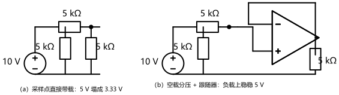
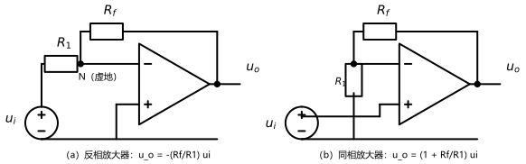
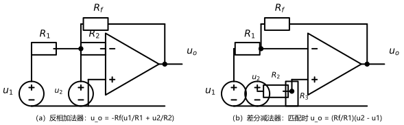

# 第 08 讲：含运算放大器的电阻电路

> **前置**：第 01–07 讲（建模语言；等效变换；回路法与结点法；叠加/替代；戴维南/诺顿与最大功率）。
> **预计时间**：约 3 小时（含作业）。
>
> **一句话定位**：电路里第一次出现"芯片级"器件——**运算放大器**。它在电路分析里的全部用法浓缩成两句话：**虚短、虚断**。学会这两句，反相/同相/加法/减法四类电路的公式**不用背、当场推**。
>
> **本讲回答什么**：
> 1. 理想运放是个什么模型？为什么敢假设增益无穷大？
> 2. "虚短"和"虚断"是什么？为什么可以直接拿来用？
> 3. 增益无穷大不会失控吗？输出怎么没飞到天上？
> 4. 反相/同相/加法/减法四类电路，公式要背还是能现推？
> 5. 虚短虚断什么时候失效？正反馈会怎样？
>
> **这一讲有真实验证**：四类电路的"虚短虚断解 vs 有限增益直接解线性方程"逐一对照（A = 10²…10⁶ 误差表、虚短残余 µV 级）、饱和警示、缓冲演示（3.33 V vs 5 V）——脚本 `scripts/lec08-01_verify_opamp_ideal.py` 与 `scripts/lec08-02_verify_opamp_circuits.py`。全部零残差，作业数字全部脚本预验证。

## 本讲怎么走（脉络图）

```
引子：03 讲的"分压器带载塌陷"再登场——这次请一位"缓冲员"把它治好
  │
  ├─ 1. 理想运放：是什么、三个理想化、为什么敢 A -> 无穷大
  ├─ 2. 虚短虚断：两条金律、来源推导、负反馈为什么不会失控
  ├─ 3. 四类基本电路：跟随/反相/同相/加法/减法（公式全部现推）
  ├─ 4. 适用边界：饱和、开环/正反馈、非理想细节（认识层）
  └─ 常见误区 → 本讲小结 → 掌握度自测 → 作业
```

> 下一站：§引子。先看一个"老熟人翻车、新器件救场"的现场。

---

## 引子：让采样点"接什么负载都不掉"

第 03 讲的引子里，分压器一带载就塌（开路 5 V、接上负载掉到 3.33 V——数值在本讲脚本里复算核实）。工程上这很恼人：**分压出来的"基准电压"，谁来取用都会把它压垮**。

能不能让采样点"接任何负载都不掉"？能——图 1 就是答案的"成品形态"：分压器后面跟一个**跟随器**，负载上稳稳拿到 5 V，而分压器自身一点电流都不用出。



> **图 1 怎么读**：（a）采样点直接带 5 kΩ 负载：并行分流，5 V 塌成 3.33 V；（b）信号链：空载的分压器（只输出"电压信息"，不出电流）→ 跟随器 → 负载。跟随器像一个"电压复印员"：把输入端的电压原样复制到输出端去驱动负载，两条电路的负载上都是 5 V。

三角形符号里的东西就是**运算放大器**（简称运放）。它是怎么把"复印"做成免费的？先拆零件——§1 认识它。

---

## 1. 理想运放

### 1.1 它是什么：一只"高增益差动放大器"

照器件结构直说（本课程够用的最小版本）：运放有两个输入端——**反相输入端（−）**和**同相输入端（+）**——和一个输出端。它的"档案"是：

$$u_o = A\,(u_+ - u_-)$$

其中 $A$ 叫**开环增益**，真实器件里是 $10^5 \sim 10^6$ 量级。**它放大的是两个输入端的"差"**——所以叫差动放大器。注意符号约定：输出对"$u_+ - u_-$"取正——这也是画电路时"− 端在符号上方"的惯例来源。

**要不要给运放供电？** 要（真实器件有电源端）。但本课程只分析**未饱和的线性区**，电源端在图上一律省略——它只在 §4 的边界讨论里出场。

### 1.2 三个理想化，一个比一个大胆

| 理想化 | 含义 | 现实对应 |
|---|---|---|
| $A \to \infty$ | 增益无穷大 | 真实值 $10^5 \sim 10^6$，大到"当无穷用" |
| 输入电阻 $\to \infty$ | 两个输入端**不取电流** | 真实值 MΩ~GΩ 级 |
| 输出电阻 $\to 0$ | 输出端是理想电压源 | 真实值几十 mΩ~Ω 级 |

**为什么敢说 $A \to \infty$？** 看脚本实测的"误差收缩表"（反相放大器，理想输出 −5 V）：

| $A$ | $10^2$ | $10^3$ | $10^4$ | $10^5$ | $10^6$ |
|---|---|---|---|---|---|
| 实际输出 / V | −4.5045 | −4.9456 | −4.9945 | −4.99945 | −4.999945 |
| 相对误差 | 9.9% | 1.09% | 0.11% | 0.011% | 0.0011% |

真实器件落在这张表的右端——**当无穷大用，只欠 0.01% 以内的账**；而"当无穷大"换来的是 §2 那两条好用到不真实的金律。这笔买卖，稳赚。

### 1.3 一次性把符号问题说清

- "− / +" 标注的是**输入端**，不是电源极性；分压、反馈等一切后续计算都围绕这两个端点；
- 输出端电压永远是相对**本电路的参考点**而言（01 讲的老规矩）；
- 运放**不是**独立源——它要从电源端吃能量来供输出，所以它分类上属于"受控源家族"的亲戚（输出被输入差控制），只是增益大得多。

> **态度表（理想运放部分）**
>
> | 内容 | 态度 |
> |---|---|
> | $u_o = A(u_+ - u_-)$ 与"差动放大" | **能复述** |
> | 三个理想化 + 误差表的意义 | 能说清"为什么敢无穷大"（0.01% 的账） |
> | "运放不是独立源" | 记住即可（受控源亲戚） |
>
> 下一站：金律登场——§2。

---

## 2. 虚短与虚断

### 2.1 两条金律

> **金律一（虚断）**：流入两个输入端的电流为零：$i_+ = i_- = 0$。
> 来源：输入电阻 $\to \infty$——"看着像断开"。
>
> **金律二（虚短）**：两个输入端的电位相等：$u_+ = u_-$。
> 来源：$A \to \infty$ + **负反馈** + 未饱和——"看着像短接"。

**"虚"字的双重含义**（这词起得刁）：两条合起来看——**电位相等（像短接，其实中间既没电阻也不通电流）**、**不取电流（像断开，其实两端电位被牢牢锁在一起）**。"虚短"是**电压约束**，"虚断"是**电流约束**——两条金律互为补充，缺一不可。

### 2.2 虚短从哪来：一行推导 + 一个实测

从档案出发：$u_+ - u_- = \dfrac{u_o}{A}$。右端是"有限的输出 ÷ 无穷大的增益"——**趋近于零**。所以 $u_+ \approx u_-$。

**注意"≈"的距离**：脚本实测（反相放大器，$A = 10^5$、输出 −5 V）：输入端的电位差残余 $\approx 0.05\ \mathrm{mV}$——不是严格 0，是**微伏~几十微伏级的"挤在一起"**。电路题里按 0 处理，误差远小于电阻容差。

**但推导里藏着一个前置条件**：输出 $u_o$ 是**有限的**。这一条什么时候不成立？输出被推到电源轨（饱和）的时候——§4 细说；而"输出为什么不会自己飞走"，靠的是负反馈——§2.3。

### 2.3 负反馈：无穷大增益为什么不是灾难

问题很合理：$A = 10^6$，输入端但凡差 1 mV，输出就是 1000 V——怎么没炸？

**因为输出被"反馈"回来盯着输入端**。以反相放大器为例，想象平衡被扰动的瞬间：

- 若 $u_-$ 微微高于 $u_+$：输出因负增益**急剧下降** → 经反馈电阻把 $u_-$ 往下拉 → 差值缩小；
- 若 $u_-$ 微微低于 $u_+$：输出急剧上升 → 把 $u_-$ 往上抬 → 差值缩小。

哪里都是"拉回"——系统自动停在 $u_+ = u_-$ 附近的那一点上。**增益越大，"拉回"越猛烈，平衡越精确**——无穷大增益不是灾难，而是一台"把输入差伺服到零"的**伺服放大器**：它把输出的大小交给**外部反馈网络**（$R_f$、$R_1$ 们）说了算，自己只负责"盯住零差"。

**反面清单（金律的签证条件，§4 展开）**：

- **负反馈**：输出必须经网络回连到 **− 端**；开环或接成正反馈 → 输出顶到电源轨 → 虚短失效；
- **未饱和**：输出还在"线性区"里，没有顶到电源轨。

> **态度表（虚短虚断部分）**
>
> | 内容 | 态度 |
> |---|---|
> | 两条金律 + "虚"字双关 | **能默写、能解释** |
> | 虚短的推导（$u_o/A \to 0$）与实测残余（0.05 mV） | 能复述；知道"≈不是 =" |
> | 负反馈伺服图景 | **能讲给同学听**（扰动 → 拉回 → 平衡） |
> | 签证条件（负反馈 + 未饱和） | 记住；知道开环/正反馈的结果 |
>
> 下一站：拿着两条金律去推四类电路——§3。

---

## 3. 四类基本电路（外加一位"零号成员"）

### 3.0 解题模板：运放电路四步

运放电路不需要任何新方法——**两条金律 + 结点法**就够了。标准姿势：

1. **标**：标出两个输入端所在的结点（记作 N 与 P）与待求量；
2. **虚断**：对 N、P 写 KCL——**运放不取电流**，所以流入电阻网络的电流全部流过电阻；
3. **虚短**：用 $u_N = u_P$ 把两个结点电位挂钩（通常有一个由分压或直接接地定下来）；
4. **解**：联立解出输出与输入的关系——公式到此"自己长出来"。

以下五个电路全部照此执行，**没有一个公式需要背**。

### 3.1 电压跟随器（引子收尾）

**电路**：输出端直接回连到 − 端，输入从 + 端进（图 1b 的三角形部分）。

**推导**：虚短：$u_- = u_+$；而输出端就接在 − 端上——所以 $u_o = u_+ = u_i$。**一行完事**。

**数值**：引子里分压器输出 5 V，跟随器输出 5 V，负载上 5 V——而分压器只被"看了一眼"（虚断：0 A），塌陷被彻底隔离。

**理解角度**：跟随器收益是"**1 倍电压、∞ 倍电流能力**"——电压信息原样搬运，驱动负载的电流由运放从电源端掏。它的名字：**缓冲器（buffer）**。

### 3.2 反相放大器

**电路**：$u_i$ 经 $R_1$ 进 − 端（N），+ 端接地，$R_f$ 从 N 接到输出。



> **图 2 怎么读**：（a）反相组态：输入经 $R_1$ 到 N（− 端），$R_f$ 反馈；（b）同相组态：输入直接进 + 端，$R_1$（从 − 端到地）与 $R_f$ 构成反馈分压。

**推导**：虚短：$u_N = u_P = 0$（+ 端接地）——N 点电位被**钉在 0 V，但它不是地**（下段详说）。于是 $R_1$ 上的电流 $i = u_i/R_1$（从左流进 N）；虚断说 N 点不"漏"电流，这股电流**只能整条流过 $R_f$**：

$$u_o = u_N - i\,R_f = 0 - \frac{u_i}{R_1}R_f \quad\Rightarrow\quad \boxed{\frac{u_o}{u_i} = -\frac{R_f}{R_1}}$$

**数值**：$R_f/R_1 = 10$、$u_i = 0.5\ \mathrm{V}$ → $u_o = -5\ \mathrm{V}$（脚本实测；有限增益 $10^5$ 时 −4.99945 V）。

**"虚地"是什么**：N 点电位是 0 V（像接地），但——① 电流**不进口** N 点（它流去了输出），② 这 0 V 是**运放伺服维持出来的**，而不是"接"出来的。地是"接"的，虚地是"看住"的——这就是 §2.3 伺服图景的具体化。

**输入电阻**：从信号源看进去就是 $R_1$（N 点被钉在 0，$R_f$ 那侧"看不见"）——这是反相组态的特点：**输入阻抗可以做得很低**（信号源要出电流）。

### 3.3 同相放大器

**电路**：$u_i$ 直接进 + 端；$R_1$ 从 − 端到地、$R_f$ 从 − 端到输出（构成反馈分压）。

**推导**：虚短：$u_N = u_P = u_i$。虚断：$R_1$ 与 $R_f$ 上流过**同一股电流**（N 点不漏流），于是这构成一条分压链：

$$u_N = u_o\,\frac{R_1}{R_1+R_f} \;=\; u_i \quad\Rightarrow\quad \boxed{\frac{u_o}{u_i} = 1 + \frac{R_f}{R_1}}$$

**数值**：$R_f/R_1 = 9$、$u_i = 0.3\ \mathrm{V}$ → $u_o = 3\ \mathrm{V}$（脚本实测；有限增益 $10^5$ 时 2.9997 V）。

**特点**：输入电阻 $\to \infty$（信号直接进输入端，虚断）——**信号源不出电流**，但代价是增益永不为零且符号为正（不能反向）。

### 3.4 反相加法器

**电路**：多条输入支路（$u_1$ 经 $R_1$、$u_2$ 经 $R_2$……）都汇到 N 点，$R_f$ 反馈。



> **图 3 怎么读**：（a）加法器：两路电流在虚地 N 点直接相加（互不串扰），再整条流过 $R_f$；（b）减法器：$u_2$ 经 $R_2$/$R_3$ 分压给出 $u_P$，$u_1$ 经 $R_1$ 走反相通道——两只"手"在输出端相减。

**推导**：虚短：$u_N = u_P = 0$（虚地）。**虚地使各路互不干扰**——每路电流只由"自己的源 ÷ 自己的电阻"决定：

$$u_o = -R_f\left(\frac{u_1}{R_1} + \frac{u_2}{R_2}\right)$$

**数值**：$R_f = 2\ \mathrm{k\Omega}$、$(u_1, R_1) = (0.5, 1)$、$(u_2, R_2) = (0.4, 2)$ → $u_o = -1.4\ \mathrm{V}$（脚本实测）。

**理解角度**：加法器 = "**电流求和器**"——各支路电流独立注入虚地点，求和后经 $R_f$ 转成电压。加权（对不同 $R_k$）免费获得。这也是工程里"信号混合"的标准姿势。

### 3.5 差分（减法）放大器

**电路**：$u_1$ 经 $R_1$ 进 N、$R_f$ 反馈；$u_2$ 经 $R_2$ 进 P、$R_3$ 从 P 到地。

**推导**（四步走全）：虚断使 P 点分压成立：$u_P = u_2\dfrac{R_3}{R_2+R_3}$；虚短给出 $u_N = u_P$；对 N 列 KCL（$(u_1-u_N)/R_1 = (u_N-u_o)/R_f$）解出一般式，再代入——**当匹配条件**

$$\frac{R_3}{R_2} = \frac{R_f}{R_1}$$

时，式子化简成干净的结果：

$$\boxed{u_o = \frac{R_f}{R_1}\,(u_2 - u_1)}$$

**数值**：$R_3/R_2 = R_f/R_1 = 2$、$u_1 = 0.3$、$u_2 = 1.1$ → $u_o = 1.6\ \mathrm{V}$（脚本实测：有限增益解 1.599952 V，uP = uN = 0.733 V）。

**必须敲死的边界**：**匹配条件不满足时，上述公式作废**——本轮数值实验里第一次把电阻配错（$R_3/R_2$ 配成了 1/2），理想输出立刻从 1.6 V 变成 0.1 V。这是减法器最著名的坑（见常见误区 4）。

**叠加视角一句话**（06 讲客串）：$u_1$ 走反相通道贡献负项，$u_2$ 走分压+同相通道贡献正项——两个贡献在输出端相加即得差。**共模信号**（$u_1 = u_2$ 的部分）被匹配条件成对消掉——这正是差分放大器在测量里的价值。

### 3.6 五合一小结表

| 电路 | 闭环公式 | 输入电阻 | 一句话性格 |
|---|---|---|---|
| 跟随器 | $u_o = u_i$ | $\infty$ | 复印电压、放大电流（缓冲） |
| 反相 | $u_o = -\dfrac{R_f}{R_1}u_i$ | $R_1$ | 可大可小、带负号 |
| 同相 | $u_o = \left(1+\dfrac{R_f}{R_1}\right)u_i$ | $\infty$ | 不带负号、不取信号电流 |
| 加法 | $u_o = -R_f\sum\dfrac{u_k}{R_k}$ | $R_k$（各支路） | 电流求和、可加权 |
| 减法 | $u_o = \dfrac{R_f}{R_1}(u_2-u_1)$（匹配时） | $R_1$ / $R_2+R_3$ | 取差、消共模 |

> **态度表（四类电路部分）**
>
> | 内容 | 态度 |
> |---|---|
> | 解题四步模板 | **能默写、可闭眼执行** |
> | 五个电路公式的下标来源 | **每个都能现推**（拒背，只记"虚短虚断"） |
> | 虚地与真接地的两个区别 | 能讲清（电流不进、伺服维持） |
> | 减法器匹配条件 | **能默写**；知道失配的后果（1.6 → 0.1 V） |
>
> 下一站：金律什么时候失灵——§4。

---

## 4. 适用边界

### 4.1 饱和：输出顶到电源轨

理想模型里输出可以任意大——**真实运放被电源轨卡住**。脚本警示例：反相组态增益 −10、输入 2 V → 理想输出 −20 V，而电源是 ±12 V——**实际输出钳在 −12 V 附近**。

饱和的连锁反应：输出不再是"$A \times$ 输入差"（顶死了），**伺服回路断开 → 虚短失效**——这时候再用四类公式就是错上加错。考试中的"陷阱题"常在这里设伏。

### 4.2 开环与正反馈

- **开环**（输出不回接）：虚短不成立——这正是比较器的用法（本来就要"顶到轨"）；
- **正反馈**（回接到 + 端）：扰动被放大而非拉回——输出也顶到轨。

**判断口诀**：**先看回接连到哪个端**——连到 − 端（负反馈）才配谈虚短；连到 + 端或没连，直接判"输出顶轨"。

### 4.3 非理想细节（认识层）

真实器件还有三件小事（知道名字即可，工程课细学）：**输入偏置电流**（虚断说 0，实际 pA~nA 级）、**带宽限制**（增益随频率下降——高频时模型要打折）、**失调电压**（输入端固有 mV 级偏差）。**结论**：理想模型在"负反馈 + 未饱和 + 不太高频"三条都满足时放心用；有疑问按 §1.2 的账本估算误差。

（另：运放还有"非线性用法"（对数、整流……）与"非线性是另一回事"的边界——第 25 接口讲指路。）

> **态度表（边界部分）**
>
> | 内容 | 态度 |
> |---|---|
> | 饱和的机制与后果（虚短失效） | **能讲清因果链** |
> | 开环/正反馈的判断口诀 | 会用（先看回接端） |
> | 非理想细节三个名字 | 混个脸熟即可 |

---

## 常见误区（本节零新知识，只破误）

> 以下每条只是"对答案 + 校准"，没有新知识——每一句都已在正文系统小节里教过。

1. **"虚短就是真的短接"**（§2.1、§2.2）。错。电位相等但可留 µV~几十 µV 残余；且"短接"意味着可以走任意电流——虚短两端**恰恰不流运放电流**（虚断）。
2. **"虚断就是输入端断开、没有回路"**（§2.1）。错。虚断只说"运放不取电流"——外部电阻回路照常有电流（反相放大器里输入电流经 $R_1$、$R_f$ 全程走电阻）。
3. **"接上运放就有虚短"**（§2.3、§4）。错。虚短的签证条件：**负反馈 + 未饱和**；开环或正反馈时输出顶到电源轨，虚短失效。
4. **"减法器公式 $u_o = (R_f/R_1)(u_2-u_1)$ 无条件成立"**（§3.5）。错。**必须匹配** $R_3/R_2 = R_f/R_1$；失配时 u2 路等效增益被改变（本轮实测：配错后理想输出 1.6 → 0.1 V）。
5. **"反相放大器的输入电流被运放吃掉了"**（§3.2）。错。虚断：电流经 $R_1$ → N → $R_f$ → 输出**全程走电阻**；运放"吃"的是电源端的能量，不是信号电流。
6. **"饱和后公式照用，只是数值大一点"**（§4.1）。错。输出钳位后伺服断开、虚短失效——公式整个作废（−20 V 的"理想值"在 ±12 V 电源下根本不存在）。

---

## 本讲小结

一页纸的骨架：

- **理想运放**：$u_o = A(u_+ - u_-)$；三个理想化（$A \to \infty$、输入电阻 $\to \infty$、输出电阻 $\to 0$）；误差收缩表：$A = 10^5$ 时只欠 0.01% 以内。
- **两条金律**：**虚断**（$i_+ = i_- = 0$）+ **虚短**（$u_+ \approx u_-$，签证：负反馈 + 未饱和）；"虚"= 电位相等但不走电流、看着断开却锁在一起。
- **负反馈伺服**：扰动 → 急剧拉回 → 平衡在零差上；增益无穷大 = 把差伺服到零的机器，输出大小由反馈网络决定。
- **解题四步**：标 → 虚断列 KCL → 虚短挂钩 → 解。五个电路公式全部现推：
  - 跟随 $u_o = u_i$；反相 $-R_f/R_1$（**虚地**：电位 0、电流不进、伺服维持）；同相 $1+R_f/R_1$（输入电阻 ∞）；加法 $-R_f\sum u_k/R_k$；减法 $(R_f/R_1)(u_2-u_1)$（**匹配** $R_3/R_2 = R_f/R_1$）。
- **关键数值**：−5.0 V（残余 uN = 0.05 mV）；1.4 V 加法；1.6 V 减法（失配 → 0.1 V 反例）；缓冲 3.33 V vs 5 V；饱和 −20 V > ±12 V 警示。
- **边界**：饱和（虚短失效）、开环/正反馈（输出顶轨）、非理想三件（偏置电流/带宽/失调——认识层）。

## 掌握度自测

- [ ] 我能写出理想运放的档案与三个理想化，并解释"为什么敢无穷大"。
- [ ] 我能默写两条金律、说出各自来源与签证条件。
- [ ] 我能讲清负反馈伺服图景（扰动 → 拉回 → 平衡）。
- [ ] 我能默写四步模板，并现场推出反相与同相的公式。
- [ ] 我能解释"虚地"与真接地的两个区别。
- [ ] 我能推出加法器公式，并说出为什么各路互不干扰。
- [ ] 我能写出减法器匹配条件，并复述失配反例（1.6 → 0.1 V）。
- [ ] 我能说出饱和的因果链（顶轨 → 伺服断 → 虚短失效）。
- [ ] 我能用"先看回接端"判断负反馈/正反馈/开环。
- [ ] 我能复跑 `scripts/lec08-01` 与 `lec08-02`，并解释输出里每一个数字。

## 作业

> 答案只能用**已教概念**（本讲范围：理想运放模型与三个理想化、虚短/虚断与来源、负反馈伺服、解题四步、五类电路推导、虚地、匹配条件、饱和与边界；结点法、叠加/替代、戴维南等承接第 01–07 讲）。先独立做，再对答案。

### 基础

**Q1. 概念辨析**：判断下列说法对不对，并给一句话理由。

(a) "虚短意味着两个输入端可以流过任意大的电流。"
(b) "虚断意味着输入端外部没有电流回路。"
(c) "只要电路里画了运放，就可以直接用虚短列方程。"
(d) "减法器公式 $u_o = (R_f/R_1)(u_2-u_1)$ 对任意电阻取值都成立。"
(e) "运放增益无穷大，所以输入端差 1 mV 时输出真的会到 1000 V。"

**参考答案**：

(a) 错。虚短是"电位约束"——两端电位近似相等（可留 µV 级残余），但运放输入端**不取电流**（虚断）；能过电流的是真实短路线。
(b) 错。虚断只说运放"不取电流"；外部电阻回路的电流照常流动（反相放大器全程 $R_1$→$R_f$）。
(c) 错。虚短的签证条件：负反馈 + 未饱和；开环或正反馈时输出顶电源轨，虚短失效。
(d) 错。必须匹配 $R_3/R_2 = R_f/R_1$；失配时公式作废（实测反例：1.6 V → 0.1 V）。
(e) 错。输出被电源轨钳位——伺服断开、虚短失效；"1000 V"只是一个不存在的理想值。
验算：五小题各回一个机制词：约束分工 / 电流去向 / 签证条件 / 匹配 / 电源轨。

**Q2. 计算·反相放大器**：$R_1 = 2\ \mathrm{k\Omega}$、$R_f = 10\ \mathrm{k\Omega}$、$u_i = 0.4\ \mathrm{V}$。求 $u_o$、输入电流与输入电阻；并指出 N 点电位。

**参考答案**：

$u_o = -(10/2)\times 0.4 = -2\ \mathrm{V}$；输入电流 $= u_i/R_1 = 0.2\ \mathrm{mA}$；输入电阻 $= R_1 = 2\ \mathrm{k\Omega}$；N 点电位 = 0 V（虚地——电位为 0、电流不进口）。
验算：电流路径 $R_1$→N→$R_f$→输出，全程无分流；$|u_o| = i\times R_f = 0.2\ \mathrm{mA}\times 10\ \mathrm{k\Omega} = 2\ \mathrm{V}$ ✓。

**Q3. 计算·同相放大器**：$R_1 = 2\ \mathrm{k\Omega}$、$R_f = 8\ \mathrm{k\Omega}$、$u_i = 0.6\ \mathrm{V}$。求 $u_o$ 与反馈结点的电位。

**参考答案**：

$u_o = (1+8/2)\times 0.6 = 3\ \mathrm{V}$；反馈结点（− 端）电位 $= u_i = 0.6\ \mathrm{V}$（虚短）。
验算：分压链 $u_- = u_o\times R_1/(R_1+R_f) = 3\times 2/10 = 0.6$ ✓ 与 $u_i$ 相等（虚短自洽）。

**Q4. 计算·加法器**：$R_f = 3\ \mathrm{k\Omega}$；$u_1 = 0.3\ \mathrm{V}$ 经 $R_1 = 1\ \mathrm{k\Omega}$、$u_2 = 0.9\ \mathrm{V}$ 经 $R_2 = 3\ \mathrm{k\Omega}$。求 $u_o$。

**参考答案**：

$u_o = -3\,\mathrm{k}\left(\dfrac{0.3}{1\,\mathrm{k}} + \dfrac{0.9}{3\,\mathrm{k}}\right) = -(0.9+0.9) = -1.8\ \mathrm{V}$。
验算：两路电流 0.3 mA + 0.3 mA = 0.6 mA 全部流过 $R_f$；$u_o = -0.6\,\mathrm{mA}\times 3\,\mathrm{k} = -1.8$ ✓。

### 提高

**Q5. 计算·减法器**：$R_1 = 1\ \mathrm{k\Omega}$（$u_1$→N）、$R_f = 3\ \mathrm{k\Omega}$、$R_2 = 2\ \mathrm{k\Omega}$（$u_2$→P）、$R_3 = 6\ \mathrm{k\Omega}$（P→地）；$u_1 = 0.2\ \mathrm{V}$、$u_2 = 0.9\ \mathrm{V}$。先验匹配条件，再求 $u_o$。

**参考答案**：

匹配检查：$R_3/R_2 = 3 = R_f/R_1$ ✓ 成立，可直接用公式：$u_o = 3\times(0.9-0.2) = 2.1\ \mathrm{V}$。
四步验证：$u_P = 0.9\times 6/8 = 0.675\ \mathrm{V} = u_N$；经 $R_1$ 电流 $=(0.2-0.675)/1\,\mathrm{k} = -0.475\ \mathrm{mA}$（实际方向为从 N 流向 $u_1$）；$u_o = u_N - i R_f = 0.675 + 0.475\times 3 = 2.1\ \mathrm{V}$ ✓。
验算：两法一致。

**Q6. 计算·有限增益对照**：对 Q2 的电路，若运放增益 $A = 10^4$：求 $u_N$ 残余与 $u_o$（用 $u_N = u_i\,R_f/(R_f + R_1(1+A))$、$u_o = -A\,u_N$），并与理想值比较。

**参考答案**：

$u_N = 0.4\times 10\,\mathrm{k}/(10\,\mathrm{k} + 2\,\mathrm{k}\times 10001) \approx 0.19988\ \mathrm{mV}$；
$u_o = -10^4\times 0.19988\,\mathrm{mV} \approx -1.9988\ \mathrm{V}$（理想 −2 V，误差 1.2 mV ≈ 0.06%）。
验算：误差量级 $u_o/A \approx 0.2\ \mathrm{mV}$ 与 $u_N$ 一致 ✓（虚短"残余"的账本）。

**Q7. 概念·虚地辨析**：说明"虚地"与"真接地"的两个区别，并解释：为什么反相放大器的输入电阻就是 $R_1$？

**参考答案**：

区别一：**电流去向**——真接地点"吃掉"电流（进地）；虚地点**不进口**任何运放电流，所有电流绕行 $R_f$。区别二：**维持机制**——真接地的 0 V 是"接"出来的（硬连接）；虚地的 0 V 是运放伺服"看住"的（负反馈 + 高增益维持），一旦饱和/开环就塌。
输入电阻：N 被钉在 0 V（虚地），从信号源看进去，$R_1$ 右端是"不会动的 0"——所以等效电阻就是 $R_1$；$R_f$ 那侧（虚地到输出）不参与信号源回路的阻抗。
验算：对照 §3.2 与 §2.3 逐条回看。

### 综合

**Q8. 开放·选型与应用**：给四个场景各选一种电路（五类中选）并说明理由：(1) 把高阻抗传感器的电压"无损"送给低阻负载；(2) 把两路信号按 2:1 权重混合；(3) 测量电桥两臂之间的电压差、且要消掉共模；(4) 需要把一个正电压变成负电压（系数可调）。最后总结一条"你会在什么场合想起运放"的判断。

**参考答案**（要点）：

(1) **跟随器**——输入电阻 ∞（不取传感器电流）、输出为理想压源（带得动负载）；
(2) **反相加法器**——各路权重 = $R_f/R_k$（2:1 配电阻比即可）；
(3) **减法器**——匹配后共模成对消、只留差；
(4) **反相放大器**——符号反转 + 系数 $R_f/R_1$ 连续可调。
总结：凡遇到"**阻抗不匹配/需要信号组合或差分/需要精确比例与符号**"的信号处理问题，先想五类电路能不能对号入座；并记得核对边界（负反馈、未饱和、减法器匹配）。
验算：四个场景与 §3.6 对照表逐行核对，能一一对应即达标。

---

*下一讲预告：第 09 讲《电容与电感》——到此为止，电路里的元件都"没有记性"（电阻的电流只看此刻的电压）。是时候请出两位"记忆元件"：它们的伏安关系里出现**变化率与累积**，电路分析将从代数方程走向微分方程——动态电路的序幕拉开。*