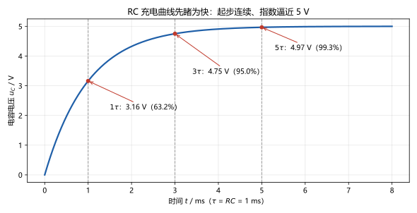
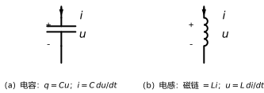

# 第 09 讲：电容与电感

> **前置**：第 01–08 讲（建模语言；等效变换；回路法与结点法；叠加/替代；戴维南/诺顿；运放）。
> **预计时间**：约 3 小时（含作业）。
>
> **一句话定位**：前八讲的电路里只有两类"没有记性"的元件（电阻）和"只管推力"的源。这一讲请出第三类——**记忆元件**：它们的伏安关系里出现"变化率/累积"，电路方程将从代数方程走向微分方程。动态电路的一切奇怪行为（充放电、突变与否），从本讲开始有根有据。
>
> **本讲回答什么**：
> 1. 为什么需要"记忆元件"？它们和电阻本质差在哪？
> 2. 电容电流为什么正比于电压的"变化率"？"电压不能突变"是谁规定的？
> 3. 电感和电容的公式一一对应——"对偶"要怎么用？
> 4. "电压不能突变"严谨吗？有没有例外？
> 5. 储能怎么算？能量在电容电感里怎么进怎么出？
> 6. "电容通交流阻直流"——这话到底什么条件下对？
>
> **这一讲有真实验证**：RC 充电数值积分入门（与解析解对照，最大偏差 9×10⁻⁴ V）、能量验证（充电全程"对半分"：12.5 µJ 存 + 12.5 µJ 发热）、串并联等效验证、换路瞬间连续性演示、作业数字全部预验证——脚本 `scripts/lec09-01_verify_lc_basics.py`。

## 本讲怎么走（脉络图）

```
引子：第三类元件登场——"记忆"从哪来？先睹为快一条充电曲线
  │
  ├─ 1. 电容：是什么、伏安关系与记忆属性、串并联
  ├─ 2. 电感与对偶：互为对偶的两个元件；串并联反过来
  ├─ 3. 能量：½Cu² 与 ½Li²；能量怎么进怎么出（对半分）
  ├─ 4. 连续性的条件："不能突变"是推论不是铁律
  ├─ 5. 口诀的正确打开方式："通交流阻直流"的完整版
  └─ 常见误区 → 本讲小结 → 掌握度自测 → 作业
```

> 下一站：§引子。先看两位新成员在工程里的两个例子。

---

## 引子：两位"有记性"的新元件

工程里的两个剪影：

- **相机闪光灯**：电池慢慢给一只电容充电（几秒），触发瞬间它把能量在毫秒级放出——**电容会"攒电"，还会"记"着自己攒了多少**；
- **继电器线圈**：断电瞬间线圈里的电流还想继续流（有时打出电火花）——**电感在"记住"自己的电流**。

它们和电阻的本质差别，一句话：**电阻的电流只看"此刻的电压"；而电容和电感的伏安关系里写着"变化率"——它们的行为依赖过去和现在的演变过程**。这就是"记忆元件"的含义，也是电路分析从此要变成微分方程的原因。

**先睹为快**：图 2 是本讲脚本数值积分出来的 RC 充电曲线（$R = 1\ \mathrm{k\Omega}$、$C = 1\ \mu\mathrm{F}$、电源 5 V）——从 0 起步**连续**爬升、指数式逼近 5 V。它为什么长这样、$\tau = RC$ 是什么，是第 10 讲的正题；现在只需要看一眼它的"脾气"：**起步不给惊喜（连续），终点慢慢到（渐进）**。



---

## 1. 电容

### 1.1 它是什么

**结构**：两片导体夹一层绝缘介质（介质可以是空气）。**行为**：加上电压 $u$，两片导体上就存下等量异号电荷 $q$。**定义式**（线性电容）：

$$q = Cu$$

$C$ 叫**电容**，单位**法拉**（F）；真实器件常用 $\mu\mathrm{F}$（$10^{-6}$）、$\mathrm{pF}$（$10^{-12}$）——1 F 是个巨大的量（早期"超级电容"才摸到它）。$q$-$u$ 是一条过原点的直线——**线性元件**，老规矩。



> **图 1 怎么读**：（a）电容符号（两片平行板）与 $i$、$u$ 的参考方向；伏安关系 $q = Cu$、$i = C\,du/dt$。（b）电感符号（线圈）与同样的参考方向；伏安关系：磁链 $\psi = Li$、$u = L\,di/dt$。两个符号形状像对照记：一个是"断开的板"，一个是"绕起来的线"。

### 1.2 伏安关系里的"记忆"：与电阻逐项对照

电容的**伏安关系**（怎么来的见 §1.3）：

$$i = C\frac{\mathrm{d}u}{\mathrm{d}t} \qquad(\text{微分形式}), \qquad u(t) = u(t_0) + \frac{1}{C}\int_{t_0}^{t} i\,\mathrm{d}t' \qquad(\text{积分形式})$$

对照电阻，差别一目了然：

| | 电阻 | 电容 |
|---|---|---|
| 伏安关系 | $u = Ri$（代数式） | $i = C\,du/dt$（微分式） |
| 记忆 | **无记忆**：电流只看此刻电压 | **有记忆**：积分形式里躺着"全部历史"（或初值） |
| 直流稳态 | 照常导通（$i = u/R$） | **电流为零**（电压不变 → $i = 0$） |
| 电流能否突变 | — | **能**（$du/dt$ 可以跳变） |
| 电压能否突变 | — | 见 §4（一般不能） |

"记忆"的精确含义：想知道此刻的电容电压，**要么知道它从某个时刻开始的全部充电史（积分），要么知道某个初值 + 之后的电流史**——电压值是"存"在元件里的一条信息。这正是 10 讲里"电路的**状态**"概念的起点。

### 1.3 伏安关系：为什么是"变化率"

推导只有两步：

1. **电流是电荷的流动率**：$i = \dfrac{\mathrm{d}q}{\mathrm{d}t}$（第 01 讲电流定义的微分版）；
2. 把定义式 $q = Cu$ 代入：$i = \dfrac{\mathrm{d}(Cu)}{\mathrm{d}t} = C\dfrac{\mathrm{d}u}{\mathrm{d}t}$（$C$ 为常数）。

（注：伏安关系式默认 $i$、$u$ 取**关联参考方向**——沿用 01 讲总规矩：关联方向下 $p = ui$ 为吸收；图 1 中的参考方向就是关联方向。）

**三个立刻可用的读法**：

- **电压不变 → 电流为零**：哪怕电压高达 1000 V，只要它**恒稳定**，电容电流就是 0——"看的是变化率，不是大小"（这是最常见的第一误解，见常见误区 5）；
- **同样的 $du/dt$，$C$ 越大电流越大**：大电容是"胃口更大"的元件——同样的充电速度要更大电流；
- **积分形式 = 记忆**：$u(t) = u(t_0) + \frac{1}{C}\int i\,\mathrm{d}t'$——"初值 + 之后的电流积分"。

**数值示范**（作业 Q2 预验证）：$C = 2\ \mu\mathrm{F}$，电压从 0 **线性**升到 10 V 用时 5 ms：$i = C\dfrac{\Delta u}{\Delta t} = 2\,\mu\mathrm{F} \times \dfrac{10}{5\,\mathrm{ms}} = 4\ \mathrm{mA}$（恒定！）；到达 10 V 后**保持**：$i = 0$。

### 1.4 串并联：全部"反着来"

- **并联**（同一电压、电荷加和）：$C_{eq} = C_1 + C_2 + \cdots$——相当于极板面积变大；
- **串联**（同一电流、电压加和）：$\dfrac{1}{C_{eq}} = \dfrac{1}{C_1} + \dfrac{1}{C_2} + \cdots$——相当于板距叠加。

**记忆锚**：**电容的串并联公式，按电阻的并串联抄**（对调串并）。数值（脚本实测）：$2\ \mu\mathrm{F}$ 并联 $3\ \mu\mathrm{F}$ = $5\ \mu\mathrm{F}$；串联 = $1.2\ \mu\mathrm{F}$。

> **态度表（电容部分）**
>
> | 内容 | 态度 |
> |---|---|
> | $q = Cu$、$i = C\,du/dt$（含积分形式） | **能默写**；符号：关联方向下直接写 |
> | "记忆"的精确含义（积分里躺历史） | **能讲清**；与电阻对照表能默画 |
> | 三个读法（不变率零电流/大 C 大电流/积分=记忆） | 会用；能现场算 Q2 型小题 |
> | 串并联"反着来" | **能默写、能一眼分辨** |
>
> 下一站：对偶的另一位——§2 电感与对偶。

---

## 2. 电感与对偶

### 2.1 它是什么

**结构**：导线绕成线圈。**行为**：电流 $i$ 流过时线圈里建立磁场，磁通链 $\psi$（把每圈的磁通加起来）与电流成正比（线性电感）：

$$\psi = Li$$

$L$ 叫**电感**（自感系数），单位**亨利**（H），常用 mH（$10^{-3}$）、$\mu\mathrm{H}$（$10^{-6}$）。

### 2.2 伏安关系：法拉第电磁感应

法拉第电磁感应定律：**磁通链随时间变化 → 线圈里产生感应电压**。代入 $\psi = Li$：

$$u = \frac{\mathrm{d}\psi}{\mathrm{d}t} = L\frac{\mathrm{d}i}{\mathrm{d}t} \qquad(\text{微分形式}), \qquad i(t) = i(t_0) + \frac{1}{L}\int_{t_0}^{t} u\,\mathrm{d}t' \qquad(\text{积分形式})$$

**三个对偶读法**（把电容那句里 $u \leftrightarrow i$ 对调）：

- **电流不变 → 电压为零**：稳恒直流下电感**像一根导线**（$u = 0$，短路！）——"电感对直流短路"是它的直流稳态特性；
- 同样的 $di/dt$，$L$ 越大电压越大；
- 积分形式：**电感"记住"的是自己的电流**（初值 + 电压积分）。

**数值示范**（作业 Q3 预验证）：$L = 5\ \mathrm{mH}$，电流从 0 线性升到 2 A 用时 4 ms：$u = L\dfrac{\Delta i}{\Delta t} = 5\,\mathrm{mH}\times 500 = 2.5\ \mathrm{V}$；电流保持后 $u = 0$。

### 2.3 对偶：对比着学元件

把电容的每条结论里做替换 $u \to i$、$i \to u$、$C \to L$、$q \to \psi$，就得到电感的结论——**对偶**：

| 维度 | 电容 | 电感 |
|---|---|---|
| 定义式 | $q = Cu$ | $\psi = Li$ |
| 伏安关系 | $i = C\dfrac{\mathrm{d}u}{\mathrm{d}t}$ | $u = L\dfrac{\mathrm{d}i}{\mathrm{d}t}$ |
| 记忆的是什么 | 电压（$u$ 的积分） | 电流（$i$ 的积分） |
| 串 | $\frac{1}{C_{eq}}=\sum\frac{1}{C_k}$ | $L_{eq} = \sum L_k$ |
| 并 | $C_{eq} = \sum C_k$ | $\frac{1}{L_{eq}}=\sum\frac{1}{L_k}$ |
| 储能（§3） | $\frac{1}{2}Cu^2$ | $\frac{1}{2}Li^2$ |
| 直流稳态特性 | 断路（$i = 0$） | 短路（$u = 0$） |
| 不能突变的量（§4） | 电压 | 电流 |

**用法**：学一个、推另一个——以后正文给电容的结论，电感的"对偶版"一句带过；考试推不出来的公式，先对偶再说。

### 2.4 串并联（延续"反着来"）

- **电感串联**（同一电流、电压加和）：$L_{eq} = L_1 + L_2 + \cdots$（**像电阻串联**）；
- **电感并联**（同一电压、电流加和）：$\dfrac{1}{L_{eq}} = \dfrac{1}{L_1} + \dfrac{1}{L_2} + \cdots$。

数值（脚本实测）：$2\ \mathrm{mH}$ 串联 $3\ \mathrm{mH}$ = 5 mH；并联 = 1.2 mH。**与电容正好镜像，与电阻则"串同并反"。**

> **态度表（电感与对偶部分）**
>
> | 内容 | 态度 |
> |---|---|
> | $\psi = Li$、$u = L\,di/dt$（含积分形式） | **能默写** |
> | "电感对直流短路"这一稳态特性 | **能脱口而出**（与电容"断路"配对） |
> | 对偶表 | **能默画**；能给任意电容结论的对偶版 |
> | 串并联数值 | 会用（含对偶核对） |
>
> 下一站：能量——两种元件把能量存哪儿、怎么进怎么出——§3。

---

## 3. 能量：两种元件把能量存哪儿

### 3.1 电容的能量

从功率关系推：$p = ui = u\cdot C\dfrac{\mathrm{d}u}{\mathrm{d}t}$，从 0 充到 $u$ 的累计能量：

$$w_C = \int_0^u Cu'\,\mathrm{d}u' = \frac{1}{2}Cu^2$$

**数值**（作业 Q5 预验证）：$C = 100\ \mu\mathrm{F}$、$u = 10\ \mathrm{V}$：$w_C = \frac{1}{2}\times 100\,\mu\mathrm{F}\times 10^2\ \mathrm{V}^2 = 5\ \mathrm{mJ}$。

**读法**：储能**只看当前电压**（状态量！）——"怎么充上来的"不影响此刻存量。这与 §1.2 的"记忆"并不矛盾：记忆说的是"电压值本身需要历史才能确定"；一旦确定，存量就是 $u$ 的一元函数。

### 3.2 电感的能量

对偶推导（或直接算：$p = ui = i\cdot L\dfrac{\mathrm{d}i}{\mathrm{d}t}$）：

$$w_L = \frac{1}{2}Li^2$$

**数值**：$L = 4\ \mathrm{mH}$、$i = 2\ \mathrm{A}$：$w_L = \frac{1}{2}\times 4\,\mathrm{mH}\times 4\ \mathrm{A}^2 = 8\ \mathrm{mJ}$。

### 3.3 能量怎么进、怎么出：可逆与"对半分"

**能量是可逆的**：理想电容电感**不消耗**能量——充电存进去、放电原样取出（闪光灯：充几秒、放毫秒）。它们叫**储能元件**（无源元件；能量面上永远 ≥ 0，也只能取出存进的那些）。

**但"充电过程"要路过电阻**——数值实验的一条漂亮结论（RC 充电全程，脚本实测）：

| 项目 | 数值 |
|---|---|
| 电源全程发出 | $C E^2 = 25\ \mu\mathrm{J}$ |
| 电容最终存下 | $\frac{1}{2}CE^2 = 12.5\ \mu\mathrm{J}$ |
| 电阻全程发热 | $12.5\ \mu\mathrm{J}$（数值积分） |

**充电全程"对半分"**——不管电阻多大（只影响快慢，不影响比例）；这是 RC 充电的宿命（工程上讲究"高效率充电"就要绕开这个"电阻直充"范式——属于电力电子的话题）。这一条 10 讲会再复盘。

**前瞻一句**：能量在电源与储能元件之间"来回搬运"的那部分（充一阵、放一阵、净值可能为零）——第 15 讲将把它正式命名为"无功功率"。

> **态度表（能量部分）**
>
> | 内容 | 态度 |
> |---|---|
> | $w_C = \frac{1}{2}Cu^2$、$w_L = \frac{1}{2}Li^2$ | **能默写、能现场算** |
> | "储能是状态量"与"记忆"的关系 | 能讲清两者不矛盾 |
> | 对半分（12.5 + 12.5 = 25 µJ） | 记住这个数字组合；知道"与电阻无关" |
> | 可逆/无源/无功前瞻 | 能复述方向 |
>
> 下一站：把"不能突变"说到严谨——§4。

---

## 4. 连续性的条件："不能突变"是推论，不是铁律

### 4.1 从伏安关系读出连续性

代入电容的伏安关系：若 $u_C$ 在某瞬间跳变 $\Delta u$，则 $\mathrm{d}u/\mathrm{d}t \to \infty$，于是

$$i = C\,\frac{\mathrm{d}u}{\mathrm{d}t} \to \infty$$

——**无穷大的电流**。现实电路里电流总是被电阻/电源能力限制为**有限值**，所以：

> **条件性结论**：只要电容电流是有限的（没有"冲激"），**电容电压就不能突变**——$u_C(0^+) = u_C(0^-)$。
> 对偶版：只要电感电压有限，**电感电流就不能突变**——$i_L(0^+) = i_L(0^-)$。

**注意是"推论"**：它不是独立的自然定律，而是"伏安关系 + 电流有限"两件事的直接后果。所以问"谁规定的"——没有谁规定，它是算出来的。

**数值演示**（脚本实测）：换路瞬间（$u_C$ 从 2 V 起充、$i_L = 2$ A 保持）：$u_C(0^+) = u_C(0^-) + 3\ \mathrm{mV}\cdot$量级的单步演化、$i_L(0^+) = i_L(0^-)$——**连续**。

### 4.2 严谨边界：什么时候会"例外"

**例外场景**（理想化边界的病态例）：把一只**理想电容直接并到理想电压源**上（中间没有任何电阻）——电压被源"按"着，电流是理论上的**冲激**（无穷大、瞬时、有限面积）。这时 $u_C$ 形式上"跳变"了。

**工程读法**：真实世界没有无穷大电流——有内阻、有导线电感、有 ESR，电流总归有限，**连续性照旧成立**。所以：**做题目用连续性（除非题目明摆着只给理想源硬接理想电容这种病态设定）；理解边界时记住"冲激"这个词**。

**方法预告**：第 10 讲的**换路定则**（$u_C(0^+) = u_C(0^-)$、$i_L(0^+) = i_L(0^-)$）就是本节结论的操作版——那里还会教你"0⁺ 等效电路"怎么画。

### 4.3 别把状态量和非状态量搞混

**能突变的**：电容**电流**（$du/dt$ 的斜率可以打折角）、电感**电压**（$di/dt$ 可以打折角）——它们不是"记忆"，随便跳。**不能突变的**：电容**电压**、电感**电流**——这**两个**是把历史扛在肩上的量（状态量）。

一句话操作口诀：**换路瞬间，只保"u_C 与 i_L"两条命**。

> **态度表（连续性部分）**
>
> | 内容 | 态度 |
> |---|---|
> | 连续性的推导（无穷电流/电压） | **能复述**；知道它是推论 |
> | 例外场景（冲激） | 混个脸熟；知道真实世界为何照旧连续 |
> | 状态量 vs 非状态量 | **能一眼分辨**（u_C、i_L 保命；i_C、u_L 随便跳） |
>
> 下一站：把口头禅校正到能用的版本——§5。

---

## 5. 一句口诀的正确打开方式

> **旧口诀**："电容通交流、阻直流。"

学完本讲，可以把它拆成能用的版本：

**逐字拆**：

- **"阻直流"**——稳态直流下电压恒定，$i = C\,du/\mathrm{d}t = 0$：电容**阻断的是电流**，不是电压！电容上可以稳稳地"存着"一个直流电压（这正是"隔直"的工程用法：把直流电平挡在门外、让交流信号通过）；
- **"通交流"**——交流电压一直在变，$du/\mathrm{d}t \ne 0$，于是有电流；频率越高、同样的电压变化越快，电流越大（定量版在第 13 讲：$i = C\omega u$ 的相量形式）。

**补上关键边界**："稳"字是关键——**开关瞬间的直流也要给电容充电**（暂态电流！）。所以完整版是：

> **电容阻断直流"稳态"，但直流"换路"的瞬间照样有大电流（充电/放电暂态）。**

**电感对偶版**："通直流、阻交流"——稳态直流下 $u = L\,di/\mathrm{d}t = 0$，电感**像导线**（短路，直流畅通）；交流下 $di/\mathrm{d}t$ 大、感应电压大，阻碍电流变化。**同样补边界**：换路瞬间的电流"想保持"，会产生高压反击（继电器的电火花就是它）。

| | 直流稳态 | 交流（快速变化） | 换路瞬间 |
|---|---|---|---|
| 电容 | 断路（$i=0$） | 导通（电流随频率增大） | 大电流充/放 |
| 电感 | 短路（$u=0$） | 高阻抗（阻碍变化） | 高压反击 |

> **态度表（口诀部分）**
>
> | 内容 | 态度 |
> |---|---|
> | 两个口诀的"稳态"限定词 | **能讲清**（阻的是电流/稳的是条件） |
> | 换路瞬间的两个"例外"（充电电流/反击电压） | 能各举一例（闪光灯/继电器） |
>
> 下一站：老规矩——把最容易混的六个地方钉死。

---

## 常见误区（本节零新知识，只破误）

> 以下每条只是"对答案 + 校准"，没有新知识——每一句都已在正文系统小节里教过。

1. **"电容阻直流 = 电容两端不能有直流电压"**（§5）。错。阻断的是**电流**；直流电压可以稳稳存在电容上（"隔直"隔的是通路，不是电位）。
2. **"电容电压不能突变是一条严格定律"**（§4）。不严谨。它是**条件性推论**：电流有限时成立；理想化病态场景（理想源硬接理想电容）理论上有冲激"例外"——真实世界无此电流。
3. **"电容电感会把能量消耗掉"**（§3）。错。它们是**储能**元件：充进取出、理想无损；"消耗"发生在电阻上（充电对半分的另一半）。
4. **"电容的串并联公式和电阻一样"**（§1.4）。恰好相反。电容**按电阻的并串联抄**（串的公式像电阻的并）；电感则"串同并反"。
5. **"$i = C\,du/dt$，所以电压越大电流越大"**（§1.3）。错。看的是**变化率**：1000 V 的恒定电压电流也是 0；10 V 的快速变化反而电流很大。
6. **"电容电流能突变，所以电容电压也能突变"**（§4.3）。错。**电流**可以突变（非状态量），**电压**不能（状态量扛历史）；电感正是"电流不能突变、电压能突变"的镜像。

---

## 本讲小结

一页纸的骨架：

- **电容**：$q = Cu$；伏安关系 $i = C\,du/dt$ 与积分形式 $u(t) = u(t_0) + \frac{1}{C}\int i\,\mathrm{d}t'$；**有记忆**（与电阻对照表）；直流稳态断路；串并联"按电阻的并串联抄"（2 并 3 = 5 µF，串 = 1.2 µF）。
- **电感**：$\psi = Li$；$u = L\,di/\mathrm{d}t$；记忆的是电流；直流稳态**短路**；串同并反（2 串 3 = 5 mH，并 = 1.2 mH）。
- **对偶表**：一个表管两个元件——$u\leftrightarrow i$、$C\leftrightarrow L$、串只并（对偶规律）。
- **能量**：$w_C = \frac{1}{2}Cu^2$（5 mJ@100µF/10V）、$w_L = \frac{1}{2}Li^2$（8 mJ@4mH/2A）；可逆、无源；**充电对半分**（25 = 12.5 + 12.5 µJ）；无功前瞻。
- **连续性**：$u_C$、$i_L$ 不能突变——**"伏安关系 + 有限性"的推论**；例外只在冲激式理想化场景；$i_C$、$u_L$ 可以突变（别混）。
- **口诀**：电容阻断直流**稳态**、直流换路瞬间仍要充放；电感对偶（稳态短路、换路反击）。数值：4 mA（2µF@5ms 斜坡）、2.5 V（5mH@4ms 斜坡）、充电曲线 1τ=63.2%、3τ=95.0%、5τ=99.3%。

## 掌握度自测

- [ ] 我能默写电容、电感的定义式与两种形式的伏安关系。
- [ ] 我能用"电荷流动率 + q=Cu"两步推出 $i = C\,du/dt$。
- [ ] 我能画电阻/电容对照表，并讲清"记忆"的精确含义。
- [ ] 我能默画对偶表，并把任意电容结论翻译成电感版。
- [ ] 我能默写四种串并联公式（C 串并、L 串并）并各算一个数值。
- [ ] 我能默写两个储能公式并现场计算（5 mJ/8 mJ 型小题）。
- [ ] 我能复述连续性推导，并说清"状态量 vs 非状态量"。
- [ ] 我能解释充电"对半分"（25 = 12.5 + 12.5）并且知道与电阻大小无关。
- [ ] 我能把"通交流阻直流"扩展成含换路瞬态的完整版，并说出电感版。
- [ ] 我能复跑 `scripts/lec09-01`，并解释输出里每一个数字。

## 作业

> 答案只能用**已教概念**（本讲范围：C/L 定义式与伏安关系（含积分形式）、记忆属性、串并联、对偶、储能、连续性条件、口诀与边界；KCL/KVL、参考方向、功率符号约定承接第 01–08 讲）。先独立做，再对答案。

### 基础

**Q1. 概念辨析**：判断下列说法对不对，并给一句话理由。

(a) "电容阻直流，所以电容两端不能有直流电压。"
(b) "电容电压不能突变是一条独立的自然定律。"
(c) "电容和电感在电路里工作久了，会把能量慢慢消耗掉。"
(d) "电容的串联公式和电阻的串联公式长得一样。"
(e) "由 $i = C\,du/dt$ 可知：电容两端电压越大，电流越大。"

**参考答案**：

(a) 错。阻断的是电流；直流电压可以稳稳存在电容上（"隔直"隔通路、不隔电位）。
(b) 错。它是"伏安关系 + 电流有限"的条件性推论；冲激式理想化场景理论上有例外。
(c) 错。储能元件、理想无损；消耗发生在电阻上（充电对半分里"发热的那一半"）。
(d) 错。电容按电阻的**并串联**抄——电容串联公式形如电阻的并联。
(e) 错。看**变化率**：恒定大电压电流为 0；决定电流的是 $du/dt$ 与 $C$。
验算：五小题各回一个机制词：隔流不隔压 / 推论 / 储能 / 反着抄 / 变化率。

**Q2. 计算·电容伏安关系**：$C = 2\ \mu\mathrm{F}$，电压从 0 线性升到 10 V 用时 5 ms，随后保持。求两个阶段的电流，并核对充电总电荷。

**参考答案**：

上升段：$i = C\Delta u/\Delta t = 2\,\mu\mathrm{F}\times 2\,\mathrm{kV/s} = 4\ \mathrm{mA}$（恒定）；保持段：$i = 0$。
电荷核对：$q = C u = 2\,\mu\mathrm{F}\times 10\,\mathrm{V} = 20\ \mu\mathrm{C}$；另一路：$q = i\Delta t = 4\,\mathrm{mA}\times 5\,\mathrm{ms} = 20\ \mu\mathrm{C}$ ✓。
验算：两路电荷一致。

**Q3. 计算·电感伏安关系（对偶练习）**：$L = 5\ \mathrm{mH}$，电流从 0 线性升到 2 A 用时 4 ms，随后保持。求两个阶段的电压。

**参考答案**：

上升段：$u = L\Delta i/\Delta t = 5\,\mathrm{mH}\times 500\,\mathrm{A/s} = 2.5\ \mathrm{V}$；保持段：$u = 0$（电感对恒定电流"短路"）。
验算：与 Q2 完全镜像（把 $C\to L$、$u\to i$ 对调）。

**Q4. 计算·串并联**：$2\ \mu\mathrm{F}$ 与 $3\ \mu\mathrm{F}$ 的串、并联各是多少？对偶：$2\ \mathrm{mH}$ 与 $3\ \mathrm{mH}$ 呢？

**参考答案**：

电容并联 $= 5\ \mu\mathrm{F}$；串联 $= \frac{2\times 3}{2+3} = 1.2\ \mu\mathrm{F}$。
电感串联 $= 5\ \mathrm{mH}$；并联 $= 1.2\ \mathrm{mH}$（正好与电容镜像）。
验算：两条记忆锚——电容"按电阻的并串联抄"；电感"串同并反"。

**Q5. 计算·储能**：$C = 100\ \mu\mathrm{F}$ 上存 10 V；$L = 4\ \mathrm{mH}$ 里流 2 A。各存多少能量？

**参考答案**：

$w_C = \frac{1}{2}\times 100\,\mu\mathrm{F}\times(10\,\mathrm{V})^2 = 5\ \mathrm{mJ}$；$w_L = \frac{1}{2}\times 4\,\mathrm{mH}\times(2\,\mathrm{A})^2 = 8\ \mathrm{mJ}$。
验算：代公式直算，注意单位（µF/V → mJ；mH/A → mJ）。

### 提高

**Q6. 概念·连续性执行**：某电路在 $t = 0$ 换路。换路前测得 $u_C(0^-) = 8\ \mathrm{V}$、$i_L(0^-) = 2\ \mathrm{A}$；换路后的电路里各电流、电压均为有限值。求 $u_C(0^+)$、$i_L(0^+)$，并说明依据；再各举一个"可以突变"的同类量。

**参考答案**：

$u_C(0^+) = 8\ \mathrm{V}$、$i_L(0^+) = 2\ \mathrm{A}$——依据连续性结论（伏安关系 + 电流/电压有限）：电容电压、电感电流不能突变。
可以突变的：电容**电流**（$i_C$，$du/dt$ 的折角）与电感**电压**（$u_L$，$di/dt$ 的折角）——非状态量。
验算：口诀"换路瞬间只保 $u_C$ 与 $i_L$ 两条命"。

**Q7. 计算·波形积分**：$C = 1\ \mu\mathrm{F}$，$u(0) = 0$。给它通入电流：0~2 ms 为 $+2\ \mathrm{mA}$，2~4 ms 为 $-2\ \mathrm{mA}$。求 $u(t)$ 的波形形状、峰值与 4 ms 时刻的值；$u$ 全程连续吗？

**参考答案**：

积分：0~2 ms：$u = \frac{1}{C}\int i\,\mathrm{d}t = \frac{2\,\mathrm{mA}\times 2\,\mathrm{ms}}{1\,\mu\mathrm{F}} = 4\ \mathrm{V}$（线性升）；2~4 ms：$u$ 从 4 V 线性降回 0。
波形：**三角波**（峰值 4 V）；$u(4\,\mathrm{ms}) = 0$；全程**连续**（分段线性，折点处不断）。
验算：总电荷进（$4\ \mu\mathrm{C}$）出（$4\ \mu\mathrm{C}$）平衡 ✓；峰谷与积分一致。

### 综合

**Q8. 开放·口诀与工程断言**：把"电容通交流阻直流"扩展成带条件的完整版；并解释：为什么"开关瞬间的直流"照样给电容充电？再对偶写出电感的完整版口诀并各配一个工程画面。

**参考答案**（要点）：

完整版：电容**阻断直流"稳态"**（$du/dt = 0 \Rightarrow i = 0$），但**直流换路瞬间**电压要变化、$du/dt \ne 0$，照样有大充/放电流（闪光灯：直流电池充电就是这一瞬态的延长版/周期性版）。
电感对偶版：**通直流稳态**（$di/dt = 0 \Rightarrow u = 0$，像导线），**阻快速变化**（$di/dt$ 大则感应电压大），换路瞬间电流"不甘心"突变、产生反击高压（继电器断电火花）。
验算：四格表（§5 末表）逐格自洽。

---

*下一讲预告：第 10 讲《一阶电路 I：换路与零输入响应》——一个储能元件 + 电阻 = 最简单的时间演化电路。我们会正式学习：电路的"状态"、换路定则的用法、$0^+$ 等效电路、指数衰减与时间常数 $\tau$ 的物理意义——今天预演的充电曲线，下讲从方程层面彻底拿下。*