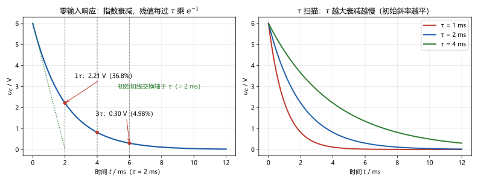
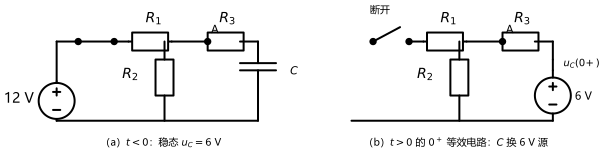

# 第 10 讲：一阶电路 I：换路与零输入响应

> **前置**：第 09 讲（电容、电感：伏安关系、记忆、连续性）与第 01–08 讲全部方法。
> **预计时间**：约 3 小时（含作业）。
>
> **一句话定位**：从本讲起，电路分析进入"时间演化"阶段。一阶电路 = **一个储能元件 + 电阻**——它是所有动态电路的样板：**换路定则定起点、时间常数 τ 定快慢、指数规律定走向**。09 讲预演的充电曲线，本讲从微分方程推导它。
>
> **本讲回答什么**：
> 1. 电路的"状态"是什么？为什么偏偏电容电压、电感电流说了算？
> 2. 换路定则凭什么成立？它和 09 讲的连续性是什么关系？
> 3. 初始值到底怎么求？"画 0⁺ 等效电路"是什么操作？
> 4. 零输入响应为什么老是指数？时间常数 τ 的物理意义到底是什么？
> 5. 几倍 τ 之后算"稳态"？工程上怎么约定？
>
> **这一讲有真实验证**：运行例（12 V 网络换路：0⁻ 稳态 6 V → 0⁺ 电路 KVL 核对 → 放电曲线解析 vs 数值积分，最大偏差 5.5×10⁻⁴ V）、RL 对偶例（断开瞬间 −48 V 反击）、残值表与切线几何（脚本 `scripts/lec10-01_verify_first_order.py`）。作业数字全部预验证。

## 本讲怎么走（脉络图）

```
引子：断开电源后的电容放电曲线
  │
  ├─ 1. 状态与换路定则：状态量是谁、定则内容、凭什么成立（09 结论的操作版）
  ├─ 2. 初始值计算：0⁻ 稳态 → 定则 → 0⁺ 等效电路（四步模板 + 运行例全解）
  ├─ 3. 零输入响应：指数从哪来、τ 的三重含义、RL 对偶、几倍 τ 算稳态
  └─ 常见误区 → 本讲小结 → 掌握度自测 → 作业
```

---

## 引子：断开电源后的电容放电

第 09 讲给出过 RC 充电曲线。本讲处理它的反面——**一只充满电的电容，撤掉电源、接上电阻之后，电压怎么掉**。

答案的形状如图 2：**指数衰减**——每过一段时间 $\tau$ 就掉到"剩余部分的 36.8%"，很快趋近于零但永远不完全为零。这条曲线的三个问题——**起点在哪、τ 是什么、多久算结束**——就是本讲的三站。



> **图 2 怎么读**：左图：$u_C$ 从 6 V 起点指数衰减（$\tau = 2\ \mathrm{ms}$）；虚线为 1τ、2τ、3τ 刻度（残值 36.8% / 13.5% / 4.98%）；点线是**初始切线**——它恰好交横轴于 $\tau$ 处（这不是巧合，是 §3.2 的几何事实）。右图：$\tau$ 取 1/2/4 ms 三条曲线的对照——$\tau$ 越大衰减越慢。

---

## 1. 状态与换路定则

### 1.1 电路的"状态"与状态量

**"状态"**的工程含义：**决定电路未来的最小信息集**——知道这组信息（加上以后的激励），电路的全部未来就唯一确定。

一阶电路里，这组信息就是**一个数**：电容电压 $u_C$（含 C 时）或电感电流 $i_L$（含 L 时）。它们有资格"当状态"，正因为在 09 讲的定义里：**这两个量背着自己的历史**（积分形式里含初值）——想知道 "下一步" 会发生什么，它们就是全部起点。

- **状态量**：$u_C$、$i_L$——扛历史的两个数，**不能突变**（09 讲连续性）；
- **非状态量**：$i_C$、$u_L$（乃至所有电阻上的量）——不扛历史，**可以突变**；
- **一阶电路**：只含一个储能元件（一个状态量）；两个储能元件则是二阶（第 12 讲）。

### 1.2 换路定则（操作版的两个等式）

电路里开关动作、元件接入/切除——拓扑突变称为**换路**；本课程约定换路发生在 $t = 0$，之前记 $0^-$（换路前一瞬）、之后记 $0^+$（换路后一瞬）。由 09 讲的连续性直接得到：

> **换路定则**：
> $$u_C(0^+) = u_C(0^-), \qquad i_L(0^+) = i_L(0^-)$$
> 换路瞬间，**状态量按兵不动**；其余一切量（包括 $i_C$、$u_L$）可以当场跳变。

**一句话记忆**：**换路瞬间只保 $u_C$、$i_L$ 两条命**（09 讲 §4.3 的原句——现在它是操作规则了）。

### 1.3 换路定则凭什么成立

**它不是新定律**——就是 09 讲 §4 那条结论的搬用：

1. 09 讲已经论证：$u_C$ 的突变需要**无穷大电流**（冲激）；只要电路里电流有限，它就不能突变；
2. 普通换路（含电阻、有限源、开关）里电流总是有限的——所以**定则成立**；
3. 唯一的"例外"仍是 09 讲点过名的病态理想化（理想电压源硬接理想电容之类），认识即可。

所以对"凭什么"的标准回答是：**凭 $i = C\,\mathrm{d}u/\mathrm{d}t$ 与"电流有限"两个事实**——连续性说了什么，定则就说什么。

> **态度表（状态与定则部分）**
>
> | 内容 | 态度 |
> |---|---|
> | "状态 = 最小信息集"；状态量 vs 非状态量 | **能复述、能一眼分类** |
> | 换路定则两个等式 | **能默写**；知道它只是"保两条命" |
> | 定则的来历（09 连续性 + 有限性） | 能一句话回答"凭什么" |
>
---

## 2. 初始值计算与 0⁺ 等效电路

### 2.1 标准流程（模板四步）

> **初始值计算的规范流程**：
> 1. **算 0⁻**：按**换路前**的电路求稳态——稳态三件套：**电容开路（$i_C = 0$）、电感短路（$u_L = 0$）**、其余按直流电阻电路算（09 讲的稳态特性登场），得 $u_C(0^-)$、$i_L(0^-)$；
> 2. **过桥**：换路定则——$u_C(0^+) = u_C(0^-)$、$i_L(0^+) = i_L(0^-)$；
> 3. **替换**：画 **$0^+$ 等效电路**——电容**换成电压源** $u_C(0^+)$、电感**换成电流源** $i_L(0^+)$（方向见 §2.3）；
> 4. **解算**：$0^+$ 电路是**纯电阻电路**——全部旧方法（分压分流、结点法、定理……）随便用，解出 $i_C(0^+)$、$u_L(0^+)$ 等非状态量的初始值。

**模板为什么长这样**：换路的瞬间电路已经变新，但状态量"还是旧值"——把"旧值"打包成源放进"新电路"，就是 $0^+$ 等效电路的全部思想。

### 2.2 运行例全解（图 1）

**电路**（图 1a）：$12\ \mathrm{V}$ 源——开关——$R_1 = 1\ \mathrm{k\Omega}$——结点 A；A 经 $R_2 = 1\ \mathrm{k\Omega}$ 到地，A 经 $R_3 = 1\ \mathrm{k\Omega}$ 串 $C = 1\ \mu\mathrm{F}$ 到地。$t = 0$ 时开关**断开**（源撤出）。



> **图 1 怎么读**：（a）换路前的电路：开关闭合，12 V 经 R₁ 到结点 A，R₂、R₃+C 两条支路并联在 A 与地之间。（b）换路后的 0⁺ 等效电路：源与 R₁ 支路已被开关**断开**（只剩悬挂的断口），电容被替换成 **6 V 电压源**（"+"朝上，按 $u_C(0^+)$ 的极性）——接下来它就是个纯电阻电路。

**四步走**（脚本实测）：

1. **0⁻ 稳态**：电容支路开路（$i_C = 0$）→ $R_3$ 上无压降 → $u_C(0^-) = u_A = 12\times\frac{1}{1+1} = 6\ \mathrm{V}$；
2. **过桥**：$u_C(0^+) = 6\ \mathrm{V}$；
3. **替换**：$0^+$ 电路见图 1b（C → 6 V 源）；
4. **解算**：放电回路只剩 $R_3 + R_2 = 2\ \mathrm{k\Omega}$：$i_C(0^+) = -6\,\mathrm{V}/2\,\mathrm{k\Omega} = -3\ \mathrm{mA}$（负号 = 流出电容"+"端）；$u_A(0^+) = 3\ \mathrm{V}$、$u_{R_3}(0^+) = 3\ \mathrm{V}$；**KVL 核对**：$3 + 3 - 6 = 0$ ✓。

**一个值得盯的跳变**：换路前 $R_1$ 上流着 $6\ \mathrm{mA}$、压着 $6\ \mathrm{V}$；换路后瞬间 **$u_{R_1}(0^+) = 0$**——同一个电阻上的电压从 6 V 一步跳到 0 V。它凭什么能跳？因为它**不是状态量**。而对面的电容电压死死钉在 6 V——对比之下，"谁能跳、谁不能跳"一目了然。

### 2.3 三个易错点与两条对偶注意

- **易错点 1：0⁻ 稳态的"三个字"记反**——**电容开路、电感短路**（电压不变 → $i_C = 0$；电流不变 → $u_L = 0$）。记反一次，全盘皆错；
- **易错点 2：替换源的方向**——$u_C(0^+)$ 的正号端朝哪，等效电压源"+"就朝哪；数值为负就反着画（或带符号画）；
- **易错点 3：别在 0⁺ 电路里"重新解 0⁻"**——0⁺ 电路的已知量只有两个状态量（其余靠解出来）；$0^-$、$0^+$ 是两个**不同电路**，只是共享两个数；
- **对偶注意**：电感换成**电流源** $i_L(0^+)$，方向 = 原来电流的方向；单含 L 的题流程完全镜像（0⁻ 时 L 短路算电流）。

> **态度表（初始值部分）**
>
> | 内容 | 态度 |
> |---|---|
> | 四步模板（含"稳态三件套"） | **能默写、闭眼执行** |
> | 运行例全解（6 V → −3 mA / 3 V / KVL 0） | **能独立复现** |
> | 三个易错点 + L 对偶 | 能逐条说出；方向问题一次不错 |
>
---

## 3. 零输入响应

### 3.1 它是什么，为什么是指数

**零输入响应**：换路后**外加激励为零**（源被撤出或被置零），响应**完全由初始储能驱动**——运行例里"断源后的放电"就是它。

**从方程拿结果**（运行例继续）：放电回路的 KVL 只有一项——电容电压全压在电阻上：

$$u_C = R\,i \quad\text{且}\quad i = -C\frac{\mathrm{d}u_C}{\mathrm{d}t} \quad\Rightarrow\quad RC\,\frac{\mathrm{d}u_C}{\mathrm{d}t} + u_C = 0 \quad\Rightarrow\quad \frac{\mathrm{d}u_C}{\mathrm{d}t} = -\frac{u_C}{\tau}$$

其中 $\tau = RC$（运行例：$\tau = 2\,\mathrm{k\Omega}\times 1\,\mu\mathrm{F} = 2\ \mathrm{ms}$）。这个方程的解就是指数：

$$\boxed{u_C(t) = u_C(0^+)\,e^{-t/\tau}}$$

**为什么指数？一句话直觉**：方程说"**掉的速度正比于剩的电压**"——剩得多掉得快、剩得少掉得慢，越接近终点越磨蹭。满足"变化率 ∝ 自身"的函数只有指数——$e^{-\tau}$ 这个数就是为这类过程而生的。

**数值出发**（脚本实测）：解析式 vs 数值积分（Euler）最大偏差 $5.5\times 10^{-4}\ \mathrm{V}$——方程、解、仿真三方一致。

### 3.2 τ 的三重含义

**量纲先立住**：$[\tau] = [R][C] = \Omega\cdot\mathrm{F} = \mathrm{s}$ ✓（电感版 $\tau = L/R$ 同验）。

1. **残值因子**：每过 $\tau$，电压乘 $e^{-1} \approx 0.368$——"掉到剩余部分的 36.8%"（1τ 后：$6\times0.368 = 2.21\ \mathrm{V}$）；
2. **切线交横轴于 τ**（图 2a 的几何事实）：初始斜率 $\mathrm{d}u/\mathrm{d}t\big|_0 = -u_0/\tau$——把这条切线延长，恰好落到横轴的 $\tau$ 刻度上。**拿到曲线图，画一条起始切线就能读出 τ**；
3. **快慢刻度**：$\tau$ 越大越慢——物理上 $R$ 大（电流受限）或 $C$ 大（存的电荷多）都会拖慢过程；图 2b 的 τ 扫描就是这个意思。

**一句话**：$\tau$ 是一个一阶电路的"**慢性子指数**"——它只由 $R$、$C$（或 $L$、$R$）决定，与初始电压多大无关。

### 3.3 RL 对偶与电感反击

照 09 讲的对偶表翻译：$u \leftrightarrow i$、$C \leftrightarrow L$、$RC \leftrightarrow L/R$：

$$i_L(t) = i_L(0^+)\,e^{-t/\tau}, \qquad \tau = \frac{L}{R}\ (\text{$R$ = 放电回路等效电阻})$$

**数值例**（脚本实测，运行例的对偶玩具）：$24\ \mathrm{V}$ 源经 $R_1 = 6\ \Omega$ 到结点 A，A 经 $R_2 = 12\ \Omega$ 到地、并经 $L = 12\ \mathrm{mH}$ 直接到地。换路前电感**短路**——A 点被钉在 0 V，$R_2$ 上无电流，全部 $4\ \mathrm{A}$ 走电感：$i_L(0^-) = 4\ \mathrm{A}$。$t = 0$ 断开源支路后：$i_L$ 经 $R_2$ 放电，$\tau = L/R_2 = 1\ \mathrm{ms}$，$i_L(t) = 4e^{-t/\tau}$。

**最值得注意的一幕**：断开瞬间电感电压 $u_L(0^+) = -R_2\,i_L(0^+) = \mathbf{-48\ V}$——电感**把自己变成了一个 48 V 的"反抗者"**。这就是 09 讲口诀里"换路瞬间的反击电压"的数学现场，也是继电器线圈断电时打火花的原理。

**注意 τ 里的 R**：是**拿掉电感后、从它两端看进去的等效电阻**（本例 $R_2$）——不是别的（尤其不是断电前串在源那边的那只 $R_1$）。

### 3.4 几倍 τ 算"稳态"

严谨地说：**指数永远到不了零**——"稳态结束"是工程按容差截断的说法。残值表：

| 时刻 | 1τ | 2τ | 3τ | 4τ | 5τ |
|---|---|---|---|---|---|
| 剩余比例 | 36.8% | 13.5% | 4.98% | 1.83% | 0.67% |

**工程约定**：**3τ ≈ 差 5%，5τ ≈ 差 0.7%**——一般问题"3~5 τ 就算过渡结束"；精度要求高就多等几个 τ。做题时遇到"经过足够长时间"字样，就按"该到稳态值了"处理。

> **态度表（零输入响应部分）**
>
> | 内容 | 态度 |
> |---|---|
> | 零输入定义 + RC 推导（方程 → 指数） | **能独立推一遍**；能讲"为什么是指数" |
> | τ 的三重含义（残值/切线/快慢） | **能默写**；拿到曲线能现场读 τ |
> | RL 对偶 + 反击例（−48 V）与"τ 里的 R" | **能复现**；能说清 $R$ 的取法 |
> | 残值表 + 3~5τ 约定 | 能背关键数（36.8/13.5/4.98/0.67%） |
>
---

## 常见误区（本节零新知识，只破误）

> 以下每条只是"对答案 + 校准"，没有新知识——每一句都已在正文系统小节里教过。

1. **"求 0⁻ 稳态时，电容当短路、电感当开路"**（§2.1）。记反了。直流稳态：**电容开路**（电压不变 → $i_C = 0$）、**电感短路**（电流不变 → $u_L = 0$）——这是 09 讲的稳态特性。
2. **"换路定则在任何情况下都成立"**（§1.3）。有条件：电流/电压有限（无冲激）；理想源硬接理想电容之类的病态设定是例外。
3. **"$u_C$ 连续，所以 $i_C$ 也连续"**（§1.1、§2.2）。错。运行例实测：$i_C$ 从换路前的 $0$ 一跳跌到 $-3\ \mathrm{mA}$——**电流是非状态量**，随便跳。同理 $u_L$ 可跳。
4. **"τ 越大，过渡过程越快结束"**（§3.2）。恰好相反：$\tau$ 越大越慢（图 2b 三条曲线一眼可见）。
5. **"'零输入'就是电路里没有电源"**（§3.1）。不准确。"零输入"指**外加激励为零**、响应靠初始储能驱动；一个含源电路的全响应可以拆出它的零输入成分（第 11 讲展开）。
6. **"5τ 之后响应严格为零"**（§3.4）。错。理想模型下指数只趋近不抵达——5τ 剩 0.67%，是"工程上算完了"，不是数学上的零。

---

## 本讲小结

一页纸的骨架：

- **状态与状态量**：状态 = 决定未来的最小信息集；一阶电路的状态量 = $u_C$ 或 $i_L$（扛历史）；$i_C$、$u_L$ 及一切电阻量**可跳**。
- **换路定则**：$u_C(0^+) = u_C(0^-)$、$i_L(0^+) = i_L(0^-)$——09 讲连续性的操作版；前提是有限性（冲激例外）。
- **初始值四步模板**：**算 0⁻**（C 开路、L 短路）→ **过桥**（定则）→ **替换**（C→电压源、L→电流源，注意方向）→ **解算**（纯电阻电路）。
- **运行例数字**：$u_C(0^-) = u_C(0^+) = 6\ \mathrm{V}$；$i_C(0^+) = -3\ \mathrm{mA}$、$u_A(0^+) = 3\ \mathrm{V}$、KVL 核对 0；$u_{R_1}$ 从 6 V 跳到 0（合法，非状态量）。
- **零输入响应**：$u_C(t) = u_C(0^+)e^{-t/\tau}$（$\tau = RC$）；RL 对偶 $i_L = i_L(0^+)e^{-t/\tau}$（$\tau = L/R$，R 取放电回路等效电阻）；解析 vs 数值 5.5×10⁻⁴。
- **τ 三义**：残值 ×0.368 / 切线交横轴于 τ / 快慢刻度（与初始值无关）。
- **残值表**：1τ 36.8%、2τ 13.5%、3τ 4.98%、5τ 0.67%；工程"3~5τ 算完"。
- **电感反击**：断开瞬间 $u_L(0^+) = -48\ \mathrm{V}$——继电器火花的原理。

## 掌握度自测

- [ ] 我能解释"状态 = 最小信息集"，并把状态量/非状态量各列两个。
- [ ] 我能默写换路定则，并一句话回答"凭什么成立"。
- [ ] 我能默写初始值四步模板（含稳态三件套），并独立复现运行例全解。
- [ ] 我能说出"0⁺ 电路里谁能跳、谁不能跳"，并各举一例。
- [ ] 我能从 $RC\,\mathrm{d}u/\mathrm{d}t + u_C = 0$ 推出指数解，并解释"为什么指数"。
- [ ] 我能说出 τ 的三重含义；拿到曲线图能画切线读 τ。
- [ ] 我能默写 RL 对偶式与 τ = L/R 中 R 的取法，并复现 −48 V 反击例。
- [ ] 我能背出 1τ~5τ 残值，并说清"3~5τ 算稳态"是工程约定不是数学事实。
- [ ] 我能说清"零输入"的准确含义（激励为零 ≠ 电路无源）。
- [ ] 我能复跑 `scripts/lec10-01`，并解释输出里每一个数字。

## 作业

> 答案只能用**已教概念**（本讲范围：状态与状态量、换路定则、初始值四步与 0⁺ 等效电路、零输入响应与 τ、RL 对偶、残值约定；09 讲的 C/L 伏安关系与稳态特性、01–08 全部方法承接）。先独立做，再对答案。

### 基础

**Q1. 概念辨析**：判断下列说法对不对，并给一句话理由。

(a) "求换路前稳态时，电容当短路、电感当开路。"
(b) "换路定则说状态量永远连续——没有任何例外。"
(c) "电容电压不能突变，所以电容电流也不能突变。"
(d) "时间常数 τ 越大，过渡过程结束得越快。"
(e) "经过 5τ 之后，响应严格等于零。"

**参考答案**：

(a) 错。恰好相反：直流稳态下**电容开路、电感短路**（09 讲稳态特性）。
(b) 不严谨。前提是电流/电压有限（无冲激）；理想化病态设定是理论上的例外。
(c) 错。$u_C$ 是状态量不能跳；$i_C$ 不是——运行例中它从 0 一跳跌到 −3 mA。
(d) 错。τ 越大越慢（残值因子每 τ 乘 0.368，大 τ 步长更长）。
(e) 错。理想模型下只趋近不抵达；5τ 剩约 0.67%，"算完"是工程容差约定。
验算：五小题各回一个机制词：开路/短路 → 有限性 → 状态量 vs 非状态量 → 快慢 → 容差约定。

**Q2. 计算·初始值**：$t<0$ 时：$18\ \mathrm{V}$ 源——$R_1 = 2\ \mathrm{k\Omega}$——结点 A；A 经 $R_2 = 1\ \mathrm{k\Omega}$ 到地、经 $R_3 = 1\ \mathrm{k\Omega}$ 串 $C = 2\ \mu\mathrm{F}$ 到地。$t = 0$ 断源。求 $u_C(0^-)$、$u_C(0^+)$、$\tau$、$i_C(0^+)$、$u_A(0^+)$，并做 KVL 核对。

**参考答案**：

0⁻ 稳态：电容开路，A 由 R1/R2 分压：$u_C(0^-) = 18\times\frac{1}{2+1} = 6\ \mathrm{V}$；
过桥：$u_C(0^+) = 6\ \mathrm{V}$；放电回路 $R = R_2+R_3 = 2\ \mathrm{k\Omega}$，$\tau = RC = 4\ \mathrm{ms}$；
0⁺：$i_C(0^+) = -6/(2\,\mathrm{k}) = -3\ \mathrm{mA}$；$u_A(0^+) = 6\times\frac{1}{2} = 3\ \mathrm{V}$、$u_{R_3}(0^+) = 3\ \mathrm{V}$；
KVL：$3 + 3 - 6 = 0$ ✓。
验算：与运行例同构（只是电压与 C 值换了），流程一致。

**Q3. 计算·零输入响应**：承接 Q2。写出 $u_C(t)$，求 $u_C$ 在 $t = 4\ \mathrm{ms}$ 的值，以及 $u_C$ 降到 $1\ \mathrm{V}$ 所需时间。

**参考答案**：

$u_C(t) = 6e^{-t/4\,\mathrm{ms}}\ \mathrm{V}$；
$t = 4\ \mathrm{ms} = 1\tau$：$u_C = 6\times0.368 = 2.207\ \mathrm{V}$；
降到 1 V：$6e^{-t/\tau} = 1 \Rightarrow t = \tau\ln 6 = 4\times1.792 = 7.167\ \mathrm{ms}$。
验算：1τ 处与残值表 36.8% 对齐 ✓。

**Q4. 计算·RL 对偶**：电感 $L = 10\ \mathrm{mH}$，换路前稳流 $i(0^-) = 1\ \mathrm{A}$；换路后它经 $R = 20\ \Omega$ 放电。求 $\tau$、$i(t)$、$i(1\tau)$、$u_L(0^+)$，以及电流降到 0.1 A 的时间。

**参考答案**：

$\tau = L/R = 0.5\ \mathrm{ms}$；$i(t) = 1\cdot e^{-t/0.5\,\mathrm{ms}}\ \mathrm{A}$；
$i(1\tau) = 0.368\ \mathrm{A}$；$u_L(0^+) = -R\,i(0^+) = -20\ \mathrm{V}$（反击）；
降到 0.1 A：$t = \tau\ln 10 = 1.151\ \mathrm{ms}$。
验算：全流程与 RC 版逐项对偶。

### 提高

**Q5. 概念·τ 与切线**：解释"初始切线交横轴于 τ"为什么成立（用初始斜率说话），并说明残值表中 3τ（≈5%）与 5τ（≈0.67%）在工程约定里各担当什么角色。

**参考答案**：

初始斜率 $u'(0) = -u_0/\tau$；切线 $u(t) = u_0 - (u_0/\tau)t$，令它为零得 $t = \tau$——切线落点正是时间常数。
工程约定：**3τ 差 5%**——一般问题"可以当过渡结束"；**5τ 差 0.7%**——要求更严时的放心线；指数本身永不严格到零。
验算：把 $u_0 = 6$、$\tau = 2\ \mathrm{ms}$ 代入切线式得 0 于 2 ms ✓（图 2a 点线）。

**Q6. 计算·电感反击综合**：$24\ \mathrm{V}$ 源经 $R_1 = 6\ \Omega$ 到结点 A；A 经 $R_2 = 12\ \Omega$ 到地、并经 $L = 12\ \mathrm{mH}$ 直接到地。$t = 0$ 断源支路。

(1) 求 $i_L(0^-)$、$i_L(t)$、$u_L(0^+)$；
(2) 电流降到 0.4 A 需要多久？
(3) 用一句话解释"断电瞬间打火花"。

**参考答案**：

(1) 换路前 L 短路：A = 0 V，源电流全走 L：$i_L(0^-) = 24/6 = 4\ \mathrm{A}$；断源后经 $R_2$ 放电：$\tau = L/R_2 = 1\ \mathrm{ms}$，$i_L(t) = 4e^{-t/1\,\mathrm{ms}}\ \mathrm{A}$；$u_L(0^+) = -12\times4 = -48\ \mathrm{V}$。
(2) $4e^{-t/\tau} = 0.4 \Rightarrow t = \tau\ln 10 = 2.303\ \mathrm{ms}$。
(3) 断开瞬间电感把电流"困"在回路里强制维持，电压为维持它而达到 −48 V 量级——开关触点上空气被击穿，就是火花。
验算：(1)(2) 与脚本输出一致。

**Q7. 概念·0⁺ 电路的规矩**：回答两问：(1) 把电容替换成电压源时，方向怎么定？(2) "0⁻ 与 0⁺ 只差一瞬，为什么 $u_C$ 不变而 $i_C$ 变了？"——再各举一个能跳/不能跳的量。

**参考答案**：

(1) $u_C(0^+)$ 的正号端即等效电压源"+"端；值为负时反向画（或带符号写）。
(2) $u_C$ 是**状态量**（积分形式含初值，突变要无穷电流），$i_C$ 是**非状态量**（由当前电路的方程现场决定，可以一步跳）。
例：不能跳——$u_C$、$i_L$；能跳——$i_C$、$u_L$（运行例：$u_{R_1}$ 从 6 V 跳到 0、$i_C$ 从 0 跳到 −3 mA）。
验算：对照 §2.2 与 §1.1 逐条回看。

### 综合

**Q8. 开放·用 τ 说话**：用"τ 的语言"解释：(1) 同一只电容为什么既能"充电要几秒"（闪光灯蓄能）又能"放电只要毫秒"（闪光）？(2) 工程上说"过渡过程结束了"，严格来说是什么意思？

**参考答案**（要点）：

(1) $\tau = RC$ 由**回路电阻**决定：充电回路串着大阻值（限流保护、慢充），τ 大——几秒；闪光回路电阻极小，τ 小——毫秒放完；电容本身没变，变的是"回路"。
(2) 严格说指数是渐近的（永不严格归零）；"结束"= 剩余量已低于工程容差——约定 3τ（≈5%）一般算完、5τ（≈0.7%）更放心；任何"经过足够长时间"的题都按此读取。
验算：两问各用 $\tau = RC$、残值表与"容差截断"三件语言自洽回答。

---

*下一讲预告：第 11 讲《一阶电路 II：全响应、三要素与阶跃冲激》——零输入只是一半：另一半来自激励。当激励也在场，响应会拆出三套口径（零输入+零状态 / 强制+自由 / 稳态+暂态）；工程师最后会把它压进一条"三要素"公式：初值、终值、τ——三个数填完，适用于任何一阶电路。*
