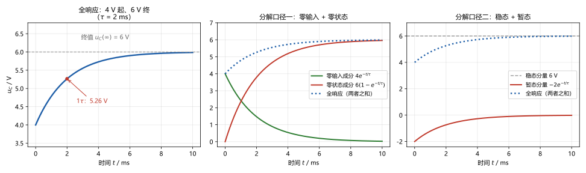
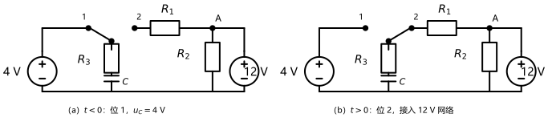
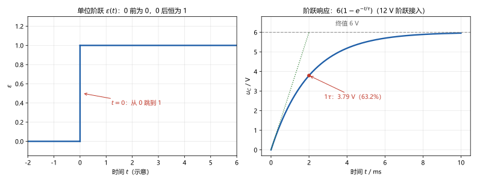
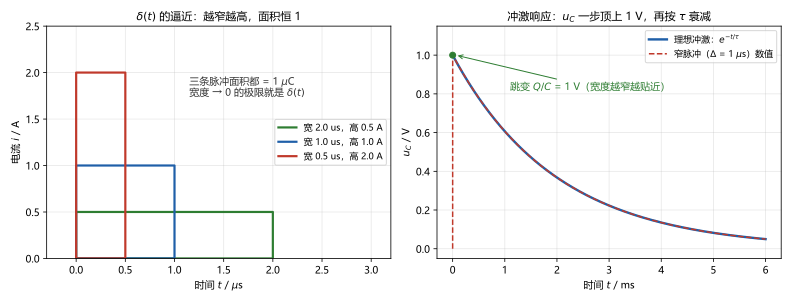

# 第 11 讲：一阶电路 II：全响应、三要素与阶跃冲激

> **前置**：第 10 讲（换路定则、初始值四步、零输入响应、时间常数 τ）与 01–09 讲全部方法。
> **预计时间**：约 3 小时（含作业）。
>
> **一句话定位**：10 讲的零输入放电只是一半——激励在场时，响应一半来自初值、一半来自电源。把这两半认清楚之后，工程师把它压成一条公式：**初值、终值、时间常数——三个数填完，适用于任何一阶电路**。最后，给"开关动作"发明两个标准写法（阶跃与冲激），为后面换方法备好工具。
>
> **本讲回答什么**：
> 1. 零状态响应是什么？09 讲预演的充电曲线正式推导。
> 2. 全响应的三种分解口径为什么都成立？该用哪套说？
> 3. 三要素法是"原理"还是"考试捷径"？三个数怎么求、适用范围多宽？
> 4. 阶跃函数、冲激函数是什么？为什么需要这两个函数？
> 5. 冲激响应凭什么特殊、后面到处用它？
>
> **这一讲有真实验证**：运行例全响应——解析 vs 数值积分最大偏差 1.8×10⁻⁴ V；两套分解口径逐点回加残差 ~10⁻¹⁶；0⁺ 电路 KCL 核对 0；三要素适用于任意变量（$u_A$、$i_C$ 与 $u_C$ 共用同一 τ，数值 vs 解析 9.2×10⁻⁵）；阶跃响应 5.5×10⁻⁴；冲激逼近——脉冲宽度 4→0.5 µs 时峰值 0.9990→0.9999 V 收敛到 $Q/C$ = 1 V（脚本 `scripts/lec11-01`、`lec11-02`）。作业数字全部预验证。

## 本讲怎么走（脉络图）

```
引子：给电容"接上电源"——从 4 V 爬到 6 V 的那条曲线
  │
  ├─ 1. 零状态响应：激励单独产生的响应（充电曲线的推导）
  ├─ 2. 全响应与三套分解口径：同一根曲线、三种读法（运行例全解）
  ├─ 3. 三要素法：三个数适用于任意变量（模板 + 适用范围）
  └─ 4. 阶跃与冲激：两个标准激励、两种标准响应（伏笔 22 讲）
  → 常见误区 → 本讲小结 → 掌握度自测 → 作业
```

---

## 引子：给电容"接上电源"

第 10 讲讨论的是无源放电：电容放完电就没有然后了。本讲把电源接回来——**一只带 4 V 底子的电容，接入 12 V 网络之后，电压怎么变**。

答案的形状如图 2 左图：**还是指数**——从 4 V 起步，按指数规律趋近新的稳态 6 V，越接近变化越慢。10 讲的三问换了个面貌，但现在答案齐全：

- **从哪起**：初值 $u_C(0^+) = 4\ \mathrm{V}$（10 讲的换路定则管）；
- **到哪去**：终值 $u_C(\infty) = 6\ \mathrm{V}$（换路后电路的直流稳态）；
- **爬多快**：时间常数 $\tau = 2\ \mathrm{ms}$（换路后电路的 τ）。



> **图 2 怎么读**：左图：全响应 $u_C$ 从 4 V 指数式趋近 6 V。中图：把同一根曲线拆成**零输入成分**（4 V 衰减到 0）加**零状态成分**（0 爬到 6 V），两条相加恰好回到全响应。右图：换成另一套拆法——**稳态分量**（6 V 水平线）加**暂态分量**（负值指数趋于 0）。三种读法、一根曲线——这正是本讲 §2 的主题。

这条曲线的三个数（4 V、6 V、2 ms）合称"**三要素**"。本讲先把它拆开讲透（为什么可以这么拆、每一半是谁的功劳），再合起来给它一条公式（三个数填进去，**任意**电压电流都适用），最后给"开关动作"两个标准写法。

---

## 1. 零状态响应：激励单独在场

### 1.1 它是什么

**零状态响应**：初始储能为零（$u_C(0^+) = 0$ 或 $i_L(0^+) = 0$）时，电路对**外加激励**的响应——响应完全由激励驱动，从"白手起家"开始。

命名来自 10 讲的"状态"：状态量带着历史，而"零状态"就是**把状态初值清零**——电容不满不欠（$u_C(0^+) = 0$），于是响应里不含初值贡献，全是激励贡献。

对照命名记忆：

| 名字 | 初始储能 | 激励 | 谁驱动响应 |
|---|---|---|---|
| 零输入响应（10 讲）| 有 | 无 | 全靠初值 |
| 零状态响应（本讲）| 无 | 有 | 全靠激励 |
| 全响应（本讲）| 有 | 有 | 两者共同作用 |

### 1.2 零状态响应的推导

09 讲曾预演过一条"RC 充电曲线"，现在从微分方程推导它。就用运行例的网络，把电容换成"空电容"（$u_C(0^+) = 0$），$t = 0$ 接入 12 V：

- 从电容两端看，12 V 网络等效为一个 **6 V 源串 $R_{eq} = 2\ \mathrm{k\Omega}$**（07 讲戴维南的用法：$R_{eq} = R_1 \parallel R_2 + R_3$，独立源置零看进去）；
- 回路的方程只剩一条：

$$\tau \frac{\mathrm{d}u_C}{\mathrm{d}t} + u_C = u_C(\infty) \qquad (\tau = 2\ \mathrm{ms},\quad u_C(\infty) = 6\ \mathrm{V})$$

- 带上初值 $u_C(0^+) = 0$ 解出来，就是 09 讲见过的形状（脚本实测：数值积分 vs 解析最大偏差 5.5×10⁻⁴ V）：

$$\boxed{u_C(t) = u_C(\infty)\left(1 - e^{-t/\tau}\right)}$$

**三个读数**：

- $t = 1\tau$：$6 \times 0.632 = 3.79\ \mathrm{V}$——**充到终值的 63.2%**（正好是 10 讲残值 36.8% 的对偶说法："还差 36.8%"）；
- 初始斜率 $\mathrm{d}u_C/\mathrm{d}t\big|_{0^+} = u_C(\infty)/\tau = 3000\ \mathrm{V/s}$——起始切线直指稳态线，交点仍在横轴 $\tau$ 处（10 讲的切线几何换了个方向，照样成立）；
- 之后照残值表走：3τ 到 95.0%，5τ 到 99.3%。

### 1.3 和放电共用同一个方程结构

把 10 讲的零输入曲线和这条并列着看：

$$u_C = u_C(0^+)\,e^{-t/\tau} \qquad \text{(零输入：从初值降到 0)}$$

$$u_C = u_C(\infty)\left(1 - e^{-t/\tau}\right) \qquad \text{(零状态：从 0 升到终值)}$$

两条式子是**同一个指数形式的两种极端**：一个把"起点"钉在初值、终点锚在 0；一个把起点钉在 0、终点锚在终值。把两头都钉住的一般版本——就是下一节的全响应，一句话就能写出来。

---

## 2. 全响应与三套分解口径

### 2.1 运行例：初值 4 V + 激励 12 V

**电路**（图 1）：双掷开关安排了一段"预充"——$t<0$ 时开关在位 1，电容被 4 V 小源充到 $u_C = 4\ \mathrm{V}$（直流稳态：电容开路，$R_3$ 上无电流、无压降，电容电压就是源电压——自洽）；$t = 0$ 拨到位 2，接入 12 V 网络：电源经 $R_1 = 2\ \mathrm{k\Omega}$ 到结点 A；A 经 $R_2 = 2\ \mathrm{k\Omega}$ 到地、经 $R_3 = 1\ \mathrm{k\Omega}$ 串 $C = 1\ \mu\mathrm{F}$ 到地。



> **图 1 怎么读**：（a）换路前：开关置 1，4 V 源把电容预充到 $u_C = 4\ \mathrm{V}$。（b）换路后：开关置 2，电容带着 4 V 的初值进入 12 V 网络（开关的斜杆就是动触头，两个圆点分别是位 1、位 2 的触点）。接下来要回答：它怎么从 4 V 爬到新的稳态？

**先算三个数（三要素预览）**：

1. **初值**（10 讲四步）：$0^-$ 稳态 $u_C(0^-) = 4\ \mathrm{V}$ → 过桥 $u_C(0^+) = 4\ \mathrm{V}$；
2. **终值**：换路后直流稳态，电容开路 → A 点分压 $u_C(\infty) = 12 \times \frac{2}{2+2} = 6\ \mathrm{V}$；
3. **τ**：从电容两端看进去（独立源置零）$R_{eq} = R_1 \parallel R_2 + R_3 = 1 + 1 = 2\ \mathrm{k\Omega}$ → $\tau = 2\ \mathrm{ms}$。

**换路后方程与解**：同一个 RC 结构，方程是 $\tau\,\mathrm{d}u_C/\mathrm{d}t + u_C = u_C(\infty)$（含义："$u_C$ 朝着终值爬，越近越慢"），带上初值 $u_C(0^+) = 4\ \mathrm{V}$ 解出：

$$\boxed{u_C(t) = u_C(\infty) + \left[u_C(0^+) - u_C(\infty)\right]e^{-t/\tau}}$$

代入数字：

$$u_C(t) = 6 + (4 - 6)e^{-t/2\,\mathrm{ms}} = \mathbf{6 - 2e^{-t/2\,\mathrm{ms}}\ \mathrm{V}}$$

**数值验证**（脚本实测）：解析式 vs Euler 数值积分（0 到 5τ），最大偏差 **1.8×10⁻⁴ V**——方程、解、仿真三方一致。把 $t = 0$ 代入得 4 V ✓，$t \to \infty$ 得 6 V ✓——两个端点自己会验。

**这条式子的身份**：它是全响应的**结构式**——"终值 + 初值偏差的指数衰减"（偏差 $4 - 6 = -2\ \mathrm{V}$，以 τ 为节奏衰减到 0）。§3 将证明这个结构对**每一个**电压电流都成立。

### 2.2 三套分解口径：同一根曲线的三种读法

结构式里那几个数可以重新组合，得到三种说法。先把运行例的数字摆开（脚本实测：三种读法逐点回加，残差都 ~10⁻¹⁶——它们是同一根曲线的**恒等变形**，不是近似）：

**口径一：零输入 + 零状态（回答"谁贡献的"）**

$$u_C = \underbrace{4e^{-t/2\,\mathrm{ms}}}_{\text{零输入成分}} + \underbrace{6\left(1 - e^{-t/2\,\mathrm{ms}}\right)}_{\text{零状态成分}}$$

- 零输入成分：初值 4 V 的自生自灭（激励撤掉、它自己衰减——10 讲的曲线）；
- 零状态成分：激励的独立贡献（从 0 爬到 6 V——§1 的曲线）；
- **为什么可以这样拆**：**这本质上就是 06 讲叠加定理**——把"初值"和"外加源"各当成一个独立源，分别算响应再相加。注意"初值当过源"不是比喻：10 讲画 $0^+$ 等效电路时，电容本来就是**被换成了电压源**的；线性电路里，各个源可以一个一个来。

**口径二：稳态 + 暂态（工程直觉最顺）**

$$u_C = \underbrace{6}_{\text{稳态分量}} + \underbrace{\left(-2e^{-t/2\,\mathrm{ms}}\right)}_{\text{暂态分量}}$$

- 稳态分量：等得够久之后"剩下"的东西（换路后新电路直流稳态的答案）——就是"到哪去"；
- 暂态分量：随时间消亡的过渡成分——就是"从哪里来"的遗影；
- 一句话读法：全响应 = 终点 + 出发偏差按 τ 消失。

**口径三：强制 + 自由（数学口径的名字）**

同一个分解在数学书里叫**强制分量**（由激励"强迫"出来的部分）与**自由分量**（电路按自己脾气 $e^{-t/\tau}$ 自由衰减的部分）——对直流激励，它和"稳态 + 暂态"是同一组数（强制 = 稳态 = 6，自由 = 暂态 = $-2e^{-t/\tau}$）。

> **一个必须现在就钉住的边界**：直流激励下"强制分量 = 稳态分量"是**巧合**（直流激励的特解恰好是常数）。遇上正弦激励，强制分量是正弦、自由分量还是指数——两者分家。这件事到 13 讲相量法会看得非常清楚；本条边界：直流下重合、正弦下分家。

**三套口径各用在哪**：

| 口径 | 回答的问题 | 常用场合 |
|---|---|---|
| 零输入 + 零状态 | "谁贡献的？" | 追责、叠加分析；区分"无源放电"与"白手充电"两种场景 |
| 稳态 + 暂态 | "久之后是什么样？现在在过渡的哪一段？" | 工程直觉、三要素法（§3）、波形图阅读 |
| 强制 + 自由 | 数学结构：特解 + 齐次解 | 后续课程（信号与系统、复频域）的通用语言 |

### 2.3 运行例全解：0⁺ 电路与三个变量

把 10 讲的四步走一遍（这题的重点在**中间变量**也能算出来）：

**0⁺ 等效电路**：电容替换成 4 V 电压源（正号朝上，按 $u_C(0^+)$ 的极性）——它是一个纯电阻电路，全部旧方法可用。

**结点 A 的一步解**（05 讲结点法的就地应用，单位 V、kΩ、mA）：令从 A 流出的电流和为 0：

$$\frac{u_A - 12}{2} + \frac{u_A}{2} + \frac{u_A - 4}{1} = 0 \quad\Rightarrow\quad 4u_A = 20 \quad\Rightarrow\quad u_A(0^+) = 5\ \mathrm{V}$$

于是 $i_C(0^+) = (5-4)/1 = \mathbf{1\ mA}$（流入电容正端——充电电流，与"爬升"方向一致）。

**KCL 核对**（脚本实测残差 0）：流入 A 的 $\frac{12-5}{2} = 3.5\ \mathrm{mA}$ = 流出 A 的 $\frac{5}{2} + 1 = 3.5\ \mathrm{mA}$ ✓。

**三个变量的全响应**（脚本实测：$u_A$、$i_C$ 各自满足"终值 + 偏差指数"，与解析式最大偏差 9.2×10⁻⁵）：

| 变量 | 初值 $f(0^+)$ | 终值 $f(\infty)$ | 全响应 |
|---|---|---|---|
| $u_C$ | 4 V | 6 V | $6 - 2e^{-t/2\,\mathrm{ms}}\ \mathrm{V}$ |
| $u_A$ | 5 V | 6 V | $6 - e^{-t/2\,\mathrm{ms}}\ \mathrm{V}$ |
| $i_C$ | 1 mA | 0 | $e^{-t/2\,\mathrm{ms}}\ \mathrm{mA}$ |

**盯一眼 $i_C$**：它从 1 mA 衰减到 0，τ 与其他两个变量**完全相同**——一阶电路里所有量共享同一个 τ，区别只在初值和终值两个数。这就是下一节"三要素适用于任意变量"的根本原因。

> **态度表（全响应部分）**
>
> | 内容 | 态度 |
> |---|---|
> | 零状态/零输入/全响应的定义与命名逻辑 | **能复述、能对号入座**（运行例里谁是谁） |
> | 结构式 $f(t) = f(\infty) + [f(0^+)-f(\infty)]e^{-t/\tau}$ | **能默写、能代入数字** |
> | 三套口径的名称与"为什么成立" | **能逐套一句话回答**（叠加 / 解的结构 / 数学命名） |
> | 直流下强制=稳态、正弦下分家 | 能说出这是边界，知道 13 讲细看 |
> | 0⁺ 电路解 $u_A$、$i_C$ 的手法 | 能独立复现（05 讲结点法就地用） |
>
---

## 3. 三要素法：三个数适用于任意变量

### 3.1 公式与用法

§2.3 的表已经说明了原因：$u_C$、$u_A$、$i_C$ 三个变量的响应长得一模一样——"终值 + 偏差指数"，同一个 τ。把 §2.1 结构式里的名字从 $u_C$ 换成任一电压电流 $f$：

> **三要素公式**（直流激励一阶电路）：
> $$f(t) = f(\infty) + \left[f(0^+) - f(\infty)\right]e^{-t/\tau}$$
> 只要 $f$ 是电路里的一个**电压或电流**，三个数——**初值 $f(0^+)$、终值 $f(\infty)$、时间常数 $\tau$**——填进去就是它的全响应。

"适用于任意变量"的含义：不用对每个变量重新列方程、重新解微分方程；三个数算好，所有电压电流直接写出。

### 3.2 为什么适用于任意变量（原理，不是捷径）

一阶电路换路后，不管问的是哪条支路的哪个量，整个电路被同一组方程支配：一个储能元件的伏安关系（含一个导数）加一堆电阻的代数关系。把任意一个变量 $f$ 消元解出来，得到的必然是一条**一阶线性常系数微分方程**——而且：

- **τ 相同**：决定指数快慢的是方程的特征结构，它只由电路（R、C 或 L）决定，与"问哪个变量"无关；
- **解的结构相同**：一阶方程的解 = 特解（就是对直流激励的终值 $f(\infty)$）+ 齐次通解（$Ae^{-t/\tau}$）；常数 $A$ 由初值定——$A = f(0^+) - f(\infty)$。

所以三要素法不是什么"考试技巧"，是"解的结构"的直接应用：**只要换路后的电路最终能到达直流稳态，每个电压电流都长这样**。

### 3.3 三要素标准求法（模板）

> **三要素法的标准流程**（直流激励一阶电路）：
>
> **① 求 $f(0^+)$——用 10 讲四步**：算 $0^-$ 稳态（C 开路、L 短路）→ 过桥（换路定则）→ 画 $0^+$ 等效电路（C→电压源、L→电流源）→ 在纯电阻电路里解出 $f(0^+)$。
>
> **② 求 $f(\infty)$——算换路后的新稳态**：电容开路、电感短路，其余全是直流电阻电路——分压分流、结点法、定理、戴维南随便用。
>
> **③ 求 $\tau$**：从储能元件两端看进去的等效电阻 $R_{eq}$（**独立源置零**——电压源短路、电流源开路），$\tau = R_{eq}C$ 或 $\tau = L/R_{eq}$；含受控源时用 07 讲的外施激励法求 $R_{eq}$。
>
> **④ 组装与自检**：把三个数代进公式；自检两条——代 $t = 0$ 必须回到 $f(0^+)$、代 $t \to \infty$ 必须回到 $f(\infty)$；方向也要对（初值低于终值时整体从低爬到高——指数项前应是负号）。

**运行例按模板"批发"一遍**（三个数都来自前文）：

| 变量 | $f(0^+)$ | $f(\infty)$ | $\tau$ | 全响应 |
|---|---|---|---|---|
| $u_A$ | 5 V（§2.3 解出） | 6 V（分压） | 2 ms | $6 - e^{-t/2\,\mathrm{ms}}\ \mathrm{V}$ |
| $i_C$ | 1 mA（§2.3 解出） | 0（稳态开路） | 2 ms | $e^{-t/2\,\mathrm{ms}}\ \mathrm{mA}$ |

——与 §2.3 的逐变量结果全对上 ✓。

### 3.4 适用范围：三条硬边界

三要素法好用，但只在它的射程里好用：

1. **线性 + 一个储能元件**。两个储能元件是二阶电路（下一讲）——解里除了衰减可能还有振荡，三要素公式失效。
2. **换路后的电路必须能到达直流稳态**（终值 $f(\infty)$ 是有限数）。反例：恒流源给理想电容充电，$u_C$ 按 $I/C$ 的速度线性增长——"终值"根本不存在，公式无从填起。
3. **激励是直流**（或换路后最终等效为直流）。正弦激励不能直接套——正弦电路的稳态是正弦量，不是常数"终值"；到 13 讲相量法会看到"结构还是这个结构，只是稳态分量换成正弦解"。**现在只需知道：正弦要等 13 讲。**

### 3.5 两个易错点

- **τ 是"新电路"的量**：从换路后的元件结构算（§3.3 ③），别把换路前的电阻网拿来充数；
- **公式只对"一次量"（电压、电流）成立**：功率是电压电流的乘积（$p = ui$ 或 $p = u^2/R$），不满足这条指数律——先算电压电流，再相乘。与 06 讲"功率不叠"是同一类教训：**盯住公式的线性前提**。

> **态度表（三要素法部分）**
>
> | 内容 | 态度 |
> |---|---|
> | 三要素公式 | **能默写、能"批发"任意变量** |
> | "为什么适用于任意变量"（同一个 τ、解的结构） | 能一句话回答；能对运行例指认三个变量 |
> | 标准流程四步（含 τ 的等效电阻） | **能默写、闭眼执行** |
> | 三条边界（一阶 / 有稳态 / 直流） | 能逐条说出反例 |
> | 两个易错点（τ 用新电路、别套功率） | 做题时形成条件反射 |
>
---

## 4. 阶跃与冲激：两个标准激励

### 4.1 阶跃函数 ε(t)：把"t = 0 接入"写成公式

到目前为止，"开关在 $t = 0$ 动作"都靠电路图和文字叙述表达。要把它写进激励里，需要一个小函数——**单位阶跃函数**（读作"epsilon"，符号 $\varepsilon(t)$）：

$$\varepsilon(t) = \begin{cases} 0, & t < 0 \\ 1, & t > 0 \end{cases}$$

- **它长这样**（图 3 左）：$t = 0$ 之前恒为 0，之后恒为 1——一个"标准开关动作"的数学化；
- **这意味着什么**：一个"$t = 0$ 时接入的 12 V 源"就可以写成 $12\,\varepsilon(t)\ \mathrm{V}$——电路图语言翻译成了信号语言；
- **完整形态**（认识即可）：延迟版本 $\varepsilon(t - t_0)$ 表示"$t_0$ 时刻接入"；缩放 $A\,\varepsilon(t)$ 是"幅度 A 的阶跃"；$\varepsilon$ 在 $t = 0$ 处取 0、1 还是 1/2 无关紧要——它在积分里的行为不受单个点影响。

### 4.2 阶跃响应 s(t)：电路的"标准动作成绩单"

**阶跃响应**：电路对**单位阶跃**的**零状态响应**，记作 $s(t)$——给电路一个最干净的标准动作（从 0 跳到 1），记录它的反应。

- 运行例里，"接入 12 V"的响应是 $6(1-e^{-t/\tau})$；把激励换成 1 V 单位阶跃（缩小 12 倍），响应也缩小 12 倍——$s(t) = 0.5(1-e^{-t/\tau})\ \mathrm{V}$。**激励放大多少倍，响应放大多少倍**（线性），所以只需认识这"单位版"一个；
- 图 3 右画的是 12 V 版的阶跃响应（就是 §1.2 的充电曲线——从这里获得了"阶跃响应"这个正式名字）；
- **态度**：$s(t)$ 是要放进工具箱的名字——"给标准输入、看输出"的做事方式（与 03 讲外施激励"给测试源看反应"同一个精神），后续课程会不断回来找它。



> **图 3 怎么读**：左：单位阶跃 $\varepsilon(t)$——$t = 0$ 处一个跳变，之前 0、之后 1。右：12 V 阶跃接入运行例的响应 $6(1-e^{-t/\tau})$：1τ 到 63.2%（3.79 V），起始切线直指稳态线——与 §1.2 的充电曲线是同一条。

### 4.3 冲激函数 δ(t)：瞬时强冲击的模型

比"跳一下"更极端的标准动作是"猛地一击"：强度极大、持续极短。它的数学理想化是**单位冲激函数** $\delta(t)$（读作"delta"）：

- **它长这样**（图 4 左）：一个宽度趋近于 0、高度趋近于无穷、但**面积恒为 1** 的窄脉冲的极限；
- **这意味着什么**：$\delta(t)$ 不能按"某个时刻的取值"来理解（没有这个值）——它只在**乘上再积分**时发挥作用：$\int_{-\infty}^{+\infty}\delta(t)\,\mathrm{d}t = 1$；与普通函数相乘再积分，等于"采样"出该函数在 0 点的值。**面积语言**是理解 δ 的正确姿势；
- **为什么要发明它**：① 真实世界"瞬时冲击"的模型——雷击、断电打火、撞击；② 更重要的身份：**"最短最陡"的标准激励**——如果连它电路都回应过了，电路的"特性"就全暴露了（§4.5）；
- **单位**：电流冲激 $i = Q\,\delta(t)$ 的面积 $Q$ 是**电荷**（C）；电压冲激的面积是**磁通链**（Wb）——量纲与对偶表自动对齐。

### 4.4 冲激响应：一次把"面积"算清

运行例的电容继续服役：$C = 1\ \mu\mathrm{F}$ 并联 $R = 2\ \mathrm{k\Omega}$（还是 $\tau = 2\ \mathrm{ms}$），$t = 0$ 时注入一个电流冲激 $i = Q\,\delta(t)$，$Q = 1\ \mu\mathrm{C}$。求 $u_C$：

- **冲激瞬间——算面积**：冲激电流无穷大，但它灌给电容的**电荷**是有限的：$q = \int i\,\mathrm{d}t = Q = 1\ \mu\mathrm{C}$；全部落进电容：

$$u_C(0^+) = \frac{q}{C} = \frac{1\ \mu\mathrm{C}}{1\ \mu\mathrm{F}} = 1\ \mathrm{V}$$

- **之后**：冲激撤走，电容经 $R$ 放电——回到 10 讲最熟的老场景：

$$u_C(t) = \frac{Q}{C}\,e^{-t/\tau} = e^{-t/2\,\mathrm{ms}}\ \mathrm{V} \qquad (t > 0)$$

**这就是 10 讲"例外"的正式身份**：10 讲说"$u_C$ 不能突变，除非理想化病态场景里出现冲激电流"——现在那个场景第一次有了具体算例：$u_C$ **一步跳到** $Q/C$，跳变由无穷大电流实现，是合法的数学极限。**普适规则**：冲激瞬间，电容电压"按电荷面积跳变"（$\Delta u_C = q/C$），电感电流"按磁通链面积跳变"（$\Delta i_L = \psi/L$）。

**"单位"冲激响应 $h(t)$**：对单位冲激（1 C 的电流冲激）的零状态响应——本运行例里 $h(t) = \frac{1}{C}e^{-t/\tau}$（每库仑跳 $1/C$ 伏再衰减）；任意 $Q$ 的响应 = $Q \cdot h(t)$（线性）。

**数值考证**（脚本实测）——"极限"不是嘴上说说，窄脉冲一步步逼近它：

| 脉冲宽度 Δ | 数值峰值 | 理想值 $Q/C$ |
|---|---|---|
| 4 µs | 0.9990 V | 1 V |
| 2 µs | 0.9995 V | 1 V |
| 1 µs | 0.9998 V | 1 V |
| 0.5 µs | 0.9999 V | 1 V |

（实测与解析式偏差 ~1.2×10⁻⁶；宽度越窄，峰值越贴着 1 V——理想 δ 是这条收敛序列的终点。）



> **图 4 怎么读**：左：三条脉冲（宽 2/1/0.5 µs、高 0.5/1/2 A）叠在起点——越窄越高、面积恒为 1 µC；宽度取极限就是 δ(t)。右：冲激响应——$u_C$ 从 0 一步顶上 1 V（$Q/C$），随后按 $e^{-t/\tau}$ 衰减；"理想冲激"与"1 µs 窄脉冲数值"两条线在图上几乎重合（峰值差 0.025%）。

### 4.5 两个伏笔：为什么它值得专门培养

**伏笔一：阶跃响应与冲激响应是一对搭档。** $\delta$ 与 $\varepsilon$ 在数学上互为"变化率与累积"（分布意义下 $\delta$ 是 $\varepsilon$ 的导数，$\varepsilon$ 是 $\delta$ 的面积堆起来）；线性电路把这个关系原样传下去：**冲激响应是阶跃响应的变化率**。两个标准响应只需认识一个，另一个是导数——这就是"标准响应"只打包这两个的原因。

**伏笔二：冲激响应 = 电路的"特征标志"。** 任意激励都可以切成无数微小冲击拼出来；线性电路对每份冲击的回应都是 $h$ 的缩放与平移，全部叠加就是总响应——这门功夫叫**卷积**，22 讲（网络函数）正式开讲。现在只需知道：**后面为什么到处看见 $h(t)$**——因为它是"一次测完、终身受用"的电路身份证。

> **态度表（阶跃与冲激部分）**
>
> | 内容 | 态度 |
> |---|---|
> | $\varepsilon(t)$ 的定义、图像与用途 | **能默写定义**；能把"$t=0$ 接入"翻译成 $A\varepsilon(t)$ |
> | 阶跃响应 $s(t)$ 的定义与线性缩放 | 能复述；记住"标准输入、看输出"的心态 |
> | $\delta(t)$ 的"面积语言" | 能讲清"按面积理解、不按值理解" |
> | 冲激响应的面积（$Q/C$、$\psi/L$） | **能算**；能对应 10 讲的"例外" |
> | 两个伏笔（$s$ 与 $h$ 的关系、卷积） | 知道有这回事 + 什么时候找它（22 讲） |
>
---

## 常见误区（本节零新知识，只破误）

> 以下每条只是"对答案 + 校准"，没有新知识——每一句都已在正文系统小节里教过。

1. **"零状态响应 = 电路里没有电源时的响应"**（§1.1）。错。零状态 = **初始储能为零**；响应恰恰是由电源（激励）驱动出来的。"没有电源"的无源电路是另一回事。
2. **"全响应 = 零输入 + 零状态，只是拼凑的写法"**（§2.2）。不是拼凑：拆的依据是 06 讲叠加定理——$0^+$ 等效电路里初值本来就是电源；线性电路允许逐个源分别计算，两部分各自都是正经的响应。
3. **"三要素法万能"**（§3.4）。三条边界：一个储能元件、换路后能到直流稳态、直流激励。正弦激励要等 13 讲相量法；恒流源充理想电容这类无稳态电路连"终值"都填不出来。
4. **"τ 还是用换路前那套电阻算"**（§3.3）。τ 由**换路后**从储能元件看进去的等效电阻定。运行例的对照：换路后再看是正确的 $\tau = (R_1 \parallel R_2 + R_3)C = 2\ \mathrm{ms}$；若照搬换路前的结构（只剩 $R_3$）会算成 1 ms——同一只电容、两个结构、两个数，用错全盘错。
5. **"强制分量和稳态分量永远是一回事"**（§2.2）。直流激励下重合是巧合；正弦激励下分家（强制是正弦、自由还是指数）——13 讲见分晓。
6. **"冲激无穷大，这类题没法算"**（§4.3、§4.4）。冲激的算法是**面积**：电流冲激给电荷、电压冲激给磁通链；$u_C$ 跳 $q/C$、$i_L$ 跳 $\psi/L$，之后一切照旧。窄脉冲收敛表就是"可算、且收敛到理想值"的证据。
7. **"三要素公式能直接算功率"**（§3.5）。公式只对电压、电流（一次量）成立；功率是乘积量——先算 $u$、$i$ 再相乘。

---

## 本讲小结

一页纸的骨架：

- **零状态响应**：初值为零、由激励驱动；$u_C(t) = u_C(\infty)(1-e^{-t/\tau})$——充电曲线（1τ 到 63.2%、起始切线直指稳态线）。
- **全响应结构式**：$f(t) = f(\infty) + [f(0^+) - f(\infty)]e^{-t/\tau}$（直流、一阶）——"终值 + 偏差指数"，偏差以 τ 为节奏衰零。
- **三套分解口径**：零输入 + 零状态（叠加定理的镜像；初值在 $0^+$ 电路里本来就是源）；稳态 + 暂态（解的结构；工程直觉）；强制 + 自由（数学名——直流下与"稳态+暂态"重合，正弦下分家）。
- **运行例数字**：$u_C = 6 - 2e^{-t/2\,\mathrm{ms}}\ \mathrm{V}$、$u_A = 6 - e^{-t/2\,\mathrm{ms}}\ \mathrm{V}$、$i_C = e^{-t/2\,\mathrm{ms}}\ \mathrm{mA}$；0⁺：$u_A(0^+) = 5\ \mathrm{V}$、$i_C(0^+) = 1\ \mathrm{mA}$、KCL 核对 3.5 = 2.5 + 1。
- **三要素法**：三个数——$f(0^+)$（10 讲四步）、$f(\infty)$（换路后稳态）、$\tau$（新电路 $R_{eq}$ 配）——适用于任意电压电流；边界三条（一阶 / 有稳态 / 直流）。
- **阶跃**：$\varepsilon(t)$ = 0 前 0、0 后 1；把"$t=0$ 接入"写成 $A\varepsilon(t)$；阶跃响应 = 对单位阶跃的零状态响应（线性缩放）。
- **冲激**：$\delta(t)$ = 面积恒 1 的窄脉冲极限（面积语言）；冲激响应：$u_C$ 跳 $Q/C$、$i_L$ 跳 $\psi/L$，随后 $e^{-t/\tau}$ 衰减——10 讲"例外"的正式身份；$h$ 是 $s$ 的变化率（伏笔一），卷积在 22 讲。
- **实测合集**：全响应 1.8×10⁻⁴、阶跃 5.5×10⁻⁴、$u_A$/$i_C$ 同法可得，偏差 9.2×10⁻⁵、分解回加 ~10⁻¹⁶、脉冲收敛偏差 1.2×10⁻⁶ V。

## 掌握度自测

- [ ] 我能给零输入/零状态/全响应各下定义，并把运行例的响应拆出两种成分。
- [ ] 我能默写全响应结构式与三要素公式，并说清"适用于任意变量"的原因（同一个 τ）。
- [ ] 我能逐套说出三种分解口径的名字与依据（叠加 / 解的结构 / 数学命名）。
- [ ] 我能默写三要素模板四步（含 τ 的等效电阻取法），并独立求运行例的 $u_A$、$i_C$。
- [ ] 我能说出三要素法的三条边界，各配一个反例。
- [ ] 我能说清"强制 = 稳态"为什么只是直流下的巧合。
- [ ] 我能默写 $\varepsilon(t)$ 定义并把"$t=0$ 接入 6 V 源"写成公式；能说阶跃响应的定义。
- [ ] 我能用面积算法算冲激响应（$Q/C$、$\psi/L$），并把它与 10 讲的"例外"对上。
- [ ] 我能说清 $s$ 与 $h$ 的关系、以及 $h$ 为什么是"特征标志"（22 讲伏笔）。
- [ ] 我能复跑 `scripts/lec11-01` 与 `scripts/lec11-02`，并解释输出里每一个数字。

## 作业

> 答案只能用**已教概念**（本讲范围：零状态/全响应/三套口径、三要素法与其边界、阶跃与冲激/两种响应；10 讲的换路定则、四步、τ；01–09 全部方法承接）。先独立做，再对答案。

### 基础

**Q1. 概念辨析**：判断对错，并给一句话理由。

(a) "零状态响应就是电路里没有电源时的响应。"
(b) "全响应 = 零输入响应 + 零状态响应，这本质上用了叠加的思想。"
(c) "三要素法对任何激励的一阶电路都适用。"
(d) "三要素公式可以直接用来求电阻上消耗的功率。"
(e) "冲激函数是一个取值无穷大的常数。"

**参考答案**：

(a) 错。零状态 = **初始储能为零**；响应由激励驱动。"没有电源"的无源电路是另一回事。
(b) 对。把初值（0⁺ 电路里它本身就是源）与外加源当两个独立部分分别求再相加——06 讲叠加定理的直接应用。
(c) 错。有边界：一个储能元件、换路后能到达直流稳态、直流激励（正弦要等 13 讲相量法处理稳态）。
(d) 错。公式只对电压、电流这类一次量成立；功率是乘积量，先算 $u$、$i$ 再相乘。
(e) 错。$\delta(t)$ 是"面积恒为 1 的窄脉冲极限"——是一个过程，没有"某点的取值"；它只在乘上再积分（面积语言）里起作用。
验算：五小题各回一个机制词：零状态定义 / 叠加 / 边界 / 线性量 / 面积语言。

**Q2. 计算·全响应**：$t<0$ 时电容已充至 $u_C(0^-) = 2\ \mathrm{V}$；$t = 0$ 起接入网络：$20\ \mathrm{V}$ 源——$R_1 = 2\ \mathrm{k\Omega}$——结点 A；A 经 $R_2 = 2\ \mathrm{k\Omega}$ 到地、$R_3 = 1\ \mathrm{k\Omega}$ 串 $C = 1\ \mu\mathrm{F}$ 到地。求 $u_C(t)$、$u_C(2\,\mathrm{ms})$、$u_A(0^+)$、$i_C(0^+)$，并做 KCL 核对。

**参考答案**：

三要素：换路后 $u_C(\infty) = 20 \times \frac{2}{2+2} = 10\ \mathrm{V}$；$\tau = (R_1 \parallel R_2 + R_3)C = 2\ \mathrm{k\Omega} \times 1\ \mu\mathrm{F} = 2\ \mathrm{ms}$；$u_C(0^+) = 2\ \mathrm{V}$。
$u_C(t) = 10 - 8e^{-t/2\,\mathrm{ms}}\ \mathrm{V}$；$u_C(2\,\mathrm{ms}) = 10 - 8 \times 0.368 = 7.06\ \mathrm{V}$。
0⁺ 电路（C→2 V 源）结点 A：$\frac{u_A-20}{2} + \frac{u_A}{2} + (u_A-2) = 0 \Rightarrow 4u_A = 24 \Rightarrow u_A(0^+) = 6\ \mathrm{V}$；$i_C(0^+) = (6-2)/1 = 4\ \mathrm{mA}$。
KCL 核对：流入 $\frac{20-6}{2} = 7\ \mathrm{mA}$ = 流出 $\frac{6}{2} + 4 = 7\ \mathrm{mA}$ ✓。
另核：$i_C(0^+) = C\frac{\mathrm{d}u_C}{\mathrm{d}t}\big|_{0^+} = 1\ \mu\mathrm{F} \times \frac{10-2\ \mathrm{V}}{2\ \mathrm{ms}} = 4\ \mathrm{mA}$ ✓（两口径一致）。
验算：脚本 `lec11-01` 实验 4。

**Q3. 计算·三要素法**：对 Q2 的电路，用三要素法（不再解微分方程）求 $u_A(t)$ 与 $i_C(t)$。

**参考答案**：

$u_A$：$f(0^+) = 6\ \mathrm{V}$（Q2 已解）、$f(\infty) = 10\ \mathrm{V}$（稳态 C 开路、A 点分压）、$\tau = 2\ \mathrm{ms}$ → $u_A = 10 - 4e^{-t/2\,\mathrm{ms}}\ \mathrm{V}$。
$i_C$：$f(0^+) = 4\ \mathrm{mA}$、$f(\infty) = 0$（稳态电容开路）、$\tau = 2\ \mathrm{ms}$ → $i_C = 4e^{-t/2\,\mathrm{ms}}\ \mathrm{mA}$。
自检：$u_A - u_C = (10-4e) - (10-8e) = 4e = R_3\,i_C$ ✓（串联支路关系自动满足）。
验算：与 Q2 的 $u_C$ 联合回代 KVL 一致。

**Q4. 计算·RL 全响应**：$12\ \mathrm{V}$ 源、$R = 6\ \Omega$、$L = 3\ \mathrm{H}$ 串联回路；$t = 0$ 接入时电感电流的初始值为 $i_L(0^+) = 0.5\ \mathrm{A}$（由先前电路留下）。求 $\tau$、$i_L(t)$、$u_L(0^+)$。

**参考答案**：

$i_L(\infty) = 12/6 = 2\ \mathrm{A}$；$\tau = L/R = 0.5\ \mathrm{s}$；$i_L(t) = 2 - 1.5e^{-t/0.5\,\mathrm{s}}\ \mathrm{A}$。
$u_L(0^+)$：KVL 直读 $12 = 6 \times 0.5 + u_L(0^+) \Rightarrow u_L(0^+) = 9\ \mathrm{V}$；
另一口径：$u_L = L\frac{\mathrm{d}i_L}{\mathrm{d}t} = 3 \times \frac{1.5}{0.5}e^{-t/0.5\,\mathrm{s}} = 9e^{-t/0.5\,\mathrm{s}}\ \mathrm{V}$，$t = 0^+$ 得 9 V ✓。
验算：$t = 0$ 代入 $i_L$ 得 0.5、$t \to \infty$ 得 2 ✓；两口径一致。

### 提高

**Q5. 概念·适用边界**：

(1) 恒流源 $I_S$ 给理想电容充电（$u_C(0) = 0$），能直接用三要素法吗？为什么？
(2) 正弦激励的 RC 电路，能不能把"终值"一栏直接填成正弦幅值？

**参考答案**：

(1) 不能。$u_C$ 会按 $I_S t / C$ 线性增长到无穷——换路后电路不存在直流稳态，"终值"不存在，公式无从填起。（"有稳态"这条边界。）
(2) 不能。正弦激励下电路的稳态是正弦量（有幅值、有相位），不是常数；要等 13 讲相量法把正弦稳态分量算出来，"结构式"才能复用——"终值"一栏换成正弦稳态解。
验算：回 §3.4 三条边界逐条对号。

**Q6. 计算·阶跃**：$6\ \mathrm{V}$ 源经开关接入 $R = 2\ \mathrm{k\Omega}$ 串 $C = 2\ \mu\mathrm{F}$（$u_C$ 初值 0）。把激励写成阶跃形式，写出 $u_C(t)$ 与 1τ 时刻值；并说明本题曲线与"单位阶跃响应"的倍数关系。

**参考答案**：

激励：$6\varepsilon(t)\ \mathrm{V}$；$\tau = RC = 2\ \mathrm{k\Omega} \times 2\ \mu\mathrm{F} = 4\ \mathrm{ms}$；
$u_C(t) = 6(1-e^{-t/4\,\mathrm{ms}})\ \mathrm{V}$（$t > 0$；$t < 0$ 为 0）。
1τ：$6 \times 0.632 = 3.79\ \mathrm{V}$。
单位阶跃（1 V）的响应 $s(t) = (1-e^{-t/4\,\mathrm{ms}})\ \mathrm{V}$；本题曲线 = $6\,s(t)$（线性缩放）。
验算：与 63.2% 残值对齐；$t \to \infty$ 给 6 V。脚本 `lec11-02` 实验 4。

**Q7. 概念·冲激**：

(1) $C = 0.5\ \mu\mathrm{F}$ 的电容被注入 $Q = 2\ \mu\mathrm{C}$ 的冲激电流后，为什么电压"一步"跳到 4 V？
(2) 这件事与 10 讲"换路定则成立，除非理想化病态场景"的备注是什么关系？

**参考答案**：

(1) 冲激电流的面积就是电荷：$q = \int i\,\mathrm{d}t = 2\ \mu\mathrm{C}$ 全部落进电容 → $\Delta u = q/C = 2/0.5 = 4\ \mathrm{V}$；跳变由无穷大电流（冲激）实现，是合法的数学极限。
(2) 正是 10 讲点名的"病态理想化"的正式身份：冲激电流 = 无穷大电流，换路定则的前提（电流有限）被放开；普通电路里定则照常成立。
验算：$q = C\Delta u$ 回代（$4\ \mathrm{V} \times 0.5\ \mu\mathrm{F} = 2\ \mu\mathrm{C}$ ✓）。

### 综合

**Q8. 开放·上电延时**：某芯片复位电路：$5\ \mathrm{V}$ 电源上电（视为 $5\varepsilon(t)$），$R = 100\ \mathrm{k\Omega}$ 串 $C = 1\ \mu\mathrm{F}$，芯片在电容电压达到 $3.5\ \mathrm{V}$ 时解除复位。

(1) 写出 $u_C(t)$；
(2) 求解除复位所需时间；
(3) 解释"上电瞬间电容像短路"在这题里对应什么。

**参考答案**（要点）：

(1) $\tau = 100\ \mathrm{k\Omega} \times 1\ \mu\mathrm{F} = 0.1\ \mathrm{s}$；$u_C(t) = 5(1-e^{-t/0.1\,\mathrm{s}})\ \mathrm{V}$。
(2) $5(1-e^{-t/\tau}) = 3.5 \Rightarrow e^{-t/\tau} = 0.3 \Rightarrow t = \tau\ln\frac{10}{3} = 0.1 \times 1.204 = 0.120\ \mathrm{s}$（约 120 ms）。
(3) 零状态（$u_C(0^+) = 0$）：0⁺ 等效电路里电容被替换成 0 V 电压源——就是"短路"（10 讲替换法的读数）；随充电它逐渐"像开路"（趋向直流稳态）。
验算：$t = 120\ \mathrm{ms}$ 代入得 $5(1-0.3) = 3.5$ ✓；脚本 `lec11-01` 实验 4。

---

*下一讲预告：第 12 讲《二阶电路》——一个储能元件的世界到此走完。电容和电感同时上场、能量在两者之间来回倒腾：欠阻尼会振、过阻尼不振、临界是分水岭——RLC 的三种情形，下一讲揭晓。*
