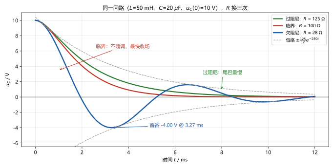
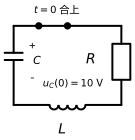
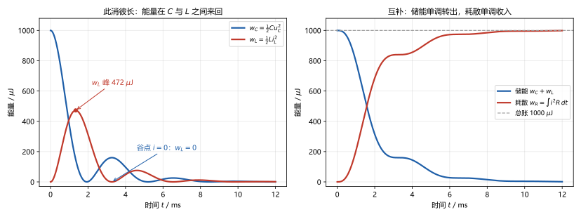

# 第 12 讲：二阶电路

> **前置**：第 11 讲（全响应、三要素法与它的边界）与第 09–10 讲（C/L 档案、换路定则、初值四步）。
> **预计时间**：约 3 小时（含作业）。
>
> **一句话定位**：上一讲把"一个储能元件"的世界走完了。本讲让电容和电感同时上场——**能量在两个元件之间来回搬家**，全新的现象"振荡"就此出现。但振荡不是必然：耗散与交换的竞争给出**三种命运**（过阻尼、临界、欠阻尼），判据只是一道判别式的三个符号。
>
> **本讲回答什么**：
> 1. 为什么二阶电路会出现"振荡"？能量在其中怎么来回跑？
> 2. 特征根、衰减系数、阻尼比——这些词从哪冒出来、各代表什么？
> 3. 过阻尼/欠阻尼/临界——为什么恰好是这三种命运？怎么判断？
> 4. 初值为什么这次要两个？$\frac{\mathrm{d}u_C}{\mathrm{d}t}(0^+)$ 怎么求？
> 5. 再往上（三阶、更多储能元件）怎么办？
>
> **这一讲有真实验证**：三种阻尼的解析解 vs RK4 数值积分（最大偏差 ~10⁻¹³）；欠阻尼特征量（首谷 −4.000 V @ 3.272 ms、次峰 +1.600 V @ 6.545 ms——解析与数值逐位一致）；能量守恒核账（储能 + 耗散全程恒等于 1000 µJ，残差 5.2×10⁻⁵ µJ）；作业数字全部预验证（脚本 `scripts/lec12-01`、`lec12-02`）。

## 本讲怎么走（脉络图）

```
引子：同一个回路、同样的 10 V 起点，R 换三次——三条完全不同的命运
  │
  ├─ 1. 物理图景与方程：能量在 C、L 之间搬家；二阶方程从哪来
  ├─ 2. 特征根与参数：判别式三个符号 = 三种命运；α、ω0、ζ 出场
  ├─ 3. 三种阻尼：解的三种形式 + 运行例三组数字 + 能量视角
  ├─ 4. 初值条件：两个初值怎么来、du_C/dt(0+) 的"链式"求法
  └─ 5. 并联对偶与展望：RLC 并联一句话对偶；三阶以上怎么办
  → 常见误区 → 本讲小结 → 掌握度自测 → 作业
```

> 下一站：§引子。先看三条命运长什么样。

---

## 引子：R 换三次，命运完全不同

先睹为快（图 2）：同一个回路——$L = 50\ \mathrm{mH}$、$C = 20\ \mu\mathrm{F}$，电容预先充好 $10\ \mathrm{V}$——只是在它放电的路上串了一只不同的电阻：

- **$R = 28\ \Omega$**：电压翻过零轴、一摆一摆地荡下去——**欠阻尼**；
- **$R = 100\ \Omega$**：不振荡，一路俯冲、干脆利落地归零——**临界阻尼**；
- **$R = 125\ \Omega$**：也不振荡，但磨磨蹭蹭、尾巴拖得很长——**过阻尼**。



> **图 2 怎么读**：三条曲线从同一个 10 V 起点出发。蓝色（欠阻尼）跨过零轴来回摆动，虚线是它的振荡包络；红色（临界）不跨零、下降最干脆；绿色（过阻尼）也不跨零，但后半段明显比红色磨蹭。为什么 $R$ 一变，命运就完全变了？三种命运到底由什么数决定、解怎么写、初值怎么定——本讲四站。

---

## 1. 物理图景与方程

### 1.1 为什么"两个储能元件"会带来振荡

一阶电路里只有一个储能元件——能量要么慢慢泄掉（放电），要么慢慢存上（充电），**只有单调一种姿势**：能量找不到第二个地方可去。

二阶电路不同：电容里的能量（电场能 $\frac{1}{2}Cu^2$）可以**流进电感**（磁场能 $\frac{1}{2}Li^2$）：

$$\text{C 把能量推给 L（电压下降、电流上升）} \;\longrightarrow\; \text{L 把能量还给 C（电流下降、电压反向上升）} \;\longrightarrow\; \cdots$$

**能量在两个元件之间来回搬家，就是振荡**——电压电流像钟摆一样一摆一摆。但每搬一趟，电阻都要"抽一道税"（发热耗散）——所以振幅一摆比一摆小，最终安静。**搬得比耗得快 → 振荡几摆才停；耗得比搬得快 → 还没搬起来就被按死**——这就预告了本讲的三种命运。

### 1.2 运行例电路与方程

**电路**（图 1）：$C = 20\ \mu\mathrm{F}$ 已预充 $u_C(0) = 10\ \mathrm{V}$（"+"极朝上），$t = 0$ 时合上开关，电容经 $R$、$L = 50\ \mathrm{mH}$ 放电。



> **图 1 怎么读**：一个矩形回路：左边是带电的电容（$u_C(0) = 10$ V），上边是开关（$t=0$ 合上），右边是电阻 $R$，底边是电感 $L$。合上之后，一切都由"放电"这一件事展开；三种命运只是 $R$ 取值不同。

**方程怎么来（三步）**。设回路电流 $i$ 沿"C 的 + 端流出 → 经 R → 经 L → 回 C 的 − 端"绕行：

1. **KVL** 沿绕行方向：电阻、电感都在"降"：$u_C = Ri + L\frac{\mathrm{d}i}{\mathrm{d}t}$；
2. **元件方程**：电流从电容 + 端流出，所以电容在放电：$i = -C\frac{\mathrm{d}u_C}{\mathrm{d}t}$；
3. **消元**：把 2 代入 1：

$$u_C = -RC\frac{\mathrm{d}u_C}{\mathrm{d}t} - LC\frac{\mathrm{d}^2u_C}{\mathrm{d}t^2} \quad\Longrightarrow\quad LC\,\frac{\mathrm{d}^2u_C}{\mathrm{d}t^2} + RC\,\frac{\mathrm{d}u_C}{\mathrm{d}t} + u_C = 0$$

这就是**二阶电路的方程**。跟一阶对照：一阶是 $RC\,u_C' + u_C = 0$，二阶多出来的那一项带着 $L$、并且带着**二阶导数**——原因很直白：电感的方程里就有一个 $\mathrm{d}i/\mathrm{d}t$，而 $i$ 又跟 $\mathrm{d}u_C/\mathrm{d}t$ 挂钩，链式一代，导数就升了一阶。

**完整形态要点**（认识即可）：方程写成哪个变量都行——对 $i$ 消元会得到同一个形状的方程（系数相同、解的形式相同）；所以下一节的"命运判断"与"选哪个变量"无关。

### 1.3 标准形：让两个参数出场

把方程除以 $LC$、整理成"系数最干净"的**标准形**：

$$u_C'' + 2\alpha\, u_C' + \omega_0^2\, u_C = 0, \qquad \alpha = \frac{R}{2L}, \quad \omega_0 = \frac{1}{\sqrt{LC}}$$

两个新参数，各有明确身份：

- **$\omega_0$——固有角频率**（读"omega 零"，单位 rad/s）：只由 $L$、$C$ 决定，是"这个回路自己固有的节奏快慢"。$1/\sqrt{LC}$ 的量纲验证：$\mathrm{H}\cdot\mathrm{F} = \mathrm{s}^2$ → 开根号取倒数正好 $1/\mathrm{s}$。运行例：$\omega_0 = 1/\sqrt{50\ \mathrm{mH} \times 20\ \mu\mathrm{F}} = 1000\ \mathrm{rad/s}$。
- **$\alpha$——衰减系数**（读"alpha"，工程上也叫阻尼系数，单位 $1/\mathrm{s}$）：由 $R$、$L$ 决定，是"电阻抽税的强度"。运行例：$R = 28\ \Omega$ 时 $\alpha = R/(2L) = 280\ \mathrm{s^{-1}}$。

> 下一站：方程立好了——怎么解？特征根登场（§2）。

---

## 2. 特征根与三种命运

### 2.1 解怎么找（最小数学说明）

求解线性常系数微分方程有一套标准手法：**假设解是指数形式** $u_C = Ae^{st}$，代进去，看 $s$ 需要满足什么。

为什么敢设指数？一阶的先例（$e^{-t/\tau}$）就是提示：线性方程的解，要"求导之后仍然和自己长一个样"——符合这种性格的函数，核心就是指数（以及它的三角、多项式变体，后面都会出现）。

代入标准形 $u_C = Ae^{st}$：

$$s^2 + 2\alpha s + \omega_0^2 = 0$$

——导数运算把微分方程压缩成了一个**二次代数方程**，叫**特征方程**；它的根 $s$ 叫**特征根**。解出来：

$$\boxed{s_{1,2} = -\alpha \pm \sqrt{\alpha^2 - \omega_0^2}}$$

**命运就藏在根号的符号里**：二次方程恰好只有三种根型——两个不相等的实根、重根、一对共轭复根。对应到电路，就是三种阻尼。

（顺手给两个**快速自检等式**：两根之和 $s_1 + s_2 = -2\alpha$、两根之积 $s_1 s_2 = \omega_0^2$——解出根之后代回去一验，防手滑。）

### 2.2 判据：一个判别式、一个比值

**判别式** $\alpha^2 - \omega_0^2$ 的三个符号：

| 判别式 | 根 | 命运 |
|---|---|---|
| $\alpha > \omega_0$ | 两个不相等的负实根 | **过阻尼**（overdamped） |
| $\alpha = \omega_0$ | 一个重根 $s = -\alpha$ | **临界阻尼**（critically damped） |
| $\alpha < \omega_0$ | 共轭复根 $-\alpha \pm \mathrm{j}\omega_d$ | **欠阻尼**（underdamped） |

**物理翻译**：$\alpha$ 是"耗散强度"、$\omega_0$ 是"固有节奏"——谁大谁赢。耗散强于节奏（$\alpha > \omega_0$）：能量还没来得及在 C、L 之间搬一个来回，就被抽税抽光了——过阻尼（不振荡）；反过来，能量能搬好几个来回、每趟交一次税慢慢衰减——欠阻尼（振荡）；两者恰好打平——临界，分水岭。

**阻尼比 $\zeta$**（读"zeta"；认识层用语）：把"谁大谁小"打包成**一个**数：

$$\zeta = \frac{\alpha}{\omega_0} = \frac{R}{2}\sqrt{\frac{C}{L}}$$

$\zeta > 1$ 过阻尼、$\zeta = 1$ 临界、$\zeta < 1$ 欠阻尼。工程上描述"某个回路振不振、振多狠"习惯用这**一个**数（加上 $\omega_0$ 描述快慢），两个数就把二阶系统定性讲完。运行例三种 R 的 $\zeta$：$28\ \Omega \to 0.28$；$100\ \Omega \to 1$；$125\ \Omega \to 1.25$。

**欠阻尼时还有一个频率**：复根 $s = -\alpha \pm \mathrm{j}\omega_d$ 的虚部

$$\omega_d = \sqrt{\omega_0^2 - \alpha^2}$$

叫**阻尼振荡频率**——"实际摆动的快慢"（比固有节奏 $\omega_0$ 慢一点，因为一部分"劲"拿去对抗耗散了）。它与 $\zeta$、$\omega_0$ 的关系：$\omega_d = \omega_0\sqrt{1-\zeta^2}$。

### 2.3 运行例的根（三种 R）

| $R$ | $\alpha = R/2L$ | $\alpha^2 - \omega_0^2$ | 根 | 判据 |
|---|---|---|---|---|
| $28\ \Omega$ | $280$ | $-16 \times 10^4$ | $-280 \pm \mathrm{j}960$ | $\zeta = 0.28$（欠） |
| $100\ \Omega$ | $1000$ | $0$ | 重根 $-1000$ | $\zeta = 1$（临界） |
| $125\ \Omega$ | $1250$ | $+56.25 \times 10^4$ | $-500$ 与 $-2000$ | $\zeta = 1.25$（过） |

（用自检等式核对第三行：$-500 + (-2000) = -2500 = -2\alpha$ ✓；$(-500) \times (-2000) = 10^6 = \omega_0^2$ ✓。）

> **顺带记住一个工程常用公式**：串联 RLC 的**临界电阻**——令 $\alpha = \omega_0$ 解出的那个 $R$：

$$R_{crit} = 2\sqrt{\frac{L}{C}}$$

运行例：$2\sqrt{50\ \mathrm{mH}/20\ \mu\mathrm{F}} = 2 \times 50 = 100\ \Omega$ ✓。$R$ 比它大就是过阻尼、比它小就是欠阻尼——工程上调"振不振"就靠这一个数。

> 下一站：根知道了——三种根型对应的三种解长什么样？§3 揭晓。

---

## 3. 三种阻尼：解的形式与形态

### 3.1 三种解形式（标准定式）

> **二阶电路解的三种定式**（方程 $u'' + 2\alpha u' + \omega_0^2 u = 0$；$A_1$、$A_2$ 由初值定）：
>
> - **过阻尼**（$\alpha > \omega_0$，两实根 $s_1, s_2$）：$u = A_1 e^{s_1 t} + A_2 e^{s_2 t}$；
> - **临界**（$\alpha = \omega_0$，重根 $-\alpha$）：$u = (A_1 + A_2 t)\,e^{-\alpha t}$；
> - **欠阻尼**（$\alpha < \omega_0$，复根 $-\alpha \pm \mathrm{j}\omega_d$）：$u = e^{-\alpha t}\left(A_1\cos \omega_d t + A_2\sin \omega_d t\right)$。

三个形式怎么读：

- **过阻尼**：两个衰减指数叠加——快根（衰减快的那根）很快"淹掉"，慢根管长尾巴；
- **临界**：指数乘一个一次多项式——重根时"一个指数不够用"，补一项 $t\,e^{-\alpha t}$ 当第二个零件（认识即可：能默写形式、会用）；
- **欠阻尼**：**衰减包络 $e^{-\alpha t}$ × 振荡**——余弦、正弦的同频率组合，就是"摆动的形状"。

### 3.2 运行例：把常数算出来

用运行例的两个初值（$u_C(0) = 10\ \mathrm{V}$、$u_C'(0) = 0$ V/s——第二个的来历见 §4），把三种情形的常数各算一遍：

**过阻尼（$R = 125\ \Omega$；$s_1 = -500$、$s_2 = -2000$）**：

$$A_1 + A_2 = 10, \qquad -500A_1 - 2000A_2 = 0 \quad\Longrightarrow\quad A_1 = \frac{40}{3},\ A_2 = -\frac{10}{3}$$

$$u_C(t) = \frac{40}{3}e^{-500t} - \frac{10}{3}e^{-2000t}\ \mathrm{V}$$

读法：$t$ 一大，$e^{-2000t}$ 先淹掉——**尾巴由慢根 $-500$ 定**。

**临界（$R = 100\ \Omega$；重根 $-1000$）**：

$$A_1 = 10, \qquad A_2 - 1000A_1 = 0 \quad\Longrightarrow\quad A_2 = 10000$$

$$u_C(t) = 10(1 + 1000t)\,e^{-1000t}\ \mathrm{V}$$

读法：$u_C'(t) = -10^7\, t\, e^{-1000t} \le 0$——从起点起单调下降、**不超调**；而且它在所有无振荡响应里**最快收场**（数值账：掉到 0.5 V 只要 4.7 ms，过阻尼要 6.6 ms）。

**欠阻尼（$R = 28\ \Omega$；$\alpha = 280$、$\omega_d = 960$）**：

$$A_1 = 10, \qquad -280A_1 + 960A_2 = 0 \quad\Longrightarrow\quad A_2 = \frac{35}{12}$$

$$u_C(t) = e^{-280t}\left(10\cos 960t + \frac{35}{12}\sin 960t\right) = \frac{125}{12}\,e^{-280t}\cos(960t - 16.26^\circ)\ \mathrm{V}$$

（第二步用了"同频正弦量的合并"：$A\cos\theta + B\sin\theta = K\cos(\theta - \varphi)$，$K = \sqrt{A^2+B^2} = \frac{125}{12}$、$\varphi = \arctan\frac{B}{A} = 16.26^\circ$——不用记这个三角技巧也行，两种写法等价。）

### 3.3 欠阻尼的三件事：振、衰、数字锚点

- **振（周期性）**：$T_d = 2\pi/\omega_d = 6.545\ \mathrm{ms}$——每隔 $T_d$ 摆动回来一次（但幅度一摆比一摆小，跟永远不停的正弦不是一回事）；
- **衰（包络）**：振荡被 $\pm\frac{125}{12}e^{-280t}$ 的包络箍住——包络就是 $e^{-\alpha t}$；相邻极值（间隔 $T_d/2$）幅度**乘** $e^{-\alpha T_d/2} = e^{-0.9163} \approx 0.4$；
- **数字锚点**（脚本实测，解析与数值逐位一致）：

| 事件 | 时刻 | 电压 |
|---|---|---|
| 起点（也是初峰） | $0$ | $+10.000\ \mathrm{V}$ |
| 首谷 | $3.272\ \mathrm{ms}$（$= \pi/960$） | $-4.000\ \mathrm{V}$（$= -10e^{-7\pi/24}$） |
| 次峰 | $6.545\ \mathrm{ms}$（$= T_d$） | $+1.600\ \mathrm{V}$（$= +10e^{-7\pi/12}$） |
| 次谷 | $9.817\ \mathrm{ms}$ | $-0.640\ \mathrm{V}$ |

极值序列 **10 → −4.0 → +1.6 → −0.64**：每一摆乘 0.4——**这就是"阻尼振荡"四个字的字面意义**。（本例题初值 $u_C'(0) = 0$ 使峰谷恰好落在 $960t = k\pi$ 处，数字全是"干净值"——算出解后用它**自检**。）

### 3.4 能量视角：税是怎么抽的

把运行例（欠阻尼）的能量账一笔一笔地记下来（图 3，脚本实测，全程残差 $5.2\times10^{-5}\ \mu\mathrm{J}$）：



> **图 3 怎么读**：左图：$w_C = \frac{1}{2}Cu_C^2$ 与 $w_L = \frac{1}{2}Li_L^2$ 此消彼长——电流峰（$t = 1.341\ \mathrm{ms}$）时 $w_L$ 冲到 472 µJ；电压谷（$t = 3.272\ \mathrm{ms}$）时 $i = 0$、$w_L = 0$，能量全在 $C$ 里（160 µJ）加上已经耗散的部分。右图：储能 $w_C + w_L$ 单调转出、耗散 $w_R = \int i^2R\,\mathrm{d}t$ 单调收入——两条线**互补**，总和恒等于总账 $W(0) = \frac{1}{2}CU_0^2 = 1000\ \mu\mathrm{J}$。

**账本三条**：

1. **储能会被抽税**：第一摆跑到首谷，1000 µJ 里已经有 840 µJ 变成了热——大约 84% 的税；
2. **余下的继续搬家**：储能只剩 160 µJ，继续在 C、L 之间来回——后面的摆越来越小；
3. **总账恒平**：$w_C + w_L + w_R = W(0)$ 全程成立（数值残差 5.2×10⁻⁵ µJ）——本讲版"功率平衡"（01 讲的精神）。

**三种命运的能量读法**：过阻尼、临界——能量单程流向 R（没机会回头）；欠阻尼——能量在 C、L 之间往返好几趟，每趟被抽一份——**振荡的存亡由"往返与抽税的赛跑"决定**。

### 3.5 为什么"恰好三种"

同一件事的两个视角：

- **数学视角**：二次方程的特征根恰有三型（两实根/重根/共轭复根）——没有第四种；
- **物理视角**："耗散强度 $\alpha$ 与固有节奏 $\omega_0$ 之争"恰有三种胜负——耗赢（过阻尼）、打平（临界）、节奏赢（欠阻尼）。

> 下一站：解的形式齐了——那两个待定的常数靠什么定？初值（这次要两个）的来路，§4。

---

## 4. 初值条件：为什么是两个、第二个怎么求

### 4.1 为什么这次要两个

二阶方程要**积分两次**：每积一次冒一个积分常数——解形式里的 $A_1$、$A_2$ 就是这两个常数，需要**两个**条件才能定死。

这两个条件就是"状态量的初值"：

$$u_C(0^+) \quad\text{（电压）}, \qquad u_C'(0^+) \quad\text{（电压的变化率）}$$

对偶地，写 $i_L$ 的方程时就是 $i_L(0^+)$ 与 $i_L'(0^+)$。**一阶只要一个数，二阶要两个**——这正是上一讲"三要素失效"的深层原因：三要素法给每个变量配了"初值 + 终值 + τ"三件套，其中没有任何一项是"变化率的初值"。

### 4.2 第一个初值：老规矩

$u_C(0^+)$ 用 10 讲的换路定则：运行例里开关合上前电容已带电、回路断开，$u_C(0^+) = u_C(0^-) = 10\ \mathrm{V}$。

### 4.3 第二个初值：链式求法（模板）

$u_C'(0^+)$ **不是换路定则直接给的**（定则只管 $u_C$、$i_L$ 两个值本身）——它是从这两个值**链**出来的：

> **求 $u_C'(0^+)$ 的标准操作**：
> 1. 先拿电感电流的 0⁺ 值：$i_L(0^+) = i_L(0^-)$（换路定则）；
> 2. 用元件的伏安关系与 KCL/KVL，把**电容电流** $i_C(0^+)$ 与手头的已知量挂上钩（串联回路、结点关系都行）；
> 3. 用电容自己的方程收尾：$u_C'(0^+) = \dfrac{i_C(0^+)}{C}$（关联方向）。

运行例走一遍：

- $i_L(0^+) = i_L(0^-) = 0$（开关合上前回路断开，电感里没有电流）；
- 串联回路里电容电流与电感电流是同一条支路的电流：$i_C(0^+) = 0$；
- 所以 $u_C'(0^+) = i_C(0^+)/C = 0$。

运行例的两个初值：$(10\ \mathrm{V},\ 0\ \mathrm{V/s})$。

**两个注意**：

- "$u_C'(0^+) = 0$"**不是默认设定**，是链出来的结果——本题恰好零点起步（回路电流从 0 开始）；若电感里本来就有电流（比如由先前电路留下的 $i_L(0^-) \ne 0$），这条链会给出非零值；
- 拓扑换成并联 RLC 或更绕的网络，"链"的中间步骤换成对应的 KCL/KVL 关系——**方法不变**（先找 $i_C(0^+)$，再除以 $C$）。

### 4.4 二阶电路标准流程（模板汇总）

> **二阶电路求解的标准流程**：
> 1. **立方程**：按 §1.2 三步（KVL + 元件方程 + 消元），整理成标准形——算出 $\alpha = \frac{R}{2L}$、$\omega_0 = \frac{1}{\sqrt{LC}}$；
> 2. **定情形**：算判别式 $\alpha^2 - \omega_0^2$（或 $\zeta$）→ 从 §3.1 的三种定式里选一个；
> 3. **备初值**：$u_C(0^+)$（换路定则）+ $u_C'(0^+)$（§4.3 链式）；
> 4. **定常数**：把两个初值代进所选形式（解两个方程），定出 $A_1$、$A_2$；
> 5. **自检**：$t = 0$、$t \to \infty$ 回代；能量账（$\frac{1}{2}Cu^2 + \frac{1}{2}Li^2 + \int i^2R\,\mathrm{d}t$ 守恒）；欠阻尼再对一下峰谷数字。

运行例三种 $R$ 的三个答案（§3.2），就是这一套流程走三遍的产物。**"猜形式 → 待定常数 → 初值定死"**——这是本讲所有题目的骨架。

> 下一站：串联讲完了，并联呢？更多的储能元件呢？§5 收尾。

---

## 5. 并联对偶与展望

### 5.1 并联 RLC：对偶表翻译一遍

09 讲的对偶表（$u \leftrightarrow i$、$C \leftrightarrow L$）在这里再来一次大活：**串联 RLC 的全部结论，逐行"对偶翻译"就得到并联 RLC**（$R$、$C$、$L$ 三者并在一起）：

| 项目 | 串联 RLC | 并联 RLC（对偶） |
|---|---|---|
| 衰减系数 | $\alpha = \dfrac{R}{2L}$ | $\alpha = \dfrac{1}{2RC}$ |
| 固有角频率 | $\omega_0 = \dfrac{1}{\sqrt{LC}}$ | 同（$\sqrt{LC}$ 不动） |
| 临界电阻 | $R_{crit} = 2\sqrt{\dfrac{L}{C}}$ | $R_{crit} = \dfrac{1}{2}\sqrt{\dfrac{L}{C}}$ |
| 初值 | $u_C(0^+)$、$u_C'(0^+)$ | $i_L(0^+)$、$i_L'(0^+)$ |

三种解形式、判别式、$\zeta$、$\omega_d$——**全部照搬**（它们只用 $\alpha$、$\omega_0$ 说话，而 $\alpha$、$\omega_0$ 已经换好）。记忆钩子：串联的 $\alpha$ 里"$L$ 在分母"，并联里"$C$ 在分母"——正是 $C \leftrightarrow L$ 的对偶。

> **小验证**：并联的临界条件 $\alpha = \omega_0$ 给了 $R = \frac{1}{2}\sqrt{L/C}$——比串联的临界电阻小 4 倍。直觉：并联里 $R$ 越**小**越像"短路掉的负载"，阻尼反而越**大**（$1/R$ 在分子）——与串联"$R$ 越大越阻尼"正好对偶。

### 5.2 再往上：三阶、更多储能元件

- **方法同源**：每个储能元件给方程再升一阶，特征方程的次数跟着升；解仍然是"指数 / 指数×三角 / 指数×多项式"的组合（由特征根的类型决定）——本讲的判别式思想可以推广，但根的计算量指数式膨胀；
- **手算的边界**：三阶以上"求根 + 定常数"开始痛苦——工程上交给**拉普拉斯变换**统一处理（21 讲）：初值、根、待定常数会被打包成一套代数流程；
- **另一个方向**：非线性电路是另一回事（07/08 讲提过）——特征方程这套是"线性专属"。

**一句话收束**：二阶电路=两个储能元件的能量交换故事；三种阻尼=耗散与交换的赛跑结果；解法骨架="猜形式 → 初值定常数"。

> **态度表（二阶电路部分）**
>
> | 内容 | 态度 |
> |---|---|
> | 能量搬家的物理图景与三种命运 | **能讲给人听**（振荡从哪来、税怎么抽） |
> | 立方程三步与标准形（$\alpha$、$\omega_0$ 的定义式） | **能默写**；量纲能当场验 |
> | 特征根公式、判别式三型、$\zeta$、$\omega_d$、$R_{crit}$ | **能默写、能算**；$\zeta$ 是认识层用语 |
> | 三种解定式 | **能默写**；知道"重根为什么补 $t$ 项"（认识层） |
> | 两个初值：换路定则 + 链式求 $u_C'(0^+)$ | **能闭眼执行**；知道链的意义 |
> | 标准流程五步（立方程→定情形→备初值→定常数→自检） | **能照做**；自检成习惯 |
> | 并联对偶与三阶以上展望 | 能对表、知道 21 讲与非线性的事 |
>
> 下一站：老规矩——把最容易混的七个地方钉死。

---

## 常见误区（本节零新知识，只破误）

> 以下每条只是"对答案 + 校准"，没有新知识——每一句都已在正文系统小节里教过。

1. **"二阶电路一定会振荡"**（§2.2、§3.2）。错。过阻尼、临界都不振荡（图 2 的红、绿线）；只有欠阻尼才振荡。
2. **"R 越大越容易振荡"**（§2.2）。反了。串联 RLC 里 $R$ 越大 $\alpha$ 越大——耗散越强、越接近过阻尼；振荡反而发生在 $R$ **小**的时候。直觉要改造成："振荡需要能量来得及在 C、L 之间往返——耗散太强时，还没来得及摆就被抽干了。"
3. **"过阻尼 = 阻尼更大 = 收场更快"**（§3.2）。错。**临界才是无振荡里最快收场的**；过阻尼的尾巴由慢根拖长（数值账：掉到 0.5 V，临界 4.7 ms、过阻尼 6.6 ms）。
4. **"$u_C'(0^+)$ 默认等于 0"**（§4.3）。错。它不是默认，是**链出来的**：本题恰好为 0 是因为回路电流从 0 起步；电感里若有初始电流，链会给出非零值。
5. **"$R$ 小于某个固定值就一定振荡"**（§2.3）。错。临界线是 $R_{crit} = 2\sqrt{L/C}$——它由 $L$、$C$ 共同决定（运行例 100 Ω，换了 L、C 就不是这个数）。
6. **"振荡会永远持续下去"**（§3.4）。错。$R$ 每摆抽一道税，总能量单调减少；只有 $R = 0$ 的理想 LC 回路才会永远振（真实世界不存在）。
7. **"三要素法硬套二阶也能用"**（§4.1）。错。三要素法是"一阶专属"：它的账目（初值 + 终值 + τ）里没有"变化率初值"这一项，而二阶恰恰需要它。

---

## 本讲小结

一页纸的骨架：

- **物理图景**：两个储能元件让能量来回搬家（振荡的种子）；$R$ 每趟抽税。搬 > 耗 → 欠阻尼（振荡）；耗 > 搬 → 过阻尼；打平 → 临界。
- **方程与标准形**：$LC\,u'' + RC\,u' + u = 0$ 除以 $LC$ 得 $u'' + 2\alpha u' + \omega_0^2 u = 0$；$\alpha = \frac{R}{2L}$（衰减系数）、$\omega_0 = \frac{1}{\sqrt{LC}}$（固有角频率）。
- **特征根**：$s_{1,2} = -\alpha \pm \sqrt{\alpha^2 - \omega_0^2}$；判别式三符号 ↔ 三种阻尼；$\zeta = \alpha/\omega_0$（欠 0.28 / 临 1 / 过 1.25）；$\omega_d = \sqrt{\omega_0^2 - \alpha^2}$；$R_{crit} = 2\sqrt{L/C}$（运行例 100 Ω）。
- **三种解定式**：过 $A_1e^{s_1t} + A_2e^{s_2t}$；临 $(A_1 + A_2t)e^{-\alpha t}$；欠 $e^{-\alpha t}(A_1\cos\omega_dt + A_2\sin\omega_dt)$。
- **运行例三组答案**：过阻尼 $u_C = \frac{40}{3}e^{-500t} - \frac{10}{3}e^{-2000t}$（尾巴由慢根定）；临界 $u_C = 10(1+1000t)e^{-1000t}$（不超调、最快）；欠阻尼 $u_C = \frac{125}{12}e^{-280t}\cos(960t - 16.26^\circ)$。
- **欠阻尼锚点**：$T_d = 6.545$ ms；极值序列 10 → −4.0 → +1.6 → −0.64（**每摆 ×0.4** = $e^{-\alpha T_d/2}$）；首谷 −4.000 V @ 3.272 ms。
- **初值两个**：$u_C(0^+)$（换路定则）+ $u_C'(0^+)$（链式：$i_L(0^+) \to i_C(0^+) \to u_C' = i_C/C$）；运行例 (10 V, 0 V/s)。
- **标准流程五步**：立方程 → 定情形 → 备初值 → 定常数 → 自检（t=0/∞、能量账、峰谷）。
- **能量账**：$w_C + w_L + w_R = W(0) = 1000\ \mu\mathrm{J}$ 全程守恒（残差 5.2×10⁻⁵ µJ）；首谷时 84% 已变成热。
- **并联对偶**：$\alpha = \frac{1}{2RC}$、$R_{crit} = \frac{1}{2}\sqrt{L/C}$，其余照搬；三阶以上 → 21 讲拉普拉斯。
- **实测合集**：解析 vs RK4 ~10⁻¹³；能量守恒残差 5.2×10⁻⁵ µJ；收场时间 4.7 / 6.6 ms。

## 掌握度自测

- [ ] 我能讲清"两个储能元件为什么会有振荡、R 的税怎么抽"，并说清三种命运的能量读法。
- [ ] 我能默写立方程三步与标准形，并当场验 $\alpha$、$\omega_0$ 的量纲。
- [ ] 我能默写特征根公式、三种根型与三种阻尼的对应，以及 $\zeta$、$\omega_d$、$R_{crit}$ 三个公式。
- [ ] 我能默写三种解定式，并说清"重根为什么要补 $t$ 项"（认识层即可）。
- [ ] 我能复现运行例三种 R 的解（含定常数过程）与欠阻尼的三个数字锚点。
- [ ] 我能说清两个初值的来路，并闭眼执行 $u_C'(0^+)$ 的链式求法。
- [ ] 我能按五步标准流程独立解一道全新的 RLC 题，并完成自检。
- [ ] 我能说清能量账三条（抽税、搬家、总账恒平）并用它解释振荡衰减。
- [ ] 我能对偶表翻译并联 RLC 的关键公式。
- [ ] 我能复跑 `scripts/lec12-01` 与 `scripts/lec12-02`，并解释输出里每一个数字。

## 作业

> 答案只能用**已教概念**（本讲范围：能量图景、标准形与 $\alpha$/$\omega_0$/$\zeta$、三种阻尼与解定式、两个初值与链式、流程五步、并联对偶；09–11 讲全部承接）。先独立做，再对答案。

### 基础

**Q1. 概念辨析**：判断对错，并给一句话理由。

(a) "二阶电路的特征是'一定会振荡'。"
(b) "串联 RLC 里，R 越大越容易振荡。"
(c) "过阻尼的电路比临界阻尼'收场'更快。"
(d) "凡是二阶电路，$u_C'(0^+)$ 都等于 0。"
(e) "只要 $R$ 取得足够小，任何 RLC 都会欠阻尼。"

**参考答案**：

(a) 错。过阻尼、临界都不振荡；只有欠阻尼（能量来得及往返）才振荡。
(b) 错。反了：串联里 $R$ 大 → $\alpha = R/2L$ 大 → 趋向过阻尼；振荡发生在 $R$ 小（耗散弱）、能量搬得起来的时候。
(c) 错。临界是**无振荡里最快**；过阻尼尾巴由慢根拖长（数值：掉到 0.5 V，临界 4.7 ms、过阻尼 6.6 ms）。
(d) 错。它是链出来的（$i_L(0^+) \to i_C(0^+) \to i_C/C$）；本题为 0 只因回路电流从 0 起步。
(e) 对（就定性而言）——但要精确：判据是 $R$ 与 $R_{crit} = 2\sqrt{L/C}$ 比，$R < R_{crit}$ 才是欠阻尼；$R_{crit}$ 本身依赖 $L$、$C$。
验算：五小题各回一个机制词：三型判据 / $\alpha$ 方向 / 收场速度 / 链式 / 临界电阻。

**Q2. 计算·过阻尼**：运行例（$L = 50\ \mathrm{mH}$、$C = 20\ \mu\mathrm{F}$、$u_C(0) = 10\ \mathrm{V}$、$u_C'(0) = 0$）取 $R = 125\ \Omega$。求两个特征根与 $u_C(t)$，并算 $u_C(1\ \mathrm{ms})$。

**参考答案**：

$\alpha = 125/(2 \times 0.05) = 1250$、$\omega_0 = 1000$；$s = -1250 \pm 750$：$s_1 = -500$、$s_2 = -2000$。
$u_C = A_1e^{-500t} + A_2e^{-2000t}$；$A_1 + A_2 = 10$、$-500A_1 - 2000A_2 = 0$ → $A_1 = \frac{40}{3}$、$A_2 = -\frac{10}{3}$。
$u_C(t) = \frac{40}{3}e^{-500t} - \frac{10}{3}e^{-2000t}\ \mathrm{V}$。
$u_C(1\,\mathrm{ms}) = \frac{40}{3}e^{-0.5} - \frac{10}{3}e^{-2} = 8.087 - 0.451 = 7.636\ \mathrm{V}$。
验算：$t=0$ 得 $40/3 - 10/3 = 10$ ✓；两根之和 $= -2500 = -2\alpha$ ✓。脚本 `lec12-02` 实验 3。

**Q3. 计算·欠阻尼**：同参数取 $R = 28\ \Omega$（$\alpha = 280$、$\omega_d = 960$）。

(1) 由两个初值定出 $A_1$、$A_2$，写出 $u_C(t)$；
(2) 求振荡周期 $T_d$ 与包络表达式；
(3) 验证 $t = \pi/960$ 处 $u_C' = 0$（即极值点），并算出该处电压。

**参考答案**：

(1) $u_C = e^{-280t}(A_1\cos960t + A_2\sin960t)$；$A_1 = 10$；$u_C'(0) = -280A_1 + 960A_2 = 0$ → $A_2 = \frac{35}{12}$：
$u_C(t) = e^{-280t}\left(10\cos960t + \frac{35}{12}\sin960t\right)\ \mathrm{V}$。
(2) $T_d = \frac{2\pi}{960} = 6.545\ \mathrm{ms}$；包络 $\pm\frac{125}{12}e^{-280t}$ V。
(3) 对 $u_C = e^{-280t}(A_1\cos960t + A_2\sin960t)$ 求导（乘积法则，别漏对 $e^{-280t}$ 的导数）：
$u_C'(t) = e^{-280t}\left[\left(-280A_1 + 960A_2\right)\cos960t + \left(-280A_2 - 960A_1\right)\sin960t\right]$
代入 $A_1 = 10$、$A_2 = \frac{35}{12}$：$\cos$ 项系数 $= -2800 + 2800 = 0$，$\sin$ 项系数 $= -\frac{8750}{12} - 9600 = -\frac{125000}{12}$，即 $u_C'(t) = -\frac{125000}{12}\,e^{-280t}\sin960t$。$t = \frac{\pi}{960}$ 时 $\sin\pi = 0$ → $u_C' = 0$ ✓（极值）。
$u_C\left(\frac{\pi}{960}\right) = -10e^{-7\pi/24} = -4.000\ \mathrm{V}$（首谷）。
验算：与脚本锚点 −4.000 V @ 3.272 ms 一致；每摆比值 $e^{-\alpha T_d/2} \approx 0.4$。

**Q4. 计算·临界**：同参数取 $R = 100\ \Omega$（重根 $-1000$）。写出 $u_C(t)$，求 $u_C(1\ \mathrm{ms})$，并说明它为什么"不超调"。

**参考答案**：

$u_C = (A_1 + A_2t)e^{-1000t}$；$A_1 = 10$；$A_2 - 1000A_1 = 0$ → $A_2 = 10000$：
$u_C(t) = 10(1 + 1000t)e^{-1000t}\ \mathrm{V}$。
$u_C(1\,\mathrm{ms}) = 10 \times 2 \times e^{-1} = 7.358\ \mathrm{V}$。
不超调：$u_C'(t) = -10^7\,t\,e^{-1000t} \le 0$（$t \ge 0$）——从起点起单调下降，故初值 10 V 就是全程最大。
验算：$t=0$ 得 10 ✓；脚本 `lec12-02` 实验 3。

### 提高

**Q5. 概念·初值的链式**：

(1) 用三句话复述求 $u_C'(0^+)$ 的标准操作（链式）。
(2) 若运行例换路前电感里留有 $i_L(0^-) = 0.1\ \mathrm{A}$（方向为"从 C 的 + 端流出"），求 $u_C'(0^+)$。

**参考答案**：

(1) ① $i_L(0^+) = i_L(0^-)$（换路定则）；② 用元件方程与 KCL/KVL 把 $i_C(0^+)$ 链出来；③ $u_C'(0^+) = i_C(0^+)/C$（关联方向）。
(2) $i_C$（关联方向：从 + 端流入为正）$= -0.1\ \mathrm{A}$（实际电流从 + 端流出 0.1 A）→ $u_C'(0^+) = -0.1/20\ \mu\mathrm{F} = -5000\ \mathrm{V/s}$。
验算：量纲 A/F = V/s ✓；若初始电流方向相反则符号翻转。

**Q6. 推导·临界电阻**：从 $\alpha = \omega_0$ 出发，推导串联 RLC 的临界电阻公式 $R_{crit} = 2\sqrt{L/C}$，并用运行例数据算值。

**参考答案**：

$\alpha = \omega_0 \Rightarrow \frac{R}{2L} = \frac{1}{\sqrt{LC}} \Rightarrow R = \frac{2L}{\sqrt{LC}} = 2\sqrt{\frac{L}{C}}$。
运行例：$2\sqrt{50\ \mathrm{mH}/20\ \mu\mathrm{F}} = 2\sqrt{2500} = 100\ \Omega$。
验算：代回 $\alpha = 100/(2\times0.05) = 1000 = \omega_0$ ✓。

**Q7. 概念·能量**：用能量语言回答三问：

(1) 欠阻尼的振荡为什么必然衰减？
(2) 哪个元件负责"抽税"？如果把它拿掉（$R = 0$）会怎样？
(3) 过阻尼下为什么"没有振荡"？（用能量去向说话）

**参考答案**：

(1) 每一摆能量都在 C、L 之间往返一次，而往返途中电阻持续以 $i^2R$ 的速率耗散——总能量单调减少，振幅必然一摆比一摆小。
(2) 电阻。$R = 0$ 时没有任何耗散，能量在 C、L 之间永远往返——理想 LC 回路永不衰减的振荡（真实世界不可得）。
(3) 耗散太强：能量还没来得及在 C、L 之间搬完一个来回，就已经大半变成热——表现为单向衰减（两根指数叠加），不出现跨零摆动。
验算：回 §1.1 与 §3.4 的能量读法逐条对号。

### 综合

**Q8. 开放·振铃治理**：某信号回路可等效为 $L = 50\ \mathrm{mH}$、$C = 20\ \mu\mathrm{F}$ 的串联 RLC（当前 $R = 28\ \Omega$），通电时观察到明显的"振铃"（振荡）。

(1) 要把振铃压掉（不振荡），$R$ 至少要多大？
(2) 改用"刚压掉振铃"的最小 R 与"更大一点的 R"（如 125 Ω），各自什么时候掉到 0.5 V（5% 的起点）？这说明了什么权衡？
(3) 用一句话向同事解释"为什么 R 太小会振铃、R 太大又拖"。

**参考答案**（要点）：

(1) $R \ge R_{crit} = 2\sqrt{L/C} = 100\ \Omega$。
(2) 数值账：临界 R = 100 Ω 掉到 0.5 V 需 4.7 ms；过阻尼 R = 125 Ω 需 6.6 ms——**无振荡与快收场存在权衡**：临界是"无振荡下最快"，阻尼再加重虽然更"稳"，但尾巴更长。
(3) "回路里两个储能元件喜欢把能量传来传去（振铃）；R 小的时候传得太爽、没东西拦；R 加到 100 Ω 才能在能量传完一趟前把它按住——但再加太多，R 又把整个电路'抱死'，恢复变慢。"
验算：$100 = 2\sqrt{50\ \mathrm{mH}/20\ \mu\mathrm{F}}$ ✓；4.7/6.6 ms 与脚本 `lec12-02` 实验 3 一致。

---

*下一讲预告：第 13 讲《相量法》——微分方程的路子到此为止。正弦电源的稳态难道每次都这样硬解？工程师要"换武器"了：把正弦量装进复数，让微积分塌缩成代数——代价是只对同频正弦有效。代价付得起，收益极大：整门课从此进入"复数版电阻电路"时代。*