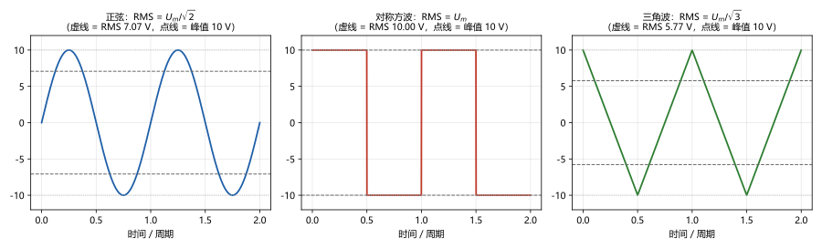
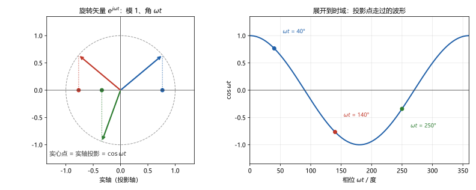
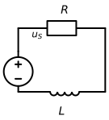
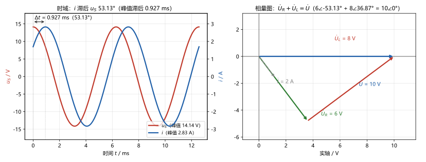

# 第 13 讲：相量法

> **前置**：第 09–12 讲（C/L 伏安关系、动态电路方法的全部），以及 01–08 讲的电路定律。
> **预计时间**：约 3 小时（含作业）。
>
> **一句话定位**：本课程第一次"换方法"。正弦电源的稳态，用微分方程硬解也能解——但工程师不愿每次都付那份代价。相量法造一条通道：**把正弦量装进复数、把微积分变成代数**。代价是只对"同频正弦的稳态"有效——代价付得起，收益极大：从本讲起，整门课进入"复数版电阻电路"时代。
>
> **本讲回答什么**：
> 1. 相量到底是什么？凭什么转成复数，微积分就变代数了？
> 2. 有效值是什么？为什么家里 220 V 不是峰值？
> 3. 正弦量的三要素（振幅、频率、初相）在相量里怎么体现？频率去哪了？
> 4. "相量只保留两个信息"——少一个信息凭什么不失真？
> 5. 两个相量相加，是瞬时值相加吗？频率不同还能加吗？
> 6. 相量法和拉普拉斯变换什么关系？
>
> **这一讲有真实验证**：旋转矢量的投影与余弦逐点吻合（偏差 0）；同频相量相加 vs 瞬时值相加（残差 7.1×10⁻¹⁵）；异频相加的拍频反例（振荡包络 |20cos100t|）；五种波形的有效值数值积分 vs 理论值（一致）；微分性质的数值微分对照（1.2×10⁻⁵）；运行例 RL 电路的相量解 vs RK4 数值全解（1.2×10⁻¹⁴）与稳态段对照（7.7×10⁻⁵）；KVL 相量核对（8.9×10⁻¹⁶）（脚本 `scripts/lec13-01`、`lec13-02`）。作业数字全部预验证。

---

## 引子：一道题，两种解法

**题**（图 3 的电路）：$u_S(t) = 10\sqrt{2}\cos 1000t\ \mathrm{V}$ 的电源接入 $R = 3\ \Omega$、$L = 4\ \mathrm{mH}$ 的串联回路，求**稳态电流** $i(t)$。

**路线一（12 讲的老方法）**：解微分方程 $L\frac{\mathrm{d}i}{\mathrm{d}t} + Ri = u_S$。设稳态特解 $i = A\cos 1000t + B\sin 1000t$，代入、展开三角、按 $\cos$ 项与 $\sin$ 项分别联立（两个方程解两个系数）、再叠上齐次通解 $Ke^{-t/\tau}$、用 $i(0) = 0$ 定 $K$——一套走下来两大页，且 $\omega$、$R$、$L$ 任何一个数一变，全部重来。

**路线二（本讲要讲的相量法）**：

$$
Z = 3 + \mathrm{j}4 = 5\angle 53.13^\circ\ \Omega
\quad\Longrightarrow\quad
\dot I = \frac{10\angle 0^\circ}{5\angle 53.13^\circ} = 2\angle -53.13^\circ\ \mathrm{A}
\quad\Longrightarrow\quad
i(t) = 2\sqrt{2}\cos(1000t - 53.13^\circ)\ \mathrm{A}
$$

**三行。** 同一个答案（数值验证见 §3）。这中间既不联立系数、也不解微分方程——微分去哪了？答案是：**它被藏进了一个复数乘法里**。本讲全部的内容，就是把这"三行"的交易讲清楚：凭什么敢这么算、代价是什么、什么时候不许这么算。

---

## 1. 正弦量：三要素、相位差与有效值

### 1.1 正弦量的三要素与标准式

**正弦量**：随时间按正弦（余弦）规律变化的电压或电流。本课程全用**余弦**作基准形式（教材惯例——遇到 $\sin$ 时先转成 $\cos$）：

$$u(t) = U_m\cos(\omega t + \psi)$$

三个数决定一切，称为**正弦量的三要素**：

- **振幅 $U_m$**（峰值）：波峰到零点的距离（取正数）；
- **角频率 $\omega$**：转得快慢，单位 rad/s；与频率的关系 $\omega = 2\pi f$（工频 $f = 50\ \mathrm{Hz}$ → $\omega = 314\ \mathrm{rad/s}$）；
- **初相 $\psi$**：$t = 0$ 时刻的"相位"（整只角 $\omega t + \psi$ 叫**相位**），单位常用度或弧度。

**怎么读 $\psi$ 的符号**：$\psi > 0$ 表示这只波形比"$\psi = 0$ 的基准波"**提前**到达它的每一个里程碑（过零、峰值）——即"超前"；$\psi < 0$"滞后"。运行例的 $i(t) = 2\sqrt{2}\cos(1000t - 53.13^\circ)$ 相比 $u_S$ 就是滞后 $53.13^\circ$。

### 1.2 相位差：超前与滞后

两只**同频**正弦量的**相位差** = 初相之差：

$$\varphi = \psi_u - \psi_i$$

- $\varphi > 0$：$u$ **超前** $i$ $\varphi$ 角；
- $\varphi < 0$：$u$ **滞后** $i$；
- $\varphi = 0$ 同相；$\pm 90^\circ$ 正交；$180^\circ$ 反相。

**例**：$u = 10\sqrt{2}\cos(\omega t + 45^\circ)$、$i = 2\sqrt{2}\cos(\omega t - 15^\circ)$ → $\varphi = 45^\circ - (-15^\circ) = 60^\circ$，$u$ 超前 $i$ $60^\circ$。

**两个注意**（后面都要用）：

- 相位差与"时间原点怎么选"无关——两只波形一起平移，差值不变；
- **不同频率的两只正弦量"相位差"没有意义**——它们的相对位置一直在变（下一节末的反例会看到后果）。

### 1.3 战斗前的最后侦察

回头看引子的路线一，正弦稳态问题的"苦"有三层：

1. **每次都要解方程**：设特解、联立系数、叠齐次解、定常数——而且这一套每换一道题重来一遍；
2. **参数一改全重来**：$U_m$、$\omega$、$\psi$、$R$、$L$、$C$ 任意一个变，方程和联立全部重写；
3. **元件的"特性"被埋在解里**：解完之后你会发现——电阻上电压与电流同相、电感上电压超前电流 $90^\circ$、电容上电压滞后电流 $90^\circ$；但每次都得从解里"再发现"一遍。

**目标**：造一条通道，把"正弦量之间的关系"从"微分方程世界"搬到"复数世界"里去算——在那里，上面三层苦全部消失：

- 正弦量 ↔ 一个复数（**相量**）：振幅与初相进复数，$\omega$ 暂时寄存；
- 微积分 ↔ 复数的乘除（乘一个 $\mathrm{j}\omega$）；
- 元件的"特性"  三行简单的复数比例式（同相/超前/滞后一次写清）。

通道的原料是**复数**和**旋转**——§2 开工。动工之前，先把一个工程上天天用的"大小"定义清楚：有效值。

### 1.4 有效值（RMS）

**问题**：正弦电压一会儿正一会儿负、大小也在变，"这只交流电压到底多大"没法用峰值敷衍——工程上要一个能**代表其做功能力**的数。

**定义**：交流量的**有效值** = 与之"发热等效"的直流值——同一只电阻，通交流（一个周期）与通某直流，发热一样多，那个直流值就是该交流的有效值。写成定义式：

$$U = \sqrt{\frac{1}{T}\int_0^T u^2(t)\,\mathrm{d}t}$$

名字 **RMS**（Root-Mean-Square，"均方根"）就是操作顺序：**平方 → 平均 → 开根**。

**正弦量的有效值**：$u = U_m\cos(\omega t + \psi)$ 代入，核心是"$\cos^2$ 一个周期的平均值 = $\frac{1}{2}$"，于是：

$$\boxed{U = \frac{U_m}{\sqrt{2}} \approx 0.707\,U_m}$$

**这就是"家里 220 V"的来历**：220 V 是**有效值**，插座的峰值其实是 $220\sqrt{2} \approx 311\ \mathrm{V}$（图 2）。电压表测的是有效值，铭牌标的是有效值——全世界说交流"多大"都在说有效值。

**有效值依赖于波形**（脚本实测表，$U_m = 1$）：

| 波形 | 数值 RMS | 理论值 | 说明 |
|---|---|---|---|
| 正弦 | 0.7071 | $1/\sqrt{2}$ | 本课程主要波形 |
| 对称方波 | 1.0000 | $U_m$ | 方波的有效值就是峰值 |
| 三角波 | 0.5774 | $1/\sqrt{3}$ | 与正弦不同 |
| 半波整流 | 0.5000 | $U_m/2$ | |
| 全波整流 | 0.7071 | $1/\sqrt{2}$ | |

> **图 2 怎么读**：三种波形峰值都是 10 V（点线），但有效值（虚线）不同——正弦 7.07 V、方波 10 V、三角波 5.77 V。"有效值"问的是"等效发热能力"，波形不同、答案不同。

**有效值的下一个岗位**：本课程相量的**模**就用它（读下去就知道为什么）。

---

## 2. 相量与微分性质

### 2.1 一分钟复数工具箱

复数（complex number）两种写法，各有所长：

- **直角式**：$\dot A = a + \mathrm{j}b$（$\mathrm{j}$ 是虚单位，$\mathrm{j}^2 = -1$；电路课写 $\mathrm{j}$，不写 $i$——避免与电流混淆）；
- **极坐标式**：$\dot A = r\angle \theta$，其中 $r = |\dot A| = \sqrt{a^2+b^2}$ 是**模**，$\theta = \arg\dot A$ 是**辐角**。

**互化与运算**（照用即可）：

| 运算 | 用什么写法 | 规则 |
|---|---|---|
| 加减 | 直角式 | 实部、虚部分别加减 |
| 乘除 | 极坐标式 | **模乘除、角加减**：$r_1\angle\theta_1 \times r_2\angle\theta_2 = (r_1r_2)\angle(\theta_1+\theta_2)$ |
| 极坐标→直角 | — | $r\angle\theta = r\cos\theta + \mathrm{j}r\sin\theta$（由**欧拉公式** $e^{\mathrm{j}\theta} = \cos\theta + \mathrm{j}\sin\theta$ 而来；欧拉公式本身只需"认脸"：它把指数和旋转接在一起） |

**$\mathrm{j}$ 的几何意义**（本讲最关键的小事实）：乘 $\mathrm{j}$ = **逆时针旋转 $90^\circ$**——因为 $\mathrm{j} = 1\angle 90^\circ$，乘它 = 角加 $90^\circ$、模不变。

### 2.2 旋转因子与相量

看一个模为 1、辐角随时间"匀速长大"的复数：

$$e^{\mathrm{j}\omega t} = \cos\omega t + \mathrm{j}\sin\omega t$$

它在复平面上就是一根**以角速度 $\omega$ 逆时针转圈的矢量**（图 1 左）——叫**旋转因子**。它最妙的性质是"投影"：**它的实部随时间的轨迹，恰好是余弦波**（图 1 右）：

$$\operatorname{Re}\left[e^{\mathrm{j}\omega t}\right] = \cos\omega t$$

> **图 1 怎么读**：左：$e^{\mathrm{j}\omega t}$ 是单位圆上的旋转矢量；三个时刻分别用蓝、红、绿画出——每根矢量的**实轴投影**（实心点）就是该时刻的 $\cos\omega t$。右：把投影点展开到时间轴上，连起来就是余弦波形。

跟着这个思路走一步：任何一只余弦量都能写成"某个固定复数 × 旋转因子"的实部：

$$u(t) = U_m\cos(\omega t + \psi) = \operatorname{Re}\left[\,U_m e^{\mathrm{j}\psi}\cdot e^{\mathrm{j}\omega t}\,\right]$$

看方括号里拆出的两件事：$e^{\mathrm{j}\omega t}$ 是**全体共用**的旋转（频率）；而 $U_m e^{\mathrm{j}\psi}$ 是一只**不随时间转的固定复数**——它装着这只正弦量的"振幅"（模）和"初相"（辐角）。把这只固定复数单独拎出来、用有效值做模，就是**相量**（phasor）：

$$\boxed{\dot U = U\angle \psi \qquad (U = U_m/\sqrt{2}\ \text{为有效值})}$$

**瞬时式与相量的双向转换表**（本课程全程用**有效值口径**）：

| 瞬时式（余弦基准） | 相量（有效值口径） | 转换法则 |
|---|---|---|
| $u = U_m\cos(\omega t + \psi)$ | $\dot U = \dfrac{U_m}{\sqrt{2}}\angle\psi$ | 振幅除以 $\sqrt{2}$ 作模、初相作辐角 |
| $u = \sqrt{2}U\cos(\omega t + \psi)$ | $\dot U = U\angle\psi$ | 直接读 |

运行例对照：

$$u_S = 10\sqrt{2}\cos 1000t\ \mathrm{V} \;\longleftrightarrow\; \dot U_S = 10\angle 0^\circ\ \mathrm{V}, \qquad
i = 2\sqrt{2}\cos(1000t - 53.13^\circ)\ \mathrm{A} \;\longleftrightarrow\; \dot I = 2\angle -53.13^\circ\ \mathrm{A}$$

**记号约定**（全课程统一）：瞬时值**小写**（$u$、$i$）、相量**大写加点**（$\dot U$、$\dot I$）；相量的模是**有效值**。

> **口径纪律（现在就钉住）**：相量的模也可以取振幅（"振幅口径"），那是另一套同样自洽的体系——但**同一道题里绝不许混用**。本课程从本讲起到结尾，一律有效值口径；看到别的教材用振幅口径，转换时在模上除/乘 $\sqrt{2}$ 即可，别慌。

### 2.3 三要素去哪了：频率的省略与"两信息"的约定

核对一遍，回答"少一个信息凭什么不失真"：

- **振幅** → 进了相量的**模**；
- **初相** → 进了相量的**辐角**；
- **角频率 $\omega$** → **不进相量，被"全场约定"掉了**。

凭什么敢省略 $\omega$？因为接下来处理的世界有一个硬前提：**全电路只有一个频率**——正弦电源的频率 $\omega$；线性电路对同频激励产生的稳态响应，处处仍是同一个 $\omega$。在这个前提下，$\omega$ 是"全场公约数"：不记它、也丢不了——**写回瞬时式时补上即可**（转换表在 §2.2）。相量记录的是各量之间的**相对关系**（谁大谁小、谁超前谁滞后）——这正是稳态分析要的全部内容。

所以"不出失真"的完整表述是：**在同频前提下，正弦量与相量一一对应、双向可逆**。反过来，一旦电路里出现两个不同频率——相位差都不再恒定，正弦量与相量的对应关系当场破产（§3.4 处理）。

### 2.4 微分（与积分）性质：微积分变代数的心脏

**核心结论**：对正弦量求导，在相量域里就是——**乘一个 $\mathrm{j}\omega$**。

验证一行就够。设 $x(t) = \sqrt{2}X\cos(\omega t + \psi)$，则：

$$\frac{\mathrm{d}x}{\mathrm{d}t} = \sqrt{2}\,\omega X\cos(\omega t + \psi + 90^\circ)$$

——"振幅乘 $\omega$、相位加 $90^\circ$"。这两件事用复数一次完成：$X\angle\psi$ 乘上 $\omega\angle 90^\circ = \mathrm{j}\omega$：

$$\boxed{\frac{\mathrm{d}}{\mathrm{d}t} \;\longleftrightarrow\; \times\,\mathrm{j}\omega}$$

**积分**是对偶：$\int \cdot \,\mathrm{d}t \longleftrightarrow \div\,\mathrm{j}\omega$（反操作；积分常数丢弃——理由见 §3.3）。

（脚本实测：$x = \sqrt{2}\cdot 5\cos(1000t+20^\circ)$ 的数值微分 vs 相量预测 $5000\angle 110^\circ$，最大偏差 $1.2\times10^{-5}$——与二阶差分自身的截断误差同量级，即相量预测精确成立。）

### 2.5 元件伏安关系的相量版

把 $\times\mathrm{j}\omega$ 用到三个元件自己的伏安关系上（09 讲逐条翻译）：

| 元件 | 瞬时形式 | 相量形式 | 读法 |
|---|---|---|---|
| $R$ | $u = Ri$ | $\dot U = R\dot I$ | 电压电流**同相**，模成正比例 $R$ |
| $L$ | $u = L\frac{\mathrm{d}i}{\mathrm{d}t}$ | $\dot U = \mathrm{j}\omega L\,\dot I$ | 电压**超前**电流 $90^\circ$（乘 $\mathrm{j}$），模放大 $\omega L$ 倍 |
| $C$ | $i = C\frac{\mathrm{d}u}{\mathrm{d}t}$ | $\dot U = \dfrac{\dot I}{\mathrm{j}\omega C}$ | 电压**滞后**电流 $90^\circ$（除以 $\mathrm{j}$ = 转 $-90^\circ$）；模 $= |\dot I|/(\omega C)$——频率越低电压越大（电容"阻低频"的相量表现） |

**三行推导都只用了 §2.4**（以 $L$ 为例：$\dot U = L\dot{\left(\frac{\mathrm{d}i}{\mathrm{d}t}\right)} = L\cdot\mathrm{j}\omega\dot I = \mathrm{j}\omega L\dot I$）。

> **14 讲预告**：这三行是 14 讲"阻抗"的全部原料——把 $\dot U/\dot I$ 打包成一只复数 $Z$（$R$、$\mathrm{j}\omega L$、$1/(\mathrm{j}\omega C)$ 就是三种元件的 $Z$），整门课的老方法（串并联、等效、定理……）将整体迁移到复数域。本讲先把最基础的用起来。

**运行例会用到的一只组合**：$R$ 与 $L$ **串联**——串联电流相同，"总电压 = 各段电压的相量和"（KVL 相量形式，下节）：$\dot U = R\dot I + \mathrm{j}\omega L\dot I = (3+\mathrm{j}4)\dot I$。括号里那个复系数（$R$ 与 $\mathrm{j}\omega L$ 之和）先按"总系数"用着，14 讲给它正名。

---

## 3. 电路定律的相量形式与求解示范

### 3.1 KCL/KVL 的相量形式

**结论**：旧定律在新方法下**原样照用**——

$$\mathrm{KCL}:\ \sum \dot I = 0, \qquad \mathrm{KVL}:\ \sum \dot U = 0$$

**一行论证**：同频正弦量的和还是同频正弦量；瞬时域的等式（如 KCL 的 $\sum i = 0$）对**所有时刻**成立，把每个量都写成"相量 × 公共旋转因子"再提取公因子，剩下的就是相量等式。

**这为什么值钱**：整门课已学的方法——串并联、分压分流、结点法、回路法、叠加、戴维南……将在复数域全部可用（14 讲起逐章验证）。本讲只验证最关键的一条：KVL。

### 3.2 运行例全解

**电路**（图 3）：$u_S = 10\sqrt{2}\cos 1000t\ \mathrm{V}$、$R = 3\ \Omega$、$L = 4\ \mathrm{mH}$（则 $\omega L = 4\ \Omega$），求稳态 $i(t)$、$u_R(t)$、$u_L(t)$。

> **图 3 怎么读**：电压源 $u_S$ 接 $R$、$L$ 串联回路。电源的峰值 $10\sqrt{2} \approx 14.14$ V、有效值 10 V；请求出稳态电流与两段电压的"大小与相位"。

> **相量法求解五步（模板）**：
> 1. **转相量**：瞬时式 → 相量（有效值口径）；元件参数备好（$\omega L$、$1/(\omega C)$）；
> 2. **列相量方程**：KCL/KVL 照用，元件用相量形式代入；
> 3. **解出相量**：复数代数运算（乘除用极坐标、加减用直角）；
> 4. **核对**：KVL/KCL 相量核验、能量/幅值关系自检；
> 5. **写回瞬时**：相量 → 瞬时式（补回 $\omega$、模乘 $\sqrt{2}$）。

走一遍：

1. **转相量**：$\dot U_S = 10\angle 0^\circ\ \mathrm{V}$；
2. **列方程**（KVL）：$\dot U_S = \dot U_R + \dot U_L = R\dot I + \mathrm{j}\omega L\dot I = (3 + \mathrm{j}4)\dot I$；
3. **解**：$\dot I = \dfrac{10\angle 0^\circ}{3+\mathrm{j}4} = \dfrac{10\angle 0^\circ}{5\angle 53.13^\circ} = 2\angle -53.13^\circ\ \mathrm{A}$；
4. **派生与核对**：$\dot U_R = 3\dot I = 6\angle -53.13^\circ\ \mathrm{V}$、$\dot U_L = \mathrm{j}4\dot I = 8\angle 36.87^\circ\ \mathrm{V}$；核对：$6\angle -53.13^\circ + 8\angle 36.87^\circ = (3.6-\mathrm{j}4.8) + (6.4+\mathrm{j}4.8) = 10\angle 0^\circ$ ✓（脚本残差 $8.9\times10^{-16}$）；
5. **写回**：$i(t) = 2\sqrt{2}\cos(1000t - 53.13^\circ)\ \mathrm{A}$。

> **图 4 怎么读**：左：$u_S$ 与 $i$ 的时域波形（双纵轴）——电流峰值滞后电压峰值 $\Delta t = 53.13^\circ/\omega = 0.927\ \mathrm{ms}$，这就是"滞后 $53.13^\circ$"的物理含义。右：相量图——$\dot U_R$ 与 $\dot U_L$ 首尾相接合成 $\dot U_S$（直角三角，6-8-10）；$\dot I$ 与 $\dot U_R$ 同方向（电阻同相）。

**从这里挖两个必须记住的事实**：

- **有效值不能直接相加**：$U_R = 6\ \mathrm{V}$、$U_L = 8\ \mathrm{V}$，但电源有效值是 $10\ \mathrm{V}$——**不是 $6+8=14$**！因为两段电压相位差 $90^\circ$，叠加要按相量（这时恰好是勾股：$\sqrt{6^2+8^2} = 10$）。"电压三角形"就是对这件事的图解；
- **相位差是"留在解里"的一等公民**：只报大小是不够的——$i$ 滞后 $53.13^\circ$ 这个信息，跟"有效值 2 A"一样是答案的一部分。

### 3.3 写回瞬时式与"全解 = 稳态 + 暂态"

相量法给出的 $i(t)$ 是**稳态**——真实电路从合闸那一刻起的全貌还得补上暂态（12 讲 §4.3 的积分常数，被相量法"丢弃"的那部分）：

$$i_{\text{全}}(t) = \underbrace{2\sqrt{2}\cos(1000t - 53.13^\circ)}_{\text{稳态：相量法}} + \underbrace{Ke^{-t/\tau}}_{\text{暂态：10-11 讲方法}}, \qquad \tau = \frac{L}{R} = 1.333\ \mathrm{ms}$$

用初始条件 $i(0) = 0$ 定常数：$K = -i_{\text{稳}}(0) = -2\sqrt{2}\cos(-53.13^\circ) = -1.697\ \mathrm{A}$。（脚本实测：解析全解 vs RK4 数值积分最大偏差 $1.2\times10^{-14}$；$10\tau$ 之后与纯稳态的偏差只剩 $7.7\times10^{-5}$——暂态确实已经消失。）

**为什么不直接让相量法管暂态？** 因为相量法的"省略"（丢积分常数）正是它换速度的代价：稳态结果不需要初始条件、不需要解齐次方程——代价是拿不到暂态。**工程上这笔交易几乎总是划算**：50 Hz 电路接入后的暂态通常几十毫秒内消亡，长期现实（电机、变压器、电网）里站着的就是稳态。

### 3.4 适用范围：三条硬边界

1. **同频**：全电路只有一个频率（正弦电源的频率）。反例：$10\cos 1000t + 10\cos 1200t$——两只正弦频率不同，"相量和"无从定义；真实的和是**拍频**（包络 $|20\cos 100t|$、拍周期 62.8 ms，脚本实测），根本不是单频正弦；
2. **稳态**：不含暂态（§3.3）；冲击、开关动作的过渡过程要找 10–12 讲；
3. **正弦 + 线性**：激励必须是正弦（方波、三角波先经傅里叶分解成正弦堆——20 讲）；电路必须线性（叠加是全部论证的前提——06 讲的老边界）。

多频激励怎么办？**分别算、再叠加**：每个频率各自一套相量系统（各有各的 $\omega$），算完写回瞬时式再相加——这个套路 20 讲（非正弦周期电流电路）正式展开。

---

## 4. 格局展望

### 4.1 相量与拉普拉斯变换（认识层）

先把本讲工具与未来的大工具对个位置：**相量法是拉普拉斯变换的一个特例**——在复频率 $s$ 取纯虚值 $s = \mathrm{j}\omega$、且只看稳态时的样子（21–22 讲揭晓）。相量法为了速度丢掉的暂态（积分常数），拉普拉斯会原样捡回来（初值自动打包进方程）。现在只需知道它是那套大工具的一个特例——不影响眼前使用。

### 4.2 阻抗：复数版的电阻

本讲已经准备好三件工具：

1. **KCL/KVL 相量形式**（旧定律原样照用）；
2. **元件相量形式**（$R$、$\mathrm{j}\omega L$、$1/(\mathrm{j}\omega C)$ 三行）；
3. **求解五步模板**（转 → 列 → 解 → 核 → 写回）。

14 讲把"$\dot U/\dot I$"正式打包成**阻抗** $Z$——从此整门课的老方法（串并联、分压分流、结点法、回路法、定理）全体迁移到复数域，一门"复数版电阻电路"课正式开门。

> **态度表（相量法部分）**
>
> | 内容 | 态度 |
> |---|---|
> | 三要素标准式、相位差（超前/滞后判定） | **能默写、能看波形读** |
> | 有效值定义、$U_m/\sqrt{2}$、220 V 的真相 | **能推导、经典数字要背** |
> | 旋转投影图景与相量定义、双向转换 | **能讲给人听、能闭眼互转**；口径纪律焊死 |
> | "两信息不失真"与同频前提 | 能完整表述 |
> | 微分性质（一行推导） | **能默写、能复推** |
> | 元件相量形式三行 | **能默写**；超前/滞后方向一次不错 |
> | KCL/KVL 相量形式、求解五步模板 | **能照做**；核对成习惯 |
> | 三条边界（同频/稳态/线性） | 能各配一个反例 |
>
---

## 常见误区（本节零新知识，只破误）

> 以下每条只是"对答案 + 校准"，没有新知识——每一句都已在正文系统小节里教过。

1. **"220 V 是交流电的峰值"**（§1.4）。错。220 V 是**有效值**；峰值 $220\sqrt{2} \approx 311\ \mathrm{V}$。仪表读数、铭牌参数一律是有效值。
2. **"有效值可以直接相加：6 V + 8 V = 14 V"**（§3.2）。错。不同相位的正弦量叠加要按**相量**（矢量）相加；运行例里 $U_R = 6$、$U_L = 8$，电源却是 $\sqrt{6^2+8^2} = 10\ \mathrm{V}$。
3. **"相量里没有 $\omega$，所以频率无所谓"**（§2.3、§3.4）。错。省略 $\omega$ 的前提是**全电路同频**；不同频的相量没有相加的定义（后果是拍频——脚本里有反例）。
4. **"$\sin$、$\cos$ 混着直接转相量"**（§1.1、§2.2）。错。本课程以**余弦**为基准——$\sin$ 先转 $\cos$（减 $90^\circ$）再转相量；不转换会凭空差 $90^\circ$ 的相位。
5. **"相量法顺手把暂态也求了"**（§3.3）。错。相量法丢掉的积分常数正是暂态——它只给稳态；全解要按"稳态 + 暂态"补（10–12 讲的方法）。
6. **"相量的模可以随手换：一会儿峰值、一会儿有效值"**（§2.2）。错。两种口径各自自洽，但**同一道题里必须统一**；本课程全程有效值口径。
7. **"乘 $\mathrm{j}$ 不过是符号游戏"**（§2.4）。不是。$\mathrm{j}$ 是"逆时针转 $90^\circ$"的代数化身——乘 $\mathrm{j}$ 就是相位加 $90^\circ$，这正是电感电压超前电流 $90^\circ$ 的全部奥秘。

---

## 本讲小结

一页纸的骨架：

- **正弦量三要素**：$u = U_m\cos(\omega t + \psi)$——振幅、角频率、初相；相位差 $\varphi = \psi_u - \psi_i$（同频才有意义）。
- **有效值**：发热等效的直流值（RMS：平方→平均→开根）；正弦 $U = U_m/\sqrt{2}$；220 V ↔ 311 V；方波是 $U_m$、三角波是 $U_m/\sqrt{3}$——**有效值依赖波形**。
- **相量**：$\dot U = U\angle\psi$（本课程有效值口径）——振幅进模、初相进辐角、$\omega$ 是全场公约数（被省略、写回时补）；正弦量与相量在场同频前提下一一对应。
- **微分性质**：$\dfrac{\mathrm{d}}{\mathrm{d}t} \leftrightarrow \times\mathrm{j}\omega$、$\int \leftrightarrow \div\mathrm{j}\omega$——"微积分变代数"的心脏；数值验证 $1.2\times10^{-5}$。
- **元件相量形式**：$\dot U = R\dot I$（同相）/ $\dot U = \mathrm{j}\omega L\,\dot I$（超前 $90^\circ$）/ $\dot U = \dfrac{\dot I}{\mathrm{j}\omega C}$（滞后 $90^\circ$）。
- **KCL/KVL 相量形式**：$\sum\dot I = 0$、$\sum\dot U = 0$——旧定律全体迁移的起点。
- **求解五步模板**：转相量 → 列方程 → 解（复数代数）→ 核对 → 写回瞬时。
- **运行例数字**：$Z_{\text{总}} = 3+\mathrm{j}4 = 5\angle 53.13^\circ\ \Omega$；$\dot I = 2\angle -53.13^\circ\ \mathrm{A}$；$\dot U_R = 6\angle -53.13^\circ$、$\dot U_L = 8\angle 36.87^\circ$、核对 $= 10\angle 0^\circ$（$8.9\times10^{-16}$）；$i(t) = 2\sqrt{2}\cos(1000t-53.13^\circ)\ \mathrm{A}$。
- **全解 = 稳态 + 暂态**：$K = -1.697\ \mathrm{A}$、$\tau = 1.333\ \mathrm{ms}$；解析 vs 数值 $1.2\times10^{-14}$；$10\tau$ 后稳态段偏差 $7.7\times10^{-5}$。
- **三条边界**：同频（拍频反例）、稳态（不含暂态）、正弦 + 线性（多频先分解再叠加——20 讲；非正弦先傅里叶）。
- **实测合集**：投影偏差 0；同频相加 $7.1\times10^{-15}$；拍周期 62.8 ms；RMS 表一致；微分性质 $1.2\times10^{-5}$；KVL 核对 $8.9\times10^{-16}$。

## 掌握度自测

- [ ] 我能默写正弦量标准式、说出三要素，并当场读出一对波形的超前/滞后。
- [ ] 我能从定义推导 $U = U_m/\sqrt{2}$，并说出 220 V 与 311 V 各是什么。
- [ ] 我能画/讲"旋转矢量投影出余弦"的图景，并默写相量定义与双向转换。
- [ ] 我能完整回答"少一个信息（$\omega$）凭什么不失真"，并说出它的前提。
- [ ] 我能一行推导微分性质，并说明"$L$ 电压超前 $90^\circ$"从哪来。
- [ ] 我能默写三条元件相量形式，超前/滞后方向不出错。
- [ ] 我能按五步模板独立复现运行例（含 KVL 相量核对与写回）。
- [ ] 我能说清"有效值 6 V + 8 V ≠ 14 V"的原因。
- [ ] 我能列出三条适用范围并各配反例；能说清全解为什么 = 稳态 + 暂态。
- [ ] 我能复跑 `scripts/lec13-01` 与 `scripts/lec13-02`，并解释输出里每一个数字。

## 作业

> 答案只能用**已教概念**（本讲范围：三要素、相位差、有效值、相量定义与转换、微分性质、元件相量形式、KCL/KVL 相量形式、五步模板；01–12 讲全部承接）。先独立做，再对答案。

### 基础

**Q1. 概念辨析**：判断对错，并给一句话理由。

(a) "相量就是把正弦量写成复数——任何场合都能这么转。"
(b) "220 V 是交流电压的峰值。"
(c) "两个不同频率的相量可以直接相加。"
(d) "相量乘以 $\mathrm{j}$ 相当于相位超前 $90^\circ$。"
(e) "相量的模用峰值还是有效值无所谓，同一题里换着用也行。"

**参考答案**：

(a) 错。相量只对**同频正弦的稳态**一整套成立；暂态、非正弦、多频混合都不能直接转。
(b) 错。220 V 是有效值；峰值约 311 V。
(c) 错。不同频时相位差不恒定——相量相加没有定义（后果是拍频）。
(d) 对。$\mathrm{j} = 1\angle 90^\circ$，乘它就是"模不变、角加 $90^\circ$"。
(e) 错。两种口径必须**全程统一**；本课程用有效值口径。
验算：五小题各回一个机制词：适用边界 / 有效值 / 同频前提 / j 的几何 / 口径纪律。

**Q2. 相量互化**：把 $u(t) = 8\sqrt{2}\sin(1000t + 30^\circ)\ \mathrm{V}$ 转成相量；再把 $\dot I = 5\angle 120^\circ\ \mathrm{A}$（$\omega = 1000$）写回瞬时式。

**参考答案**：

$u$：先转余弦基准——$\sin\theta = \cos(\theta - 90^\circ)$，故 $u = 8\sqrt{2}\cos(1000t - 60^\circ)\ \mathrm{V}$ → $\dot U = 8\angle -60^\circ\ \mathrm{V}$。
$\dot I$：$i(t) = 5\sqrt{2}\cos(1000t + 120^\circ)\ \mathrm{A}$。
验算：转换法则"有效值作模、初相作辐角、写回补 $\sqrt{2}$ 与 $\omega$"双向核对。脚本 `lec13-02` 实验 3。

**Q3. 相位差**：$u = 10\sqrt{2}\cos(\omega t + 45^\circ)$、$i = 2\sqrt{2}\cos(\omega t - 15^\circ)$：求相位差并判断超前/滞后；若把 $i$ 改写成 $\sin$ 形式 $i = 2\sqrt{2}\sin(\omega t + 75^\circ)$，相位差变不变？

**参考答案**：

$\varphi = 45^\circ - (-15^\circ) = 60^\circ$，$u$ 超前 $i$ $60^\circ$。
不变：$\sin(\omega t + 75^\circ) = \cos(\omega t + 75^\circ - 90^\circ) = \cos(\omega t - 15^\circ)$——同一只波形换写法，物理不变（**但转相量前必须先转回余弦**）。
验算：两种写法的瞬时值逐点相等。

**Q4. 计算·RC 电路相量求解**：$u_S = 20\sqrt{2}\cos 1000t\ \mathrm{V}$、$R = 6\ \Omega$、$C = 125\ \mu\mathrm{F}$ 串联，求稳态 $i(t)$、$u_C(t)$，并做 KVL 相量核对。

**参考答案**：

$\omega C = 1000 \times 125\ \mu\mathrm{F} = 0.125$，$1/(\omega C) = 8\ \Omega$；总系数 $Z = 6 - \mathrm{j}8 = 10\angle -53.13^\circ\ \Omega$。
$\dot I = \dfrac{20\angle 0^\circ}{10\angle -53.13^\circ} = 2\angle 53.13^\circ\ \mathrm{A}$ → $i(t) = 2\sqrt{2}\cos(1000t + 53.13^\circ)\ \mathrm{A}$（电流**超前**电压）。
$\dot U_C = \dot I \times \dfrac{1}{\mathrm{j}\omega C} = 2\angle 53.13^\circ \times 8\angle -90^\circ = 16\angle -36.87^\circ\ \mathrm{V}$ → $u_C(t) = 16\sqrt{2}\cos(1000t - 36.87^\circ)\ \mathrm{V}$。
核对：$\dot U_R + \dot U_C = 12\angle 53.13^\circ + 16\angle -36.87^\circ = (7.2+\mathrm{j}9.6) + (12.8-\mathrm{j}9.6) = 20\angle 0^\circ$ ✓。
验算：脚本 `lec13-02` 实验 3（核对残差 ~10⁻¹⁵）。

**Q5. 有效值**：用定义计算（或说明）：(a) 幅值 ±10 V 的对称方波；(b) 幅值 10 V 的半波整流正弦；(c) 幅值 10 V 的三角波。

**参考答案**：

(a) 10 V——平方后处处是 $10^2$，平均开根还是 10（不是 $10/\sqrt{2}$！）。
(b) 5 V——平方平均 = 半个周期的 $10^2$ 的平均 = 50，开根 $= 10/2 = 5$。
(c) $10/\sqrt{3} \approx 5.77\ \mathrm{V}$——三角波平方平均 = $U_m^2/3$。
验算：脚本 `lec13-01` 实验 3 的数值积分对照。

### 提高

**Q6. 微分性质**：$i(t) = 5\sqrt{2}\sin(1000t + 20^\circ)\ \mathrm{A}$，用相量法求 $\dfrac{\mathrm{d}i}{\mathrm{d}t}$。

**参考答案**：

先转余弦：$i = 5\sqrt{2}\cos(1000t - 70^\circ)$ → $\dot I = 5\angle -70^\circ$。
导数相量 $= \mathrm{j}\omega\dot I = 1000\angle 90^\circ \times 5\angle -70^\circ = 5000\angle 20^\circ$ → $\dfrac{\mathrm{d}i}{\mathrm{d}t} = 5000\sqrt{2}\cos(1000t + 20^\circ)\ \mathrm{A/s}$。
验算：直接对 $\sin$ 求导：$5\sqrt{2}\times 1000\cos(1000t+20^\circ)$ ✓ 同式。

**Q7. 概念·边界**：

(1) 为什么不同频率的两个正弦量不能"相量相加"？
(2) 相量法为什么不含暂态？暂态要找谁补？

**参考答案**：

(1) 相量系统建立在"全电路同频"上：不同频时两只波形的相位差不恒定（相对位置一直在变），"相量和"没有对应的正弦量；硬加起来得到的是拍频（包络 $|20\cos 100t|$ 那类），不是单频正弦。
(2) 相量法丢掉了微分方程解里的积分常数（齐次通解）——那正是暂态；要暂态就按"全解 = 稳态 + 暂态"回 10–12 讲（换路定则/初值/时间常数）补上。
验算：回 §3.3、§3.4 逐条对号。

### 综合

**Q8. 开放·L 与 C 的同题对偶**：运行例电路中，把电感换成 $C = 250\ \mu\mathrm{F}$（其余不变：$u_S = 10\sqrt{2}\cos 1000t\ \mathrm{V}$、$R = 3\ \Omega$）。

(1) 用相量法求 $i(t)$；
(2) 与 RL 情形的 $\dot I = 2\angle -53.13^\circ$ 对照，说说"同模、反号角"说明了什么；
(3) 做 KVL 相量核对。

**参考答案**（要点）：

(1) $\omega C = 0.25$ → $1/(\omega C) = 4\ \Omega$；$Z = 3 - \mathrm{j}4 = 5\angle -53.13^\circ\ \Omega$；$\dot I = 10\angle 0^\circ / 5\angle -53.13^\circ = 2\angle 53.13^\circ\ \mathrm{A}$ → $i(t) = 2\sqrt{2}\cos(1000t + 53.13^\circ)\ \mathrm{A}$。
(2) 模相同（2 A、同一条"3-4-5"），辐角从 $-53.13^\circ$ 翻到 $+53.13^\circ$：电流从"滞后"变"超前"——这正是 $L$（电压超前 $90^\circ$）与 $C$（电压滞后 $90^\circ$）的对偶在解里的直接体现。
(3) $\dot U_R = 3\dot I = 6\angle 53.13^\circ\ \mathrm{V}$；$\dot U_C = \dot I \times 4\angle -90^\circ = 8\angle -36.87^\circ\ \mathrm{V}$；核对：$6\angle 53.13^\circ + 8\angle -36.87^\circ = (3.6+\mathrm{j}4.8)+(6.4-\mathrm{j}4.8) = 10\angle 0^\circ$ ✓。
验算：脚本 `lec13-02` 实验 3（Q8 行的核对与上方一致）。

---

*下一讲预告：第 14 讲《阻抗、导纳与正弦稳态分析》——方法换代完成，开始方法迁移：把 R、L、C 三条相量形式打包成一只复数 $Z$，于是串并联、分压分流、结点法、回路法、各路定理全部原样可用，整门课变成"复数版的电阻电路"。唯一要小心的：这次"电阻"是复数，大小和相位要同时照看。*
