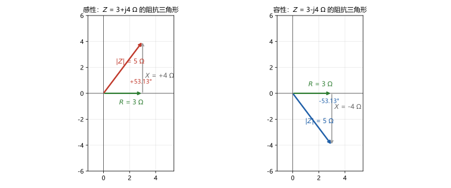
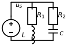
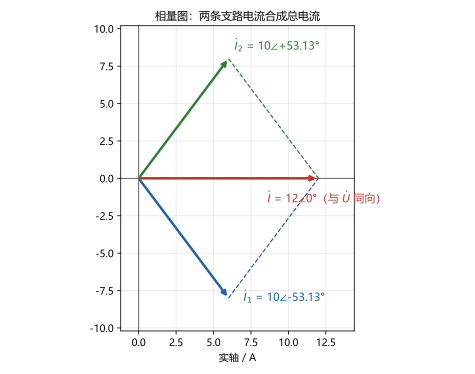

# 第 14 讲：阻抗、导纳与正弦稳态分析

> **前置**：第 13 讲（相量、元件档案、KCL/KVL 相量形式）与 01–12 讲全部武器。
> **预计时间**：约 3 小时（含作业）。
>
> **一句话定位**：武器换代完成，本讲开始"复辟"——13 讲装好的三件行李（KCL/KVL 相量形式、元件档案、求解模板）打包成一只复数 $Z$；于是整门课的老朋友（串并联、分压分流、叠加、戴维南、结点法、回路法……）**全体迁入复数世界**。这就是课程标题里说的"复数版电阻电路"：规则一条不改，只是每个数都带上了角。
>
> **本讲回答什么**：
> 1. 阻抗为什么是复数？一个数同时管"大小"和"相位"是什么意思？
> 2. $Z$ 能理解成"虚假的电阻"吗？
> 3. 前面所有方法（KCL/KVL、等效、定理、结点法）真的能原样搬过来吗？有什么例外？
> 4. 相量图怎么画？它比方程好在哪？
> 5. 相量图的几何解法什么时候不管用？
>
> **这一讲有真实验证**：主例全流程（阻抗合成 $25/6\angle 0^\circ$、导纳法虚部对消、KCL 核账 $0$）；相量解 vs RK4 时域积分（稳态段偏差 $3.9\times10^{-4}$ / $2.9\times10^{-7}$，与暂态残余 $e^{-10}$ 理论值吻合）；几何合成与余弦定理对照（两条路径都到 $12.0$）；作业数字全部预验证（脚本 `scripts/lec14-01`、`lec14-02`）。

## 本讲怎么走（脉络图）

```
引子：同一个"老手艺"，搬进复数世界——先睹为快一份全套答卷
  │
  ├─ 1. 阻抗与导纳：Z = U̇/İ 的两副面孔；导纳与串并联分压分流
  ├─ 2. 相量模型与全体迁移：电路图 -> 相量电路；主例全解；迁移清单与例外
  ├─ 3. 相量图：画法、几何解法、它比方程好在哪、边界在哪
  └─ 4. 收束：哪些一样、哪些是新的——去 15 讲"功率的新故事"
  → 常见误区 → 本讲小结 → 掌握度自测 → 作业
```

> 下一站：§引子。看那份"带角的旧答卷"。

---

## 引子：老手艺，新世界

13 讲的最后我们装箱了三件行李：KCL/KVL 的相量形式、三种元件的相量档案、求解五步模板。本讲把它们和 01–12 讲攒下的全部家当一起搬进复数世界——看看会发生什么。

**先睹为快**（图 1 的电路）：$u_S = 50\sqrt{2}\cos 1000t\ \mathrm{V}$ 的电源，接两条并联支路——支路 1 是 $R_1 = 3\ \Omega$ 串 $L = 4\ \mathrm{mH}$（$\omega L = 4\ \Omega$）；支路 2 是 $R_2 = 3\ \Omega$ 串 $C = 250\ \mu\mathrm{F}$（$1/(\omega C) = 4\ \Omega$）。求两条支路的电流与总电流。

把全套答卷摆出来：

$$Z_{总} = \frac{25}{6}\angle 0^\circ\ \Omega, \qquad
\dot I_{总} = 12\angle 0^\circ\ \mathrm{A}, \qquad
\dot I_1 = 10\angle -53.13^\circ\ \mathrm{A}, \qquad
\dot I_2 = 10\angle +53.13^\circ\ \mathrm{A}$$

眼熟吗？**阻抗合成、分流公式、KCL 核账——全是老面孔**，只是每个数都带上了角。三个值得盯一眼的地方：

1. 两支路一条感性（$+53.13^\circ$ 的阻抗）一条容性（$-53.13^\circ$）——**总电流竟然与电压同相**（$12\angle 0^\circ$）！两支路的电抗效果"对消"了；
2. 两条支路电流的有效值都是 $10\ \mathrm{A}$、方向一正一负，合成出来却只有 $12\ \mathrm{A}$——"有效值不能直接加"的电流版（13 讲那件事的老朋友）；
3. 每一步都在用**旧方法**——这就是本讲的全部主张：**规则不改，全部搬过来**。

---

## 1. 阻抗与导纳

### 1.1 阻抗：把"元件档案"打包成一个数

13 讲给出了三种元件的相量档案：$\dot U = R\dot I$、$\dot U = \mathrm{j}\omega L\,\dot I$、$\dot U = \dot I/(\mathrm{j}\omega C)$。三行长得一样——都是"电压相量 = 某个复数 × 电流相量"。把那个复数单独命名：

$$\boxed{Z = \frac{\dot U}{\dot I} \qquad (\text{阻抗，impedance，单位 } \Omega)}$$

三种元件的阻抗（13 讲档案的直接改名）：

$$Z_R = R, \qquad Z_L = \mathrm{j}\omega L, \qquad Z_C = \frac{1}{\mathrm{j}\omega C} = -\frac{\mathrm{j}}{\omega C}$$

**一般写法**：任何一种阻抗都能拆成

$$Z = R + \mathrm{j}X$$

- **$R$——"电阻"分量**（实部）：与耗散挂钩的部分；
- **$X$——电抗**（reactance，虚部）：与储能元件的"吞吐"挂钩的部分。两种电抗：**感抗** $X_L = \omega L > 0$、**容抗** $X_C = -\dfrac{1}{\omega C} < 0$（那个负号就是"容性滞后 $90^\circ$"的代数化）。

（量纲跑一眼：$\omega L$ 是 $\mathrm{s^{-1}}\times\Omega\cdot\mathrm{s} = \Omega$；$1/(\omega C)$ 里电容单位 $\mathrm{F} = \mathrm{s}/\Omega$，取倒数乘 $\omega$ 也是 $\Omega$ ✓。）

### 1.2 两副面孔与"虚假电阻"辨正

"一个数同时管大小和相位"是怎么做到的？看 $Z$ 的两个"读数"：

- **模 $|Z|$**：电压有效值与电流有效值之比——**比例器**；
- **辐角 $\varphi_Z$**：电压相对于电流的超前角——**移相器**。

$Z = 3+\mathrm{j}4$ 的意思是："电压是电流的 $5$ 倍大，并且超前它 $53.13^\circ$"——一个复数把两件事一次说完。

> **"$Z$ 是虚假的电阻"——不行，三个理由**：
> 1. 电阻只有一个数（实数），$Z$ 有两个自由度（模与角）——多出来的"角"是关键信息，被"当假电阻"就丢了；
> 2. $Z$ 的**虚部不耗能**——它是储能元件吞吐的代数写照，与电阻的"发热"完全不同的物理角色；
> 3. $Z$ 还常常**不是某个元件**，而是"一对端口的整体性格"（多个元件合成出来的）。它是"性格档案"，不是"元件替身"。

**阻抗三角形**（图 3）把 $Z = R + \mathrm{j}X$ 画成直角三角形：



> **图 3 怎么读**：实轴放 $R$、虚轴放 $X$、斜边就是 $|Z|$；斜边与实轴的夹角就是阻抗角 $\varphi_Z$。感性 $X > 0$、三角形朝上（$+53.13^\circ$）；容性 $X < 0$、镜像朝下（$-53.13^\circ$）。主例的两条支路阻抗 $3\pm\mathrm{j}4$ 恰是这两张图的孪生兄弟。

### 1.3 导纳：倒数视角，并联之友

**导纳**（admittance）：阻抗的倒数，

$$Y = \frac{1}{Z} = \frac{\dot I}{\dot U}, \qquad Y = G + \mathrm{j}B$$

单位西门子（$\mathrm{S}$）。$G$ 叫电导、$B$ 叫电纳。三种元件：$Y_R = 1/R$、$Y_L = \dfrac{1}{\mathrm{j}\omega L}$、$Y_C = \mathrm{j}\omega C$。

**它存在的理由**：并联电路里，导纳直接相加——比阻抗的"积除和"省一步。主例预演：$Y_1 = 0.2\angle -53.13^\circ$、$Y_2 = 0.2\angle +53.13^\circ$——**虚部 $\pm0.16\mathrm{j}$ 正好对消**，$Y_{总} = 0.24$（纯电导），一行看到"总电流与电压同相"。

> **一个必须钉住的坑**：$G \ne 1/R$（一般情况下）！$G = 1/R$ 只对"纯电阻元件"成立；对 $Z = R+\mathrm{j}X$，$Y = \dfrac{R - \mathrm{j}X}{R^2+X^2}$，其实部是 $\dfrac{R}{R^2+X^2}$——**不是** $1/R$。所以运算要整个 $Y$ 地算，别拆开各部分取倒数。

### 1.4 串并联、分压分流：20 秒复习版

全部照搬 03 讲的规则，只是每个量换成复数（或相量）：

| 规则 | 复数域版本 |
|---|---|
| 串联 | $Z_{串} = Z_1 + Z_2 + \cdots$ |
| 并联 | $Y_{并} = Y_1 + Y_2 + \cdots$（或两只：$Z_1Z_2/(Z_1+Z_2)$） |
| 分压 | $\dot U_k = \dot U \cdot \dfrac{Z_k}{Z_{串总}}$（分子放自己） |
| 分流 | $\dot I_k = \dot I \cdot \dfrac{Z_{对面}}{Z_1+Z_2}$（**"看对面"**照旧） |

**为什么能照搬**：这些公式的推导只用两样东西——KCL/KVL（相量形式已在 13 讲证明）与"元件伏安是代数比例"（**13 讲相量档案保证**）。两样都在，推导原样成立。

> 下一站：把整个电路图翻译过去，看旧武器成建制地重新开火——§2。

---

## 2. 相量模型与全体迁移

### 2.1 相量模型：把电路图整体翻译过去

给"翻译"一个正式名字：把原电路里的**每个源换成它的相量、每个元件换成它的阻抗**，拓扑一字不改——得到的图叫**相量模型**（phasor model）：

| 原电路 | 相量模型 |
|---|---|
| $u_S(t) = 50\sqrt{2}\cos 1000t$ | $\dot U_S = 50\angle 0^\circ$ |
| $R$ | $Z_R = R$ |
| $L$ | $Z_L = \mathrm{j}\omega L$ |
| $C$ | $Z_C = 1/(\mathrm{j}\omega C)$ |
| 导线、结点、回路 | 一字不改 |

同名节点的进出一个字都不动——**图是同一张图**。这张图上有且只有两种量（相量电压、相量电流），它们满足的规则是 KCL/KVL 的相量形式与元件比例式（都是代数）——于是整门直流课的方法论在这张图上**原样重演**。

### 2.2 主例全解：旧手艺全员上岗

**电路**（图 1）：$u_S = 50\sqrt{2}\cos 1000t\ \mathrm{V}$；支路 1：$R_1 = 3\ \Omega$ 串 $L = 4\ \mathrm{mH}$；支路 2：$R_2 = 3\ \Omega$ 串 $C = 250\ \mu\mathrm{F}$；两支并联。求 $i_1$、$i_2$、$i_{总}$。



> **图 1 怎么读**：左端电压源；中间两条并联支路——左边一条是 $R_1$ 串 $L$，右边一条是 $R_2$ 串 $C$；两条支路对电源并联（上轨、下轨共用）。$\omega = 1000$ 下：$\omega L = 4\ \Omega$、$1/(\omega C) = 4\ \Omega$。

**按模板走一遍**（13 讲五步 + 本节新增的"合成"与"分流"两位旧朋友）：

1. **转相量**：$\dot U_S = 50\angle 0^\circ\ \mathrm{V}$；两条支路建阻抗：$Z_1 = 3+\mathrm{j}4 = 5\angle 53.13^\circ\ \Omega$、$Z_2 = 3-\mathrm{j}4 = 5\angle -53.13^\circ\ \Omega$；
2. **合成**（并联）：先用"积除和"——$Z_1 + Z_2 = 6$、$Z_1Z_2 = 25$，故

$$Z_{总} = \frac{Z_1Z_2}{Z_1+Z_2} = \frac{25}{6} \approx 4.1667\ \Omega \quad(\angle 0^\circ\ \text{——纯阻性！})$$

再用**导纳法核对**：$Y_1 = 0.2\angle -53.13^\circ = 0.12 - \mathrm{j}0.16$、$Y_2 = 0.2\angle +53.13^\circ = 0.12 + \mathrm{j}0.16$——**虚部 $\pm 0.16\mathrm{j}$ 当场对消**，$Y_{总} = 0.24$ → $Z_{总} = 1/0.24 = 25/6$ ✓（两条路殊途同归）；

3. **总电流**：$\dot I_{总} = \dfrac{\dot U_S}{Z_{总}} = \dfrac{50\angle 0^\circ}{25/6} = 12\angle 0^\circ\ \mathrm{A}$；
4. **分流**（照 03 讲"看对面"）：$\dot I_1 = \dot I_{总}\cdot\dfrac{Z_2}{Z_1+Z_2} = 12\angle 0^\circ \times \dfrac{5\angle -53.13^\circ}{6} = 10\angle -53.13^\circ\ \mathrm{A}$；$\dot I_2 = 10\angle +53.13^\circ\ \mathrm{A}$；
5. **核账**（KCL）：$\dot I_1 + \dot I_2 = (6-\mathrm{j}8) + (6+\mathrm{j}8) = 12\angle 0^\circ$ ✓（脚本残差 $0$）；
6. **写回瞬时式**：$i_1 = 10\sqrt{2}\cos(1000t - 53.13^\circ)\ \mathrm{A}$、$i_2 = 10\sqrt{2}\cos(1000t + 53.13^\circ)\ \mathrm{A}$、$i_{总} = 12\sqrt{2}\cos(1000t)\ \mathrm{A}$；
7. **数值对照**：对原电路做 RK4 时域积分，稳态段与相量解的最大偏差为 $3.9\times10^{-4}$（支路 1）与 $2.9\times10^{-7}$（支路 2）——恰好是 $10\tau$ 之后残留的暂态（$e^{-10}$ 量级），即相量解精确刻画稳态。

**三个观察**（每个都值得记住）：

- **"同相"之谜**：总电流与电压同相，等价于说**总阻抗是纯电阻**——怎么做到的？一条支路的电抗为 $+4\ \Omega$（感）、另一条为 $-4\ \Omega$（容）——在并联的导纳视角下 $\pm 0.16\mathrm{j}$ 对消。感性、容性的效果**可以互相抵消**——这是后面"无功补偿"（15 讲）、"谐振"（19 讲）抛出的第一根线头；
- **电流版"有效值不能直接相加"**：$10\ \mathrm{A}$ 与 $10\ \mathrm{A}$ 合成出 $12\ \mathrm{A}$——不是 $20$！因为两电流夹角 $106.26^\circ$（相位差所致）。回忆 13 讲电压版（$6+8 \ne 14$）——同一个道理，现在两台戏一起唱了；
- **分流公式原样好用**：$\dot I_1$ 确实分到 $10\angle -53.13^\circ$——"看对面"（分子放 $Z_2$）在复数域一个字都不用改。

### 2.3 迁移清单与例外登记

"旧方法真的能原样搬过来吗？"——**几乎全体**：逐条对账：

| 旧武器（讲次） | 相量域的形态 | 备注 |
|---|---|---|
| KCL / KVL（02） | $\sum\dot I = 0$、$\sum\dot U = 0$（13 讲已证） | 同频前提 |
| 串并联、分压分流（03） | 换成 $Z$、$Y$ 运算（§1.4） | — |
| 电源模型互换（03） | 相量源 + 内部阻抗 | 方向规则照旧 |
| 叠加定理（06） | 独立源逐个作用；**受控源保留** | 子电路随便挑方法 |
| 替代定理（06） | 照用（已知相量换源） | — |
| 戴维南 / 诺顿（07） | 胶囊里装 $\dot U_{oc}$ 与 $Z_{eq}$（独立源置零） | 三件套求法照旧 |
| 最大功率传输（07） | 条件升级为**共轭匹配** | 15 讲认领 |
| 结点法 / 回路法（04/05） | 复数方程组；观察法照写（结点法里"自导纳"用 $Y$！） | 矩阵自检照用 |
| 受控源（02） | 控制量取相量，系数照旧 | — |

**为什么几乎全体照搬**——一句话原理：这些结论都是从"KCL/KVL + 元件伏安（代数比例）"推出来的**代数恒等式与线性运算**；把数域从实数换成复数，运算规则一条没变，推导自然全部有效。

**例外登记**（"想当然归纳"到此刹车的三件事）：

1. **功率、能量**：乘积量，**不迁移**！"$\dot U \cdot \dot I$ 就是功率"是想当然——复数相乘得到的不是功率（功率涉及"取平均"，在复数域需要专门的公式）；这一大家子单独开讲——15 讲。记住这一条：**一次量（电压、电流）全体迁移；乘积量（功率、能量）全体留下**；
2. **相量图**：只有同频才画得出来（13 讲边界）；
3. **地基照旧**：线性、同频、稳态三条边界（13 讲）是整套迁移的地基——地基之外（暂态、非正弦、非线性）这套搬家不成立。

> 下一站：给"相量"配上眼睛——相量图，画法、用法与边界。

---

## 3. 相量图

### 3.1 画法规则

**相量图**：把电路里各相量"按公共复平面"画出的矢量图。五条规则：

1. **只能同频**（同图不同频没有意义——13 讲）；
2. **选参考相量**：让公共量为基准（放实轴、角取 $0^\circ$）——**并联电路选公共电压**、**串联电路选公共电流**（因为它们是全电路共享的量）；
3. 矢量**长度 $\propto$ 有效值**（标尺任意，关系为准）、**辐角 = 相位差**；
4. 不同量纲的量（电压与电流）**分组画**或明确标注；
5. 顺手标上模值与角度——图要能当核对工具用。

### 3.2 主例的相量图与几何核验

主例是并联电路——按规则 2，**选电压为参考**（放实轴）。三条电流画出来（图 2）：



> **图 2 怎么读**：$\dot I_1 = 10\angle -53.13^\circ$（蓝，滞后电压）与 $\dot I_2 = 10\angle +53.13^\circ$（绿，超前电压）关于实轴对称；虚线是平行四边形合成——两矢量合成得 $\dot I = 12\angle 0^\circ$（红），**与电压方向重合**。"同相之谜"在这张图上一眼可见：两条电流的垂直分量 $8\ \mathrm{A}$ 与 $-8\ \mathrm{A}$ 相互抵消，水平分量 $6+6 = 12\ \mathrm{A}$ 留下。

**几何核验**（不用复数运算的独立算法）：

- 水平分量法：$| \dot I | = 2 \times 10\cos 53.13^\circ = 12\ \mathrm{A}$；
- 余弦定理：$|\dot I|^2 = 10^2 + 10^2 + 2\times10\times10\cos 106.26^\circ = 144$ → $12\ \mathrm{A}$ ✓（脚本两路都到 $12.0000$）。

### 3.3 它比方程好在哪

- **一眼看相位**：谁超前谁、夹角多大——方程要算完才知道，图当场可见；
- **快速核对**：代数解完画一张图，方向、大小顺手验证（本讲主例就是这么核的）；
- **简单结构的心算**：两三个相量的和差，图上一比（勾股、等腰）比复数运算还快；
- **对外解释**：把结论讲给不算复数的同事，图是最短的桥。

### 3.4 边界：几何解法什么时候不管用

1. **同频**——永远是第一条（不同频没有这张图）；
2. **结构一复杂就不灵**：几何法本质上只会"矢量加减"；电路一大（多结点、多回路、$Z$ 的合成嵌套），要算的量互相"套娃"，作图与量角器的精度撑不住——老老实实回复数代数；
3. **它不替代方程**：相量图是"可视化 + 核对 + 心算"工具，不是计算引擎；复杂网络的推导、消元、核账还是要靠复数运算。

> 下一站：收个尾——数一数"哪些一样、哪些是新的"，然后交给 15 讲。

---

## 4. 收束：哪些一样、哪些是新的

本讲标题说"复数版电阻电路"——现在可以对账了：

- **一样的**：全部**运算规则与方法**——KCL/KVL、串并联、分压分流、等效、叠加、替代、戴维南、结点法、回路法……推导它们只用"代数恒等式 + 线性运算"，换数域不动它们一根毫毛；
- **新的**（也就这四件）：
  1. 数域升到复数——每个量多了"角"这个维度；
  2. $Z$ 有两个自由度（模 + 角），虚部（电抗）是储能世界在方程里的代表人；
  3. **"对消"登台**：感性与容性的效果可以互相抵消（主例的 $+4\mathrm{j}$ 与 $-4\mathrm{j}$）——15 讲的无功补偿、19 讲的谐振都从这根线头牵出来；
  4. **功率必须重学**：乘积量拒签这次搬家——15 讲"功率的新故事"。

> **态度表（阻抗与正弦稳态分析部分）**
>
> | 内容 | 态度 |
> |---|---|
> | $Z$ 的定义、三元件阻抗、$R+\mathrm{j}X$、模与阻抗角 | **能默写、能解释"两副面孔"** |
> | "虚假电阻"的三个理由 | **能讲给人听** |
> | 导纳、$G\ne 1/R$ 的坑 | **能算、防踩** |
> | 串并联/分压分流的复数版 | **能默写**；分流"看对面"成条件反射 |
> | 相量模型（图同构）与迁移清单 | **清单能背**、例外（功率留下）能说清 |
> | 主例全流程（合成/分流/核账/写回） | **能闭眼复现** |
> | 相量图画法规则与几何解法 | 能画、能核、知道"同频 + 简单结构"的边界 |
>
> 下一站：老规矩——把最容易混的七个地方钉死。

---

## 常见误区（本节零新知识，只破误）

> 以下每条只是"对答案 + 校准"，没有新知识——每一句都已在正文系统小节里教过。

1. **"$Z$ 就是虚假的电阻"**（§1.2）。不行：$Z$ 多着一个"角"（相位信息），虚部不耗能，且常是多元件合成的"端口性格"——不是元件替身。
2. **"$G = 1/R$ 永远成立"**（§1.3）。错。只对纯电阻元件成立；对 $Z = R+\mathrm{j}X$，$Y$ 的实部是 $R/(R^2+X^2)$。要整个 $Y$ 地算。
3. **"老公式搬到相量域都要变形"**（§1.4、§2.3）。反了：串并联、分压分流、定理全部**原样**——变形的是数（实数→复数），不是规则。
4. **"总电流与电压同相，说明电路里没有电感电容"**（§2.2）。主例反例：既有 L 又有 C——同相是**电抗对消**的结果，不是"没有电抗"。
5. **"$\dot U \cdot \dot I$ 就是功率"**（§2.3）。想当然。功率是乘积量的"平均"，复数乘法给不出它——需要专门工具（15 讲）。**一次量全体迁移，乘积量全体留下**。
6. **"相量图可以画不同频率的量"**（§3.1）。不行——同频前提是这张图的入场券。
7. **"几何解法万能"**（§3.4）。几何法只会"矢量加减"，且吃精度；结构一复杂就恢复数代数——图是核对与心算工具，不是计算引擎。

---

## 本讲小结

一页纸的骨架：

- **阻抗**：$Z = \dot U/\dot I = R + \mathrm{j}X$；三元件 $Z_R = R$、$Z_L = \mathrm{j}\omega L$、$Z_C = 1/(\mathrm{j}\omega C)$；模 $= U/I$（比例器）、角 $= \varphi_Z$（移相器）；阻抗三角形（感性朝上/容性朝下）。
- **"虚假电阻"否**：两个自由度、虚部不耗能、常为端口性格——三个理由。
- **导纳**：$Y = 1/Z = G+\mathrm{j}B$，并联之友；$G \ne 1/R$（一般情形）。
- **串并联/分压分流**：$Z_{串} = \sum Z$、$Y_{并} = \sum Y$、$\dot U_k = \dot U Z_k/\sum Z$、分流"看对面"——全部照搬。
- **相量模型**：源→相量、元件→$Z$、拓扑一字不改——图同构，方法论原样重演。
- **主例数字**：$Z_1 = 5\angle 53.13^\circ$、$Z_2 = 5\angle -53.13^\circ$；$Z_{总} = 25/6\angle 0^\circ$（导纳法核对：$\pm0.16\mathrm{j}$ 对消）；$\dot I_{总} = 12\angle 0^\circ$；$\dot I_1 = 10\angle -53.13^\circ$、$\dot I_2 = 10\angle +53.13^\circ$；KCL 核账 $0$；RK4 稳态段 $3.9\times10^{-4}$ / $2.9\times10^{-7}$（$e^{-10}$ 残余）。
- **迁移清单**：KCL/KVL、串并联、电源互换、叠加、替代、戴维南/诺顿、结点法/回路法、受控源——全体照搬（合规理由是"代数恒等式 + 线性运算"）。
- **例外三条**：功率/能量不迁移（15 讲）；相量图同频；线性/同频/稳态地基照旧。
- **相量图**：同频、参考相量（并联选电压、串联选电流）、长度∝有效值；几何核验（$2\times10\cos53.13^\circ = 12$、余弦定理 $12.0000$）；边界=同频 + 简单结构 + 不替代方程。
- **实测合集**：KCL 核账 0；导纳对消 0.24；几何两路 12.0000；余弦修正前后（12 vs 预写错值 16——对照救回）；作业 Q2–Q8 全预验证。

## 掌握度自测

- [ ] 我能默写 $Z$ 的定义、三种元件阻抗与 $R+\mathrm{j}X$ 分解，并解释模与角两副面孔。
- [ ] 我能说出"$Z$ 不是虚假电阻"的三个理由。
- [ ] 我能算导纳，并防住 $G\ne1/R$ 的坑。
- [ ] 我能默写串并联/分压分流的复数版，并说清"为什么能照搬"。
- [ ] 我能把一张电路图翻译成相量模型（源与元件逐项对表）。
- [ ] 我能独立复现主例全流程（合成→分流→KCL→写回），并解释"同相之谜"。
- [ ] 我能背出迁移清单的主干条目，并说出"功率留下"的例外。
- [ ] 我能按规则画相量图（选参考相量），并用几何法做简单核验。
- [ ] 我能说出几何解法的三条边界。
- [ ] 我能复跑 `scripts/lec14-01` 与 `scripts/lec14-02`，并解释输出里每一个数字。

## 作业

> 答案只能用**已教概念**（本讲范围：$Z$/$Y$ 定义与串并联分压分流、相量模型与迁移清单、相量图与几何解法；13 讲相量与 01–12 讲全部承接）。先独立做，再对答案。

### 基础

**Q1. 概念辨析**：判断对错，并给一句话理由。

(a) "阻抗 $Z$ 可以理解成'复数化的电阻'，本质与电阻一样。"
(b) "导纳是阻抗的倒数，单位是西门子。"
(c) "相量图里可以同时画 50 Hz 与 60 Hz 的相量。"
(d) "串联电路里，选电流相量当参考相量最方便。"
(e) "戴维南定理在相量域不再成立。"

**参考答案**：

(a) 错（辨正版）：$Z$ 多着相位（角）信息、虚部不耗能、常为端口性格——"复数化的电阻"这个说法要配三个补丁才站得住，不如直接记"比例器 + 移相器"。
(b) 对。$Y = 1/Z = G+\mathrm{j}B$，单位为 S。
(c) 错。相量图只在同频下成立。
(d) 对。串联电路电流是公共量，选它当参考（放实轴）最方便。
(e) 错。线性 + 同频前提下全体迁移——胶囊里装 $\dot U_{oc}$ 与 $Z_{eq}$ 而已。
验算：五小题各回一个机制词：两副面孔 / 定义 / 同频 / 参考相量 / 迁移清单。

**Q2. 计算·三元件档案**：$\omega = 1000$ 下，求 $R = 10\ \Omega$、$L = 10\ \mathrm{mH}$、$C = 100\ \mu\mathrm{F}$ 各自的 $Z$ 与 $Y$（极坐标形式）。

**参考答案**：

$R$：$Z = 10\angle 0^\circ\ \Omega$、$Y = 0.1\angle 0^\circ\ \mathrm{S}$；
$L$：$Z = \mathrm{j}10 = 10\angle 90^\circ\ \Omega$、$Y = 0.1\angle -90^\circ\ \mathrm{S}$；
$C$：$Z = -\mathrm{j}10 = 10\angle -90^\circ\ \Omega$、$Y = 0.1\angle 90^\circ\ \mathrm{S}$。
（三只元件的"模"都是 10——本轮专题的家族数字。）
验算：脚本 `lec14-02` Q2 行。

**Q3. 计算·串并联合成**：把 $Z_1 = 3+\mathrm{j}4$ 与 $Z_2 = 3-\mathrm{j}4$ 串联、并联，各得什么？

**参考答案**：

串联：$Z = Z_1 + Z_2 = 6\angle 0^\circ\ \Omega$（虚部对消——串联版的"抵消"）；
并联：$Z = \dfrac{Z_1Z_2}{Z_1+Z_2} = \dfrac{25}{6}\angle 0^\circ \approx 4.167\ \Omega$。
验算：脚本 `lec14-02` Q3 行；并联结果与主例 $Z_{总}$ 一致。

**Q4. 计算·分流**：主例中已知 $\dot I_{总} = 12\angle 0^\circ\ \mathrm{A}$、$Z_1 = 5\angle 53.13^\circ$、$Z_2 = 5\angle -53.13^\circ$，用分流公式求 $\dot I_1$，并与主例答案核对。

**参考答案**：

$\dot I_1 = \dot I_{总}\cdot\dfrac{Z_2}{Z_1+Z_2} = 12\angle 0^\circ \times \dfrac{5\angle -53.13^\circ}{6} = 10\angle -53.13^\circ\ \mathrm{A}$ ✓（与主例逐位一致）。
验算：脚本 `lec14-02` Q4 行。

**Q5. 计算·几何**：用两种几何算法求 $\dot I_1 = 10\angle -53.13^\circ$ 与 $\dot I_2 = 10\angle +53.13^\circ$ 的合成模。

**参考答案**：

水平分量法：$2\times10\cos53.13^\circ = 12\ \mathrm{A}$；
余弦定理：$|\dot I| = \sqrt{10^2+10^2+2\cdot10\cdot10\cos106.26^\circ} = \sqrt{144} = 12\ \mathrm{A}$ ✓（两法一致）。
验算：脚本 `lec14-02` Q5 行（两路都到 12.0000）。

### 提高

**Q6. 概念·迁移的边界**：

(1) 举三个"原样迁移"的例子，再举两个"不能迁移"的东西；
(2) 为什么"$\dot U$ 乘 $\dot I$"不能当功率用？

**参考答案**：

(1) 迁移示例：KCL/KVL 相量形式、串并联/分压分流、戴维南/诺顿（各答任三例即可）；不能迁移：功率/能量（乘积量）、暂态（相量法只解稳态）——另可答"非正弦激励、非线性电路"。
(2) 功率是"电压电流的乘积再按时间平均"，复数乘法 $\dot U\dot I$ 的代数结果与这个平均没有直接对应——乘积量的平均要专门的工具（15 讲给公式），不能想当然乘一乘。
验算：回 §2.3 清单与例外逐条对号。

**Q7. 计算·结点法（相量域）**：电流源 $\dot I_S = 10\angle 0^\circ\ \mathrm{A}$ 与三条支路并联：$R = 5\ \Omega$、$L$（$\omega L = 10\ \Omega$）、$C$（$1/(\omega C) = 10\ \Omega$）。用导纳相加写 KCL，求并联端电压与三条支路电流，并核账。

**参考答案**：

$Y_{总} = \dfrac{1}{5} + \dfrac{1}{\mathrm{j}10} + \mathrm{j}0.1 = 0.2 - \mathrm{j}0.1 + \mathrm{j}0.1 = 0.2\ \mathrm{S}$（**L 与 C 的导纳虚部相消**）；
$\dot U = \dfrac{\dot I_S}{Y_{总}} = \dfrac{10\angle 0^\circ}{0.2} = 50\angle 0^\circ\ \mathrm{V}$；
$\dot I_R = \dfrac{50}{5} = 10\angle 0^\circ\ \mathrm{A}$、$\dot I_L = \dfrac{50}{\mathrm{j}10} = 5\angle -90^\circ\ \mathrm{A}$、$\dot I_C = \dfrac{50}{-\mathrm{j}10} = 5\angle +90^\circ\ \mathrm{A}$；
核账：$10\angle 0^\circ + 5\angle -90^\circ + 5\angle +90^\circ = 10\angle 0^\circ$ ✓（残差 $0$）。
验算：脚本 `lec14-02` Q7 行。

### 综合

**Q8. 开放·"同相之谜"的完整解释**：回到主例。

(1) 用导纳法重算 $Z_{总}$，把"对消"的过程写出来；
(2) 用一两句话解释：为什么有电感、有电容的电路，总电流可以恰好与电压同相？
(3) 如果撤掉电容支路（只剩 $Z_1$），总电流变成多少？这说明了"对消"起了什么作用？

**参考答案**（要点）：

(1) $Y_1 + Y_2 = (0.12-\mathrm{j}0.16) + (0.12+\mathrm{j}0.16) = 0.24 + \mathrm{j}0$——虚部逐项对消，$Y_{总}$ 是纯实数 $0.24\ \mathrm{S}$ → $Z_{总} = 25/6\angle 0^\circ$（纯阻性）。
(2) 感抗（正虚部）与容抗（负虚部）在导纳域的贡献符号相反、大小相等时对消——此时电路对外表现得像一只纯电阻，"不需要与电源交换相位上的账"（15 讲会把这件事命名为"无功为 0"）。
(3) 只剩 $Z_1$ 时总电流 = $\dot I_1 = 10\angle -53.13^\circ\ \mathrm{A}$（滞后）。对消的作用：把"滞后的 10 A"改造成"同相的 12 A"——不仅相位被拉回，大小也因并联叠加而变（有效值不能直接加的又一实例）。
验算：脚本 `lec14-01` 与 `lec14-02` 相关行逐位一致。

---

*下一讲预告：第 15 讲《正弦稳态功率》——稳态解出来了，交流电路的"功率"是新故事：瞬时功率一直波动，平均下来是多少？为什么工程师还要追踪一个"不做功"的无功功率？视在功率、功率因数、复功率——三只账本各管什么？还有工程上最爱操心的"功率因数提高"和"共轭匹配"。*