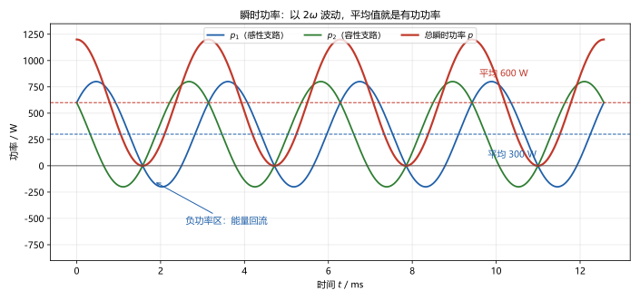
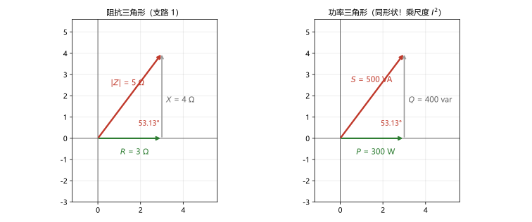
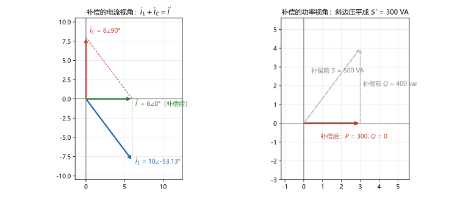

# 第 15 讲：正弦稳态功率

> **前置**：第 13–14 讲（相量、阻抗与复数版电路分析）与 01–12 讲全部方法。
> **预计时间**：约 3 小时（含作业）。
>
> **一句话定位**：14 讲"例外登记"里不适用搬移的"乘积量"，本讲专门处理。交流功率的全部特点来自一个角——**相位差**：它让"电压乘电流"分成三个功率量（有功、无功、视在），诞生了"功率因数"这个工程师天天盯着的数，也把最大功率传输改写成"共轭匹配"。主例的数字精确互补（$+400$ 与 $-400$、$500$ 与 $300$）——读完你会发现：无功不是"没用"，而是"搬运中的能量"。
>
> **本讲回答什么**：
> 1. 瞬时功率一直在波动，平均功率怎么算才不掺相位差？
> 2. 无功功率到底"无功"在哪？它不做功，为什么工程师还要认真算它？
> 3. 视在功率、复功率、功率三角形——这几个量是什么关系？
> 4. $U$ 和 $I$ 的有效值直接相乘就行了吗？什么时候会翻车？
> 5. 最大功率传输在交流里为什么变成"共轭匹配"？
>
> **这一讲有真实验证**：瞬时功率解析式 vs 逐点数值（偏差 ~10⁻¹²）与周期平均（300 / 300 / 600 W 逐位一致）；主例的功率量（$S_1 = 300+400\mathrm{j}$、$S_2 = 300-400\mathrm{j}$、守恒残差 $0$；而 $|S_1|+|S_2| = 1000 \ne 600$）；补偿（$160\ \mu\mathrm{F}$ 到 $\cos\varphi = 1$：电流 $10 \to 6\ \mathrm{A}$、$S$ $500 \to 300\ \mathrm{VA}$；$70\ \mu\mathrm{F}$ 到 $0.8$：$7.5\ \mathrm{A}$）；共轭匹配（$4\ \mathrm{W}$ vs 错配 $2\ \mathrm{W}$）；作业数字全部预验证（脚本 `scripts/lec15-01`、`lec15-02`）。

## 本讲怎么走（脉络图）

```
引子：电压电流都算清了，"功率"还没细算——先睹为快三个功率量
  │
  ├─ 1. 瞬时功率与平均功率：波动、负值、P = UIcosφ 的来路
  ├─ 2. 无功功率：定义、元件分工、它到底"无功"在哪
  ├─ 3. 视在功率、功率因数与复功率：三个功率量、功率三角形、守恒与不守恒
  └─ 4. 两个工程应用：共轭匹配（§4.1）与功率因数提高（§4.2）
  → 常见误区 → 本讲小结 → 掌握度自测 → 作业
```

> 下一站：§引子。看这三个量长什么样。

---

## 引子：还没细算的功率

13–14 讲把正弦稳态的电压电流全部算清了。但 14 讲"例外登记"说得明白：**乘积量（功率、能量）不适用这套搬移**——它们要单独处理，本讲开工。

**先睹为快**：回到 14 讲主例的并联电路（$U = 50\sqrt{2}\cos 1000t\ \mathrm{V}$、支路一感一容），三条瞬时功率曲线如图 1——先看这张图，三个现象当场可见：



> **图 1 怎么读**：三条曲线都以 $2\omega$ 波动（电源频率的两倍）——这是"乘积"的节奏。蓝、绿（两条支路）**会越过零线**（负功率区 = 能量回流），平均分别是 300 W；红线（总功率）**永不为负**，平均 600 W。所有平均值都是水平的虚线——"平均功率"就是本讲要定义的第一个量。

三个功率量的关键数字（全部来自脚本实测，细节逐节展开）：

$$\text{有功 } P = 600\ \mathrm{W}, \qquad
\text{无功 } Q = 0\ \mathrm{var}, \qquad
\text{视在 } S = 600\ \mathrm{VA}$$

而两条支路各自的视在功率都是 $500\ \mathrm{VA}$——$500 + 500 = 1000 \ne 600$！**"视在功率不守恒"**的悬念先摆在这里。顺带：两条支路的无功一正一负（$+400$ 与 $-400$），精确对消——14 讲"电抗对消"在功率上的样子。

---

## 1. 瞬时功率与平均功率

### 1.1 瞬时功率：逐点相乘，会有负值

同 01 讲的功率定义，只是电压电流都在动：

$$p(t) = u(t)\,i(t)$$

（关联参考方向下，"正值 = 元件正在吸收功率"。）两个观察：

- **波动节奏是 $2\omega$**：两个 $\omega$ 的余弦相乘，积化和差后频率翻倍——图 1 里三条曲线都"跑得比电压电流快一倍"；
- **负值 = 能量回流**：$p < 0$ 的时段里，元件把能量**吐回去**——这是直流世界里不存在的新现象（直流功率只有正负恒定的两种）。

### 1.2 平均功率：一算就出 cosφ

设 $u = \sqrt{2}U\cos(\omega t + \psi_u)$、$i = \sqrt{2}I\cos(\omega t + \psi_i)$（有效值口径），积化和差：

$$p(t) = 2UI\cos(\omega t+\psi_u)\cos(\omega t+\psi_i)
= UI\cos\underbrace{(\psi_u - \psi_i)}_{\varphi} \;+\; UI\cos(2\omega t + \psi_u + \psi_i)$$

两件事分开了：

- **一个常数项** $UI\cos\varphi$（$\varphi$ 是相位差）；
- **一个 $2\omega$ 波动项**，幅值为 $UI$。

**平均功率**（一个周期的平均）：波动项的平均为零（余弦整周期均零），于是——

$$\boxed{P = UI\cos\varphi \qquad (\varphi = \psi_u - \psi_i)}$$

**笔记两条**：① 那个 $U I$ 被 $\cos\varphi$ "打了折"——$\varphi$ 越大折得越狠，$\varphi = 90^\circ$（纯电感或纯电容）时 $P = 0$：**不耗一度电**；② 波动项的幅值恰是 $UI$——这个数马上要单独命名（§3 的视在功率）。

**主例实测**（脚本）：$p_1 = 300 + 500\cos(2\omega t - 53.13^\circ)$、$p_2 = 300 + 500\cos(2\omega t + 53.13^\circ)$、$p_{总} = 600 + 600\cos(2\omega t)$——解析式与逐点数值偏差 $\sim10^{-12}$；周期平均 $300.00 / 300.00 / 600.00$，与 $UI\cos\varphi$ 逐位一致。

### 1.3 三种元件的瞬时功率快照

| 元件 | $\varphi$ | $p(t)$ | 平均 | 形态 |
|---|---|---|---|---|
| $R$ | $0$ | $UI(1+\cos 2\omega t) \ge 0$ | $UI = I^2R$ | 只吸不放：纯耗散 |
| $L$ | $+90^\circ$ | $-UI\sin 2\omega t$ | $0$ | 正负交替：吸入吐出循环 |
| $C$ | $-90^\circ$ | $+UI\sin 2\omega t$ | $0$ | 与 L 反相位的循环 |

一表看穿"有功只由电阻吃、电感电容只倒腾"（§2 展开）。

### 1.4 易错点：$U$ 乘 $I$ 什么时候不成立

**"交流功率 = 有效值相乘"是直流旧习惯的最后一块残渣**。翻车现场（主例支路 1）：

$$U \cdot I = 50 \times 10 = 500\ \mathrm{W}\ \text{？}\qquad \text{实际 } P = 50 \times 10 \times \cos 53.13^\circ = 300\ \mathrm{W}$$

$U \cdot I$ 给的是"电压电流各多大"的乘积（视在），**只有 $\varphi = 0$（纯电阻）时才等于有功**。所以：

- $P = UI\cos\varphi$——**什么时候都要乘 $\cos\varphi$**；
- $U \cdot I$ 本身也有岗位（它叫视在功率，§3 上场）。

> 下一站：$\cos\varphi$ 之外还有 $\sin\varphi$——第二个量（无功）出场。

---

## 2. 无功功率

### 2.1 定义：给"来回交换"单独记一个量

瞬时功率里除了平均下来的 $UI\cos\varphi$，还有那个幅值 $UI$ 的波动项——它不产生净功，但代表**能量在网络与电源之间来回搬运**的规模。把"搬运规模"量化出来，定义**无功功率**：

$$\boxed{Q = UI\sin\varphi}$$

单位**乏**（var，volt-ampere reactive）——专门给无功的、与 W 区分开的单位。三条规矩：

- **符号跟着 $\varphi$ 走**（$\varphi = \psi_u - \psi_i$）：$Q > 0$ 感性（电流滞后，电感型吞吐）、$Q < 0$ 容性（电容型吞吐）；本课程后统一按此符号约定；
- **它不进入平均能量**（平均功率里没有它）——它描述的是"来回交换、净值为零"的那部分；
- 它和 $\cos\varphi$、$\sin\varphi$ 是同一只角的两个投影：$P = UI\cos\varphi$、$Q = UI\sin\varphi$、$UI = \sqrt{P^2 + Q^2}$（直角关系，§3 的三角形）。

**主例**：支路 1（感性）$Q_1 = 50\times10\times\sin 53.13^\circ = +400\ \mathrm{var}$；支路 2（容性）$Q_2 = -400\ \mathrm{var}$；总线 $Q = 0$——两条支路的"搬运"方向相反、规模相等，**互相抵消了**（电源侧不再需要往返）。

### 2.2 元件视角：谁吃有功、谁倒腾无功

沿用 §1.3 的表格，换成用 $I$、$U$ 表示的形式（$X$ 为各自的电抗）：

| 元件 | 有功 | 无功 | 一句话 |
|---|---|---|---|
| $R$ | $P = I^2R = U^2/R$ | $Q = 0$ | 只吃有功 |
| $L$ | $P = 0$ | $Q = I^2\omega L = U^2/(\omega L) > 0$ | 只倒腾（感性为正） |
| $C$ | $P = 0$ | $Q = -I^2/(\omega C) = -U^2\omega C < 0$ | 只倒腾（容性为负） |

**主例验证**：支路 1 的 $100\times3 = 300\ \mathrm{W}$、$100\times4 = +400\ \mathrm{var}$——与逐点相乘、周期平均的结果（脚本）零误差对上。**分工一句话**：**有功只由电阻吃；无功只由电感电容吞吐**。

### 2.3 无功的意义：不做功，为什么工程师认真算它

三个层次（认识层，能复述即可）：

1. **搬运需要电流**。无功不管搬没搬出净值，**电流是真的在导线上跑**——铜损（$I^2R$ 的热）与线路压降按电流算。无功越大，同样的有功需要的电流越大；
2. **设备容量按"电压电流"定，不按"有功"定**。发电机、变压器、电缆的铭牌容量是 VA（视在功率）——无功占掉的容量，正是从有功那里抢的。这就是"功率因数被工程师追着提高"的全部经济根源（§4.2 详解）；
3. **它还是真需求**。电动机、变压器要建立磁场才能工作——无功是它们的"呼吸"；工程不是消灭无功，而是**管理**它（哪里需要哪里就地补）。

所以标准表述是：**无功功率不做净功，但占用真资源**——"无用"是字面误会，它的名字来自"不进入平均能量"。

> 下一站：三个功率量到齐（P、Q、S），打包工具"复功率"上场——一个复数把它们一次算完。

---

## 3. 视在功率、功率因数与复功率

### 3.1 视在功率与功率因数：第三个功率量

**视在功率**（apparent power）：电压电流有效值的乘积——

$$S = UI \qquad (\text{单位：VA，伏安})$$

它是**设备容量指标**：铭牌上的"多大设备"按它算（§2.3 的理由 2）。三个量的分工：

| 功率量 | 公式 | 单位 | 管什么 |
|---|---|---|---|
| 有功 $P$ | $UI\cos\varphi$ | W | 真做掉的功（发热、出力） |
| 无功 $Q$ | $UI\sin\varphi$ | var | 来回搬运的规模 |
| 视在 $S$ | $UI$ | VA | 电压电流的总规模（占用容量） |

**功率因数**（power factor）：有功占视在的比例——

$$\lambda = \cos\varphi = \frac{P}{S}$$

工程上写作"$\cos\varphi = 0.6$（滞后）"这样的形式（滞后/超前 = 电流相对电压的滞后/超前，即感性/容性）。它是交流工程的"心跳数"：**同样的 S 下，$\cos\varphi$ 越高，送出去的有功越多**。主例：支路 1 的 $\cos\varphi = 0.6$（滞后），总线 $\cos\varphi = 1$。

### 3.2 复功率：一个复数，三个功率量

工程上要同时追踪 $P$、$Q$ 且频繁做加减——发明一个打包工具。**复功率**：

$$\boxed{\dot S = \dot U \dot I^{*} \qquad (\text{电流取共轭——别忘那颗星})}$$

**为什么取共轭**：$\dot U = U\angle\psi_u$、$\dot I^* = I\angle(-\psi_i)$，乘积的角恰是 $\varphi = \psi_u - \psi_i$：

$$\dot S = UI\angle\varphi = UI\cos\varphi + \mathrm{j}UI\sin\varphi = P + \mathrm{j}Q$$

一个复数装下三个功率量：**实部 = $P$、虚部 = $Q$、模 = $S$、辐角 = $\varphi$**。

**主例核对**（脚本）：$\dot S_1 = \dot U\dot I_1^* = 50\angle 0^\circ \times 10\angle 53.13^\circ = 300+400\mathrm{j}$；$\dot S_2 = 300-400\mathrm{j}$；$\dot S_{总} = 50\times12\angle 0^\circ = 600+\mathrm{j}0$。

### 3.3 功率三角形：与阻抗三角形同形状

$P = I^2R$、$Q = I^2X$、$S = I^2|Z|$——三个式子只差同一个尺度 $I^2$：**功率三角形就是阻抗三角形按 $I^2$ 放大**（图 2）：



> **图 2 怎么读**：左：支路 1 的阻抗三角（3-4-5 $\Omega$）；右：同一支路的功率三角（300-400-500）——形状一模一样（角都是 $53.13^\circ$），只是尺子换成了 $I^2 = 100$ 的缩放。这张"相似"关系是最省力的记忆网：$Z$ 错了，功率一定跟着错。

### 3.4 守恒律：一只成立、一只不成立

**复功率守恒**（成立）：网络里 **发出的复功率之和 = 吸收的复功率之和**（主例：$\dot S_1 + \dot S_2 = 600$ = 电源发出的 $\dot S_{总}$，脚本残差 $0$）。实部虚部分开看：

- **$P$ 守恒**（能量守恒的直接结果）：$300 + 300 = 600$ ✓；
- **$Q$ 守恒**（无功也守恒）：$+400 - 400 = 0$ ——"无功对消"在计算里就是加法。

**视在功率"不守恒"**（易错点）：模不是线性量——

$$|\dot S_1| + |\dot S_2| = 500 + 500 = 1000 \ne 600 = |\dot S_{总}|$$

这不是错误，是三角不等式（模相加 ≥ 和的模）：两条 500 VA 的"斜边"方向不同，合起来只有 600 VA。**记法**：**$P$、$Q$ 可直接相加；$S$ 是合成后的斜边（不可直接相加）**。要加，先拆回 $P$、$Q$。

> 下一站：三个量齐了——两个工程师最爱问的问题：最大功率怎么送出去？功率因数怎么提上来？

---

## 4. 两个工程应用

### 4.1 共轭匹配：交流版最大功率传输

**问题**（07 讲问题的交流版）：一个含源网络对外可戴维南等效为 $\dot U_{oc}$ 串 $Z_{eq} = R_{eq} + \mathrm{j}X_{eq}$；负载 $Z_L = R_L + \mathrm{j}X_L$ 接上——$Z_L$ 取什么值，负载得到的有功功率最大？

**推导两步**（完全是 07 讲原路的复刻）：

$$\dot I = \frac{\dot U_{oc}}{Z_{eq} + Z_L} = \frac{\dot U_{oc}}{(R_{eq}+R_L) + \mathrm{j}(X_{eq}+X_L)}, \qquad P_L = I^2 R_L$$

1. **先调虚部**：分母里的 $\mathrm{j}(X_{eq}+X_L)$ 只会把 $|\dot I|$ 拖小——要最大就先让它归零：$X_L = -X_{eq}$（相位上"抵掉"储能对抗）；
2. **再调实部**：剩 $P_L = \dfrac{U_{oc}^2 R_L}{(R_{eq}+R_L)^2}$——正是 07 讲的单变量极值，一步得 $R_L = R_{eq}$。

两个条件合起来：

$$\boxed{Z_L = Z_{eq}^{*} \quad (\text{共轭匹配})}, \qquad
P_{\max} = \frac{U_{oc}^2}{4R_{eq}}$$

（$U_{oc}$ 用有效值；这是"**虚部反号 + 实部相等**"的组合——不是"$Z_L = Z_{eq}$"！）

**数字例**（脚本）：$\dot U_{oc} = 8\angle 0^\circ\ \mathrm{V}$、$Z_{eq} = 4+\mathrm{j}4\ \Omega$：

- 共轭匹配 $Z_L = 4-\mathrm{j}4$：分母 $= 8 + \mathrm{j}0$，$\dot I = 1\angle 0^\circ\ \mathrm{A}$，$P_L = 1^2 \times 4 = 4\ \mathrm{W}$ ✓（公式 $8^2/(4\times4) = 4$）；
- **错配现场**（"想当然以为 $Z_L = Z_{eq}$"）：$Z_L = 4+\mathrm{j}4$ → $\dot I = 8/(8+\mathrm{j}8) = 0.7071\angle -45^\circ\ \mathrm{A}$，$P_L = 0.5^2 \times$…… $0.7071^2 \times 4 = 2\ \mathrm{W}$——**恰一半**。差距全部来自那个没被消掉的 $\mathrm{j}8$。

**功率与效率的取舍照旧**（07 讲精神）：匹配点上效率仍只有 50%（一半功率留在 $R_{eq}$ 里）——**共轭匹配用于"要最大功率"的场合**（电信、小信号、天线）；**电力系统反而追求效率**（源内阻越小越好，负载不需要共轭）。"最大"与"最高效"永远是两个目标。

### 4.2 功率因数提高：把被占的容量要回来

**问题场景**：工程上一大类负载（电动机、变压器）天生感性、$\cos\varphi$ 低（典型 0.6~0.8）。由 §2.3：低 $\cos\varphi$ 意味着**同样有功要更大的电流与容量**——线路热损、变压器容量被占用，全是钱。

**方案**：**并联电容**"就地补偿"——电容的负无功去顶电感的正无功（§2 的"抵消"）。

**主例算到实处**（负载就是支路 1）：$P = 300\ \mathrm{W}$、$\cos\varphi = 0.6$（滞后）→ $S = 500\ \mathrm{VA}$、$Q = +400\ \mathrm{var}$、$I = 10\ \mathrm{A}$（$U = 50\ \mathrm{V}$）。

**补到 $\cos\varphi = 1$**：需要电容提供 $Q_C = -400\ \mathrm{var}$：

$$Q_C = -U^2\omega C \Rightarrow C = \frac{400}{\omega U^2} = \frac{400}{1000 \times 50^2} = 160\ \mu\mathrm{F}$$

补偿后（脚本）：电容电流 $8\angle 90^\circ\ \mathrm{A}$、$\dot I_1 + \dot I_C = (6-\mathrm{j}8) + \mathrm{j}8 = 6\angle 0^\circ\ \mathrm{A}$——**电源电流从 10 A 降到 6 A、视在功率从 500 VA 降到 300 VA**（正好等于 $P$），而负载的 $P = 300\ \mathrm{W}$ 一分不少。



> **图 3 怎么读**：左：$\dot I_1 = 10\angle -53.13^\circ$（蓝）+ 电容电流 $\dot I_C = 8\angle 90^\circ$（红）→ 总电流 $6\angle 0^\circ$（绿）——垂直分量 $8\ \mathrm{A}$ 被电容"顶掉"，电源侧只剩水平分量。右：补偿前 $S = 500$ VA 的斜边，被电容压平成 $P = 300\ \mathrm{W}$ 的水平线。

**一般公式**（补偿到目标 $\cos\varphi_2$）：要看的两笔无功差

$$Q_C = P\left(\tan\varphi_1 - \tan\varphi_2\right), \qquad C = \frac{Q_C}{\omega U^2}$$

**算第二档**（补到 $0.8$，脚本）：$Q_C = 300\left(\frac{4}{3} - \frac{3}{4}\right) = 175\ \mathrm{var}$ → $C = 70\ \mu\mathrm{F}$；补偿后 $I' = 7.5\ \mathrm{A}$、$S' = 375\ \mathrm{VA}$（$P/S' = 0.8$ ✓）。

**工程约定**（认识层）：一般不追 1（过补偿会翻成容性、电容成本与谐波风险也真实存在）——**常用目标 0.9~0.95**；"就地补偿"的经济效果落在线损 $\propto I^2$ 上。

> **两个必须钉住的点**：① 并联电容**不改变负载自身的工作**——负载的 $P$、$Q$、电流一点没变，改的是**电源侧**的电流与容量（"补偿"补的是电源侧）；② 补偿用的电容**不吃有功**（$Q_C < 0$、$P_C = 0$），它是无偿提供"负无功"的器官。

> **态度表（正弦稳态功率部分）**
>
> | 内容 | 态度 |
> |---|---|
> | 瞬时功率波形、$2\omega$ 波动、负功率区 | 能看图说话；知道"回流"是什么 |
> | $P = UI\cos\varphi$ 的推导（积化和差） | **能默写、能复推** |
> | 三个功率量（$P$/$Q$/$S$）的定义、单位、分工 | **能默写**；单位一次不混（W/var/VA） |
> | 无功的符号约定与元件分工 | **能判方向**；R 吃有功、L/C 倒腾无功 |
> | 复功率 $\dot S = \dot U\dot I^*$ | **能默写、能算**；共轭星号不错 |
> | 功率三角形与阻抗三角形的相似 | 能画、能当记忆网 |
> | 守恒律：复功率守恒、S 不守恒 | **能说清"为什么"** |
> | 共轭匹配（条件、公式、与 07 的承接） | **能推导、能算**；知道它与效率是两个目标 |
> | 功率因数提高（两档算例、一般公式） | **能算**；知道"补的是电源侧" |
>
> 下一站：老规矩——把最容易混的七个地方钉死。

---

## 常见误区（本节零新知识，只破误）

> 以下每条只是"对答案 + 校准"，没有新知识——每一句都已在正文系统小节里教过。

1. **"交流功率 = 有效值相乘"**（§1.4）。错。要乘 $\cos\varphi$：$P = UI\cos\varphi$；$UI$ 是视在功率，只有纯电阻时二者相等。
2. **"无功功率是'没用的功率'"**（§2.3）。错。它不做净功，但占用真实的电流、线损与设备容量——工程要"管理"它，不是无视它。
3. **"视在功率可以像 P、Q 一样相加"**（§3.4）。错。$S$ 是模（斜边）：$500+500 \ne 600$。**P、Q 可直接相加；S 是斜边（不可直接相加）**——要加先拆回 P、Q。
4. **"复功率 $\dot S = \dot U\dot I$"**（§3.2）。错，别忘共轭：$\dot S = \dot U\dot I^*$。少一颗星，实部虚部全乱。
5. **"共轭匹配就是 $Z_L = Z_{eq}$"**（§4.1）。错。"虚部反号、实部相等"：$Z_L = Z_{eq}^*$；相等会把虚部带进分母，功率只剩一半。
6. **"并联电容把负载的功率因数也改了"**（§4.2）。错。负载自身的 $P$、$Q$、$I$ 一点没变——改变的是**电源侧**的总电流与视在功率（"补的是电源侧"）。
7. **"无功的单位可以写 W（反正是功率）"**（§2.1）。不行。W（瓦）、var（乏）、VA（伏安）三种单位各归各位——写错单位等于写错物理量。

---

## 本讲小结

一页纸的骨架：

- **瞬时功率**：$p(t) = ui$——以 $2\omega$ 波动、可为负（能量回流）；积化和差得 $p = UI\cos\varphi + UI\cos(2\omega t + \psi_u+\psi_i)$。
- **平均功率（有功）**：$P = UI\cos\varphi$——$\cos\varphi$ 是"打的折"；R 只吸（$P = I^2R$）、L/C 平均为零。
- **无功功率**：$Q = UI\sin\varphi$（var）——能量往返搬运的规模；感性为正、容性为负；R 不倒腾、L/C 专职倒腾（$Q_L = I^2\omega L$、$Q_C = -I^2/(\omega C)$）。
- **无功的意义**：不做净功、但占电流/线损/容量；是电机的"呼吸"——要管理不要消灭。
- **视在功率与功率因数**：$S = UI$（VA，容量指标）；$\cos\varphi = P/S$（滞后/超前）。
- **复功率**：$\dot S = \dot U\dot I^* = P + \mathrm{j}Q$（实部 P、虚部 Q、模 S、角 φ）——一个复数打包三个量。
- **守恒律**：复功率守恒（P、Q 分别守恒——主例 $+400-400 = 0$）；**S 不守恒**（$1000 \ne 600$）。
- **功率三角形 = 阻抗三角形 × I²**（形状相同）。
- **共轭匹配**：$Z_L = Z_{eq}^*$；$P_{\max} = U_{oc}^2/(4R_{eq})$；数字例 4 W vs 错配 2 W；效率 50% 的取舍。
- **功率因数提高**：并电容、$Q_C = P(\tan\varphi_1 - \tan\varphi_2)$、$C = Q_C/(\omega U^2)$；主例 160 µF（到 1：10→6 A、500→300 VA）与 70 µF（到 0.8：7.5 A、375 VA）；补的是电源侧。
- **实测合集**：瞬时解析 ~10⁻¹²；平均 300/300/600 逐位一致；功率残差 0；补偿与匹配数字全预验证（含 Q2 符号错误被预验证救回：+400 var）。

## 掌握度自测

- [ ] 我能解释瞬时功率为什么以 $2\omega$ 波动、为什么会有负值，并指出图 1 里哪条曲线永不为负。
- [ ] 我能从 $p(t) = ui$ 积化和差推出 $P = UI\cos\varphi$。
- [ ] 我能默写三个功率量的定义、单位与分工，并说出 $U\cdot I$ 什么时候不等于 $P$。
- [ ] 我能判定无功的符号（感性/容性），并说出 R、L、C 在 P、Q 两个量里的分工。
- [ ] 我能用三层理由回答"无功不做功为什么还要算它"。
- [ ] 我能默写复功率定义（含共轭星号），并解释"为什么是共轭"。
- [ ] 我能说清复功率守恒与 S 不守恒的区别（$1000\ne600$ 的原因）。
- [ ] 我能推导共轭匹配的两步（消虚部、配实部），并解释它与 $Z_L = Z_{eq}$ 的差别。
- [ ] 我能算功率因数补偿（到 1 与到 0.8 两档），并说清"补的是电源侧"。
- [ ] 我能复跑 `scripts/lec15-01` 与 `scripts/lec15-02`，并解释输出里每一个数字。

## 作业

> 答案只能用**已教概念**（本讲范围：瞬时/平均/无功/视在功率、功率因数、复功率与守恒、共轭匹配、补偿；13–14 讲相量与阻抗、01–12 讲全部承接）。先独立做，再对答案。

### 基础

**Q1. 概念辨析**：判断对错，并给一句话理由。

(a) "交流电路中 $P = UI$ 永远成立。"
(b) "无功功率是'没用的功率'。"
(c) "视在功率也守恒——可以像 P、Q 一样直接相加。"
(d) "复功率 $\dot S = \dot U \dot I$。"
(e) "并联电容提高功率因数，是因为电容'发出'有功。"

**参考答案**：

(a) 错。要乘功率因数：$P = UI\cos\varphi$；$UI$ 是视在功率。
(b) 错。它不做净功，但占用电流、线损与设备容量（电机的"呼吸"）。
(c) 错。$S$ 是模（斜边），不守恒：$500+500 \ne 600$；P、Q 才可加。
(d) 错。电流要取共轭：$\dot S = \dot U\dot I^*$。
(e) 错。电容不吃有功（$P_C = 0$）；它提供负无功去抵消电感的正无功——补的是电源侧。
验算：五小题各回一个机制词：cosφ / 占用资源 / 模不可加 / 共轭 / 负无功。

**Q2. 计算·单口功率**：某单口 $U = 100\angle 0^\circ\ \mathrm{V}$、$\dot I = 5\angle -53.13^\circ\ \mathrm{A}$。求 $P$、$Q$、$S$、$\cos\varphi$、复功率，并判断性质（感性/容性）。

**参考答案**：

$\varphi = 0 - (-53.13^\circ) = +53.13^\circ$（电流滞后）；$P = 100\times5\times0.6 = 300\ \mathrm{W}$；
$Q = 100\times5\times\sin 53.13^\circ = +400\ \mathrm{var}$（感性）；$S = 500\ \mathrm{VA}$；$\cos\varphi = 0.6$（滞后）；
$\dot S = \dot U\dot I^* = 300 + \mathrm{j}400\ \mathrm{VA}$。
验算：$P^2 + Q^2 = 300^2+400^2 = 500^2 = S^2$ ✓。脚本 `lec15-02` Q2 行。

**Q3. 计算·元件视角**：$U = 30\ \mathrm{V}$ 加在 $Z = 8 - \mathrm{j}6\ \Omega$ 上：求 $I$、$P$、$Q$、$S$、$\cos\varphi$，并判断性质。

**参考答案**：

$|Z| = 10\ \Omega$ → $I = 3\ \mathrm{A}$；$P = I^2R = 9\times8 = 72\ \mathrm{W}$；$Q = I^2X = 9\times(-6) = -54\ \mathrm{var}$（容性）；
$S = UI = 90\ \mathrm{VA}$；$\cos\varphi = 72/90 = 0.8$（超前）。
验算：$72^2 + 54^2 = 8100 = 90^2$ ✓。脚本 `lec15-02` Q3 行。

**Q4. 计算·瞬时功率**：$u = 10\sqrt{2}\cos\omega t$、$i = 5\sqrt{2}\cos(\omega t - 53.13^\circ)$。写出 $p(t)$ 的"平均 + 波动"形式，求 $p$ 的最大值与最小值，并说明负值的含义。

**参考答案**：

$p(t) = 30 + 50\cos(2\omega t - 53.13^\circ)\ \mathrm{W}$（$P = 30\ \mathrm{W}$、波动幅值 $= S = 50\ \mathrm{VA}$）；
$p_{\max} = 80\ \mathrm{W}$、$p_{\min} = -20\ \mathrm{W}$；
负值时元件把能量发回电源——"能量回流"（本讲 §1.1 的现象）。
验算：脚本 `lec15-02` Q4 行。

**Q5. 概念·无功的意义**：用一两句话向同事解释：(1) 为什么无功"不做功"却不能被无视？(2) 为什么"就地"并联电容能省钱？

**参考答案**：

(1) 无功意味着电流真实地在跑——线损（$\propto I^2$）、压降、设备容量（VA 铭牌）都按电流算；它还是一家电机/变压器建立磁场的必需品。
(2) 电容在负载旁提供负无功，顶掉电感的无功——电源侧的总电流变小（主例 10→6 A），线路热损与容量占用随之下降；"就地"是为了让这段减小发生在从电源出来的整条线上。
验算：回 §2.3 与 §4.2 逐条对号。

### 提高

**Q6. 计算·补偿设计**：某感性负载接在 $U = 50\ \mathrm{V}$（$\omega = 1000$）上：$P = 300\ \mathrm{W}$、$\cos\varphi = 0.6$（滞后）。

(1) 求 $S$、$Q$、$I$；
(2) 并联电容把功率因数补到 1：求 $C$、补偿后电源电流与 $S$；
(3) 若只补到 0.8（滞后）：求所需 $C$、补偿后电流与 $S$。

**参考答案**：

(1) $S = P/0.6 = 500\ \mathrm{VA}$；$Q = 500\times0.8 = 400\ \mathrm{var}$；$I = 500/50 = 10\ \mathrm{A}$。
(2) $C = Q/(\omega U^2) = 400/(1000\times2500) = 160\ \mu\mathrm{F}$；$I' = P/U = 6\ \mathrm{A}$；$S' = 300\ \mathrm{VA}$。
(3) $Q_C = P(\tan\varphi_1 - \tan\varphi_2) = 300(4/3 - 3/4) = 175\ \mathrm{var}$ → $C = 70\ \mu\mathrm{F}$；$I' = 7.5\ \mathrm{A}$；$S' = 375\ \mathrm{VA}$。
验算：脚本 `lec15-02` Q6 行；$300/375 = 0.8$ ✓。

**Q7. 计算·复功率守恒**：两负载并联：$\dot S_1 = 300 + \mathrm{j}400\ \mathrm{VA}$、$\dot S_2 = 300 - \mathrm{j}400\ \mathrm{VA}$。

(1) 求总 $P$、$Q$、$S$、$\cos\varphi$；
(2) 验证 $|\dot S_1| + |\dot S_2| \ne |\dot S_{总}|$，并解释这不是错误。

**参考答案**：

(1) $\dot S_{总} = 600 + \mathrm{j}0$ VA：$P = 600\ \mathrm{W}$、$Q = 0$、$S = 600\ \mathrm{VA}$、$\cos\varphi = 1$（无功对消，负载整体呈纯阻性）。
(2) $500 + 500 = 1000 \ne 600$——模不是线性量（三角不等式）：两条"斜边"方向相反，部分抵消的正是竖直分量；S 不可加，P、Q 才可加。
验算：脚本 `lec15-02` Q7 行。

### 综合

**Q8. 开放·匹配与效率**：某信号源等效为 $\dot U_{oc} = 8\angle 0^\circ\ \mathrm{V}$、$Z_{eq} = 4+\mathrm{j}4\ \Omega$。

(1) 求让负载获得最大平均功率的 $Z_L$ 与 $P_{\max}$；
(2) 若误取 $Z_L = Z_{eq}$（"以为匹配 = 相等"），功率是多少？差额从哪来？
(3) 为什么电力系统反而不做共轭匹配？（一两句话）

**参考答案**（要点）：

(1) $Z_L = Z_{eq}^* = 4-\mathrm{j}4\ \Omega$；此时 $\dot I = 8/8 = 1\ \mathrm{A}$，$P_{\max} = 1^2\times4 = 4\ \mathrm{W}$（= $U_{oc}^2/4R_{eq}$）。
(2) $\dot I = 8/(8+\mathrm{j}8) = 0.7071\ \mathrm{A}$，$P = 2\ \mathrm{W}$——**恰一半**；差额来自没被消掉的虚部（分母多背了一个 $\mathrm{j}8$ 的模）。
(3) 电力系统追求**效率**（发电端希望尽量多的功率落到用户、线路电流小）：源内阻越小越好，不需要把功率"全塞给负载"；共轭匹配是"要最大功率"的场合（小信号/电信）的选择——"最大"与"最高效"是两个不同的目标（07 讲的老话）。
验算：脚本 `lec15-02` Q8 行（4 W 与 2 W 逐位一致）。

---

*下一讲预告：第 16 讲《三相电路》——单相的功率讲完了，轮到国内工程的绝对主线：三相电源。三个大小相等、相位各差 $120^\circ$ 的正弦拼在一起，凭什么能"拍扁成一相"来算？家里的 220 V 与工厂的 380 V 到底是什么关系？中线为什么不能断？下一讲拆解。*