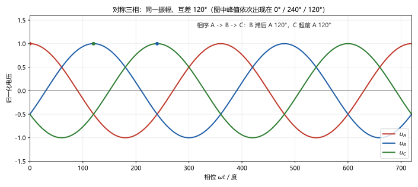
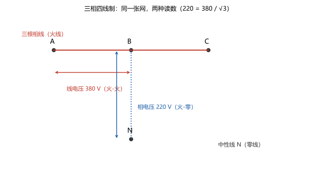
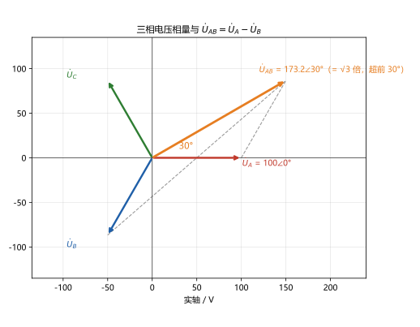

# 第 16 讲：三相电路

> **前置**：第 13–15 讲（相量、阻抗、功率三只账本）与全部旧武器。
> **预计时间**：约 3 小时（含作业）。
>
> **一句话定位**：把三只单相正弦"合订"起来——互差 $120^\circ$、端部相连，就得到国内工程绝对的主线：三相电源。它带来一揽子"合订福利"（输电省、总功率不波动、旋转磁场），代价是几个必须背熟的换算（$\sqrt{3}$ 与 $30^\circ$），以及一条工程铁律：**中线不能断**。对称时"一相法"把三道题拍成一道——这就是你家电 220 V 与车间电 380 V 背后的全部机关。
>
> **本讲回答什么**：
> 1. 发电和输电为什么偏偏用三相，而不是一相或两相？
> 2. 星形、三角形连接差别在哪？相电压、线电压怎么换算？
> 3. 380 V 到底出现在哪两根线之间？画图能画清楚吗？
> 4. 对称三相凭什么能"拍扁成一相"来算？
> 5. 三相功率 = 三个单相功率加起来？对称时有没有快速算法？
> 6. 负载不对称会怎样？中线为什么不能断？
>
> **这一讲有真实验证**：对称主例（中线电流 $8.9\times10^{-15}$、线电压 $173.2\angle 30^\circ$、功率双公式都到 3600 W）；对称三相瞬时总功率恒定（最大偏差 $5.9\times10^{-12}$ W——三个波动精确对消）；不对称现场（无中线时中性点偏移 $25\ \mathrm{V}$ → 一相 75 V 欠、两相 114.6 V 过）；一相断开（两相各分 $86.60 = 173.2/2$ V）；作业数字全部预验证（脚本 `scripts/lec16-01`、`lec16-02`）。

## 本讲怎么走（脉络图）

```
引子：家里的 220 与车间的 380——同一张电网、两种读数
  │
  ├─ 1. 三相电源：互差 120° 的三只正弦，以及"合订"的三份福利
  ├─ 2. 连接方式：星形 / 三角形；√3 与 30° 的来历；380 在哪两根线之间
  ├─ 3. 对称三相计算：一相法全解 + 三相功率的两个公式
  └─ 4. 不对称与中线：中性点漂移现场与"中线不能断"的铁律
  → 常见误区 → 本讲小结 → 掌握度自测 → 作业
```

> 下一站：§引子。两个天天见的数字，一次说清。

---

## 引子：220 与 380 之谜

你是听着这两个数长大的：家里的插座 **220 V**，车间的动力电 **380 V**。它们不是两套电网、两种电源——**是同一张三相网上的两种读数**："火线对零线"读 220，"火线对火线"读 380。而两者之间只差一个初中几何就有的常数：

$$380 \approx 220 \times \sqrt{3} = 381.05$$

**先睹为快**：三条正弦（图 1）——同一振幅、彼此错开 $120^\circ$ 就是"三相"；三个相量（图 2）画出来是等边三角形般的对称格局——$\dot U_A - \dot U_B$ 一减，$381$ 与那个神秘的多出来的 $30^\circ$ 角就现身了。



> **图 1 怎么读**：$u_A$、$u_B$、$u_C$ 三条曲线形状完全相同，只是分别滞后/超前 $120^\circ$——"对称三相"的全部含义。峰值依次在 $0^\circ$、$240^\circ$、$120^\circ$ 出现（标了圆点），这就是相序 A → B → C。

本讲四站：**电源**（三只正弦与合订福利）→ **连接**（星/三角、$\sqrt{3}$ 与 $30^\circ$）→ **对称计算**（一相法与三相功率）→ **不对称**（中性点漂移与中线的保命作用）。

---

## 1. 三相电源

### 1.1 对称三相的定义

**对称三相电源**：三只同频率、同振幅、相位互差 $120^\circ$ 的正弦电压：

$$u_A = \sqrt{2}U_p\cos\omega t, \qquad
u_B = \sqrt{2}U_p\cos(\omega t - 120^\circ), \qquad
u_C = \sqrt{2}U_p\cos(\omega t + 120^\circ)$$

（$U_p$ 是**相电压**——每一相对中性点的电压，名字 §2 正式用。）三者的**相序**按"到达峰值的先后"排：A 最先、B 次之、C 最后——记作 **A → B → C**（正序）；本章全部默认正序。

**相量形式**——三只对称的箭头（图 2）：$\dot U_A = U_p\angle 0^\circ$、$\dot U_B = U_p\angle -120^\circ$、$\dot U_C = U_p\angle +120^\circ$。先记下一个马上要反复用的事实：**对称三矢之和为零**：

$$\dot U_A + \dot U_B + \dot U_C = 0$$

（三只等长箭头互差 $120^\circ$——首尾相接正好闭合一个等边三角形。）数值上这个"零"会在中线电流等处反复出现（脚本实测 $8.9\times10^{-15}$）。

### 1.2 合订的隐藏福利：瞬时功率不波动

单相电路的瞬时功率（15 讲图 1）一直在 $2\omega$ 波动——可惜吗？把三相对称地加起来看看。每相负载若相同，$p_A$、$p_B$、$p_C$ 各自的 $2\omega$ 波动项相位互差 $120^\circ$——**恰好三相抵消**：

$$p_A + p_B + p_C = 3P_p = \text{常数} \qquad (\text{主例数值实测：偏差 } 5.9\times10^{-12}\ \mathrm{W})$$

**这意味着什么**：三相电机从电源取到的**瞬时功率恒定**——没有 $2\omega$ 的力矩脉动，转得平顺；三相设备的设计也因此干净。这是"合订"送的第一份大礼。

### 1.3 为什么输电偏偏选三相

三条理由（认识层，能复述即可）：

1. **瞬时功率恒定**（§1.2）——电机平稳、振动噪声小；
2. **旋转磁场**：三相绕组通入三相电流，会在空间里自然产生一个旋转的磁场——交流电动机的第一性原理级福利（电机课展开；先记"三相 = 旋转的天然配方"）；
3. **输电经济**：同样的功率与电压，三相输电比单相省导线材料（省约 1/4 的金属量与线路损耗）——电力系统的每一公里都在享受它。

> 下一站：三只电源怎么接线、引出几根线？$\sqrt{3}$ 登场——§2。

---

## 2. 连接方式

### 2.1 星形连接：$\sqrt{3}$ 与 $30^\circ$ 的来历

**星形连接**（Y）：三个相的一端（尾端）接在一起——这个公共点叫**中性点 N**；三个首端引出三根**相线**（火线），中性点还可以引出一根**中性线**（零线）。图 3 的 A、B、C、N 就是这么来的四个端子：



> **图 3 怎么读**：上排 A、B、C 是三根火线的端子、下方 N 是零线端子。"火-零"之间（如 B-N）读到的是**相电压 220 V**；"火-火"之间（如 A-B）读到的是**线电压 380 V**。同一张网，量法不同、读数不同。

两种电压熟名的来历：**相电压** $U_p$ = 任一相对中性点的电压；**线电压** $U_l$ = 两根相线之间的电压。两者关系用相量算一行：

$$\dot U_{AB} = \dot U_A - \dot U_B = U_p\angle 0^\circ - U_p\angle -120^\circ
= U_p\left(\frac{3}{2} + \mathrm{j}\frac{\sqrt{3}}{2}\right) = \sqrt{3}\,U_p\angle 30^\circ$$

$$\boxed{U_l = \sqrt{3}\,U_p \quad(\text{且 } \dot U_{AB} \text{ 超前 } \dot U_A\ 30^\circ)}$$

**$\sqrt{3}$ 与 $30^\circ$ 就是这么来的**：两矢相减、$120^\circ$ 对称——一算就是 $\sqrt{3}$ 倍加 $30^\circ$（图 2 的几何把这件事画在脸上）。对称三相共有三组"火-火"读数（AB、BC、CA）——都是 $380$。

另外两个 Y 接的顺口结论：**线电流 = 相电流**（一根导线直接串进一相，同一电流）；三个"火-火"线电压也构成对称三相（互差 $120^\circ$、大小相等）——从图 2 的轮换可见。

### 2.2 三角形连接：$\sqrt{3}$ 挪到了电流上

**三角形连接**（Δ）：三个相首尾相接成一个环，从三个顶点引出相线。两条直接结论：

- **线电压 = 相电压**：因是任两顶点之间的电压就是环上某一相的电压——$\sqrt{3}$ 在这里不出现（不存在中性点）；
- **环的合法性**：三相对称时回环净电动势为零（三矢之和为零，§1.1 的那个"零"在这里第二次上班）——首尾相接成环而不短路；不对称的电源绝不允许这样接环（就成短路热源了——认识即可）。
- **线电流 = 两根相电流之差**：对称时恰为 $\sqrt{3}$ 倍、且滞后相电流 $30^\circ$（与 Y 接的电压关系"对偶"——$\sqrt{3}$ 从电压搬到了电流上；推导同款，留作作业 Q3 的验证）。

**对偶记忆表**：

| | 相电压 vs 线电压 | 相电流 vs 线电流 |
|---|---|---|
| 星形 Y | $U_l = \sqrt{3}U_p$（超前 $30^\circ$） | $I_l = I_p$ |
| 三角形 Δ | $U_l = U_p$ | $I_l = \sqrt{3}I_p$（滞后 $30^\circ$） |

### 2.3 "380 V 究竟在哪两根线之间"

回到图 3：

- 220 V 出现在**任何一根火线与零线之间**（火-零）；
- 380 V 出现在**任何两根火线之间**（火-火）——不只是"哪两根"，三组都是；
- $220\sqrt{3} = 381.05$，工程取**标称** 380（"标称值"= 命名用整数，实际按 220 体系算出来是 381——报答案时两个口径都说得通，题里按题给数）。

**一句安全常识**（认识层）：所以家用电器接的是"火-零"（220），而三相动力设备（电动机）接"火-火"（380）——同一根火线在两种接法里都对上了号。变电站里零线在电源端接地，是"安全的另一半"，到电力系统课展开。

> 下一站：连接会了——对称三相的电路怎么算？"一相法"开张。

---

## 3. 对称三相计算

### 3.1 一相法：凭什么"拍扁成一相"

**主张**：Y-Y 的对称三相电路，只算出**一相**，其余两相按 $120^\circ$ 轮换——三相题变成单相题。凭什么？

- **带中线（三相四线）**：中线电流 = 三只相电流之和——对称时为零（§1.1 的"三矢之和为零"，脚本实测 $8.9\times10^{-15}$）。中线没电流就没压降——**负载中性点与源中性点等电位**，于是每一相的电压就是源相电压，三相**完全解耦**；
- **不带中线但对称**：负载中性点由对称性同样不漂（三个一样的负载拉着三个对称的源——数学上结点方程的解为零），照样解耦；
- **不对称 + 无中线**：解耦失效——这就是 §4 的"漂移现场"（一相法失效的边界，先立此存照）。

> **一相法模板**：
> 1. 取**一相**（习惯 A 相）：把这相看作"相电压源 + 相负载"的单相电路，用 14 讲的复数版武器解出该相电流（与相电压）；
> 2. **轮换**：B、C 两相的答案 = A 相答案的辐角分别 $-120^\circ$、$+120^\circ$（有效值不变）；
> 3. **线量**：需要线电压/线电流时按 §2.2 的对偶表换算（$30^\circ$ 别忘）；
> 4. **功率**：按 §3.4 的两个公式。

### 3.2 运行例全解

**电路**：对称 Y-Y。源相电压 $100\ \mathrm{V}$（A 相 $0^\circ$）；每相负载 $Z = 3+\mathrm{j}4 = 5\angle 53.13^\circ\ \Omega$；带中线。求三相电流、中线电流、线电压。

1. **A 相（一相法**）：

$$\dot I_A = \frac{\dot U_A}{Z} = \frac{100\angle 0^\circ}{5\angle 53.13^\circ} = 20\angle -53.13^\circ\ \mathrm{A}$$

2. **轮换**：$\dot I_B = 20\angle -173.13^\circ\ \mathrm{A}$、$\dot I_C = 20\angle +66.87^\circ\ \mathrm{A}$——三只电流也是对称三相（有效值都是 $20\ \mathrm{A}$、互差 $120^\circ$）；
3. **中线**：$\dot I_N = \dot I_A + \dot I_B + \dot I_C = 0$（脚本 $8.9\times10^{-15}$——"零"的又一次实测）；
4. **线电压**：$\dot U_{AB} = 173.2\angle 30^\circ\ \mathrm{V}$（$= 100\sqrt{3}\angle 30^\circ$，§2.1 的换算）。

### 3.3 相量图复核（图 2）



> **图 2 怎么读**：红、蓝、绿三矢是对称的相电压（互差 $120^\circ$）；橙矢是 $\dot U_{AB} = \dot U_A - \dot U_B$（虚线平行四边形：减 $B$ 就是加"$-B$"）——长度读到 $\sqrt{3}$ 倍（$100 \to 173.2$）、角度读到 $30^\circ$（超前 $\dot U_A$）。$\sqrt{3}$ 与 $30^\circ$ 的全部机关都在这张图上。

### 3.4 三相功率：两个公式与一条限制

**三个单相加**（先来笨的——它没错）：对称时每相功率相同，

$$P = 3P_p = 3\,U_pI_p\cos\varphi$$

**快速公式**（对称专属）——把 §2 的换算代进去，两个接法殊途同归：

- Y 接：$U_p = U_l/\sqrt{3}$、$I_p = I_l$ → $3U_pI_p = \sqrt{3}\,U_lI_l$；
- Δ 接：$U_l = U_p$、$I_p = I_l/\sqrt{3}$ → $3U_pI_p = \sqrt{3}\,U_lI_l$。

$$\boxed{P = \sqrt{3}\,U_lI_l\cos\varphi, \qquad Q = \sqrt{3}\,U_lI_l\sin\varphi, \qquad S = \sqrt{3}\,U_lI_l}$$

**两个必知限制**：

- **只对"对称"成立**：公式里的 $\sqrt{3}$ 是拿"对称"换来的（三矢之和为零、$120^\circ$ 对称的换算）——不对称负载要逐相算再相加（§4 的账）；三个单相加的办法任何时候都对（但要真的算够三相）；
- **$\varphi$ 是谁的角**：是**每相负载自己的相位差**（那相的相电压与相电流之差）——**不是**"线电压与线电流的夹角"（Y 接时后者等于 $\varphi + 30^\circ$，拿它代入就错了——见常见误区）。

**运行例的账**（脚本互验）：

$$P = 3\times100\times20\times0.6 = 3600\ \mathrm{W}, \qquad Q = 4800\ \mathrm{var}, \qquad S = 6000\ \mathrm{VA}$$

用 $\sqrt{3}$ 公式复核：$\sqrt{3}\times173.2\times20\times0.6 = 3600$ ✓——两法逐位一致。顺带把 §1.2 的"福利"入账：对称三相的**瞬时**总功率恒等于 $3P_p = 3600\ \mathrm{W}$。

> 下一站：对称的账结清了——把"对称"这个前提拿掉会发生什么？§4 开现场。

---

## 4. 不对称与中线

### 4.1 中线的作用：把各相"钉"开

**带中线的三相四线制**（图 3）：中线把负载中性点与源中性点直接连通——**只要中线在（且阻抗可忽略），负载中性点电位就被钉住**：每相负载承受的电压仍是各自的相电压（$220$ 一族）——**三相彼此独立，谁的事谁自己扛**（一相负载变了，只改它自己那相的电流；另外两相纹丝不动）。

**断中线**：钉子拔了——负载中性点开始**漂移**（称作中性点位移），漂移量取决于**三相负载有多不对称**。极端情况（一相断开）漂到不能看。下面直接看现场数字。

### 4.2 漂移现场：10/20/20 的负载

**设置**：源相电压 $100\ \mathrm{V}$（对称）；负载纯电阻：$R_A = 10\ \Omega$、$R_B = R_C = 20\ \Omega$（A 相最"重"）。

**有中线**（各相独立，一相法仍然有效——每相自己算）：

$$\dot I_A = 10\angle 0^\circ\ \mathrm{A}, \qquad
\dot I_B = 5\angle -120^\circ\ \mathrm{A}, \qquad
\dot I_C = 5\angle +120^\circ\ \mathrm{A}$$

**中线电流**（不对称了，它不再为零）：

$$\dot I_N = \dot I_A + \dot I_B + \dot I_C = 10 + 5\angle -120^\circ + 5\angle +120^\circ = 10 - 5 = 5\angle 0^\circ\ \mathrm{A}$$

（对比 §3.2 对称时的 $8.9\times10^{-15}$——**中线电流正是"不对称度"的仪表**。）

**断中线**（结点法解漂移，脚本）：

$$\dot U_n = 25\angle 0^\circ\ \mathrm{V}$$

——**负载中性点漂了 $25\ \mathrm{V}$**（相对源中性点）。各相实际承受的电压：

| 相 | 本来应得 | 实际承受 | 后果 |
|---|---|---|---|
| A（重载） | $100\ \mathrm{V}$ | $\mathbf{75\ V}$（$100-25$） | 欠压——灯变暗、电机无力 |
| B | $100\ \mathrm{V}$ | $\mathbf{114.6\ V}$ | 过压——灯烧、设备发热 |
| C | $100\ \mathrm{V}$ | $\mathbf{114.6\ V}$ | 过压（与 B 对称） |

**这张表就是"中线不能断"的全部理由**：一相欠压、两相过压（$+14.6\%$）——**"有的暗了、有的烧了"**。负载越不对称（或者功率越大、导线越长），这个现场越惨烈。

### 4.3 铁律与边界

- **工程铁律**：三相四线制里的中线**不允许断开**（规范规定中线上不装开关与熔断器——够直白吧）；
- **对称时可省、工程上不敢赌**：对称负载的 $\dot I_N = 0$，理论上中线可以省（三相三线也能跑）；但真实负载永远在变（今天开这台电机、明天多接那组灯）——**赌不起**；
- **一相断开的极端**（作业 Q7 展开）：漂移最狠的形态——剩下两相被串到"火-火"之间分摊 $173.2$ 的线电压（各 $86.6$ V）——比 $114.6$ 那种"病态"更像一次意外事故的现场记录；
- **一相法失效的边界**：不对称 + 无中线时，"拍扁"的合法性没了——回去用结点法（05 讲的老武器，复数版）逐个算。

> **态度表（三相电路部分）**
>
> | 内容 | 态度 |
> |---|---|
> | 对称三相的定义（三个数：同幅、同频、$120^\circ$）与相序 | **能默写** |
> | 三矢之和为零、瞬时功率恒定（"合订福利"） | 能讲清；数值证据要记得 |
> | Y/Δ 的线相关系对照表（$\sqrt{3}$ 与 $30^\circ$ 的两个去向） | **能默写、一次不错** |
> | 220/380 的来历 | **能画图说清**（图 3 的读法） |
> | 一相法模板（取相 → 轮换 → 线量 → 功率） | **能闭眼执行** |
> | 三相功率两个公式与两条限制（对称专属；$\varphi$ 是谁） | **能默写**；限制能举例 |
> | 中线的作用与漂移现场（$25$、$75$、$114.6$） | **能复述数字与因果** |
>
> 下一站：老规矩——把最容易混的七个地方钉死。

---

## 常见误区（本节零新知识，只破误）

> 以下每条只是"对答案 + 校准"，没有新知识——每一句都已在正文系统小节里教过。

1. **"三相电路 = 三个独立的单相电路"**（§1.1、§3.1）。不准确：它们互差 $120^\circ$、端部相连（星/三角）；"独立"只在**对称 + 一相法合法**的场合有条件成立。
2. **"线电压总是相电压的 $\sqrt{3}$ 倍"**（§2.2）。错。星形才是；三角形里 $U_l = U_p$（$\sqrt{3}$ 挪去了电流那边）。
3. **"对称三相的中线电流是相电流的 3 倍"**（§3.2）。反了——对称时中线电流为零（三矢之和为零，实测 $8.9\times10^{-15}$）；不对称时它才是"三只相电流的相量和"。
4. **"断中线没关系，负载电压还是各自 220"**（§4.2）。错。中性点会漂移（$10/20/20$ 例里漂 $25\ \mathrm{V}$）：一相 75 V 欠压、两相 114.6 V 过压——灯与设备的第一杀手。
5. **"380 和 220 是两种供电系统"**（§2.3）。错。同一张三相网的两种读数：火-零 220、火-火 380（$220\sqrt{3} = 381 \approx$ 标称 380）。
6. **"$\sqrt{3}U_lI_l\cos\varphi$ 里的 $\varphi$ 是线电压与线电流的夹角"**（§3.4）。错。是**每相负载**的相电压-相电流相位差；Y 接时"线量夹角"等于 $\varphi + 30^\circ$——代错了答案就是错的。
7. **"$\sqrt{3}$ 公式在不对称时也能用"**（§3.4）。不能。它的推导全程用"对称"（三矢之和为零、$120^\circ$ 换算）；不对称要逐相算、再相加。

---

## 本讲小结

一页纸的骨架：

- **对称三相**：同幅、同频、互差 $120^\circ$（相序 A→B→C）；相量三矢之和为零。
- **合订福利**：瞬时总功率恒定（波动精确对消，实测 $5.9\times10^{-12}$ W）；旋转磁场（电机）；输电经济——"为什么用三相"的三条答案。
- **Y 接**：$U_l = \sqrt{3}U_p$ 且 $\dot U_{AB}$ 超前 $30^\circ$；$I_l = I_p$；中性点/零线出场。
- **Δ 接**：$U_l = U_p$；$I_l = \sqrt{3}I_p$ 且滞后 $30^\circ$；对称时成环不短路（净电动势为零）。
- **220/380**：火-零 220、火-火 380；$220\sqrt{3} = 381 \approx$ 标称 380（图 3 就是答题卡）。
- **一相法**：取一相 → 轮换（$\mp 120^\circ$）→ 线量换算 → 功率——对称 Y-Y 的全部工程。
- **运行例数字**：$\dot I_A = 20\angle -53.13^\circ$（B/C 轮换）；$\dot I_N = 0$；$\dot U_{AB} = 173.2\angle 30^\circ$；$P = 3600$ W、$Q = 4800$ var、$S = 6000$ VA（两公式互验）。
- **三相功率**：$P = 3U_pI_p\cos\varphi = \sqrt{3}U_lI_l\cos\varphi$（Y/Δ 殊途同归）；**限制两条**：只信对称、$\varphi$ 是每相负载的角。
- **中线与漂移**：带中线各相钉住、独立；断中线中性点漂移（$10/20/20$ 例：$25$ V 漂移 → 75 / 114.6 / 114.6）——**中线不能断**的现场证据；不对称无中线时一相法失效，回结点法。
- **实测合集**：中线 $8.9\times10^{-15}$；功率恒定偏差 $5.9\times10^{-12}$；双公式 3600 一致；漂移 25/75/114.56；断开分压 86.60 = 173.2/2（作业预验证含 Δ 接线电流符号被对照救回）。

## 掌握度自测

- [ ] 我能默写对称三相的数学定义与相序，并说清"三矢之和为零"。
- [ ] 我能用三条理由回答"为什么用三相"，并复述瞬时功率恒定的机制与数值证据。
- [ ] 我能默写 Y/Δ 的线相关系对照表（含 $30^\circ$ 的方向），并能当场推 $\dot U_{AB} = \sqrt{3}U_p\angle 30^\circ$。
- [ ] 我能画/读端子图，把 220 与 380 各指到正确的一对端子上。
- [ ] 我能复述一相法"凭什么合法"（中线为零/对称解耦）与模板四步。
- [ ] 我能独立复现运行例（三相电流、中线、线电压、功率两公式）。
- [ ] 我能说出三相功率公式的两条限制（对称专属；$\varphi$ 是谁的角）。
- [ ] 我能用 10/20/20 例说清"中线不能断"（漂移量、欠压/过压数字与因果）。
- [ ] 我能说出不对称无中线时该换用什么方法。
- [ ] 我能复跑 `scripts/lec16-01` 与 `scripts/lec16-02`，并解释输出里每一个数字。

## 作业

> 答案只能用**已教概念**（本讲范围：对称三相、Y/Δ 换算、一相法、三相功率、中线与漂移；13–15 讲相量/阻抗/功率与 01–12 讲全部承接）。先独立做，再对答案。

### 基础

**Q1. 概念辨析**：判断对错，并给一句话理由。

(a) "三相电路就是三个独立单相电路的拼接。"
(b) "线电压总是相电压的 $\sqrt{3}$ 倍。"
(c) "对称三相的中线电流是相电流的 3 倍。"
(d) "三相总功率既可以三个单相加，也有对称专属的 $\sqrt{3}$ 快速公式。"
(e) "中线的作用是把负载中性点强制钉在源中性点电位。"

**参考答案**：

(a) 错（不准确）：三相之间互差 $120^\circ$、端部相连；"独立"只在对称且一相法合法时成立。
(b) 错。星形是；三角形里 $U_l = U_p$。
(c) 错。对称时为零（三矢之和为零）；不对称时是"三只相电流的相量和"。
(d) 对。$P = 3U_pI_p\cos\varphi$ 恒成立（算够三相）；$\sqrt{3}U_lI_l\cos\varphi$ 只对对称。
(e) 对。这正是"带中线各相独立"的原因。
验算：五小题各回一个机制词：对称性 / Δ 接 / 三矢为零 / 公式限制 / 钉中性点。

**Q2. 计算·Y 接换算**：星形对称：(1) 相电压 220 V，线电压是多少（精确值 + 标称）？(2) 线电压 380 V，相电压是多少？

**参考答案**：

(1) $220\sqrt{3} = 381.05\ \mathrm{V}$（标称 380）；
(2) $380/\sqrt{3} = 219.4\ \mathrm{V}$（按 220 体系名义上是 220）。
验算：脚本 `lec16-02` Q2 行。

**Q3. 计算·Δ 接**：对称三角形负载接在线电压 $220\ \mathrm{V}$ 上，每相 $Z = 22\angle 53.13^\circ\ \Omega$。求相电流与 A 线电流（大小与相位）。

**参考答案**：

相电流：$I_p = 220/22 = 10\ \mathrm{A}$，相位滞后 $53.13^\circ$（以 $\dot U_{AB}$ 为参考：$\dot I_{AB} = 10\angle -53.13^\circ\ \mathrm{A}$）；
线电流 $\dot I_A = \dot I_{AB} - \dot I_{CA}$：$\sqrt{3}\times10 = 17.32\ \mathrm{A}$、**再滞后 $30^\circ$**：$17.32\angle -83.13^\circ\ \mathrm{A}$。
验算：脚本 `lec16-02` Q3 行（相量直算与 1.732/30° 规则一致）。

**Q4. 计算·一相法**：对称 Y-Y：源相电压 $100\ \mathrm{V}$、每相 $Z = 3+\mathrm{j}4\ \Omega$、带中线。求三相电流、中线电流与三相 $P$、$Q$、$S$。

**参考答案**：

$\dot I_A = 20\angle -53.13^\circ\ \mathrm{A}$；$\dot I_B = 20\angle -173.13^\circ$、$\dot I_C = 20\angle +66.87^\circ\ \mathrm{A}$；$\dot I_N = 0$；
$P = 3\times100\times20\times0.6 = 3600\ \mathrm{W}$、$Q = 4800\ \mathrm{var}$、$S = 6000\ \mathrm{VA}$。
验算：脚本 `lec16-02` Q4 行。

**Q5. 计算·$\sqrt{3}$ 公式**：对称三相负载：线电压 $173.2\ \mathrm{V}$、线电流 $20\ \mathrm{A}$、$\cos\varphi = 0.6$（感性）。用快速公式求 $P$、$Q$、$S$，并与三倍法对照。

**参考答案**：

$P = \sqrt{3}\times173.2\times20\times0.6 = 3600\ \mathrm{W}$；$Q = \sqrt{3}\times173.2\times20\times0.8 = 4800\ \mathrm{var}$；$S = \sqrt{3}\times173.2\times20 = 6000\ \mathrm{VA}$——与 Q4 的三倍法逐位一致（同一电路）。
验算：脚本 `lec16-02` Q5 行。

### 提高

**Q6. 概念·为什么用三相**：用三条理由回答"输电为什么选三相"，并把"瞬时功率恒定"的机制讲清（谁的波动被谁抵消）。

**参考答案**：

(1) 瞬时功率恒定（电机无 $2\omega$ 力矩脉动）；(2) 旋转磁场（电机的天然配方）；(3) 输电经济（同功率下省金属与损耗）。
机制：每相的瞬时功率 = 常数 + $2\omega$ 波动项；三相的波动项互差 $120^\circ$（相位 $\psi_u+\psi_i$ 各差 $\mp 120^\circ$，乘 2 后仍差 $120^\circ$ 的整倍数）——三只等幅余弦三足鼎立、和恒为零。数值证据：偏差 $5.9\times10^{-12}$ W。
验算：回 §1.2 与脚本实验 2。

**Q7. 计算·一相断开**：三相四线制的负载为 $R_B = R_C = 10\ \Omega$（对称两相），A 相断开、**中线也断**。求中性点漂移、B/C 两相实际电压与电流，并解释"两相分摊线电压"。

**参考答案**：

$\dot U_n = -50\ \mathrm{V}$；$\dot U_B' = 86.60\angle -90^\circ\ \mathrm{V}$、$\dot U_C' = 86.60\angle +90^\circ\ \mathrm{V}$——两相各 $86.60\ \mathrm{V}$（$= 173.2/2$），且反相；
电流 $\dot I_B = 8.66\angle -90^\circ\ \mathrm{A}$、$\dot I_C = 8.66\angle +90^\circ\ \mathrm{A}$（同一串联回路，大小相等方向相反）；
解释：漂移后 B、C 两负载实际被"串"在 B-C 两根火线之间——分线电压 $173.2\ \mathrm{V}$，两负载相等则各分 $86.6\ \mathrm{V}$。
验算：脚本 `lec16-02` Q7 行（两电压之和 $173.21 \approx$ 线电压 173.2 ✓）。

### 综合

**Q8. 开放·把两个数字讲给家人听**：(1) 用一句话说清 220 与 380 的关系与来历；(2) 用 10/20/20 例的数字解释"中线断了会怎样"；(3) 工程上对中线有什么硬规定、为什么？

**参考答案**（要点）：

(1) 它们不是两种电，是同一张三相网的两种量法：火线对零线（相电压）220 V；火线对火线（线电压）= $220\sqrt{3} \approx 380\ \mathrm{V}$。
(2) 断中线后负载中性点漂移（该例 $25\ \mathrm{V}$）：重载相只得到 75 V（灯暗、电机没劲），另外两相被抬到 114.6 V（灯与设备过压烧毁的经典现场）——负载越不对称、漂得越狠。
(3) 规范规定中线不允许装开关或熔断器（不能主动断开它）；因为真实负载永远不对称（今天开这台、明天接那组），对称只是理想特例——"赌不起"。
验算：回 §2.3、§4.2、§4.3 逐条对号。

---

*下一讲预告：第 17 讲《磁路与铁心线圈》——电气与磁的交界地带：电流能在"磁的路"上驱动磁通，磁路有自己的"欧姆定律"；铁心为什么能把磁场放大成百上千倍，气隙开一丁点为什么效果翻天覆地；交流铁心线圈的 4.44 公式与铁损又是怎么回事？（下一讲还是 18 讲耦合电感/变压器的前置——线圈互相影响的物理地基。）*