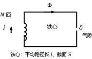
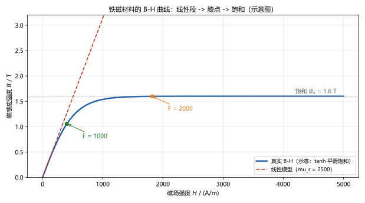
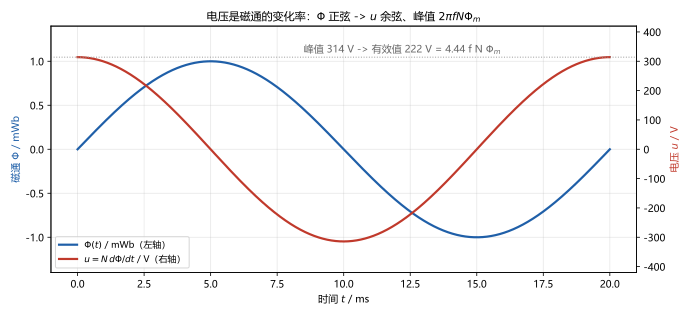

# 第 17 讲：磁路与铁心线圈

> **前置**：第 16 讲（三相）与 09 讲（电感 $\psi = Li$）、13–15 讲的相量与功率方法。
> **预计时间**：约 3 小时（含作业）。
>
> **一句话定位**：电路与磁的交界地带。电流能在"磁的路"上驱动磁通穿过磁阻——**磁路有自己的欧姆定律**；铁心是磁通的低阻通道，气隙会把影响放大（1 毫米空气顶 6.25 倍 40 厘米铁心）；交流铁心线圈里，电压"强加"磁通（4.44 公式）——这一讲是变压器与电机的物理入场券，也是 18 讲耦合电感的直接基础。
>
> **本讲回答什么**：
> 1. 磁路欧姆定律凭什么长得像欧姆定律？谁是"电阻"、谁是"电流"？
> 2. 铁心真正在干嘛（它不只是"线圈的支架"）？
> 3. 气隙只开了一丁点，磁通凭什么塌一大截（那为什么有时还故意留）？
> 4. B-H 曲线弯了，计算用哪个 $\mu$？
> 5. 4.44 公式从哪来？凭什么说"磁通由电压说了算"？
> 6. 铁损是什么？涡流与磁滞怎么来的、工程上怎么少亏？
>
> **这一讲有真实验证**：主例磁路全解（$R_\delta = 6.25\times R_{\mathrm{Fe}}$、$\Phi = 0.433\ \mathrm{mWb}$、$B = 1.083\ \mathrm{T}$、安匝核对 $137.9 + 862.1 = 1000$、$L = 0.433\ \mathrm{H}$——全部逐位核对）；气隙扫描（$R$ 份额 $3.125/6.25/12.5/25$ 线性于 $\delta$）；4.44 的正弦积分验证（数值微分 vs 解析偏差 $1.03\times10^{-5}$、反解 $N = 990.3$ 匝）；饱和演示（$F$ 翻倍，曲线口径 $B$ 只从 $1.054 \to 1.598\ \mathrm{T}$）；作业数字全部预验证（脚本 `scripts/lec17-01`、`lec17-02`）。

## 本讲怎么走（脉络图）

```
引子：电路课为什么算"磁"——因为下一类设备（变压器/电机）的工作原理就在磁里
  │
  ├─ 1. 磁场基本量与铁心的作用：B、H、μ、Φ、ψ；铁心是磁通的低阻通道
  ├─ 2. 磁路欧姆定律：F 驱动 Φ 穿过 R_m；对偶表、串并联、气隙杠杆、计算流程
  ├─ 3. 铁磁材料：B-H 曲线、饱和、用哪个 μ 的口径
  ├─ 4. 交流铁心线圈：4.44 公式、磁通由电压主导、铁损两兄弟
  └─ 5. 边界：磁路"像"电路，但不能照搬的五件事——然后去 18 讲
  → 常见误区 → 本讲小结 → 掌握度自测 → 作业
```

---

## 引子：电路课为什么算磁

下一阶段要处理的设备——变压器、电动机、继电器——全都靠"磁"工作。而磁的世界里有一套和电路几乎同构的关系。**先给出结果**（图 1 的铁心线圈）：



> **图 1 怎么读**：矩形铁心（磁通的"路"），左臂绕 $N$ 匝线圈（通电流 $i$ 提供"磁动势"），上臂箭头是磁通 $\Phi$ 的走向，右臂留了一个小气隙 $\delta$。铁心的平均路径长 $l$、截面 $S$。

对它的"全套磁路计算"预览（数字全部来自脚本实测，细节逐节展开）：

$$F = Ni = 1000\ \mathrm{A}, \qquad
\Phi = \frac{F}{R_{\mathrm{Fe}} + R_\delta} = 0.433\ \mathrm{mWb}, \qquad
B = 1.083\ \mathrm{T}$$

两个值得盯的数字：**1 毫米的气隙，磁阻是 40 厘米铁心的 6.25 倍**；1000 安匝的"磁压降"里，**862 安匝花在那 1 毫米空气上**。这就是本讲的核心特点：磁路最怕"空气"。

---

## 1. 磁场基本量与铁心的作用

### 1.1 四个量一张表

| 量 | 符号/单位 | 是什么 |
|---|---|---|
| 磁感应强度 | $B$，特斯拉（T） | "磁通密度"——单位面积穿过的磁通；决定磁场对电流/铁磁体的作用力 |
| 磁场强度 | $H$，安/米（A/m） | "磁化的驱动"——由电流按安培环路产生；配合材料属性$^\dagger$决定 $B$ |
| 磁导率 | $\mu = \mu_r\mu_0$，H/m | 材料"导磁能力"；真空 $\mu_0 = 4\pi\times10^{-7}\ \mathrm{H/m}$，铁磁材料 $\mu_r$ 可达千、万级 |
| 磁通 | $\Phi$，韦伯（Wb） | 穿过某个截面的"磁通总根数"；均匀垂直时 $\Phi = BS$ |
| 磁通链 | $\psi = N\Phi$，韦伯·匝 | 线圈"打包"的磁通（每匝都链一遍），即 09 讲 $\psi = Li$ 中的 $\psi$ |

$^\dagger$ **核心关系**：$B = \mu H$——同一个 $H$（同样安匝驱动），材料越"导磁"，$B$ 越大。空气的 $\mu = \mu_0$；铁磁材料的 $\mu_r$ 是"放大倍数"。

### 1.2 磁动势的源头：安培环路一句话版

电流能在空间里"驱动"出一个磁场；对沿闭合回路"绕一圈"的累积来说，规则极其简洁：

$$H \cdot l \approx Ni \quad\Longleftrightarrow\quad \text{（沿磁路绕一周）磁场强度的累积} = \text{穿过的安匝数}$$

右边的 **$F = Ni$** 叫**磁动势**（magnetomotive force，mmf；单位安或安匝，工程习惯说"安匝"）——磁路里的"电动势"：它不叫"力"却是驱动力，名字来自历史，认识即可。

沿铁心绕一圈：$F$ 沿路分配成各段的 $H\cdot l$（铁心段 + 气隙段）——这就是 §2 的"磁路 KVL"。

### 1.3 回到电路：剪开 $\psi = Li$

09 讲给过 $\psi = Li$——线圈的电感由它自己定义，但"电感的大小"从哪里来？今天能算了：$\psi = N\Phi$，而 $\Phi$ 由磁路的 $F = Ni$ 驱动……一串代换（§2.4）将给出一个漂亮的公式：$L = N^2/R_m$——**电感的大小由"磁的路"有多好走决定**。这就是电路与磁的第一座正式桥梁。

### 1.4 铁心在干嘛（它不只是"线圈的支架"）

（"想当然归纳"的正面回答）：铁心确实是结构件，但它真正的身份是**磁通的低阻通道**：

- **放大**：同样 1000 安匝，有铁心（$\mu_r = 2500$）与纯空气路径相比，磁通约放大 2500 倍（$R_m$ 与 $\mu$ 成反比——§2 马上算）；
- **引导**：让磁通走指定路线（把磁场"圈"在设备里，别到处乱跑）——但引导不是 100% 完美（漏磁，§5 边界）；
- **代价**：铁磁材料的 $B-H$ 非线性与损耗（饱和、铁损）也都是它带来的代价（§3、§4）。

一句话：**铁心 = 给磁通修的高速公路**——路好走，同样的"车流"（磁通）需要的"驱动力"（安匝）就小。

---

## 2. 磁路欧姆定律与磁路计算

### 2.1 定律的推导：两条式子一除就出来

**磁路欧姆定律**不是新定律，是两条已有事实的合并：

1. **安培环路**（§1.2）：沿一段均匀磁路，$F = H\,l$；
2. **磁通定义**：$\Phi = BS$，且 $B = \mu H$，即 $H = \dfrac{\Phi}{\mu S}$。

把 2 代入 1：

$$F = \frac{\Phi}{\mu S}\,l \quad\Longrightarrow\quad \boxed{\Phi = \frac{F}{R_m}, \qquad R_m = \frac{l}{\mu S}}$$

**磁阻**（reluctance）$R_m$ 的单位：$1/\mathrm{H}$（每亨利）。形式与欧姆定律一模一样——"驱动力 ÷ 阻力 = 流量"：

| 电路 | 磁路 |
|---|---|
| 电动势 $U$ | **磁动势** $F = Ni$ |
| 电流 $I$ | **磁通** $\Phi$ |
| 电阻 $R = l/(\sigma S)$ | **磁阻** $R_m = l/(\mu S)$ |
| $I = U/R$ | $\Phi = F/R_m$ |

**为什么这么像**：两者的推导都落在"场量的路径积分 = 驱动"与"场量 = 材料系数 × 密度量"的同一个结构上——数学同构，物理各自独立。这也预告了类比可以走多远、走到哪里必须停（§5 边界）。

### 2.2 串并联磁路：照搬，但记住前提

- **串联**（串联的两段磁路，如铁心 + 气隙）：$R_m$ 相加，$F$ 按磁阻**分配**到各段（"磁路分压"）——主例的 137.9/862.1 就是这个分配；
- **并联**（磁通从一个节点分到两条支路）：形式上"磁通分流"；但严格性打折（漏磁让"节点守恒"只是近似——§5）。
- 工程日常：**串联最常见**（铁心 + 气隙就是两段串着），"算磁路"九成是"分段算 R、串起来除 F"。

### 2.3 气隙的杠杆效应

铁心段与气隙段**串联**，各自磁阻：

$$R_{\mathrm{Fe}} = \frac{l}{\mu_r\mu_0 S}, \qquad R_\delta = \frac{\delta}{\mu_0 S}
\quad\Longrightarrow\quad
\frac{R_\delta}{R_{\mathrm{Fe}}} = \mu_r\,\frac{\delta}{l}$$

**一个比例式说尽秘密**：气隙与铁心的磁阻之比 = $\mu_r \times \delta / l$——铁心导磁强 $\mu_r$ 倍，但气隙"距离"短 $l/\delta$ 倍；比值看谁压得过谁。主例：$2500 \times \frac{1\ \mathrm{mm}}{40\ \mathrm{cm}} = 6.25$——**40 厘米的铁心干不过 1 毫米的空气**。

气隙扫描（脚本实测）：

| $\delta$ | $R_\delta/R_{\mathrm{Fe}}$ | $\Phi$ |
|---|---|---|
| $0.5\ \mathrm{mm}$ | $3.125$ | $0.762\ \mathrm{mWb}$ |
| $1\ \mathrm{mm}$ | $6.25$ | $0.433\ \mathrm{mWb}$ |
| $2\ \mathrm{mm}$ | $12.5$ | $0.233\ \mathrm{mWb}$ |
| $4\ \mathrm{mm}$ | $25$ | $0.121\ \mathrm{mWb}$ |

比值随 $\delta$ 线性翻倍、磁通随总磁阻往下掉——"气隙是磁路里的显眼包"。**为什么**？因为空气的 $\mu_0$ 比铁心小几千倍，气隙里 $H$ 必须飙得很高（主例 $H_\delta = 8.62\times10^5$ A/m）——安匝的大头（862/1000）就花在这里。这个事实工程上反复出现：**电机的气隙、变压器的气隙、电感器的气隙设计，全靠这个杠杆**（§4 和 18 讲都会回来找它）。

### 2.4 计算流程与运行例全解

> **磁路计算标准流程**（模板）：
> 1. **画磁路等效图**：把磁路分段（铁心段、气隙段、各支路口），标尺寸 $l_k$、$S_k$、$\mu_k$；
> 2. **算各段磁阻**：$R_{m,k} = l_k/(\mu_k S_k)$；
> 3. **合成**：串联相加（并联取倒数和的倒数）；
> 4. **求磁通**：$\Phi = F/R_{总}$（$F = Ni$）；
> 5. **求工作点**：$B_k = \Phi/S_k$、$H_k = B_k/\mu_k$；
> 6. **安匝核对**：$\sum H_k\,l_k = F$（磁路的"KVL 验算"——**每次都要做**）；
> 7. **查饱和**：$B_k$ 与 $B_s$ 比对——逼近饱和就回到 §3 的口径问题。

**运行例全解**（图 1 的线圈，脚本逐项实测）：$N = 1000$、$i = 1\ \mathrm{A}$（$F = 1000$ A）；铁心 $l = 40\ \mathrm{cm}$、$S = 4\ \mathrm{cm^2}$、$\mu_r = 2500$；气隙 $\delta = 1\ \mathrm{mm}$。设 $\mu_0 = 4\pi\times10^{-7}$，先回味一个小巧合：$\mu_r\mu_0 = 2500 \times 4\pi\times10^{-7} = \pi\times10^{-3}$（算起来很干净）：

1. $R_{\mathrm{Fe}} = \dfrac{0.4}{\pi\times10^{-3}\times4\times10^{-4}} = \dfrac{10^6}{\pi} \approx 3.183\times10^5$；$R_\delta = 6.25\,R_{\mathrm{Fe}} = \dfrac{6.25\times10^6}{\pi} \approx 1.989\times10^6$；
2. $R_{总} = \dfrac{7.25\times10^6}{\pi} \approx 2.308\times10^6$；
3. $\Phi = \dfrac{F}{R_{总}} = \dfrac{1000\,\pi}{7.25\times10^6} = \dfrac{\pi}{7250} \approx 4.33\times10^{-4}\ \mathrm{Wb} = 0.433\ \mathrm{mWb}$；
4. $B = \Phi/S = \dfrac{\pi/7250}{4\times10^{-4}} = \dfrac{\pi}{2.9} \approx 1.083\ \mathrm{T}$；
5. $H_{\mathrm{Fe}} = B/(\pi\times10^{-3}) \approx 344.8\ \mathrm{A/m}$、$H_\delta = B/\mu_0 \approx 8.62\times10^5\ \mathrm{A/m}$；
6. **安匝核对**：$H_{\mathrm{Fe}}\,l + H_\delta\,\delta = 137.9 + 862.1 = 1000$ （脚本零残差）；——**一句话记住这个结果：气隙虽短，安匝大头全在这里**；
7. **饱和检查**：$B = 1.083\ \mathrm{T} < B_s \approx 1.6\ \mathrm{T}$ ✓ 在膝点之下——"线性 μ 口径"合法（§3 讨论）。

**顺手把电感的桥接过完**（§1.3 的承诺）：

$$\psi = N\Phi = N\cdot\frac{F}{R_m} = N\cdot\frac{N i}{R_m}
\quad\Longrightarrow\quad
\boxed{L = \frac{\psi}{i} = \frac{N^2}{R_m}}$$

主例：$L = 10^6/(2.308\times10^6) = 0.433\ \mathrm{H}$ ✓。**电感的大小 = 匝数平方 ÷ 磁阻**——"绕得越多、路越好走，电感越大"，全都量化了。也顺便解释了 §2.3：**气隙一开，$R_m$ 一大，电感立马缩水**（去掉气隙按线性外推：$L$ 会到 $3.14\ \mathrm{H}$——但那时 $B$ 外推到 $7.85\ \mathrm{T}$，早就饱和了，这个极限到不了）。

---

## 3. 铁磁材料：B-H 曲线与饱和

### 3.1 曲线三段

铁磁材料的 $B$ 与 $H$ 不成正比——**$B-H$ 曲线**（图 2）分三段：



> **图 2 怎么读**：底部"线性段"：$B$ 正比于 $H$（$\mu_r$ 完好）；中段"膝点"：开始弯；上部"饱和"：$H$ 再大 $B$ 也涨不动——**$B_s \approx 1.6\ \mathrm{T}$**（硅钢量级）。红色虚线是"常数 $\mu_r$ 的线性模型"——在低 $B$ 与真实曲线重合、往上越走越离奇（冲到 3 T 以上去也）。绿点、橙点是主例的两种"安匝加倍"工作点。

### 3.2 计算用哪个 μ：两种口径 + 一条纪律

- **口径一：常数 $\mu_r$**（题给值 / 说明书值）——在**未饱和区**（$B$ 远小于 $B_s$）是合法近似。主例 $B = 1.083\ \mathrm{T}$ 还在膝点下，用它没大问题；
- **口径二：曲线口径**（查 $B-H$ 曲线或按工作点的**平均磁导率** $\mu_{avg} = B/H$）——当工作点接近/超过膝点时，必须用它；求解可能要"试探迭代"（$B$ 与 $\mu$ 互为因果）。

**纪律**：**用哪个口径、当场声明**（题目给了 $\mu_r$ 就用常数口径；让你"查曲线"就老老实实迭代）——两种结果会有差异，但差异有多大取决于工作点（下一段马上看）。这正是"完整形态"里非线性材料必须回到的地方。

### 3.3 饱和的现场：电流加倍，磁通不再加倍

给主例一个动作——**电流翻倍**（$F: 1000 \to 2000$），看两种口径的预言（脚本实测，饱和模型为当场选取的 tanh 平滑示意）：

- **曲线口径**：$B$ 只从 $1.054\ \mathrm{T}$ 升到 $1.598\ \mathrm{T}$（×1.52）——**电流翻倍，磁通只多了一半**；
- **线性外推**：会预言 $B = 2.17\ \mathrm{T}$——**不存在**（材料早就饱和，$B$ 被 $B_s$ 顶住）。

**两个注意**：

1. 主例本身在两种口径下就已经有差（同一条安匝线：$1.083$ vs $1.054$，差约 2.7%）——膝点下的"隐性代价"，口径必须声明的原因；
2. 饱和的后果很真实：要硬推磁通，得付**暴涨的励磁电流**（曲线越平、$H$ 越飙）——变压器的上电冲击、磁放大器的原理都由这里来。工程设计的经验红线：**工频设备工作点一般压在 $B_m \lesssim 1.2\ \mathrm{T}$**。

---

## 4. 交流铁心线圈

### 4.1 从法拉第定律到 4.44 公式

给图 1 的线圈接上交流电压 $u$。支配它的是**法拉第电磁感应定律**（本讲唯一的新物理，也是 09 讲电感两侧的另一半）：

$$u = N\,\frac{\mathrm{d}\Phi}{\mathrm{d}t}$$

**读法**：线圈两端的电压 = 磁通链的**变化率**（关联方向下取正号；"磁通变得越快、电压越高"）。设磁通是正弦的 $\Phi = \Phi_m\sin\omega t$（稳态、电压正弦时磁通也正弦——下一小节说明），则

$$u = N\omega\Phi_m\cos\omega t
\quad\Longrightarrow\quad
U_m = 2\pi f N \Phi_m
\quad\Longrightarrow\quad
\boxed{U = \frac{U_m}{\sqrt{2}} = \underbrace{\frac{2\pi}{\sqrt{2}}}_{4.44}\, f N \Phi_m}$$

**4.44 的真身就是 $2\pi/\sqrt{2} = 4.4429$**——一次余弦的峰值→有效值换算而已：$U_m = \omega N\Phi_m$ 是"法拉第 + 正弦求导"的直给，除 $\sqrt{2}$ 是惯例。图 3 把整条链画在脸上：



> **图 3 怎么读**：左轴：磁通 $\Phi(t)$ 正弦（峰值 $1\ \mathrm{mWb}$）；右轴：电压 $u = N\,d\Phi/dt$ 余弦（峰值 $314\ \mathrm{V}$）——**电压是磁通的变化率**，$\Phi$ 过零处 $u$ 达峰。峰值 $314\ \mathrm{V} \to$ 有效值 $222\ \mathrm{V} = 4.44 f N\Phi_m$（$N = 1000$、$f = 50$）。脚本实测：数值微分 vs 解析偏差 $1.03\times10^{-5}$。

**工程数字例**：要造一只 **220 V / 50 Hz** 的线圈，铁心 $S = 10\ \mathrm{cm^2}$、工作磁密取 $B_m = 1\ \mathrm{T}$（$\Phi_m = B_mS = 1\ \mathrm{mWb}$）：

$$N = \frac{U}{4.44 f \Phi_m} = \frac{220}{4.44\times50\times10^{-3}} \approx 990\ \text{匝}$$

——工程口诀"每伏四五匝"（220 V ↔ 约 1000 匝）就是这么来的。

### 4.2 磁通由电压主导：公式里的"缺席者"

盯一眼 4.44 公式的**不包含哪些量**：没有 $\mu$、没有 $\mu_r$、没有铁心材料、**没有电流**、没有负载。磁通的峰值 $\Phi_m = \dfrac{U}{4.44fN}$ 就由这么三样确定：**电压、频率、匝数**。这叫"**磁通由电压主导**"，机制是：

- 电源是"强硬"的：它把电压钉住 = 把 $\Phi$ 的**变化率**钉住；积分回去，$\Phi$ 的波形与大小就被确定；
- 电流是"自适应"的：磁路需要多少安匝才能建立这个 $\Phi$（$F = \sum Hl$，取决于材料与气隙），电流就自动供多少（$i = F/N$）——**电流不是磁通的主人，是磁路的会计**。

**为什么这句话重要**：它是变压器的第一性原理——同一铁心上的两个线圈共享同一个 $\Phi$，各自 $U = 4.44fN\Phi_m$ 一除，**电压比 = 匝数比**（18 讲正式展开）。也和 §3.3 的饱和现场呼应：一旦磁通被推向饱和区，励磁电流就会暴涨（变压器合闸瞬间的冲击电流是它的著名现场）。

**两个边界提示**：电压非正弦时这套"积分确定"逐次谐波处理（20 讲）；$\Phi$ 在饱和区时，电流波形会明显畸变（认识层——本课程不展开）。

### 4.3 铁损：涡流与磁滞两兄弟

铁心在交流下发热，损耗有两个来源（总称**铁损**，与线圈自己的**铜损** $I^2R$ 相对——变压器两类损耗的来源）：

| 损耗 | 机理 | 量级规律 | 对策 |
|---|---|---|---|
| **涡流损耗** | 交变磁通在铁心（导体）内感应出旋涡状电流，发热 | $\propto f^2B_m^2$ | **叠片**（薄片涂绝缘漆、切断涡流路径）+ 高电阻率硅钢 |
| **磁滞损耗** | 材料磁化时 $B$ 总"追不上"$H$、走一圈回线，剩下一圈热量 | $\propto f\times$（回线面积） | **软磁材料**（回线窄：硅钢、铁氧体、坡莫合金……） |

三点认识（能复述即可）：① 两者都随频率升、都是"磁通闹的"；② 工程上"硅钢片叠压"这个最常见的铁心工艺，一次性对付两件事（硅提高电阻率、片切涡流、软磁窄回线）；③ 铁损让磁路计算多了个"发热项"，噪声与温升都从它来。

---

## 5. 边界：磁路"像"电路，但这五件事不能照搬

类比是好工具，但必须知道它在哪里失效——"想当然归纳"到此刹车：

1. **$\mu$ 不是常数**：磁阻 $R_m$ 随工作点漂（$B$ 一变 $\mu$ 就变）——电路的 $R$ 是常数，这是最大的裂缝（§3 的口径纪律就是为它设的）；
2. **漏磁**：磁通并非全部乖乖走铁心（空气也导磁！）——"磁路 KCL"只是近似，工程上留"漏磁系数"余量（认识层）；
3. **没有磁绝缘体**：磁通在空气里也有路可走——"断开磁路"没有电路"断开开关"那种干脆（所以继电器断磁有拖尾、消磁需要专门设计——认识层）；
4. **边缘效应**：气隙处磁通会"鼓包"（有效截面比几何截面略大）——精算时的修正项（认识层）；
5. **损耗的归属**：电路里耗散都在电阻上，热从元件出；磁路里"导体"（铁心）自己发热——铁损要单独计算（§4.3）。

**小结一句**：磁路计算 = "电路化的磁"——**用来估算与设计足够好，用来"背结论"足够危险**。看清五条裂缝，类比才安全。

> 下一讲：把两个线圈放到同一根铁心上——互感与变压器正式登场。

> **态度表（磁路与铁心线圈部分）**
>
> | 内容 | 态度 |
> |---|---|
> | 五个量（B/H/μ/Φ/ψ）的定义、单位与 $B = \mu H$ | **能默写、单位一次不错** |
> | 磁路欧姆定律的推导（两条式子一除） | **能复推**；知道"不是新定律" |
> | 对偶表与磁路计算七步模板 | **能默写、能照做**（含安匝核对） |
> | 气隙杠杆 $\mu_r\delta/l$ 与安匝分配（138/862） | **能算、能解释** |
> | $L = N^2/R_m$ 的推导与和气隙的关系 | **能推导、能解释** |
> | B-H 三段、两种 μ 口径与"当场声明"纪律 | 能复述；饱和现场（1.054→1.598）记得住 |
> | 4.44 的推导与"磁通由电压主导" | **能推导、能讲清它不包含哪些量** |
> | 铁损两兄弟与对策 | 认识层：能说清机理与一句话对策 |
> | 边界五条 | 能逐条举例（不背条目，理解裂缝在哪） |
>
---

## 常见误区（本节零新知识，只破误）

> 以下每条只是"对答案 + 校准"，没有新知识——每一句都已在正文系统小节里教过。

1. **"磁路欧姆定律是独立的新定律（或只是欧姆定律换个字母）"**（§2.1）。都不对：它是"安培环路 + 材料性质"合并改写的结果——形式同构、物理独立。
2. **"铁心只是用来固定线圈的支架"**（§1.4）。错。铁心是磁通的**低阻通道**：同样安匝下把磁通放大 $\mu_r$ 倍（主例口径下 2500 倍量级），并引导磁通走指定路线。
3. **"气隙自然是越小越好"**（§2.3、§3.3）。片面。气隙吃安匝（主例 862/1000）——所以变压器力求小而闭合；但电感器（扼流圈）**故意开气隙**防饱和（$B$ 随电流线性稳定、电感值稳），电动机也必须留气隙（转动）。是取舍，不是好坏。
4. **"$\mu_r$ 是常数，一个数用到底"**（§3.1、§3.2）。错。$B-H$ 非线性、膝点后进入饱和；用哪个口径必须**当场声明**（常数口径/曲线口径，主例工作点两种口径差约 2.7%、翻倍电流后差异暴涨到"2.17 不存在"）。
5. **"交流铁心线圈的磁通由电流决定"**（§4.2）。反了。**磁通由电压主导**（$\Phi_m = U/4.44fN$，公式里没有 μ、没有电流）；电流是自适应的"会计"（按磁路的需求供安匝）。
6. **"4.44 是个神秘的经验常数"**（§4.1）。不是——它是 $2\pi/\sqrt{2}$：法拉第定律 + 正弦求导（峰值 $2\pi fN\Phi_m$）+ 峰值换有效值，一步一扣。
7. **"铁损就是涡流损耗"**（§4.3）。漏了**磁滞损耗**（$B-H$ 回线一圈的热）。两兄弟机理不同、对策也不同，叠片+软磁是对两兄弟的综合方案。

---

## 本讲小结

一页纸的骨架：

- **五个量**：$B = \mu H$（磁密、磁化驱动、磁导率）；$\Phi = BS$（磁通）；$\psi = N\Phi$（磁通链，即 $\psi = Li$ 中的 $\psi$）；$F = Ni$（磁动势）。
- **磁路欧姆定律**：$\Phi = F/R_m$、$R_m = l/(\mu S)$——安培环路与材料性质合并的结果；对偶表（F↔U、Φ↔I、$R_m$↔R）。
- **磁路计算七步**：分段画图 → 各段 $R_m$ → 合成 → $\Phi = F/R$ → 工作点（B、H）→ **安匝核对**（$\sum Hl = F$）→ 饱和检查。
- **主例全数字**：$R_{\mathrm{Fe}} = 10^6/\pi$、$R_\delta = 6.25 R_{\mathrm{Fe}}$、$R_{总} = 7.25\times10^6/\pi$；$\Phi = 0.433\ \mathrm{mWb}$、$B = 1.083\ \mathrm{T}$；**安匝核对 137.9 + 862.1 = 1000**；$L = 0.433\ \mathrm{H}$。
- **气隙杠杆**：$R_\delta/R_{\mathrm{Fe}} = \mu_r\delta/l = 6.25$——"40 厘米铁心干不过 1 毫米空气"；扫描 3.125/6.25/12.5/25。
- **电感桥梁**：$L = N^2/R_m$（$\psi = Li$ 的磁路版）；气隙砍磁阻份额直接砍电感（0.433 vs 线性外推 3.14）。
- **铁磁材料**：B-H 三段、$B_s \approx 1.6\ \mathrm{T}$、两种 μ 口径与声明纪律；饱和现场：F 翻倍 → B 从 1.054 只到 1.598（线性外推 2.17 不存在）。
- **交流铁心线圈**：$u = N\,d\Phi/dt$ → **$U = 4.44 fN\Phi_m$**（= $2\pi/\sqrt{2}$）；"磁通由电压主导、电流自适应"；数字例：220 V/50 Hz/1 T → $N \approx 990$ 匝。
- **铁损**：涡流（$\propto f^2B_m^2$，叠片对策）+ 磁滞（$\propto f\cdot$回线面积，软磁对策）。
- **边界五条**：μ 非线性、漏磁、无磁绝缘体、边缘效应、损耗归属——类比的裂缝清单。
- **实测合集**：主例全解零残差；气隙扫描；4.44 数值验证 1.03×10⁻⁵；饱和 1.054→1.598；作业全预验证（含 $7.85\ \mathrm{T}$ 外推、25 Hz 危、990.3 匝）。

## 掌握度自测

- [ ] 我能默写五个量的定义、单位与 $B = \mu H$、$\Phi = BS$、$\psi = N\Phi$ 的关系。
- [ ] 我能从安培环路与材料性质**复推**磁路欧姆定律，并说清"它不是新定律"。
- [ ] 我能默写磁路计算七步模板，并用主例走一遍（含安匝核对）。
- [ ] 我能用 $\mu_r\delta/l$ 当场算气隙份额，并解释"空气为什么这么贵"。
- [ ] 我能推导 $L = N^2/R_m$，并说清气隙与电感的关系。
- [ ] 我能画/讲 B-H 曲线的三段，并说出两种 μ 口径与声明纪律。
- [ ] 我能复推 4.44 公式（含 $2\pi/\sqrt{2}$ 的来历），并数出它不包含哪些量。
- [ ] 我能用"电压主导、电流自适应"解释变压器电压比的物理基础（预告 18 讲）。
- [ ] 我能说清铁损两兄弟的机理与各自的对策。
- [ ] 我能逐条说出磁路与电路的五条边界裂缝；能复跑 `scripts/lec17-01`、`lec17-02` 并解释每一个数字。

## 作业

> 答案只能用**已教概念**（本讲范围：五个量、磁路欧姆定律与七步、气隙杠杆、$L = N^2/R_m$、B-H 与口径、4.44 与电压主导、铁损；09 讲电感、13–16 讲全部承接）。先独立做，再对答案。

### 基础

**Q1. 概念辨析**：判断对错，并给一句话理由。

(a) "磁路欧姆定律其实和欧姆定律是一回事，只是字母不同。"
(b) "气隙磁阻与气隙长度成正比。"
(c) "铁磁材料的 $\mu_r$ 在整个工作范围内是常数。"
(d) "交流铁心线圈中，磁通的最大值主要由电流决定。"
(e) "铁损包含涡流损耗与磁滞损耗两部分。"

**参考答案**：

(a) 错。数学同构但物理独立——它是"安培环路 + 材料性质"合并改写的结果。
(b) 对。$R_\delta = \delta/(\mu_0 S)$——与长度成正比。
(c) 错。$B-H$ 非线性（膝点、饱和）；用哪个口径必须声明。
(d) 错。由电压主导：$\Phi_m = U/(4.44 fN)$（公式里没有电流）；电流是自适应的。
(e) 对。两兄弟机理不同（旋涡感应电流 vs 磁化滞后），对策也不同。
验算：五小题各回一个机制词：推导来源 / R 公式 / 非线性 / 4.44 / 两兄弟。

**Q2. 计算·主例复算**：$N = 1000$、$i = 1\ \mathrm{A}$；铁心 $l = 40\ \mathrm{cm}$、$S = 4\ \mathrm{cm^2}$、$\mu_r = 2500$；气隙 $\delta = 1\ \mathrm{mm}$。求各段磁阻、总磁阻、$\Phi$、$B$、$L$。

**参考答案**：

$\mu_r\mu_0 = \pi\times10^{-3}$；$R_{\mathrm{Fe}} = 10^6/\pi \approx 3.183\times10^5$、$R_\delta = 6.25R_{\mathrm{Fe}} \approx 1.989\times10^6$、$R_{总} \approx 2.308\times10^6$；
$\Phi = 1000/R_{总} = \pi/7250 \approx 0.433\ \mathrm{mWb}$；$B = \Phi/S \approx 1.083\ \mathrm{T}$；$L = N^2/R_{总} \approx 0.433\ \mathrm{H}$。
验算：脚本 `lec17-02` Q2 行一致。

**Q3. 计算·去气隙的线性外推**：去掉气隙后（仍用常数 $\mu_r$ 口径）$\Phi$ 与 $B$ 是多少？为什么这个结果在现实中达不到？

**参考答案**：

$\Phi' = 1000/R_{\mathrm{Fe}} = 3.142\ \mathrm{mWb}$；$B' = \Phi'/S = 7.85\ \mathrm{T}$。
达不到：远超 $B_s \approx 1.6\ \mathrm{T}$——铁心早饱和，$\mu_r$ 会暴跌，$B$ 被材料顶住（线性模型在饱和区彻底失效）。
验算：脚本 `lec17-02` Q3 行。

**Q4. 计算·电感对比**：主例的 $L$ 与"去气隙线性外推"的 $L'$ 各是多少？说明气隙对电感的影响机制。

**参考答案**：

$L = 0.433\ \mathrm{H}$；$L' = 10^6/R_{\mathrm{Fe}} = 3.14\ \mathrm{H}$。
机制：$L = N^2/R_m$——气隙按磁阻份额（6.25/7.25）直接砍电感；"气隙决定电感大小"（扼流圈设计就用它调）。但注意 $L'$ 是线性外推值，实际到不了（饱和）。
验算：脚本 `lec17-02` Q4 行。

**Q5. 计算·4.44 与降频**：220 V/50 Hz 线圈：$S = 10\ \mathrm{cm^2}$、$B_m = 1\ \mathrm{T}$：(1) 求 $N$；(2) 若电压不变、频率降到 25 Hz，$\Phi_m$ 与 $B_m$ 变多少？有什么危险？

**参考答案**：

(1) $\Phi_m = 1\ \mathrm{mWb}$；$N = 220/(4.44\times50\times10^{-3}) \approx 990$ 匝。
(2) $\Phi_m = 220/(4.44\times25\times10^{-3}) = 2\ \mathrm{mWb}$（翻倍）；$B_m = 2\ \mathrm{T}$（饱和！）——磁通与频率成反比（$U$ 不变时）：低频=高风险，"低频超压是变压器的杀手"。
验算：脚本 `lec17-02` Q5 行。

### 提高

**Q6. 概念·不包含哪些量**：4.44 公式里没有 $\mu$、没有电流、没有负载——请解释：

(1) 磁通凭什么"不看材料脸色"？
(2) 若电压减半（频率、匝数不变），磁通与励磁电流各怎么变？

**参考答案**：

(1) 电源强加的是电压=磁通的**变化率**——积分决定磁通波形与大小（$\Phi_m = U/4.44fN$）；材料只决定"建得起这个磁通需要多少安匝"（决定电流的大小），改不了磁通本身。
(2) 磁通减半（$\Phi_m$ 正比于 $U$）；工作点远离饱和、磁路"轻松"——励磁电流大幅减小（靠近饱和时电流才飙）。
验算：回 §4.2 逐条对号。

**Q7. 计算·安匝分配**：对 Q2 的主例算出两段磁压降并核对；并说明"气隙虽短，为什么是大头"。

**参考答案**：

$H_{\mathrm{Fe}} = B/(\pi\times10^{-3}) \approx 344.8\ \mathrm{A/m}$ → $H l = 137.9\ \mathrm{A}$；$H_\delta = B/\mu_0 \approx 8.62\times10^5\ \mathrm{A/m}$ → $H\delta = 862.1\ \mathrm{A}$；和 $= 1000 = F$ ✓。
原因：气隙里 $\mu = \mu_0$ 比铁心小 2500 倍——同样的 $B$ 需要 2500 倍的 $H$；长度虽只剩 1/400，乘积仍远大于铁心段（2500/400 = 6.25 倍）。
验算：脚本 `lec17-02` Q7 行。

### 综合

**Q8. 开放·气隙的三份取舍**：用本讲数字与机制，回答三种设备的"气隙哲学"：

(1) 变压器铁心为什么几乎不留气隙？
(2) 滤波电感（扼流圈）为什么**故意**开一个气隙？
(3) 电动机为什么**必须**有气隙、且明明很"贵"也得认？

**参考答案**（要点）：

(1) 变压器要的是"高效传磁"：气隙吃安匝（主例 862/1000 的教训）——白花励磁电流、增损耗与温升；铁心闭合（叠片/卷绕）把磁阻压到最小。
(2) 扼流圈要的是"稳定的 L、防饱和"：纯铁心磁阻太"小"且非线性（电流稍大就饱和、电感崩）；气隙的磁阻主导后，$B$ 随电流近线性——电感值稳定、还能扛直流偏置（$L$ 由气隙说了算）。
(3) 电动机的转子要**转**——气隙是机械的必然；工程上把它做到"机械允许的最小"（0.2~1 mm 级），承认那份额外的励磁代价，换转动。
一句话：**气隙不是好坏问题，是"要什么"的问题**——传磁要闭合，稳感要开口，转动要留缝。
验算：回 §2.3、§3.2、§4.2 与脚本数字逐条对号。

---

*下一讲预告：第 18 讲《耦合电感与变压器》——两个线圈放到同一根铁心上：一个线圈的电流变化，凭什么能在另一个线圈里"凭空"生出电压（互感）？"同名端"这个记号到底在防什么错误？耦合系数与去耦等效怎么算？最后：理想变压器——电压比=匝数比、阻抗会被"变"着走，4.44 公式这次要在两个线圈上同时开张。*
