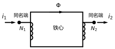
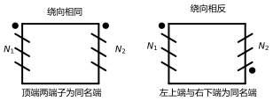
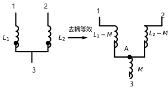

# 第 18 讲：耦合电感与变压器

> **前置**：第 17 讲（磁路与铁心线圈）｜ 13–15 讲（相量、阻抗、功率）｜ 09 讲（电感 $\psi = Li$）
> **预计时间**：约 3 小时（含作业）
>
> **一句话定位**：两个线圈放到同一根铁心上，磁场就把它们"焊"在一起——**互感**（mutual inductance）是这门耦合的数学长相；**同名端**（dotted terminal）定下方程的符号；**去耦等效**把互缠的方程拆回普通电路；**理想变压器**是"全耦合 + 无损耗"的极限，能把 8 Ω 变成 800 Ω。17 讲攒下的磁路地基，这一讲全部回收。
>
> **本讲回答什么**：
>
> 1. 互感电压 $u = M\,\mathrm{d}i/\mathrm{d}t$ 里的 $M$ 是什么？符号凭什么由"同名端"说了算？
> 2. 同名端怎么判断？图上为什么画两个小点？
> 3. 绕开符号陷阱，有没有可靠的操作流程？
> 4. 去耦等效在干什么？去耦后电路为什么就"普通"了？
> 5. 耦合系数 $k$ 是什么？$M$ 能无限大吗？
> 6. 理想变压器和普通变压器差在哪？为什么能"变阻抗"？
>
> **数字出处**：本讲全部数值都从 `scripts/lec18-01`（原理验证）与 `scripts/lec18-02`（作业预验证）复跑得到。

## 本讲怎么走（脉络图）

```
引子：两个线圈共用一条磁路——方程会"互缠"，但有两件大杀器
  │
  ├─ 1. 互感：磁链方程 ψ1 = L1i1 ± Mi2；耦合系数 k = M/√(L1L2)
  ├─ 2. 同名端与符号：点是什么、怎么判断、一套可靠的列方程流程
  ├─ 3. 去耦等效：串联、T 型三端——把互感"拆"成普通电感网络
  ├─ 4. 理想变压器：全耦合的极限；电压比、电流比、阻抗变换 n²Z_L
  └─ 5. 常见误区 → 小结 → 自测 → 作业
```

> 下一站：引子。先看一眼"能做出什么"。

---

## 引子：两根线绕在同一个铁心上

17 讲最后留了钩子：把两个线圈放到同一根铁心上。现在兑现。先看两个"成品"：

- **一个互感电路**（图 1 的抽象版，两回路各含一个线圈）：90 V 电源、一次回路 $6+\mathrm{j}4\ \Omega$、耦合项 $\mathrm{j}\omega M = \mathrm{j}5\ \Omega$、二次回路 $3+\mathrm{j}4\ \Omega$——解出来 $\dot I_1 = 10\angle 0^\circ$ A、$\dot I_2 = -8-\mathrm{j}6$ A（细节 §3 演示）；
- **一次"阻抗魔术"**：理想变压器把 8 Ω 的负载变成 800 Ω——匝数比 10 : 1 就够（$10^2 \times 8 = 800$）。

两个线圈的方程确实"互缠"（每个方程都带着另一边的电流），但本讲有两件大杀器：**同名端**把符号问题一次定死；**去耦等效**把互缠方程拆成一个不含互感项的普通电路。拆完，第 03–08 讲的全部武器（等效、结点法、网孔法、戴维南）原样复用。

---

## 1. 互感：磁场耦合的数学

### 1.1 从 17 讲的铁心开始

图 1 是标准场景——两个线圈 $N_1$、$N_2$ 绕在同一个铁心上：



> **图 1 怎么读**：铁心给两个线圈提供**同一条磁路**；线圈 1 的电流 $i_1$ 建立的磁通 $\Phi$ 不只链住自己，也**链住了线圈 2**。两个实心点标出的是**同名端**（§2 详讲）；图上 $i_1$ 从点流入、$i_2$ 从点流出。

17 讲的账本是：$\Phi = F/R_m$。线圈 1 的安匝 $F_1 = N_1i_1$ 建起磁通 $\Phi_{21} = N_1i_1/R_m$，其中有一部分（全耦合时全部）穿过线圈 2，"打包"成磁通链 $\psi_{21} = N_2\Phi_{21}$。于是：

$$
\psi_{21} = N_2\cdot\frac{N_1i_1}{R_m} = \frac{N_1N_2}{R_m}\,i_1 \equiv M i_1
$$

——**互感** $M$（mutual inductance）就这样"长"出来了：单位 H，数值由**两个线圈的匝数与磁路磁阻**共同决定。同理，线圈 2 的电流在线圈 1 里也打包出一个 $\psi_{12} = M i_2$（可以证明 $M_{12} = M_{21}$，一个字母 $M$ 够用）。

### 1.2 磁链方程：两个线圈各记一本账

每个线圈的**总磁链** = 自己电流的贡献 + 对方电流的贡献：

$$
\psi_1 = L_1i_1 + (\pm) M i_2, \qquad \psi_2 = (\pm) M i_1 + L_2 i_2
$$

自感项 $L_1 = N_1^2/R_m$、$L_2 = N_2^2/R_m$（17 讲的 $L = N^2/R_m$ 原样复用；这里的 $L$ 也叫**自感**，self-inductance——与互感相对），互感项的正号/负号是下一节的整个舞台，现在先记住：**两个线圈各记一本磁链账，每本账里除了"自己的"$Li$，还有"对方的"$Mi$**。

### 1.3 互感电压与相量形式

对磁链求导就是电压（17 讲的 $u = N\,\mathrm{d}\Phi/\mathrm{d}t$ 的"打包版"）：

$$
u_2 = \frac{\mathrm{d}\psi_2}{\mathrm{d}t} = L_2\frac{\mathrm{d}i_2}{\mathrm{d}t} + M\frac{\mathrm{d}i_1}{\mathrm{d}t}
$$

——**对方电流的变化率**，就是自己身上"凭空出现"的那部分电压（符号待定）。正弦稳态里照例过相量（13 讲）：

$$
\dot U_2 = \mathrm{j}\omega L_2\dot I_2 + \mathrm{j}\omega M\dot I_1
$$

顺手一句**认识层**的视角：$\mathrm{j}\omega M\dot I_1$ 说明互感可以画成一只**受控电压源**（02 讲的老朋友）——"互感 = 两个互相喂受控源的线圈"也是合法长相；本讲用磁链方程道路，知道这个视角存在即可。

### 1.4 耦合系数：M 能有多大？

$M = N_1N_2/R_m$ 里的 $R_m$ 是"两个线圈共享的那部分磁路"的磁阻——但现实里总有**漏磁**（§17 讲的边界五条：磁通不全听话）。把"实际共享比例"抽出来，就是**耦合系数**（coupling coefficient）：

$$
k = \frac{M}{\sqrt{L_1L_2}}, \qquad 0 \le k \le 1
$$

- **$k = 1$：全耦合**（perfect coupling）。用 17 讲数字验证一下为什么：理想铁心（无漏磁、无气隙）时 $M = N_1N_2/R_m$、$L_1 = N_1^2/R_m$、$L_2 = N_2^2/R_m$，于是 $M/\sqrt{L_1L_2} = N_1N_2/\sqrt{N_1^2N_2^2} = 1$ ——**一个共用的磁阻账本，"铆"出了 $k=1$**；
- $k < 1$：有漏磁；空气芯线圈 $k$ 常在 0.01~0.1 量级，铁心线圈常见 0.9 以上（电力变压器逼近 0.999）；
- 由此 $M \le \sqrt{L_1L_2}$——**$M$ 不能无限大**：它被两个线圈自感"夹"住了。衰减到极限：$k \to 0$（离得远）时 $M \to 0$，方程退化成两个独立线圈 ✓（这是一个自检用法，§2.4 用）。

> 下一站：把磁链方程里的"±"彻底解决——同名端登场。

---

## 2. 互感电压的符号与同名端

### 2.1 符号从哪来：耦合是有"方向"的

同一个 $M$、同一对线圈，绕法或电流方向一变，对方拿到的磁通可能**加强**也可能**削弱**。用一个最简画面：两个线圈绕向相反（图 2 右格），同样的电流从同样的端子流入，产生的磁通一个向上一个向下——对彼此就是"反着使劲"。数学上，这份"使劲方向"就记成 $+M$ 或 $-M$。所以符号不是数学游戏，是**真实的几何与电流方向**在方程里的写真。

### 2.2 同名端：把"加强"钉成定义

**同名端**（dotted terminal，也叫同极性端、打点端）：一对端子，满足——**让电流分别从这两个端子流入时，两线圈的磁通互相加强**。图上就用两个实心点（图 1、图 2 里的 •）表示。

三个要点，一次讲清：

1. 同名端是**一对**的概念："线圈 1 的这个端子与线圈 2 的那个端子同名"；
2. 它是**约定/标注**，不是"电流实际来的那端"——电流从哪进是从哪进，点画在哪是画在哪，两者独立（误区一节的第 2 条也盯着这个）。
3. 一旦点了点，**符号规则就全定了**：
   - 两电流**都从各自同名端流入**（或都从同名端流出）→ 磁通**加强** → 磁链方程取 $+M$；
   - 一个从同名端进、另一个从同名端出 → **削弱** → 取 $-M$。

### 2.3 同名端怎么判断

实际判断靠"绕向"（图 2）：



> **图 2 怎么读**：铁心上的斜线画法表示线圈绕向。**绕向相同**（左格）：两个线圈的对应端就是同名端（图上两顶端）；**绕向相反**（右格）：一顶一底才是同名端（左顶与右底）。

工程上的实话：变压器出厂时同名端是**实测标定**并打在铭牌/图纸上的（判断法则知道原理即可，干活以标注为准——认识层）。做题时，图标了点的用点；没标点但画了绕向的，按图 2 的法则推。

### 2.4 一套可靠的列方程流程

这是本讲的"防错主菜"，五步（对付一切含互感的题）：

> **互感电路列方程五步**：
>
> 1. **标点**：在图上认出（或推出一对）同名端；
> 2. **统一参考方向**：把两个线圈电流的参考方向**都选成"从同名端流入"**——选完后不再改；
> 3. **写磁链账**：$\psi_1 = L_1i_1 + Mi_2$、$\psi_2 = Mi_1 + L_2i_2$——全取正号（因为第 2 步已经把符号"预支"掉了）；
> 4. **求导得电压**：$u_k = \mathrm{d}\psi_k/\mathrm{d}t$（相量：$\times \mathrm{j}\omega$）——照常代入 KVL/KCL；
> 5. **自检**：令 $M \to 0$，方程必须退化回两个独立线圈；再查一眼"实际电流方向与参考方向是否相反"（负值的读法，01 讲的老纪律）。

**如果电路图钉死了电流方向、没法"都从同名端流入"怎么办**？不用慌——回到"加强/削弱"判据：两电流相对各自同名端的**流向相同**（同进或同出）→ 取 $+M$；**一进一出** → 取 $-M$。五步的第 2 步只是一个"把两股绳子提前拧成一股"的省事技巧；判据本身永远可用。

符号写错的代价要说透：在正弦稳态里，那就是**相位反了 180°**——幅值全对、相位全错，答案照样零分；在时域里是波形正负号翻转。所以这套流程值得背到肌肉记忆。

> 下一站：方程能列了，但两个方程互相带 $M$ 项、解起来缠手——去耦等效把它们拆开。

---

## 3. 去耦等效：把互感"拆"成普通电感

### 3.1 为什么要去耦

含互感的电路列完方程，每个方程里都带着**另一个**回路的电流——这就是引子里说的"互缠"。**去耦等效**（decoupling）：造一个**不含互感项**的等效电路，端口伏安关系与原电路一致——之后结点法、网孔法、戴维南，全部武器原样上。

去耦不是"新方法"，是三条针对**特定接法**的代数改写结论（串联、三端连环），逐条来看。

### 3.2 串联去耦：顺串与反串

两个线圈串联有两种接法：

- **顺串**（一个线圈的电流"从同名端进"，另一个的电流也"同侧同向"地接续——两线圈的磁通互相加强）：磁链直接相加 $\psi = \psi_1 + \psi_2 = L_1i + Mi + L_2i + Mi$，于是

$$
L_{顺} = L_1 + L_2 + 2M
$$

- **反串**（磁通互相削弱）：互感项全变负号：

$$
L_{反} = L_1 + L_2 - 2M
$$

**数字例子**（$L_1 = 8$ H、$L_2 = 5$ H、$M = 2$ H）：顺串 $17$ H、反串 $9$ H——实跑对照：以正弦电流驱动，两线圈耦合模型的端电压与"单只 $17$ H 电感"完全一致（复差 $0.00$）。

顺带一个工程彩蛋：**反串可以做"电感减法"**——串联 $L_1$、$L_2$ 两大电感，反串能调到 $L_1+L_2-2M$；某些仪器就靠它校准出小电感值（认识层）。

### 3.3 T 型去耦：三端网络的拆法

工程里最常见的接法是：**两个线圈有一端连在一起**（三端网络：端 1、端 2、公共端 3）。结论：整个三端网络等效成一只 **T 型三电感网络**（图 3）：



> **图 3 怎么读**：左边是原始耦合网络（两线圈的下端相连为端 3），右边是等效 T 型网络——端 1 经 $L_1 \mp M$ 接到内部节点 A，端 2 经 $L_2 \mp M$ 接到 A，A 经 $\pm M$ 接到端 3。**看点的位置**：点都朝着公共端（同侧）时取上面一行。

| 接法（点的位置）                             | 支路 1-A    | 支路 2-A    | 支路 A-3 |
| -------------------------------------------- | ----------- | ----------- | -------- |
| 同名端与公共端**同侧**（点都朝公共端） | $L_1 - M$ | $L_2 - M$ | $M$    |
| 同名端与公共端**异侧**（点一上一下）   | $L_1 + M$ | $L_2 + M$ | $-M$   |

数字（$8$、$5$、$2$）：同侧 $6$、$3$、$2$；异侧 $10$、$7$、$-2$。

它是怎么"证"出来的？其实就是把磁链方程改写成"三支路"的节点形式：设端口 1、2 的电流都指向网络、公共端 3 为参考，则端口电压 $\dot U_1 = \mathrm{j}\omega(L_1\dot I_1 + M\dot I_2)$；而对 T 型网络（内节点 A）列节点方程，得到 $\dot U_1 = \mathrm{j}\omega[(L_1 \mp M \pm M)\dot I_1 + (\pm M)\dot I_2]$——对比两边，$L_A = L_1 \mp M$、$L_C = \pm M$ 就解出来了。实跑对照：T 型网络与原始网络的端口电压完全一致（复差 $0.00$）。

一个必须点名的**完整形态**：异侧接法里出现了 **$-M$（负电感）**——**它不是物理元件，只是等效参数**。等效电路里的元件值可以"不物理"（03 讲 Y-Δ 变换里也会出现负电阻）；它的任务只是让端口伏安对上账，别拿它去想象一颗"负电感"。

### 3.4 引入阻抗：从一次侧看二次侧

两回路互感电路（比如运行例）还有一种透视法——**引入阻抗**（reflected impedance）。设二次回路无源、总阻抗 $Z_{22}$，从一次侧看过去，二次回路在耦合中"回敬"了一个串入一次侧的等效阻抗：

$$
Z_{\mathrm{ref}} = \frac{(\omega M)^2}{Z_{22}}
$$

**运行例全解**（本讲数字主菜，两路互证）：一次回路 $Z_1 = 6+\mathrm{j}4\ \Omega$、耦合 $\mathrm{j}\omega M = \mathrm{j}5\ \Omega$、二次回路 $Z_2 = 3+\mathrm{j}4\ \Omega$、电源 $\dot U_S = 90\angle 0^\circ$ V（图 1 的口径：两电流都从同名端流入）：

- **直接解方程**（五步流程的产物）：$\dot I_1 Z_1 + \mathrm{j}\omega M\dot I_2 = \dot U_S$、$\mathrm{j}\omega M\dot I_1 + Z_2\dot I_2 = 0$——数值解 $\dot I_1 = 10\angle 0^\circ$ A、$\dot I_2 = -8-\mathrm{j}6$ A（= $10\angle-143.13^\circ$ A；负实部照 01 讲读法：实际相位与参考方向反着——这正是"参考方向随意选、结果自洽"的现场）；
- **引入阻抗核对**：$Z_{\mathrm{ref}} = 25/(3+\mathrm{j}4) = 3-\mathrm{j}4\ \Omega$，于是 $Z_{in} = Z_1 + Z_{\mathrm{ref}} = 9\ \Omega$，$\dot I_1 = 90/9 = 10\angle 0^\circ$ ✓ 与直接解一致。

看 $Z_{\mathrm{ref}} = 3-\mathrm{j}4$ 的妙处：二次回路的 $3+\mathrm{j}4$ **反射过来变成 $3-\mathrm{j}4$**——一对共轭"孪生子"（14 讲的老演员）。这不是巧合：$Z_{\mathrm{ref}} = (\omega M)^2/Z_{22}$ 把分母的相角**整个取反**。工程上这有真用法：耦合回路可以"隔空"给一次侧补偿无功（认识层）。

**空心变压器**（air-core transformer）：无铁心的耦合线圈（$k$ 很小）——无线电能传输、无线充电的老祖宗模型；含铁心的叫铁心变压器（$k$ 大）。就计算而言两者一样："互感 + 两回路"，公式全通用。

> 下一站：把 $k$ 拉到顶、把一切损耗抹掉——理想变压器登场。

---

## 4. 理想变压器

### 4.1 三个理想化：极限长什么样

实际变压器有漏磁、有损耗、励磁还要吃电流。**理想变压器**（ideal transformer）是把三件事都推到理想极限的模型：

1. $k = 1$（全耦合，无漏磁）；
2. 无损耗（铁损铜损全为零）；
3. 磁化电感"无穷大"（$L_1, L_2 \to \infty$ 而匝比固定——**励磁电流趋近于零**，这是最不讲直觉的一条）。

第三条凭什么合理？把"全耦合变压器 + 负载"的输入阻抗公式写出来（从一次侧看）：$Z_{in} = \dfrac{n^2Z_L}{1 + Z_L/(\mathrm{j}\omega L_2)}$（$n = N_1/N_2$）。取三档磁化电感实跑（$n = 10$、$Z_L = 8\ \Omega$）：

| $\omega L_2$ | $Z_{in}$                             |
| -------------- | -------------------------------------- |
| $9$          | $597.9\angle 41.63^\circ\ \Omega$    |
| $90$         | $796.9\angle 5.08^\circ\ \Omega$     |
| $900$        | $800.0\angle 0.51^\circ\ \Omega$     |
| $\to\infty$  | $800\angle 0^\circ = n^2Z_L$（理想） |

看这串数字：电感越大，"$\angle$"越小、模越贴 $800$——**理想变压器 = 全耦合 + 磁化电感无穷大的极限**，不是另起炉灶的假想元件。

### 4.2 两条方程：电压比与电流比

理想变压器的全部行为就两条方程（按图 1 口径：电压极性都取同名端为正，$\dot I_2$ 从同名端流出）：

$$
\frac{\dot U_1}{\dot U_2} = \frac{N_1}{N_2} \equiv n, \qquad
\frac{\dot I_1}{\dot I_2} = \frac{N_2}{N_1} = \frac{1}{n}
$$

- **电压比**：17 讲的 4.44 公式在两个线圈上同时开张——共享同一个 $\Phi_m$：$U_1 = 4.44fN_1\Phi_m$、$U_2 = 4.44fN_2\Phi_m$，一除就得 $N_1/N_2$。**"磁通由电压主导"借过来的账，理想变压器全还**；
- **电流比**：磁动势平衡——励磁电流为零时，净安匝为零：$N_1I_1 - N_2I_2 = 0$（17 讲的"电流是磁路的会计"：会计把两笔安匝账轧平）；"$\dot I_2$ 从同名端流出"这个方向约定，让两式同为正、好记。

两条方程随手一乘：$U_1I_1 = U_2I_2$——**功率不增不减**。这是理想变压器"不耗能、不储能"的直接写照（§4.4）。

### 4.3 阻抗变换：$n^2$ 的魔术

把负载 $Z_L$ 接在二次侧，从一次侧看进去的阻抗：

$$
Z_{in} = \frac{\dot U_1}{\dot I_1} = \frac{n\dot U_2}{\dot I_2/n} = n^2\frac{\dot U_2}{\dot I_2} = n^2 Z_L
$$

**推导三行，效果惊人**：$8\ \Omega$ 的负载，经 10:1 变压器，在大电源眼里是 $100\times8 = 800\ \Omega$。工程上的两处真用：

- **放大器与喇叭**：功放内阻几百欧、"真喇叭"只有几欧——音频变压器（或输出变压器）把喇叭"变"成与功放相配的几百欧（07 讲的匹配思想，$Z_L = Z_{eq}^*$ 的老账）；
- **电源与负载电压**：不只是匹配，想升压降压也全靠它（$u$ 比 $n$、$i$ 比 $1/n$）。

### 4.4 理想变压器的自检性质与"普通变压器的三本账"

理想变压器的三张体检单，用来随时自查模型用对了没有：

1. $u_1/u_2 = n$（对交流、对任意波形**瞬时**成立——比例关系不含频率，这是它的了不起处）；
2. $i_1/i_2 = 1/n$（同样瞬时成立）；
3. $p = u_1i_1 + u_2i_2 = 0$（不耗能、不储能——能量只是"路过"）。

普通变压器相对它，差在三本账（认识层）：**漏磁**（$k < 1$）、**损耗**（铁损 + 铜损，17 讲的账）、**励磁电流**（磁化电感有限——空载时一次侧也有小电流）。三本账在工程里用"效率、空载电流、漏抗"这类参数记账；做题时若题目说"理想变压器"，就按 §4.2 两条；说"全耦合变压器"，就用含 $L_1$ 的模型（§4.1 的表）。

> 下一站：收尾——把最容易混的地方钉死，然后进作业。

> **态度表（耦合电感与变压器部分）**
>
> | 内容                                               | 态度                                         |
> | -------------------------------------------------- | -------------------------------------------- |
> | 互感、磁链方程、$M$ 的磁路来源                   | **能推导、能默写**                     |
> | 耦合系数$k$ 与 $M \le \sqrt{L_1L_2}$           | **能默写、能解释全耦合为什么 $k=1$** |
> | 同名端定义与绕向判断                               | **能判断、能解释"约定不是实际电流端"** |
> | 列方程五步流程                                     | **背到能闭眼执行**（含备用判据）       |
> | 顺串/反串、T 型去耦两支路表                        | **能默写、能当场算**                   |
> | 负电感的身份（等效参数）                           | 能解释，不恐慌                               |
> | 引入阻抗$Z_{\mathrm{ref}} = (\omega M)^2/Z_{22}$ | **能算**；共轭孪生现象记得住           |
> | 理想变压器两方程与$n^2Z_L$                       | **能默写、能推导**；三极限的解释能复述 |
> | 普通变压器三本账                                   | 认识层：能说差距在哪                         |
>
> 下一站：老规矩——把最容易混的七个地方钉死。

---

## 常见误区（本节零新知识，只破误）

> 以下每条都已在正文系统小节里教过；这里只做"对答案 + 校准"。

1. **"$M$ 是与线圈无关的自由参数，想多大有多大"**（§1.4）。错。$M = k\sqrt{L_1L_2} \le \sqrt{L_1L_2}$——被两个自感"夹住"；$k \le 1$ 的根子是漏磁与能量约束。
2. **"同名端就是电流实际流入的那一端"**（§2.2）。错。同名端是**约定的对应端子**（来自绕向），与电流实际方向无关——电流可以临时改方向，点不会跟着跑。
3. **"互感电压的符号随便写，算完能调回来"**（§2.4）。错。符号错了就是相位反 180°/波形翻转——幅值再对也是错答案。用五步流程（标点 → 统一参考方向 → 写账 → 求导 → 自检）一次定死。
4. **"去耦后每个电感都必须是真实电感"**（§3.3）。错。异侧接法的 $-M$ 是**等效参数**——等效电路只需端口伏安对上账，不许拿它当物理元件想象。
5. **"理想变压器只是'降压 10 倍'的器件"**（§4.1、§4.3）。片面。它同时管电压比、电流比、**阻抗变换**；而"理想"二字是三个极限的合订本——少任何一条，$n^2Z_L$ 都不精确（表里的极限逼近就是证据）。
6. **"实际变压器可以随便当理想变压器用"**（§4.4）。危险。漏磁、损耗、励磁电流三本账在工频电力/音频里都不是小数——题目说"理想"才理想。
7. **"互感越强越好"**（§3.4、§4）。看目的。要传能量就要强耦合（变压器力求 $k \to 1$）；要电气隔离/抗干扰，反而利用弱耦合或不耦合——强弱是实现目标的手段，不是好坏。

---

## 本讲小结

一页纸的骨架（每条都能在正文与 AA_一览里找到对应细账）：

- **互感**：$\psi_{21} = Mi_1$、"两个线圈共用一条磁路"的数学长相；$M = N_1N_2/R_m$（全耦合口径）、单位 H；磁链账 $\psi_1 = L_1i_1 \pm Mi_2$；互感电压 $u = M\,\mathrm{d}i/\mathrm{d}t$（相量 $\mathrm{j}\omega M$）。
- **耦合系数**：$k = M/\sqrt{L_1L_2} \in [0,1]$；全耦合 $k = 1$ 的磁路推导；$M \le \sqrt{L_1L_2}$。
- **同名端**：定义 = "两电流都从点流入则磁通加强"；判断 = 看绕向（同绕向对应端同名）；记号 = 两个实心点。
- **列方程五步**：标点 → 都从名端流入 → 全 $+M$ 写账 → 求导 → 自检（$M\to0$ 退化、负值读法）。
- **去耦等效**：顺串 $L_1+L_2+2M$、反串 $L_1+L_2-2M$；T 型（同侧 $L_1-M$、$L_2-M$、$M$；异侧 $L_1+M$、$L_2+M$、$-M$）；负电感是等效参数。
- **引入阻抗**：$Z_{\mathrm{ref}} = (\omega M)^2/Z_{22}$；运行例 $\dot I_1 = 10\angle 0^\circ$、$\dot I_2 = -8-\mathrm{j}6$、$Z_{\mathrm{ref}} = 3-\mathrm{j}4$、$Z_{in} = 9$。
- **理想变压器**：三理想化（全耦合、无损耗、大电感极限）；$U_1/U_2 = n$、$I_1/I_2 = 1/n$、$Z_{in} = n^2Z_L$、$p = 0$；极限逼近 $597.9 \to 796.9 \to 800.0$。
- **普通变压器三本账**：漏磁、损耗、励磁电流（认识层）。
- **实测合集**：运行例 KVL 残差 0 / $3.6\times10^{-15}$；顺串端电压对照复差 0；T 型端口电压对照复差 0；极限逼近三尺度；作业全预验证（$k = 0.3162$、$17/9$ H、$\dot I_2 = -6-\mathrm{j}8$、$n = 10$、$6/3/2$ 与 $10/7/-2$）。

## 掌握度自测

- [ ] 我能从 17 讲的磁路账推出 $M = N_1N_2/R_m$ 与 $k = 1$ 的条件。
- [ ] 我能默写磁链方程与互感电压（含相量形式 $\mathrm{j}\omega M$）。
- [ ] 我能说清同名端定义为什么会与"符号"绑定（加强/削弱判据）。
- [ ] 我能按图 2 的绕向法则判断同名端，并说出图上两个点的含义。
- [ ] 我能背五步流程，并对任意含互感的电路照做（含"两电流没法都从名端流入"的备用判据）。
- [ ] 我能推导顺串/反串的 $L_{eq}$，并解释反串"减法彩蛋"。
- [ ] 我能写出 T 型去耦两种接法的支路值，并说明 $-M$ 的身份。
- [ ] 我能用引入阻抗简化一次侧计算（$Z_{\mathrm{ref}} = (\omega M)^2/Z_{22}$），并解释共轭孪生现象。
- [ ] 我能默写理想变压器的两条方程与阻抗变换，并用极限表解释"理想=三极限"。
- [ ] 我能说清"普通变压器三本账"与理想版的差距；能复跑 `scripts/lec18-01`、`lec18-02` 解释每个数字。

## 作业

> 答案只能用**已教概念**（本讲范围 + 09/13/14/17 讲全部承接）。先独立做，再对答案。

### 基础

**Q1. 概念辨析**：判断对错，并给一句话理由。

(a) "互感 $M$ 可以任意大，只要线圈绕得足够多。"
(b) "互感只存在于铁心线圈之间，空气芯线圈没有互感。"
(c) "同名端是电流实际流入的那个端子。"
(d) "理想变压器能'变阻抗'，是因为它内部藏了电阻。"
(e) "顺串接法的等效电感一定大于反串接法的等效电感。"

**参考答案**：

(a) 错。$M = k\sqrt{L_1L_2} \le \sqrt{L_1L_2}$——被两个自感夹住。
(b) 错。空气芯也有互感（$k$ 小而已）；无线充电就是空气芯耦合。
(c) 错。同名端是约定的对应端子（来自绕向/实测），与电流实际方向无关。
(d) 错。理想变压器**无损耗无储能**（$p = u_1i_1 + u_2i_2 = 0$）；变阻抗来自 $U_1/U_2 = n$ 与 $I_1/I_2 = 1/n$ 的联立（$n^2Z_L$）。
(e) 对。$L_1+L_2+2M > L_1+L_2-2M$（$M > 0$）。注意这只是顺串更大，不是说"顺串永远是好接法"——看需要（反串可做电感减法）。
验算：五小题各回一个公式/定义点：$M$ 上限、$k$ 范围、约定、功率账、两式对比。

**Q2. 计算·耦合系数**：$L_1 = 8$ H、$L_2 = 5$ H、$M = 2$ H，求耦合系数 $k$。

**参考答案**：

$k = M/\sqrt{L_1L_2} = 2/\sqrt{40} \approx 0.3162$。
验算：$\sqrt{40} \approx 6.3246$，$2/6.3246 \approx 0.3162$；回代 $k\sqrt{L_1L_2} = M$ ✓。

**Q3. 计算·串联去耦**：同样的线圈（$8$ H、$5$ H、$M = 2$ H）：顺串与反串的等效电感各是多少？

**参考答案**：

顺串 $8+5+2\times2 = 17$ H；反串 $8+5-2\times2 = 9$ H。
验算：两者之差为 $4M = 8$ H；$17-9 = 8$ ✓。

**Q4. 符号操作·同名端**：两个线圈，$i_1$ 的参考方向为"从线圈 1 的同名端流入"。

(a) 若 $i_2$ 的参考方向也选成"从线圈 2 的同名端流入"，写两个磁链方程；
(b) 若 $i_2$ 的参考方向改成"从线圈 2 的同名端流出"，方程怎么变？

**参考答案**：

(a) $\psi_1 = L_1i_1 + Mi_2$、$\psi_2 = Mi_1 + L_2i_2$（加强，全正号——五步流程的标准情形）。
(b) $i_2$ 反向即整体变号：$\psi_1 = L_1i_1 - Mi_2'$、$\psi_2 = Mi_1 - L_2i_2'$（其中 $i_2' = -i_2$）——或者等价地说：在"$i_1$ 从名端进、$i_2'$ 从名端出"的口径下按"一进一出取 $-M$"直接写 $\psi_1 = L_1i_1 - Mi_2'$、$\psi_2 = Mi_1 - L_2i_2'$ ✓（两种说法同账）。
验算：把 $i_2' = -i_2$ 代回 (a) 的方程，逐项对上 (b) ✓。

**Q5. 计算·相量互感电路**：两回路互感电路：一次 $Z_1 = 2+\mathrm{j}6\ \Omega$、耦合 $\mathrm{j}\omega M = \mathrm{j}10\ \Omega$、二次 $Z_2 = 8+\mathrm{j}6\ \Omega$、电源 $\dot U_S = 100\angle 0^\circ$ V（两电流都从同名端流入口径）。求 $\dot I_1$、$\dot I_2$。

**参考答案**：

方程：$\dot I_1 Z_1 + \mathrm{j}10\dot I_2 = 100$；$\mathrm{j}10\dot I_1 + Z_2\dot I_2 = 0$。
解：$\dot I_1 = 10\angle 0^\circ$ A；$\dot I_2 = -6-\mathrm{j}8$ A（$= 10\angle -126.87^\circ$ A）。
另路核对：$Z_{\mathrm{ref}} = 100/(8+\mathrm{j}6) = 8-\mathrm{j}6\ \Omega$，$Z_{in} = 2+\mathrm{j}6+8-\mathrm{j}6 = 10\ \Omega$，$\dot I_1 = 100/10 = 10\angle 0^\circ$ ✓；$\dot I_2 = -\mathrm{j}10\dot I_1/Z_2 = -6-\mathrm{j}8$ ✓。
验算：KVL 残差实跑 $1.4\times10^{-14}/0$（数值零）。

### 提高

**Q6. 计算·理想变压器**：理想变压器 $N_1 = 500$、$N_2 = 50$，一次侧接 $U_1 = 220$ V，二次侧接 $R_L = 2\ \Omega$。求 $U_2$、$I_2$、$I_1$ 与从一次侧看进去的阻抗 $Z_{in}$。

**参考答案**：

$n = 10$；$U_2 = 220/10 = 22$ V；$I_2 = 22/2 = 11$ A；$I_1 = I_2/n = 1.1$ A；$Z_{in} = n^2R_L = 200\ \Omega$。
验算：一次侧口径 $Z_{in} = U_1/I_1 = 220/1.1 = 200$ ✓；功率 $U_1I_1 = 242$ W $= U_2I_2 = 242$ W ✓（$p=0$ 账）。

**Q7. 计算·阻抗匹配**：电源电压 10 V、内阻 800 Ω；负载 8 Ω。用一个理想变压器把负载"变"成和源内阻相等（实现匹配），匝数比该取多少？匹配时负载获得多大功率？

**参考答案**：

要求 $Z_{in} = n^2\times8 = 800$ → $n = 10$（一次 10 倍于二次匝数）。
功率：匹配时 $P = U^2/(4R_s) = 100/3200 = 0.03125$ W（= 31.25 mW）。
验算：$I_1 = U/(R_s+Z_{in}) = 10/1600 = 6.25$ mA；$P = I_1^2\times800 = 0.03125$ W ✓（07 讲匹配老账回访）。

### 综合

**Q8. 操作·T 型去耦**：三端网络：两线圈 $L_1 = 8$ H、$L_2 = 5$ H、$M = 2$ H，一端相连为公共端。

(1) 点都朝公共端（同侧）时，写去耦三支路值；
(2) 点一上一下（异侧）时，写去耦三支路值；
(3) 说明"去耦后为什么能用结点法直接算"。

**参考答案**：

(1) $L_A = L_1-M = 6$ H、$L_B = L_2-M = 3$ H、$L_C = M = 2$ H。
(2) $L_A = L_1+M = 10$ H、$L_B = L_2+M = 7$ H、$L_C = -M = -2$ H（负电感只是等效参数）。
(3) 去耦等效网络的端口伏安关系与原互感网络**完全一致**（实跑端口电压复差 0），但网内已无互感项——KCL/KVL 就是普通形式，结点法/网孔法/戴维南全部直接可用。
验算：同侧三支路之和校验：$6+2 = 8 = L_1$ ✓、$3+2 = 5 = L_2$ ✓。

---

*下一讲预告：第 19 讲《电路的频率响应》——把"频率"从背景参数请到聚光灯下。网络函数 $H(\mathrm{j}\omega)$ 凭什么"一个函数管全部频率"？串联谐振为什么电流最大、并联谐振又为什么"电流最小"？品质因数 $Q$ 凭什么同时管"峰多尖"和"带多宽"？从滤波到选频，工程上离不开它。*
