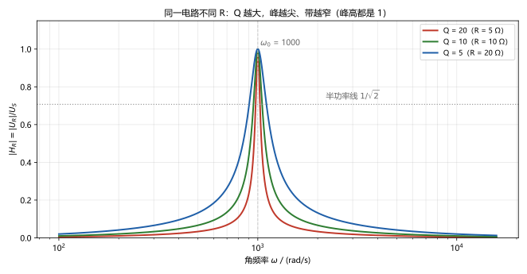
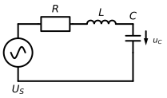
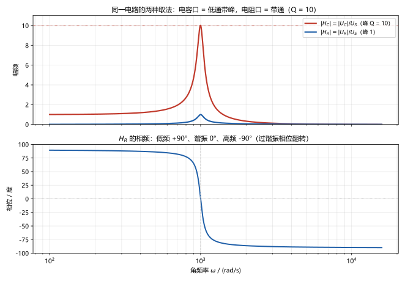

# 第 19 讲：电路的频率响应

> **前置**：13–15 讲（相量、阻抗、功率）｜ 09 讲（L/C 的伏安关系）
> **预计时间**：约 3.5 小时（含作业）
>
> **一句话定位**：把"频率"从背景参数请到聚光灯下——**网络函数** $H(\mathrm{j}\omega)$ 用一个复函数描述电路对**全部频率**的行为；**谐振**（resonance）是感抗与容抗互相抵消的戏剧时刻（电流最大或最小、电压或电流被放大 $Q$ 倍）；**品质因数** $Q$ 一句话同时管住"峰多尖"与"带多宽"。这是选频、滤波、收音机的全部底层机制。
>
> **本讲回答什么**：
> 1. 网络函数 $H(\mathrm{j}\omega)$ 是什么？凭什么"一个函数管全部频率"？
> 2. 谐振是什么？串联谐振为什么电流达到最大？并联谐振"电流最小"又是怎么回事？
> 3. 品质因数 $Q$ 在说什么？凭什么同时管"峰多尖"和"带多宽"？
> 4. 谐振是好事还是坏事？工程上为什么要提防过电压？
> 5. 低通、高通滤波器长什么样、拿什么搭？
> 6. Bode 图是什么、要学到什么程度？
>
> **数字出处**：本讲全部数值从 `scripts/lec19-01`（原理验证）与 `scripts/lec19-02`（作业预验证）复跑得到。主例：$R = 10\ \Omega$、$L = 100\ \mathrm{mH}$、$C = 10\ \mu\mathrm{F}$、$U_S = 10\ \mathrm{V}$。

## 本讲怎么走（脉络图）

```
引子：换一个频率重算一遍是体力活——算完"整个频率轴"才是一次性买卖
  │
  ├─ 1. 网络函数 H(jω)：幅频 + 相频；同一电路可以有不同"面孔"
  ├─ 2. 串联谐振：感抗与容抗大打出手然后抵消——电流最大的时刻
  ├─ 3. 品质因数 Q：三种身份（能量/放大/带宽）；并联谐振的对偶
  ├─ 4. 工程的谐振：过电压现场、该防该用
  ├─ 5. 滤波器与 Bode：低通/高通/带通；-3 dB 与 -20 dB/dec 两个标志
  └─ 6. 常见误区 → 小结 → 自测 → 作业
```

> 下一站：引子。先看"能做出什么"。

---

## 引子：把频率请上主舞台

到此为止，"频率"一直是背景参数：给一个 $\omega$，用 13 讲的相量法算一遍。问题来了——**换个频率，全部重算？** 如果电路的行为随频率变化（低频通路、高频断路……），那不是无穷多次体力活？

本讲第一件事就是把这个体力活变成一次买卖：**网络函数** $H(\mathrm{j}\omega)$ 一个公式打包全部频率的行为，画成一条**频率响应曲线**（图 2 就是）：



> **图 2 先睹为快**（细节后面展开）：同一电路只换电阻，曲线形状大变——$Q = 20$ 时峰又尖又窄，$Q = 5$ 时平缓宽阔。这座"山峰"的故事就是本讲：峰在哪里（谐振）、峰多高、峰多宽（$Q$ 说了算）。

还有一笔悬着的账：这个电路的谐振点上，**10 V 的电源会把电容电压顶到 100 V**——十倍过电压，怎么来的、怎么防，§2 和 §4 说清楚。

---

## 1. 网络函数：一个函数管全部频率

### 1.1 定义与"凭什么"

**网络函数**（network function）：正弦稳态下，**输出相量 ÷ 输入相量**，写成角频率的函数：

$$H(\mathrm{j}\omega) = \frac{\dot Y(\mathrm{j}\omega)}{\dot X(\mathrm{j}\omega)}$$

- 分子 $\dot Y$ 是某个输出的相量（某个元件的电压/电流），分母 $\dot X$ 是输入的相量；
- $H$ 是个**复数函数**：它的模是"该频率下的放大倍数"（**幅频特性**），辐角是"该频率下的相位移动"（**相频特性**）；
- 你说不出口"这幅图是干嘛的"？一句话：**横轴频率、纵轴放大倍数/相位，电路的"性格剖面图"**。

**"凭什么一个函数管全部频率"**——因为电路一旦给定，它就是一个**固定不变**的复数代数结构：对每个输入频率 $\omega$，"重新算一遍"用的方程骨架完全一样，只有 $\mathrm{j}\omega$ 在变。把"重新算一遍"的解写成 $\omega$ 的式子，就是 $H(\mathrm{j}\omega)$——**它不是技巧，是"把每个频率的答案并排放在一起"**。从相量法到网络函数，数学上只差一句"$\omega$ 是变量不是常数"。

### 1.2 老知识收编：阻抗就是一类网络函数

14 讲的阻抗 $Z(\mathrm{j}\omega) = \dot U/\dot I$——"电压相量 ÷ 电流相量"——正是一类网络函数（输出取电压、输入取电流）。所以函数这种"频率进、复数出"的写法你早就在用了；本讲只是把它推给**任意端口对**：**同一电路，取哪个元件做输出，就得到哪个网络函数**——面孔随端口而变（§5.3 的"两副面孔"就是现场）。

### 1.3 主例的第一个面孔：电阻口 $H_R$

图 1 的串联 RLC 电路（$R = 10\ \Omega$、$L = 100\ \mathrm{mH}$、$C = 10\ \mu\mathrm{F}$）：



取 $R$ 两端电压作输出（分压公式，14 讲照搬）：

$$H_R(\mathrm{j}\omega) = \frac{\dot U_R}{\dot U_S} = \frac{R}{R + \mathrm{j}(\omega L - \dfrac{1}{\omega C})} = \frac{\mathrm{j}\omega RC}{1 - \omega^2LC + \mathrm{j}\omega RC}$$

（等号右边只是把分子分母同乘 $\mathrm{j}\omega C$ 整理的结果，写代码算它更方便。）先手算两个频率点尝一口：

- **$\omega$ 很小**（如 $100$ rad/s）：容抗 $1/\omega C = 1000\ \Omega$ 巨大——电容像**断**的，电流几乎为零，$|H_R| \approx 0.02$；
- **$\omega$ 很大**（如 $10000$ rad/s）：感抗 $\omega L = 1000\ \Omega$ 巨大——电感像**断**的，$|H_R| \approx 0.02$；
- 中间某个频率，两种"抗"此消彼长——**总有一刻它们正好抵消**。那一刻就是谐振，是 §2 的整个舞台。

> 下一站：找到"抵消时刻"，看电流和电压各自发生什么。

---

## 2. 串联谐振

### 2.1 抵消时刻：$X(\omega)$ 过零

串联电路的阻抗（14 讲）：

$$Z(\mathrm{j}\omega) = R + \mathrm{j}X(\omega), \qquad X(\omega) = \omega L - \frac{1}{\omega C}$$

$X(\omega)$（叫**电抗**，reactance）随频率的行为一目了然：低频段 $1/\omega C$ 占上风，$X < 0$（**容性**）；高频段 $\omega L$ 占上风，$X > 0$（**感性**）；中间**必穿过零**——此刻：

$$\omega_0 L = \frac{1}{\omega_0 C} \quad\Longrightarrow\quad \omega_0 = \frac{1}{\sqrt{LC}}$$

$\omega_0$ 叫**谐振角频率**（resonant angular frequency）——串联电路在这一刻"电抗清零"，$Z = R$，**纯电阻**。主例：$\omega_0 = 1/\sqrt{0.1 \times 10^{-5}} = 1000$ rad/s（实跑扫频峰位置 999.95 rad/s，与解析一致）。

### 2.2 谐振时刻的账本

在 $\omega_0$ 上，这个电路有三笔"戏剧账"（全部实跑核对）：

1. **阻抗最小**：$Z = R = 10\ \Omega$——比任何其他频率都小（永远不低于 $R$）。于是**电流最大**：$I_0 = U_S/R = 1$ A（扫频峰值 1.0000）；
2. **电感电压与电容电压幅值相等**：$U_L = U_C = I_0 \cdot \omega_0 L = 1 \times 100 = 100\ \mathrm{V}$ ——**电源只有 10 V，电容和电感上却各挂着 100 V**！两个 100 V 在 KVL 里**相位相反、互相抵消**（相量相加时一正一负归零），只留 $U_R = 10$ V 对账。所以"电源电压"和"电容电压"可以差出一个极大的系数——这不是能量守恒被打破，是**两个储能元件之间的"电压接力"**；
3. **放大倍数 = 品质因数**：把第 2 条写成比例：

$$\frac{U_L}{U_S} = \frac{U_C}{U_S} = \frac{\omega_0 L}{R} = \frac{1}{\omega_0 C R} \equiv Q$$

**品质因数**（quality factor）$Q$ 就这么定义（串联口径）——主例 $Q = 100/10 = 10$，"10 V 进、100 V 出"就是这个 10 干的。

### 2.3 半功率点与通频带

谐振峰不是无限陡的，从峰顶降下来有个"半高线"。**功率**正比于 $|H|^2$，所以"功率减半"= $|H|$ 降到 $1/\sqrt{2} \approx 0.7071$——这两条线叫**半功率点**（half-power points），它们之间的频段叫**通频带**（bandwidth），带宽 $BW$。

对主例（$Q = 10$）实跑：

- 半功率点：数值 951.28 / 1051.25 rad/s（解析 951.25 / 1051.25——两条路互相咬着对上了）；
- $BW = 1051.25 - 951.25 = 100$ rad/s。

而 $100 = \omega_0/Q$——一个极简的关系露头了：**$BW = \omega_0/Q$**。它的机制到 §3.3 讲 $Q$ 的意义时一起说清，先把结论放这儿：**$Q$ 越大，峰越尖、带越窄**（图 2 的三条曲线分别 $Q = 20/10/5$，实跑带宽 49.9 / 100.0 / 199.8 rad/s）。顺带解释图 2 里为什么三条线峰高都是 1：那是 $H_R$（电阻口）——谐振时 $U_R = U_S$，放大倍数恰好 1；**峰高不变、宽度剧变**，这就是同一个 $Q$ 在"带宽"上的面孔。

> 下一站：$Q$ 到底是谁——三种身份一起亮牌。

---

## 3. 品质因数 Q 与并联谐振

### 3.1 Q 的三种身份

$Q$ 在 §2 只是"谐振时电压放大的倍数"。它其实有三个身份，三种身份互相印证——这是本讲最值得记住的一张牌：

1. **能量身份（定义来源）**：$Q = 2\pi \times \dfrac{\text{储能}}{\text{每周期的耗能}}$——"电路里攒的能量"与"每周期烧掉的能量"之比乘 $2\pi$。攒得多、烧得少，$Q$ 就大；对串联 RLC 一算（储能 $= \frac12 LI^2$ 量级、耗能 $= I^2R \cdot T$），就化为**计算身份**：

$$Q = \frac{\omega_0 L}{R} = \frac{1}{\omega_0 C R} \quad (\text{串联})$$

2. **放大身份**：$U_L = U_C = Q\,U_S$——谐振时储能元件上的电压是电源的 $Q$ 倍（§2.2）；
3. **选频身份**：$BW = \omega_0/Q$——峰的相对宽度由 $Q$ 一票决定（§2.3）。

**"凭什么同时管峰多尖和带多宽"**——它们是同一件事：半功率点恰好是"电抗增大到与电阻同量级"（$|X| = R$）的频率点；$Q = \omega_0 L/R$ 正比于"储能元件在 $\omega_0$ 处的抗"与 $R$ 的比值——**这个比值越大，'抗'赶上'阻'需要的频率偏离就越小**——于是峰又尖又窄。一个比值，两端表现。

主例账本一眼收齐：$Q = 10$ ↔ 100 V 过电压 ↔ $BW = 100$ rad/s——三个数字，一个 $Q$。

### 3.2 并联谐振：全部对偶

把同样三个元件改成**并联**（$R \parallel L \parallel C$，由电流源或电压源驱动）：

$$Y(\mathrm{j}\omega) = \frac{1}{R} + \mathrm{j}\left(\omega C - \frac{1}{\omega L}\right)$$

导纳虚部过零的位置还是 $\omega_0 = 1/\sqrt{LC}$（同式）——但这次是**导纳最小**，即 **$Z$ 最大**：$Z_{max} = R$。所以并联谐振的台词全和串联反过来（实跑主例，$R_p = 1\ \mathrm{k\Omega}$、同 $L$、$C$、$U_S = 10$ V）：

- **总电流最小**：$I_{总} = U/R_p = 10\ \mathrm{mA}$（阻抗最大 → 总电流最小——注意主语是"总电流"！）；
- **支路电流反而大**：电感支路 $I_L = U/(\omega_0 L) = 100\ \mathrm{mA}$，电容支路同样 100 mA——**支路电流是总电流的 $Q_p$ 倍**：$Q_p = R_p/(\omega_0 L) = 10$。两条支路的 100 mA 在回路内部**环流**（互相供给、不进不出电源），电源只负担 10 mA 的"维护费"——这是"并联谐振"最反直觉、也最容易考的点；
- 带宽公式不变：$BW = \omega_0/Q_p = 100$ rad/s。

### 3.3 串并联对照表

| | 串联谐振 | 并联谐振 |
|---|---|---|
| 谐振频率 | $\omega_0 = 1/\sqrt{LC}$ | 同式 |
| 谐振时阻抗 | **最小** $= R$ | **最大** $= R$ |
| 电流 | $I$ **最大**（$U_S/R$） | 总电流**最小**（$U_S/R$）；支路 $Q$ 倍过流 |
| 储能元件上的量 | $U_L = U_C = Q\,U_S$（过电压） | $I_L = I_C = Q\,I_{总}$（过流） |
| 品质因数（基本接法） | $Q = \omega_0 L/R$ | $Q = R/(\omega_0 L)$ |
| 带宽 | $BW = \omega_0/Q$ | 同式 |
| 典型用途 | 选频（串在信号通路里） | 选频（并在信号通路上，谐振时"阻塞"该频率） |

（"基本接法"强调一句：这里的 $Q$ 公式对应纯净的 $R$ 串/并模型；实际电感线圈自带电阻、电容自带损耗，题目会给等效模型，口径按模型走——认识层。）

> 下一站：这台"戏剧"搬到电力系统和收音机里，一个要防、一个要抢。

---

## 4. 工程的谐振：该防的与该抢的

### 4.1 过电压/过流：要防的那一半

§2 的 100 V 不是玩具：**真实电力系统**里，若某段线路的电感与补偿电容恰好在工频附近谐振，$Q$ 又高，过电压可以把设备绝缘击穿（或者并联谐振的环流把线圈烧掉）——电力工程的重要课题（认识层：对策是躲开谐振点、加阻尼、控制运行方式）。

要防得住，先得判得"清"：

1. 先数清电路里有没有 L 和 C 同时上场（只有 L 或只有 C，无谐振可言）；
2. 算 $\omega_0$ 与实际工作频率的距离——离得远就基本安全；
3. 记住放大倍数就是 $Q$：估算过电压/过流的上限（对数感电阻的比值要敏感）。

### 4.2 选频：要抢的那一半

**收音机**是最经典的"抢"：空气中无数电台的信号同时进入天线，靠一只可调谐振回路（通常改变 $C$）**选出要听的那个频率**——谐振时它最强（$Q$ 越高选择性越好：邻台压得越干净）；这正是作业 Q7 让你设计的接收机前端。

一句话总账：**谐振不是好坏，是"匹配用途"**——要选频就做尖（高 $Q$），要平坦就做钝（低 $Q$ 或不谐振）；要防过压就远离谐振点。

> 下一站：把"选频"一般化——滤波器家族。

---

## 5. 滤波器与 Bode：网络函数的主战场

### 5.1 滤波器的四种面孔

**滤波器**（filter）：让某些频率通过、另一些频率衰减的网络——它就"长"在网络函数的幅频图上，按形状分成四种：

| 类型 | $\lvert H\rvert$ 的形状 | 生活场景 |
|---|---|---|
| 低通（low-pass） | 低频 1、高频 0 | 音响"低音炮"分频、滤除高频噪声 |
| 高通（high-pass） | 低频 0、高频 1 | "高音头"分频、隔直流 |
| 带通（band-pass） | 中间一条"带" | 收音机选台、通信信道 |
| 带阻（band-stop） | 中间一条"沟" | 工频"陷波"（滤掉 50 Hz 干扰） |

### 5.2 一阶 RC：最小的滤波器

一个电阻一个电容就能滤波。**RC 低通**（输出取电容电压）：

$$H(\mathrm{j}\omega) = \frac{1}{1 + \mathrm{j}\omega RC}, \qquad \omega_c = \frac{1}{RC}$$

- **截止频率** $\omega_c$：$\omega \ll \omega_c$ 时 $|H| \approx 1$（全通）；$\omega \gg \omega_c$ 时 $|H| \approx \omega_c/\omega$（衰减）；$\omega = \omega_c$ 时 $|H| = 1/\sqrt{2}$（$-$3 dB 点，延续半功率的记号）；
- 主例（$R = 1\ \mathrm{k\Omega}$、$C = 100\ \mathrm{nF}$）：$\omega_c = 10^4$ rad/s。实跑：$\omega_c$ 处 $0.7071$；$10\omega_c$ 处 $0.0995$（≈1/10）；$100\omega_c$ 处 $0.0100$——**频率每升十倍，幅值降十倍**（$-20$ dB/十倍频程，实跑 $-19.96$ dB/dec）。

**RC 高通**（输出取电阻电压）恰是它的镜像：$H = \dfrac{\mathrm{j}\omega RC}{1 + \mathrm{j}\omega RC}$——低频被砍、高频全通。R 与 C 换个位置，低通变高通——这就是"拿什么搭"的最短回答：**分立元件随手搭**，不必芯片。

### 5.3 两副面孔：同一电路的两种输出

回到主例 RLC。同一电路，从不同端口取输出——拿到两张完全不同的"面孔"（图 3）：



> **图 3 怎么读**：上图两条曲线是同一电路的两个网络函数——$|H_C| = |U_C|/U_S$（电容口）：低频 $\approx 1$、谐振处冲到 $Q = 10$ 倍、高频衰减（**低通 + 谐振峰**）；$|H_R|$（电阻口）：两头趋零、谐振处恰好 1（**带通**）。下图是 $H_R$ 的相频：低频 $+90^\circ$（容性电流主导）、谐振 $0^\circ$、高频 $-90^\circ$——**过谐振点时相位翻转**（正负号换班）。

两个教材级的细节（认识层，能说出来更好）：

- $|H_C|$ 在 $\omega_0$ 处精确等于 $Q = 10$；**严格**的峰点其实略低一点（实跑 997.6 rad/s、峰高 10.0125——高 $Q$ 时几乎与 $\omega_0$ 重合，题目里按 $\omega_0$ 处取值就够）;
- "带通/低通"是**网络函数**的性质，不是电路的性质——同一个电路换个输出口就换性格，这就是 §1.2 那句"面孔随端口而变"。

### 5.4 Bode 图（认识层）

**Bode 图**（Bode plot）：横轴用对数频率、纵轴用**分贝**（decibel，dB：$20\log_{10}|H|$）画幅频（相频另画一张）的工程标准画法。需要到位的只有三个"锚点"：

1. $|H|$ 从 1 掉到 $1/\sqrt{2}$ $\Longleftrightarrow$ $-3$ dB（半功率，老朋友）；
2. 频率升十倍、幅值降十倍 $\Longleftrightarrow$ 斜率 $-20$ dB/十倍频程（一阶系统的标志；低通是 $-20$，高通是 $+20$，二阶是 $\pm 40$）；
3. 工程上用"折线近似"（先平后斜的拐折，拐点即 $\omega_c$）——知道有这回事，具体作图交给专业工具。

本课程的水平：**能读图说趋势、认得 $-3$ dB 与 $-20$ dB/dec 两个标志**即可；精确作图不作要求。

> 下一站：收尾——钉误区、做自测，然后作业。

> **态度表（频率响应部分）**
>
> | 内容 | 态度 |
> |---|---|
> | 网络函数定义与"一个函数管全部频率"的机制 | **能默写定义、能解释** |
> | $\omega_0 = 1/\sqrt{LC}$、$X(\omega)$ 过零图景 | **能默写、能画** |
> | 串联谐振三笔账（$Z$ 最小、$I$ 最大、$Q$ 倍过电压） | **能默写、能算** |
> | 半功率点、$BW = \omega_0/Q$ | **能默写、能算** |
> | Q 的三重身份 | **能复述三身份并互相印证** |
> | 并联谐振对偶（总电流最小、支路 $Q$ 倍） | **能默写、能算**（注意"谁最小"） |
> | 两种 Q 公式（串/并） | **能默写** |
> | RC 低通/高通、$\omega_c = 1/RC$、$-3$ dB | **能默写、能手算** |
> | Bode 两个锚点（$-3$ dB、$-20$ dB/dec） | 认识层：能读图说趋势 |
> | 过电压/过流与选频的工程判断 | **能说清楚"防什么、抢什么"** |

---

## 常见误区（本节零新知识，只破误）

> 每条都已在正文系统小节里教过；这里只做"对答案 + 校准"。

1. **"谐振时电路阻抗一定最小"**（§3.2）。片面。**串联**最小（$=R$），**并联**最大（$=R$）——先问拓扑再下结论。
2. **"谐振时各元件电压都不会超过电源电压"**（§2.2）。大错。$U_L = U_C = Q\,U_S$ 可以高一个数量级（主例 10 V → 100 V）——"过电压"就是这么来的。
3. **"并联谐振时电流很小，到处都小"**（§3.2）。反例现场。总电流最小（10 mA），**支路**电流是 $Q$ 倍（100 mA）——环流在内圈转，电源只买"维护票"。
4. **"$Q$ 是个形容词，不是数"**（§3.1）。$Q$ 是三合一的**数**：10 V→100 V 的倍数、$BW = \omega_0/Q$ 的比值、储能/耗能的口径——三个数字一票到底。
5. **"带宽与 $Q$ 没关系"**（§2.3、§3.1）。$BW = \omega_0/Q$——选频电路"尖不尖"就是 $Q$ 说了算。
6. **"滤波器要靠运放/芯片才做得出来"**（§5.2）。一只电阻加一只电容就是最简低通/高通——分立元件随手搭，效果朴素但原理全真。
7. **"谐振是好事（或坏事）"**（§4）。看用途：选频要抢（高 $Q$ 尖峰），电力设备要防（躲开谐振点、估过压）——它本身只是"感抗容抗抵消"这一物理事实。

---

## 本讲小结

一页纸的骨架（每条都能在正文与 AA_一览里找到细账）：

- **网络函数**：$H(\mathrm{j}\omega) = \dot Y/\dot X$——幅频 + 相频；"一个函数管全部频率"因为电路结构固定、只有 $\mathrm{j}\omega$ 在变；阻抗是它的一类；面孔随输出端口而变。
- **串联谐振**：$X = \omega L - 1/\omega C$ 过零 → $\omega_0 = 1/\sqrt{LC}$；$Z$ 最小 $=R$、$I$ 最大 $=U_S/R$、$U_L = U_C = Q U_S$（过电压）。
- **Q（串联）**：$Q = \omega_0L/R = 1/(\omega_0 CR)$；三身份：能量比、放大倍数、选频尖锐度。
- **半功率与带宽**：$|H| = 1/\sqrt{2}$ 两点之间；$BW = \omega_0/Q$；主例 951.25/1051.25、$BW = 100$。
- **并联谐振**：同 $\omega_0$；$Z$ 最大 $=R$、总电流最小、支路 $Q$ 倍环流；$Q_p = R/(\omega_0L)$。
- **工程判断**：过电压（串）与过流（并）要防；选频（收音机）要抢；放大上限就是 $Q$。
- **滤波器**：低通/高通/带通/带阻 = 网络函数的四种图形；RC 低通 $\omega_c = 1/RC$、$-3$ dB、$-20$ dB/dec；主例 $1\ \mathrm{k\Omega}$、$100\ \mathrm{nF} \to \omega_c = 10^4$。
- **两副面孔**：同一 RLC，$H_C$ 低通带峰（峰 $Q = 10$）、$H_R$ 带通（峰 1）与相频翻转。
- **实测合集**：扫频峰 999.95；三 Q 带宽 49.9/100.0/199.8；并联 $Z$ 峰 1000 Ω、10 mA/100 mA；$|H_C(\omega_0)| = 10$；RC 十倍频程 $-19.96$ dB；作业全预验证（$Q=2$ 例 780.8/1280.8、并联 500 Ω/20 mA/100 mA、接收机 1 nF/10 Ω）。

## 掌握度自测

- [ ] 我能定义网络函数并说清"一个函数管全部频率"的机制（一句话版本）。
- [ ] 我能从 $X(\omega)$ 过零推出 $\omega_0 = 1/\sqrt{LC}$，并画出容性—谐振—感性的三段图景。
- [ ] 我能默写串联谐振三笔账，并现场算出 $Q$ 倍过电压。
- [ ] 我能定义半功率点与通频带，并默写 $BW = \omega_0/Q$。
- [ ] 我能复述 $Q$ 的三重身份，并说出它们为什么是同一件事。
- [ ] 我能默写并联谐振的全部对偶台词，尤其"总电流最小、支路 $Q$ 倍"。
- [ ] 我能对串/并两种谐振现场判断"该防过压还是过流"。
- [ ] 我能写出 RC 低通/高通的 $H$ 与 $\omega_c$，手算 $-3$ dB 点。
- [ ] 我能说清"两副面孔"的来源（输出端口决定网络函数）。
- [ ] 我能读懂 Bode 图上的 $-3$ dB 与 $-20$ dB/dec；能复跑 `scripts/lec19-01`、`lec19-02` 解释每一个数字。

## 作业

> 答案只能用**已教概念**（本讲 + 13–15 讲、09 讲承接）。先独立做，再对答案。

### 基础

**Q1. 概念辨析**：判断对错，并给一句话理由。

(a) "谐振时电路的阻抗一定最小。"
(b) "串联谐振时各元件电压都不会超过电源电压。"
(c) "$Q$ 越大，谐振峰越尖、通频带越窄。"
(d) "网络函数 $H(\mathrm{j}\omega)$ 是专门为某一个频率算的。"
(e) "并联谐振时总电流最大。"

**参考答案**：

(a) 错。**串联**谐振阻抗最小（$=R$）、**并联**谐振阻抗最大（$=R$）——看拓扑。
(b) 错。$U_L = U_C = QU_S$ 可以远超电源电压（过电压）。
(c) 对。$BW = \omega_0/Q$——尖与窄是同一件事的两面。
(d) 错。$H(\mathrm{j}\omega)$ 是频率的函数——一个表达式管全部频率。
(e) 错。并联谐振**阻抗最大 → 总电流最小**（支路电流才是 $Q$ 倍大的那个）。
验算：五小题各回一个正文点：拓扑口径 / 过电压 / $BW$ 公式 / 定义 / 对偶。

**Q2. 计算·串联谐振参数**：串联电路 $L = 40$ mH、$C = 25\ \mu$F、$R = 20\ \Omega$。求 $\omega_0$、$Q$、$BW$。

**参考答案**：

$\omega_0 = 1/\sqrt{LC} = 1000$ rad/s；$Q = \omega_0L/R = 1000\times0.04/20 = 2$；$BW = \omega_0/Q = 500$ rad/s。
验算（脚本）：半功率点 780.8 / 1280.8，差恰为 $BW = 500.0$ ✓。

**Q3. 计算·谐振电压**：Q2 的电路接 $U_S = 10$ V 电压源。谐振时 $U_C$、$U_L$ 各是多少？

**参考答案**：

$U_C = U_L = QU_S = 2\times10 = 20$ V（电源 10 V，储能元件上 20 V——两倍过电压）。
验算：$I_0 = 10/20 = 0.5$ A；$U_L = I_0\omega_0L = 0.5\times40 = 20$ V ✓；再核 $U_C = I_0/(\omega_0C) = 0.5\times40 = 20$ V ✓（谐振时两条路必相等）。

**Q4. 计算·并联谐振**：并联电路 $R = 500\ \Omega$、$L = 100$ mH、$C = 10\ \mu$F，接 $U_S = 10$ V。求 $\omega_0$、$Q_p$、谐振时的总电流与支路电流。

**参考答案**：

$\omega_0 = 1000$ rad/s；$Q_p = R/(\omega_0L) = 500/100 = 5$；总电流 $= 10/500 = 20$ mA；支路电流 $= U_S/(\omega_0L) = 10/100 = 100$ mA $= Q_p\times I_{总}$。
验算（脚本）：$|Z|$ 峰 500 Ω、支路 100.0 mA ✓；$BW = \omega_0/Q_p = 200$ rad/s。

### 提高

**Q5. 概念+计算·两副面孔**：主例 RLC（$Q = 10$）：

(1) $|H_R(\omega_0)|$ 与 $|H_C(\omega_0)|$ 各是多少？分别是哪种滤波器形状？
(2) 为什么同一个电路会有两种形状？

**参考答案**：

(1) $|H_R(\omega_0)| = 1$（$U_R = U_S$，带通——两头趋零）；$|H_C(\omega_0)| = Q = 10$（低通带峰——低频趋 1、高频衰减）。
(2) 网络函数随**输出端口**而变：输出取电阻口，就是 $H_R$；取电容口，就是 $H_C$——电路没变、面孔变了。
验算（脚本）：$|H_R(\omega_0)| = 1.0000$、$|H_C(\omega_0)| = 10.0000$；$|H_C(0^+)| = 1.0000$（直流全通）✓。

**Q6. 计算·RC 低通**：$R = 1\ \mathrm{k\Omega}$、$C = 100$ nF 的 RC 低通：

(1) 求截止频率 $\omega_c$；
(2) 在 $\omega = 10\omega_c$ 处 $|H|$ 大约多少？
(3) 从 $10\omega_c$ 到 $100\omega_c$，幅值降多少 dB？

**参考答案**：

(1) $\omega_c = 1/(RC) = 10^4$ rad/s。
(2) $|H| \approx 1/\sqrt{1+100} \approx 0.0995 \approx 1/10$。
(3) $20\log_{10}(0.009995/0.0995) \approx -20$ dB（一阶系统标志性斜率）。
验算（脚本）：$|H(\omega_c)| = 0.7071$、$|H(10\omega_c)| = 0.0995$、斜率 $-20.0$ dB/dec ✓。

**Q7. 计算·选频设计（收音机前端）**：某接收机前端是串联谐振回路：$L = 1$ mH，要求 $\omega_0 = 10^6$ rad/s、$BW = 10^4$ rad/s。

(1) 需要多大电容？
(2) $Q$ 是多少？需要多大电阻？
(3) 如果 $Q$ 做到 200（更尖），$BW$ 变多少？有什么好处？

**参考答案**：

(1) $C = 1/(\omega_0^2 L) = 1/(10^{12}\times10^{-3}) = 1$ nF。
(2) $Q = \omega_0/BW = 100$；$R = \omega_0L/Q = 1000/100 = 10\ \Omega$。
(3) $BW = 10^6/200 = 5000$ rad/s——带宽更窄，**选择性更好**（邻台干扰压得更狠），但对元件精度、温漂更挑剔（工程取舍）。
验算（脚本）：C = 1 nF、R = 10 Ω、$\omega_0L = 1000\ \Omega$ 谐振时与容抗相消 ✓。

### 综合

**Q8. 开放·过电压场景分析**：一台实验台上的串联 RLC（主例：$R = 10\ \Omega$、$L = 100$ mH、$C = 10\ \mu$F），用 10 V 信号源供电，把电容换成了耐压 50 V 的型号。

(1) 在 $\omega = 1000$ rad/s 附近操作时会发生什么？为什么？
(2) 不改 $L$、$C$，最简单的"保命/保电容"改法是什么？改完 $Q$、$BW$、$U_C$ 各变多少？
(3) 如果场景反过来是"就是想利用这个高电压"（比如高压发生实验），你会怎么调？

**参考答案**（要点）：

(1) 谐振点（$\omega_0 = 1000$）处 $U_C = QU_S = 10\times10 = 100$ V——**超 50 V 耐压一倍**，电容有击穿/爆浆风险。
(2) 增大 $R$（如 $R = 100\ \Omega$）：$Q$ 降到 1，$U_C = Q U_S = 10$ V（安全）、$BW = \omega_0/Q$ 展宽到 1000 rad/s——代价是峰变钝（选频变差）。或者：离开 1000 rad/s 操作（躲开谐振区）。
(3) 想放大就**提高 $Q$**：减小 $R$（比如 $R = 1\ \Omega$，$Q = 100$，$U_C$ 上限 1000 V）——但要用耐压更高的电容，且明白"高 $Q$ 峰更窄"，信号频率必须稳在 $\omega_0$ 附近。
一句话：**$Q$ 是电压放大和选频的共同旋钮，也是过电压风险的旋钮**。
验算：回 §2.2、§3.1 与脚本数字（$Q = 10 \to 100$ V；$R$ 加十倍 → $Q = 1$）。

---

*下一讲预告：第 20 讲《非正弦周期电流电路》——现实世界的波形很少是漂亮的正弦：方波、整流波、开关电源的电流……傅里叶说"任意周期波都能拆成正弦堆"。凭什么？怎么拆？拆完凭什么能"分别算再合"？有效值与功率在谐波世界怎么算？这一讲把 13–14 讲的正弦稳态武器升级成"全场通吃"的形式。*