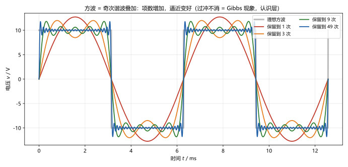
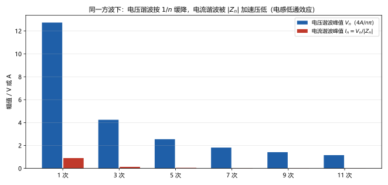
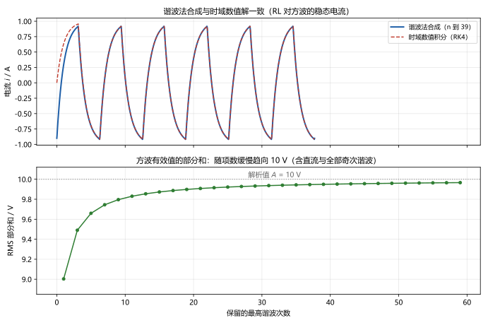

# 第 20 讲：非正弦周期电流电路

> **前置**：13–15 讲（相量、阻抗、功率）｜ 19 讲（频率响应）｜ 06 讲（叠加定理）
> **预计时间**：约 3.5 小时（含作业）
>
> **一句话定位**：现实里的周期波形大多不是正弦（整流波、方波、开关电源电流……）。**傅里叶级数**（Fourier series）把它们拆成"直流 + 各次谐波"，**谐波法**再对每一次谐波分别用相量法求解、最后按时域相加——13–19 讲的方法原样复用，只是要多算几次。有效值与功率则按"平方和"汇总。
>
> **本讲回答什么**：
> 1. 任意周期波真能拆成"直流 + 一堆正弦"？凭什么？
> 2. 拆完之后怎么"分别算再合起来"？为什么可以这样干？
> 3. 有效值、功率为什么不能拿其中某一项来算？按什么汇总？
> 4. 谐波是"噪音"吗？音箱说的"谐波失真"是这个吗？
> 5. 非周期信号呢？这套方法直接失效吗？
>
> **数字出处**：本讲全部数值从 `scripts/lec20-01`（原理验证）与 `scripts/lec20-02`（作业预验证）复跑得到。主例：方波源 $A = 10\ \mathrm{V}$、基波角频率 $\omega_1 = 1000$ rad/s，接 $R = 10\ \Omega$、$L = 10\ \mathrm{mH}$。

## 本讲怎么走（脉络图）

```
引子：现实波形很少是正弦——难道每种波形都要单独发明一套方法？
  │
  ├─ 1. 傅里叶级数：周期波 = 直流 + 各次谐波；对称性决定保留哪些项
  ├─ 2. 谐波法：每次谐波独立相量求解，最后回到时域相加
  ├─ 3. 有效值与平均功率：平方和开方、各次功率直接相加
  ├─ 4. 边界与预告：周期前提、线性前提——非周期轮到拉普拉斯
  └─ 5. 谐波与工程：来源、危害、谐波谐振、THD（认识层）
  → 常见误区 → 小结 → 自测 → 作业
```

> 下一站：引子。先看"能做出什么"。

---

## 引子：波形不是正弦怎么办

到这一讲为止，所有正弦稳态方法都默认激励是**单一频率的正弦**。但现实里：整流器输出的脉动波形、数字电路里的方波、开关电源的尖峰电流……按老路，每种波形都要重新解微分方程，不现实。

解决办法是一次"拆解"：**任何周期波形都能写成"直流 + 基波 + 各次谐波"的正弦叠加**（傅里叶级数）。之后每一份正弦各用相量法算一遍（13–19 讲的方法全部可用），最后把各份的结果在时域相加。先看两个"成品"：

- **拆**：幅值 $A = 10$ V 的方波 $=$ $(40/\pi)\left[\sin\omega_1 t + \frac{1}{3}\sin 3\omega_1 t + \frac{1}{5}\sin 5\omega_1 t + \cdots\right]$（只有奇次项——原因在 §1.3）；
- **算**：这个方波接在 $R = 10\ \Omega$、$L = 10\ \mathrm{mH}$ 上，谐波法给出基波电流 $0.6366\angle-45^\circ$ A、三次谐波 $0.0949\angle-71.57^\circ$ A……合成后有效值 0.6451 A、功率 4.1612 W——与"直接对时域波形数值积分"的结果 **4.1616 W** 吻合。

---

## 1. 傅里叶级数：把周期波拆成正弦

### 1.1 结论与"凭什么"

**傅里叶级数**（Fourier series）：任何满足常规条件的周期函数 $f(t)$（周期 $T$、角频率 $\omega_1 = 2\pi/T$）都可以写成

$$f(t) = \frac{a_0}{2} + \sum_{n=1}^{\infty}\left[a_n\cos(n\omega_1 t) + b_n\sin(n\omega_1 t)\right]$$

- $a_0/2$ 是**直流分量**（一个周期内的平均值）；
- $n = 1$ 的项叫**基波**（fundamental，频率 $\omega_1$）；$n \ge 2$ 的叫**谐波**（harmonic，第 $n$ 次谐波频率为 $n\omega_1$）；
- 系数由积分求得（把 $f$ 向各"正弦基"上投影）：

$$a_n = \frac{2}{T}\int_0^T f(t)\cos(n\omega_1 t)\,\mathrm{d}t, \qquad
b_n = \frac{2}{T}\int_0^T f(t)\sin(n\omega_1 t)\,\mathrm{d}t$$

**凭什么能这样拆**——**正交性**（orthogonality）：不同次数的正弦、余弦（包括与常值 1）在一个周期上的**乘积之积分为零**。这件事让每个 $a_n$、$b_n$ 都能被单独求出、互不干扰（正交积分把其他频率的贡献整个消掉）；也正因为它，后面的"有效值平方和""功率相加"才有依据（§3 两处都会用到）。正交性是整套方法的数学地基，认识层记住"不同频率的正弦互不打扰"即可。

### 1.2 主例：方波的展开怎么来

以奇函数方波（幅值 $A$、周期 $T$，前半周期 $+A$、后半周期 $-A$）为例，代入系数积分：

- $a_0 = 0$（正负对称，平均为零）、$a_n = 0$（奇函数）；只留 $b_n$；
- $b_n = \frac{2}{T}\int_0^{T/2}A\sin(n\omega_1 t)\,\mathrm{d}t\cdot 2 = \frac{4A}{n\pi}$（$n$ 为奇数；偶数项相互抵消）。

于是

$$v(t) = \frac{4A}{\pi}\left[\sin\omega_1 t + \frac{1}{3}\sin 3\omega_1 t + \frac{1}{5}\sin 5\omega_1 t + \cdots\right]
= \frac{4A}{\pi}\sum_{n\ \text{奇}}\frac{1}{n}\sin(n\omega_1 t)$$

主例 $A = 10$ V：基波峰值 $40/\pi = 12.732$ V、三次 $4.244$ V、五次 $2.546$ V——**谐波幅值按 $1/n$ 下降**。

### 1.3 对称性：先判断，再动手（省一半功夫）

动手积分前先看波形的对称性，能直接判定哪些项为零（标准判定手段）：

| 波形性质 | 判定 | 结果 |
|---|---|---|
| **偶函数** $f(-t) = f(t)$ | 关于纵轴对称 | 只含直流 + **余弦**项（$b_n = 0$） |
| **奇函数** $f(-t) = -f(t)$ | 关于原点对称 | 只含**正弦**项（$a_0 = 0$、$a_n = 0$） |
| **半波对称** $f(t + T/2) = -f(t)$ | 后半周期是前半周期的"取负复制" | 只含**奇次**谐波 |

方波、三角波都满足半波对称——所以它们的级数里没有偶次谐波。做题时先做这张表的判定，积分量立刻减半。

### 1.4 逼近效果与 Gibbs 现象

取有限项求和就是逼近（图 1）：项数越多、越贴近方波，但**跳变点附近的过冲永远不消失**（只压缩宽度）——这叫 **Gibbs 现象**（Gibbs phenomenon，认识层）。它对"有效值"的影响会随项数迅速减小（§3 数据），所以工程计算截断几项通常够用。



> **图 1 怎么读**：灰线是理想方波，四条彩线分别是保留到第 1、3、9、49 次谐波的叠加结果。看得见两件事：项数增加，波形整体贴合；每次都在跳变处留下无法消除的过冲（Gibbs）。

> 下一站：波形拆好了，接下来是"每次谐波各算一遍、最后相加"——谐波法。

---

## 2. 谐波法：分别算，再相加

### 2.1 为什么可以"分别算"

依据是 **06 讲的叠加定理**：电路是线性的，激励里每个频率分量"各自独立地"产生一份响应，总响应是各份之和。关键细节只有一条：

> **相量不能跨频率相加。** 相量法（13 讲）只对**同一频率**的正弦有效——两次谐波是不同频率，它们的相量摆在同一个复平面上没有意义。正确的做法：每次谐波**各自**用相量法算完，**回到时域**写成 $\sqrt{2}I_n\cos(n\omega_1 t + \varphi_n)$，再把这些时间函数相加。

### 2.2 操作流程（模板）

> **谐波法五步**：
> 1. **展开激励**：把非正弦激励写成傅里叶级数，按精度需要截断（通常保留到 3~5 次即可，看收敛与场合）；
> 2. **逐次建模**：对第 $n$ 次谐波（频率 $n\omega_1$），把元件换成相量形式——$R$ 不变、电感 $L \to \mathrm{j}n\omega_1 L$、电容 $C \to 1/(\mathrm{j}n\omega_1 C)$；
> 3. **逐次求解**：每一频率下用 13–19 讲的任意方法（KVL/KCL、结点法、戴维南、甚至 19 讲的网络函数 $H(\mathrm{j}n\omega_1)$）求出该次谐波的响应相量；
> 4. **回到时域**：把每个响应相量写成瞬时式（有效值相量乘以 $\sqrt{2}$、补上对应频率），**时域相加**；
> 5. **汇总核对**：有效值与功率按 §3 的平方和公式汇总；必要时与数值积分对照。

### 2.3 运行例：方波接 RL 电路

主例：$A = 10$ V 的方波（$\omega_1 = 1000$ rad/s）接到 $R = 10\ \Omega$、$L = 10\ \mathrm{mH}$ 的串联电路。**逐次谐波求解**（第 2 步和第 3 步）：

| 谐波 | 电压有效值 $V_n = \frac{4A}{n\pi\sqrt2}$ | 阻抗 $Z_n = 10 + \mathrm{j}n\cdot10$ | 电流有效值 | 电流相位 |
|---|---|---|---|---|
| 基波 $n=1$ | $9.003$ V | $14.142\angle 45^\circ\ \Omega$ | $0.6366$ A | $-45^\circ$ |
| 三次 $n=3$ | $3.001$ V | $31.623\angle 71.57^\circ\ \Omega$ | $0.0949$ A | $-71.57^\circ$ |
| 五次 $n=5$ | $1.801$ V | $50.990\angle 78.69^\circ\ \Omega$ | $0.0353$ A | $-78.69^\circ$ |
| 七次 $n=7$ | $1.286$ V | $70.711\angle 81.87^\circ\ \Omega$ | $0.0182$ A | $-81.87^\circ$ |
| 九次 $n=9$ | $1.000$ V | $90.554\angle 83.66^\circ\ \Omega$ | $0.0110$ A | $-83.66^\circ$ |

两条规律一眼可见（图 2）：



> **图 2 怎么读**：蓝条是电压各次谐波峰值（按 $1/n$ 缓降）；红条是电流各次谐波峰值。电流被 $|Z_n|$ 额外压低——电感阻抗随频率成正比上升（$n\omega_1 L$），高频谐波被"滤"得更狠（19 讲频响 $|H(\mathrm{j}n\omega_1)|$ 的直接应用）。

**回到时域相加**（第 4 步）：

$$i(t) = \sqrt{2}\left[0.6366\cos(\omega_1 t - 45^\circ) + 0.0949\cos(3\omega_1 t - 71.57^\circ) + 0.0353\cos(5\omega_1 t - 78.69^\circ) + \cdots\right]\ \mathrm{A}$$

（也可以写成正弦形式：第 $n$ 次谐波为 $\sqrt{2}I_n\sin(n\omega_1 t + \varphi_n')$，两种写法差 $90^\circ$ 参考，别混用。）图 3 上图把这串时域相加的结果与"直接对时域微分方程数值积分"的波形叠在一起——两条线几乎重合（稳态段最大偏差 0.0159 A，来自七次以上的截断）：



> **图 3 怎么读**：上图：谐波法合成（保留到 39 次）与时域数值积分（RK4）两条曲线几乎重合——**"分别算再相加"得到的就是真实响应**。下图：§3 的有效值部分和，随后展开。

> 下一站：算完响应，还要会"汇总"——有效值和功率的算法与单项情形不同。

---

## 3. 有效值与平均功率：都按"平方和"汇总

### 3.1 有效值

13 讲的有效值（RMS）定义对任何周期波形都成立：

$$U = \sqrt{\frac{1}{T}\int_0^T u^2(t)\,\mathrm{d}t}$$

把傅里叶级数代入再积分——**正交性保证所有交叉项的平均值为零**（不同频率的正弦乘积积分为零），只剩各项的平方：

$$\boxed{U = \sqrt{U_0^2 + U_1^2 + U_2^2 + \cdots}}$$

其中 $U_0$ 是直流分量，$U_1, U_2, \dots$ 是各次谐波的**有效值**。**根号下是平方和**——不是各次有效值的直接相加。

主例检验：方波（$A = 10$ V）的有效值解析地等于 $A$，来路一清二楚——

$$U^2 = \sum_{n\ \text{奇}}\frac{1}{2}\left(\frac{4A}{n\pi}\right)^2
= \frac{8A^2}{\pi^2}\sum_{n\ \text{奇}}\frac{1}{n^2}
= \frac{8A^2}{\pi^2}\cdot\frac{\pi^2}{8} = A^2$$

（用了奇数倒平方和 $\sum_{\text{奇}}1/n^2 = \pi^2/8$——一个标准级数结果，认识层。）即 $U = A = 10$ V。用有限项去逼近它（图 3 下图）：保留到第 1、3、5、9、49、199 次，部分和依次为 **9.003 / 9.490 / 9.660 / 9.796 / 9.959 / 9.990 V**——缓慢但确实趋向 10 V（收敛慢与 §1.4 的跳变是同一回事）。

对 RL 运行例，电流有效值同样按平方和：

$$I = \sqrt{0.6366^2 + 0.0949^2 + 0.0353^2 + 0.0182^2 + 0.0110^2 + \cdots} = 0.6451\ \mathrm{A}$$

（基波一项已经贡献了绝大部分——高次谐波被 $|Z_n|$ 压得很小。）

### 3.2 平均功率

平均功率同样按"各次分别算、再相加"——**正交性让不同次谐波的功率交叉项平均为零**：

$$\boxed{P = U_0I_0 + \sum_{n=1}^{\infty} U_nI_n\cos\varphi_n}$$

- $U_0I_0$：直流份的功率；
- $U_nI_n\cos\varphi_n$：第 $n$ 次谐波的有功（$\varphi_n$ 是**同一次**谐波电压与电流的相位差——每次谐波各自配对，不能混）；
- 只保留**同次**谐波配对：第 3 次谐波电压乘第 5 次谐波电流，平均功率为零（正交性）。

**一个必须点名的错误做法**：$P \ne U\cdot I$（总有效值相乘）。总有效值相乘只在"电压、电流各次同相"的极特殊情况才成立；一般情况下它没有任何物理含义。主例的对比很直接：

- 正确：$P = \sum I_n^2 R = 4.1612$ W；
- 错误做法：$U\cdot I = 10 \times 0.6451 = 6.451$ W——**大了 55%**，纯属虚构。

### 3.3 数值对照

把谐波法的汇总结果与"直接对时域波形积分"对照（图 3 上图的波形与下方的数据）：

| 方法 | 电流有效值 | 平均功率 |
|---|---|---|
| 谐波法（保留到 39 次） | $0.6451$ A | $4.1612$ W |
| 时域数值积分（RK4） | $0.6451$ A | $4.1616$ W |

两路吻合到四位——"分别算再相加"的汇总公式是对的，且截断到高次已经足够。

> 下一站：把边界划清——这套方法什么时候不能用。

---

## 4. 边界与预告：周期与线性两个前提

这套方法有两个前提，越界就失效：

1. **激励必须是周期的**。非周期信号（单个脉冲、指数衰减、有限长的波形）没有"频率 $n\omega_1$"可言——傅里叶级数失效。它的推广是**傅里叶变换**与更一般的 **拉普拉斯变换**（21–22 讲的主题）：把"离散的频率谱"换成"连续的频率域/复频域"。本讲只管周期；
2. **电路必须是线性的**。非线性元件（如二极管、饱和电感）会产生**新的频率**（非线性混频），"各次独立"的前提直接崩塌——那属于非线性电路，本课程不展开（认识层）。

另两条操作性的边界：**截断要看着量级办**（RL 例保留 3~5 次已经够；若电路在某次谐波附近有 19 讲那种谐振峰，对应次必须算准）；**跳变处 Gibbs 过冲**属于理想化模型的固有现象，测有效值时按平方积分它自动被削弱（§3.1 的部分和收敛就是证据）。

> 下一站：最后看一眼工程里谐波的真实面目——它是什么、怕什么、怕它什么。

---

## 5. 谐波与工程（认识层）

### 5.1 谐波从哪来

工频正弦被"弄脏"的常见来源：整流器/开关电源（非线性负载）、变频器、变压器铁心饱和（17 讲的非线性）、电弧炉等。它们的共同特征是：**非线性**——正弦进去、非正弦出来。

### 5.2 谐波的两个主要后果

1. **附加损耗与发热**：高次谐波在电机、变压器、导线里产生额外损耗（集肤效应、铁心损耗随频率升高）；
2. **谐波谐振**：若某次谐波频率 $n\omega_1$ 恰好落在电路的谐振频率附近（19 讲），那一次谐波会被放大 $Q$ 倍——电容器、补偿装置、输电线路都可能因它过电压或过电流。这是电力系统里"谐波治理"的直接理由；对策是躲开谐振点、加装滤波器（认识层）。

### 5.3 谐波含量与 THD

工程上用**总谐波畸变率**（total harmonic distortion，**THD**）量化"波形里谐波占多少"：

$$\mathrm{THD} = \frac{\sqrt{\sum_{n\ge2}U_n^2}}{U_1}\times100\%$$

主例方波：$\mathrm{THD} = \dfrac{\sqrt{10^2 - 9.003^2}}{9.003} = 48.3\%$（实跑 48.3%）——**几乎一半的能量在谐波里**，方波离正弦其实很远（§常见误区第 7 条的定量依据）。

### 5.4 两句澄清（答疑口径）

- **"谐波是噪音吗"**：不是。谐波是**有确定频率的周期成分**（波形形状的一部分），噪音是随机的；音响里的"谐波失真"指的是功放/扬声器的**非线性**额外生成了原信号里没有的谐波，使输出偏离输入的比例关系——"失真"是对"偏离正弦/偏离原状"的度量，不是谐波本身可恶；
- **"要学到什么程度"**：认识层——知道来源（非线性）、两个后果（损耗、谐振）、一个指标（THD），能读出"THD 大 = 波形离正弦远"即可；谐波治理的工程手段不在本课程范围。

> 下一站：收尾——钉误区、做自测，然后作业。

> **态度表（非正弦周期电流电路部分）**
>
> | 内容 | 态度 |
> |---|---|
> | 傅里叶级数的形式、各符号含义 | **能默写**；知道 $a_0/2$、$a_n$、$b_n$ 各是什么 |
> | 正交性的角色（"凭什么能拆"） | 能复述；知道它同时支撑了有效值与功率公式 |
> | 三种对称性判定（奇/偶/半波） | **能判、能省项** |
> | 方波展开式 | **能默写**（$4A/\pi\sum_{\text{奇}}\frac1n\sin n\omega_1 t$） |
> | 谐波法五步流程 | **背到能执行**；尤其"不能跨频相量相加" |
> | 有效值平方和公式 | **能默写、能算** |
> | 功率 $P = U_0I_0 + \sum U_nI_n\cos\varphi_n$ | **能默写、能算**；知道 $P \ne UI$ |
> | Gibbs 现象 | 认识层：知道过冲不消、对 RMS 影响随项数减小 |
> | 边界两个前提（周期、线性） | 能复述；知道非周期去 21/22 讲 |
> | 谐波工程（来源、后果、THD） | 认识层：能说清三点 |

---

## 常见误区（本节零新知识，只破误）

> 每条都已在正文系统小节里教过；这里只做"对答案 + 校准"。

1. **"非正弦周期量也可以写成一个相量"**（§2.1）。错。相量只代表单一频率的正弦；非正弦周期量要用"直流 + 各次谐波相量组"来表示。
2. **"各次谐波的相量可以直接相加"**（§2.1）。错。相量跨频率没有意义——必须各自回时域再相加。
3. **"有效值 = 各次谐波有效值之和"**（§3.1）。错。是**平方和开方**（$\sqrt{\sum U_n^2}$）；主例：方波基波 9.003 V，加三次后是 9.490 V（不是 9.003+3.001）。
4. **"平均功率 = 总电压有效值 × 总电流有效值 × cosφ"**（§3.2）。错。功率要**按次配对相加**；主例的错误做法算出 6.451 W，而正确值 4.1612 W。
5. **"'各次功率相加'是叠加定理的直接结果"**（§2.1、§3.2）。不准确。叠加定理管电压、电流；**功率能相加靠的是正交性**（交叉项平均为零）——两个理由不能混为一谈。
6. **"谐波就是噪音、就是要消除的干扰"**（§5.4）。错。谐波是有确定频率的周期成分；"失真"是对偏离正弦程度的度量。有些场合还要主动利用谐波（如倍频）。
7. **"方波只有奇次谐波，说明它差不多是正弦"**（§5.3）。错。奇次谐波仍有无穷多项、按 $1/n$ 缓降，方波的 THD = 48.3%——离正弦很远。

---

## 本讲小结

一页纸的骨架（每条都能在正文与 AA_一览里找到对应条目）：

- **傅里叶级数**：$f(t) = a_0/2 + \sum[a_n\cos n\omega_1 t + b_n\sin n\omega_1 t]$；系数由正交投影（积分）求得；**正交性**是"能拆、能汇总"的共同地基。
- **对称性判定**：偶 → 只余弦；奇 → 只正弦；半波对称 → 只奇次（方波、三角波）。
- **方波展开**：$v = \frac{4A}{\pi}\sum_{n\ \text{奇}}\frac1n\sin n\omega_1 t$；主例 $A=10$：12.732 / 4.244 / 2.546 V（$1/n$ 缓降）。
- **谐波法五步**：展开 → 逐次建模（$L \to \mathrm{j}n\omega_1 L$ 等）→ 逐次求解 → 回时域相加 → 汇总核对；**相量不能跨频相加**。
- **运行例（方波 + RL）**：基波 $0.6366\angle-45^\circ$、三次 $0.0949\angle-71.57^\circ$、五次 $0.0353\angle-78.69^\circ$ A；电流高次被 $|Z_n|$ 加速压低。
- **有效值**：$U = \sqrt{U_0^2 + \sum U_n^2}$；方波 $U = A = 10$ V（部分和 9.003→9.990 收敛）。
- **平均功率**：$P = U_0I_0 + \sum U_nI_n\cos\varphi_n$；**$P \ne UI$**（主例 4.1612 W vs 错误值 6.451 W）。
- **数值对照**：谐波法 0.6451 A / 4.1612 W 与时域积分 0.6451 A / 4.1616 W 吻合。
- **边界**：周期（非周期 → 21/22 拉普拉斯）、线性（非线性产生新频率）、截断看量级、Gibbs 认识层。
- **工程认识层**：谐波来源（非线性）、后果（损耗、谐振）、THD（方波 48.3%）；"谐波失真"的含义。

## 掌握度自测

- [ ] 我能默写傅里叶级数形式并说清每个符号与 $a_0/2$ 的含义。
- [ ] 我能用正交性解释"为什么能拆、为什么有效值和功率用平方和"。
- [ ] 我能对偶/奇/半波对称做判定并说出各自的省略项。
- [ ] 我能默写方波展开式并算出前几项幅值。
- [ ] 我能执行谐波法五步，且牢记"相量不能跨频相加"。
- [ ] 我能默写有效值平方和公式并用它算含直流与谐波的情况。
- [ ] 我能默写平均功率公式，并说清 $P \ne UI$ 为什么错、错多少（主例数字）。
- [ ] 我能复述两个前提（周期、线性）与越界后的去向。
- [ ] 我能说清谐波的来源、两个后果与 THD 的定义。
- [ ] 我能复跑 `scripts/lec20-01`、`lec20-02` 并解释每个数字（含时域对照）。

## 作业

> 答案只能用**已教概念**（本讲 + 06、13–19 讲承接）。先独立做，再对答案。

### 基础

**Q1. 概念辨析**：判断对错，并给一句话理由。

(a) "非正弦周期电压可以用一个相量来代表。"
(b) "各次谐波的有功功率可以直接相加得到总平均功率。"
(c) "非正弦周期量的有效值等于各次谐波有效值之和。"
(d) "满足半波对称的波形只含奇次谐波。"
(e) "把各次谐波分别算出的响应相量直接相加就得到总响应。"

**参考答案**：

(a) 错。相量只代表单一频率的正弦；非正弦量要用直流 + 各次谐波相量组表示。
(b) 对。正交性使不同次谐波的功率交叉项平均为零，故各次有功直接相加。
(c) 错。是平方和开方：$U = \sqrt{U_0^2 + \sum U_n^2}$。
(d) 对。半波对称 $f(t+T/2) = -f(t)$ 使偶次项相互抵消。
(e) 错。相量不能跨频率相加——各自回时域写成瞬时式再相加。
验算：五小题各回正文点：§2.1 / §3.2 / §3.1 / §1.3 / §2.1。

**Q2. 计算·有效值**：$u(t) = 20 + 30\cos\omega t + 40\cos 3\omega t$ V，求有效值 $U$。

**参考答案**：

$U = \sqrt{20^2 + \frac{30^2}{2} + \frac{40^2}{2}} = \sqrt{400+450+800} = \sqrt{1650} \approx 40.62$ V。
验算（脚本）：$\sqrt{1650} = 40.62$；注意各次余弦的有效值是峰值 $/\sqrt2$。

**Q3. 计算·方波展开**：幅值 $A = 5$ V 的方波，写出前三项，并计算"保留前两项"的有效值。

**参考答案**：

$v = \frac{20}{\pi}\left[\sin\omega_1 t + \frac13\sin3\omega_1 t + \frac15\sin5\omega_1 t + \cdots\right]$，前三项峰值 6.366 / 2.122 / 1.273 V。
前两项有效值：$\sqrt{(6.366^2 + 2.122^2)/2} = 4.745$ V（解析值 $A = 5$，还差一些——收敛慢）。
验算（脚本）：4.745 V ✓。

### 提高

**Q4. 计算·谐波法**：方波 $A = 10$ V、$\omega_1 = 1000$ rad/s 接 $R = 10\ \Omega$、$L = 20$ mH 串联。用谐波法求基波与三次谐波电流（有效值相量）。

**参考答案**：

基波：$V_1 = 9.003$ V，$Z_1 = 10 + \mathrm{j}20 = 22.361\angle63.44^\circ$ → $\dot I_1 = 0.4026\angle-63.44^\circ$ A。
三次：$V_3 = 3.001$ V，$Z_3 = 10 + \mathrm{j}60 = 60.828\angle80.54^\circ$ → $\dot I_3 = 0.0493\angle-80.54^\circ$ A。
验算（脚本）：$|Z_1| = 22.361$、$|Z_3| = 60.828$ ✓。

**Q5. 计算·功率与错误做法对照**：用 Q4 的结果（并补算五次及以上）求电流有效值与电阻上的平均功率；再算"总有效值相乘" $U\cdot I$ 作对照。

**参考答案**：

补算：$\dot I_5 = 0.0179\angle-84.29^\circ$ A（$|Z_5| = 100.499$）。
$I = \sqrt{0.4026^2 + 0.0493^2 + 0.0179^2 + \cdots} = 0.4062$ A；
$P = \sum I_n^2R = 1.6502$ W。
错误对照：$U\cdot I = 10 \times 0.4062 = 4.0622$ W——差不多少算了两倍多，纯属虚构（电压电流不同相、且各次相位差不同）。
验算（脚本）：0.4062 A / 1.6502 W / 4.0622 W ✓。

### 综合

**Q6. 概念·为什么功率能相加**：用正交性解释"各次谐波的有功可以相加"，并说明为什么同样的理由**不能**用来支持"电压有效值相加"。

**参考答案**：

不同次谐波的电压、电流乘积（如 $u_3 i_5$）在一个周期上的平均值为零（正交性）——所以总平均功率只剩"同次配对"项之和。至于有效值：平方后 $u^2 = (\sum u_n)^2$ 展开的交叉项 $2u_mu_n$ 平均值也为零（同一正交性），所以结果是**各项平方之和**（再开方）——即平方和，而不是各项直接相加。两个结论来自同一条正交性，但一个是"和"（功率），一个是"平方和开方"（有效值）。
验算：回 §3.1、§3.2 的推导与 §1.1 正交性。

**Q7. 计算·THD**：某电压含基波 $U_1 = 100$ V、三次 $U_3 = 30$ V、五次 $U_5 = 20$ V（有效值），其余谐波可忽略。求 THD。

**参考答案**：

$\mathrm{THD} = \dfrac{\sqrt{30^2 + 20^2}}{100} = \dfrac{\sqrt{1300}}{100} = 36.06\%$。
验算（脚本）：36.06% ✓。

**Q8. 开放·谐波谐振场景**：一个串联 RLC 电路（$R$ 很小、$\omega_0 = 3000$ rad/s）被方波（$\omega_1 = 1000$ rad/s）驱动。

(1) 哪一次谐波最危险？为什么？
(2) 用 19 讲的结论估计该次谐波电流的放大倍数；
(3) 工程上怎么想这个问题？

**参考答案**（要点）：

(1) 三次谐波（$3\omega_1 = 3000$ = 谐振频率）——它正落在谐振峰上；
(2) 该次谐波电流被放大 $Q = \omega_0L/R$ 倍（19 讲），电压源里它幅值只有基波的 $1/3$，但电流可能反超基波；
(3) 这就是"谐波谐振"的教科书场景：设计时要么躲开（选 $\omega_0$ 远离各次谐波频率），要么加阻尼/滤波；它与"谐振本身好坏"无关，是频率匹配问题。
验算：回 19 讲 §2.2（$Q$ 倍放大）与 §5.2（谐波谐振）。

---

*下一讲预告：第 21 讲《拉普拉斯变换与运算法》——时域的暂态（10–12 讲）与正弦稳态（13–20 讲）一直是两套方法，初值还要手工搬运。有没有一个统一的框，把初始条件、暂态、稳态、任意激励一次装下？"拉普拉斯变换"给出了答案：把微分方程变成代数方程、初值自动进方程、解完再变回来。s 是什么、和 $\mathrm{j}\omega$ 什么关系、部分分式怎么展开——下一讲系统解决。*