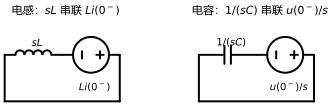
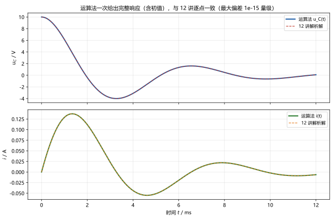
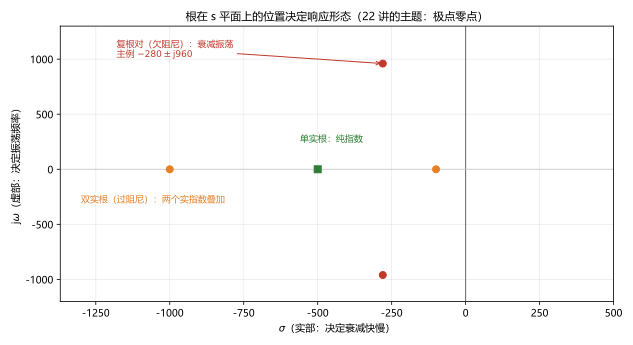

# 第 21 讲：拉普拉斯变换与运算法

> **前置**：10–12 讲（一阶/二阶时域解法）｜ 13–20 讲（相量法与正弦稳态）｜ 09 讲（L/C 伏安关系）
> **预计时间**：约 4 小时（含作业）
>
> **一句话定位**：到这里为止，电路的求解方法是"两套"：暂态用微分方程（一阶的指数、二阶的三种阻尼各有一套套路），正弦稳态用相量法。**拉普拉斯变换**（Laplace transform）把两者统一到同一个框架：微分方程变成代数方程、**初始条件自动进方程**、解完再变换回时域。它是本课程前期所有时域技巧的"总方法"。
>
> **本讲回答什么**：
> 1. 拉氏变换到底想干什么？为什么电路课非它不可？
> 2. $s$ 是什么东西？为什么说 $s = \mathrm{j}\omega$ 时它退化成相量法？
> 3. 电容、电感在 $s$ 域为什么会长出"附加源"？初值怎么自动进方程的？
> 4. 部分分式展开要学到什么程度？
> 5. 什么电路不能靠运算法？适用前提是什么？
>
> **数字出处**：本讲全部数值从 `scripts/lec21-01`（原理验证）与 `scripts/lec21-02`（作业预验证）复跑得到。主例：$R = 28\ \Omega$、$L = 50\ \mathrm{mH}$、$C = 20\ \mu\mathrm{F}$、$u_C(0^-) = 10$ V 的 RLC 放电（与 12 讲同一电路，用于对照）。

---

## 引子：两套方法，一个框架

回顾一下已学的求解手段：

- **10–12 讲（暂态）**：列微分方程，一阶用"三要素"，二阶按阻尼分三种情况定常数——每种情形一套手续，初值要单独"过桥"；
- **13–20 讲（正弦稳态）**：相量法——但**只对正弦激励有效**，还要假定"已经进入稳态"（初值的影响早已消失）。

如果激励既非正弦、又要看初值的影响（电路刚接通的一瞬间），两套方法都不顺手。**拉普拉斯变换**给出统一路径：

| 时域 | s 域 |
|---|---|
| 微分方程（含初值） | **代数方程** |
| 初值单独处理 | **自动出现在方程里** |
| 求解后定常数 | **逆变换一次得到完整响应**（暂态 + 稳态一起） |

成品预告：本讲会用**同一个 RLC 放电电路**（12 讲算过的那只：$R = 28\ \Omega$、$L = 50$ mH、$C = 20\ \mu$F、$u_C(0) = 10$ V）走一遍 s 域流程，最后得到 $i(t) = \frac{200}{960}e^{-280t}\sin 960t$ A——与 12 讲逐点一致（最大偏差 1e-15 量级），但**没有"按阻尼分三种情况"这一步，初值也没有单独搬运**。

---

## 1. 动机：它把什么变简单了

从一个最小的例子开始——RL 电路接直流源，且电感里有初始电流（10 讲/11 讲的题型）：

$$R i + L\frac{\mathrm{d}i}{\mathrm{d}t} = E, \qquad i(0^-) = i_0$$

经典做法：套"三要素"——先求稳态 $i(\infty) = E/R$，再用指数回落，写出 $i(t) = \frac{E}{R} + (i_0 - \frac{E}{R})e^{-t/\tau}$。管用，但**每一步都要知道自己在处理一阶电路**。

拉普拉斯变换的做法：把整个方程（**连同初值**）整体变换到 $s$ 域——

$$RI(s) + L\left[sI(s) - i(0^-)\right] = \frac{E}{s}
\quad\Longrightarrow\quad
I(s) = \frac{\dfrac{E}{s} + Li_0}{sL + R}$$

一个代数方程，解出 $I(s)$，再变换回时域就是答案。**微分不见了、初值在方程里、不需要预设"它是一阶还是二阶"**——这就是动机的全部。剩下的问题是三件事：这个变换是什么（§2）；电路元件在 $s$ 域长什么样（§3）；怎么变回去（§4 的部分分式）。

---

## 2. 定义与最小工具箱

### 2.1 单边拉普拉斯变换

对"$t \ge 0$ 才有定义"的信号（电路里正好如此），**单边拉普拉斯变换**定义为

$$F(s) = \int_{0^-}^{\infty} f(t)e^{-st}\,\mathrm{d}t, \qquad s = \sigma + \mathrm{j}\omega$$

- 积分下限取 $0^-$：刚好在换路**之前**——这是"初值自动进方程"的关键（§3.4 揭晓）；
- $s$ 是**复频率**：$\sigma$ 管"衰减/增长"，$\omega$ 管"振荡"——§2.4 会看到它就是相量频率 $\mathrm{j}\omega$ 的推广；
- 记号约定：本课程用 $f(t) \leftrightarrow F(s)$ 表示一对变换；大写字母对应 $s$ 域量（$i(t) \leftrightarrow I(s)$、$u(t) \leftrightarrow U(s)$）。

**范围声明**：本课程只需要"分段光滑且增长不过快"的信号能变换——电路中的实际信号都满足；收敛域（$\sigma$ 的取值范围）的数学讨论超出课程范围，认识层知道"每个 $F(s)$ 有对应的收敛条件"即可。

### 2.2 常用变换对（最小表）

| 时域 $f(t)$（$t \ge 0$） | $s$ 域 $F(s)$ |
|---|---|
| $\delta(t)$（单位冲激） | $1$ |
| $\varepsilon(t)$（单位阶跃） | $\dfrac{1}{s}$ |
| $t$ | $\dfrac{1}{s^2}$ |
| $e^{-at}$ | $\dfrac{1}{s+a}$ |
| $t\,e^{-at}$ | $\dfrac{1}{(s+a)^2}$ |
| $\cos\omega t$ | $\dfrac{s}{s^2+\omega^2}$ |
| $\sin\omega t$ | $\dfrac{\omega}{s^2+\omega^2}$ |

这张表加上后面三条性质，就能覆盖本课程的全部题目。实跑验证（把积分真的算一遍）：$e^{-2t}$ 在 $s=1$ 处的 $F(s)$——数值积分 $0.333333$ vs 公式 $1/(1+2) = 0.333333$（差 $5.6\times10^{-9}$，纯数值离散误差）；另三对同样吻合。

**一条重要对照**：$e^{-at} \leftrightarrow 1/(s+a)$——时域的**指数衰减**对应 $s$ 域**实极点** $s = -a$。衰减越快（$a$ 越大），极点在实轴上离原点越远。§4.3 会看到这就是"根的位置决定响应形态"的第一例。

### 2.3 性质最小集

**① 线性**：$af_1(t) + bf_2(t) \leftrightarrow aF_1(s) + bF_2(s)$——可以逐项变换、逐项求解（20 讲谐波法背后的同理）。

**② 微分（本讲的主要运算）**：

$$\frac{\mathrm{d}f}{\mathrm{d}t} \;\leftrightarrow\; sF(s) - f(0^-)$$

"求导"在 $s$ 域几乎变成"乘 $s$"——**多出来的一项 $-f(0^-)$ 就是初值的入口**。反复求导就反复冒初值：

$$\frac{\mathrm{d}^2f}{\mathrm{d}t^2} \;\leftrightarrow\; s^2F(s) - sf(0^-) - f'(0^-)$$

**③ 积分**：

$$\int_{0^-}^{t} f(\tau)\,\mathrm{d}\tau \;\leftrightarrow\; \frac{F(s)}{s}$$

（详见任何变换表；本课程用到的就是这三条。）

### 2.4 与相量的关系：$s = \mathrm{j}\omega$ 时它就"退回去"

把 $s$ 里的 $\sigma$ 取成 0（只保留振荡部分，不考虑衰减），即 $s = \mathrm{j}\omega$：

- 变换定义 $\int_0^\infty f(t)e^{-st}\mathrm{d}t$ 变成 $\int_0^\infty f(t)e^{-\mathrm{j}\omega t}\mathrm{d}t$——正是 13 讲相量的"幕后积分"；
- 微分性质从"乘 $s$"变成"乘 $\mathrm{j}\omega$"——13 讲的微分性质 $\mathrm{d}/\mathrm{d}t \leftrightarrow \mathrm{j}\omega$ 正是它的特例；
- 元件模型从 $sL$ 变成 $\mathrm{j}\omega L$、从 $1/(sC)$ 变成 $1/(\mathrm{j}\omega C)$——14 讲的元件相量模型正是它的特例。

**一句话**：相量法是拉普拉斯变换在"**正弦稳态、初值为零的稳态段**"上的特例（$s \to \mathrm{j}\omega$）；拉氏变换多了两样东西——**初值**（$f(0^-)$ 项）和**衰减/增长**（$\sigma \ne 0$ 的实部）。这也是为什么 22 讲以后用 $H(s)$ 讨论网络特性时，令 $s = \mathrm{j}\omega$ 就能拿回 19 讲的频率响应。

---

## 3. s 域元件模型：初值从这里进场

### 3.1 电阻

$u = Ri$ 是代数关系，直接变换：

$$U(s) = RI(s)$$

**形状不变**——这就是为什么 $s$ 域里"看起来像一张电阻电路"。

### 3.2 电感

时域 $u = L\frac{\mathrm{d}i}{\mathrm{d}t}$，用微分性质：

$$U(s) = L\left[sI(s) - i(0^-)\right] = sL\,I(s) - Li(0^-)$$

把它读成"**一个阻抗 $sL$ 与一个额外电压源串联**"（图 1 左）：

> **图 1 怎么读**：左格：电感的 $s$ 域模型 = 阻抗 $sL$ 串联一个附加电压源 $Li(0^-)$（初值成了"源"）；右格：电容的 $s$ 域模型 = 阻抗 $1/(sC)$ 串联一个附加电压源 $u(0^-)/s$。**方向按图中的极性约定**（附加源的正极与"原来的 $u$ 参考正端"对应）。

### 3.3 电容

时域 $i = C\frac{\mathrm{d}u}{\mathrm{d}t}$，变换：

$$I(s) = C\left[sU(s) - u(0^-)\right]
\quad\Longleftrightarrow\quad
U(s) = \frac{1}{sC}I(s) + \frac{u(0^-)}{s}$$

即"**阻抗 $1/(sC)$ 与附加电压源 $u(0^-)/s$ 串联**"（图 1 右）。

**两种等效形式**：附加源既可以画成**串联的电压源**（上面两式），也可以改写成**并联的电流源**形式（对节点法更方便）：

| 元件 | 串联电压源版 | 并联电流源版 |
|---|---|---|
| 电感 | $sL$ 串联 $Li(0^-)$ | $sL$ 并联 $i(0^-)/s$ |
| 电容 | $\dfrac{1}{sC}$ 串联 $\dfrac{u(0^-)}{s}$ | $\dfrac{1}{sC}$ 并联 $Cu(0^-)$ |

两版**对外等效**（端口伏安关系相同），按题目方便选——串联回路用电压源版、结点多的电路用电流源版（图只画了电压源版，并联版的公式就是上表）。

### 3.4 初值为什么"自动进方程"

回头看 §2.3 的微分性质：多的那一项 $-f(0^-)$ 是被积分下限 $0^-$ 逼出来的。推导顺序是：

1. 变换从 $0^-$ 开始积分——**恰好从换路前一刻起算**；
2. 微分性质把 $\mathrm{d}f/\mathrm{d}t$ 变成 $sF(s) - f(0^-)$——**初值以"减项"的形式出现**；
3. 移项后就变成元件模型里的**附加源**（电感的 $Li(0^-)$、电容的 $u(0^-)/s$）。

所以"初值自动进方程"不是什么额外规定，就是**积分下限的约定 + 微分性质**的组合效果。10 讲"换路定则 + 初始值过桥"的手工活，在 $s$ 域里被这一步替代了：**先算 $0^-$ 的初值（$u_C(0^-)$、$i_L(0^-)$，其余量不用管），写进附加源，剩下交给代数**。

---

## 4. 运算法：流程、部分分式与边界

### 4.1 运算法五步

$s$ 域模型建成后，电"路"变成了一张"**代数电阻电路**"——10 讲以前的所有手段（KCL/KVL、串并联、分压分流、结点法、戴维南）全部照用，只是每个数变成 $s$ 的有理式、每个元件换成上面的模型。流程：

> **运算法五步**：
> 1. **算初值**：换路前（$0^-$ 稳态）的 $u_C(0^-)$、$i_L(0^-)$——只这两个；
> 2. **画 $s$ 域模型**：$R \to R$、$L \to sL(+Li(0^-))$、$C \to 1/(sC)(+u(0^-)/s)$，激励也取变换（$E \to E/s$、正弦等查表）；
> 3. **解代数方程**：用任何熟悉的方法求目标量的 $U(s)$ 或 $I(s)$（先化成 $s$ 的有理分式）；
> 4. **部分分式展开**（§4.2）——把复杂分式拆成"查表就能变回去"的简单项之和；
> 5. **逆变换**：逐项查表，回时域得到完整响应（暂态 + 稳态一起）。

先跑**例子 A（RL，10 讲题型）**：$E = 10$ V、$R = 2\ \Omega$、$L = 1$ H、$i(0^-) = 2$ A：

$$I(s) = \frac{\dfrac{10}{s} + 1\cdot 2}{s\cdot 1 + 2} = \frac{10 + 2s}{s(s+2)} = \frac{5}{s} - \frac{3}{s+2}$$

逐项查表：$5/s \leftrightarrow 5$、$3/(s+2) \leftrightarrow 3e^{-2t}$，于是

$$i(t) = 5 - 3e^{-2t}\ \mathrm{A}$$

自检：$i(0^+) = 5-3 = 2$ ✓（初值对）；$i(\infty) = 5$ ✓（稳态 $E/R$）；$\left.\frac{\mathrm{d}i}{\mathrm{d}t}\right|_{0^+} = 6 = \frac{E - Ri(0^+)}{L}$ ✓（KVL 对）。——用三要素法本来也能得这个结果；运算法把它变成了"解代数方程 + 查表"，更实用的是：**它对二阶电路也不用换方法**：

**例子 B（RLC 放电，12 讲同一电路）**：$R = 28\ \Omega$、$L = 50$ mH、$C = 20\ \mu$F；$u_C(0^-) = 10$ V、$i_L(0^-) = 0$。第 1 步初值已知；第 2 步 $s$ 域：回路阻抗 $Z(s) = R + sL + \frac{1}{sC} = 28 + 0.05s + \frac{5\times10^4}{s}$，电容的附加源 $u_C(0^-)/s = 10/s$ 驱动回路（电感初值为零、无附加源）。第 3 步解出：

$$I(s) = \frac{u_C(0^-)/s}{Z(s)} = \frac{10/s}{28 + 0.05s + \dfrac{5\times10^4}{s}} = \frac{200}{s^2 + 560s + 10^6}$$

第 4 步：分母配方——$s^2+560s+10^6 = (s+280)^2 + 960^2$（$-280$ 与 $960$ 正是 12 讲的特征根 $\alpha$ 与 $\omega_d$）。对照变换对 $\dfrac{\omega}{(s+a)^2+\omega^2} \leftrightarrow e^{-at}\sin\omega t$：

$$i(t) = \frac{200}{960}e^{-280t}\sin 960t = 0.2083\,e^{-280t}\sin 960t\ \mathrm{A}$$

电容电压由 $U_C(s) = I(s)\,(R + sL)$ 得到（**注意：不要用"$I/(sC) + u(0^-)/s$"直接套——电流方向与电容参考方向相反时符号会错，用回路关系最稳；这是实跑中真实出过的一次错**）：

$$u_C(t) = e^{-280t}\left[10\cos 960t + \frac{2800}{960}\sin 960t\right] = e^{-280t}\left[10\cos 960t + 2.9167\sin 960t\right]\ \mathrm{V}$$

与 12 讲解析解对照：**逐点最大偏差 $i$ 为 $2.2\times10^{-16}$ A、$u_C$ 为 $2.7\times10^{-15}$ V**（机器精度）；与 RK4 数值积分对照：全程最大偏差 $1.0\times10^{-13}$（图 2）：

> **图 2 怎么读**：上图 $u_C(t)$、下图 $i(t)$：实线是运算法结果，虚线是 12 讲解析解——两条线完全重合。一次求解给出了完整的衰减振荡（初值、暂态、稳态全在其中）。

### 4.2 部分分式展开（逆变换的主要工具）

第 4 步之所以关键：**$s$ 域解总是 $s$ 的两个多项式之比**（有理分式），而查表只认少数简单形状。**部分分式展开**把它拆成简单项之和。分三种情形处理（设分式已化为**真分式**：分子次数 < 分母次数；**假分式先做多项式长除**）：

**① 分母全为单实根** $s_1, s_2, \dots, s_n$：设

$$F(s) = \sum_k \frac{K_k}{s - s_k}, \qquad \boxed{K_k = \big[(s-s_k)F(s)\big]_{s = s_k}}$$

（称"掩护法"：用手遮住因子 $(s-s_k)$，把 $s_k$ 代入剩下的部分。）**例**：

$$F(s) = \frac{3s+11}{(s+2)(s+3)} = \frac{5}{s+2} - \frac{2}{s+3}
\quad\Longrightarrow\quad
f(t) = 5e^{-2t} - 2e^{-3t}$$

**② 分母出现复根对**：用**配方法**凑成 $\dfrac{s+a}{(s+a)^2+\omega^2}$ 与 $\dfrac{\omega}{(s+a)^2+\omega^2}$ 的组合，直接查表得到 $e^{-at}\cos\omega t$、$e^{-at}\sin\omega t$。**例**（就是例子 B 的形式）：

$$F(s) = \frac{10}{s^2+6s+25} = \frac{10}{(s+3)^2 + 4^2} = \frac{10}{4}\cdot\frac{4}{(s+3)^2+4^2}
\quad\Longrightarrow\quad
f(t) = 2.5\,e^{-3t}\sin 4t$$

**③ 分母有重根**：单根公式要升级（多一项含 $1/(s+a)^2$ 的贡献），本课程**认识层**——考试以单根与复根为主，重根知道"拆项形式多一层"即可。

**假分式例**：$\dfrac{s^2+3s+3}{s+1}$ 先长除：

$$\frac{s^2+3s+3}{s+1} = s + 2 + \frac{1}{s+1}$$

商多项式 $s+2$ 对应冲激及其导数项（$-2\delta(t)$ 与 $\delta'(t)$ 一类；认识层，考试少涉及），余式项 $1/(s+1) \leftrightarrow e^{-t}$。

**一条省力惯例**：若分母是 $s$ 乘一个二次式（比如 $\frac{\text{常数}}{s(s^2+bs+c)}$），先把 $\frac{1}{s}$ 的系数用"终值法"提出来（$K_0 = \left.sF(s)\right|_{s=0}$，它就是响应的稳态值），再对余下的二次式配方法——两步都比硬拆快。

### 4.3 适用前提与边界

运算法不是"无限适用"，四条边界心里有数：

1. **线性时不变电路**——和 §2.3 的线性性质对应；非线性元件（二极管、饱和电感）不适用；
2. **单边变换只处理 $t \ge 0^-$ 之后的因果信号**——换路前的历史已经压缩进初值，**如果激励在 $t<0$ 就有复杂历史，要先算 $0^-$ 状态**（第 1 步的意义）；
3. **收敛域与"增长信号"**——工程信号都满足；理论上要求 $f(t)$ 的增长不超过指数级（认识层）；
4. **逆变换的可算性**——本课程的有理分式都能拆；非有理的 $F(s)$ 超出范围（认识层）。

**再补一条实用边界**：s 域解出的是**完整响应**（含暂态），如果题目只要正弦稳态，19–20 讲的方法更快——工具按题面选。

### 4.4 根的位置决定响应形态（22 讲预告）

回看两个例子：RL 的解 $5 - 3e^{-2t}$ 由**一个实根** $-2$ 支配；RLC 的解由**一对复根** $-280\pm\mathrm{j}960$ 支配（衰减振荡）。一般地说，$s$ 域解的**分母的根**（叫**极点**）位置已经把响应的形态限定住了（图 3）：

> **图 3 怎么读**：单实根（绿方块）→ 纯指数；双实根（橙圆）→ 两个指数叠加（过阻尼式）；复根对（红圆）→ 衰减振荡（欠阻尼式）。**实部越靠左衰减越快、虚部越大振荡越快**——22 讲将系统讨论"网络函数、极点零点与稳定性"：为什么"极点全在左半平面"就是稳定、$\mathrm{j}\omega$ 轴上取一点就是频率响应。

> **态度表（拉普拉斯变换与运算法部分）**
>
> | 内容 | 态度 |
> |---|---|
> | 变换定义、$s = \sigma + \mathrm{j}\omega$、单边/$0^-$ 约定 | 能默写、能解释风格 |
> | 常用变换对（表内七对） | **能默写**（尤其 $1/s$、$1/(s+a)$、两个三角函数对） |
> | 三条性质（线性、微分、积分） | **微分性质能默写并会用**（初值项！）；另两条会用 |
> | $s = \mathrm{j}\omega$ 与相量的关系 | **能说清**"相量是特例" |
> | s 域元件模型（含两种附加源形式） | **能默写、能画** |
> | 运算法五步 | **背到能执行**（$0^-$ 初值只取 $u_C$、$i_L$） |
> | 部分分式：单根掩护法、复根配方法 | **能算**；重根认识层 |
> | 假分式先长除 | 知道规则与"商项对应冲激" |
> | 适用边界四条 | 能复述 |
> | 极点位置与响应形态 | 认识层：能看图说出三类形态 |

---

## 常见误区（本节零新知识，只破误）

> 每条都已在正文系统小节里教过；这里只做"对答案 + 校准"。

1. **"拉普拉斯变换是纯数学工具，和电路关系不大"**（§1）。反了。它统一了本课程前 20 讲的时域求解（暂态 + 稳态一次算完），初值还自动进方程。
2. **"$s$ 就是 $\mathrm{j}\omega$，拉氏变换和相量法是一回事"**（§2.4）。不完整。相量是 $s = \mathrm{j}\omega$ 且初值为零、只看稳态的特例；$s$ 还有实部 $\sigma$ 管衰减/增长，微分性质还多出 $-f(0^-)$ 的初值项。
3. **"初值要靠三要素法那样的手工过桥搬进 s 域"**（§3.4）。错。$0^-$ 的 $u_C$、$i_L$ 直接写进附加源即可——积分下限 $0^-$ 加微分性质已经把它打包好了。
4. **"s 域模型里 $sL$、$1/(sC)$ 就是全部"**（§3.2、§3.3）。漏了**附加源**——有初值时，电感是"$sL$ 串联 $Li(0^-)$"、电容是"$1/(sC)$ 串联 $u(0^-)/s$"（或对应的并联流源版）。忘了附加源是最典型的错。
5. **"部分分式对任何分式都直接拆"**（§4.2）。错。**假分式（分子次数≥分母）必须先长除**；真分式才能直接拆。
6. **"运算法对非线性电路也照用"**（§4.3）。错。前置条件线性时不变；非线性元件不在适用范围内。
7. **"s 域里 t 的初值项可以随手丢"**（§4.1 例 B 的实跑记载）。危险。附加源的方向/符号错一点，整条响应就错——例 B 中 $u_C$ 若误用"$I/(sC) + u(0^-)/s$"会多出常数项 20（实跑中真错过一次），**用回路关系或分压关系交叉核对是可靠做法**。

---

## 本讲小结

一页纸的骨架（每条都能在正文与 AA_一览里找到对应条目）：

- **动机**：时域两套方法（暂态微分方程 / 正弦稳态相量）；拉氏变换一个框架统一——**微分方程 → 代数方程、初值自动进方程、一次得到完整响应**。
- **定义**：$F(s) = \int_{0^-}^{\infty} f(t)e^{-st}\mathrm{d}t$、$s = \sigma+\mathrm{j}\omega$；下限 $0^-$ 是初值的入口。
- **最小工具箱**：七对变换（$1/s$、$1/(s+a)$、$s/(s^2+\omega^2)$、$\omega/(s^2+\omega^2)$ 等）+ 三条性质（线性；**微分 $sF(s)-f(0^-)$**；积分 $F(s)/s$）。
- **与相量关系**：$s = \mathrm{j}\omega$ → 相量法；多出初值项与实部。
- **s 域元件模型**：$R$；$L \to sL + Li(0^-)$；$C \to 1/(sC) + u(0^-)/s$（另各有一版并联流源等效）。
- **运算法五步**：初值（只 $u_C$、$i_L$）→ 建模 → 解代数方程 → 部分分式 → 逆变换。
- **部分分式**：真分式三形态（单根掩护法 $K_k = [(s-s_k)F]_{s_k}$；复根配方法；重根认识层）；假分式先长除。
- **数值对照**：RL 例 $i = 5-3e^{-2t}$（三处自检全过）；RLC 例 $i = 0.2083e^{-280t}\sin960t$、$u_C = e^{-280t}(10\cos960t+2.9167\sin960t)$——与 12 讲偏差 $10^{-16}$ 量级、与 RK4 偏差 $10^{-13}$ 量级。
- **边界**：线性时不变、单边因果（$t<0$ 历史压缩进初值）、收敛域（认识层）、有理分式可拆。
- **预告（22 讲）**：极点在 s 平面的位置决定响应形态；左半平面 ↔ 稳定；$s=\mathrm{j}\omega$ ↔ 频率响应。

## 掌握度自测

- [ ] 我能说出"两套方法"各自的痛点，并解释拉氏变换如何一次解决。
- [ ] 我能默写变换定义、$s$ 的含义与 $0^-$ 下限的作用。
- [ ] 我能默写七对变换中的任意五对（含三角函数对）。
- [ ] 我能默写微分性质并说清初值项从哪来；随后写出 s 域元件模型。
- [ ] 我能说清"相量是 $s=\mathrm{j}\omega$ 的特例"（两处多的东西）。
- [ ] 我能背五步流程，并对含初值的一阶/二阶电路照做。
- [ ] 我能对单根、复根、假分式分别选对拆法（掩护法/配方法/先长除）。
- [ ] 我能用自己的话解释"初值自动进方程"（积分下限 + 微分性质）。
- [ ] 我能说出四条适用边界。
- [ ] 我能复跑 `scripts/lec21-01`、`lec21-02` 并解释每个数字（含与 12 讲的对照）。

## 作业

> 答案只能用**已教概念**（本讲 + 10–12、13–20 讲承接）。先独立做，再对答案。

### 基础

**Q1. 概念辨析**：判断对错，并给一句话理由。

(a) "拉普拉斯变换只对正弦激励有用。"
(b) "含初值电路的 s 域模型就是对每个元件乘上 $s$（或除以 $s$）。"
(c) "$s = \mathrm{j}\omega$ 时，拉氏变换退化成相量法。"
(d) "部分分式展开可以直接用于假分式。"
(e) "运算法解出的响应只有稳态部分。"

**参考答案**：

(a) 错。它适用于任意（可变换的）激励——正弦只是其中一类。
(b) 错。有初值时还要加**附加源**（$L \to sL + Li(0^-)$、$C \to 1/(sC) + u(0^-)/s$）。
(c) 对。令 $\sigma=0$ 即 $s=\mathrm{j}\omega$，微分性质变成 $\times\mathrm{j}\omega$、元件模型变成相量模型。
(d) 错。假分式（分子次数 ≥ 分母）要先长除化为真分式 + 多项式。
(e) 错。一次得到的是**完整响应**（暂态 + 稳态）。
验算：五小题各回正文点：§1 / §3.2–3.3 / §2.4 / §4.2 / §4.1。

**Q2. 查表计算**：写出 $e^{-3t}$、常数 $2$、$\cos 4t$ 的拉氏变换。

**参考答案**：

$e^{-3t} \leftrightarrow \dfrac{1}{s+3}$；$2 \leftrightarrow \dfrac{2}{s}$；$\cos 4t \leftrightarrow \dfrac{s}{s^2+16}$。
验算（脚本）：sympy 查表核对一致。

**Q3. 计算·RL 运算法**：$R = 4\ \Omega$、$L = 2$ H、直流源 $20$ V，$i(0^-) = 1$ A。用运算法求 $i(t)$。

**参考答案**：

$I(s) = \dfrac{20/s + 2\times1}{2s+4} = \dfrac{s+10}{s(s+2)} = \dfrac{5}{s} - \dfrac{4}{s+2}$ → $i(t) = 5 - 4e^{-2t}$ A。
自检：$i(0^+) = 1$ ✓；$i(\infty) = 5$ ✓；$i'(0^+) = 8 = (20-4)/2$ ✓。
验算（脚本）：三处自检全过。

**Q4. 建模·电容的 s 域模型**：写出电容带初值 $u(0^-)$、电流从正端流入时的 s 域**两种模型**（串联电压源版与并联电流源版）。

**参考答案**：

串联电压源版：$U(s) = \dfrac{1}{sC}I(s) + \dfrac{u(0^-)}{s}$（阻抗 $1/(sC)$ 串联压源 $u(0^-)/s$）。
并联电流源版：$U(s) = \dfrac{1}{sC}\left[I(s) + Cu(0^-)\right]$（阻抗 $1/(sC)$ 并联流源 $Cu(0^-)$）。
验算：两式展开相同 ✓；与图 1 右格对照。

### 提高

**Q5. 部分分式·单根**：展开 $F(s) = \dfrac{s+5}{(s+1)(s+3)}$ 并写出 $f(t)$。

**参考答案**：

$K_1 = \left.\dfrac{s+5}{s+3}\right|_{s=-1} = 2$；$K_2 = \left.\dfrac{s+5}{s+1}\right|_{s=-3} = -1$ → $F = \dfrac{2}{s+1} - \dfrac{1}{s+3}$ → $f(t) = 2e^{-t} - e^{-3t}$。
验算（脚本）：sympy 结果一致。

**Q6. 部分分式·双实根**：展开 $F(s) = \dfrac{100}{s^2+15s+50}$ 并写出 $f(t)$。

**参考答案**：

$s^2+15s+50 = (s+5)(s+10)$；$K_1 = \left.\dfrac{100}{s+10}\right|_{s=-5} = 20$；$K_2 = \left.\dfrac{100}{s+5}\right|_{s=-10} = -20$ → $f(t) = 20(e^{-5t} - e^{-10t})$（过阻尼式响应）。
验算（脚本）：sympy 一致 ✓。

**Q7. 部分分式·复根**：写出 $F(s) = \dfrac{10}{s^2+6s+25}$ 的逆变换。

**参考答案**：

配方：$s^2+6s+25 = (s+3)^2+4^2$ → $F = \dfrac{10}{4}\cdot\dfrac{4}{(s+3)^2+4^2}$ → $f(t) = 2.5e^{-3t}\sin 4t$。
验算（脚本）：sympy 逆变换 $= 2.5e^{-3t}\sin4t$ ✓。

### 综合

**Q8. 运算法与三要素法对照**：$R = 5\ \Omega$、$L = 1$ H、直流源 $10$ V，$i(0^-) = 4$ A。

(1) 用运算法求 $i(t)$；
(2) 用三要素法求 $i(t)$，并说明两法结果为何必然一致。

**参考答案**：

(1) $I(s) = \dfrac{10/s + 1\times4}{s+5} = \dfrac{10+4s}{s(s+5)} = \dfrac{2}{s} + \dfrac{2}{s+5}$ → $i(t) = 2 + 2e^{-5t}$ A。
(2) 三要素：$f(\infty) = 10/5 = 2$ A、$f(0^+) = 4$ A、$\tau = L/R = 0.2$ s → $i(t) = 2 + (4-2)e^{-5t} = 2 + 2e^{-5t}$ A，一致。
为什么必然一致：两者都在解同一个线性微分方程（加同一初值）——运算法在 $s$ 域解代数方程、三要素在时域套结构式，**数学上同解**；运算法不需要预先判断"一阶/二阶"，所以更容易推广。
验算（脚本）：$I(s)$ 部分分式与三要素结果一致 ✓。

---

*下一讲预告：第 22 讲《网络函数、极点零点与稳定性》——$s$ 域里最好用的不是"算出一个答案"，而是"一眼看出响应的形态"：网络函数 $H(s)$ 的极点在左半平面为什么就是稳定？零点和极点各自管什么？为什么令 $s = \mathrm{j}\omega$ 就回到 19 讲的频率响应、初值一变就得到 10–12 讲的暂态形态？把它们一次说清。*
