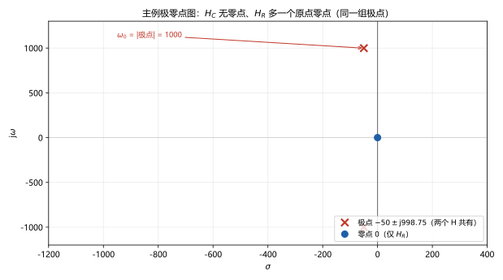
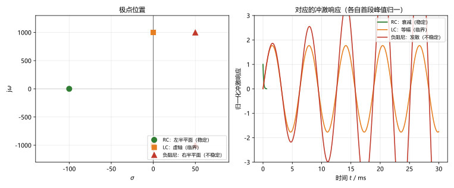
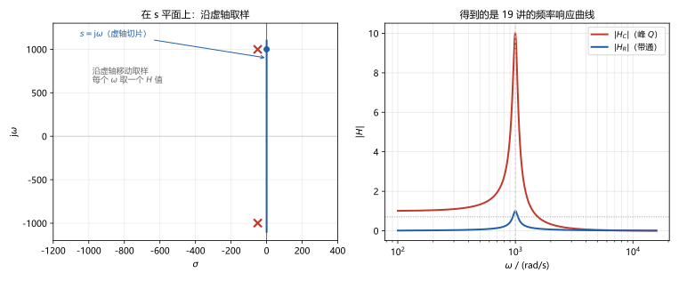

# 第 22 讲：网络函数、极点零点与稳定性

> **前置**：21 讲（拉普拉斯变换与运算法）｜ 19 讲（频率响应）｜ 12 讲（二阶电路）
> **预计时间**：约 3.5 小时（含作业）
>
> **一句话定位**：21 讲已经能"算出一个响应"，但**网络函数** $H(s)$ 的价值不在算，而在**看**：它的**极点**（分母的根）写出电路的固有频率与衰减/增长，决定**稳定性**与响应形态；**零点**（分子的根）决定哪些频率被抑制；沿虚轴取值 $s = \mathrm{j}\omega$ 就是 19 讲的频率响应。这一讲把 12、19、21 三个讲次的线索合成一张极零点图。
>
> **本讲回答什么**：
> 1. 极点零点是什么、在哪？凭什么说它们"决定一切"？
> 2. 极点在左半平面 = 稳定——这句话到底在说什么？
> 3. 冲激响应和 $H(s)$ 是一对？谁决定谁？
> 4. 极点零点是电路的固有属性，还是输入信号的属性？
> 5. 频响曲线和极点零点位置怎么对上号？
> 6. 稳定性判断要学到什么程度？
>
> **数字出处**：本讲全部数值从 `scripts/lec22-01`（原理验证）与 `scripts/lec22-02`（作业预验证）复跑得到。主例沿用 19 讲 RLC：$R = 10\ \Omega$、$L = 100\ \mathrm{mH}$、$C = 10\ \mu\mathrm{F}$（$\omega_0 = 1000$、$Q = 10$）。

## 本讲怎么走（脉络图）

```
引子：既然运算法什么都能算，网络函数是不是多余的？
  │
  ├─ 1. 网络函数与极点零点：H(s) = N(s)/D(s)；极点管形态、零点管抑制
  ├─ 2. 冲激响应与稳定性：h(t) 与 H(s) 是一对；极点实部定性质
  ├─ 3. 与频响的关系：s = jω 切片 → 19 讲的曲线；极零点靠近虚轴的意义
  └─ 4. 稳定性判断学到什么程度（认识层）+ 工程出口
  → 常见误区 → 小结 → 自测 → 作业
```

> 下一站：引子。先看"看"比"算"多给出什么。

---

## 引子：从"算一个响应"到"看完整个电路"

21 讲的运算法有一个"缺点"：**它回答的是具体问题**——给定输入和初值，算出一条响应。换一个输入，全部重算。如果想知道"**这个电路对任何输入会怎么表现**"，难道要穷举？

不必。线路是线性时不变的，它的全部行为被**一个函数**打包了：**网络函数** $H(s)$。它的分子分母的根（**零点与极点**）给出两组信息：

- **极点**（分母的根）：电路的固有频率——决定响应"长什么样"（指数/振荡/发散）和**稳定与否**；
- **零点**（分子的根）：被**抑制**的频率——决定各项权重和"哪里会出现凹陷"。

先看两个预告数字（全部实跑）：主例 RLC 的极点是 $-50 \pm \mathrm{j}998.75$——它的**模恰好是 1000**，就是 19 讲的谐振频率 $\omega_0$；而把电阻换成"负阻尼"后，极点跑到 $+50 \pm \mathrm{j}998.75$（实部变正），冲激响应就**从衰减振荡变成发散振荡**——同一张图（极零点图）上一目了然。

---

## 1. 网络函数与极点零点

### 1.1 从 $H(\mathrm{j}\omega)$ 到 $H(s)$

19 讲的网络函数 $H(\mathrm{j}\omega)$ 是"沿虚轴取值"的稳态切片；在 $s$ 域里把它推广成完整定义（零初值下）：

$$H(s) = \frac{Y(s)}{X(s)} = \frac{b_ms^m + \cdots + b_1s + b_0}{a_ns^n + \cdots + a_1s + a_0} = \frac{N(s)}{D(s)}$$

- $X(s)$、$Y(s)$ 是输入、输出的拉氏变换（**零初值约定**：初值不算网络函数的成分）；
- 对线性时不变电路，$H(s)$ 总是**有理分式**（两个多项式之比）——分子次数 $m$、分母次数 $n$ 由电路结构定。

### 1.2 极点与零点：两组根

$$H(s) = \frac{N(s)}{D(s)} \quad\Longrightarrow\quad
\begin{cases}
\textbf{零点：} N(s) = 0 \text{ 的根（}H = 0\text{）}\\
\textbf{极点：} D(s) = 0 \text{ 的根（}|H| \to \infty\text{）}
\end{cases}$$

主例（19 讲的两个输出端口，这次用 $s$ 域看）：

$$H_C(s) = \frac{U_C(s)}{U_S(s)} = \frac{10^6}{s^2 + 100s + 10^6}, \qquad
H_R(s) = \frac{U_R(s)}{U_S(s)} = \frac{100s}{s^2 + 100s + 10^6}$$

| 端口 | 零点 | 极点 |
|---|---|---|
| 电容口 $H_C$ | 无 | $-50 \pm \mathrm{j}998.75$ |
| 电阻口 $H_R$ | $0$ | $-50 \pm \mathrm{j}998.75$ |

**同一组极点、差一个零点**——19 讲两个输出端口的差异终于在 s 域定位了：$H_R$ 多出的**原点零点**正好解释"直流不通过"（直流下电容开路、回路无电流、电阻上无电压 → $H_R(0) = 0$ ✓）；$H_C$ 无零点，直流全通（$H_C(0) = 1$ ✓）。

三个读图约定（图 1 的画法）：



> **图 1 怎么读**：s 平面上，**极点用 ×**、**零点用 ○**。红 × 是一对共轭极点（实部 $-50$、虚部 $\pm 998.75$）；蓝 ○ 是 $H_R$ 的原点零点。虚轴（$\sigma = 0$）是"正弦稳态"的取样线（§3 用）。

- 极/零点若是**复数**，必然**共轭成对**出现（真实电路的系数是实数）；
- 极点的**模** $|{-50 \pm \mathrm{j}998.75}| = 1000 = \omega_0$、**实部** $= -\alpha$、**虚部** $= \omega_d$——12 讲"二阶三件套"全在这对点里。

### 1.3 极零点是电路的固有属性

**它们与输入信号无关**——只由拓扑和元件参数决定。这是"固有"两个字的含义：换激励、换初值、甚至断开重接，只要电路本身不变，极零点就不变。

那"**决定一切**"又是怎么个决定法？两句话：

1. **任意输入下的响应都能由它算出**：$Y(s) = H(s)X(s)$——输入只是"乘"上去的因子；
2. **极点必然出现在响应里、零点不一定**：把 $H(s) = N(s)/D(s)$ 代入 $Y(s) = H(s)X(s)$，分母含 $D(s)$ 的因子——**无论输入是什么，极点对应的项都会出现在响应里**（形态由此固定）；而零点只影响各项的**系数**（权重）——某些输入组合下零点可能被抵消。

一句话：**极点管"形态与稳定"（衰减/振荡/发散），零点管"权重与抑制"（哪些频率被压掉）**。

> 下一站：把"形态与稳定"落到最简实验上——冲激响应。

---

## 2. 冲激响应与稳定性

### 2.1 冲激响应与 $H(s)$ 是一对

把输入取成单位冲激 $x(t) = \delta(t)$：$X(s) = 1$，于是

$$Y(s) = H(s)\cdot 1 = H(s)
\quad\Longrightarrow\quad
y(t) = h(t)$$

**冲激响应 $h(t)$ 就是 $H(s)$ 的时域身份**——一次"冲激实验"量出来的 $h(t)$，变换过去就是完整的 $H(s)$。反之，$H(s)$ 的部分分式每拆一项 $K_i/(s - p_i)$，就对应 $h(t)$ 里的一项 $K_i e^{p_i t}$：

$$h(t) = \sum_i K_i e^{p_i t} \qquad (\text{实极点})$$

**每一项的增/减由极点的实部决定**——这就是下一节所有结论的根源。主例实跑：$h(t) = 1001.25\,e^{-50t}\sin 998.75t$（极点 $-50 \pm \mathrm{j}998.75$ → 衰减的正弦；且 $h'(0^+) = 10^6$，与 $H(s)$ 的高频渐近 $s^2H(s) \to 10^6$ 对得上 ✓）。

### 2.2 极点的物理意义：固有频率

把 12 讲的语言翻译过来：

| 极零点图上的量 | 12 讲的对应 | 含义 |
|---|---|---|
| 极点（一对） | 特征根 $s_{1,2} = -\alpha \pm \mathrm{j}\omega_d$ | 电路"自己的"振荡模式 |
| $\lvert \text{极点}\rvert$ | $\omega_0$ | 谐振角频率（固有频率） |
| 实部 $-\alpha$ | 衰减系数 | 离虚轴越远、衰减越快 |
| 虚部 $\omega_d$ | 阻尼振荡频率 | 振荡快慢 |
| 实极点（单个） | 过阻尼的一支 | 纯指数 |

所以"放电时电路怎么动"由极点决定；外来的激励只负责"激起"它（决定各项权重）。

### 2.3 稳定性：极点实部定性质

**稳定性**（stability）的电路口径：**零输入（或冲激）响应随时间衰减到零**——电路不会自己越振越大。（严格定义叫"有界输入有界输出"（BIBO），对线性电路二者等价。）

由 §2.1 的 $h(t) = \sum K_i e^{p_i t}$，每种极点的行为一目了然：

| 极点位置 | $e^{p_i t}$ 的行为 | 判定 |
|---|---|---|
| **左半平面**（实部 < 0） | 衰减 | **稳定** |
| **虚轴**（实部 = 0，纯虚） | 等幅振荡 | **临界**（不发散也不衰减） |
| **右半平面**（实部 > 0） | 指数增长 | **不稳定** |

实跑三态验证（图 2）：



> **图 2 怎么读**：左侧 s 平面三组极点；右侧对应冲激响应（为对比形态，各自按首段峰值归一）。RC 低通（极点 $-10^4$）：极快衰减——稳定（实跑末值 $2.5\times10^{-3}$）；**理想 LC**（极点 $\pm \mathrm{j}1000$，纯虚）：等幅振荡——临界（实跑末段峰值保持 $10^{-3}$ 量级不衰减）；**负阻尼 RLC**（极点 $+50\pm \mathrm{j}998.75$）：指数增长的振荡——不稳定（实跑增长 $4.12$ 倍）。

**一个重要的电路事实**：**无源电路（$R \ge 0$、L/C 理想无源）的极点永远在左半平面（或虚轴）——无源电路不会不稳定**。要出现右半平面极点，必须有**有源器件或受控源**（它们可以等效出"负电阻"、向电路供能）。"电路会不稳定"这件事本身，就是"电路里有东西在供能"的直接证据。

> 下一站：把 $H(s)$ 沿虚轴取样，看看 19 讲的频响曲线从哪里来。

---

## 3. 与频响的关系：$s = \mathrm{j}\omega$ 切片

### 3.1 频响是 $H(s)$ 在虚轴上的取值

19 讲的频率响应，就是把 $H(s)$ 里的 $s$ 取成 $\mathrm{j}\omega$：

$$H(\mathrm{j}\omega) = \left.H(s)\right|_{s = \mathrm{j}\omega}$$

**数值互证**（实跑）：主例切片得到的 $|H_C(\mathrm{j}\omega)|$ 与 19 讲公式逐点最大偏差 $1.24\times10^{-14}$；峰值 $10.0125$ @ $997.6$ rad/s——与 19 讲实测完全一致。图 3 左右两半正是"同一件事的两种画法"：



> **图 3 怎么读**：左边 s 平面上沿**虚轴**（$s = \mathrm{j}\omega$）移动取样点，每取一点算一个 $H$ 值；右边把这些值画成曲线——**就是 19 讲的幅频特性**。$\omega = 1000$ 附近的峰，正是取样点扫过**极点上方**（$|{-50+\mathrm{j}998.75}|$ 的虚部附近）的位置。

### 3.2 几何读法：到极点的距离（认识层）

把 $H(s) = N(s)/D(s)$ 的因子写成"到取样点的距离"，幅频可以读成：

$$|H(\mathrm{j}\omega)| = |K|\cdot\frac{\prod_i|\mathrm{j}\omega - z_i|}{\prod_j|\mathrm{j}\omega - p_j|}$$

**每个零点贡献一个"分子距离"、每个极点贡献一个"分母距离"**。于是有两条读图规律：

- 取样点靠近**极点** → 分母小 → **峰**（19 讲的谐振峰越高，就差在极点离虚轴越近）；
- 取样点靠近**零点** → 分子小 → **谷**（$H_R$ 的原点零点让 $|H_R|$ 在低频趋零——19 讲"带通"的原因）。

**谐振与极点位置的对应**（把 19 讲的结论翻译成 s 平面语言）：

| 19 讲的说法 | 极零点语言 |
|---|---|
| 谐振频率 $\omega_0$ | 极点的**模**（$\lvert p\rvert = 1000$） |
| 品质因数 $Q$ 越大峰越尖 | 极点**离虚轴越近**（实部 $\alpha$ 越小） |
| 阻尼振荡频率 $\omega_d$ | 极点的**虚部**（峰出现在虚部附近） |
| 通频带 $BW = \omega_0/Q$ | 实部与模的比值（$\alpha/\omega_0 = 1/(2Q)$） |

主例核对（实跑）：$Q = 10$、$\alpha = 50$、$\omega_0 = 1000$ → $\alpha/\omega_0 = 0.05 = 1/20 = 1/(2Q)$ ✓。

### 3.3 三个讲次的线索在这里合流

| 讲次 | 讲过的对象 | 在极零点图上的身份 |
|---|---|---|
| 12 讲（二阶电路） | 特征根 $-\alpha \pm \mathrm{j}\omega_d$ | 极点（分母的根） |
| 19 讲（频率响应） | 谐振频率、$Q$、带宽 | 极点的模、到虚轴距离、实部模比 |
| 20 讲（非正弦） | 各次谐波被 $\lvert H(\mathrm{j}n\omega_1)\rvert$ 调制 | 虚轴上等间距取样 |
| 21 讲（运算法） | s 域解分母的根 | 极点（部分分式的极点） |

> 下一站：稳定性判断要学到什么程度、工程上它通到哪。

---

## 4. 稳定性判断：学到什么程度（认识层）

**本课程要求**（能独立做到）：

1. 由电路写出 $H(s)$（21 讲运算法，令初值为零）；求出极点（分母的根）与零点；
2. 画极零点图（× 与 ○、共轭成对）；
3. 看极点实部**判定三态**：全负 = 稳定、有纯虚 = 临界、有正 = 不稳定；
4. 知道**无源电路恒稳定**、不稳定必须有源（负电阻/受控源）——能用这一条快速自查答案对不对；
5. 会用 §3.2 的几何关系把频响特征（峰位置/高度/带宽）与极零点位置互相对照。

**不在本课程范围**（后续自动控制课程的内容，认识层提一句）：判断高阶多项式根的分布的系统方法——**劳斯判据**（Routh criterion，不用求根就能判左半平面个数）、根轨迹、Nyquist 判据等。本课程的高阶例子都能直接求出根。

**工程出口**：极零点图是"电路/系统行为速读卡"——滤波器设计的核心就是**摆放极零点**（把极点放到该谐振的位置、把零点放到要抑制的位置）；这也是 23 讲开始"把电路打包成黑箱"时手上最有用的一张图。

> 下一站：收尾——钉误区、做自测，然后作业。

> **态度表（网络函数、极点零点与稳定性部分）**
>
> | 内容 | 态度 |
> |---|---|
> | $H(s) = Y(s)/X(s)$ 与有理分式（零初值口径） | **能默写、能由电路求出** |
> | 极点/零点定义与共轭成对 | **能求、能画** |
> | 极零点是电路固有属性（与输入无关） | **能解释（两条"决定一切"）** |
> | $h(t) \leftrightarrow H(s)$、$h(t) = \sum K_ie^{p_it}$ | **能推导、能解释** |
> | 三态稳定性判据与物理根源 | **能判、能说清"无源恒稳定"** |
> | $H(\mathrm{j}\omega) = H(s)\vert_{s=\mathrm{j}\omega}$ 切片 | **能算、能互证** |
> | 几何读法（极零点距离 → 峰谷） | 认识层：能读图说趋势 |
> | 19 讲特征（$\omega_0$、$Q$、$BW$）的极零点翻译 | **能对照（模/实部/比值）** |
> | 劳斯判据等后续工具 | 认识层：知道存在、不在本课程 |

---

## 常见误区（本节零新知识，只破误）

> 每条都已在正文系统小节里教过；这里只做"对答案 + 校准"。

1. **"极点零点是由输入信号决定的"**（§1.3）。错。它们只由电路自身（拓扑 + 参数）决定——换输入、换初值都不变。输入只改变各项权重。
2. **"运算法都能算响应了，$H(s)$ 是多余的"**（§1.3）。错。$H(s)$ 一次刻画电路对**任意输入**的行为，还能一眼读出稳定性与频响；算单个响应只是它的一个用途。
3. **"无源电路也可能不稳定"**（§2.3）。错。$R \ge 0$ 的无源电路极点必在左半平面（或虚轴）。出现右半平面极点，一定是有源器件/受控源（等效负电阻）在供能。
4. **"极点在虚轴上也算不稳定"**（§2.3）。不准确。纯虚极点对应**等幅振荡**（临界）——不发散也不衰减（理想 LC 就是）。
5. **"$H(\mathrm{j}\omega)$ 和 $H(s)$ 是两套东西"**（§3.1）。错。$H(\mathrm{j}\omega)$ 就是 $H(s)$ 在虚轴上的切片（实跑逐点偏差 $10^{-14}$）。
6. **"零点也决定稳定性"**（§2.1、§2.3）。错。稳定性只看**极点**实部；零点管权重与频率凹陷（分子因子）。
7. **"极点离虚轴越远，谐振峰越尖"**（§3.2）。反了。极点**越靠近虚轴**（实部 $\alpha$ 越小），峰越尖、$Q$ 越大；越往左（$\alpha$ 大）峰越平、带宽越宽。

---

## 本讲小结

一页纸的骨架（每条都能在正文与 AA_一览里找到对应条目）：

- **网络函数**：$H(s) = Y(s)/X(s)$（零初值）；有理分式 $N(s)/D(s)$；$m$、$n$ 由电路结构定。
- **极点与零点**：分母根 = 极点、分子根 = 零点；复根共轭成对；**极点管形态与稳定、零点管权重与抑制**。
- **固有属性**：与输入无关；"决定一切"两条——响应 $Y = HX$、极点必现于响应而零点不一定。
- **主例的两个输出端口**（19 讲在 s 域的定位）：$H_C = 10^6/(s^2+100s+10^6)$（无零点）、$H_R = 100s/(\cdots)$（零点 0）；共同极点 $-50 \pm \mathrm{j}998.75$。
- **冲激响应**：$h(t) \leftrightarrow H(s)$；$h(t) = \sum K_i e^{p_it}$；主例 $h = 1001.25e^{-50t}\sin 998.75t$。
- **极点 = 固有频率**：模 = $\omega_0$、实部 = $-\alpha$、虚部 = $\omega_d$（12 讲三件套从图上读回）。
- **稳定性三态**：左半平面 = 稳定、虚轴 = 临界、右半平面 = 不稳定；**无源电路恒稳定**，不稳定须有源。
- **切片关系**：$H(\mathrm{j}\omega) = H(s)|_{s=\mathrm{j}\omega}$（实跑偏差 $10^{-14}$）；几何读法（近极点→峰、近零点→谷）。
- **19 讲特征翻译**：$\omega_0$ = 极点模、$Q$ = 1/(2·实部/模比)、$\omega_d$ = 虚部、峰在虚部附近。
- **认识层**：劳斯判据等不在本课程；滤波器设计 = 摆放极零点。

## 掌握度自测

- [ ] 我能写出 $H(s)$ 定义并说明"零初值"的含义。
- [ ] 我能由电路求出极点零点，并画出极零点图（× 与 ○）。
- [ ] 我能解释"极点与输入无关"以及"决定一切"的两条含义。
- [ ] 我能推导 $h(t) \leftrightarrow H(s)$ 并写出 $h(t) = \sum K_ie^{p_it}$。
- [ ] 我能从极点位置读出 $\omega_0$、$\alpha$、$\omega_d$ 并与 12 讲对照。
- [ ] 我能对任意极点组判定三态，并说清"无源恒稳定"的理由。
- [ ] 我能用切片关系把 $H(s)$ 与 19 讲频响对上（并解释峰的位置）。
- [ ] 我能用几何读法解释"极点近虚轴 → 峰尖""零点 → 谷"。
- [ ] 我能把 19 讲的 $\omega_0$、$Q$、$BW$ 翻译成极零点语言。
- [ ] 我能复跑 `scripts/lec22-01`、`lec22-02` 并解释每个数字。

## 作业

> 答案只能用**已教概念**（本讲 + 12、19、21 讲承接）。先独立做，再对答案。

### 基础

**Q1. 概念辨析**：判断对错，并给一句话理由。

(a) "极点零点的位置由输入信号决定。"
(b) "极点的实部全部为负是稳定的判据。"
(c) "任何无源电路都是稳定的。"
(d) "$H(\mathrm{j}\omega)$ 是 $H(s)$ 在虚轴上的取值。"
(e) "极点落在虚轴上意味着响应发散。"

**参考答案**：

(a) 错。由电路拓扑与参数决定（固有属性），与输入无关。
(b) 对。左半平面极点 → $h(t)$ 各项衰减 → 稳定。
(c) 对。$R\ge0$ 的无源电路极点必在左半平面或虚轴；右半平面极点需要源（负电阻/受控源）。
(d) 对。把 $s$ 取 $\mathrm{j}\omega$ 即是（19 讲频响）。
(e) 错。纯虚极点是临界（等幅振荡）；发散对应右半平面极点。
验算：五小题各回正文点：§1.3 / §2.3 / §2.3 / §3.1 / §2.3。

**Q2. 计算·极零点与判定**：$H(s) = \dfrac{2s+1}{s^2+3s+2}$。求零点、极点，并判断稳定性。

**参考答案**：

零点：$2s+1=0 \to s = -0.5$；极点：$s^2+3s+2 = (s+1)(s+2) \to s = -1, -2$。
实部全为负 → **稳定**。
验算（脚本）：零点 $[-1/2]$、极点 $[-2, -1]$ ✓。

**Q3. 计算·RC 低通**：$R = 1\ \mathrm{k\Omega}$、$C = 100$ nF。求极点并判断稳定性；与 19 讲的截止频率对照。

**参考答案**：

$H(s) = \dfrac{1}{1+sRC}$：极点 $s = -\dfrac{1}{RC} = -10^4$（左半平面 → 稳定）。
与 19 讲对照：$\omega_c = 1/RC = 10^4$——**极点的模 = 截止频率** $\omega_c$ ✓（低通极点位置 = 带宽边界，与 §3.2 对照一致）。
验算（脚本）：极点 $-10^4$ ✓。

**Q4. 计算·主例反查**：$H(s) = \dfrac{10^6}{s^2+100s+10^6}$。求极点、$|$极点$|$、$\alpha$、$Q$，判断稳定性。

**参考答案**：

极点 $s = -50 \pm \mathrm{j}998.75$；$|$极点$| = 1000 = \omega_0$；$\alpha = 50$；$Q = \omega_0/(2\alpha) = 10$；实部为负 → **稳定**。
验算（脚本）：$|$极点$| = 1000.0$、实部 $-50$、$Q = 10$ ✓。

### 提高

**Q5. 计算·稳定性判定**：给四组极点，判断各自稳定性：

① $-2,\ -3$；② $-1,\ +2$；③ $\pm\mathrm{j}5$；④ $-1\pm\mathrm{j}5$。

**参考答案**：

① 全左半平面 → 稳定；② 含 $+2$（右半平面）→ 不稳定；③ 纯虚 → 临界；④ 实部 $-1<0$ → 稳定。
验算（脚本）：四组判定一致 ✓。

**Q6. 计算·极零点完整**：$H(s) = \dfrac{s+3}{s^2+4s+13}$。求零点、极点、$\omega_0$、$\omega_d$。

**参考答案**：

零点 $s = -3$；极点 $s = -2 \pm \mathrm{j}3$；$\omega_0 = \sqrt{13} \approx 3.606$（极点模）、$\omega_d = 3$（虚部）；实部 $-2 = -\alpha$ → 稳定。
验算（脚本）：零点 $[-3]$、极点 $[-2\pm3\mathrm{j}]$、$\sqrt{13} = 3.6056$ ✓。

**Q7. 计算·冲激响应**：$H(s) = \dfrac{10}{s^2+6s+25}$，求 $h(t)$ 并判断稳定性。

**参考答案**：

$h(t) = 2.5e^{-3t}\sin 4t$（配方法，21 讲同式）；极点 $-3\pm\mathrm{j}4$（实部负）→ 稳定；且 $h(t)$ 确实随时间衰减 ✓（与极点一致）。
验算（脚本）：sympy 逆变换 $= 2.5e^{-3t}\sin 4t$ ✓。

### 综合

**Q8. 开放·不稳定电路分析**：某有源电路的网络函数 $H(s) = \dfrac{10^6}{s^2 - 100s + 10^6}$。

(1) 求极点并判断稳定性；
(2) 说明"实部为正"在时域意味着什么（用 $h(t)$ 的形态说）；
(3) 物理上这种电路凭什么能"不稳定"？本课程里哪些元件组合能造出它？

**参考答案**（要点）：

(1) 极点 $s = +50 \pm \mathrm{j}998.75$（实部 $+50 > 0$，右半平面）→ **不稳定**。
(2) $h(t)$ 含 $e^{+50t}$ 因子——衰减因子变成增长因子：振荡幅度按 $e^{50t}$ 指数放大（实跑三态中该项增长 4.12 倍/30ms 窗口），最终发散。
(3) 不稳定的能量来源只能是**有源器件/受控源**（等效为负电阻，向电路注入能量）；无源 RLC 造不出右半平面极点。典型来源：运算放大器正反馈、负阻变换器（NIC）等（认识层）。
验算（脚本）：极点 $+50\pm\mathrm{j}998.75$、实部 $+50$ ✓。

---

*下一讲预告：第 23 讲《二端口网络 I：Y 参数与 Z 参数》——快到终点了：最后把整个电路"打包"成一个黑箱来描述。为什么要发明"端口"？$Y$ 参数为什么按"一端短路"来定义、$Z$ 参数按"一端开路"来定义？两者什么时候互为逆矩阵、什么时候逆不存在？"参数是电路自己的性质、与外接无关"这句话到底对到什么程度？互易与对称又是参数表上的什么印记？*