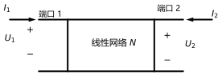
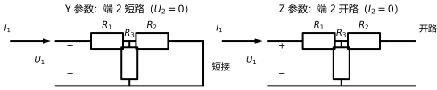
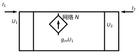

# 第 23 讲：二端口网络 I——Y 参数与 Z 参数

> **前置**：05 讲（结点法——互导纳为负）｜ 14 讲（相量法与阻抗）｜ 22 讲（网络函数）
> **预计时间**：约 3.5 小时（含作业）
>
> **一句话定位**：到此为止，"网络函数"描述的是"一口进、一口出"的关系；这一讲把电路做成**两个端口**都能对外打交道的**黑箱**：**端口**是"一进一出"的端子对，内部怎么接线不管，只用**两组参数**描述端口行为——**Y 参数**（短路导纳，输出短路时测量）与 **Z 参数**（开路阻抗，输出开路时测量），两者互为逆矩阵（存在时）；**互易**与**对称**是参数表上的两类特殊印记。
>
> **本讲回答什么**：
> 1. 为什么要发明"端口"？把整个电路解出来不就完了？
> 2. Y 参数怎么定义？为什么计算时必须让一端短路？
> 3. Z 参数和 Y 参数互为逆矩阵？什么时候逆不存在？
> 4. "参数是电路自己的性质、与外接无关"——这句话对吗？
> 5. 互易、对称是什么意思？参数表里怎么看？
> 6. 含受控源的网络，这些参数还常用吗？
>
> **数字出处**：本讲全部数值从 `scripts/lec23-01`（原理验证）与 `scripts/lec23-02`（作业预验证）复跑得到。主例：T 型电阻网络 $R_1 = R_2 = 10\ \Omega$、$R_3 = 5\ \Omega$（对称）。

## 本讲怎么走（脉络图）

```
引子：22 讲的网络函数只描述"一口进一口出"——两个口都要"对外说话"时怎么办？
  │
  ├─ 1. 黑箱与端口：端口条件（一进一出）；参数是电路自身的性质
  ├─ 2. Y 参数（短路导纳）：I = Y·U；置零 U2 -> 输出短路
  ├─ 3. Z 参数（开路阻抗）：U = Z·I；置零 I2 -> 输出开路；Y = Z^-1 与存在性
  └─ 4. 互易与对称：Y12=Y21 的印记；受控源破坏互易
  → 常见误区 → 小结 → 自测 → 作业
```

> 下一站：引子。先看"黑箱"要解决什么。

---

## 引子：给电路装一对"标准接口"

22 讲的网络函数 $H(s)$ 只处理"**一个口进、一个口出**"的关系（输入端口激励、输出端口取响应）。但很多场合要的是另一种描述：**两个端口都能进也能出**、彼此互为因果——比如两个滤波模块级联（前级的输出端口就是后级的输入端口）、放大器接负载（负载反过来影响输入端看到的阻抗）。这时需要的是**对外接口级**的描述，而不是内部某一对"输入输出"。

做法是把电路装进一个黑箱，只保留**两个端口**的四个变量：$\dot I_1$、$\dot U_1$、$\dot I_2$、$\dot U_2$。它们之间只有**两个**独立约束（四个变量两个方程），写成哪种形式就是哪套参数——本讲先讲最合直觉的两套。先看"成品"（全部实跑）：

本讲的 T 型主例网络（$R_1 = R_2 = 10$、$R_3 = 5$，图 2）给出两套参数：

$$Z = \begin{bmatrix}15 & 5\\ 5 & 15\end{bmatrix}\Omega, \qquad
Y = Z^{-1} = \begin{bmatrix}75 & -25\\ -25 & 75\end{bmatrix}\mathrm{mS}$$

两者相乘是单位矩阵（实跑偏差 $4\times10^{-17}$）；注意 $Y_{12} = Y_{21} = -25$ mS——**负的**，这正是 05 讲结点法里"互导纳为负"的那条规则在新位置的重现。

---

## 1. 黑箱与端口

### 1.1 为什么需要"端口"

先回答"把整个电路解出来不就完了"：整体求解当然可以（前面 22 讲都这么干），但**黑箱描述**给出的是三样整体求解给不了的东西：

1. **复用**：模块的参数一次测好/算好，换到别的电路里接上就能用（不管内部细节）；
2. **级联**：两个模块首尾相接，参数按固定规则组合（24 讲）；
3. **解耦**：内部改结构、只要端口行为不变，外部电路完全不受影响。

这是工程描述方式的分工：**网络函数管"信号处理"，二端口参数管"接口特性"**（二者都有用、互不替代）。

### 1.2 端口条件：不是随便四个端子就叫二端口

**端口**（port）的定义：一对端子，且满足——**从一个端子流入的电流恒等于从另一个端子流出的电流**（端口电流"一进一出"、成对相等）。



> **图 1 怎么读**：黑箱内部是线性网络 $N$；左边一对端子是**端口 1**（$\dot U_1$ 为端口电压、$\dot I_1$ 为流入电流），右边一对是**端口 2**。$\dot I_1$、$\dot I_2$ 都约定为**流入**网络为正（这就是§2 方程里的参考方向口径）。

**为什么必须有这个条件**：只有"电流成对"，端口上才有**一个**独立的电流变量（$\dot I_1$、$\dot I_2$）；如果端子上还有"分叉出去的电流"（两个端子电流不相等），描述它就需要额外的变量——那叫**四端网络**，不是二端口（认识层）。本课程与大多数工程计算中的二端口，都默认端口条件成立。

### 1.3 "参数是电路自己的性质"——对，但有两个前提

这句话**基本正确**：参数由内部**拓扑 + 元件值**决定，与外接电路无关（外接电路只决定工作点）。补两个前提：

1. **线性**（否则参数不是常数）；
2. **内部无独立源、无初始储能**（有独立源时要用"含源二端口"的扩展式，超出本课程范围）。

还有一个容易被误解的点，§4.3 会专门看到：内部有**受控源**时，"参数是电路性质"仍然成立——受控源改变的是参数的**数值**（甚至破坏互易性），但参数依然由电路自身决定、依然与外接无关。

> 下一站：先看最合直觉的一套参数——Y 参数。

---

## 2. Y 参数（短路导纳）

### 2.1 定义

以两个端口电流为因变量、两个端口电压为自变量（相量形式，正弦稳态；纯电阻时退化为实数）：

$$\dot I_1 = Y_{11}\dot U_1 + Y_{12}\dot U_2, \qquad
\dot I_2 = Y_{21}\dot U_1 + Y_{22}\dot U_2$$

矩阵形式 $\dot{\mathbf I} = \mathbf{Y}\,\dot{\mathbf U}$，其中

$$\mathbf{Y} = \begin{bmatrix}Y_{11} & Y_{12}\\ Y_{21} & Y_{22}\end{bmatrix}$$

### 2.2 每个参数怎么"量"：为什么是"短路"

四个参数的物理意义（"另一自变量置零"的口径）：

$$Y_{11} = \left.\frac{\dot I_1}{\dot U_1}\right|_{\dot U_2 = 0}, \quad
Y_{12} = \left.\frac{\dot I_1}{\dot U_2}\right|_{\dot U_1 = 0}, \quad
Y_{21} = \left.\frac{\dot I_2}{\dot U_1}\right|_{\dot U_2 = 0}, \quad
Y_{22} = \left.\frac{\dot I_2}{\dot U_2}\right|_{\dot U_1 = 0}$$

**"令 $\dot U_2 = 0$" = 把端口 2 短路**——所以 $Y$ 叫**短路导纳参数**：
- $Y_{11}$：输出短路时，从端口 1 看进去的**输入导纳**；
- $Y_{12}$：输入短路时，"端口 2 电压在端口 1 引起的电流"——**反向转移导纳**；
- $Y_{21}$、$Y_{22}$ 依此类推。

"置零求系数"这套操作与 06 讲叠加定理的"置零"同源：线性网络里，每个系数就是"只让一个自变量动、其他关掉"时测出来的比例。

### 2.3 运行例：T 型网络的短路法计算

主例 T 型网络（图 2 左格）：$R_1 = 10\ \Omega$ 串在端口 1 与中间节点 A 之间、$R_2 = 10\ \Omega$ 串在 A 与端口 2 之间、$R_3 = 5\ \Omega$ 从 A 到公共端。



> **图 2 怎么读**：同一个 T 型网络的两种"测量现场"——左格把**端口 2 短路**（$\dot U_2 = 0$），用来量 $Y_{11}$、$Y_{21}$；右格把**端口 2 开路**（$\dot I_2 = 0$），用来量 $Z_{11}$、$Z_{21}$。两套口径的差别只在这一个开关动作上。

**短路法求 $Y_{11}$、$Y_{21}$**（$\dot U_2 = 0$：端口 2 短接到公共端）：从端口 1 看进去，$R_3$ 与 $R_2$ 并联（都通地），再与 $R_1$ 串联：

$$Y_{11} = \frac{1}{R_1 + R_2\|R_3} = \frac{1}{10 + \frac{10\times5}{15}} = \frac{1}{13.33} \approx 0.075\ \mathrm{S}$$

**短路法求 $Y_{12}$、$Y_{22}$**（$\dot U_1 = 0$：端口 1 短接到公共端）：注意 $Y_{12}$ 的定义 $-0.025\ \mathrm{S}$——**是负的**：端口 2 加电压时，电流从端口 2 经 $R_2$ 到节点 A、再经 $R_1$ 灌回端口 1，**方向与 $\dot I_1$ 的参考方向（流入）相反**，所以是负值。完整结果：

$$Y = \begin{bmatrix}0.075 & -0.025\\ -0.025 & 0.075\end{bmatrix}\mathrm{S} = \begin{bmatrix}75 & -25\\ -25 & 75\end{bmatrix}\mathrm{mS}$$

**与结点法的直接联系**：对不含受控源的网络，$Y$ 参数就是"端口结点导纳矩阵"的子块——05 讲观察法里"**互导纳取负**"的规则，在二端口里原样出现（$Y_{12}$、$Y_{21}$ 就是互导纳的位置）。所以"短路导纳"这个名字之外的第二种求法：**写内部结点方程、消去内部节点，剩下两个端口节点的导纳矩阵就是 Y**。

> 下一站：把"短路"换成"开路"，得到它的对偶——Z 参数。

---

## 3. Z 参数（开路阻抗）

### 3.1 定义

把自变量与因变量对调：以端口电压为因变量、端口电流为自变量：

$$\dot U_1 = Z_{11}\dot I_1 + Z_{12}\dot I_2, \qquad
\dot U_2 = Z_{21}\dot I_1 + Z_{22}\dot I_2
\qquad\Longleftrightarrow\qquad
\dot{\mathbf U} = \mathbf{Z}\,\dot{\mathbf I}$$

$$Z_{11} = \left.\frac{\dot U_1}{\dot I_1}\right|_{\dot I_2 = 0}, \quad
Z_{12} = \left.\frac{\dot U_1}{\dot I_2}\right|_{\dot I_1 = 0}, \quad
Z_{21} = \left.\frac{\dot U_2}{\dot I_1}\right|_{\dot I_2 = 0}, \quad
Z_{22} = \left.\frac{\dot U_2}{\dot I_2}\right|_{\dot I_1 = 0}$$

**"令 $\dot I_2 = 0$" = 把端口 2 开路**——所以 $Z$ 叫**开路阻抗参数**：$Z_{11}$ 是"输出开路时从端口 1 看进去的输入阻抗"，$Z_{12}$、$Z_{21}$ 是转移阻抗（$Z_{21}$ 为正向、$Z_{12}$ 为反向），$Z_{22}$ 是输出阻抗。**对偶关系一句话**：Y 参数"关电压"（短路），Z 参数"关电流"（开路）。

### 3.2 运行例：同一 T 型网络的开路法

对主例（图 2 右格，**端口 2 开路**，$\dot I_2 = 0$）：端口 1 看进去，电流经过 $R_1$ 后**全部**流过 $R_3$（$R_2$ 里没有电流，因为它串在开路的端口 2 上）：

$$Z_{11} = R_1 + R_3 = 15\ \Omega$$

同理 $Z_{22} = R_2 + R_3 = 15\ \Omega$；转移阻抗：$\dot I_1$ 在端口 2 产生的开路电压是"$R_3$ 上的压降"：

$$Z_{21} = \left.\frac{\dot U_2}{\dot I_1}\right|_{\dot I_2 = 0} = R_3 = 5\ \Omega, \qquad Z_{12} = 5\ \Omega$$

$$Z = \begin{bmatrix}15 & 5\\ 5 & 15\end{bmatrix}\Omega$$

### 3.3 Y 与 Z 的关系：互为逆矩阵（存在时）

两套参数描述同一组约束，可以互相转换——**当两者都存在**时：

$$\mathbf{Y} = \mathbf{Z}^{-1}, \qquad \mathbf{Z} = \mathbf{Y}^{-1}$$

实跑核对：主例 $\mathbf{Y}\mathbf{Z} = \mathbf{I}$，最大偏差 $4\times10^{-17}$ ✓。（串联结构（如 T 型、Π 型的诸元件）直接按开路法读 $Z$ 更顺；并联结构按短路法读 $Y$ 更顺——两种算法都能得到同一对矩阵。）

**"什么时候逆不存在"**（本讲的边界问题）：**退化的二端口"偏科"**——只有一组参数存在：

| 结构 | Z 参数 | Y 参数 | 原因 |
|---|---|---|---|
| 纯串联元件（如单个串联电阻） | 存在但**奇异**（$\det Z = 0$） | **不存在** | 端口 2 一短路，端口 1 也被短接 → 输入电流无穷 |
| 纯并联元件（如单个并联电阻） | **不存在** | 存在但奇异 | 端口 2 一开路，端口 1 也"断流" |

实跑：串联型 $Z = \begin{bmatrix}5&5\\5&5\end{bmatrix}$（$\det = 0$）——数值求逆直接抛出奇异矩阵错误；并联型 $Y = \begin{bmatrix}0.2&-0.2\\-0.2&0.2\end{bmatrix}$（$\det = 0$）——同样无逆。**工程口径**：串联结构用 $Z$、并联结构用 $Y$，遇到退化就换另一套（或直接用 24 讲的 T/H 参数）。

> 下一站：参数表里还藏着两条"身份信息"——互易与对称。

---

## 4. 互易与对称

### 4.1 互易：两个方向"讲同一件事"

**互易**（reciprocity）：转移参数两个方向相等——$Y_{12} = Y_{21}$（等价地 $Z_{12} = Z_{21}$）。物理含义：把激励与响应的位置**对调**，结果不变（与 07 讲互易定理（特勒根）同一条性质的不同表述）。

**判定来源**：**一切由线性无源元件（R、L、M、C）构成的网络恒互易**——主例与非对称例都印证（实跑：非对称 T 型 $Y_{12} = Y_{21} = -0.01429$ S，尽管 $Y_{11}\neq Y_{22}$）。唯一能破坏互易的是**受控源**（§4.3）。

### 4.2 对称：端口互换后"照旧"

**对称**（symmetry，指**电气对称**）：两个端口互换后，端口行为不变——用参数判定：

$$Y_{11} = Y_{22}\ \text{且}\ Y_{12} = Y_{21}
\qquad\Longleftrightarrow\qquad
Z_{11} = Z_{22}\ \text{且}\ Z_{12} = Z_{21}$$

两点注意：

- **互易 ≠ 对称**：互易只需 $Y_{12} = Y_{21}$；对称还要求 $Y_{11} = Y_{22}$。非对称 T 型例：**互易但不对称**（实跑 $Y_{11} = 0.07143 \neq Y_{22} = 0.04286$）——这是区分两者的标准现场；
- **结构对称 ⇒ 电气对称，但反之不然**（认识层：存在结构不对称、电气却对称的网络——判定认参数，不认外观）。

### 4.3 含受控源：参数照旧、互易被破坏

在 T 型网络里加一个受控源（**压控电流源** VCCS，$g_m = 0.05$ S，由 $\dot U_1$ 控制、注入端口 2）：



> **图 3 怎么读**：黑箱内画出了受控源符号（菱形）——它是"由 $\dot U_1$ 控制、$g_m\dot U_1$ 的电流"。受控源只在**方程层面**给 $Y$ 矩阵加一项：$Y_{21}$ 增加了 $g_m$。

实跑结果：$Y_{21} - Y_{12} = g_m = 0.05\ \mathrm{S}$（而互易网络该差值为 $3.5\times10^{-18}$，即零）。三个结论：

1. **参数仍然存在、仍然"是电路自己的性质"**——受控源不改变这句话，只改变数值；
2. **互易被破坏**：$Y_{12} \neq Y_{21}$ 是"网络含受控源"的判据（线性范畴内）；
3. **对称也谈不上**：非互易网络不可能是对称网络（对称要求含互易）。

> 下一站：收尾——钉误区、做自测，然后作业。

> **态度表（二端口网络 I 部分）**
>
> | 内容 | 态度 |
> |---|---|
> | 端口条件（一进一出）与四端网络的区别 | **能复述、能判** |
> | "参数与外接无关"的两前提 | **能说清（线性/无独立源无储能）** |
> | Y 参数方程、四个参数的定义与"短路"口径 | **能默写、能算** |
> | Z 参数方程、四个参数的定义与"开路"口径 | **能默写、能算** |
> | $Y = Z^{-1}$（存在时）与两种求法（短路/开路） | **能互算、能互证** |
> | 存在性边界（串联/并联退化） | 能判、知道该换哪套参数 |
> | 互易（$Y_{12}=Y_{21}$）与对称（外加 $Y_{11}=Y_{22}$） | **能判定、能区分两者** |
> | 受控源破坏互易（$Y_{21}-Y_{12}=g_m$） | **能算、能解释** |
> | 与 05 讲结点法的联系（互导纳负） | 能说出对应关系（认识层） |

---

## 常见误区（本节零新知识，只破误）

> 每条都已在正文系统小节里教过；这里只做"对答案 + 校准"。

1. **"任意四个端子组成的网络都是二端口"**（§1.2）。错。必须满足**端口条件**（端子电流一进一出、成对相等）；否则是四端网络，描述它需要更多变量。
2. **"$Y_{11}$ 是输出开路时测的"**（§2.2）。反了。$Y_{11}$ 测于**输出短路**（$\dot U_2 = 0$）；输出开路测的是 $Z$ 参数（$Z_{11}$）。"Y 短路、Z 开路"八字要记牢。
3. **"Y 参数与 Z 参数总是互为逆矩阵"**（§3.3）。错。只有两者都存在时才有 $\mathbf Y = \mathbf Z^{-1}$；纯串联/纯并联等退化网络只有一套存在。
4. **"含受控源的网络没有 Y/Z 参数"**（§1.3、§4.3）。错。参数照样存在、照样是电路自己的性质；受控源只是可能破坏**互易**。
5. **"网络对称 ⟺ 结构对称"**（§4.2）。不完全对。判定认**电气参数**（$Y_{11} = Y_{22}$ 等）；结构对称必电气对称，反之不一定。
6. **"二端口的参数会随外接负载而变"**（§1.3）。错。**参数**由电路自身决定，与外接无关；随负载变的是**输入阻抗**（它是参数与负载共同算出来的量，见作业 Q8）——两个概念别混。
7. **"互易网络的 $Y_{12}$ 一定是正的"**（§2.3）。错。"互易"说的是 $Y_{12} = Y_{21}$（两方向相等），**不是**符号为正；无源网络里互导纳通常为**负**（主例 $-25$ mS）。

---

## 本讲小结

一页纸的骨架（每条都能在正文与 AA_一览里找到对应条目）：

- **黑箱与端口**：二端口 = 两个满足"电流一进一出"的端口；四个变量、两个独立约束；端口条件不满足则退化四端网络。
- **参数是电路自身的性质**：由拓扑+元件定；两前提——线性、内部无独立源无储能。
- **Y 参数（短路导纳）**：$\dot{\mathbf I} = \mathbf Y\dot{\mathbf U}$；$Y_{11} = \dot I_1/\dot U_1|_{\dot U_2=0}$（输出短路）；$Y_{22}$ 为输出短路时的输入导纳（对端口 2）；转移项 $Y_{12}$、$Y_{21}$（无源网络为负）。
- **Z 参数（开路阻抗）**：$\dot{\mathbf U} = \mathbf Z\dot{\mathbf I}$；$Z_{11} = \dot U_1/\dot I_1|_{\dot I_2=0}$（输出开路）；与 Y 对偶。
- **互换与存在性**：$\mathbf Y = \mathbf Z^{-1}$（存在时）；纯串联 → Y 不存在、纯并联 → Z 不存在；结构偏好：串联读 Z、并联读 Y。
- **主例数字**（T 型 $R_1=R_2=10$、$R_3=5$）：$Z = \begin{bmatrix}15&5\\5&15\end{bmatrix}\Omega$、$Y = \begin{bmatrix}75&-25\\-25&75\end{bmatrix}$ mS、$\mathbf{YZ} = \mathbf I$（偏差 $4\times10^{-17}$）。
- **互易**：$Y_{12} = Y_{21}$（或 $Z_{12} = Z_{21}$）；无源网络恒互易；受控源破坏。
- **对称**：$Y_{11} = Y_{22}$ 且 $Y_{12} = Y_{21}$；非对称例（$R_2 = 20$）互易但不对称（$0.07143 \neq 0.04286$）。
- **受控源现场**：VCCS（$g_m = 0.05$ S）→ $Y_{21} - Y_{12} = g_m$；参数仍在、互易消失。
- **与 05 讲联系**：无源网络的 Y 就是结点导纳矩阵的端口子块（互导纳负）。

## 掌握度自测

- [ ] 我能复述端口条件，并举出一个"四端≠二端口"的情形。
- [ ] 我能默写 Y、Z 两组方程与四个参数的定义式（含置零口径）。
- [ ] 我能对给定网络分别用短路法和开路法求 Y 与 Z，并互证 $\mathbf{YZ} = \mathbf I$。
- [ ] 我能说清"Y 短路、Z 开路"的原因（对偶的置零）。
- [ ] 我能判断串联/并联退化网络中哪套参数不存在，并知道该用哪套。
- [ ] 我能用 $Y_{12} = Y_{21}$、$Y_{11} = Y_{22}$ 判定互易与对称，并区分两者。
- [ ] 我能解释"参数与外接无关"与"输入阻抗随负载变"为什么不矛盾。
- [ ] 我能对含受控源网络算 $Y_{21} - Y_{12}$ 并下"非互易"结论。
- [ ] 我能说出 Y 参数与 05 讲结点法矩阵的关系。
- [ ] 我能复跑 `scripts/lec23-01`、`lec23-02` 并解释每个数字。

## 作业

> 答案只能用**已教概念**（本讲 + 05、06、14、22 讲承接）。先独立做，再对答案。

### 基础

**Q1. 概念辨析**：判断对错，并给一句话理由。

(a) "任意四个端子组成的网络都是二端口。"
(b) "$Y_{11}$ 是输出短路时测得的输入导纳。"
(c) "$Y_{12} \neq Y_{21}$ 的网络一定含受控源（线性范围内）。"
(d) "Y 参数与 Z 参数总是互为逆矩阵。"
(e) "对称网络的 $Y_{11} = Y_{22}$。"

**参考答案**：

(a) 错。须满足端口条件（端子电流一进一出）；否则是四端网络。
(b) 对。$Y_{11} = \dot I_1/\dot U_1|_{\dot U_2=0}$——输出短路口径。
(c) 对。无源线性网络恒互易；破坏互易的只有受控源。
(d) 错。仅当两者都存在（非退化）时互为逆矩阵。
(e) 对。对称（电气对称）含 $Y_{11} = Y_{22}$（且 $Y_{12} = Y_{21}$）。
验算：五小题各回正文点：§1.2 / §2.2 / §4.1、§4.3 / §3.3 / §4.2。

**Q2. 计算·T 型 Z 参数**：T 型网络 $R_1 = R_2 = 5\ \Omega$、$R_3 = 10\ \Omega$。用开路法求 Z 参数。

**参考答案**：

$Z_{11} = R_1 + R_3 = 15\ \Omega$（$\dot I_2 = 0$ 时电流全过 $R_3$）；$Z_{22} = R_2 + R_3 = 15\ \Omega$；$Z_{12} = Z_{21} = R_3 = 10\ \Omega$。
$Z = \begin{bmatrix}15&10\\10&15\end{bmatrix}\Omega$。
验算（脚本）：一致 ✓。

**Q3. 计算·同一网络的 Y 参数**：用 $\mathbf Y = \mathbf Z^{-1}$ 求 Q2 网络的 Y 参数。

**参考答案**：

$\det Z = 225 - 100 = 125$；$\mathbf Y = \dfrac{1}{125}\begin{bmatrix}15&-10\\-10&15\end{bmatrix} = \begin{bmatrix}0.12&-0.08\\-0.08&0.12\end{bmatrix}$ S。
验算（脚本）：$\mathbf{YZ} = \mathbf I$ 偏差 $2.9\times10^{-16}$ ✓。

**Q4. 计算·短路法核对**：用短路法（定义）独立核对 Q3 的 $Y_{11}$。

**参考答案**：

$\dot U_2 = 0$（输出短路）时：$R_2$、$R_3$ 都通地 → 并联 $= 5\|10 = 10/3$；$Y_{11} = 1/(R_1 + 10/3) = 1/(5 + 3.333) = 0.12$ S ✓ 与矩阵求逆一致。
验算（脚本）：$1/(R_1 + R_2\|R_3) = 0.1200$ ✓。

### 提高

**Q5. 计算·互易与对称判定**：Q2/Q3 的网络给出 $Y = \begin{bmatrix}0.12&-0.08\\-0.08&0.12\end{bmatrix}$ S。判断互易性与对称性。

**参考答案**：

$Y_{12} = Y_{21} = -0.08$ → **互易**；$Y_{11} = Y_{22} = 0.12$ → **对称**（因 $R_1 = R_2$ 结构也对称）。
验算（脚本）：判定一致 ✓。

**Q6. 计算·非互易**：某二端口 $Y = \begin{bmatrix}75&25\\125&75\end{bmatrix}$ mS。判断是否互易；若不互易，估算受控源强度。

**参考答案**：

$Y_{12} = 25$ mS、$Y_{21} = 125$ mS，不相等 → **非互易**，必含受控源；受控源贡献 $Y_{21} - Y_{12} = 100$ mS（等效跨导 0.1 S）。
验算（脚本）：差值 100 mS ✓。

**Q7. 计算·存在性**：纯并联二端口（一个 $5\ \Omega$ 电阻并接两端口）。写 Y 参数并判断 Z 是否存在。

**参考答案**：

$Y = \begin{bmatrix}0.2&-0.2\\-0.2&0.2\end{bmatrix}$ S（端口间并联导纳，互导纳为负）；$\det Y = 0$ → Y 奇异，**Z 不存在**（端口 1 加电流时端口 2 无法"开路"出唯一电压）。
验算（脚本）：$\det = 0$ ✓。

### 综合

**Q8. 综合·主例接负载**：主例 T 型（$R_1 = R_2 = 10$、$R_3 = 5$，$Y = \begin{bmatrix}75&-25\\-25&75\end{bmatrix}$ mS）的端口 2 接负载 $R_L = 20\ \Omega$。求从端口 1 看进去的输入阻抗，并用直接电路法核对。

**参考答案**：

用 Y 参数：端 2 接负载时 $\dot I_2 = -Y_L\dot U_2$（$Y_L = 1/R_L = 0.05$ S，负载电流流出）；由第二个方程解出 $\dot U_2$ 代回第一个方程，得输入导纳
$$Y_{in} = Y_{11} - \frac{Y_{12}Y_{21}}{Y_{22} + Y_L} = 0.075 - \frac{0.000625}{0.075+0.05} = 0.075 - 0.005 = 0.07\ \mathrm{S}$$
即 $Z_{in} = 1/0.07 = 14.2857\ \Omega$。
直接电路法核对：$Z_{in} = R_1 + (R_3 \parallel (R_2 + R_L)) = 10 + 5\|30 = 10 + 4.2857 = 14.2857\ \Omega$ ✓ 完全一致。
**顺带一句**（对照误区 6）：$Z_{in}$ 随 $R_L$ 变，但 $Y$ 参数不变——"参数是电路自己的性质"与"输入阻抗依赖负载"同时成立。
验算（脚本）：$Y_{in} = 0.0700$ S、双路 $14.2857\ \Omega$ 一致 ✓。

---

*下一讲预告：第 24 讲《二端口网络 II：传输参数、混合参数与连接》——为什么工程上还要发明另外两套参数？**传输参数**（T）为什么天然适合"级联"（乘起来就行）？**混合参数**（H）为什么成为晶体管数据手册的通用语言？参数的换算是"查表 + 代数"，T/Π 等效电路怎么把一个黑箱变回"看得懂的电路"？串联/并联/级联三种连接各自对哪套参数友好、"有效连接"条件又在防什么？把二端口的工具箱一次补齐。*