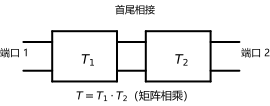
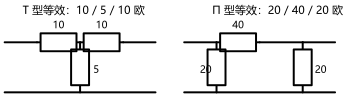
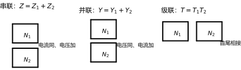

# 第 24 讲：二端口网络 II——传输参数、混合参数与连接

> **前置**：23 讲（Y/Z 参数与端口条件）
> **预计时间**：约 3.5 小时（含作业）
>
> **一句话定位**：四套参数各司其职——**级联用 T**（矩阵相乘）、**电子行业用 H**（晶体管手册的通用语言）、**短路用 Y、开路用 Z**（23 讲）。再加两件工程工具箱里的东西：**T 型/Π 型等效电路**（把黑箱变回"画得出来"的电路）与**连接方式规则**（串联 Z 相加、并联 Y 相加、级联 T 相乘）——后者还带一条必须点名的边界：**"有效连接"条件**。
>
> **本讲回答什么**：
> 1. T 参数为什么按"倒着来"的顺序定义？级联为什么要用它？
> 2. H 参数为什么在电子行业特别常用？
> 3. 四套参数互相换算——全背吗？还是有什么记忆策略？
> 4. T 型、Π 型等效电路怎么搭出来？
> 5. 两个二端口级联，参数直接相乘就行吗？串联、并联呢？
> 6. "有效连接"条件在防什么？
>
> **数字出处**：本讲全部数值从 `scripts/lec24-01`（原理验证）与 `scripts/lec24-02`（作业预验证）复跑得到。主例沿用 23 讲 T 型网络（$R_1 = R_2 = 10\ \Omega$、$R_3 = 5\ \Omega$）。

## 本讲怎么走（脉络图）

```
引子：两套参数还不够？——不同场景要"不同的自变量选择"
  │
  ├─ 1. 两套工程参数：传输参数 T（级联的搭档）、混合参数 H（电子行业的选择）
  ├─ 2. 四套参数的换算：不背表——解方程/查表，互易与对称的印记
  ├─ 3. 等效电路：由 Z 读 T 型、由 Y 读 Π 型；非互易要加受控源
  └─ 4. 连接方式：级联 T 相乘、串联 Z 相加、并联 Y 相加；有效连接条件
  → 常见误区 → 小结 → 自测 → 作业
```

---

## 引子：为什么要四套

23 讲的 Y 与 Z 已经能把二端口"整个"描述清楚——再发明两套，是逼人背表吗？不是。看它们在什么场景最顺手：

| 参数 | 自变量选择 | 最顺手的场景 |
|---|---|---|
| Y | 两个端口电压 | 输出短路测量、并联连接 |
| Z | 两个端口电流 | 输出开路测量、串联连接 |
| **T（传输）** | 输出端口量（"倒着来"） | **级联**——矩阵直接相乘 |
| **H（混合）** | 一个电流 + 一个电压 | **电子电路**——晶体管手册的通用语言 |

**参数只是"把同一对约束写成不同自变量组合"的结果**——没有新物理，只有新的"书写位置"（哪两个当已知、哪两个当未知）。主例（23 讲那只 T 型网络，$R_1 = R_2 = 10$、$R_3 = 5$）的成品（全部实跑）：

$$T = \begin{bmatrix}3 & 40\\ 0.2 & 3\end{bmatrix}, \qquad
H = \begin{bmatrix}13.333 & 0.333\\ -0.333 & 0.0667\end{bmatrix}$$

T 的右下角与左下角是**无量纲的比**、右上角带**欧姆**、左下角带**西门子**——量纲的"混合"正是 H 名字的来源；而 T 的两个对角线元素相等（$A = D = 3$），那是"对称网络"的印记（§1.3 详说）。

---

## 1. 两套工程参数：T 与 H

### 1.1 传输参数（T）：为什么"倒着来"

**传输参数**（transmission parameters，也叫 A 参数）把输出端口当"已知"、输入端口当"未知"：

$$\begin{bmatrix}\dot U_1\\ \dot I_1\end{bmatrix}
= \begin{bmatrix}A & B\\ C & D\end{bmatrix}
\begin{bmatrix}\dot U_2\\ -\dot I_2\end{bmatrix}$$

**三个约定要一次讲清**：

1. **顺序"倒着来"**：$\dot U_1$、$\dot I_1$（输入端）写成输出端量的函数——因为**级联时前级的"输出"就是后级的"输入"**，数据的流动方向与书写方向一致（§1.2）；
2. **$-\dot I_2$ 的口径**：23 讲的 $\dot I_2$ 定义是"流入网络"，但对"输出端"来说更顺的参考方向是**流出去**（流向负载）；所以这里用 $-\dot I_2$ 作为自变量（等价地：$\dot I_2$ 用"流出网络"为正）。这个负号是 T 参数里最容易错的地方；
3. **量纲**：$A$、$D$ 无量纲（电压比/电流比），$B$ 的单位是欧姆（转移阻抗），$C$ 的单位是西门子（转移导纳）。

四个参数的物理意义（同样是置零口径）：

$$A = \left.\frac{\dot U_1}{\dot U_2}\right|_{\dot I_2 = 0}, \quad
B = \left.\frac{\dot U_1}{-\dot I_2}\right|_{\dot U_2 = 0}, \quad
C = \left.\frac{\dot I_1}{\dot U_2}\right|_{\dot I_2 = 0}, \quad
D = \left.\frac{\dot I_1}{-\dot I_2}\right|_{\dot U_2 = 0}$$

（$A$：输出开路的电压比；$B$：输出短路的转移阻抗；$C$：输出开路的转移导纳；$D$：输出短路的电流比。**认识层的直觉**：$A$ 像"变压器变比"、$B$ 像"串联阻抗"、$C$ 像"并联导纳"——这正是 T 参数能画成等效电路的原因（§3）。）

### 1.2 级联为什么"乘起来就行"

把两个网络级联：前级的输出端口就是后级的输入端口。前级的方程把它自己的"输出"（$\dot U_{2},\ -\dot I_{2}$）表示为"输入"的函数；后级又把"新输出"表示为同一个中间量的函数——**代入消元**就是矩阵相乘：

$$\begin{bmatrix}\dot U_1\\ \dot I_1\end{bmatrix}
= T_1\begin{bmatrix}\dot U_2\\ -\dot I_2\end{bmatrix}
= T_1\,T_2\begin{bmatrix}\dot U_3\\ -\dot I_3\end{bmatrix}
\qquad\Longrightarrow\qquad
\boxed{T = T_1 T_2}$$



> **图 1 怎么读**：两个黑箱 $T_1$、$T_2$ 首尾相接（前级的端口 2 与后级的端口 1 对接），整体仍是二端口；它的 T 矩阵就是两个矩阵（按顺序）相乘。**顺序不能反**：$T_1T_2 \neq T_2T_1$（矩阵乘法一般不可交换——与 02 讲的约定一致）。

### 1.3 T 参数的互易/对称判定与主例

两组判定（直接看矩阵元素，不用回到网络）：

- **互易** $\Longleftrightarrow$ $\boxed{AD - BC = 1}$（注意：**不是**"行列式等于 1"——$AD-BC$ 恰好就是行列式，但意义是互易判定）；
- **对称** $\Longleftrightarrow$ $A = D$ **且** $AD - BC = 1$——**两个条件缺一不可**：对称必蕴含互易，所以先过互易关、再看 $A = D$。（一个 $A = D$ 但 $AD - BC \ne 1$ 的矩阵来自非互易网络，**不是对称网络**——这是常见错觉，§常见误区第 6 条。）

主例（23 讲 T 型网络）的 T 参数用 Z→T 换算（换算公式见 §2）：

$$A = \frac{Z_{11}}{Z_{21}} = \frac{15}{5} = 3, \quad
B = \frac{\det Z}{Z_{21}} = \frac{200}{5} = 40\ \Omega, \quad
C = \frac{1}{Z_{21}} = 0.2\ \mathrm{S}, \quad
D = \frac{Z_{22}}{Z_{21}} = 3$$

$$T = \begin{bmatrix}3 & 40\\ 0.2 & 3\end{bmatrix}
\qquad AD - BC = 3\times3 - 40\times0.2 = 1 \checkmark \ (\text{互易}), \qquad A = D \checkmark \ (\text{对称})$$

### 1.4 混合参数（H）：电子行业为什么用它

**混合参数**（hybrid parameters）：自变量取**一个电流加一个电压**（$\dot I_1$ 与 $\dot U_2$）——"混合"名字的来源：

$$\dot U_1 = h_{11}\dot I_1 + h_{12}\dot U_2, \qquad
\dot I_2 = h_{21}\dot I_1 + h_{22}\dot U_2$$

$$h_{11} = \left.\frac{\dot U_1}{\dot I_1}\right|_{\dot U_2 = 0}, \quad
h_{12} = \left.\frac{\dot U_1}{\dot U_2}\right|_{\dot I_1 = 0}, \quad
h_{21} = \left.\frac{\dot I_2}{\dot I_1}\right|_{\dot U_2 = 0}, \quad
h_{22} = \left.\frac{\dot I_2}{\dot U_2}\right|_{\dot I_1 = 0}$$

**四个量纲全不同**：$h_{11}$ 欧姆（输入短路时的输入阻抗）、$h_{12}$ 无量纲（输出开路时的反向电压比）、$h_{21}$ 无量纲（输出短路时的正向电流比）、$h_{22}$ 西门子（输入开路时的输出导纳）。

**为什么电子行业（尤其晶体管）偏爱它**：晶体管是"**输入电流、输出电流**"型的器件——共射接法的输入回路本来就是被电流驱动的，输出侧又常以"短路电流增益/开路输出导纳"标定；H 参数的分工（输入看阻抗、输出看导纳、两个增益无量纲）与晶体管的测量习惯和手册组织完全对应。数据手册里的 $h_{ie}$（输入阻抗）、$h_{re}$（反向电压传输比）、$h_{fe}$（正向电流增益）、$h_{oe}$（输出导纳）就是这四个（认识层：知道它们的位置与含义即可）。

**主例 H 参数**（由 Z 换算，§2）：

$$h_{11} = \frac{\det Z}{Z_{22}} = \frac{200}{15} \approx 13.333\ \Omega, \quad
h_{12} = \frac{Z_{12}}{Z_{22}} = \frac{1}{3}, \quad
h_{21} = -\frac{Z_{21}}{Z_{22}} = -\frac{1}{3}, \quad
h_{22} = \frac{1}{Z_{22}} = \frac{1}{15}\ \mathrm{S}$$

**互易的 H 版印记**：$h_{12} = -h_{21}$（注意**负号**——与 Y 参数的 $Y_{12} = Y_{21}$ 长得不一样）；**对称**还需 $\det H = h_{11}h_{22} - h_{12}h_{21} = 1$（主例实跑：$13.333\times0.0667 + 1/9 = 1$ ✓）。

---

## 2. 四套参数的换算：不背表，靠"解方程"

### 2.1 换算的本质

四套参数是**同一对约束方程**取不同"自变量/因变量"的写法。换算就是**解方程**（或矩阵反解）：

- Y 与 Z：互为逆矩阵（23 讲，存在时）；
- 其余任意两套之间：把一套的方程"重新解出目标自变量"即可——**不需要背十几组换算表**，推一组（或查教材的表）就能得全部。

**本节"学到什么程度"**：会从 Z（或 Y）**现推** T 与 H（考试也只需这一方向的熟练）；反向换算（T→Z 等）会查表即可。

### 2.2 主例四套一次算齐（实跑）

| 参数 | 矩阵（主例） | 互易印记 | 对称附加条件 |
|---|---|---|---|
| $Z$ | $\begin{bmatrix}15 & 5\\ 5 & 15\end{bmatrix}\Omega$ | $Z_{12} = Z_{21}$ | $Z_{11} = Z_{22}$ |
| $Y$ | $\begin{bmatrix}0.075 & -0.025\\ -0.025 & 0.075\end{bmatrix}\mathrm{S}$ | $Y_{12} = Y_{21}$ | $Y_{11} = Y_{22}$ |
| $T$ | $\begin{bmatrix}3 & 40\\ 0.2 & 3\end{bmatrix}$ | $AD - BC = 1$ | $A = D$（且互易） |
| $H$ | $\begin{bmatrix}13.333 & 0.333\\ -0.333 & 0.0667\end{bmatrix}$ | $h_{12} = -h_{21}$ | $\det H = 1$（且互易） |

**换算路线（Z 出发，两步走）**：

$$\text{Z} \to T:\ A = \frac{Z_{11}}{Z_{21}},\ B = \frac{\det Z}{Z_{21}},\ C = \frac{1}{Z_{21}},\ D = \frac{Z_{22}}{Z_{21}}; \qquad
\text{Z} \to H:\ h_{11} = \frac{\det Z}{Z_{22}},\ h_{12} = \frac{Z_{12}}{Z_{22}},\ h_{21} = -\frac{Z_{21}}{Z_{22}},\ h_{22} = \frac{1}{Z_{22}}$$

（实跑核对：主例四套参数与上表一致；$AD-BC = 1$、$h_{12} = -h_{21}$、$\det H = 1$ 全部通过。）

---

## 3. 等效电路：T 型与 Π 型

四套参数里有一个直接结论：**任何互易二端口都能画成三个元件组成的等效电路**——T 型或 Π 型。这意味着"黑箱"随时可以翻译回"看得懂的电路"（也就能用前面 22 讲的全部手段去算它）。

### 3.1 由 Z 读 T 型、由 Y 读 Π 型

**T 型等效**（三个元件成"T"字形：两个串联臂 + 一个公共臂）：

$$Z_a = Z_{11} - Z_{12}, \qquad Z_m = Z_{12}, \qquad Z_b = Z_{22} - Z_{12}$$

**Π 型等效**（三个元件成"Π"字形：两个并联臂 + 一个跨接臂）：

$$Y_a = Y_{11} + Y_{12}, \qquad Y_m = -Y_{12}, \qquad Y_b = Y_{22} + Y_{12}
\qquad\Longleftrightarrow\qquad
Z_a = \frac{1}{Y_{11}+Y_{12}}, \quad Z_m = \frac{1}{-Y_{12}}, \quad Z_b = \frac{1}{Y_{22}+Y_{12}}$$

主例回读（实跑）：



> **图 2 怎么读**：同一只 T 型网络（$R_1=R_2=10$、$R_3=5$）的两种等效——**T 型等效**：$Z_{11}-Z_{12} = 10$、$Z_{12} = 5$、$Z_{22}-Z_{12} = 10$（正好回读成原网络的 $R_1/R_3/R_2$ 三个电阻，闭环验证）；**Π 型等效**：$1/(Y_{11}+Y_{12}) = 20$、$1/(-Y_{12}) = 40$、$1/(Y_{22}+Y_{12}) = 20\ \Omega$（Π 型反算 Y 参数与原 Y 的偏差 $1.4\times10^{-17}$）。注意两种等效电路的**形状差异**：T 型的元件"串在端口上下之间"（两串一并），Π 型的元件"并接在两端口之间"（两并一串）。

**什么时候用哪个**：由 Z 参数出发做 T 型（直接读三类元件值）；由 Y 参数出发做 Π 型；反过来也可互换（用换算公式）。

### 3.2 边界：非互易要加受控源

**互易**二端口才有上面三个纯元件的等效电路；**非互易**网络（含受控源）的等效电路要多加一个**受控源**（认识层：结构上就是在 T 型/Π 型上加一个受控源臂）——23 讲的"受控源破坏互易"在这里再次出现。

---

## 4. 连接方式与"有效连接"条件

### 4.1 级联：$T$ 相乘

两个二端口**首尾相接**（前级输出=后级输入）：整体 $T = T_1T_2$（§1.2 已推导）。**数值三路互证**（实跑，两级相同的主例网络、端 2 接 $20\ \Omega$）：

$$T^2 = \begin{bmatrix}3 & 40\\ 0.2 & 3\end{bmatrix}^2 =
\begin{bmatrix}17 & 240\\ 1.2 & 17\end{bmatrix}
\qquad\Longrightarrow\qquad
Z_{in} = \frac{A R_L + B}{C R_L + D} = \frac{17\times20 + 240}{1.2\times20 + 17} = \frac{580}{41} \approx 14.1463\ \Omega$$

三条路径互证：①上式用 $T^2$ 直接算；②逐级递归（第二级输入阻抗 → 作为第一级负载）；③**直接对级联后的完整电路列结点法求解**——三路结果全部 $14.1463\ \Omega$ ✓。

（顺带记住这个"输入阻抗公式"：$Z_{in} = \dfrac{A R_L + B}{C R_L + D}$——给定 T 参数与负载，一步算出输入端看到什么。）

### 4.2 串联与并联：$Z$ 相加、$Y$ 相加

- **串联**（两个网络的对应端口分别串接：端口电流相同、电压相加）：$\boxed{Z = Z_1 + Z_2}$；
- **并联**（对应端口分别并接：端口电压相同、电流相加）：$\boxed{Y = Y_1 + Y_2}$。

主例验证（实跑）：**并联**——两个 T 型网络（主例 + $R_3=10$ 的变体）并联，导纳矩阵相加得 $Y_{11} = 0.1417$ S，与直接对并联电路列结点法解出的 $Y_{11}$ **一致**；**串联**——"端口 1 串一个 $5\ \Omega$ 元件"的特例：$Z = \begin{bmatrix}5&5\\5&5\end{bmatrix} + Z_{主例} = \begin{bmatrix}20&10\\10&20\end{bmatrix}$，直接解的 $Z_{11} = 20\ \Omega$ ✓（串联网的 $Y$ 参数不存在——退化，正好用 23 讲的"串联读 Z"）。



> **图 3 怎么读**：三种接法与各自"友好"的参数——**串联**：电流同、电压加 → $Z$ 相加；**并联**：电压同、电流加 → $Y$ 相加；**级联**：首尾相接 → $T$ 相乘。记忆方式：**相加的参数恰好是"跟接法同侧的那个自然变量"**（串联天然谈电压叠加、并联天然谈电流叠加）。

### 4.3 三种连接一览

| 连接 | 端口关系 | 参数规则 | 适用参数 |
|---|---|---|---|
| 串联 | $I$ 相同、$U$ 相加 | $Z = Z_1 + Z_2$ | 用 Z（Y 可能不存在） |
| 并联 | $U$ 相同、$I$ 相加 | $Y = Y_1 + Y_2$ | 用 Y（Z 可能不存在） |
| 级联 | 前级输出=后级输入 | $T = T_1T_2$ | 用 T（矩阵乘法） |

### 4.4 有效连接条件：规则失效的现场

以上三条"相加/相乘"规则都**有前提**——"连接后端口条件仍成立"（**有效连接**，valid connection）：

- **串联的有效性**：要求两个网络在**对应端口的电流确实相等**（$\dot I_{1a} = \dot I_{1b}$、$\dot I_{2a} = \dot I_{2b}$）。**最常见的失效场景**：两个网络的公共端**已经共地**——强行"串联"时电流会从公共地线抄近路分流，端口条件被破坏，$Z$ 相加直接失效；
- **并联的有效性**：要求对应端口**电压确实相等**（一般并联接法天然满足，但若两网络内部有交叉连接也要核验）；
- **判定手段**（认识层）：在连接点做"端口条件测试"——测连接支路里有没有额外电流/电压差；不满足时必须回到整体解电路（不能用相加规则）。

一句话总结：**"相加/相乘"是连接规则的结论，不是万能的**——接法是否"有效"，决定规则能不能用。

> **态度表（二端口网络 II 部分）**
>
> | 内容 | 态度 |
> |---|---|
> | T 参数定义（含 $-\dot I_2$ 口径）与量纲 | **能默写、能解释"倒着来"** |
> | 级联 $T = T_1T_2$ 的推导与顺序不可换 | **能推导、能算** |
> | $AD - BC = 1$ 互易、$A = D$ 且互易才对称 | **能判定**（两个条件缺一不可） |
> | H 参数定义、量纲混合与电子行业含义 | **能默写**；h 系符号认识层 |
> | 四套参数换算（Z→T、Z→H 现推） | **能现推**；反向会查表 |
> | T 型/Π 型等效（由 Z、由 Y） | **能搭、能回读** |
> | 级联/串联/并联的规则与输入阻抗公式 | **能默写、能算** |
> | 有效连接条件（串联共地失效等） | **能复述、知道后果** |

---

## 常见误区（本节零新知识，只破误）

> 每条都已在正文系统小节里教过；这里只做"对答案 + 校准"。

1. **"T 参数里 $\dot I_2$ 的口径与 23 讲一样（流入为正）"**（§1.1）。错。T 参数用 **$-\dot I_2$**（等价地：输出电流以"流出网络"为正）——这是"倒着来"的一部分，也是 T 参数最常见的错号来源。
2. **"级联的 T 可以随便换顺序相乘"**（§1.2、§4.1）。错。$T_1T_2 \ne T_2T_1$——矩阵乘法不可交换；顺序按"信号流"方向。
3. **"$AD-BC=1$ 就是行列式为 1，没什么特别"**（§1.3）。这句话"数值上"成立，但**意义**是**互易判据**——要记住它在判定什么。
4. **"级联后总网络的 T 就是把两个 T 的元素全乘起来"**（§4.1）。错。是**矩阵乘法**（$T_1T_2$），不是逐元素乘——24 讲反复出现的矩阵规矩。
5. **"四套参数要背十几组换算公式"**（§2.1）。不必。换算就是"同一对约束换自变量"——会从 Z 现推 T 与 H 就够，其余查表。
6. **"$A = D$ 就是对称网络"**（§1.3）。不完整。对称 $\Longleftrightarrow$ $A = D$ **且** $AD-BC=1$——对称必蕴含互易；一个 $A=D$ 但 $AD-BC\ne1$ 的矩阵**不是对称网络**（作业 Q4 的 ① 就是现场）。
7. **"串联的二端口，Z 直接相加总没错"**（§4.4）。有前提。串联有效性要求对应端口电流一致；**公共端已共地**的"伪串联"会分流、使 $Z$ 相加失效——这是"有效连接条件"的最常见现场。

---

## 本讲小结

一页纸的骨架（每条都能在正文与 AA_一览里找到对应条目）：

- **四套参数的分工**：Y（短路/并联）、Z（开路/串联）、T（级联）、H（电子行业）；本质是同一对约束的不同自变量选择。
- **T 参数**：$\begin{bmatrix}\dot U_1\\ \dot I_1\end{bmatrix} = T\begin{bmatrix}\dot U_2\\ -\dot I_2\end{bmatrix}$；$-\dot I_2$ 口径；量纲（无量纲/Ω/Ω⁻¹）；级联 $T = T_1T_2$（顺序不可换）。
- **T 判定**：互易 $\Leftrightarrow$ $AD-BC=1$；对称 $\Leftrightarrow$ $A=D$ 且互易。
- **H 参数**：$\dot U_1 = h_{11}\dot I_1 + h_{12}\dot U_2$、$\dot I_2 = h_{21}\dot I_1 + h_{22}\dot U_2$；量纲全不同（Ω/—/—/S）；晶体管手册的 $h_{ie}, h_{re}, h_{fe}, h_{oe}$；互易 $\Leftrightarrow$ $h_{12} = -h_{21}$；对称还需 $\det H = 1$。
- **换算**：Z↔Y 逆矩阵；Z→T、Z→H 现推；主例四套齐（$T = [[3,40],[0.2,3]]$、$H = [[13.333,0.333],[-0.333,0.0667]]$）。
- **等效电路**：T 型（$Z_{11}-Z_{12}$、$Z_{12}$、$Z_{22}-Z_{12}$）；Π 型（$1/(Y_{11}+Y_{12})$、$1/(-Y_{12})$、$1/(Y_{22}+Y_{12})$）；主例回读 10/5/10 与 20/40/20；非互易需加受控源。
- **连接方式**：串联 $Z = Z_1+Z_2$；并联 $Y = Y_1+Y_2$；级联 $T = T_1T_2$；输入阻抗 $Z_{in} = (AR_L+B)/(CR_L+D)$。
- **数值互证**：级联三级路径 $14.1463\ \Omega$ 完全一致；并联 $Y_{11} = 0.1417$ S 与结点法一致；Π 型反算偏差 $1.4\times10^{-17}$。
- **有效连接**：串联要求端口电流一致（公共端共地失效）；并联要求端口电压一致；不满足则回整体求解。

## 掌握度自测

- [ ] 我能默写 T 参数方程并说清"倒着来"与 $-\dot I_2$ 口径的原因。
- [ ] 我能推导 $T = T_1T_2$ 并说明顺序不可交换。
- [ ] 我能用 $AD-BC=1$ 与 $A=D$ 判定互易与对称（并知道两个条件缺一不可）。
- [ ] 我能默写 H 参数方程、四个量纲与 h 系符号的对应。
- [ ] 我能从 Z 现推 T 与 H 并核对主例四套参数。
- [ ] 我能由 Z 搭 T 型、由 Y 搭 Π 型等效电路并回读主例（10/5/10 与 20/40/20）。
- [ ] 我能默写三种连接的规则并算级联后的输入阻抗（$14.1463\ \Omega$ 现场）。
- [ ] 我能复述"有效连接"条件与串联共地失效的后果。
- [ ] 我能说清四套参数各自的"顺手场景"。
- [ ] 我能复跑 `scripts/lec24-01`、`lec24-02` 并解释每个数字。

## 作业

> 答案只能用**已教概念**（本讲 + 23 讲承接）。先独立做，再对答案。

### 基础

**Q1. 概念辨析**：判断对错，并给一句话理由。

(a) "T 参数中输出端口电流用流入网络为正的约定。"
(b) "两个二端口级联，总 T 参数是两个 T 矩阵的逐元素乘积。"
(c) "$AD - BC = 1$ 是互易网络的判据。"
(d) "含受控源的非互易网络也能用纯 T 型/Π 型等效电路表示。"
(e) "串联连接时，两个网络的 Z 参数可以直接相加。"

**参考答案**：

(a) 错。T 参数用 $-\dot I_2$（输出电流以流出为正）的口径——"倒着来"。
(b) 错。是**矩阵乘法** $T = T_1T_2$（顺序不可换）。
(c) 对。互易 $\Leftrightarrow AD-BC = 1$；对称还要再加 $A = D$。
(d) 错。非互易网络的等效电路要多加受控源（纯三元件只对互易网络）。
(e) 不严谨。**有效连接**（对应端口电流一致）成立时才对；公共端共地的"伪串联"会失效。
验算：五小题各回正文点：§1.1 / §1.2 / §1.3 / §3.2 / §4.4。

**Q2. 计算·T 参数**：主例（$Z = \begin{bmatrix}15&5\\5&15\end{bmatrix}\Omega$）求 T 参数并验证互易与对称。

**参考答案**：

$A = Z_{11}/Z_{21} = 3$；$B = \det Z/Z_{21} = 200/5 = 40\ \Omega$；$C = 1/Z_{21} = 0.2\ \mathrm{S}$；$D = Z_{22}/Z_{21} = 3$。
$T = \begin{bmatrix}3&40\\0.2&3\end{bmatrix}$；$AD-BC = 9 - 8 = 1$（互易）；$A = D = 3$（对称）。
验算（脚本）：一致 ✓。

**Q3. 计算·H 参数**：同一网络求 H 参数。

**参考答案**：

$h_{11} = \det Z/Z_{22} = 200/15 \approx 13.333\ \Omega$；$h_{12} = Z_{12}/Z_{22} = 1/3$；$h_{21} = -Z_{21}/Z_{22} = -1/3$；$h_{22} = 1/Z_{22} = 1/15$ S。
互易核对：$h_{12} = -h_{21} = 1/3$ ✓。
验算（脚本）：一致 ✓。

**Q4. 计算·判定**：给两组 T 参数判断互易与对称：

① $\begin{bmatrix}2&10\\0.1&2\end{bmatrix}$；② $\begin{bmatrix}3&40\\0.2&3\end{bmatrix}$。

**参考答案**：

① $AD-BC = 4-1 = 3 \ne 1$ → **非互易**；虽然 $A = D$，但**不是对称网络**（对称必蕴含互易）。
② $AD-BC = 1$ → 互易；$A = D$ → 对称。
验算（脚本）：判定输出一致（①"非互易（不对称）"、②"互易且对称"）✓。

### 提高

**Q5. 计算·级联**：两个相同网络 $T = \begin{bmatrix}3&40\\0.2&3\end{bmatrix}$ 级联，求 $T_{总}$ 与端 2 接 $R_L = 20\ \Omega$ 时的输入阻抗。

**参考答案**：

$T_{总} = T^2 = \begin{bmatrix}3\times3 + 40\times0.2 & 3\times40 + 40\times3\\ 0.2\times3 + 3\times0.2 & 0.2\times40 + 3\times3\end{bmatrix} = \begin{bmatrix}17&240\\1.2&17\end{bmatrix}$。
$Z_{in} = \dfrac{17\times20 + 240}{1.2\times20 + 17} = \dfrac{580}{41} \approx 14.1463\ \Omega$。
验算（脚本）：$14.1463$（与逐级递归、直接结点法三路一致）。
（自检：$AD-BC = 289 - 288 = 1$ ✓ 级联后仍互易。）

**Q6. 计算·串联与并联**：$Z_A = \begin{bmatrix}10&2\\2&10\end{bmatrix}$、$Z_B = \begin{bmatrix}5&1\\1&5\end{bmatrix}$。求串联后的 Z 与并联后的 Y。

**参考答案**：

串联：$Z = Z_A + Z_B = \begin{bmatrix}15&3\\3&15\end{bmatrix}\Omega$。
并联：$Y = Z_A^{-1} + Z_B^{-1} = \begin{bmatrix}0.3125&-0.0625\\-0.0625&0.3125\end{bmatrix}$ S。
验算（脚本）：一致 ✓。

**Q7. 计算·等效电路**：

(1) 由 $Z = \begin{bmatrix}20&10\\10&20\end{bmatrix}$ 搭 T 型等效（三个元件值）；
(2) 由 $Y = \begin{bmatrix}0.15&-0.05\\-0.05&0.15\end{bmatrix}$ S 搭 Π 型等效（三个元件值）。

**参考答案**：

(1) $Z_{11}-Z_{12} = 10$、$Z_{12} = 10$、$Z_{22}-Z_{12} = 10$ → T 型三元件全为 $10\ \Omega$。
(2) $1/(Y_{11}+Y_{12}) = 1/0.1 = 10\ \Omega$、$1/(-Y_{12}) = 1/0.05 = 20\ \Omega$、$1/(Y_{22}+Y_{12}) = 10\ \Omega$ → Π 型两并臂各 10、跨接臂 20。
验算（脚本）：回读一致 ✓。

### 综合

**Q8. 综合·两级级联（不同网络）**：$T_1 = \begin{bmatrix}3&40\\0.2&3\end{bmatrix}$、$T_2 = \begin{bmatrix}2&30\\0.1&2\end{bmatrix}$。

(1) 求级联总 T；
(2) 验证"总网络是否仍互易"；
(3) 端 2 接 $20\ \Omega$，求输入阻抗。

**参考答案**：

(1) $T = T_1T_2 = \begin{bmatrix}3\times2+40\times0.1 & 3\times30+40\times2\\ 0.2\times2+3\times0.1 & 0.2\times30+3\times2\end{bmatrix} = \begin{bmatrix}10&170\\0.7&12\end{bmatrix}$。
(2) $AD-BC = 120 - 119 = 1$ → **互易保持**（互易网络的级联仍互易——两级各自 $AD-BC=1$，乘积仍为 1）。
(3) $Z_{in} = \dfrac{10\times20+170}{0.7\times20+12} = \dfrac{370}{26} \approx 14.2308\ \Omega$。
验算（脚本）：$T = [[10,170],[0.7,12]]$、$AD-BC = 1$、$Z_{in} = 14.2308$ ✓。

---

*下一讲预告：第 25 讲《电路方程的矩阵形式：从关联矩阵到状态方程》——最后一讲大内容：把"系统化列方程"推到顶格。为什么要引入图论（支路、结点、树与回路）？**关联矩阵** $A$ 是什么、为什么 KCL 恰好写成 $A\mathbf i = 0$？KVL 里的 $A^{\top}$ 从哪里来？最核心的一幕：$A\mathbf Y A^{\top}$ 为什么**恰好**等于结点导纳矩阵（第 05 讲观察法的矩阵原来从这来）？回路矩阵、割集矩阵、状态方程各管什么、学到什么程度？下一讲把整套手艺一次收口。*
