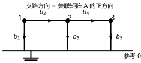
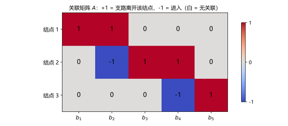
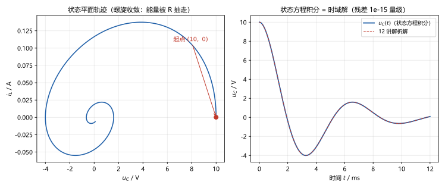

# 第 25 讲：电路方程的矩阵形式——从关联矩阵到状态方程

> **前置**：05 讲（结点法观察法）｜ 02/04 讲（KCL/KVL 与独立方程计数）｜ 10/12 讲（状态量与状态方程雏形）｜ 22 讲（极点与稳定性）
> **预计时间**：约 4 小时（含作业）
>
> **一句话定位**：把"看电路列方程"这种手算方法**编译成机器能执行的流程**：先用**图论**描述电路的连接关系（支路、结点、树），再用**关联矩阵** $A$ 把 KCL 写成 $A\mathbf i = 0$、把 KVL 写成 $\mathbf u = A^{\top}\mathbf U$，最后把三条式子组装成 $A\mathbf Y A^{\top}\mathbf U = \mathbf I_S$——**05 讲观察法的结点导纳矩阵，到这里找到了出处**。收尾两站：回路/割集矩阵（认识层）与**状态方程**（现代控制课的入口）。
>
> **本讲回答什么**：
>
> 1. 关联矩阵 $A$ 是什么？为什么 KCL 恰好写成 $A\mathbf i = 0$？
> 2. $A^{\top}$ 怎么又跑出来了？KVL 写成 $\mathbf u = A^{\top}\mathbf U$ 为什么成立？
> 3. （核心）$A\mathbf Y A^{\top}$ 为什么**恰好**等于结点导纳矩阵？
> 4. 回路矩阵 $B$、割集矩阵 $Q$ 是干嘛的？要学到什么程度？
> 5. 这套矩阵形式"除了好看"有什么用？
> 6. 状态方程是什么？它和前面所有方程的区别在哪？
>
> **数字出处**：本讲全部数值从 `scripts/lec25-01`（原理验证）与 `scripts/lec25-02`（作业预验证）复跑得到。示例电路：3 个独立结点 + 参考、5 条支路（图 1）；状态方程例沿用 12 讲 RLC（$R = 28\ \Omega$、$L = 50$ mH、$C = 20\ \mu$F）。

---

## 引子：把手艺变成流程

05 讲的结点法（观察法）很好用——但它是一条**手艺**：靠人"看"电路、数"自导纳/互导纳"。电路一复杂（几十个结点、上百条支路），人手就不可靠了；而**计算机辅助分析**（CAA；Spice 这类软件）需要的是**确定性流程**：输入一张"支路表"，机器自己把方程组装出来、解掉。

这一讲就是把"看电路列方程"编译成机器流程。完成品预览（全部实跑）：

- 示例电路（图 1：5 条支路、3 个独立结点）的**关联矩阵** $A$ 一写好，KCL 就是 $A\mathbf i = \mathbf I_S$（无源支路口径）、KVL 就是 $\mathbf u = A^{\top}\mathbf U$；
- 组装出的 $A\mathbf Y A^{\top}$ 与 05 讲**手写观察法**的结点导纳矩阵一致（偏差 $2.8\times10^{-17}$）；
- **状态方程** $\dot{\mathbf x} = \mathbf S\mathbf x$ 的**特征值恰好是固有频率**（$-280 \pm \mathrm{j}960$——12 讲的特征根、22 讲的极点，三者对上）。

---

## 1. 图论最小词汇表

### 1.1 为什么需要图论

电路方程只依赖**连接关系**（谁跟谁接在一起）与**元件参数**，不依赖导线的形状、位置。**图论**正好是描述"连接关系"的语言：把电路画成一张**有向图**——**支路**（元件，带参考方向）是边、**结点**（导线汇合点）是顶点。剩下的全部结论都只在"图"上做。

### 1.2 六个词与两个计数

> **图 1 怎么读**：3 个独立结点（1、2、3）+ 参考结点（0，公共底线的基准），5 条支路各有箭头——**箭头方向就是关联矩阵 $A$ 的"正方向"**（§2）。$\dot U_k$ 是结点电位、$\dot u_k$ 是支路电压、$\dot i_k$ 沿箭头方向。

| 名词                  | 一句话定义                                             | 示例（图 1）                                                  |
| --------------------- | ------------------------------------------------------ | ------------------------------------------------------------- |
| 支路                  | 一个元件（带参考方向）                                 | $b_1 \sim b_5$                                              |
| 结点                  | 导线的汇合点（含参考结点）                             | $1, 2, 3, 0$                                                |
| 路径                  | 沿支路串起来的走法                                     | $1 \to 2 \to 3$                                             |
| **树**          | 连接**所有**结点、且**不含回路**的支路集合 | $\{b_1, b_2, b_4\}$                                         |
| **树支 / 连支** | 树里的支路 / 不在树里的支路                            | 树支 3 条、连支$\{b_3, b_5\}$                               |
| **基本回路**    | 每条连支 + 它在树上的路径构成一个回路                  | $b_3$ 配 $\{b_1, b_2\}$；$b_5$ 配 $\{b_1, b_2, b_4\}$ |

**两个计数**（04/05 讲"独立方程数"的图论版）：

- **树支数 = $n-1$**（$n$ 含参考）——连通图任何一棵树都恰好这么多支路；对应**独立的 KCL 数**（结点法源）；
- **连支数 = $b-n+1$**——对应**独立回路数**（回路法源）。示例：$5-4+1 = 2$ 个独立回路 ✓。

（图论的意义：**"独立方程数"不再靠数网孔猜**——$n-1$ 与 $b-n+1$ 是图的性质。）

---

## 2. 关联矩阵 A：KCL 与 KVL 的矩阵形式

### 2.1 A 的定义（"出度入度"就是这个）

**关联矩阵** $A$：$n \times b$ 的矩阵——**行对应结点**（含参考行；实用时去掉参考行，剩 $n-1$ 行）、**列对应支路**：

$$
a_{ij} = \begin{cases}
+1, & \text{支路 } j \text{ 离开结点 } i \text{（从 } i \text{ 出发）}\\
-1, & \text{支路 } j \text{ 进入结点 } i\\
0, & \text{支路 } j \text{ 与结点 } i \text{ 无关}
\end{cases}
$$

示例（图 1，去掉参考行后的 $3\times5$）：

$$
A = \begin{bmatrix}
1 & 1 & 0 & 0 & 0\\
0 & -1 & 1 & 1 & 0\\
0 & 0 & 0 & -1 & 1
\end{bmatrix}
$$

> **图 2 怎么读**：热图里 +1（"支路离开该结点"）、−1（"进入"）、0（无关）。每一列恰好**一个 +1、一个 −1**（每条支路有起点和终点——若把参考行加回来，列和恒为零）；每一行就是"该结点所有支路的进出明细"——"出度/入度"的说法正是从这来的。

### 2.2 KCL：$A\mathbf i = \mathbf I_S$

把 $A$ 乘上支路电流向量 $\mathbf i$（$b \times 1$）：**每一行的计算恰好是"该结点所有支路电流的代数和"**（离开取 $+$、进入取 $-$）——这正是 KCL！于是：

$$
A\,\mathbf i = \mathbf i_{\text{注入}} \equiv \mathbf I_S \qquad (\text{无源支路口径})
$$

**两种等价口径**（都要会读）：

- 若 $\mathbf i$ 只含**无源支路**（电流源单独记在 $\mathbf I_S$ 里）→ $A\mathbf i = \mathbf I_S$（注入电流向量）；
- 若把**电流源也列入支路**（全部 $b$ 条）→ 方程的右边变成零：$A\mathbf i = \mathbf 0$。

去掉参考行后，$A$ 的行数为 $n-1$——**独立的 KCL 方程恰好 $n-1$ 条**（04/05 讲结论的矩阵版）。

### 2.3 KVL：$\mathbf u = A^{\top}\mathbf U$

$A^{\top}$ 是 $b \times n$ 矩阵：**每一列（或 $A^{\top}$ 的每一行）对应一条支路**。看 $A^{\top}$ 的第 $k$ 行——它把支路 $k$ 的**起点电位减终点电位**：

$$
u_k = U_{\text{起点}} - U_{\text{终点}} \qquad\Longleftrightarrow\qquad \mathbf u = A^{\top}\mathbf U
$$

——**支路电压 = 两端结点电位之差**。这就是 KVL 的矩阵形式（自动成立，不需要再"绕回路"）。

### 2.4 运行例：三式一次验证（实跑）

示例电路的支路导纳 $\mathbf G = (0.1, 0.05, 0.2, 0.1, 0.05)$ S，电流源注入结点 1 为 1 A、结点 3 为 0.5 A。组装（§3）求解后：

- 结点电位：$\mathbf U = (7.5,\ 2.5,\ 5.0)$ V；
- 支路电压（KVL 核对）：$\mathbf u = A^{\top}\mathbf U = (7.5,\ 5.0,\ 2.5,\ -2.5,\ 5.0)$ V——每条都是两端电位之差 ✓；
- 支路电流：$\mathbf i = \mathbf G \odot \mathbf u = (0.75,\ 0.25,\ 0.5,\ -0.25,\ 0.25)$ A；
- KCL 核对：$A\mathbf i = (1.0,\ \sim0,\ 0.5)$ A $= \mathbf I_S$（残差 $1.1\times10^{-16}$）✓。

三条式子——$A\mathbf i = \mathbf I_S$（KCL）、$\mathbf u = A^{\top}\mathbf U$（KVL）、$\mathbf i = \mathbf G \odot \mathbf u$（支路方程）——就是矩阵形式电路的**全部构件**。下一节把它们组装起来。

---

## 3. 核心组装：$A\mathbf Y A^{\top}$ 就是结点导纳矩阵

### 3.1 三条式子排好队

矩阵形式电路的三个构件（§2）：

1. **支路方程**：$\mathbf i = \mathbf Y_b\,\mathbf u + \mathbf i_S$——$\mathbf Y_b$ 是**支路导纳矩阵**（$b \times b$；无互感、无受控源时是对角矩阵，对角元为各支路导纳；存在耦合时出现非对角元——认识层），$\mathbf i_S$ 是支路里的电流源向量；
2. **KVL**：$\mathbf u = A^{\top}\mathbf U$；
3. **KCL**：$A\,\mathbf i = \mathbf 0$（全支路口径）。

### 3.2 四步消元：结点法自动出现

把 1 代入 3，再用 2 把 $\mathbf u$ 换成结点电位：

$$
A\left(\mathbf Y_b\,A^{\top}\mathbf U + \mathbf i_S\right) = \mathbf 0
\qquad\Longrightarrow\qquad
\boxed{A\,\mathbf Y_b\,A^{\top}\,\mathbf U = -A\,\mathbf i_S \equiv \mathbf I_S}
$$

**左边那个 $A\mathbf Y_b A^{\top}$ 是 $(n-1)\times(n-1)$ 方阵——它就是结点导纳矩阵 $\mathbf Y_n$！** 展开看一眼就明白它的元素为什么长那样（以示例电路为例，每条支路的 $A$ 列只有起点 $+1$、终点 $-1$ 两个非零元）：

- **对角元** $Y_{kk} = \sum (\text{连到结点 } k \text{ 的支路导纳})$——"自导纳正"；
- **非对角元** $Y_{kj} = -(\text{结点 } k \text{ 与 } j \text{ 之间的支路导纳})$——"互导纳负"。

**05 讲观察法逐条规则，在这里全部得到出处**：自导纳正、互导纳负、右端注入电流——不是口诀，是 $A\mathbf Y_bA^{\top}$ 展开的必然结果。

### 3.3 三通道互证（重头戏，实跑） 

同一张 $\mathbf Y_n$ 用三种独立途径得到：

| 通道          | 方法                         | 结果                                                                                       |
| ------------- | ---------------------------- | ------------------------------------------------------------------------------------------ |
| ① 组装       | $A\,\mathbf Y_b\,A^{\top}$ | $\begin{bmatrix}0.15 & -0.05 & 0\\ -0.05 & 0.35 & -0.1\\ 0 & -0.1 & 0.15\end{bmatrix}$ S |
| ② 手写观察法 | 05 讲规则逐条数              | 同上（与①偏差$2.8\times10^{-17}$）                                                      |
| ③ 直接 KCL   | 逐结点写方程整理成矩阵       | 同上                                                                                       |

再解 $\mathbf Y_n\mathbf U = \mathbf I_S$：$\mathbf U = (7.5,\ 2.5,\ 5.0)$ V，KCL 核对残差 $1.1\times10^{-16}$ ✓（§2.4 的三式验证在此闭环）。

### 3.4 这套形式主义有什么用（回答"除了好看"）

**三个真实用途**（认识层——本课程不展开工程实现）：

1. **机器执行**：$A$ 从"支路表"直接生成（列一个 +1 一个 −1），$A\mathbf Y A^{\top}$ 就是矩阵乘法——CAA 软件（Spice 类）的核心就是这么转的；
2. **稀疏与规模**：大型电路的 $\mathbf Y_n$ 是**稀疏矩阵**（每个结点只连几条支路），有专门的稀疏算法——这正是"手工观察"永远做不到规模的原因；
3. **统一接口**：元件的修正（受控源、互感、各类器件模型）都体现为对 $\mathbf Y_b$ 的局部修改——**加器件不改流程**。

---

## 4. 对偶：回路矩阵 $B$ 与割集矩阵 $Q$（认识层）

结点法有对偶版本——**回路法**，它的"图论矩阵"是**回路矩阵** $B$（$b \times (b-n+1)$：行对应支路、列对应基本回路）。结论对照：

| 结点法（割集口径）                             | 回路法（对偶）                                                |
| ---------------------------------------------- | ------------------------------------------------------------- |
| $A\,\mathbf i = \mathbf I_S$                 | $B^{\top}\mathbf u = \mathbf 0$（KVL 对回路）               |
| $\mathbf u = A^{\top}\mathbf U$              | $\mathbf i = B\,\mathbf i_\ell$（支路电流 = 回路电流组合）  |
| $A\mathbf Y A^{\top}\mathbf U = \mathbf I_S$ | $B^{\top}\mathbf Z B\,\mathbf i_\ell = B^{\top}\mathbf u_S$ |

**割集矩阵 $Q$** 是 $A$ 的推广（以"基本割集"为列、$n-1$ 个）；本质一句话：$\{A, B\}$ 是同一张图的两套独立"坐标"，一个管结点、一个管回路。**学到什么程度**：知道它们存在、知道对偶结构（上表）即可；本课程的计算练结点法一侧。

---

## 5. 状态方程：现代控制课的入口

### 5.1 为什么又出来一种方程

前面所有方法（结点法、回路法）解的是一张**代数方程**（给激励求稳态）或**把微分方程交给时域解**（10–12 讲）。**状态方程**把"含储能元件的动态电路"整理成标准形式：

$$
\boxed{\dot{\mathbf x} = \mathbf A_s\,\mathbf x + \mathbf B\,\mathbf v}
$$

- $\mathbf x$：**状态向量**——就是 10 讲说的两个状态量，一般取 $\mathbf x = [\,u_C,\ i_L\,]^{\top}$（有几个储能元件就有几维）；
- $\mathbf v$：输入（源）；
- $\mathbf A_s$（状态矩阵）与 $\mathbf B$：由电路参数组装。

**和前面方程的区别在"状态"两个字**：方程里显式保留了状态量**自己的历史**（$\dot{\mathbf x}$ 是状态的变化率）——初值天然是方程的一部分，解一次拿到完整轨迹（暂态+稳态），这与 21 讲的运算法异曲同工，但形态更适合**多输入多输出系统**与算法处理。

### 5.2 运行例：RLC 的状态方程（与 12/22 讲对上）

12 讲的放电电路（$R = 28$、$L = 50$ mH、$C = 20\ \mu$F），取 $\mathbf x = [u_C,\ i_L]^{\top}$，两条电路方程就是状态方程：

$$
C\frac{\mathrm{d}u_C}{\mathrm{d}t} = -i_L, \qquad
L\frac{\mathrm{d}i_L}{\mathrm{d}t} = u_C - R i_L
\qquad\Longrightarrow\qquad
\dot{\mathbf x} = \begin{bmatrix}0 & -\frac{1}{C}\\[2pt] \frac{1}{L} & -\frac{R}{L}\end{bmatrix}\mathbf x
$$

实跑两件事：

1. **特征值**：$\mathbf A_s$ 的特征值为 $-280 \pm \mathrm{j}960$——**与 12 讲的特征根、22 讲的极点完全同一个东西**。状态矩阵的特征值 = 固有频率 = 极点：三条线索（暂态解、极零点图、状态方程）在此汇总；
2. **数值积分**：用 RK4 直接积分状态方程，轨迹与 12 讲解析解偏差 $9\times10^{-13}$（图 3 右）；把它画在**状态平面** $u_C$–$i_L$ 上，就是一条向原点收敛的螺旋——**能量被电阻抽走的几何图像**（图 3 左）：

> **图 3 怎么读**：左：状态平面上的轨迹（起点 $(10,\ 0)$，螺旋收敛——与"衰减振荡"是同一件事的两种画法）；右：状态方程 RK4 积分与 12 讲解析解重合（残差 $10^{-15}$ 量级）。

### 5.3 边界与去向（认识层）

- **本课程只要求**：能对简单电路写出状态方程（选状态量、用 KCL/KVL 消去非状态量），会用数值积分求轨迹，知道特征值 = 极点；
- **去向**：状态方程是**现代控制理论**的标准入口（状态空间法、可控性/可观测性、最优控制都以它开局）；计算机控制系统、机器人、滤波（卡尔曼）全部在这个框架里工作。本课程的"矩阵形式"到状态方程为止——**再往下是另一门课的地图**（见 26 讲接口）。

> **态度表（电路方程的矩阵形式部分）**
>
> | 内容                                                     | 态度                                           |
> | -------------------------------------------------------- | ---------------------------------------------- |
> | 图论六词（支路/结点/树/树支/连支/基本回路）与两个计数    | **能复述、能数**（$n-1$ 与 $b-n+1$） |
> | 关联矩阵$A$ 的定义（+1/−1/0）                         | **能写、能解释"出度入度"**               |
> | KCL：$A\mathbf i = \mathbf I_S$（两种口径）            | **能默写、能解释**                       |
> | KVL：$\mathbf u = A^{\top}\mathbf U$                   | **能默写、能解释**                       |
> | $A\mathbf Y A^{\top}$ = 结点导纳矩阵（与观察法的关系） | **能推导、能互证**                       |
> | 该框架的工程用途（CAA/稀疏/统一接口）                    | 认识层：能说清三点                             |
> | 回路矩阵$B$、割集矩阵 $Q$ 的对偶表                   | 认识层：知道存在与对偶结构                     |
> | 状态方程（标准形、列写、特征值=极点）                    | **能对简单电路列写、能数值积分**         |
> | 状态方程的去向（现代控制）                               | 认识层：知道是入口                             |

---

## 常见误区（本节零新知识，只破误）

> 每条都已在正文系统小节里教过；这里只做"对答案 + 校准"。

1. **"关联矩阵 $A$ 含参考结点行才是'正确'的 $A$"**（§2.1、§2.2）。两种都合法：含参考行是 $n \times b$（列和恒零）；**实用时去掉参考行**得 $n-1$ 行——行数恰好对应独立 KCL 数。
2. **"KCL 的矩阵形式永远是 $A\mathbf i = \mathbf 0$"**（§2.2）。看口径：$\mathbf i$ **只含无源支路**时，右边是注入电流 $\mathbf I_S$；把电流源也列入支路，才是 $A\mathbf i = \mathbf 0$。
3. **"KVL 的矩阵形式要自己绕回路写"**（§2.3）。不用。$\mathbf u = A^{\top}\mathbf U$ 自动成立——**支路电压就是两端结点电位之差**，与怎么"绕"无关。
4. **"$A\mathbf Y A^{\top}$ 是个新矩阵，跟 05 讲的观察法无关"**（§3.2）。正相反：它**就是**结点导纳矩阵——观察法的自导纳正/互导纳负正是它展开的结果。
5. **"矩阵形式只是把同样的计算写得好看"**（§3.4）。它解决的是**规模与自动化**：机器执行、稀疏算法、元件模型统一接口——观察法永远做不到。
6. **"状态方程是替代结点法的新方法"**（§5.1、§5.3）。不是替代：结点法/回路法解"代数化的电路"，状态方程描述"动态电路的轨迹"——**分工不同**，只是共享同一张图的连接信息。
7. **"状态方程的特征值是另一个东西"**（§5.2）。就是**极点/固有频率/特征根**：同一个对象在三个讲次里的三个名字（12 讲特征根、22 讲极点、25 讲状态矩阵特征值）。

---

## 本讲小结

一页纸的骨架（每条都能在正文与 AA_一览里找到对应条目）：

- **图论六词**：支路、结点、树、树支（$n-1$）、连支（$b-n+1$）、基本回路；两个计数 = 独立 KCL 与独立回路数。
- **关联矩阵 $A$**：$n\times b$（去参考行后 $(n-1)\times b$）；+1 离开、−1 进入、0 无关；每列恰一个 +1 一个 −1。
- **KCL**：$A\mathbf i = \mathbf I_S$（无源支路口径）/ $A\mathbf i = 0$（全支路口径）；独立式 $n-1$ 条。
- **KVL**：$\mathbf u = A^{\top}\mathbf U$（支路电压 = 两端电位差）。
- **核心组装**：$\mathbf i = \mathbf Y_b\mathbf u + \mathbf i_S$ 代入 KCL、再用 KVL → $A\mathbf Y_bA^{\top}\mathbf U = \mathbf I_S$；$A\mathbf Y_bA^{\top}$ = **结点导纳矩阵**（观察法的出处：自导纳正、互导纳负）。
- **三通道互证**：$A\mathbf Y_bA^{\top}$ / 手写观察法 / 直接 KCL——偏差 $2.8\times10^{-17}$；解 $\mathbf U = (7.5, 2.5, 5.0)$ V、KCL 残差 $1.1\times10^{-16}$。
- **工程用途**：CAA 自动组装、稀疏算法、元件模型统一接口。
- **对偶**：回路矩阵 $B$（$B^{\top}\mathbf u = 0$、$B^{\top}\mathbf ZB\,\mathbf i_\ell = B^{\top}\mathbf u_S$）、割集矩阵 $Q$（认识层）。
- **状态方程**：$\dot{\mathbf x} = \mathbf A_s\mathbf x + \mathbf B\mathbf v$；状态量 $[u_C, i_L]$；RLC 例 $\mathbf A_s = \begin{bmatrix}0 & -1/C\\ 1/L & -R/L\end{bmatrix}$；**特征值 $= -280\pm\mathrm{j}960$**（= 12 讲特征根 = 22 讲极点）；RK4 积分与解析偏差 $9\times10^{-13}$；状态平面螺旋轨迹。
- **去向**：现代控制理论的标准入口（认识层）。

## 掌握度自测

- [ ] 我能定义支路/结点/树/树支/连支/基本回路并数出示例电路的计数。
- [ ] 我能对给定有向图写出关联矩阵 $A$（含参考行的约定）。
- [ ] 我能默写 KCL 与 KVL 的矩阵形式及两种 KCL 口径。
- [ ] 我能从三条式子推导出 $A\mathbf Y_bA^{\top}$ 并说明它就是结点导纳矩阵。
- [ ] 我能用三通道（组装/观察法/直接 KCL）互证同一张 $\mathbf Y_n$。
- [ ] 我能说出矩阵形式的三点工程用途。
- [ ] 我能复述回路矩阵与割集矩阵的定位（认识层）。
- [ ] 我能对简单 RLC 电路列写状态方程并说明特征值 = 极点。
- [ ] 我能用 RK4 积分状态方程并与解析解对照（$10^{-13}$ 量级）。
- [ ] 我能复跑 `scripts/lec25-01`、`lec25-02` 并解释每个数字。

## 作业

> 答案只能用**已教概念**（本讲 + 02/04/05、10/12、22 讲承接）。先独立做，再对答案。

### 基础

**Q1. 概念辨析**：判断对错，并给一句话理由。

(a) "关联矩阵 $A$ 必须保留参考结点那一行。"
(b) "KCL 的矩阵形式总是 $A\mathbf i = \mathbf 0$。"
(c) "KVL 的矩阵形式 $\mathbf u = A^{\top}\mathbf U$ 的意思是：支路电压等于两端结点电位之差。"
(d) "$A\mathbf Y A^{\top}$ 是矩阵形式发明出来的新矩阵。"
(e) "状态方程是用来替代结点法的另一种解法。"

**参考答案**：

(a) 错（不严谨）。含参考行（$n\times b$，列和恒零）与去掉参考行（$(n-1)\times b$）都合法；**实用时去掉**参考行，行数恰好是独立 KCL 数。
(b) 错。只在"电流源也列入支路"的全支路口径成立；无源支路口径右边是注入电流 $\mathbf I_S$。
(c) 对。$A^{\top}$ 的每行给出支路的起点减终点，正是 KVL。
(d) 错。它**就是**结点导纳矩阵——05 讲观察法的出处（自导纳正/互导纳负来自它展开）。
(e) 错。分工不同：结点法解代数电路，状态方程描述动态轨迹（现代控制的入口）。
验算：五小题各回正文点：§2.2 / §2.2 / §2.3 / §3.2 / §5.1。

**Q2. 计算·关联矩阵**：电路：结点 1、2 + 参考 0；支路 $b_1: 1\to 0$、$b_2: 1\to 2$、$b_3: 2\to 0$。写出（去参考行的）$A$。

**参考答案**：

$$
A = \begin{bmatrix}1 & 1 & 0\\ 0 & -1 & 1\end{bmatrix}
$$

（行=结点 1、2；列=$b_1, b_2, b_3$；+1 离开、−1 进入。）
验算（脚本）：与 Q3 的组装一致 ✓。

**Q3. 计算·$A\mathbf Y A^{\top}$**：Q2 电路支路导纳 $G = (0.2,\ 0.1,\ 0.4)$ S。求 $\mathbf Y_n = A\mathbf Y_b A^{\top}$ 并用手写观察法核对。

**参考答案**：

$$
\mathbf Y_n = \begin{bmatrix}0.2+0.1 & -0.1\\ -0.1 & 0.1+0.4\end{bmatrix} = \begin{bmatrix}0.3 & -0.1\\ -0.1 & 0.5\end{bmatrix}\mathrm{S}
$$

手写观察法一致（偏差 $5.6\times10^{-17}$）。
验算（脚本）：一致 ✓。

**Q4. 计算·KVL 核对**：$\mathbf U = (4,\ 2)$ V 时求各支路电压。

**参考答案**：

$\mathbf u = A^{\top}\mathbf U$：$u_1 = U_1 - 0 = 4$ V；$u_2 = U_1 - U_2 = 2$ V；$u_3 = U_2 - 0 = 2$ V。
验算（脚本）：$A^{\top}\mathbf U = (4, 2, 2)$ ✓。

**Q5. 计算·图论计数**：某连通图有 $b = 8$ 条支路、$n = 5$ 个结点（含参考）。树支、连支、独立回路数各是多少？

**参考答案**：

树支 $= n-1 = 4$；连支 $= b-n+1 = 4$；独立回路数 $= 4$（= 连支数）。
验算（脚本）：$4/4/4$ ✓。

### 提高

**Q6. 计算·状态方程**：$RC$ 充电电路：$U_S = 10$ V、$R = 1\ \mathrm{k\Omega}$、$C = 1\ \mu$F，状态量取 $u_C$。写状态方程并给出时间常数与稳态值。

**参考答案**：

$C\dfrac{\mathrm{d}u_C}{\mathrm{d}t} = \dfrac{U_S - u_C}{R}$ → $\dot u_C = -\dfrac{1}{RC}u_C + \dfrac{U_S}{RC} = -1000\,u_C + 10000$。
$\tau = RC = 1$ ms；稳态 $u_C(\infty) = 10$ V（$= U_S$）。
验算（脚本）：$\tau = 1\times10^{-3}$ s、稳态 10 V ✓。

**Q7. 计算·特征值与稳定**：状态矩阵 $\mathbf A_s = \begin{bmatrix}0 & -1\\ -4 & -2\end{bmatrix}$。求特征值并判断稳定性。

**参考答案**：

特征方程：$\lambda^2 + 2\lambda - 4 = 0$ → $\lambda = -1 \pm \sqrt{5}$，即 $\lambda_1 \approx +1.236$、$\lambda_2 \approx -3.236$。
**含正实部 → 不稳定**（相当于"负阻尼"的符号错误网络）——与 22 讲判据一致。
验算（脚本）：$+1.2361$、$-3.2361$ ✓。

### 综合

**Q8. 综合·三通道**：电路：结点 1、2、3 + 参考；支路：$b_1: 1\to 0$（0.1 S）、$b_2: 1\to 2$（0.2 S）、$b_3: 2\to 3$（0.1 S）、$b_4: 3\to 0$（0.2 S）；结点 1 注入 1 A。

(1) 写 $A$ 并组装 $\mathbf Y_n$；
(2) 解 $\mathbf U$（结点电位）；
(3) 用 KCL 核对。

**参考答案**：

(1) $A = \begin{bmatrix}1&1&0&0\\ 0&-1&1&0\\ 0&0&-1&1\end{bmatrix}$；

$$
\mathbf Y_n = A\mathbf Y_bA^{\top} = \begin{bmatrix}0.3&-0.2&0\\ -0.2&0.3&-0.1\\ 0&-0.1&0.3\end{bmatrix}\mathrm{S}
$$

(2) $\mathbf Y_n\mathbf U = (1,0,0)^{\top}$ → $\mathbf U = (6.6667,\ 5.0,\ 1.6667)$ V。
(3) 支路电流：$\mathbf u = A^{\top}\mathbf U = (6.6667,\ 1.6667,\ 3.3333,\ 1.6667)$ V；$\mathbf i = \mathbf G\odot\mathbf u = (0.6667,\ 0.3333,\ 0.3333,\ 0.3333)$ A；$A\mathbf i = (1.0,\ 0,\ 0)^{\top} = \mathbf I_S$ ✓。
验算（脚本）：$\mathbf U = (6.6667, 5.0, 1.6667)$ ✓。

---

*下一讲预告：第 26 讲《与后续的接口》——最后一讲（零新知识的地图讲）。这门课学完，每个工具在下游课里都换了名字：电路课与**模电**的接口（受控源→晶体管、虚短虚断→反馈放大器）在哪？**信号与系统**里的拉氏变换、傅里叶、卷积怎么"重讲"？**控制理论**里传递函数、状态方程、频响从哪接上（22 讲极点、25 讲状态方程直接续上）？**电力工程**里三相、变压器、磁路去哪深入？以及电路的边界在哪（分布参数、非线性、电磁场）。一张"概念 → 下游课程"的地图，给整个主干收口。*
