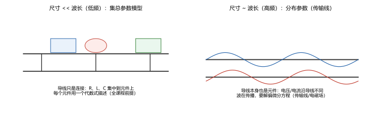
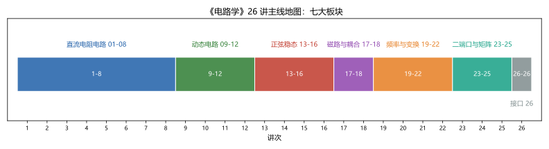
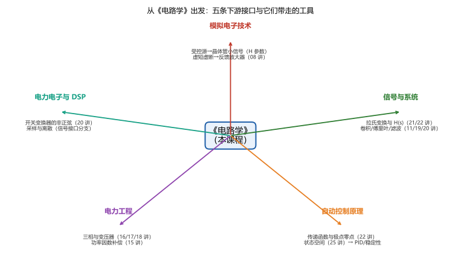

# 第 26 讲：与后续的接口

> **性质声明**：本讲是**地图讲**——**不引入任何新知识**。它只做两件事：① 把整门课的**边界**画清（哪些假设一越界就得换方法）；② 把每个工具**在下游课程里的去处**标出来（"它在那里叫什么、第几章见"）。所有内容都是对 01–25 讲的盘点与指向。
>
> **前置**：全部 01–25 讲。
> **预计时间**：约 1 小时（读 + 盘点作业）。
>
> **本讲回答什么**：
> 1. 电路课和模电的接口在哪？哪些概念会再见面？
> 2. 信号与系统里拉氏变换、傅里叶、卷积怎么"重讲"？
> 3. 控制理论里传递函数、状态方程、频响从哪接上？
> 4. 电力工程里三相、变压器、磁路去哪深入？
> 5. 电路课的边界在哪（分布参数、非线性、电磁场）？
>
> **资产说明**：本讲无新数值结论；`scripts/lec26-01` 只做交付总检（课程资产清单）与三张地图的绘制。截至前一讲，课程产物：26 个md 文件（导览+01–25 讲）、51 个验证脚本、81 个 SVG 图。

## 本讲怎么走（脉络图）

```
引子：主干学完，工具齐全但有点散——本讲画两样东西：边界与路标
  │
  ├─ 1. 边界回顾：集总参数/线性/时不变/准静态——四条前提与越界去向
  ├─ 2. 模电接口：受控源→晶体管、虚短虚断→反馈放大器、非线性登场
  ├─ 3. 信号接口：拉氏/傅里叶/卷积/滤波 → 信号与系统与 DSP
  ├─ 4. 控制接口：传递函数/极点零点/状态空间 → 自动控制原理
  ├─ 5. 电力接口：三相/变压器/磁路/功率因数 → 电力与电机
  └─ 6. 总表与复习路径：26 讲一句话总览 + 怎么用这套笔记
  → 课程完结
```

---

## 1. 边界回顾：这四条前提一破，方法就要换

整门课（01–25 讲）建立在**电路模型**的假设上（01 讲立的地基）。把四条前提与"越界后去哪"一次列清：

| 前提 | 一句话 | 越界后去哪 |
|---|---|---|
| **集总参数** | 电路尺寸 $\ll$ 波长，导线只是"连接" | **分布参数电路**：传输线、微波工程、电磁场——导线本身是元件（$L\,\mathrm{d}x$、$C\,\mathrm{d}x$ 沿长度分布），方程从代数/常微分变成**偏微分** |
| **线性** | 元件伏安关系是直线/线性算子 | **非线性电路**：二极管、晶体管大信号、饱和电感——叠加/齐次全部失效（06 讲的边界），出发点是**模电**与**非线性动力学** |
| **时不变** | 参数不随时间变 | **时变电路**：开关变换器（20 讲谐波是它的近亲）、参数激励电路 |
| **准静态** | 电磁能量通过"路"传输，忽视辐射 | **天线与电磁兼容**：从"路"的观点升级到"场"（麦克斯韦方程） |



> **图 3 怎么读**：左：尺寸远小于波长时，导线只是连接、元件集中（本课程的全部前提）；右：尺寸与波长可比时，电压/电流沿导线各不相同、波在传播——同一根导线要写成分布参数模型（传输线理论，属后续课程）。

**记住这条判据的量级**：工频 50 Hz 的波长约 6000 km——家用电路永远满足集总假设；但当频率升到 MHz–GHz，或在数千公里输电线（16 讲的三相）上，分布参数效应就登场了。

---

## 2. 模电接口：非线性元件与"器件的电路模型"

### 2.1 受控源 → 晶体管的小信号模型

**模电的核心动作**：把一个**非线性器件**（晶体管）在**工作点附近线性化**，得到一张"线性电路"——而线性电路里描述晶体管的那套四参数，正是 24 讲的**H 参数**！共射组态手册上的 $h_{ie}$（输入阻抗）、$h_{re}$（反向电压比）、$h_{fe}$（电流增益）、$h_{oe}$（输出导纳），直接搬进电路方程——**本课程的线性网络理论与二端口参数，就是模电的算术工具**。

### 2.2 虚短虚断 → 反馈放大器

08 讲的理想运放（虚短、虚断、五类电路、负反馈伺服图景）是**反馈放大器**的最小模型；模电里换成真实运放（有限增益、非理想参数——08 讲认识层提过），分析框架不变：反馈网络 → "虚短虚断 + 结点法四步"照常。

### 2.3 直流分析 → 偏置与工作点

模电的"静态工作点"分析 = 用 03–07 讲的全部工具（等效、结点法、戴维南）解一个**直流电路**；而"动态分析"= 在工作点处用小信号模型（上面 §2.1）再解一次。**两次求解，方法都来自本课程**——再加一个新东西：**非线性器件的伏安曲线**（本课程的元件档案只有直线，模电补上曲线）。

### 2.4 频率响应 → 放大器的带宽

19 讲的网络函数 $H(\mathrm{j}\omega)$、带宽、Bode 图，在模电里叫"放大器的频率响应/上限截止频率/增益带宽积"；22 讲的极点位置（含晶体管的寄生电容极点）决定"高频还能不能放大"。

---

## 3. 信号与系统接口：几乎一一对应

这门课里学过的"频域与变换"工具，在信号与系统里几乎原样保留、只是**换框架**：

| 本课程 | 信号与系统里的说法 | 接口讲次 |
|---|---|---|
| 拉普拉斯变换与 s 域模型 | 拉氏变换与**系统函数** $H(s)$（"变换解微分方程"变成主线） | 21 讲 |
| 冲激响应 $h(t)$ 与 $H(s)$ 的对应 | **系统的时域描述 ↔ 频（复频）域描述**；卷积：$y = h * x$ | 11 讲（$s/h$ 互为导数的伏笔）、22 讲 |
| 傅里叶级数（周期波拆谐波） | **傅里叶变换**（非周期信号的频谱）——20 讲"非周期怎么办"的正式答案 | 20 讲 |
| 网络函数的幅频/相频 | **频率响应**与**失真**（幅度失真/相位失真） | 19 讲 |
| RC/RLC 滤波器 | **滤波器设计**（巴特沃斯、切比雪夫等逼近理论） | 19 讲 |
| ——（本课程未涉及） | **采样与离散信号**：$z$ 变换、数字滤波——通往 DSP 与数字控制 | 边界之外 |

**要记住的一句**：本课程给的 $H(s)$、$h(t)$、傅里叶分解，在信号课里不会"重新发明"，只会**更形式化、更一般**（从"电路"扩到"任意线性系统"）。反过来，信号课里抽象的 $H(s)$，随时可以用本课程的**电路**搭出来（综合/实现角度）。

---

## 4. 控制接口：从"电路"到"系统"

控制理论（自动控制原理）与电路课的交点非常直接：

- **传递函数**（transfer function）：就是 22 讲的网络函数 $H(s)$——控制课把它写成"输出拉氏变换/输入拉氏变换"的通用形式；
- **极点零点与稳定性**：22 讲的"左半平面 = 稳定"是控制课的第一条判据；22 讲认识层提到的**劳斯判据、根轨迹**在那里展开成整套方法；
- **频域设计**：19 讲的 Bode 图在控制课里叫"频率法设计"（增益裕度、相位裕度）；
- **状态空间**：25 讲的状态方程 $\dot{\mathbf x} = \mathbf A_s\mathbf x + \mathbf B\mathbf v$ 就是现代控制的**标准入口**——可控性、可观测性、极点配置、卡尔曼滤波全从它开始；
- **反馈**：08 讲运放的负反馈是"闭环控制"的最小案例（误差驱动 → 输出修正）。控制课把这个思想一般化（PID、鲁棒控制）。

**一句话**：控制课把本课程的"电路"抽象成"方块图与传递函数"，方法论升级、根基不变。

---

## 5. 电力接口：强电世界的深入

- **三相与输电**（16 讲）：电力系统分析的第一章——对称分量法（不对称故障分析）、标幺值制、潮流计算都在它的延长线上；
- **变压器与磁路**（17/18 讲）：电机学的入口——旋转磁场（16 讲提过）、异步/同步电机的等效电路（就是变压器的推广）、磁路计算（17 讲）是电机设计的日常；
- **功率因数与补偿**（15 讲）：电力系统的无功管理（并联电容补偿、调相机）与它同源；
- **谐波与电能质量**（20 讲）：非线性负载带来的谐波治理、滤波器设计（19 讲）是电力电子的常规课题；
- **开关变换器**（电力电子）：Buck/Boost 等工作在开关状态——分析手段正是 20 讲的"非正弦周期 + 谐波法"，加 25 讲的状态方程做动态建模。

---

## 6. 总表与复习路径

### 6.1 全课程主线（一张图收束）



> **图 1 怎么读**：26 讲分七大板块——直流电阻电路（01–08）打地基，动态电路（09–12）、正弦稳态（13–16）是两大主干，磁路与耦合（17–18）补上"磁"，频率与变换（19–22）升级"看频率/看复频域"的视角，二端口与矩阵（23–25）做工程抽象与形式化，接口（26）向外指路。

### 6.2 下游接口总图



> **图 2 怎么读**：从本课程出发的五条下游路线与各自带走的工具——模电（受控源与运放）、信号与系统（变换与滤波）、自动控制（传递函数与状态空间）、电力工程（三相/变压器/磁路）、电力电子与 DSP（非正弦与离散）。

### 6.3 怎么用这套笔记（复习路径建议）

本课程每讲留下三样东西，构成一条完整的复习链：

1. **正文**（理解）→ 2. **作业**（自测达标）→ 3. **`scripts/` 里的实跑脚本**（数字证据：重跑一遍，所有结论可观）。

**复习次序建议**（按依赖关系）：

$$\text{01–08（地基）} \to \text{09–12（动态）} \to \text{13–16（正弦）} \to \text{17–18（磁）} \to \text{19–22（频域）} \to \text{23–25（抽象）}$$

**跨讲自查的三个"总览"**（都能一口气答出来，就算通了）：

- **一套方向纪律**（01 讲起）：参考方向 → KCL/KVL 符号 → 相量/复数 → 拉氏域——符号约定升级，纪律不变；
- **两条"状态"线索**：$u_C/i_L$ 的连续性（10 讲）→ 三要素（11 讲）→ 特征根（12 讲）→ 极点（22 讲）→ 状态方程特征值（25 讲）——同一个概念的五次出现；
- **三次"变换"视角**：相量（正弦稳态切片）→ 傅里叶（周期信号分解）→ 拉普拉斯（含初值的完整求解）——层层放宽条件，根都是"把微积分变代数"。

---

*到这里，主干课程结束。这份笔记没有"下一讲预告"了——下一站在你的课程表里：模电、信号与系统、控制、电力、或者你正真想征服的那门课。带着这三样东西走：每一个工具的**边界**（什么时候不能用）、每一个结论的**数字出处**（脚本可复跑）、以及遇事先问"它的**前提**是什么"的习惯——这三样比公式本身耐用得多。*

> **态度表（接口与边界部分）**
>
> | 内容 | 态度 |
> |---|---|
> | 电路模型四条前提与越界去向 | **能复述、能对号** |
> | 集总/分布的判据（尺寸 vs 波长）与量级 | 能估算、知道典型频率门槛 |
> | 五条下游接口的对应工具 | **能对号**（谁带走什么、在第几讲） |
> | 三条跨讲总览（方向/状态/变换） | **能一口气讲下来**（复习过关标志） |
> | 复习路径与脚本复跑法 | **会用**（三样东西的组合） |

---

## 常见误区（本节零新知识，只破误）

1. **"学完电路课就会设计电路了"**（§1–§5）。不全面。本课程给的是**分析方法**；设计还需要器件知识（模电）、工程约束（电力/EMC）、工具链（仿真）——本课程是它们的共同地基，不是全部。
2. **"集总参数假设永远成立"**（§1）。有边界。尺寸与波长可比时（高频、长线）必须换分布参数模型（图 3）。
3. **"下游课程只是把这门课重讲一遍"**（§3–§5）。不是重复：是同一套思想在不同场景的延伸——方法更一般、场景更专门、数学更深；本课程的工具是它们的公共基础。
4. **"非线性只是'另一种误差'"**（§1、§2.3）。不是。非线性是**新现象的来源**（新频率、跳变、混沌），不能用"线性方法 + 修正"糊过去——它是模电与非线性动力学的正式起点。
5. **"矩阵形式/状态方程是纯数学，跟工程无关"**（25 讲）。正相反：它们是 CAA 与现代控制工程的标准语言（25 讲 §3.4 三点用途）。
6. **"这门课的公式背完就够了"**（§6.3）。不够。公式会忘，"前提 + 数字证据 + 复跑能力"不会忘——这也是本课程把每个结论都落成可复跑脚本的原因。

---

## 本讲小结

一页纸的骨架（全局版；每条都能在对应讲次找到细账）：

- **四条前提与边界**：集总（尺寸≪波长）→ 否则分布参数/传输线；线性 → 否则非线性（模电）；时不变 → 否则时变/开关（电力电子）；准静态 → 否则天线/场。
- **模电接口**：受控源→晶体管 H 参数小信号（24 讲）；虚短虚断→反馈放大器（08 讲）；直流工具→偏置（03–07）；频响→带宽（19/22）。
- **信号接口**：拉氏与 $H(s)$（21/22）→ 系统函数；$h(t)$ 与卷积（11/22）；傅里叶（20）；滤波（19）；离散与采样（本课程边界之外）。
- **控制接口**：传递函数（22）；极点零点与稳定（22，劳斯在那边展开）；Bode（19）；状态空间（25）；反馈（08）。
- **电力接口**：三相与系统分析（16）；变压器与电机与磁路（17/18）；功率因数补偿（15）；谐波治理（20）；开关变换器（20+25）。
- **复习三样**：正文（理解）+ 作业（达标）+ 脚本（数字证据）；复习次序 01–08 → 09–12 → 13–16 → 17–18 → 19–22 → 23–25。
- **跨讲三总览**：方向纪律（01→25 一路升级）；状态线索（10→11→12→22→25 同一对象）；变换视角（相量→傅里叶→拉普拉斯，条件层层放宽）。

## 掌握度自测（收官盘点）

- [ ] 我能说出电路模型四条前提与各自的越界学科。
- [ ] 我能把"集总 vs 分布"的判据讲清楚（含频率量级例子）。
- [ ] 我能把五条下游接口与"带走的工具 + 讲次"一一对上。
- [ ] 我能一口气讲"方向纪律"从 01 讲到 25 讲的升级路径。
- [ ] 我能一口气讲"状态量 → 特征根 → 极点 → 状态矩阵特征值"的同一性。
- [ ] 我能一口气讲"相量/傅里叶/拉普拉斯"三次变换的放宽关系。
- [ ] 我能随手复跑任意一讲的脚本并解释输出。
- [ ] 我能对自己诚实地说出：哪几讲我其实只是"看过"、没有做作业。

## 作业（盘点型；无新知识）

> 本讲作业是"自我盘点"——参考答案给的是**方法**，不是唯一答案。

**Q1. 工具地图**：列出本课程中你**能用顺手**的 5 个工具与**还不顺**的 3 个工具（写讲次与名称）。对你的"不顺清单"，给出复查计划（回读哪一节 + 重做哪道作业）。

**参考答案**（要点）：

"不顺"的判断标准建议用"能否对陌生题独立走完流程"（而不是"看过/记得"）。复查计划要具体到**节号 + 脚本**（例如"14 讲 §2 导纳 + `lec14-01` 重跑"）。此题无标准答案，核对点是：清单具体、可执行。

**Q2. 下游检索**：去任意一门下游课程的教材目录（模电/信号/控制/电力任选），找出**至少 3 处**与本章接口表对应的章节，记录书名+章节号。

**参考答案**（要点）：

核对方法：确认该章节的**核心工具**能在本课程找到出处（例：模电"晶体管混合参数"↔ 24 讲 H 参数；信号"卷积"↔ 11/22 讲；控制"劳斯判据"↔ 22 讲认识层）。答案不唯一，核对点是**映射关系成立**。

**Q3. 选型练习**：四个小问题，各选出"用本课程哪一讲的方法最快"，并给一句话理由：

(a) 求一个含受控源二端口的戴维南等效；
(b) 方波电压源加在 RL 上的稳态电流；
(c) 含初值 RLC 的完整响应；
(d) 判断某个有源网络是否稳定。

**参考答案**：

(a) 07 讲（戴维南/诺顿三件套，受控源单独两规矩）；(b) 20 讲（谐波法：逐次相量 + 时域相加）——若只要稳态且许可，也可 19 讲视角；(c) 21 讲（运算法，初值自动）或 12 讲（时域三阻尼 + 初值链）——都合法，运算法更省"分情况"；(d) 22 讲（极点实部——写 H(s)、求根、判三态）。
核对点：选型与理由都与对应讲次的方法边界一致。

**Q4. 边界判断**：以下三个场景分别是否仍可用本课程方法？不能的指出该去哪：

(a) 50 Hz 家用电路；
(b) 5 GHz 的射频电路板走线；
(c) 二极管整流桥输出。

**参考答案**：

(a) 可以（集总假设成立，波长约 6000 km）；(b) 不可以——尺寸与波长可比，需分布参数/传输线与微波工程；(c) 单看"整流波形的分析"可用 20 讲谐波法（把整流波当已知波形），但**二极管本身的建模**是非线性器件——大信号分析属模电/非线性电路。

**Q5. 综合·给自己出题**：从本课程任选**两个不同讲次**，用它们的工具组合出一道**你能自己解出**的题（含数据），并写出你的解答要点。这题没有标准答案——它的目的是验证"你已经能在课程的知识面上自己行走"。

**参考答案**（要点，示范一种组合）：

例：15 讲（功率）+ 22 讲（频响）组合——"某 RLC 串联电路在谐振频率处功率因数为 1，问非谐振频率处的功率因数是多少 Q 的函数？"解答要点：谐振时 $Q$ 已知 $\to$ 写 $Z(\omega) \to \cos\varphi(\omega)$ 表达式 $\to$ 验证 $\cos\varphi|_{\omega_0} = 1$ 与非谐振处的跌落。
核对点：题目自洽（数据能解）、解答只用已教概念、答案可自验（脚本或解析）。

---

*课程完结。资产总检（`scripts/lec26-01` 可复跑）：26 个 md 文件（导览 + 01–26 讲）、51+1 个验证脚本、81+3 张图——每一个数字都有出处，每一个结论都能重跑。*
