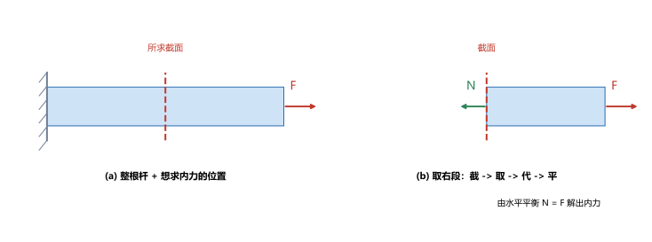
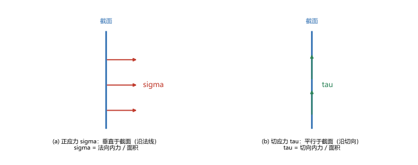
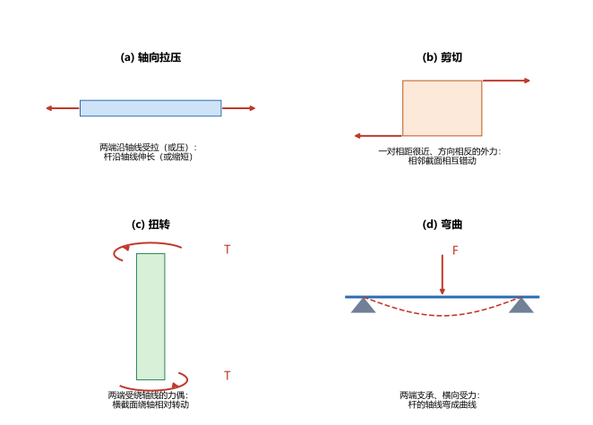

# 第 01 讲：绪论与基本概念

> **前置**：无，这是全课程第一讲。
> **预计时间**：约 2.5 小时（含作业）。
>
> **一句话定位**：材料力学的第一课不是"套公式算构件"，而是"立规矩"——先讲清这门课研究什么、要回答哪三个问题，再建立全课程最基本的一套语言（基本假设、内力、应力、应变），最后认识杆件的四种基本变形。之后每一讲都建立在这一讲之上。
>
> **本讲回答什么**：
> 1. 材料力学到底研究什么？它和理论力学差在哪？
> 2. 为什么要先假设"连续、均匀、各向同性、小变形"？
> 3. 内力是本来就藏在构件里的吗？截面法凭什么能求出它？
> 4. 应力、应变到底是什么？为什么偏偏要把力和变形"摊到单位面积、单位长度"上？
>
> **这一讲有真实验证**：截面法平衡复核、平均正应力与平均线应变的数值核对、单位换算（脚本 `scripts/lec01-01_verify_basics.py`）；另有杆件四种基本变形、截面法四步、正应力与切应力三张示意图（`figures/`）。

---

## 引子：一根吊索会不会断

工地上，一台吊车正用一根钢索吊起一块 2 吨重的混凝土构件。你是现场的技术员，站在下面得替这根钢索回答三个问题：

1. **这根钢索会不会被拉断？** 拉断意味着材料被"撕"开，是灾难。
2. **如果钢索很长，构件吊起来后，钢索被拉长多少？** 拉得太多，构件会晃、会偏、安装对不上位。
3. **如果换成一根又细又长的钢支杆去顶同一个构件，它会不会突然弯折？** 杆并没有被"压碎"，却可能突然向侧面弹出。

有意思的是，决定"会不会断"的，其实不是钢索承受了多大的总拉力。同样吊 2 吨，粗钢索没事、细钢索会断。也就是说，**真正决定安危的是"单位面积上分摊到多大的力"**，而不是力本身。这个"单位面积上的力"，就是本课程最核心的量之一——**应力**。

同样地，决定"拉长多少"的，也不是总伸长量本身，而是**单位长度上伸长了多少**，那叫**应变**。

这一讲就把这两样东西，连同它们的来历，讲清楚。先看这门课的全貌。

---

## 1. 材料力学研究什么

### 1.1 三个必须回答的问题

任何一根受力的构件，工程师都要替它回答三个问题，它们对应三个专业名词：

- **强度**：构件会不会被**破坏**（拉断、剪断、压碎、疲劳断裂等）。判断依据是应力不能超过材料的承受能力。
- **刚度**：构件的**变形**是不是在允许范围内。一台机床的主轴弯太多，加工就不精密；一根梁挠度太大，天花板就会下垂开裂。
- **稳定性**：受压的细长构件，会不会在应力还很低时**突然失稳**（向一侧弯折）。这是"没坏却失效"的一种典型情形。

引子里钢索的问题 1 是强度，问题 2 是刚度，问题 3 是稳定性。整门《材料力学》，说到底就是围绕这三件事展开的。

这三件事里还藏着一对矛盾：**安全**与**经济**。要安全，就把构件做粗做大；但做粗做大费材料、费钱、增重。材料力学的任务，就是在这对矛盾之间，给出有依据的定量判断——既不能拍脑袋加粗，也不能为了省料冒险。

### 1.2 研究对象主要是"杆件"

工程构件的形状千差万别，但按几何特征可以粗略分成三类：

- **杆件**：一个方向的尺寸（长度）远大于另外两个方向（横截面尺寸）。梁、柱、轴、拉杆、钢索都属于此类。
- **板壳**：两个方向尺寸大、一个方向（厚度）小。如楼板、压力容器壁、飞机的蒙皮。
- **块体**：三个方向尺寸差不多。如地基、水坝、闸墩。

**本课程主要研究杆件。** 原因很实际：杆件的受力与变形规律最清晰，工程上用得最多，而且它是进入板壳、块体之前必须打好的基础。后面的每一讲，绝大多数场景都是一根杆。

### 1.3 和理论力学有什么不同

你在理论力学里学过受力分析和平衡条件，那门课把物体当作**刚体**——受力后形状完全不改变。材料力学不一样，它研究的对象是**变形固体**：受力后会发生变形，而且"会不会坏"恰恰和变形、和内部各点的受力状态有关。

一个关键区别在这里：理论力学只问"这个物体整体平衡吗"，材料力学还要问"物体**内部每一点**承受了多大的力"。前者靠几个平衡方程就能解决，后者必须知道构件内部的受力分布。这就逼出了本课程的第一个工具——**截面法**，以及第一个核心量——**应力**。

一句话总结这门课：**把真实构件抽象成可计算的模型，用一套系统的方法算出内部的应力、应变与变形，回答强度、刚度、稳定三个问题。**

---

## 2. 变形固体的四个基本假设

要在构件内部做定量计算，先得给材料的性质做一个统一的约定。真实材料内部很复杂（有晶粒、有缺陷、有孔隙），直接算是不可能的。于是材料力学在最开始做四个假设，把问题简化到可算的程度。**这四个假设不是"事实"，而是"为了能算而立的规矩"**——理解它们，也就能理解本课程结论的边界在哪里。

### 2.1 连续性假设

**假设**：构成构件的材料毫无空隙地充满整个体积。

**为什么需要**：只有这样，内部的力、变形才能用一个连续的函数来描述，微积分（导数、积分）才能用得上。如果材料是散沙一样有大量空隙，就无从谈"某一点"的应力。

### 2.2 均匀性假设

**假设**：构件内各处的材料性质处处相同。

**为什么需要**：这样才能说"这块材料的弹性模量是 200 GPa"，而不用逐点测量。工程材料的力学性能，正是以"均匀"为前提测出来的。

### 2.3 各向同性假设

**假设**：材料沿各个方向的力学性质相同。

**为什么需要**：这样应力与变形的关系才能用一组与方向无关的常数描述。绝大多数金属（钢、铝）接近各向同性；木材、纤维复合材料则明显各向异性，本课程默认不处理这种情形。

### 2.4 小变形假设

**假设**：构件受力后的变形量，与构件本身的尺寸相比非常小。

**为什么需要**：这是四个假设里最"隐蔽"、也最常被忽略的一个。它的作用有两个：一是允许在**未变形的原始尺寸**上列平衡方程（不用去追变形后的几何位置，否则方程会变得极其复杂）；二是让"变形"和"位移"可以用线性关系近似，从而允许把多种载荷的效果**叠加**起来。本课程后面大量的叠加法，全部依赖它。

> **边界提示**：小变形假设一旦不成立（比如薄膜大挠度、细长杆的几何非线性），本课程的许多结论就要修正——那是《弹性力学》或《几何非线性》的内容。现在只需记住：**本课程的所有公式，默认都在"小变形"的前提下成立。**

---

## 3. 外力、内力与截面法

### 3.1 外力怎么分类

作用在构件上的外力，可以按几种方式分类：

- 按作用范围：**体积力**（作用在每个质点上，如重力、惯性力）与**表面力**（作用在表面上，如压力、接触力）。
- 按分布方式：**分布力**（沿长度或面积连续分布，如均布载荷）与**集中力**（理想化地把力集中在一个点上）。
- 按变化快慢：**静载荷**（缓慢施加、不变或变化很慢）与**动载荷**（加载过程伴随加速度或惯性，如冲击）。本课程到第 20 讲才专门处理动载荷。

### 3.2 内力是"被诱发"出来的

假设一根杆原本不受力，内部处于一种自然状态。现在在两端施加拉力，杆被拉长。为什么会拉长？因为**杆的内部各部分之间，产生了一种阻止它被拉开的相互作用的力**——这就是**内力**。

关键认识：**内力不是原本就"藏在"杆里的东西，而是外力施加后，材料内部为了抵抗变形而"被诱发"出来的附加相互作用力。** 外力去掉了，内力也就随之消失。这一点很容易想歪（以为是固有的），是本讲的第一个破误点。

### 3.3 截面法：四步求出内力

内力看不见摸不着，怎么求？用一个几乎"作弊"的办法——**截面法**，把看不见的内力变成看得见的、可以列平衡方程的力。它分四步，简称"截、取、代、平"：

1. **截**：在想要知道内力的位置，用一个假想的截面把构件切开。
2. **取**：留下其中一部分（左段或右段，任选，选好算的那一侧）作为研究对象。
3. **代**：把被切掉的那一部分对留下部分的作用，用力来代替——这个力就是该截面上的**内力**。
4. **平**：对留下的这部分列平衡方程，解出这个内力。

> **图 1 怎么读**：(a) 一根一端固定、另一端受拉力 $F$ 的杆，虚线是"想求内力的截面"；(b) 沿虚线切开后，取右段为研究对象，右端的外力 $F$ 仍在，而截面上多了一个从左段传过来的内力 $N$（绿色箭头）。对右段用水平方向的平衡，就得到 $N = F$。

**一个最小算例**。设外力 $F = 20\ \mathrm{kN}$，方向向右拉动这根杆。取右段列水平平衡：外力 $F$ 向右、截面内力 $N$ 向左，大小相等方向相反，于是

$$N = F = 20\ \mathrm{kN}.$$

这个结论其实非常朴素：**在受到单个轴向拉力的杆上，任意截面处的内力都等于外力**。数值验证见本讲脚本 EXP1，平衡残差 $N - F = 0$，与手算一致。

> **一个必须问的问题**：既然是"取右段"，那取左段会不会得到不同答案？不会。取左段时，外力（来自固定端的反力）与内力依然平衡，得到的内力大小相同、方向相反（作用力与反作用力）。**截面位置可以任意选，取哪一段也可以任意选，只要平衡列得对，内力的大小总是同一个。** 这一点是截面法可信的根本，脚本 EXP1 的"独立复核"正是基于此。

### 3.4 内力会随截面位置变化

注意：上面的结论"任意截面内力都等于外力"，是针对"整根杆只剩一个外力、另一端是固定端"这种最简单情形。如果一根杆上作用着好几个力，那么**不同截面上的内力就可能不同**。把每个截面上的内力沿杆长画成图，就得到**内力图**——这是后面拉压（轴力图）、扭转（扭矩图）、弯曲（剪力图、弯矩图）各讲的核心工具。本讲只需记住"内力随位置可能变化"这个事实，具体怎么作图后面逐个讲。

---

## 4. 应力

### 4.1 为什么不能只看内力

回到引子的问题：同样吊 2 吨，粗钢索没事、细钢索会断。可它们的**内力大小是一样的**（都等于拉力）。区别在哪？在**截面大小**。

可见"内力有多大"还不足以判断安危，还要看"这些内力分布在多大的面积上"。把内力摊到单位面积上，就得到**应力**。定义是：

$$\text{应力} = \frac{\text{内力}}{\text{面积}}.$$

在截面上的某个微小面积 $\Delta A$ 上，若作用的内力为 $\Delta F$，则该点处的应力为内力在该点的**集度**：

$$\sigma = \lim_{\Delta A \to 0} \frac{\Delta F}{\Delta A}.$$

### 4.2 平均应力与逐点应力

上面那个极限式子说的是"某一点"的应力。但在很多简单情形里，内力在截面上是**均匀分布**的（比如轴向拉压的横截面，第 02 讲会解释为什么），此时可以直接用**平均应力**：

$$\sigma = \frac{N}{A},$$

其中 $N$ 是该截面上的内力大小，$A$ 是截面面积。**平均应力只是逐点应力在"均匀分布"这一特殊情形下的简化，不能无条件乱用。** 这是本讲的第二个破误点：应力是"点"的量，不同点可以不同；只有在分布均匀时，平均应力才等于处处相等的应力。

### 4.3 正应力与切应力

内力可以分解成两个方向的分量，对应的应力也有两种：

- **正应力** $\sigma$（sigma）：**垂直于截面**（沿截面法线方向）的应力。它表现为把截面"拉开"或"压紧"。
- **切应力** $\tau$（tau）：**平行于截面**（沿截面切向）的应力。它表现为让截面两侧"错动"。

> **图 2 怎么读**：把截面看成一条竖直的线。(a) 红色箭头垂直于这条线，表示正应力 $\sigma$（法向）；(b) 绿色箭头沿着这条线，表示切应力 $\tau$（切向）。**判据很简单：箭头垂直于截面是正应力，平行于截面是切应力。**

### 4.4 单位：从牛顿到兆帕

应力的单位由"力 ÷ 面积"决定。在国际单位制里，力的单位是牛顿（N, newton），面积的单位是平方米（$\mathrm{m^2}$），所以应力的单位是 $\mathrm{N/m^2}$，这个单位有个专门的名字叫**帕斯卡**（Pa, pascal）：

$$1\ \mathrm{Pa} = 1\ \mathrm{N/m^2}.$$

1 Pa 是一个很小的应力，工程上更常用**兆帕**（MPa）：

$$1\ \mathrm{MPa} = 10^6\ \mathrm{Pa}.$$

有一个换算关系必须记牢，因为它能省掉大量单位换算的麻烦：**面积若用平方毫米（$\mathrm{mm^2}$）计，力用牛顿，算出来的应力单位恰好就是兆帕**：

$$1\ \mathrm{MPa} = 1\ \mathrm{N/mm^2}.$$

**一个算例**：$N = 20\ \mathrm{kN} = 20000\ \mathrm{N}$，$A = 200\ \mathrm{mm^2}$，则

$$\sigma = \frac{20000\ \mathrm{N}}{200\ \mathrm{mm^2}} = 100\ \mathrm{N/mm^2} = 100\ \mathrm{MPa}.$$

脚本 EXP3 核对：$100\ \mathrm{MPa} = 100\ \mathrm{N/mm^2} = 1.0\times10^8\ \mathrm{Pa}$。

再看"同样内力、不同截面"的对比（脚本 EXP2，$N = 20\ \mathrm{kN}$）：

| 截面面积 $A$ | 平均正应力 $\sigma = N/A$ |
|---|---|
| $100\ \mathrm{mm^2}$（细） | $200\ \mathrm{MPa}$ |
| $200\ \mathrm{mm^2}$ | $100\ \mathrm{MPa}$ |
| $400\ \mathrm{mm^2}$（粗） | $50\ \mathrm{MPa}$ |

截面越细，应力越大，越接近（甚至超过）材料的承受上限——这就从数值上解释了"为什么细钢索更危险"。**这就是应力这个量的用途：它把"内力大小"和"截面大小"合到一起，成为一个可以直接和材料承受能力作比较的量。**

---

## 5. 应变

### 5.1 线应变

应力描述"单位面积上分摊多少力"，那"变形程度"用什么描述？同样用"摊到单位"的思路——把总变形摊到单位长度上，就是**线应变**（正应变）$\varepsilon$（epsilon）：

$$\varepsilon = \frac{\Delta L}{L},$$

其中 $L$ 是原长，$\Delta L$ 是伸长量（伸长为正、缩短为负）。

**关键点：应变是无量纲的。** 因为它是"长度 ÷ 长度"，单位约掉了。这也符合直觉：它描述的是"相对伸长程度"，与杆有多长无关。

**一个算例**：一根长 $L = 500\ \mathrm{mm}$ 的杆，受拉后伸长 $\Delta L = 0.25\ \mathrm{mm}$，则

$$\varepsilon = \frac{0.25\ \mathrm{mm}}{500\ \mathrm{mm}} = 5\times10^{-4}.$$

脚本 EXP4 核对得到同样的 $5.0\times10^{-4}$。钢材在弹性范围内的应变，量级通常就在 $10^{-3}$ 以下，这个数算合理。

### 5.2 切应变

对应切应力，描述"错动程度"的应变叫**切应变**（剪应变）$\gamma$（gamma）：原来相互垂直的两条微小线段，受力后夹角发生了改变，这个**夹角的改变量**（用弧度计）就是切应变。

### 5.3 应变和应力一样，是"点"的量

和应力一样，严格的应变也是逐点定义的——不同位置、不同方向的应变可以不同。$\Delta L/L$ 是**平均线应变**，只有在均匀变形时才等于处处相等的应变。

> **先记下，后面展开**：应力与应变之间是什么关系？它们怎么由外力算出来？（这正是接下来几讲的主题。）本讲只需要建立"这两个量是什么、为什么是它们"的认识，不需要会用它们算具体问题——那是第 02 讲以后的事。

---

## 6. 杆件的基本变形形式

工程中杆件的受力方式千变万化，但归纳起来，**杆件的变形只有四种基本形式**，其他复杂变形大多是这四种的组合。认识这四种形式，等于拿到了整门课的地图。

> **图 3 怎么读**：四张小图分别对应四种基本变形。(a) 拉压：两端沿轴线受拉，杆沿轴线伸长；(b) 剪切：一对相距很近、方向相反的外力，使相邻截面相互错动；(c) 扭转：两端受绕轴线的力偶，横截面绕轴相对转动；(d) 弯曲：像梁一样两端支承、中间受横向力，轴线弯成曲线。

| 基本变形 | 外力特点 | 主要内部效应 | 后续讲次 |
|---|---|---|---|
| 轴向拉伸/压缩 | 外力沿杆轴线 | 横截面正应力、轴线伸长缩短 | 02、03 |
| 剪切 | 一对相错很近的反向力 | 截面切应力、截面错动 | 04 |
| 扭转 | 绕轴线的力偶 | 横截面切应力、截面绕轴转动 | 05、06 |
| 弯曲 | 横向力（或力偶） | 横截面正应力与切应力、轴线弯曲 | 08-11 |

**组合变形**：当一根杆件同时发生两种以上基本变形时（比如既受弯又受扭的传动轴），就叫组合变形。处理办法是"拆成基本变形分别算、再叠加"——这依赖第 2.4 节的小变形假设。组合变形在第 16 讲专门处理。

**这门课的地图，可以用一句话概括**：**一根杆件被拉、被剪、被扭、被弯、被压，各自的应力、应变、变形怎么算，再用强度、刚度、稳定三个判据去判断它安全不安全。** 接下来每一讲，都是在把这句话展开。

---

## 7. 本讲的心智模型

把这一讲压缩成一条可以随身带走的思考线索：

> **构件会不会坏，不取决于它受多大力，而取决于"单位面积上分摊多大力"（应力）和"单位长度上变形多少"（应变）。**
>
> 要求应力和应变，先得有内力；要求内力，用截面法（截、取、代、平）把看不见的内力变成可列平衡方程的力。而这一切之所以能算，是因为一开始就约定好了四个基本假设——尤其是"小变形"。

遇到任何一根受力构件，按这个顺序想：
1. 它承受哪几个基本变形（拉压？剪切？扭转？弯曲？还是组合）？
2. 用截面法把待求位置的内力求出来。
3. 用"内力摊到截面"得到应力、用"变形摊到长度"得到应变。
4. 最后拿应力/变形去和标准的限值比较，回答强度、刚度、稳定三个问题。

第 2、3 步的"怎么求"是后面每一讲要教的具体技术；第 4 步的"限值从哪来"要到第 03 讲讲材料性能时才给出。

---

## 8. 小结

- 材料力学回答三个问题：**强度**（会不会断）、**刚度**（变形是否超限）、**稳定性**（受压细长杆会不会突然失稳），并在"安全"与"经济"之间做定量权衡。
- 研究对象主要是**杆件**（长度远大于横截面尺寸）。与理论力学不同，材料力学研究**变形固体**，关心构件**内部每一点**的受力与变形。
- 变形固体有四个基本假设：**连续性、均匀性、各向同性、小变形**。它们是"为了能算而立的规矩"；其中小变形假设是后面大量叠加法的前提。
- **内力**由外力诱发，不是固有的。**截面法**四步（截、取、代、平）把它变成可列平衡方程的力；内力的大小与截面位置、取哪一段无关。
- **应力** = 内力集度（单位面积的力），正应力 $\sigma$ 垂直于截面、切应力 $\tau$ 平行于截面；单位为 Pa，工程常用 MPa，且 $1\ \mathrm{MPa} = 1\ \mathrm{N/mm^2}$。应力是"点"的量，平均应力只在均匀分布时成立。
- **应变** = 单位长度的变形（线应变 $\varepsilon=\Delta L/L$，无量纲）或角度的改变（切应变 $\gamma$）。同样是逐点的量。
- 杆件只有**四种基本变形**：轴向拉压、剪切、扭转、弯曲；两种以上同时出现即**组合变形**。

---

## 9. 作业

### 基础

**Q1. 概念辨析**：有人说："内力是构件内部本来就存在的一种力，外力只是让它显现出来。"这个说法对吗？为什么？

**参考答案**：

不对。**内力是由外力诱发、为了抵抗变形而产生的附加相互作用力**，不是固有存在的。判定依据：不加外力时，构件内部各部分之间即便有相互作用，也不构成这里所说的"内力"；去掉外力，内力随之消失。把内力当成固有物，会直接违背第 3.2 节的来历。

**Q2. 截面法**：一根杆受轴向拉力 $F = 30\ \mathrm{kN}$，横截面面积 $A = 150\ \mathrm{mm^2}$。求任一横截面上的轴力，以及该截面上的平均正应力。

**参考答案**：

用截面法（截、取、代、平）：取任一截面，一侧面只剩外力 $F$，平衡给出轴力 $N = F = 30\ \mathrm{kN}$。
平均正应力：$\sigma = N/A = 30000\ \mathrm{N} / 150\ \mathrm{mm^2} = 200\ \mathrm{N/mm^2} = 200\ \mathrm{MPa}$。
验算：用 $1\ \mathrm{MPa} = 1\ \mathrm{N/mm^2}$ 反向核对，$200\ \mathrm{MPa} \times 150\ \mathrm{mm^2} = 30000\ \mathrm{N} = 30\ \mathrm{kN}$，与轴力吻合。

**Q3. 单位换算**：（1）把 $250\ \mathrm{MPa}$ 写成 $\mathrm{N/mm^2}$ 与 Pa；（2）把 $0.5\ \mathrm{GPa}$（$1\ \mathrm{GPa}=10^3\ \mathrm{MPa}$）写成 MPa。

**参考答案**：

(1) $250\ \mathrm{MPa} = 250\ \mathrm{N/mm^2} = 2.5\times10^8\ \mathrm{Pa}$。
(2) $0.5\ \mathrm{GPa} = 500\ \mathrm{MPa}$。
验算：每一步都用 $1\ \mathrm{MPa} = 10^6\ \mathrm{Pa} = 1\ \mathrm{N/mm^2}$ 逐个核对，三次换算保持一致。

### 提高

**Q4. 为什么细杆更危险**：两根材料相同、长度相同的杆，受到同样大小的轴向拉力。一根横截面积 $A_1 = 120\ \mathrm{mm^2}$，另一根 $A_2 = 300\ \mathrm{mm^2}$。用应力语言解释为什么细杆更容易出问题，并算出两根杆的应力比。

**参考答案**：

两根杆的轴力 $N$ 相同（都等于拉力），但应力 $\sigma = N/A$ 与面积成反比。
应力比 $\sigma_1 : \sigma_2 = A_2 : A_1 = 300 : 120 = 2.5$，即细杆的应力是粗杆的 2.5 倍。
验算：设 $N = 30\ \mathrm{kN}$，则 $\sigma_1 = 30000/120 = 250\ \mathrm{MPa}$、$\sigma_2 = 30000/300 = 100\ \mathrm{MPa}$，比值 $250/100 = 2.5$，与面积反比一致。细杆应力更大，更早逼近材料上限，所以更危险。

**Q5. 平均线应变**：一根长 $2\ \mathrm{m}$ 的杆受拉后伸长 $1.2\ \mathrm{mm}$。（1）求平均线应变；（2）若应变再增大一倍，伸长量是多少？

**参考答案**：

(1) $\varepsilon = \Delta L/L = 1.2\ \mathrm{mm} / 2000\ \mathrm{mm} = 6\times10^{-4}$（无量纲）。
(2) 应变翻倍即 $\varepsilon' = 1.2\times10^{-3}$，则 $\Delta L' = \varepsilon' L = 1.2\times10^{-3} \times 2000\ \mathrm{mm} = 2.4\ \mathrm{mm}$（也就等于原伸长量翻倍）。
验算：先把长度统一成 mm 再取比值，避免 m 与 mm 混用——这是单位最容易出错的地方。

**Q6. 假设的边界**：如果"小变形假设"不成立（构件变形很大），本课程里哪些结论会变得不可靠？说出至少两个方向即可。

**参考答案**：

(1) "在未变形原始尺寸上列平衡方程"不再成立，需要考虑变形后的几何位置，方程不再线性；
(2) 依赖叠加原理的结论（多种载荷效果相加）失效，因为变形与载荷不再成正比关系；
(3) 各种"近似直线/近似小角度"的公式（如后面弯曲的挠曲线近似、压杆小变形假设）都需要修正。
验算（自检方向）：凡是在推导中默认了"变形后几何≈原几何"的地方，都是小变形假设在起作用；找这些地方即可判断结论是否受影响。

### 综合

**Q7. 完整走一遍（回扣吊索问题）**：一根吊索横截面积 $A = 80\ \mathrm{mm^2}$，吊起的构件重 $G = 12\ \mathrm{kN}$（吊索自身重量忽略，视为轴向受拉）。（1）求吊索截面上的轴力与平均正应力；（2）现在要用"应力"判断这根吊索"会不会断"，还缺什么信息？

**参考答案**：

(1) 截面法得轴力 $N = G = 12\ \mathrm{kN} = 12000\ \mathrm{N}$；平均正应力 $\sigma = N/A = 12000/80 = 150\ \mathrm{N/mm^2} = 150\ \mathrm{MPa}$。
(2) 缺**材料的承受能力上限**——也就是这种钢材"多大应力还算安全"。本讲只能算出实际应力是 150 MPa，至于它是否安全，要把 150 MPa 和材料允许的应力上限作比较，而后者要到第 03 讲讲材料力学性能（强度指标与许用应力）时才能确定。
验算：(1) 反代 $\sigma A = 150\ \mathrm{MPa} \times 80\ \mathrm{mm^2} = 12000\ \mathrm{N} = 12\ \mathrm{kN}$，与轴力吻合。

**Q8. 开放简答**：请各举一个生活中"控制设计的不是强度、而是刚度或稳定性"的例子，并说明理由。

**参考答案**：

- **刚度控制**：长跨度的阳台护栏、大跨度的楼板——它们远没到"断裂"的程度，但挠度（下垂量）超标就不能用，控制条件是变形不能太大。
- **稳定性控制**：细长的脚手架立杆、液压千斤顶的活塞杆——压应力可能还很低，但杆越长越细，越会在远低于强度极限时就突然失稳弯折，控制条件是临界载荷。
要点：判断"控制条件"时，问"如果只做粗一点点就够，那真正卡住设计的是哪一条"，答案往往不是强度。
验算（自检方向）：这三个词对应本讲开头三张"考卷"——强度问"断不断"、刚度问"变形多大"、稳定问"会不会突然失稳"，举例子时先明确是哪一张考卷。

---

*下一讲预告——第 02 讲《轴向拉压的内力与应力》：本讲立好了语言（内力、应力、应变），但还没解决"怎么系统地把内力算出来、画成图"。下一讲从最基本的轴向拉压入手，正式讲轴力与轴力图，并给出横截面、斜截面上应力的完整公式。*
