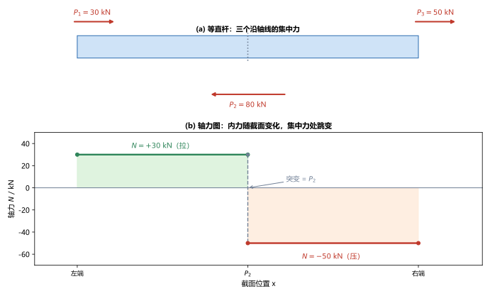
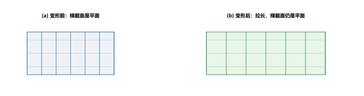
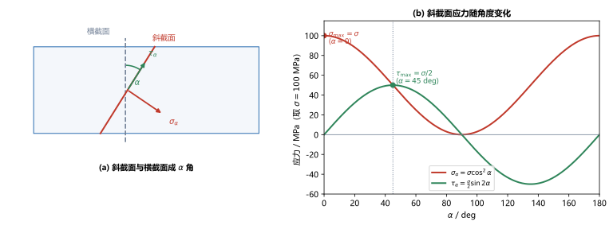

# 第 02 讲：轴向拉压的内力与应力

> **前置**：第 01 讲（内力、截面法、应力与应变、杆件四种基本变形）。
> **预计时间**：约 2.5 小时（含作业）。
>
> **一句话定位**：第 01 讲立好了"内力、应力"这两个词，本讲开始真正使用它们——从最基本的轴向拉压入手，把"轴力怎么求、轴力图怎么画、横截面应力为什么等于 $N/A$、斜截面上又为什么冒出切应力"这四件事一次讲透。
>
> **本讲回答什么**：
> 1. 轴力的正负怎么定？一根杆上有好几个力，内力图怎么画？
> 2. 横截面上应力真的处处相等吗？$\sigma = N/A$ 凭什么成立？
> 3. 斜着切一刀，为什么冒出了切应力？它在哪个方向最大？
>
> **这一讲有真实验证**：轴力图、横截面正应力、斜截面应力随角度变化的数值核对（脚本 `scripts/lec02-01_verify_axial.py`）；另有轴力图、平面假设、斜截面应力三张图（`figures/`）。

---

## 引子：一根杆上三个力，哪里最危险

一根等直的杆，沿轴线方向作用着三个力：

- 左端：$P_1 = 30\ \mathrm{kN}$，向右拉；
- 中间某处：$P_2 = 80\ \mathrm{kN}$，向左推；
- 右端：$P_3 = 50\ \mathrm{kN}$，向右拉。

三个力沿同一条直线，总和 $30 - 80 + 50 = 0$，所以整根杆是平衡的。现在问：

1. **杆内部各截面上的内力是多少？** 左半段和右半段会不会不一样？
2. **哪个截面最危险？**（危险 = 应力最大 = 最可能先坏。）
3. 如果把这根杆斜着切一刀，切面上的**应力**又是多少？

第 01 讲只给了"内力、应力"这两个词的定义，还没真正算过。本讲就用这根杆把这几件事算清楚，并顺手解决一个反直觉的问题：**一根只受轴向拉力的杆，斜着切开后，切面上居然不仅有正应力，还有切应力。**

---

## 1. 轴向拉压：受力与变形

轴向拉伸与压缩（简称轴向拉压），是最简单的一类受力，它的特征是：

- **外力的合力沿杆的轴线**。像引子里那样几个力都沿同一条轴线（同向或反向），就属于这一类。
- **杆件沿轴线方向伸长或缩短**。拉力使杆变长，压力使杆变短。

在这种受力下，杆的横截面上只有**沿轴线方向的内力**（没有横向内力），所以横截面上只有**正应力**（第 4 节）。这是所有后续变形（剪切、扭转、弯曲）的起点，也是考试里出现频率最高的题型。

---

## 2. 轴力与符号约定

### 2.1 什么是轴力

在第 01 讲，截面法求出的内力是截面上"被切去部分对留下部分的作用合力"。在轴向拉压里，这个合力正好**沿杆的轴线方向**，所以给它一个专门的名字——**轴力**，记作 $N$（Normal force，法向力/轴力）。

> **为什么叫"轴"力**：因为它沿杆的**轴线**方向。后面讲弯曲时，横截面上还会有垂直于轴线的内力（剪力），那是另一回事；本讲只处理轴力。

### 2.2 符号约定：拉正压负

内力有正有负，必须先约定符号。轴向拉压的约定是：

> **使杆件受拉（内力背离截面，把杆"往两头拉"）的轴力为正；使杆件受压（内力指向截面，把杆"往中间压"）的轴力为负。**

一句话记忆：**拉正压负**。

> **为什么要约定**：只有先约定，$N$ 的正负才有确切含义——正的读作"这段在受拉"，负的读作"这段在受压"。否则一个 $-50\ \mathrm{kN}$ 就无从解读。这和参考方向的意义一样：符号是"约定 + 读数"的组合。

### 2.3 用截面法求轴力（标准操作）

轴力怎么求？用第 01 讲的截面法，针对轴向拉压简化为三步：

1. **截 + 取**：在所求位置切开，取其中一侧（左段或右段，取好算的一侧）。
2. **代**：在截面上画出轴力 $N$，方向**统一先假设为拉力**（即背离截面朝外）。
3. **平**：对这一侧列轴向平衡方程，解出 $N$。

解出的 $N$ 若为正，说明这段确实受拉；为负，说明实际受压（不必回头改图，读数负数即可）。

> **一个更快的等价说法**（熟练后可用）：**某截面上的轴力，等于该截面某一侧全部外力沿轴向的代数和**（规定与轴力同向、拉为正）。取哪一侧都行，结果相同——这正是第 01 讲"截面法结果与取哪一侧无关"的直接应用。

---

## 3. 轴力图

### 3.1 为什么要画轴力图

一根杆上如果只有一个力，那任意截面轴力都等于这个力。但像引子里三个力那样，**不同段的轴力可能不同**：集中力作用处，轴力会突然跳变。把每段的轴力沿杆长画出来，就是**轴力图**。

### 3.2 作法

以引子的杆为例。规定向右为正、拉力为正。

- **左段**（$P_2$ 的左侧）：取任意截面，其左侧只有 $P_1 = 30\ \mathrm{kN}$（向右，把杆往右拉），故 $N = +30\ \mathrm{kN}$（受拉）。
- **右段**（$P_2$ 的右侧）：取某截面，其左侧外力为 $P_1 + P_2 = 30 - 80 = -50\ \mathrm{kN}$，故 $N = -50\ \mathrm{kN}$（受压）。

数值核对见脚本 EXP1。把结果画成图：

> **图 1 怎么读**：上半部是杆与三个集中力；下半部是轴力图——横轴是截面位置，纵轴是轴力 $N$。左段轴力恒为 $+30\ \mathrm{kN}$（水平线，在零线上方），右段恒为 $-50\ \mathrm{kN}$（水平线，在零线下方），在集中力 $P_2$ 处从 $+30$ 跳到 $-50$。

### 3.3 突变规律

看图可以发现一条规律：

> **在集中力作用处，轴力图发生突变（跳跃）；跳跃量等于该处集中力的代数值。**

验证：$P_2$ 处从 $+30$ 跳到 $-50$，跳跃量 $= -50 - 30 = -80\ \mathrm{kN}$，恰好等于该处的集中力 $P_2 = -80\ \mathrm{kN}$（取向右、拉力为正的同一套符号）。脚本 EXP1 打印的突变值 $-80.0\ \mathrm{kN}$ 与此一致。

这条规律是画图时的**最快自检**：画完轴力图，在每个集中力处量一下跳跃量，对不上就说明某段算错了。

---

## 4. 横截面上的正应力

### 4.1 从内力到应力，缺一个"分布"

有了各截面的轴力 $N$，就能求正应力了吗？还不能。因为 $\sigma = N/A$ 成立的前提是**应力在截面上均匀分布**，而"是否均匀"是一个需要论证的假设，不是自动成立的（回想第 01 讲：应力是逐点的量，$\sigma=N/A$ 只是平均应力）。

那么，轴向拉压时横截面上应力到底均不均匀？要回答它，得先看变形。

### 4.2 平面假设

对杆做拉伸实验，可以观察到这样一个现象：**原来垂直于轴线的横截面，变形后仍然是平面，只是平行地移动了一段距离；而且平面上任意两个横截面的形状、大小都不变。**

这就是**平面假设**：变形前为平面的横截面，变形后仍为平面（且仍垂直于轴线）。

> **图 2 怎么读**：(a) 变形前，杆上画好的竖直线代表横截面，都是平面；(b) 受拉变长后，这些竖直线仍然是竖直的平面，只是间距被拉大。**横截面没有"歪"也没有"鼓"，仍是平面。**

### 4.3 应力均匀：σ = N/A 的来历

从平面假设能推出一条关键结论。设想把杆看成无数根沿轴线排列的纵向"细纤维"：

- 平面假设保证**所有纤维的伸长量相同**（因为横截面整体平行移动，两端截面间每根纤维的原始长度和伸长量都一样）；
- 所有纤维原长相同、伸长相同，故**线应变 $\varepsilon$ 处处相同**；
- 材料相同（均匀性假设），同样的应变对应同样的应力，故**各点正应力相同**——即**应力沿横截面均匀分布**。

于是，若横截面面积为 $A$、轴力为 $N$，均匀分布的正应力就是：

$$\boxed{\sigma = \frac{N}{A}}.$$

> **一处需要点明的先后**：上面"应变相同 $\to$ 应力相同"这一步，默认了材料有确定的"应力-应变"对应关系（同样的应变给同样的应力）。这个关系（胡克定律）在第 03 讲才正式给出；本讲先用"实验观察到应力均匀"来接住这一步，等 03 讲把材料关系补上，这条链就完全闭合了。

**正应力的正负**：拉应力为正、压应力为负，与轴力一致。所以引子的杆：左段 $\sigma = \dfrac{30\times10^3\ \mathrm{N}}{250\ \mathrm{mm^2}} = +120\ \mathrm{MPa}$（拉），右段 $\sigma = \dfrac{-50\times10^3\ \mathrm{N}}{250\ \mathrm{mm^2}} = -200\ \mathrm{MPa}$（压，取 $A = 250\ \mathrm{mm^2}$）。脚本 EXP2 核对一致。

### 4.4 圣维南原理：端部附近是例外（认识层）

平面假设在**离加力点稍远**的地方成立得很好，但在**集中力作用点附近**并不成立——那里加载方式的具体细节会让应力分布很复杂（比如用钳子夹住杆端，夹口附近应力会很不均匀）。

**圣维南原理**（Saint-Venant's principle）说的是：加力方式的具体细节，只影响**加力点附近**的局部应力分布；距离加力点超过横截面尺寸量级之后，应力分布就趋于均匀，与加载细节无关。

> **现在只需知道**：$\sigma = N/A$ 算的是"远离端部"的常规截面；端部附近要另作处理，本课程不深究。这条原理也是后面很多"局部效应可以忽略"的依据。

### 4.5 危险截面与危险点

回到引子的问题 2：**哪个截面最危险？** 危险 = 应力最大（最可能先坏）。

对等直杆、单一材料，$\sigma = N/A$ 中 $A$ 相同，所以**轴力绝对值最大的截面应力最大**，就是危险截面。引子的杆右段 $|\sigma| = 200\ \mathrm{MPa} > 120\ \mathrm{MPa}$，危险截面在**右段**。

若杆是变截面的（各段 $A$ 不同），则要比 $|N|/A$，最大处才是危险截面——不能只看轴力大的地方（这一点在作业里会用到）。

---

## 5. 斜截面上的应力

### 5.1 一个问题：斜切一刀，应力还是 N/A 吗

前面算的都是**垂直于轴线**的横截面。如果斜着切一刀呢？设斜截面与横截面成夹角 $\alpha$，那么这个斜切面上的应力是多少？

直觉上会以为"还是 $\sigma = N/A$"，但不对——因为斜面的**面积变了**，而且内力在斜面上的**方向也变了**（不再垂直于斜面）。

> **图 3 怎么读**：(a) 杆内的横截面（竖虚线）与一个斜截面（红线），两者成夹角 $\alpha$；斜截面上既有垂直于它的正应力 $\sigma_\alpha$（红色箭头），又有沿它的切应力 $\tau_\alpha$（绿色箭头）。(b) 两者随 $\alpha$ 变化的曲线，后面会算出定量的结果。

### 5.2 推导：把轴力分解到斜面上

取一根受拉杆，横截面上正应力 $\sigma = N/A$。用一个与横截面成 $\alpha$ 的斜截面切开，取其中一段。

**第一步，求斜面上的内力。** 由该段的轴向平衡，斜截面上的**总内力仍然是 $N$**（大小不变，方向仍沿轴线）。

**第二步，把内力 $N$ 沿斜面的法向和切向分解。**

- 法向分量：$N\cos\alpha$；
- 切向分量：$N\sin\alpha$。

**第三步，除以斜截面的面积。** 斜截面面积与横截面面积的关系是 $A_\alpha = \dfrac{A}{\cos\alpha}$（斜着切，面积变大）。于是：

- 正应力（垂直于斜面）：
  $$\sigma_\alpha = \frac{N\cos\alpha}{A_\alpha} = \frac{N\cos\alpha}{A/\cos\alpha} = \frac{N}{A}\cos^2\alpha = \sigma\cos^2\alpha .$$
- 切应力（沿斜面）：
  $$\tau_\alpha = \frac{N\sin\alpha}{A_\alpha} = \frac{N}{A}\sin\alpha\cos\alpha = \frac{\sigma}{2}\sin 2\alpha .$$

两个公式一起记：

$$\boxed{\sigma_\alpha = \sigma\cos^2\alpha,\qquad \tau_\alpha = \frac{\sigma}{2}\sin 2\alpha}.$$

其中 $\sigma = N/A$ 是横截面上的正应力。

> **关于 $\tau_\alpha$ 的正负**：上面两式给出的是**大小**随角度的变化。切应力既有大小也有方向，本课程统一规定：**使所在微元产生顺时针转动趋势的切应力为正**。本讲先掌握其大小与极值；符号与方向在第 13 讲应力状态里配合应力圆一起正式处理。

数值核对见脚本 EXP3（取 $\sigma = 100\ \mathrm{MPa}$）：

| $\alpha$ | $\sigma_\alpha = \sigma\cos^2\alpha$ | $\tau_\alpha = \dfrac{\sigma}{2}\sin 2\alpha$ |
|---|---|---|
| $0^\circ$ | $100\ \mathrm{MPa}$ | $0$ |
| $30^\circ$ | $75\ \mathrm{MPa}$ | $43.3\ \mathrm{MPa}$ |
| $45^\circ$ | $50\ \mathrm{MPa}$ | $50\ \mathrm{MPa}$ |
| $60^\circ$ | $25\ \mathrm{MPa}$ | $43.3\ \mathrm{MPa}$ |
| $90^\circ$ | $0$ | $0$ |

### 5.3 两个极值

从公式（或上图曲线）直接读出两个极值：

- **正应力最大**：$\alpha = 0^\circ$（即横截面）时 $\sigma_\alpha = \sigma$，等于横截面正应力，达到最大。
- **切应力最大**：$\alpha = 45^\circ$ 时 $\tau_\alpha$ 达到最大，$\tau_{\max} = \dfrac{\sigma}{2}$（此时 $\sigma_\alpha = \sigma/2$）。

> **结论**：**轴向拉压时，横截面（$\alpha=0^\circ$）上正应力最大；与轴线成 $45^\circ$ 的斜面上切应力最大，等于横截面正应力的一半。** 脚本 EXP3 给出的极值：$\sigma_\alpha^{\max} = 100\ \mathrm{MPa}$（$\alpha=0$），$\tau_\alpha^{\max} = 50\ \mathrm{MPa}$（$\alpha=45^\circ$），与公式一致。

> **一个有用的副产品**：脚本 EXP4 顺带验证了一个恒等式——$\left(\sigma_\alpha - \dfrac{\sigma}{2}\right)^2 + \tau_\alpha^2 = \left(\dfrac{\sigma}{2}\right)^2$（实测最大偏差 $2\times10^{-12}$）。这说明斜截面上的 $(\sigma_\alpha, \tau_\alpha)$ 始终落在**同一个圆**上，圆心在 $\sigma/2$、半径 $\sigma/2$。这个圆就是第 13 讲的**应力圆**，本讲先记下这个线索。

### 5.4 两个工程现象的解释

斜截面上切应力最大这件事，能解释两个常见现象：

- **塑性材料（如低碳钢）拉伸时，会出现与轴线成约 $45^\circ$ 的滑移线**，最后常沿 $45^\circ$ 方向被"剪"断。原因：塑性材料抗剪能力弱于抗拉，而 $45^\circ$ 面上切应力最大，就先在那里发生滑移。
- **脆性材料（如铸铁）拉伸时，几乎沿横截面（$0^\circ$）平齐断开**。原因：脆性材料抗拉能力弱，而横截面（$\alpha=0^\circ$）上正应力最大，就沿那里被拉断。

**同样的公式，解释了两种材料截然不同的破坏方式**——这正是"看懂应力分布"的用处。

### 5.5 一个伏笔：切应力不会单独出现

斜截面上出现切应力后，还有一个更细的结论：**在通过同一点、相互垂直的两个面上，切应力大小相等、方向都指向（或都背离）这两个面的交线**——这叫作**切应力互等定理**。它后面会在应力状态（第 13 讲）里正式登台，本讲只需记住"切应力成对出现"这个事实。

---

## 6. 应力集中（认识层）

$\sigma = N/A$ 还有一个重要的例外情形：**当截面突然变化时**（比如杆上有孔、有槽、有台阶），孔边或台阶根部的局部应力会远高于按 $N/A$ 算出的平均值——这个现象叫**应力集中**。

工程上用**理论应力集中系数** $K = \dfrac{\sigma_{\max}}{\sigma_{\text{名义}}}$ 来量化，其中 $\sigma_{\text{名义}}$ 是按净截面（扣掉孔洞）算的平均应力。$K$ 通常大于 1，圆孔的 $K$ 可接近 3。

> **现在只需知道**：应力集中是"局部现象"，但正是它常常决定构件从哪里先坏（尤其是疲劳）。如何在设计里处理它，第 03 讲讲材料性能与强度计算时会展开。

---

## 7. 本讲的心智模型

把这一讲压缩成一条操作用的主线：

> **轴向拉压题的通用解法：先把轴力求出来（截面法，拉正压负），画成轴力图看清分布，再用 $\sigma = N/A$ 算正应力、用 $\sigma\cos^2\alpha$、$\frac{\sigma}{2}\sin2\alpha$ 算任意斜面上的应力。**

遇到一道轴向拉压题，按这个顺序走：

1. **求轴力**：逐段用截面法（或"某截面一侧外力代数和"），定出每段的 $N$ 与符号。
2. **画轴力图**：分段画，在集中力处检查跳跃量是否等于该处集中力。
3. **找危险截面**：等直杆看 $|N|$ 最大处；变截面看 $|N|/A$ 最大处。
4. **算应力**：横截面用 $\sigma=N/A$；若问斜截面，用 $\sigma\cos^2\alpha$ 与 $\frac{\sigma}{2}\sin2\alpha$（记住 $45^\circ$ 处切应力最大）。

---

## 8. 小结

- 轴向拉压的特征：外力合力沿轴线，杆沿轴线伸长（压短），横截面上只有正应力。
- **轴力 $N$** 是横截面上沿轴线方向的内力；符号约定**拉正压负**。用截面法求：截、取，把 $N$ 先假设为拉，列轴向平衡解出。
- **轴力图**：把各段轴力沿杆长画出。**集中力处轴力突变，跳跃量等于该处集中力的代数值**（画完用它自检）。
- **横截面正应力** $\sigma = N/A$：由**平面假设**（横截面变形后仍是平面）推出各纵向纤维伸长相同 $\to$ 应变相同 $\to$ 应力均匀。仅适用于**远离加力点**的常规截面（圣维南原理）；端部附近是例外。
- **危险截面**：等直杆取 $|N|$ 最大处，变截面取 $|N|/A$ 最大处。
- **斜截面应力**：$\sigma_\alpha = \sigma\cos^2\alpha$、$\tau_\alpha = \frac{\sigma}{2}\sin2\alpha$。横截面（$\alpha=0$）正应力最大（$=\sigma$）；与轴线成 $45^\circ$ 处切应力最大（$=\sigma/2$）。据此解释了塑性材料的 $45^\circ$ 滑移线与脆性材料的横截面断裂。
- **应力集中**：截面突变处局部应力升高，用理论应力集中系数 $K$ 描述（第 03 讲展开）。

---

## 9. 作业

### 基础

**Q1. 轴力符号**：一根杆受到 $F = 50\ \mathrm{kN}$ 的轴向压力。用截面法求横截面上的轴力，说明其正负与物理含义。

**参考答案**：

用截面法：切开后取一侧，截面上先假设轴力为拉力（$N$ 背离截面）。该侧还受外力 $F = 50\ \mathrm{kN}$（压向截面）。列轴线方向平衡，得 $N = -50\ \mathrm{kN}$。
符号为负，按"拉正压负"约定，说明该段**受压**，$50\ \mathrm{kN}$。
验算：把 $N$ 的绝对值与外力对照，$50 = 50$，大小一致；负号表示方向与假设的"拉"相反，即压。

**Q2. 轴力图**：一根杆上作用三个沿轴线的力（规定向右、拉力为正）：左端 $P_1 = 40\ \mathrm{kN}$ 向右，中间 $P_2 = 90\ \mathrm{kN}$ 向左，右端 $P_3 = 50\ \mathrm{kN}$ 向右。作轴力图，并说明突变。

**参考答案**：

先查平衡：$40 - 90 + 50 = 0$，成立。
左段轴力 = 左侧外力之和 = $+40\ \mathrm{kN}$（拉）；右段轴力 = 左侧外力之和 = $40 - 90 = -50\ \mathrm{kN}$（压）。
轴力图：左段为 $+40$ 的水平线，右段为 $-50$ 的水平线，在 $P_2$ 处从 $+40$ 跳到 $-50$。
突变验证：跳跃量 $= -50 - 40 = -90\ \mathrm{kN}$，恰等于 $P_2$（$90\ \mathrm{kN}$ 向左）。对得上。

**Q3. 横截面正应力**：Q2 的杆横截面积 $A = 200\ \mathrm{mm^2}$，求左右两段的正应力。

**参考答案**：

左段 $\sigma = N/A = 40\times10^3\ \mathrm{N} / 200\ \mathrm{mm^2} = 200\ \mathrm{MPa}$（拉）；
右段 $\sigma = -50\times10^3 / 200 = -250\ \mathrm{MPa}$（压）。
验算：反代 $|\sigma| A = 250 \times 200 = 50000\ \mathrm{N} = 50\ \mathrm{kN}$，与右段轴力吻合。

### 提高

**Q4. 找危险截面**：接 Q2、Q3，杆是等直的（$A = 200\ \mathrm{mm^2}$）。哪一段最危险？

**参考答案**：

等直杆 $A$ 相同，比较 $|N|$：$|40| < |50|$，故**右段最危险**，最大应力 $|\sigma| = 250\ \mathrm{MPa}$。
验算：危险判据是应力最大，而不是"位置靠后"或"力更大"——这里右段轴力绝对值更大，所以更危险。

**Q5. 斜截面应力**：杆内某点处于 $80\ \mathrm{MPa}$ 的轴向拉应力下。求与横截面成 $\alpha = 30^\circ$、$45^\circ$、$60^\circ$ 的斜面上的正应力和切应力，并给出切应力的最大值。

**参考答案**：

用 $\sigma_\alpha = \sigma\cos^2\alpha$、$\tau_\alpha = \frac{\sigma}{2}\sin2\alpha$，$\sigma = 80\ \mathrm{MPa}$：
$\alpha=30^\circ$：$\sigma_\alpha = 80\times0.75 = 60\ \mathrm{MPa}$，$\tau_\alpha = 40\times\sin60^\circ = 34.6\ \mathrm{MPa}$；
$\alpha=45^\circ$：$\sigma_\alpha = 80\times0.5 = 40\ \mathrm{MPa}$，$\tau_\alpha = 40\times1 = 40\ \mathrm{MPa}$；
$\alpha=60^\circ$：$\sigma_\alpha = 80\times0.25 = 20\ \mathrm{MPa}$，$\tau_\alpha = 40\times\sin120^\circ = 34.6\ \mathrm{MPa}$。
切应力最大值 $\tau_{\max} = \sigma/2 = 40\ \mathrm{MPa}$，出现在 $\alpha = 45^\circ$。
验算：$\alpha=30^\circ$ 与 $\alpha=60^\circ$ 的切应力相等（$\sin2\alpha$ 的对称性），符合公式；$\alpha=45^\circ$ 处恰为峰值。

**Q6. 概念解释**：为什么低碳钢拉伸时出现与轴线约成 $45^\circ$ 的滑移线？为什么铸铁拉伸时沿横截面断开？

**参考答案**：

低碳钢（塑性材料）抗剪能力弱：与轴线成 $45^\circ$ 的斜面上切应力最大（$=\sigma/2$），所以先在 $45^\circ$ 方向发生滑移、被剪断。
铸铁（脆性材料）抗拉能力弱：横截面（$\alpha=0^\circ$）上正应力最大（$=\sigma$），所以沿横截面被拉断。
验算（自检方向）：两者都直接来自本讲斜截面公式的极值结论——先问"这种材料怕拉还是怕剪"，再问"哪个面上对应的应力最大"。

### 综合

**Q7. 变截面杆**：一根杆分两段：左段横截面积 $A_1 = 300\ \mathrm{mm^2}$，轴力 $N_1 = +60\ \mathrm{kN}$；右段横截面积 $A_2 = 150\ \mathrm{mm^2}$，轴力 $N_2 = -45\ \mathrm{kN}$。求每段的正应力，并判断危险截面在哪一段。

**参考答案**：

左段：$\sigma_1 = 60\times10^3 / 300 = 200\ \mathrm{MPa}$（拉）；
右段：$\sigma_2 = -45\times10^3 / 150 = -300\ \mathrm{MPa}$（压）。
危险截面判据是 $|\sigma|$ 最大：$|200| < |300|$，故**右段更危险**。
验算（关键提示）：变截面杆**不能只看轴力大小**——右段轴力（45 kN）比左段（60 kN）小，但面积只有一半，应力反而更大。必须比较 $|N|/A$。

**Q8. 开放简答**：一根吊索要吊起不同重量的构件，为什么实际工程里吊索的横截面积要按"最大可能的拉力"和"材料能承受的应力"一起定，而不能只按"拉力大小"定？用本讲的语言解释。

**参考答案**：

因为决定安危的是**应力**（单位面积的力），不是拉力本身。同样拉力的吊索，截面越细、应力越大，越接近材料上限。所以设计吊索时，要知道（1）最大轴力 $N_{\max}$（由吊重决定），（2）材料允许的应力上限（第 03 讲会给），再用 $\sigma = N/A$ 反推出所需面积 $A \ge N_{\max}/[\sigma]$。
只按拉力定截面，等于漏掉了"截面这个变量"，两种拉力相同、粗细不同的吊索会给出完全不同的安全裕度。
验算（自检方向）：把本讲公式 $A = N/[\sigma]$ 与第 01 讲"同样拉力、细杆更危险"的结论连起来看，就得到这条设计思路。

---

*下一讲预告——第 03 讲《拉压变形、材料力学性能与强度计算》：本讲把"应力"算了出来（$\sigma = N/A$），但还没解决两件事：杆到底会伸长多少（变形）？以及"应力多大才算安全"（材料的上限从哪来）。下一讲给出胡克定律、材料的拉伸曲线，以及强度条件 $\sigma_{\max}\le[\sigma]$ 的三类问题，把"算应力"升级为"判断安全"。*
