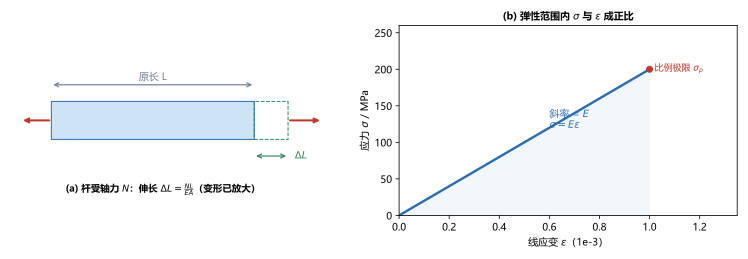
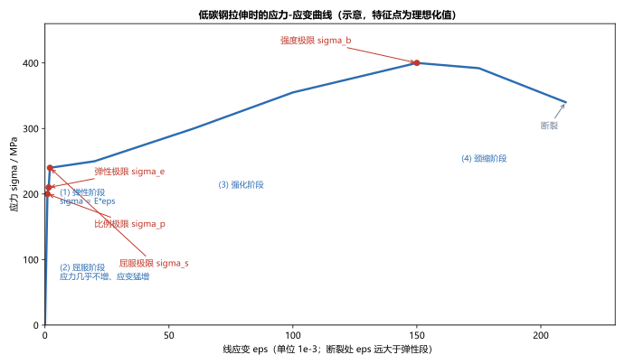
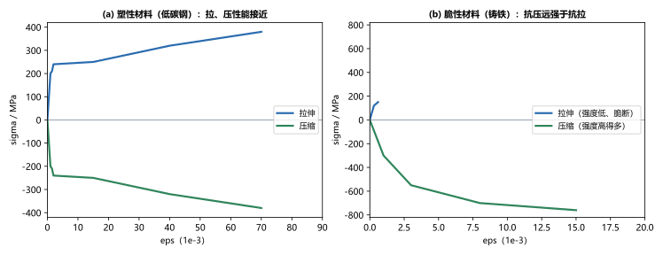

# 第 03 讲：拉压变形、材料力学性能与强度计算

> **前置**：第 01 讲（内力、应力、应变、截面法），第 02 讲（轴力、轴力图、$\sigma = N/A$、斜截面应力）。
> **预计时间**：约 3 小时（含作业；本讲内容量较大，涉及材料性能与设计判据）。
>
> **一句话定位**：第 02 讲把"应力"算了出来，但"算出来"不等于"安全"。本讲补齐两件事——杆会**伸长多少**（胡克定律与变形计算），以及"**应力多大才算安全**"（材料能扛多少、安全系数、强度条件）。讲完这一讲，一根轴向拉压杆从"受力"到"判断安全"的完整链条就闭合了。
>
> **本讲回答什么**：
> 1. 胡克定律 $\sigma = E\varepsilon$ 和中学的弹簧公式是一回事吗？它的边界在哪？
> 2. 材料拉长了会变细，这个"变细"怎么量化（泊松比）？
> 3. 低碳钢的拉伸曲线为什么又屈服又强化又颈缩？"材料能扛多少"到底看哪个点？
> 4. "许用应力"从哪来？强度条件能反着问哪三类问题？
>
> **这一讲有真实验证**：胡克定律变形计算与 $\sigma=E\varepsilon$ 互证、泊松比横向变形、低碳钢特征点与许用应力、强度条件三类问题（脚本 `scripts/lec03-01_verify_strength.py`）；另有低碳钢拉伸曲线、胡克定律、塑性/脆性对比三张图（`figures/`）。

---

## 引子：算出了应力，就安全了吗

沿用第 02 讲那根杆。我们已经能算出它的最大应力，比如 $200\ \mathrm{MPa}$。可是：

- 这个 $200\ \mathrm{MPa}$ **算大还是算小？** 安全吗？
- 这根杆受力后会**伸长多少毫米？** 会不会伸长过头、影响使用？

这两个问题，第 02 讲都回答不了——它们分别需要"材料能承受的应力上限"和"变形与力的定量关系"。本讲就来补上这两块，把第 02 讲的"算应力"升级为"判断安全"。

---

## 1. 拉压变形与胡克定律

### 1.1 绝对变形与线应变

一根原长 $L$ 的杆，受轴向力后伸长 $\Delta L$。这里有两个描述变形的量：

- **绝对变形** $\Delta L$：伸长的绝对量（单位 mm）。它依赖杆有多长。
- **线应变** $\varepsilon = \dfrac{\Delta L}{L}$：单位长度的伸长（无量纲，第 01 讲）。

工程上更常用绝对变形 $\Delta L$（因为要控制实际伸长量），但物理关系最干净的是应变 $\varepsilon$。

### 1.2 胡克定律：应力与应变成正比

实验发现，在**一定范围**内，轴向拉压杆的**正应力与线应变成正比**：

$$\boxed{\sigma = E\varepsilon},$$

这就是**胡克定律**（Hooke's law）。其中比例常数 $E$ 叫**弹性模量**（杨氏模量，Young's modulus），单位与应力相同（MPa）。$E$ 越大的材料越"硬"——同样应力下变形越小。钢的 $E \approx 2\times10^5\ \mathrm{MPa} = 200\ \mathrm{GPa}$。

把 $\sigma = N/A$ 和 $\varepsilon = \Delta L/L$ 代进去，得到工程上最好用的形式：

$$\sigma = E\varepsilon \;\Longrightarrow\; \frac{N}{A} = E\frac{\Delta L}{L} \;\Longrightarrow\; \boxed{\Delta L = \frac{N L}{E A}}.$$

> **图 2 怎么读**：(a) 一根受轴力 $N$ 的杆，原长 $L$、伸长 $\Delta L$（图中伸长已放大以便看清）；(b) 在弹性范围内，$\sigma$ 与 $\varepsilon$ 的关系是一条过原点的直线，**斜率就是弹性模量 $E$**（线段的终点是比例极限 $\sigma_p$，超过它直线就结束）。

**一个算例**（脚本 EXP1）：钢杆 $N = 20\ \mathrm{kN}$，$L = 500\ \mathrm{mm}$，$A = 200\ \mathrm{mm^2}$，$E = 2\times10^5\ \mathrm{MPa}$：

$$\Delta L = \frac{N L}{E A} = \frac{20000 \times 500}{2\times10^5 \times 200} = 0.25\ \mathrm{mm},\qquad \varepsilon = \frac{\Delta L}{L} = 5\times10^{-4}.$$

**互证**：$\sigma = N/A = 100\ \mathrm{MPa}$，而 $E\varepsilon = 2\times10^5 \times 5\times10^{-4} = 100\ \mathrm{MPa}$——两条路结果相同，说明 $\sigma=E\varepsilon$ 与 $\Delta L = NL/(EA)$ 是一回事的两种写法。（这个 $\Delta L = 0.25\ \mathrm{mm}$ 正是第 01 讲那个算例，现在有了来历。）

> **注意**：$EA$ 叫杆的**拉压刚度**（抗拉压变形能力）。$E$ 是材料属性，$A$ 是几何属性；$EA$ 越大，同样 $N$、$L$ 下伸长越小。设计时"加粗截面"就是增大 $A$、提高 $EA$。

### 1.3 变截面（多段）杆的变形

$\Delta L = \dfrac{NL}{EA}$ 只适用于**等截面、单一轴力**的杆。真实杆件常常各段截面不同、轴力也不同。这时把杆按"轴力或截面突变处"分段，每段各自用 $\Delta L_i = \dfrac{N_i L_i}{E_i A_i}$，再求和：

$$\boxed{\Delta L = \sum_i \frac{N_i L_i}{E_i A_i}}\qquad\Big(\text{轴力、面积沿轴连续变化时：}\ \Delta L = \int_0^L \frac{N(x)}{E A(x)}\,\mathrm{d}x\Big).$$

**算例**（脚本 EXP5）：一根两段变截面杆，$E = 2\times10^5\ \mathrm{MPa}$：

| 段 | 轴力 $N_i$ | 长度 $L_i$ | 面积 $A_i$ | $\Delta L_i = N_iL_i/(EA_i)$ |
|---|---|---|---|---|
| 左段 | $30\ \mathrm{kN}$ | $300\ \mathrm{mm}$ | $200\ \mathrm{mm^2}$ | $0.225\ \mathrm{mm}$ |
| 右段 | $50\ \mathrm{kN}$ | $200\ \mathrm{mm}$ | $100\ \mathrm{mm^2}$ | $0.500\ \mathrm{mm}$ |

$$\Delta L = 0.225 + 0.500 = 0.725\ \mathrm{mm}.$$

注意**带符号相加**：某段受压时 $N_i$ 为负、该段 $\Delta L_i$ 也取负，总变形是各段"伸长—缩短"的叠加，可能整体缩短。这也呼应第 02 讲"变截面杆的危险截面要看 $|N|/A$"——同一根杆里，不同段的应力与变形能力都不一样。

### 1.4 胡克定律的边界

胡克定律**不是无条件成立**的。它只适用于**线弹性范围**，即应力不超过**比例极限** $\sigma_p$（见第 3 节）的区间。超过之后，$\sigma$ 与 $\varepsilon$ 不再成正比（曲线弯了），胡克定律失效。

> **现在要建立的边界意识**：凡是要用 $\sigma = E\varepsilon$ 或 $\Delta L = NL/(EA)$ 的地方，先默问一句"应力是不是还在弹性范围内"。工程构件的正常工作应力通常都远低于比例极限，所以这个条件大多满足；但一旦涉及超载、残余变形、塑性加工，就必须停下这个公式。

---

## 2. 横向变形与泊松比

### 2.1 拉长会变细

把橡皮筋拉长，它会变细。钢杆同样如此，只是肉眼看不出来。**轴向伸长的同时，横向（垂直于轴线方向）会缩短。**

记轴向线应变为 $\varepsilon$、横向线应变为 $\varepsilon'$。实验发现，在弹性范围内两者有固定比例：

$$\varepsilon' = -\mu\,\varepsilon,$$

其中 $\mu$ 叫**泊松比**（Poisson's ratio），是个无量纲的正数；负号表示"轴向伸长（$\varepsilon>0$）、横向缩短（$\varepsilon'<0$）"。

**泊松比的取值范围**：各向同性材料的 $\mu$ 在 $0$ 到 $0.5$ 之间；常见金属约 $0.25\sim0.35$，钢材常取 $0.3$。

> **上界 0.5 从哪儿来（先留一个抓手）**：设想杆受轴向拉应力 $\sigma$：轴向伸长 $\varepsilon=\sigma/E$，两个横向各缩短 $\mu\varepsilon$。三者相加就是体积的相对变化（体积应变）$\theta=\varepsilon-2\mu\varepsilon=\frac{1-2\mu}{E}\sigma$。若材料受拉时体积**完全不变**（不可压缩），则 $\theta=0$，解得 $\mu=0.5$——这就是上界的来历。真实材料受拉时体积会**略微增大**（$\theta>0$），所以 $\mu$ 略小于 0.5。（三向应力下的完整体积应变公式，在第 14 讲广义胡克定律里正式给出。）

> **为什么重要**：泊松比把"一个方向的变形"和"另一个方向的变形"联系起来。它是后面广义胡克定律（第 14 讲）、体积变化、以及应变测量的基础。本讲只需会用它算横向变形。

### 2.2 算例

回引例的钢杆，$\varepsilon = 5\times10^{-4}$，取 $\mu = 0.3$：

$$\varepsilon' = -0.3 \times 5\times10^{-4} = -1.5\times10^{-4}.$$

若杆是直径 $d = 20\ \mathrm{mm}$ 的圆杆，横向应变使直径变为

$$\Delta d = \varepsilon'\, d = -1.5\times10^{-4} \times 20\ \mathrm{mm} = -0.003\ \mathrm{mm}.$$

即直径缩短 $0.003\ \mathrm{mm}$——肉眼不可见，但工程上在精密配合处必须计入。脚本 EXP2 核对一致。

---

## 3. 材料在拉伸时的力学性能

胡克定律里的 $E$、以及"材料能扛多少"，都不是凭空来的，而是**由材料的拉伸实验测出来的**。标准做法是：把材料做成标准试件，在试验机上缓慢拉伸，记录"应力-应变"曲线。

### 3.1 低碳钢拉伸曲线的四个阶段

低碳钢是最典型的**塑性材料**，它的拉伸曲线有四个一目了然的阶段：

> **图 1 怎么读**：横轴是线应变 $\varepsilon$，纵轴是应力 $\sigma$。曲线依次经过四个阶段：(1) 弹性阶段、(2) 屈服阶段、(3) 强化阶段、(4) 颈缩阶段，并在最后断裂。

1. **弹性阶段**：$\sigma$ 与 $\varepsilon$ 近似成正比（胡克定律成立），卸载后变形完全消失。这一阶段有两个界点：
   - **比例极限** $\sigma_p$：$\sigma$ 与 $\varepsilon$ 保持正比的上限，超过它曲线开始弯曲；
   - **弹性极限** $\sigma_e$：卸载后**完全恢复**的上限，超过它就会有残余变形。$\sigma_p$ 与 $\sigma_e$ 很接近，工程上常近似相等。
2. **屈服阶段**：曲线出现一段几乎水平的"平台"——**应力几乎不增加，应变却猛增**，材料好像"失去抵抗"了。平台对应的应力叫**屈服极限** $\sigma_s$（屈服强度）。这是塑性材料的一个重要标志。
3. **强化阶段**：材料重新恢复抵抗能力，$\sigma$ 继续升高，直到曲线的最高点——**强度极限** $\sigma_b$（抗拉强度），这是材料能承受的**最大应力**。
4. **颈缩阶段**：过了 $\sigma_b$，试件的某一段开始局部变细形成"颈缩"，所需拉力反而减小，曲线下降，直到在该处断裂。

脚本 EXP3 用的理想化数值：$\sigma_p=200$、$\sigma_e=210$、$\sigma_s=240$、$\sigma_b=400\ \mathrm{MPa}$（均为示意，用于说明量级与次序）。

### 3.2 三类性能指标

从拉伸曲线可以读出材料的**三类性能指标**：

- **弹性指标**：弹性模量 $E$（弹性阶段直线的斜率）、泊松比 $\mu$。它们描述材料"有多硬"。
- **强度指标**：**屈服极限** $\sigma_s$（有屈服阶段的材料，如低碳钢）或 **强度极限** $\sigma_b$（无明显屈服阶段的材料）。它们描述材料"能扛多大力"。
- **塑性指标**：**延伸率** $\delta$ 和 **断面收缩率** $\psi$，描述材料断裂前能产生多大塑性变形。$\delta$ 大于约 5% 的称为塑性材料，反之为脆性材料（认识层，考试少用）。

### 3.3 冷作硬化（认识层）

若在强化阶段卸载，再重新加载，会发现新的比例极限（直线段）比原来的更高——材料在预拉之后"变硬"了，同时塑性（延伸率）下降。这叫**冷作硬化**（cold working）。

生活中钢筋经过冷拔、钢丝经过冷拉都会发生冷作硬化。它是"提高了强度、牺牲了塑性"的一次交换。

---

## 4. 材料在压缩时的力学性能

### 4.1 塑性材料（低碳钢）压缩

低碳钢压缩时，**弹性阶段的 $E$、屈服极限 $\sigma_s$ 与拉伸时基本相同**；但超过屈服后，试件越压越扁，**始终压不裂**（横截面不断扩大），所以得不到压缩的强度极限。

> **结论**：塑性材料的压缩性能可近似用拉伸数据；$\sigma_s$、$E$ 拉压通用。

### 4.2 脆性材料（铸铁）压缩

铸铁压缩时表现完全不同（见下图）——它**几乎没有屈服阶段**，而是直接脆断，但**抗压强度远高于抗拉强度**（可达数倍）。

> **图 3 怎么读**：(a) 塑性材料（低碳钢）：拉伸与压缩曲线形状接近，强度相当；(b) 脆性材料（铸铁）：拉伸曲线又低又短（抗拉强度低、几乎不塑性就直接断），压缩曲线高得多（抗压强度远大于抗拉）。

顺带一个细节：铸铁受压时并不沿横截面被"压碎"，而是沿**与轴线大致成 $45^\circ\sim55^\circ$ 的斜截面**裂开——那正是切应力较大的方向（回忆第 02 讲：$45^\circ$ 附近切应力最大）。可见脆性材料虽然抗压强度高，破坏却仍是**剪切**型的。

> **工程含义**：**脆性材料（铸铁、混凝土、石料）适合做受压构件，不宜做受拉构件**——所以铸铁用来做机床底座、混凝土用来做受压墙柱，而很少用来承受拉力。这也是第 02 讲"脆性材料沿横截面被拉断"的原因在材料层面的解释。

---

## 5. 许用应力、安全系数与强度条件

### 5.1 极限应力与许用应力

材料"能扛多少"由**极限应力** $\sigma_u$ 描述：

- 塑性材料：取**屈服极限** $\sigma_s$（因为它一旦屈服就产生较大残余变形，往往算失效）；
- 脆性材料：取**强度极限** $\sigma_b$（因为脆性材料没有屈服，直接断裂）。

但**不能把工作应力用到极限应力**——那样没有任何余量。要留出**安全系数** $n$（$n>1$），把极限应力折减为**许用应力**：

$$\boxed{[\sigma] = \frac{\sigma_u}{n}}.$$

安全系数 $n$ 由设计规范给定（通常 1.5～3 或更大），它一次性覆盖了载荷估计误差、材料不均匀、计算简化、偶然超载等多重不确定因素。脚本 EXP3 展示：低碳钢 $\sigma_s = 240\ \mathrm{MPa}$，取 $n = 1.5$ 得 $[\sigma] = 160\ \mathrm{MPa}$；取 $n = 2.0$ 得 $[\sigma] = 120\ \mathrm{MPa}$。

### 5.2 强度条件

把第 02 讲算出的工作应力与许用应力比较，得到**强度条件**：

$$\boxed{\sigma_{\max} = \frac{N}{A} \le [\sigma]}.$$

（$\sigma_{\max}$ 取危险截面上的最大工作应力。）满足它就安全，不满足就危险。

### 5.3 强度条件的三类问题

同一个不等式 $\sigma_{\max} \le [\sigma]$，可以反着问三件事：

| 问题 | 已知 | 求 | 操作 |
|---|---|---|---|
| **强度校核** | $N$、$A$、$[\sigma]$ | 判断是否安全 | 算 $\sigma=N/A$，与 $[\sigma]$ 比大小 |
| **设计截面** | $N$、$[\sigma]$ | 所需截面面积 $A$ | $A \ge \dfrac{N}{[\sigma]}$ |
| **求许用载荷** | $A$、$[\sigma]$ | 最大允许轴力 $N$ | $N \le [\sigma]\,A$ |

脚本 EXP4（取 $[\sigma]=160\ \mathrm{MPa}$）给出三个例子：

- 校核：$N=30\ \mathrm{kN}$、$A=200\ \mathrm{mm^2}$ → $\sigma = 150\ \mathrm{MPa} \le 160\ \mathrm{MPa}$，**安全**；
- 设计截面：$N=40\ \mathrm{kN}$ → $A \ge 40\times10^3/160 = 250\ \mathrm{mm^2}$；
- 求许用载荷：$A=200\ \mathrm{mm^2}$ → $N \le 160\times200 = 32\ \mathrm{kN}$。

三类问题本质是同一个不等式，考试里换个问法而已——**先判断问的是哪一个未知量，再把它单独解出来**。

---

## 6. 应力集中：本讲如何收尾

第 02 讲讲到了**应力集中**：截面突变处局部应力会高于 $N/A$ 的平均值。现在有了材料性能，可以说清"集中"到底有多危险，以及为什么**塑性材料与脆性材料的处置不同**：

- **塑性材料**：局部应力一旦达到 $\sigma_s$，该处材料先屈服、暂时不再承担更多应力，把多出来的载荷"让"给邻近未屈服的区域——局部应力被重分布，峰值被削平。所以塑性材料对应力集中**不太敏感**（静载下）。
- **脆性材料**：没有屈服阶段，局部应力一高就直接开裂，应力集中**非常危险**。

> **一句话**：应力集中对脆性材料是"致命"的，对塑性材料（静载下）相对温和。这决定了设计时"要不要为了避免尖角而专门打磨倒角"——脆性构件必须，塑性构件可以放松些（认识层，更细的规则属于疲劳与设计规范）。

---

## 7. 本讲的心智模型

把这一讲压缩成一条判据链：

> **一根拉压杆是否安全，要同时看"变形够不够小"和"应力够不够低"。**
>
> 变形：$\Delta L = \dfrac{NL}{EA}$（弹性范围内，胡克定律）。要变形小，就提高 $EA$（换硬材料、加粗截面）。
> 安全：$\sigma_{\max} = \dfrac{N}{A} \le [\sigma]$，而 $[\sigma] = \dfrac{\sigma_u}{n}$。要安全，就降低工作应力或选高强度材料（或放大安全系数）。

遇到一道题，按这个顺序想：

1. **求内力**：截面法得 $N$（第 02 讲）；
2. **算应力**：$\sigma = N/A$，找危险截面；
3. **判安全**：与 $[\sigma] = \sigma_u/n$ 比较——问的是校核、设计截面、还是求载荷？
4. **算变形**（若问）：$\Delta L = NL/(EA)$，必要时再算横向变形（泊松比）。

---

## 8. 小结

- **胡克定律**：线弹性范围内 $\sigma = E\varepsilon$，等价于 $\Delta L = \dfrac{NL}{EA}$。$E$ 是**弹性模量**（材料的"硬"度），$EA$ 是**拉压刚度**。**只在应力不超过比例极限 $\sigma_p$ 时成立。**
- **泊松比** $\mu$：横向应变与轴向应变之比 $\varepsilon' = -\mu\varepsilon$；金属约 0.25～0.35。
- **低碳钢拉伸曲线四阶段**：弹性（$\sigma_p$ 比例极限、$\sigma_e$ 弹性极限）→ 屈服（$\sigma_s$ 屈服极限）→ 强化（$\sigma_b$ 强度极限）→ 颈缩 → 断裂。
- **强度指标**：塑性材料取 $\sigma_s$，脆性材料取 $\sigma_b$，合称极限应力 $\sigma_u$。
- **塑性 vs 脆性**：塑性材料拉压性能接近（低碳钢压缩不裂）；脆性材料抗压远强于抗拉（铸铁）。
- **许用应力** $[\sigma] = \sigma_u/n$（$n$ 为安全系数）。
- **强度条件** $\sigma_{\max} = N/A \le [\sigma]$，对应**三类问题**：强度校核、设计截面（$A \ge N/[\sigma]$）、求许用载荷（$N \le [\sigma]A$）。
- **应力集中**：对脆性材料危险，对塑性材料（静载下）因屈服重分布而相对温和。

---

## 9. 作业

### 基础

**Q1. 胡克定律**：一根钢杆 $N = 30\ \mathrm{kN}$，$L = 800\ \mathrm{mm}$，$A = 150\ \mathrm{mm^2}$，$E = 2\times10^5\ \mathrm{MPa}$。求伸长量 $\Delta L$ 与线应变 $\varepsilon$，并用 $\sigma = E\varepsilon$ 互证。

**参考答案**：

$\Delta L = \dfrac{NL}{EA} = \dfrac{30000\times800}{2\times10^5\times150} = 0.8\ \mathrm{mm}$。
$\varepsilon = \dfrac{0.8}{800} = 1\times10^{-3}$。
互证：$\sigma = N/A = 30000/150 = 200\ \mathrm{MPa}$；$E\varepsilon = 2\times10^5\times1\times10^{-3} = 200\ \mathrm{MPa}$，相等。
验算：$\Delta L = \varepsilon L = 10^{-3}\times800 = 0.8\ \mathrm{mm}$，与第一路一致。

**Q2. 泊松比**：Q1 的杆，材料泊松比 $\mu = 0.3$。求横向线应变 $\varepsilon'$。

**参考答案**：

$\varepsilon' = -\mu\varepsilon = -0.3\times1\times10^{-3} = -3\times10^{-4}$（负号表示横向缩短）。
验算：横向应变与轴向应变反号、量级由 $\mu$ 决定（此处为轴向的 0.3 倍），符合泊松效应。

**Q3. 许用应力**：一种低碳钢屈服极限 $\sigma_s = 240\ \mathrm{MPa}$，取安全系数 $n = 1.5$，求许用应力 $[\sigma]$。

**参考答案**：

$[\sigma] = \dfrac{\sigma_s}{n} = \dfrac{240}{1.5} = 160\ \mathrm{MPa}$。
验算：$[\sigma]\times n = 160\times1.5 = 240 = \sigma_s$；且 $[\sigma]<\sigma_s$（安全系数大于 1，许用应力必低于极限应力）。

### 提高

**Q4. 强度条件三类问题**：某杆材料 $[\sigma] = 160\ \mathrm{MPa}$。
（1）校核：$N = 45\ \mathrm{kN}$、$A = 300\ \mathrm{mm^2}$，是否安全？
（2）设计截面：$N = 60\ \mathrm{kN}$，所需最小 $A$ 是多少？
（3）求许用载荷：$A = 250\ \mathrm{mm^2}$，最大允许 $N$ 是多少？

**参考答案**：

(1) $\sigma = 45\times10^3/300 = 150\ \mathrm{MPa} \le 160\ \mathrm{MPa}$，**安全**。
(2) $A \ge N/[\sigma] = 60\times10^3/160 = 375\ \mathrm{mm^2}$。
(3) $N \le [\sigma]A = 160\times250 = 40\times10^3\ \mathrm{N} = 40\ \mathrm{kN}$。
验算：三问都是 $\sigma = N/A \le [\sigma]$ 的变形；把求得的结果代回原不等式都应成立（如 (2) 反代 $60\times10^3/375 = 160\ \mathrm{MPa}$，恰好取等号）。

**Q5. 概念辨析**：胡克定律 $\sigma = E\varepsilon$ 在什么范围内成立？如果工作应力超过了比例极限，用 $\Delta L = NL/(EA)$ 算变形会出现什么问题？

**参考答案**：

胡克定律只在线弹性范围（应力不超过比例极限 $\sigma_p$）内成立。
超过比例极限后，$\sigma$ 与 $\varepsilon$ 不再成正比，材料的实际变形比 $\Delta L = NL/(EA)$ 算出的**更大**（因为曲线向应变方向弯曲，同样应力对应更多应变）——用该公式会**低估变形**；若进入屈服/塑性区，卸不掉的残余变形更是该公式无法描述的。
验算（自检方向）：回到图 1，只有在弹性那段直线里 $\sigma=E\varepsilon$ 才对应真实曲线；直线区外的任何外推都不可信。

**Q6. 概念解释**：为什么铸铁、混凝土这类材料常用来做受压构件，而很少做受拉构件？

**参考答案**：

因为脆性材料的**抗压强度远高于抗拉强度**（图 3(b)：铸铁抗压可达抗拉的数倍），且几乎没有塑性、破坏突然。
做受拉构件时，抗拉强度低意味着很小的拉应力就可能开裂；做受压构件时，高的抗压强度能充分利用。
验算（自检方向）：对照图 3，先问"材料怕拉还是怕压"，再据此选受力状态——把受力状态安排在材料"擅长的方向"上。

### 综合

**Q7. 完整设计（回扣引子）**：一根轴向受拉的圆截面吊杆承受 $N = 50\ \mathrm{kN}$，材料屈服极限 $\sigma_s = 235\ \mathrm{MPa}$，取安全系数 $n = 1.5$。
（1）求许用应力 $[\sigma]$；
（2）求所需的最小横截面积 $A$；
（3）若做成实心圆杆，求最小直径 $d$。

**参考答案**：

(1) $[\sigma] = \sigma_s/n = 235/1.5 \approx 156.7\ \mathrm{MPa}$。
(2) $A \ge N/[\sigma] = 50\times10^3/156.7 \approx 319\ \mathrm{mm^2}$。
(3) 圆截面 $A = \pi d^2/4$，故 $d \ge \sqrt{4A/\pi} = \sqrt{4\times319/\pi} \approx \sqrt{406.3} \approx 20.2\ \mathrm{mm}$。工程上取整，选 $d = 21\ \mathrm{mm}$（偏安全取大不取小）。
验算：反代 $A = \pi\times20.2^2/4 \approx 320\ \mathrm{mm^2}$，$\sigma = 50\times10^3/320 \approx 156\ \mathrm{MPa} \le 156.7\ \mathrm{MPa}$，成立。

**Q8. 开放简答**：安全系数 $n$ 取大一些更安全，为什么工程上不干脆取得很大（比如 10）？

**参考答案**：

$n$ 取大，$[\sigma] = \sigma_u/n$ 变小，所需截面 $A \ge N/[\sigma]$ 变大——构件会变得**笨重、费材料、费成本、增自重**（对桥梁、飞机、车辆尤其致命）。
所以 $n$ 是在"安全"与"经济"之间取的折中：既要覆盖载荷估计误差、材料不均匀、计算简化等不确定因素，又不能浪费材料。规范里给出的是经过长期实践统计的推荐值。
验算（自检方向）：把 $n$ 从 1.5 提到 3，同样 $N$ 下 $A$ 翻倍、质量也近似翻倍——这就是"安全"的代价。这也正回扣了第 01 讲"安全与经济的矛盾"。

---

*下一讲预告——第 04 讲《剪切与挤压的实用计算》：到这里，拉压的"应力—变形—安全判断"已经完整。但真实的连接件（铆钉、螺栓、键）不只承受拉压，还承受**剪切与挤压**。下一讲处理这类问题的实用计算方法——重点是正确识别剪切面和挤压面。*
