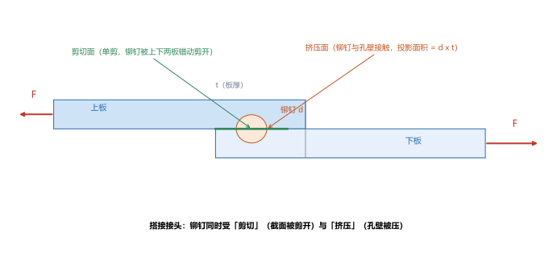
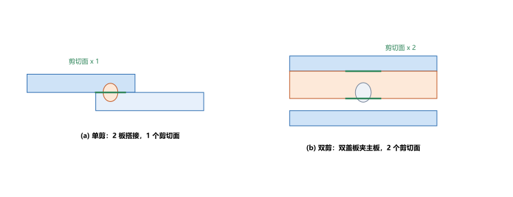
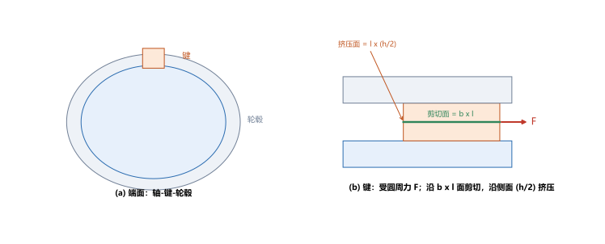

# 第 04 讲：剪切与挤压的实用计算

> **前置**：第 01–03 讲（内力、截面法、应力、拉压的强度条件）。
> **预计时间**：约 2.5 小时（含作业）。
>
> **一句话定位**：前几讲处理的都是"一根杆被拉压"。但工程里很多构件（铆钉、螺栓、键、销）是把两个零件**连起来**的，它们的失效方式不是被拉断，而是被**剪断**或**压溃**。本讲处理这两类问题，重点只有一个：**在一堆零件里，准确认出"剪切面"和"挤压面"。**
>
> **本讲回答什么**：
> 1. 铆钉把两块板连起来，力是怎么传过去的？铆钉可能怎么坏？
> 2. 剪切面和挤压面到底指哪里？它们是一回事吗？
> 3. 为什么这里是"实用计算"而不求精确解？挤压应力为什么按投影面积算？
>
> **这一讲有真实验证**：铆钉剪切、挤压、单剪与双剪、平键的数值核对（脚本 `scripts/lec04-01_verify_shear_bearing.py`）；另有搭接铆钉、单剪与双剪、平键三张图（`figures/`）。

---

## 引子：两块钢板靠一颗铆钉连起来

两块钢板搭接在一起，用一颗铆钉穿过重叠区把它们连起来，然后沿板面方向拉：上板往左拉、下板往右拉，拉力都是 $F$。这时：

- 铆钉在两个板的**交界面处**被上下两板朝相反方向"错动"——这是**剪切**；
- 铆钉的**半圆柱面**顶着板孔壁，把力挤过去——这是**挤压**。

两种作用都会让接头失效。本讲就来算：铆钉会不会被剪断？孔壁会不会被压坏？

---

## 1. 连接件里的两种破坏：剪切与挤压

工程上把这类"用来连接两个零件的构件"叫**连接件**（铆钉、螺栓、键、销是典型）。它们受力后主要有两种破坏方式：

- **剪切破坏**：连接件在两个方向相反的力作用下，**沿某个截面被"错开剪断"**。那个被剪开的截面叫**剪切面**。
- **挤压破坏**：连接件与孔壁（或与被连接件）**接触面上被局部压溃**（压出凹坑、孔壁被压坏）。接触面叫**挤压面**。

> **图 1 怎么读**：上板与下板在一块重叠区里由一颗铆钉连住，两侧外力 $F$ 把两板向相反方向拉。铆钉在两板交界面处被"上板向这边、下板向那边"错动——那条交界面就是**剪切面**（绿色）；铆钉的半圆柱面与孔壁相顶的地方是**挤压面**（橙色）。

**一个关键判断**：剪切面和挤压面**不是同一个面**。

- 剪切面是连接件**内部被剪开**的那个横截面（图 1 里水平的交界面）。
- 挤压面是连接件与被连接件的**接触面**（图 1 里铆钉与孔壁的圆柱接触面）。

后面计算的第一个动作，永远是"**先找对这两个面**"。

---

## 2. 剪切的实用计算

### 2.1 名义切应力

剪切面上分布着切应力。和拉压一样，直接求逐点应力很麻烦，工程上改用**平均口径**——用剪力除以剪切面面积，得到**名义切应力**（名义 = 按平均算的名义值）：

$$\tau = \frac{Q}{A_s},$$

其中 $Q$ 是剪切面上的剪力（对图 1 的搭接接头，$Q = F$），$A_s$ 是**剪切面面积**。

对圆截面铆钉（直径 $d$），剪切面就是它的横截面：

$$A_s = \frac{\pi d^2}{4}.$$

### 2.2 剪切强度条件

和拉压强度条件完全同构：

$$\boxed{\tau = \frac{Q}{A_s} \le [\tau]},$$

$[\tau]$ 是许用切应力。三类问题（校核、设计截面、求许用载荷）的问法也一样。

**算例**（脚本 EXP1）：铆钉 $d = 16\ \mathrm{mm}$，受剪力 $F = 20\ \mathrm{kN}$，单剪：

$$A_s = \frac{\pi \times 16^2}{4} = 201.06\ \mathrm{mm^2},\qquad \tau = \frac{20000}{201.06} = 99.5\ \mathrm{MPa}.$$

### 2.3 单剪与双剪：剪切面数

同样一颗铆钉，**受剪的截面可能有 1 个，也可能有 2 个**，这取决于接头怎么搭：

- **单剪**：两块板直接搭接（图 1），铆钉只在**一个截面**上被剪——剪切面数 1，$A_s = \dfrac{\pi d^2}{4}$。
- **双剪**：用两块盖板夹住主板（俗称双盖板），铆钉穿过三层板、在**两个截面**上同时被剪——剪切面数 2，$A_s = 2\times\dfrac{\pi d^2}{4}$。

> **图 2 怎么读**：(a) 两板搭接，铆钉在一个交界面处受剪（剪切面 ×1）；(b) 上下两块盖板夹住中间主板，铆钉在两个交界面处同时受剪（剪切面 ×2）。图上的绿色短横线就是剪切面的位置。

**算例**（脚本 EXP3）：双剪接头，总剪力 $F = 40\ \mathrm{kN}$，$d = 16\ \mathrm{mm}$：

$$A_s = 2\times\frac{\pi\times16^2}{4} = 402.12\ \mathrm{mm^2},\qquad \tau = \frac{40000}{402.12} = 99.5\ \mathrm{MPa}.$$

注意结果与单剪"同量级"：双剪时**剪力翻倍、剪切面也翻倍**，两者相抵，所以 $\tau$ 不变（$40\ \mathrm{kN}$ 分给两个面，每个面仍承担 $20\ \mathrm{kN}$）。

> **判断剪切面数的口诀**：数"连接件被剪断时可以分成几段"。搭接剪成 2 段（1 个面）；双盖板剪成 3 段（2 个面）。

---

## 3. 挤压的实用计算

### 3.1 挤压面与投影面积

挤压面是连接件与被连接件的**接触面**。对铆钉来说，它是铆钉与孔壁之间的**半个圆柱面**。直接按这个曲面算很麻烦，实用计算改用一个约定：

> **挤压面积按接触面在"受力方向垂直平面"上的投影面积计算**，对圆铆钉就是

$$A_{bs} = d\, t,$$

其中 $d$ 是铆钉直径，$t$ 是**被挤压板的厚度**（投影到板的侧视面上，正好是一个矩形 $d\times t$）。

> **为什么用投影而不是曲面**：① 工程习惯——实测发现按投影面积算的名义挤压应力与实际承载能力吻合较好；② 口径统一——和剪切用平均应力一样，用投影面积给的是一个**便于比较的约定值**，不是真实接触应力的精确分布。这就是"实用计算"的含义：**用简单、统一的名义口径，换掉复杂的精确分析。**

### 3.2 挤压强度条件

$$\boxed{\sigma_{bs} = \frac{F}{A_{bs}} = \frac{F}{d\,t} \le [\sigma_{bs}]},$$

$[\sigma_{bs}]$ 是许用挤压应力。

**算例**（脚本 EXP2）：同前铆钉，板厚 $t = 10\ \mathrm{mm}$：

$$A_{bs} = 16\times10 = 160\ \mathrm{mm^2},\qquad \sigma_{bs} = \frac{20000}{160} = 125\ \mathrm{MPa}.$$

> **挤压面积用"谁"的尺寸**：当连接件和被连接件材料不同、需要分别校核时，"$d\times t$"里的 $t$ 取**被挤压件的厚度**，$[\sigma_{bs}]$ 取**较弱材料**的许用挤压应力。

---

## 4. 典型连接件：平键连接

平键（把轴上零件与轴连起来、传递扭矩）是另一个高频题型。它的思路和铆钉一样，只是"力从哪来"要先算一步。

**第一步：把扭矩换成键上的力。** 键装在轴的键槽里，传递扭矩 $T$。键受到的圆周力作用在轴半径 $D/2$ 处，所以

$$F = \frac{T}{D/2} = \frac{2T}{D}.$$

（注意单位：$T$ 用 $\mathrm{N\cdot mm}$、$D$ 用 $\mathrm{mm}$，$F$ 才是 $\mathrm{N}$。）

**第二步：找两个面，分别校核。**

- **剪切**：键沿**纵截面**（沿轴向、宽 $b$、长 $l$ 的那个面）被剪，剪切面 $A_s = b\,l$；
- **挤压**：键的**侧面**（高 $h$）与被挤压件接触，接触高度是 $h/2$（键一半嵌在轴里、一半嵌在轮毂里，两侧各算各的），挤压面 $A_{bs} = l\cdot\dfrac{h}{2}$。

> **图 3 怎么读**：(a) 端面看，轴（蓝）与轮毂（灰）之间嵌着键（橙）；(b) 侧视看，键长 $l$，受圆周力 $F$ 推动。键沿中间的**水平纵截面 $b\times l$ 被剪切**（绿色），沿**侧面 $l\times(h/2)$ 被挤压**（橙）。

**算例**（脚本 EXP4）：键 $b = 12$、$h = 8$、$l = 50\ \mathrm{mm}$；轴径 $D = 40\ \mathrm{mm}$；扭矩 $T = 400\ \mathrm{N\cdot m}$。

$$F = \frac{2\times 400\times10^3\ \mathrm{N\cdot mm}}{40\ \mathrm{mm}} = 20000\ \mathrm{N},$$

$$\tau = \frac{F}{b l} = \frac{20000}{12\times50} = 33.3\ \mathrm{MPa},\qquad \sigma_{bs} = \frac{F}{l\,(h/2)} = \frac{20000}{50\times4} = 100\ \mathrm{MPa}.$$

两个都要满足各自的许用值，键才算安全。

---

## 5. 几点工程提醒（认识层）

- **连接件不只自己坏，被连接件也会坏**：板在孔边被"撕开"（沿净截面拉断），孔太靠近板边会被"拉脱"。所以接头校核通常是"一组"，本讲只算连接件本身，板的校核思路与拉压相同。
- **多个连接件分担**：一排有 $n$ 颗铆钉时，通常近似认为**平均分担**（每颗承担 $F/n$），再对单颗做剪切、挤压校核。实际分担并不完全均匀，这里只作工程近似（认识层）。
- **端距要求**：孔到板边的距离要足够，否则板会被"拉豁"。具体尺寸由规范规定，本课不展开。

---

## 6. 本讲的心智模型

把这一讲压缩成三步：

> **连接件题 = 先找对两个面，再用两个"平均口径"公式各校核一次。**
>
> 1. **看破坏类型**：是"被剪开"还是"被压溃"？
> 2. **找面**：剪切面 = 被剪开的横截面（数清有几个）；挤压面 = 接触面（用投影面积 $d\times t$ 或 $l\times(h/2)$）。
> 3. **算名义应力比许用值**：$\tau = Q/A_s \le [\tau]$、$\sigma_{bs} = F/A_{bs} \le [\sigma_{bs}]$。

一句话记口：**"剪断看横截面，压坏看接触面"**。

---

## 7. 小结

- 连接件（铆钉、螺栓、键、销）有两种主要破坏：**剪切**（沿剪切面被剪断）与**挤压**（接触面被压溃）。
- **剪切面 ≠ 挤压面**：剪切面是连接件内部被剪开的横截面；挤压面是连接件与被连接件的接触面。
- **剪切实用计算**：名义切应力 $\tau = \dfrac{Q}{A_s}$，强度条件 $\tau \le [\tau]$。圆铆钉 $A_s = \dfrac{\pi d^2}{4}$；**单剪** 1 个面、**双剪** 2 个面。
- **挤压实用计算**：名义挤压应力 $\sigma_{bs} = \dfrac{F}{A_{bs}}$，强度条件 $\sigma_{bs} \le [\sigma_{bs}]$；圆铆钉挤压面积按**投影面积** $A_{bs} = d\,t$ 计。
- **平键**：先由扭矩求力 $F = 2T/D$，再校核剪切（$A_s = b l$）与挤压（$A_{bs} = l\,h/2$）。
- **"实用计算"的含义**：用简单统一的名义口径（平均应力、投影面积）替代复杂的精确应力分析，是工程约定。

---

## 8. 作业

### 基础

**Q1. 剪切**：一颗铆钉受单剪，剪力 $F = 30\ \mathrm{kN}$，直径 $d = 20\ \mathrm{mm}$。求名义切应力 $\tau$。

**参考答案**：

$A_s = \dfrac{\pi\times20^2}{4} = 314.16\ \mathrm{mm^2}$；$\tau = \dfrac{30000}{314.16} = 95.5\ \mathrm{MPa}$。
验算：反代 $\tau A_s = 95.5\times314.16 \approx 30000\ \mathrm{N} = 30\ \mathrm{kN}$，与剪力吻合。

**Q2. 挤压**：Q1 的铆钉，被连接板厚 $t = 12\ \mathrm{mm}$。求名义挤压应力 $\sigma_{bs}$。

**参考答案**：

$A_{bs} = d\,t = 20\times12 = 240\ \mathrm{mm^2}$；$\sigma_{bs} = \dfrac{30000}{240} = 125\ \mathrm{MPa}$。
验算：挤压面积用的是**投影面积** $d\times t$，不是半个圆柱面的真实面积——这是实用计算的口径。

**Q3. 概念辨析**：剪切面和挤压面的区别是什么？以铆钉搭接为例说明。

**参考答案**：

剪切面是铆钉**内部被剪开**的那个横截面（在两板交界面处）；挤压面是铆钉与**孔壁的接触面**（半圆柱面，实用计算取其投影 $d t$）。
两者不在同一个面上：一个在铆钉"体内"、与剪力方向平行；一个是"表面接触"、与挤压力方向垂直。判定依据：问"这块材料是被上下错开剪断的，还是被对面顶住压凹的"。

### 提高

**Q4. 双剪**：改用双盖板接头，总剪力 $F = 60\ \mathrm{kN}$，铆钉 $d = 20\ \mathrm{mm}$。求名义切应力 $\tau$。

**参考答案**：

双剪有 2 个剪切面：$A_s = 2\times\dfrac{\pi\times20^2}{4} = 628.32\ \mathrm{mm^2}$。
$\tau = \dfrac{60000}{628.32} = 95.5\ \mathrm{MPa}$。
验算：每个剪切面承担 $60/2 = 30\ \mathrm{kN}$，与 Q1 的单剪情形（$30\ \mathrm{kN}$、$d=20$）完全一致，故 $\tau$ 相同——说明"剪力与面数同步翻倍，比例不变"。

**Q5. 设计截面（剪切）**：许用切应力 $[\tau] = 100\ \mathrm{MPa}$，单剪接头承受 $F = 40\ \mathrm{kN}$。求所需铆钉最小直径 $d$。

**参考答案**：

由 $\tau = \dfrac{F}{A_s} \le [\tau]$ 得 $A_s \ge \dfrac{F}{[\tau]} = \dfrac{40000}{100} = 400\ \mathrm{mm^2}$。
由 $A_s = \dfrac{\pi d^2}{4}$ 反解：$d \ge \sqrt{\dfrac{4\times400}{\pi}} \approx 22.6\ \mathrm{mm}$，取 $d = 23\ \mathrm{mm}$。
验算：反代 $A_s = \pi\times23^2/4 \approx 415.5\ \mathrm{mm^2}$，$\tau = 40000/415.5 \approx 96.3\ \mathrm{MPa} \le 100\ \mathrm{MPa}$，成立。

**Q6. 平键**：键 $b = 10$、$h = 8$、$l = 40\ \mathrm{mm}$；轴径 $D = 40\ \mathrm{mm}$；扭矩 $T = 300\ \mathrm{N\cdot m}$。求键的切应力 $\tau$ 与挤压应力 $\sigma_{bs}$。

**参考答案**：

$F = \dfrac{2T}{D} = \dfrac{2\times300\times10^3}{40} = 15000\ \mathrm{N}$。
剪切：$A_s = b l = 10\times40 = 400\ \mathrm{mm^2}$，$\tau = 15000/400 = 37.5\ \mathrm{MPa}$。
挤压：$A_{bs} = l\,(h/2) = 40\times4 = 160\ \mathrm{mm^2}$，$\sigma_{bs} = 15000/160 = 93.75\ \mathrm{MPa}$。
验算：两个面分别对应"剪断"与"压坏"，都要单独校核；挤压面积用 $h/2$ 是因为键高只有一半嵌在被挤压件里。

### 综合

**Q7. 完整校核**：一颗铆钉（$d = 18\ \mathrm{mm}$）单剪连接两块板（板厚 $t = 8\ \mathrm{mm}$），承受 $F = 25\ \mathrm{kN}$。已知许用切应力 $[\tau] = 100\ \mathrm{MPa}$、许用挤压应力 $[\sigma_{bs}] = 200\ \mathrm{MPa}$。校核这个接头。

**参考答案**：

剪切：$A_s = \dfrac{\pi\times18^2}{4} = 254.47\ \mathrm{mm^2}$，$\tau = \dfrac{25000}{254.47} = 98.2\ \mathrm{MPa} \le 100\ \mathrm{MPa}$，**剪切安全**。
挤压：$A_{bs} = d t = 18\times8 = 144\ \mathrm{mm^2}$，$\sigma_{bs} = \dfrac{25000}{144} = 173.6\ \mathrm{MPa} \le 200\ \mathrm{MPa}$，**挤压安全**。
结论：两项都满足，接头安全。
验算：两个校核都是同一个 $F$ 分摊到不同面积（$\pi d^2/4$ 与 $d t$），分别和最弱指标比较；任何一项不过就不合格。

**Q8. 开放简答**：为什么挤压应力用"投影面积 $d\times t$"算，而不直接用力除以接触的真实曲面面积？这样算出的应力能反映真实的局部应力吗？

**参考答案**：

真实接触面是半个圆柱面，面积是曲面面积；但按曲面算既麻烦、又依赖接触如何分布（实际上接触并不均匀），工程上难比较。
实用计算改用**投影面积** $d t$（受力方向垂直面上的投影），得到的是一个**口径统一的名义平均挤压应力**。它不精确反映局部峰值，但大量实验表明它和接头的实际承载能力吻合得足够好，便于统一设计。
所以它是一条**工程约定**：牺牲局部精确性，换取简单、可比、可用的判别口径——这正是"实用计算"四个字的含义。
验算（自检方向）：对照 §3.1 的两条理由（工程习惯 + 口径统一），与本讲摘要里"用简单统一的名义口径替代精确分析"一致。

---

*下一讲预告——第 05 讲《扭转的内力与应力》：拉压（02–03）和剪切挤压（04）处理的都是"沿轴线"或"面内"的受力。下一讲换一种加载——用绕轴线的力偶把圆轴**扭转**，看扭矩怎么算、横截面上的切应力为什么从轴心到表面线性增长。*
