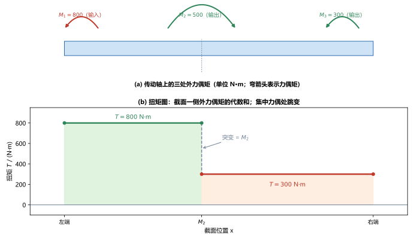
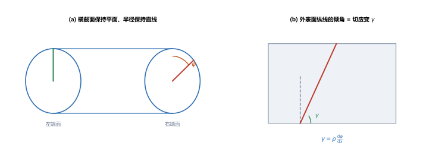
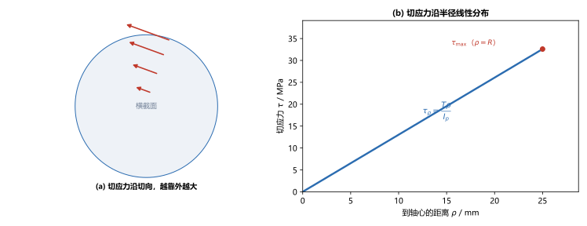

# 第 05 讲：扭转的内力与应力

> **前置**：第 01–04 讲（内力、截面法、应力、拉压应力公式、剪切与挤压、切应力概念）。
> **预计时间**：约 3 小时（含作业）。
>
> **一句话定位**：前几讲的加载方式要么沿轴线（拉压），要么在面内（剪切）。本讲换一种——用**绕轴线的力偶**把圆轴"拧"起来，研究轴内部产生的**扭矩**（内力偶矩）和横截面上的**切应力**。这是第三种基本变形（扭转）的应力篇。
>
> **本讲回答什么**：
> 1. 电机给轴的功率和转速，怎么换成作用在轴上的力偶矩？
> 2. 扭转的轴内部，扭矩怎么求、扭矩图怎么画？
> 3. 横截面上的切应力为什么从轴心为零、到表面最大、且沿半径线性增长？
>
> **这一讲有真实验证**：外力偶矩公式、扭矩图、极惯性矩与抗扭截面系数、最大切应力、剪切胡克定律的数值核对（脚本 `scripts/lec05-01_verify_torsion.py`）；另有扭矩图、扭转变形假设、切应力分布三张图（`figures/`）。

---

## 引子：一根传动轴把扭矩传出去

一台电机通过一根圆轴带动一台机器。电机输出功率 $P$，轴以转速 $n$ 旋转，于是轴上作用着一个**绕轴线方向的力偶矩**（叫**外力偶矩**），轴把它"拧着"传给机器。这根轴会怎样？

- 轴内部各个横截面上，会产生一个抵抗这种"拧"的**内力偶矩**，叫**扭矩** $T$；
- 扭矩在横截面上分布成**切应力**——注意，是切应力，不是拉压那讲的正应力。

本讲就把这两件事算清楚。

---

## 1. 外力偶矩与功率、转速的关系

工程上电机给的往往是**功率 $P$** 和**转速 $n$**，而力学计算需要的是**力偶矩 $M$**。它们之间由一个常用公式连接：

$$\boxed{M = 9550\,\frac{P}{n}},$$

其中 $P$ 单位 $\mathrm{kW}$，$n$ 单位 $\mathrm{r/min}$（转每分），$M$ 单位 $\mathrm{N\cdot m}$。

> **这个系数 9550 从哪来**：功率 = 力偶矩 × 角速度，$P = M\omega$。角速度 $\omega = \dfrac{2\pi n}{60}$（把转速换算成弧度每秒）。于是 $P = M\cdot\dfrac{2\pi n}{60}$，反解并统一成 kW、r/min、N·m 的单位，系数就是 $\dfrac{60\times1000}{2\pi}\approx 9550$。

**算例**（脚本 EXP1）：$P = 15\ \mathrm{kW}$、$n = 300\ \mathrm{r/min}$：

$$M = 9550\times\frac{15}{300} = 477.5\ \mathrm{N\cdot m}.$$

> **量级感**：功率一定时，转速越低、力偶矩越大（$M\propto 1/n$）。所以低速重载的轴，扭矩往往很大——这正是减速箱的意义。

---

## 2. 扭矩与扭矩图

### 2.1 扭矩：截面上的内力偶矩

用截面法（第 01 讲）：在轴上某处假想切开，取一侧，截面上会出现一个**绕轴线的内力偶矩**，叫**扭矩**，记 $T$。对整根只受两端力偶的轴，任意截面的扭矩都等于外力偶矩；轴上有好几个外力偶矩时，扭矩会分段变化。

**符号约定**：用**右手螺旋**判定——右手四指顺着扭矩转动的方向弯曲，拇指指向背离截面（朝外）时，扭矩为正。

### 2.2 扭矩图

和轴力图一样，把各段扭矩沿轴长画出来，就得到**扭矩图**。规律也一样：

> **某截面的扭矩 = 该截面一侧所有外力偶矩的代数和；在集中外力偶矩作用处，扭矩图发生突变，跳跃量等于该处外力偶矩。**

**算例**（脚本 EXP2）：一根传动轴上作用三处外力偶矩——左端输入 $M_1 = 800\ \mathrm{N\cdot m}$，中间输出 $M_2 = 500\ \mathrm{N\cdot m}$，右端输出 $M_3 = 300\ \mathrm{N\cdot m}$（输入 = 输出，整体平衡）。

- **左段**（$M_2$ 左侧）：$T = M_1 = 800\ \mathrm{N\cdot m}$；
- **右段**（$M_2$ 右侧）：$T = M_1 - M_2 = 300\ \mathrm{N\cdot m}$；
- $M_2$ 处突变 $= 800 - 300 = 500\ \mathrm{N\cdot m}$，恰等于 $M_2$。

> **图 1 怎么读**：(a) 轴上三处外力偶矩（弯箭头表示力偶矩，输入/输出方向相反）；(b) 扭矩图——横轴是截面位置，纵轴是扭矩 $T$。左段恒为 $800\ \mathrm{N\cdot m}$，右段恒为 $300\ \mathrm{N\cdot m}$，在 $M_2$ 处从 800 跳到 300。

---

## 3. 圆轴扭转的应力

有了扭矩，接下来求横截面上的切应力。仍然走"几何—物理—静力"三步。

### 3.1 变形假设（平面假设）

对圆轴做扭转实验，可以观察到：

- **横截面变形后仍是平面**（不歪、不鼓），且形状大小不变；
- **横截面上的半径变形后仍是直线**；
- 只是各个横截面**绕轴线各自转过了一个角度**（离固定端越远，转过的角度越大）。

> **一个容易混的地方**：扭转的"平面假设"说的是"横截面保持平面、半径保持直线"，但**不等于"截面没有转动"**——恰恰相反，截面整体转了。转动是扭转变形的本质。

> **图 2 怎么读**：(a) 圆轴两端面，半径线从竖直位置转过了角 $\varphi$——两个横截面发生了相对转动；(b) 轴外表面的一条纵向线（虚线为变形前），扭转后变成了斜线（红色），它的倾角就是**切应变** $\gamma$。

### 3.2 切应变

由图 2(b)，外表面（半径 $\rho = R$）的切应变量等于纵线的倾角。对半径 $\rho$ 处的任意点，几何关系给出：

$$\gamma = \rho\,\frac{\mathrm{d}\varphi}{\mathrm{d}x},$$

其中 $\dfrac{\mathrm{d}\varphi}{\mathrm{d}x}$ 是**单位长度上的扭转角**（沿轴的变化率）。可以看到：**切应变与到轴心的距离 $\rho$ 成正比**——轴心（$\rho=0$）处切应变为零，表面（$\rho=R$）处切应变最大。

### 3.3 剪切胡克定律与剪切模量

要把切应变变成切应力，需要一个材料关系——这就是**剪切胡克定律**：

$$\boxed{\tau = G\gamma},$$

它和拉压的胡克定律 $\sigma = E\varepsilon$ 完全同构：**在弹性范围内，切应力与切应变成正比**。比例常数 $G$ 叫**剪切模量**（切变模量，shear modulus），单位与应力相同（MPa）。$G$ 和 $E$、$\mu$ 一样是材料常数——钢的 $G$ 约为 $8\times10^4\ \mathrm{MPa}$（即 $80\ \mathrm{GPa}$）。

> **$G$ 与 $E$、$\mu$ 的关系**：三个弹性常数并不独立，对**各向同性**材料有 $G = \dfrac{E}{2(1+\mu)}$。这个关系本讲先记下、不推导，第 14 讲讲广义胡克定律时再正式给出。
>
> **为什么现在才引入 $G$**：拉压用的是 $E$（正应力—正应变），扭转用的是 $G$（切应力—切应变）。第 04 讲的"实用计算"里我们只算切应力的大小、没建立 $\tau$ 与 $\gamma$ 的关系；到了扭转，必须把切应力和切应变定量联系起来，$G$ 才登场。

### 3.4 静力关系：应力公式

把 $\gamma = \rho\dfrac{\mathrm{d}\varphi}{\mathrm{d}x}$ 代入 $\tau = G\gamma$，得

$$\tau_\rho = G\rho\,\frac{\mathrm{d}\varphi}{\mathrm{d}x}.$$

这还含着一个待定的 $\dfrac{\mathrm{d}\varphi}{\mathrm{d}x}$。用**静力关系**（横截面上的切应力合成起来必须等于扭矩 $T$）可以定出它，最终得到圆轴扭转的切应力公式：

$$\boxed{\tau_\rho = \frac{T\,\rho}{I_p}},$$

其中 $I_p = \displaystyle\int_A \rho^2\,\mathrm{d}A$ 是横截面的**极惯性矩**，对实心圆截面

$$I_p = \frac{\pi d^4}{32},\qquad W_t = \frac{I_p}{d/2} = \frac{\pi d^3}{16}.$$

$W_t$ 叫**抗扭截面系数**。切应力最大的地方在**表面**（$\rho = R = d/2$）：

$$\boxed{\tau_{\max} = \frac{T}{W_t} = \frac{T\,R}{I_p}}.$$

> **图 3 怎么读**：(a) 横截面上，切应力沿切向作用，箭头越靠外越长；(b) 切应力 $\tau_\rho = T\rho/I_p$ 与到轴心的距离 $\rho$ 成正比——轴心为零，表面 $R$ 处最大。

**算例**（脚本 EXP3、EXP4）：取危险截面扭矩 $T = 800\ \mathrm{N\cdot m}$，轴径 $d = 50\ \mathrm{mm}$：

$$I_p = \frac{\pi\times50^4}{32} = 613592\ \mathrm{mm^4},\qquad W_t = \frac{\pi\times50^3}{16} = 24543.7\ \mathrm{mm^3},$$

$$\tau_{\max} = \frac{800\times10^3\ \mathrm{N\cdot mm}}{24543.7\ \mathrm{mm^3}} = 32.6\ \mathrm{MPa}.$$

再看线性分布（脚本 EXP4）：$\rho=0$ 处 $\tau_\rho=0$；$\rho=12.5\ \mathrm{mm}$ 处为 $16.3\ \mathrm{MPa}$；$\rho=25\ \mathrm{mm}$（表面）处为 $32.6\ \mathrm{MPa}$——恰好等分、线性。取 $G = 80\ \mathrm{GPa}$，表面切应变 $\gamma_{\max} = \tau_{\max}/G = 4.07\times10^{-4}$。

> **一句话记住应力图的形状**：扭转切应力沿半径**线性**分布，"**轴心为零、表面最大**"。这和拉压的"横截面均匀"、弯曲的"中性轴为零、上下边缘最大"都不同，是本课程三种基本变形应力分布的对照点。

---

## 4. 切应力互等与纯剪切（承上启下）

扭转横截面上出现切应力，还有一个更普遍的结论。回忆第 02 讲的**切应力互等定理**：通过同一点、相互垂直的两个面上，切应力大小相等、方向都指向（或都背离）这两个面的交线。

把它用在扭转上：横截面上有切应力，那么与该截面垂直的**纵向面上也必有等大的切应力**。这两个面上的切应力两两相对，构成一种只有切应力、没有正应力的特殊应力状态——**纯剪切应力状态**。

> **现在只需知道**：纯剪切是切应力的"标准形态"，$\tau = G\gamma$ 正是对纯剪切成立的关系。它会在第 13 讲（应力状态）里配合应力圆进一步展开。本讲把它作为一个衔接点记住即可。

---

## 5. 本讲的心智模型

把这一讲压缩成一条主线：

> **扭转题 = 功率转速换力偶矩 → 截面法求扭矩、画扭矩图 → 用 $\tau_\rho = T\rho/I_p$ 求切应力，表面 $\tau_{\max} = T/W_t$。**

遇到一道扭转题，按这个顺序走：

1. **换力偶矩**（若给功率、转速）：$M = 9550\,P/n$；
2. **求扭矩、画扭矩图**：某段扭矩 = 一侧外力偶矩代数和；集中力偶处跳变；
3. **定危险截面**：扭矩最大的截面；
4. **算切应力**：$\tau_\rho = T\rho/I_p$（表面最大 $\tau_{\max}=T/W_t$）；必要时用 $\tau=G\gamma$ 反求切应变。

第 06 讲会在这一步基础上加上"刚度"（扭转角）和强度条件，完成扭转的设计。

---

## 6. 小结

- **外力偶矩**：$M = 9550\,\dfrac{P}{n}$（kW、r/min、N·m）。
- **扭矩 $T$** 是截面上的内力偶矩；**扭矩图**：某段扭矩 = 一侧外力偶矩的代数和，**集中力偶处跳变，跳跃量 = 该处外力偶矩**。符号用右手螺旋定。
- **圆轴扭转的变形假设**：横截面保持平面、半径保持直线，各截面绕轴转动。据此得切应变 $\gamma = \rho\,\dfrac{\mathrm{d}\varphi}{\mathrm{d}x}$（与 $\rho$ 成正比）。
- **剪切胡克定律** $\tau = G\gamma$，$G$ 为**剪切模量**（材料常数）；$G = \dfrac{E}{2(1+\mu)}$（关系第 14 讲给）。
- **切应力公式** $\tau_\rho = \dfrac{T\rho}{I_p}$，沿半径**线性**分布：**轴心为零、表面最大** $\tau_{\max} = \dfrac{T}{W_t}$。
- **截面几何量**（实心圆）：$I_p = \dfrac{\pi d^4}{32}$，$W_t = \dfrac{\pi d^3}{16}$。
- **纯剪切**：只有切应力、没有正应力的应力状态；$\tau = G\gamma$ 是它的材料关系（第 13 讲展开）。

---

## 7. 作业

### 基础

**Q1. 外力偶矩**：一台电机输出功率 $P = 30\ \mathrm{kW}$、转速 $n = 600\ \mathrm{r/min}$。求作用在轴上的外力偶矩 $M$。

**参考答案**：

$M = 9550\,\dfrac{P}{n} = 9550\times\dfrac{30}{600} = 477.5\ \mathrm{N\cdot m}$。
验算：反解功率 $P = M\omega = 477.5\times\dfrac{2\pi\times600}{60}\approx 30000\ \mathrm{W} = 30\ \mathrm{kW}$，与给定一致。

**Q2. 扭矩图**：一根轴：左端输入外力偶矩 $600\ \mathrm{N\cdot m}$，中间输出 $400\ \mathrm{N\cdot m}$，右端输出 $200\ \mathrm{N\cdot m}$。求左右两段的扭矩，并说明突变。

**参考答案**：

先查平衡：$600 - 400 - 200 = 0$。
左段扭矩 $= +600\ \mathrm{N\cdot m}$；右段扭矩 $= 600 - 400 = 200\ \mathrm{N\cdot m}$。
$400\ \mathrm{N\cdot m}$ 处突变 $= 600 - 200 = 400\ \mathrm{N\cdot m}$，恰等于该处外力偶矩。
验算：右段实际承受"输入减中间输出"后的净扭矩 $200\ \mathrm{N\cdot m}$，与右端输出 $200\ \mathrm{N\cdot m}$ 吻合。

**Q3. 最大切应力**：实心圆轴 $d = 60\ \mathrm{mm}$，传递扭矩 $T = 900\ \mathrm{N\cdot m}$。求最大切应力 $\tau_{\max}$。

**参考答案**：

$W_t = \dfrac{\pi\times60^3}{16} = 42411.5\ \mathrm{mm^3}$；$\tau_{\max} = \dfrac{900\times10^3}{42411.5} = 21.2\ \mathrm{MPa}$。
验算：用 $I_p = \dfrac{\pi\times60^4}{32} = 1272345\ \mathrm{mm^4}$，$\tau_{\max} = \dfrac{T\cdot(d/2)}{I_p} = \dfrac{900\times10^3\times30}{1272345} = 21.2\ \mathrm{MPa}$，两路一致。

### 提高

**Q4. 任意半径处的切应力**：Q3 的轴，求半径 $\rho = 15\ \mathrm{mm}$ 处的切应力，并核对它与 $\tau_{\max}$ 的比例。

**参考答案**：

$\tau_\rho = \dfrac{T\rho}{I_p} = \dfrac{900\times10^3\times15}{1272345} = 10.6\ \mathrm{MPa}$。
比例核对：$\rho=15 = R/2$，故 $\tau_\rho$ 应为 $\tau_{\max}$ 的一半：$21.2/2 = 10.6\ \mathrm{MPa}$，吻合——线性分布的直接体现。

**Q5. 设计直径**：轴材料许用切应力 $[\tau] = 40\ \mathrm{MPa}$，传递扭矩 $T = 1000\ \mathrm{N\cdot m}$。求所需最小直径 $d$。

**参考答案**：

由 $\tau_{\max} = \dfrac{T}{W_t} \le [\tau]$ 得 $W_t \ge \dfrac{T}{[\tau]} = \dfrac{1000\times10^3}{40} = 25000\ \mathrm{mm^3}$。
由 $W_t = \dfrac{\pi d^3}{16}$ 反解：$d \ge \sqrt[3]{\dfrac{16\times25000}{\pi}} \approx 50.3\ \mathrm{mm}$，取 $d = 51\ \mathrm{mm}$。
验算：反代 $W_t = \pi\times51^3/16 \approx 26050\ \mathrm{mm^3}$，$\tau_{\max} = 1000\times10^3/26050 \approx 38.4\ \mathrm{MPa} \le 40\ \mathrm{MPa}$，成立。

**Q6. 概念解释**：圆轴扭转时，横截面上的切应力为什么在轴心为零、在表面最大？

**参考答案**：

由变形假设，横截面上各点的切应变 $\gamma = \rho\,\dfrac{\mathrm{d}\varphi}{\mathrm{d}x}$ 与到轴心的距离 $\rho$ 成正比（轴心处该点几乎不动，切应变为零；越靠外，纵向线被"错动"得越多）。
再由剪切胡克定律 $\tau = G\gamma$，切应力与切应变成正比，于是 $\tau_\rho = G\rho\dfrac{\mathrm{d}\varphi}{\mathrm{d}x}$ 也随 $\rho$ 线性增长，表面（$\rho=R$）最大。
验算：代入 $\tau_\rho = T\rho/I_p$，$\rho=0$ 给 0、$\rho=R$ 给 $TR/I_p=\tau_{\max}$，与定性推理一致。

### 综合

**Q7. 完整走一遍**：一根传动轴由电机驱动，$P = 20\ \mathrm{kW}$、$n = 400\ \mathrm{r/min}$，轴径 $d = 55\ \mathrm{mm}$。（1）求外力偶矩；（2）若整根轴只有一个输入和一个输出（扭矩沿轴不变），求轴内扭矩；（3）求最大切应力。

**参考答案**：

(1) $M = 9550\times\dfrac{20}{400} = 477.5\ \mathrm{N\cdot m}$。
(2) 只有一个输入、一个输出，扭矩沿轴处处相等：$T = 477.5\ \mathrm{N\cdot m}$。
(3) $W_t = \dfrac{\pi\times55^3}{16} = 32672.6\ \mathrm{mm^3}$；$\tau_{\max} = \dfrac{477.5\times10^3}{32672.6} = 14.6\ \mathrm{MPa}$。
验算：用 $I_p = \dfrac{\pi\times55^4}{32}$ 与 $\tau_{\max}=T R/I_p$ 复核，结果一致。

**Q8. 开放简答**：同样传递扭矩的前提下，为什么"把轴心附近的材料移到外缘"（做成空心轴）更省材料？用本讲切应力的分布解释。

**参考答案**：

扭转切应力沿半径线性分布，**轴心附近的材料应力很低（轴心处为零）、几乎没出力**，而**外缘材料应力最高、出力最多**。
所以把低应力的轴心材料移到高应力的外缘（做成空心轴），能在不浪费材料的前提下提高抗扭能力——同样的承载，用料更少。
代价是制造复杂、壁太薄会失稳。这个"空心 vs 实心"的定量比较，第 06 讲会给出。
验算（自检方向）：对照图 3(b)，只有外缘区域的应力接近许用值，轴心大片区域是"低效区"——这就是优化的出发点。

---

*下一讲预告——第 06 讲《圆轴扭转的变形与强度刚度设计》：本讲求出了扭转的"切应力"，但还没算"轴到底扭了多少度"（扭转角），也没给出强度与刚度的完整判据。下一讲补上扭转变形 $\varphi = TL/(GI_p)$、刚度条件，以及空心轴与实心轴的定量对比。*
