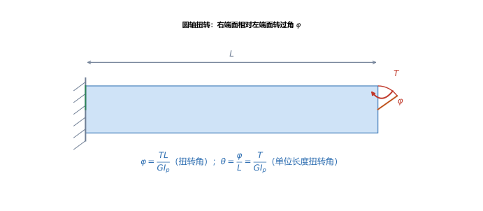
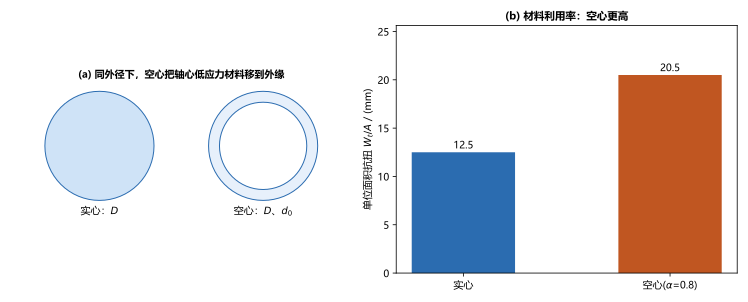
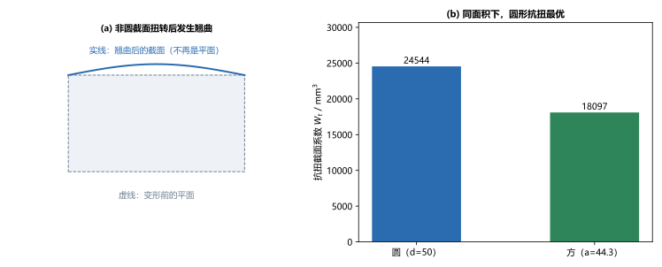

# 第 06 讲：圆轴扭转的变形与强度刚度设计

> **前置**：第 05 讲（外力偶矩、扭矩与扭矩图、圆轴扭转切应力 $\tau_\rho = T\rho/I_p$、$I_p$、$W_t$、剪切胡克定律 $\tau=G\gamma$）。
> **预计时间**：约 2.5 小时（含作业）。
>
> **一句话定位**：第 05 讲求出扭转的"切应力"，本讲补上"**轴到底扭了多少度**"（扭转角），并把强度与刚度两条判据合起来，完成圆轴扭转的完整设计；最后对比空心轴与实心轴、并认识非圆截面。
>
> **本讲回答什么**：
> 1. 一根轴受扭矩后扭多少度？扭转角和哪些量有关？
> 2. 强度够了就一定安全吗？什么时候"刚度"才是控制条件？
> 3. 为什么同样承载，空心轴比实心轴省材料？
>
> **这一讲有真实验证**：扭转角与单位长度扭转角、强度/刚度双设计与控制条件判定、空心轴与实心轴的省料比、非圆截面圆/方对照（脚本 `scripts/lec06-01_verify_torsion_design.py`）；另有扭转变形、空心 vs 实心、非圆截面三张图（`figures/`）。

---

## 引子：强度够了就没事了吗

沿用第 05 讲的轴：$T = 800\ \mathrm{N\cdot m}$、$d = 50\ \mathrm{mm}$。第 05 讲算出最大切应力 $\tau_{\max} = 32.6\ \mathrm{MPa}$。

假设材料许用切应力 $[\tau] = 40\ \mathrm{MPa}$，那么 $\tau_{\max} = 32.6 < 40$——**强度是够的**。是不是就安全了？

不一定。轴还可能**扭得太多**：如果一根传动轴扭过头，装在它上面的齿轮就会错位、机器的精度就没了。经本讲计算，这根轴每米扭 $0.93^\circ$；若工程要求不超过 $0.5^\circ/\mathrm{m}$，那么它**不合格**——**强度够，刚度不够**。

本讲就把"扭转角"和"刚度条件"讲清楚，并把强度、刚度两条判据合起来做设计。

---

## 1. 扭转变形：扭转角

### 1.1 扭转角公式

圆轴受扭矩 $T$ 后，两端面会相对转一个角度，叫**扭转角** $\varphi$（单位 rad）。由第 05 讲的几何—物理—静力三步（$\gamma = \rho\mathrm{d}\varphi/\mathrm{d}x$、$\tau=G\gamma$、$\tau_\rho=T\rho/I_p$）可以推出：

$$\boxed{\varphi = \frac{T L}{G I_p}},$$

其中 $L$ 是轴长，$G$ 是剪切模量，$I_p$ 是极惯性矩。

> **结构对照**：它和拉压变形 $\Delta L = \dfrac{NL}{EA}$ 形式完全一样——"力的效果 ÷ 抗变形的能力 × 长度"。这里 $GI_p$ 叫**扭转刚度**（抵抗扭转变形能力），正如 $EA$ 是拉压刚度。

> **图 1 怎么读**：轴左端固定，右端受外力偶矩 $T$。右端面上的半径线（橙色）相对左端面（绿色）转过了角 $\varphi$。扭转角越大，说明轴"越软"。

### 1.2 单位长度扭转角

工程上更常用**单位长度扭转角**（每米扭多少度），因为它与轴多长无关、便于比较：

$$\theta = \frac{\varphi}{L} = \frac{T}{G I_p},$$

单位通常取**度/米**（$^\circ/\mathrm{m}$）。许用值 $[\theta]$ 一般取 $0.5^\circ/\mathrm{m}\sim 1^\circ/\mathrm{m}$ 这个量级（具体由规范定）。

### 1.3 算例

（脚本 EXP1）钢轴 $d = 50\ \mathrm{mm}$、$L = 1000\ \mathrm{mm}$、$T = 800\ \mathrm{N\cdot m}$、$G = 80\ \mathrm{GPa}$：

$$I_p = \frac{\pi\times50^4}{32} = 613592\ \mathrm{mm^4},\qquad \varphi = \frac{800\times10^3 \times 1000}{80\times10^3 \times 613592} = 0.01630\ \mathrm{rad} = 0.934^\circ,$$

$$\theta = \frac{0.934^\circ}{1\ \mathrm{m}} = 0.934\ ^\circ/\mathrm{m}.$$

---

## 2. 强度条件与刚度条件

圆轴扭转有**两条**都要满足的判据：

$$\boxed{\text{强度：}\ \tau_{\max} = \frac{T}{W_t} \le [\tau]}, \qquad \boxed{\text{刚度：}\ \theta_{\max} = \frac{T}{G I_p} \le [\theta]}.$$

### 2.1 扭转的三类问题

和第 03 讲一样，每条不等式都能反着问三件事：

| 问题 | 已知 | 求 | 操作 |
|---|---|---|---|
| 强度校核 | $T$、$d$、$[\tau]$ | 是否安全（强度） | 算 $\tau_{\max}=T/W_t$ 与 $[\tau]$ 比 |
| 刚度校核 | $T$、$d$、$G$、$[\theta]$ | 是否安全（刚度） | 算 $\theta=T/(GI_p)$ 与 $[\theta]$ 比 |
| 设计截面 | $T$、$[\tau]$、$[\theta]$ | 所需直径 $d$ | 由**两条**各解一个 $d$，取**大者** |
| 求许用载荷 | $d$、$[\tau]$、$[\theta]$ | 最大 $T$ | 由**两条**各解一个 $T$，取**小者** |

**关键**：设计截面或求许用载荷时，**两条判据都要算，然后取更严的那个**（设计取更大直径，载荷取更小扭矩）。

### 2.2 谁在控制：强度还是刚度

（脚本 EXP2、EXP3）仍取 $T = 800\ \mathrm{N\cdot m}$、$d = 50\ \mathrm{mm}$、$G = 80\ \mathrm{GPa}$，$[\tau]=40\ \mathrm{MPa}$、$[\theta]=0.5^\circ/\mathrm{m}$：

- **按强度**：$W_t \ge \dfrac{T}{[\tau]} = \dfrac{800\times10^3}{40} = 20000\ \mathrm{mm^3}$ → $d \ge 46.7\ \mathrm{mm}$；
- **按刚度**：$I_p \ge \dfrac{T}{G[\theta]} = 1145916\ \mathrm{mm^4}$ → $d \ge 58.5\ \mathrm{mm}$。

取大者，最终 $d \ge 58.5\ \mathrm{mm}$——**刚度在控制**。也就是说，若只按强度选 $d = 47\ \mathrm{mm}$，虽然切应力不超限，但扭转角会超过 $0.5^\circ/\mathrm{m}$，不合格。

> **这正是引子的答案**：$d = 50\ \mathrm{mm}$ 时，强度够（$32.6 < 40$）、刚度不够（$0.934 > 0.5$）。**"强度够"不等于"安全"，还要过刚度这一关。** 传动轴、精密丝杠这类对变形敏感的轴，往往是刚度在控制设计。

---

## 3. 空心轴与实心轴

### 3.1 为什么空心更省料

回忆第 05 讲：扭转切应力沿半径**线性**分布——**轴心处接近零，外缘最大**。轴心那一大块材料应力很低、"出力很少"，把这块低效材料挖掉（做成空心轴），把材料集中到外缘，就能在不浪费材料的前提下提高抗扭能力。

> **图 2 怎么读**：(a) 同外径 $D$ 下，实心与空心截面对比；(b) 用"单位面积抗扭 $W_t/A$"衡量材料利用率——空心明显更高。

### 3.2 定量对比

（脚本 EXP4）同外径 $D = 50\ \mathrm{mm}$，空心内径 $d_0 = 40\ \mathrm{mm}$（内外径比 $\alpha = d_0/D = 0.8$）：

| | 面积 $A$ | 抗扭截面系数 $W_t$ | 材料利用率 $W_t/A$ |
|---|---|---|---|
| 实心 | $1963\ \mathrm{mm^2}$ | $24544\ \mathrm{mm^3}$ | $12.50$ |
| 空心 | $707\ \mathrm{mm^2}$ | $14491\ \mathrm{mm^3}$ | $20.50$ |

单位面积抗扭：空心 / 实心 $= 1.64$，**空心高 64%**。

再看"**同强度下的用料**"：若要达到与实心轴相同的 $W_t = 24544\ \mathrm{mm^3}$，空心轴需外径 $D = 59.6\ \mathrm{mm}$，用料 $1004\ \mathrm{mm^2}$，只有实心轴（$1963\ \mathrm{mm^2}$）的 **51.2%**——**省约 49% 材料**。

> **一句话**：**同样抗扭，空心轴省近一半材料。** 这就是为什么汽车的传动轴、飞机的结构件大量采用空心（管状）截面。

### 3.3 空心轴的代价（认识层）

空心并不总是更好：**制造更复杂、成本更高；壁太薄时管壁可能局部失稳**（像压扁的吸管）。所以是否用空心，要在"省料"与"制造/稳定"之间权衡。

---

## 4. 非圆截面扭转（认识层）

前面所有结论都建立在——**圆**截面的**平面假设**上（横截面保持平面）。一旦截面不是圆（矩形、方管、工字形……），这个假设就**不成立**了：扭转后横截面会发生**翘曲**（不再保持平面）。

> **图 3 怎么读**：(a) 矩形截面扭转后，原本的平面（虚线）翘曲成曲面（实线）——这是"非圆截面不能用圆轴公式"的根本原因；(b) 用相同面积比较，圆截面的抗扭截面系数 $W_t$ 最大。

**结论（认识层，点到为止）**：

- **非圆截面**扭转要用各自的公式（例如矩形截面 $\tau_{\max} = \dfrac{T}{\alpha h b^2}$、$\varphi = \dfrac{TL}{G\beta h b^3}$，其中 $\alpha$、$\beta$ 随高宽比查表；薄壁管用 $\tau = \dfrac{T}{2A_0 t}$）。这些属于"查表套公式"，本课不展开推导。
- 同截面积下，**圆截面的抗扭能力最强**（脚本 EXP5：圆约是方的 $1.36$ 倍）——这也是轴为什么都做成圆的。

> **现在只需知道**：$\tau_\rho=T\rho/I_p$、$\varphi=TL/(GI_p)$ 这些**只对圆截面（含空心圆环）成立**。遇到方轴、薄壁管，必须换公式或查表。

---

## 5. 本讲的心智模型

把这一讲压缩成一条主线：

> **圆轴扭转设计 = 算扭矩 → 强度条件 $\tau_{\max}=T/W_t\le[\tau]$ 与刚度条件 $\theta=T/(GI_p)\le[\theta]$ 各算一遍 → 取更严的那个。**

遇到一道扭转设计题，按这个顺序走：

1. **求扭矩**（第 05 讲）：$M=9550P/n$、扭矩图；
2. **强度**：$\tau_{\max}=T/W_t\le[\tau]$ → 解一个 $d$（或 $T$）；
3. **刚度**：$\theta=T/(GI_p)\le[\theta]$ → 再解一个 $d$（或 $T$）；
4. **取严者**：设计取更大 $d$，求载荷取更小 $T$；
5. **（可选）优化**：对变形敏感、要求省料时，考虑空心截面。

---

## 6. 小结

- **扭转角** $\varphi = \dfrac{TL}{GI_p}$（rad）；**单位长度扭转角** $\theta = \dfrac{\varphi}{L} = \dfrac{T}{GI_p}$（常用 $^\circ/\mathrm{m}$）。$GI_p$ 是**扭转刚度**，与拉压刚度 $EA$ 对应。
- 圆轴扭转有**两条判据**：**强度** $\tau_{\max}=T/W_t\le[\tau]$、**刚度** $\theta=T/(GI_p)\le[\theta]$，缺一不可。
- **设计截面**：两条件各解 $d$，**取大者**；**求许用载荷**：各解 $T$，**取小者**。控制条件可能是强度，也可能是刚度（对变形敏感处常见）。
- **空心轴**：切应力在外缘最大、轴心最小，把低应力材料移到外缘 → 同强度**省约一半材料**；代价是制造复杂、薄壁易失稳。
- **非圆截面**：平面假设不成立、截面翘曲，须用各自公式（矩形查表、薄壁管 $\tau=T/(2A_0t)$）；同面积下**圆形抗扭最优**。圆轴公式**只对圆截面成立**。

---

## 7. 作业

### 基础

**Q1. 扭转角**：钢轴 $d = 40\ \mathrm{mm}$、$L = 800\ \mathrm{mm}$、$T = 300\ \mathrm{N\cdot m}$、$G = 80\ \mathrm{GPa}$。求扭转角 $\varphi$ 与单位长度扭转角 $\theta$。

**参考答案**：

$I_p = \dfrac{\pi\times40^4}{32} = 251327\ \mathrm{mm^4}$；
$\varphi = \dfrac{TL}{GI_p} = \dfrac{300\times10^3\times800}{80\times10^3\times251327} = 0.01194\ \mathrm{rad} = 0.684^\circ$；
$\theta = \varphi/L = 0.01194/800\times1000\ \mathrm{rad/m} = 0.855\ ^\circ/\mathrm{m}$。
验算：$\theta = T/(GI_p) = 300000/(80000\times251327) = 1.492\times10^{-5}\ \mathrm{rad/mm} = 0.855^\circ/\mathrm{m}$，两路一致。

**Q2. 刚度校核**：若 Q1 轴的许用单位长度扭转角 $[\theta] = 1^\circ/\mathrm{m}$，它是否合格？

**参考答案**：

$\theta = 0.855^\circ/\mathrm{m} \le 1^\circ/\mathrm{m}$，**刚度合格**。
验算：$\theta/[\theta] = 0.855 < 1$，留有余量；若 $[\theta]$ 收紧到 $0.5^\circ/\mathrm{m}$，则不合格——说明判据取多少直接影响结论。

**Q3. 强度**：Q1 轴的许用切应力 $[\tau] = 40\ \mathrm{MPa}$，校核其强度。

**参考答案**：

$W_t = \dfrac{\pi\times40^3}{16} = 12566\ \mathrm{mm^3}$；$\tau_{\max} = \dfrac{300\times10^3}{12566} = 23.9\ \mathrm{MPa} \le 40\ \mathrm{MPa}$，**强度合格**。
验算：反代 $T = \tau_{\max}W_t = 23.9\times12566 \approx 300000\ \mathrm{N\cdot mm} = 300\ \mathrm{N\cdot m}$。

### 提高

**Q4. 按强度设计**：钢轴 $T = 500\ \mathrm{N\cdot m}$，$[\tau] = 50\ \mathrm{MPa}$。求所需最小直径。

**参考答案**：

$W_t \ge \dfrac{T}{[\tau]} = \dfrac{500\times10^3}{50} = 10000\ \mathrm{mm^3}$；
$d \ge \sqrt[3]{\dfrac{16\times10000}{\pi}} \approx 37.1\ \mathrm{mm}$，取 $d = 38\ \mathrm{mm}$。
验算：反代 $W_t = \pi\times38^3/16 \approx 10773\ \mathrm{mm^3}$，$\tau_{\max} = 500000/10773 \approx 46.4 \le 50\ \mathrm{MPa}$。

**Q5. 按刚度设计**：同 Q4 的 $T = 500\ \mathrm{N\cdot m}$、$G = 80\ \mathrm{GPa}$，$[\theta] = 0.5^\circ/\mathrm{m}$。求所需最小直径，并与 Q4 比较。

**参考答案**：

$[\theta] = 0.5^\circ/\mathrm{m} = 0.5\times\pi/180/1000 = 8.727\times10^{-6}\ \mathrm{rad/mm}$；
$I_p \ge \dfrac{T}{G[\theta]} = \dfrac{500\times10^3}{80\times10^3\times8.727\times10^{-6}} = 716200\ \mathrm{mm^4}$；
$d \ge \sqrt[4]{\dfrac{32\times716200}{\pi}} \approx 52.0\ \mathrm{mm}$，取 $d = 52\ \mathrm{mm}$。
比较：$52.0 > 37.1\ \mathrm{mm}$，**刚度控制**（本例刚度要求更严）。

**Q6. 空心 vs 实心**：一根外径 $D = 60\ \mathrm{mm}$ 的实心轴，与一根外径同为 $60\ \mathrm{mm}$、内径 $48\ \mathrm{mm}$（$\alpha = 0.8$）的空心轴相比，哪个材料利用率更高？用 $W_t/A$ 说明。

**参考答案**：

实心：$W_t = \dfrac{\pi\times60^3}{16} = 42412\ \mathrm{mm^3}$，$A = \dfrac{\pi}{4}\times60^2 = 2827\ \mathrm{mm^2}$，$W_t/A = 15.0$。
空心：$W_t = \dfrac{\pi(60^4-48^4)}{16\times60} = \dfrac{\pi\times1.765\times10^7}{960} \approx 29450\ \mathrm{mm^3}$，$A = \dfrac{\pi}{4}(60^2-48^2) = 1018\ \mathrm{mm^2}$，$W_t/A \approx 28.9$。
结论：空心 $W_t/A$ 约为实心的 $1.93$ 倍，**空心材料利用率更高**（因为把轴心低应力材料移到了外缘）。

### 综合

**Q7. 完整设计**：一台电机 $P = 22\ \mathrm{kW}$、$n = 250\ \mathrm{r/min}$，通过一根实心圆轴输出。材料 $[\tau] = 35\ \mathrm{MPa}$、$G = 80\ \mathrm{GPa}$，许用单位长度扭转角 $[\theta] = 0.7^\circ/\mathrm{m}$。（1）求外力偶矩；（2）分别按强度、刚度求所需直径；（3）确定最终直径。

**参考答案**：

(1) $M = 9550\times\dfrac{22}{250} = 840.4\ \mathrm{N\cdot m}$，扭矩 $T = 840.4\ \mathrm{N\cdot m}$。
(2) 强度：$W_t\ge 840.4\times10^3/35 = 24011\ \mathrm{mm^3}$ → $d \ge \sqrt[3]{16\times24011/\pi} \approx 49.6\ \mathrm{mm}$；
刚度：$[\theta] = 0.7\times\pi/180/1000 = 1.222\times10^{-5}\ \mathrm{rad/mm}$，$I_p \ge 840.4\times10^3/(80\times10^3\times1.222\times10^{-5}) = 859700\ \mathrm{mm^4}$ → $d \ge \sqrt[4]{32\times859700/\pi} \approx 54.4\ \mathrm{mm}$。
(3) 取大者：$d \ge 54.4\ \mathrm{mm}$，取 $d = 55\ \mathrm{mm}$（**刚度控制**）。
验算：反代 $d=55$，$\tau_{\max} = 840.4\times10^3/(\pi\times55^3/16) \approx 25.8\ \mathrm{MPa}\le 35$；$\theta = 840.4\times10^3/(80\times10^3\times\pi\times55^4/32) \approx 0.677^\circ/\mathrm{m}\le 0.7$，两项均满足。

**Q8. 开放简答**：为什么传动轴、机床丝杠这类构件，设计时常常是**刚度**（许用扭转角）比强度更控制？举出理由。

**参考答案**：

因为这类构件对**变形**敏感，而不是对"断裂"敏感：传动轴扭过头会让齿轮啮合错位、产生振动和噪声；机床丝杠扭过头会直接造成加工尺寸误差。它们的破坏往往不是"被拧断"，而是"扭得太多、精度丢失"。
于是设计时先把 $\theta$ 卡在许用值内（刚度条件），这通常要求更大的直径，强度反而先满足——所以刚度成了控制条件。
验算（自检方向）：对照 §2.2 算例，$d=50$ 时强度 $32.6<40$ 却刚度 $0.934>0.5$——正是"强度先过、刚度卡住"的典型。

---

*下一讲预告——第 07 讲《截面的几何性质》：到这里，拉伸、扭转都用到了截面量（$A$、$I_p$、$W_t$）。接下来要处理弯曲，它会用到更一般的截面量——形心、静矩、惯性矩、平行移轴。第 07 讲专门把这些"截面的几何性质"讲清、算熟。*
