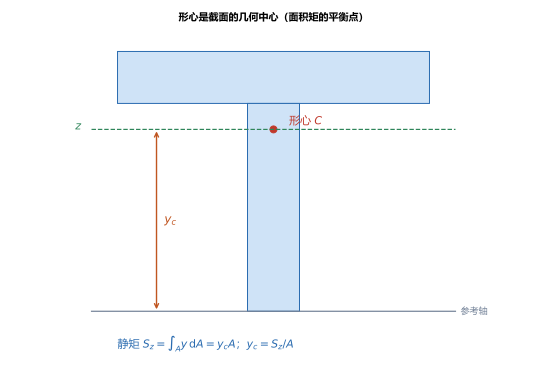
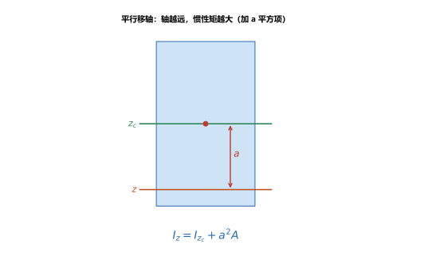
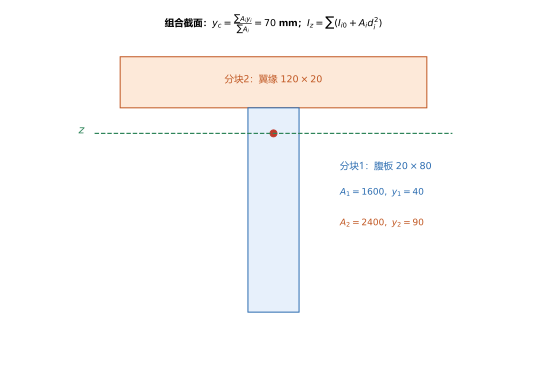

# 第 07 讲：截面的几何性质

> **前置**：第 01–06 讲（尤其是拉压用的 $A$、扭转用的 $I_p$、$W_t$）。
> **预计时间**：约 2.5 小时（含作业；本讲计算量较大，建议边读边动手算）。
>
> **一句话定位**：前面几讲各自用到截面的某个量（$A$、$I_p$、$W_t$）。接下来要讲**弯曲**，它会用到更一般的截面量——**形心、静矩、惯性矩、平行移轴**。本讲把这些"截面自身的几何性质"集中讲清、算熟，作为弯曲各讲的底座。
>
> **本讲回答什么**：
> 1. 形心怎么定？静矩是什么？
> 2. 惯性矩描述截面的什么性质？为什么同一个截面换个参考轴，惯性矩就变了？
> 3. 组合截面（T 形、工字形）的形心和惯性矩怎么一步步算出来？
>
> **这一讲有真实验证**：矩形与圆/圆环的惯性矩、平行移轴定理的两种算法互证、T 形组合截面的形心与惯性矩、$I_p=I_z+I_y$ 关系（脚本 `scripts/lec07-01_verify_section_props.py`）；另有形心静矩、平行移轴、组合截面分块三张图（`figures/`）。

---

## 引子：同样受弯，为什么工字钢比圆钢"划算"

一根梁受弯时，它的抗弯能力取决于一个截面量——**惯性矩** $I_z$。惯性矩越大，梁越"抗弯"。

有意思的是：把同样多的材料做成**圆棒**和做成**工字钢**，后者的惯性矩大得多。原因在于，惯性矩是把截面上每个微小面积"乘以它到中性轴距离的平方"再加起来——**把材料放得离中性轴越远，惯性矩越大**。工字形把材料集中在上下两个翼缘（远离中性轴），中间只用薄薄的腹板连接，于是用同样多的材料换来了大得多的惯性矩。

要讲清这件事，先把"形心、静矩、惯性矩、平行移轴"这几个截面量定义清楚。

---

## 1. 静矩与形心

### 1.1 静矩

取一个平面图形（截面），在上面取一根参考轴 $z$。把截面分成无数微小面积 $\mathrm{d}A$，每块离轴的距离为 $y$。定义**静矩**（面积矩）：

$$S_z = \int_A y\,\mathrm{d}A.$$

它描述"截面面积相对于某根轴的分布"。注意：**静矩是对某一根轴而言的**，换轴就变。

### 1.2 形心

**形心** $C$ 是截面的几何中心。它与静矩的关系是：

$$\boxed{y_c = \frac{S_z}{A} = \frac{\int_A y\,\mathrm{d}A}{A}},$$

即**形心到参考轴的距离 = 静矩 ÷ 面积**。反过来，$S_z = y_c A$。

> **一条重要性质**：**截面对其形心轴的静矩恒为零**（$S_{zc} = 0$）。这是因为形心就在"面积矩的平衡点"上，正负两侧的 $y\,\mathrm{d}A$ 正好抵消。这条性质是后面平行移轴定理成立的关键。

> **图 1 怎么读**：一个 T 形截面，底边为参考轴。形心 $C$ 在 $y_c$ 处；截面对参考轴的静矩 $S_z = y_c A$。形心轴 $z$（过 C）的静矩为零。

### 1.3 组合截面的形心

工程截面常能拆成几个简单矩形。**组合截面的形心**用面积加权平均求：

$$\boxed{y_c = \frac{\sum A_i\, y_i}{\sum A_i}},$$

其中 $A_i$ 是第 $i$ 块的面积，$y_i$ 是它的形心到参考轴的距离。（连续情形就是上面的积分。）

---

## 2. 惯性矩、惯性半径、极惯性矩

### 2.1 惯性矩

**惯性矩**定义为每块面积乘以其到轴距离的平方、再求和：

$$I_z = \int_A y^2\,\mathrm{d}A\qquad(\text{对 }z\text{ 轴}),\qquad I_y = \int_A z^2\,\mathrm{d}A\qquad(\text{对 }y\text{ 轴}).$$

它描述截面**抵抗弯曲变形的能力**：$I$ 越大，梁越难弯。这与静矩不同——因为带**平方**，$I_z$ 恒为正，而且对远离轴的材料特别"敏感"。

### 2.2 惯性半径

**惯性半径** $i$ 把惯性矩"折算"成一个长度：

$$i = \sqrt{\frac{I}{A}},$$

量纲是长度。它在压杆稳定（第 17 讲）里会用到。

### 2.3 极惯性矩与关系

**极惯性矩**对**形心**（原点）定义，是"到形心距离 $\rho$ 的平方"的面积积分：

$$I_p = \int_A \rho^2\,\mathrm{d}A.$$

因为 $\rho^2 = z^2 + y^2$，所以它和两个方向惯性矩满足：

$$\boxed{I_p = I_z + I_y}.$$

（第 05 讲扭转用的 $I_p$ 就是这个量。）

### 2.4 常见截面的惯性矩

（脚本 EXP1、EXP4）这几个公式必须记牢：

| 截面 | 惯性矩 | 抗弯截面系数 $W=I/y_{\max}$ |
|---|---|---|
| 矩形 $b\times h$ | $I_z = \dfrac{bh^3}{12}$ | $W_z = \dfrac{bh^2}{6}$ |
| 圆，直径 $d$ | $I_z = \dfrac{\pi d^4}{64}$ | $W_z = \dfrac{\pi d^3}{32}$ |
| 圆环（外 $D$、内 $d_0$） | $I_z = \dfrac{\pi(D^4-d_0^4)}{64}$ | $W_z = \dfrac{\pi(D^4-d_0^4)}{32D}$ |
| 极惯性矩（圆） | $I_p = \dfrac{\pi d^4}{32} = 2I_z$ | — |

**算例**：矩形 $60\times100$：$I_z = \dfrac{60\times100^3}{12} = 5\times10^6\ \mathrm{mm^4}$，$W_z = \dfrac{I_z}{50} = 1\times10^5\ \mathrm{mm^3}$。圆 $d=50$：$I_z = 3.068\times10^5$、$I_p = 6.136\times10^5 = 2I_z$（脚本 EXP5 核对偏差为 0）。

---

## 3. 平行移轴定理

### 3.1 定理

同一个截面，对**形心轴** $z_c$ 的惯性矩 $I_{z_c}$ 与对**一根平行于它、距离为 $a$** 的轴 $z$ 的惯性矩 $I_z$ 之间，有一个简单关系：

$$\boxed{I_z = I_{z_c} + a^2 A},$$

其中 $A$ 是截面面积。这就是**平行移轴定理**。

> **图 2 怎么读**：绿色是过形心的轴 $z_c$，橙色是与它平行、相距 $a$ 的轴 $z$。把轴从形心移开，惯性矩会增加一个 $a^2A$（恒为正）。

### 3.2 为什么是"从形心轴出发"

定理里的 $a$ 是**两轴之间的距离**，而 $I_{z_c}$ 必须是**对形心轴**的惯性矩——因为推导中用到了"截面对形心轴的静矩为零"（§1.2）。**所以公式只能从形心轴移向平行轴，不能随便在两根非形心轴之间乱套。**

### 3.3 验证

（脚本 EXP2）矩形 $60\times100$，以**底边**为轴：

- 直接用积分：$I = \dfrac{bh^3}{3} = \dfrac{60\times100^3}{3} = 2\times10^7\ \mathrm{mm^4}$；
- 用平行移轴：$I = I_{z_c} + a^2 A = 5\times10^6 + 50^2\times6000 = 5\times10^6 + 1.5\times10^7 = 2\times10^7\ \mathrm{mm^4}$。

两路完全相同——定理成立。

> **记忆点**：矩形对**底边**的惯性矩是 $\dfrac{bh^3}{3}$，正好是"对形心轴 $\dfrac{bh^3}{12}$ 加上移动项 $\dfrac{bh^3}{4}$"。

---

## 4. 组合截面的计算（标准流程）

T 形、工字形等组合截面，求形心和惯性矩走固定四步：

1. **分块**：把截面拆成几个矩形（记每块面积 $A_i$ 和它的形心位置 $y_i$）；
2. **求形心**：$y_c = \dfrac{\sum A_i y_i}{\sum A_i}$；
3. **算每块的形心轴惯性矩**：$I_{i0} = \dfrac{b_i h_i^3}{12}$（每块对自己形心轴）；
4. **平行移轴求和**：$I_z = \sum\left(I_{i0} + A_i d_i^2\right)$，其中 $d_i = y_i - y_c$ 是该块形心到整体形心的距离。

> **图 3 怎么读**：T 形拆成"腹板 $20\times80$"和"翼缘 $120\times20$"两块；分别算出面积、形心位置，再按上面四步求和。

**算例**（脚本 EXP3）：T 形——腹板 $20\times80$（$A_1=1600$，$y_1=40$），翼缘 $120\times20$（$A_2=2400$，$y_2=90$），以底边为参考轴：

$$y_c = \frac{1600\times40 + 2400\times90}{1600+2400} = 70\ \mathrm{mm}.$$

$$I_z = \underbrace{\left[\frac{20\times80^3}{12} + 1600\times(40-70)^2\right]}_{\text{腹板}} + \underbrace{\left[\frac{120\times20^3}{12} + 2400\times(90-70)^2\right]}_{\text{翼缘}} = 3.333\times10^6\ \mathrm{mm^4}.$$

**抗弯截面系数**上下不等（T 形不对称）：$W_{下} = \dfrac{I_z}{y_c} = \dfrac{3.333\times10^6}{70} = 4.76\times10^4\ \mathrm{mm^3}$；$W_{上} = \dfrac{I_z}{100-70} = 1.11\times10^5\ \mathrm{mm^3}$。**下缘离中性轴更远，$W$ 更小、更危险**——这是不对称截面必须"上下分别验算"的原因。

---

## 5. 转轴公式与主惯性轴（认识层）

如果参考轴**不平行**、而是绕原点**旋转**，惯性矩会怎么变？这由**转轴公式**给出（涉及一个叫**惯性积** $I_{yz}=\int_A yz\,\mathrm{d}A$ 的量）。核心结论是：

- 存在一对互相垂直的轴，使**惯性积为零**、且一个方向的惯性矩取极大、另一个取极小——这对轴叫**主惯性轴**，对应的惯性矩叫**主惯性矩**；
- **若截面有对称轴，则对称轴就是主惯性轴**（很多常见截面的形心轴天然就是主惯性轴）。

> **现在只需知道**：转轴公式在弯曲的一般情形（斜弯曲）里会用到，本课不展开推导；遇到有对称轴的常见截面，直接用形心轴即可。

---

## 6. 本讲的心智模型

把这一讲压缩成一套算法：

> **截面量题 = 先定参考轴 → 求形心（$y_c=\sum A_iy_i/\sum A_i$）→ 用平行移轴算惯性矩（$I=\sum(I_{i0}+A_id_i^2)$）→ 得 $W=I/y_{\max}$。**

遇到组合截面题，按这个顺序走：

1. **分块**，列每块的 $A_i$、$y_i$；
2. **求 $y_c$**（面积加权）；
3. **求 $I_z$**：每块先算自身形心轴的 $I_{i0}=\dfrac{bh^3}{12}$，再平行移轴加 $A_id_i^2$，求和；
4. **求 $W$**：$W=\dfrac{I_z}{y_{\max}}$，注意不对称时要算上下两个。

---

## 7. 小结

- **静矩** $S_z=\int_A y\,\mathrm{d}A$；**形心** $y_c = S_z/A$；组合截面 $y_c=\dfrac{\sum A_iy_i}{\sum A_i}$。截面对**形心轴**的静矩为零。
- **惯性矩** $I_z=\int_A y^2\,\mathrm{d}A$（恒正，描述抗弯能力）；**惯性半径** $i=\sqrt{I/A}$；**极惯性矩** $I_p=I_z+I_y$。
- **常见截面**：矩形 $I_z=\dfrac{bh^3}{12}$、$W_z=\dfrac{bh^2}{6}$；圆 $I_z=\dfrac{\pi d^4}{64}$；圆环 $I_z=\dfrac{\pi(D^4-d_0^4)}{64}$。
- **平行移轴定理** $I_z = I_{z_c} + a^2A$：只从**形心轴**移向平行轴；矩形对底边 $I=\dfrac{bh^3}{3}$。
- **组合截面四步**：分块 → 求形心 → 各块 $I_{i0}$ → 平行移轴求和。
- **转轴公式/主惯性轴**：旋转轴用惯性积描述；有对称轴的截面，对称轴即主惯性轴（认识层）。

---

## 8. 作业

### 基础

**Q1. 矩形惯性矩**：矩形截面 $b = 40\ \mathrm{mm}$、$h = 80\ \mathrm{mm}$。求对形心轴的 $I_z$ 与 $W_z$。

**参考答案**：

$I_z = \dfrac{bh^3}{12} = \dfrac{40\times80^3}{12} = 1.707\times10^6\ \mathrm{mm^4}$；
$W_z = \dfrac{I_z}{h/2} = \dfrac{1.707\times10^6}{40} = 4.267\times10^4\ \mathrm{mm^3}$。
验算：$W_z = bh^2/6 = 40\times6400/6 = 4.267\times10^4\ \mathrm{mm^3}$，两路一致。

**Q2. 组合截面形心**：一个组合截面由两块矩形组成——下块 $60\times40$（形心在 $y=20$），上块 $40\times40$（形心在 $y=60$）。求组合截面形心 $y_c$。

**参考答案**：

$A_1=2400$、$y_1=20$；$A_2=1600$、$y_2=60$。
$y_c = \dfrac{2400\times20+1600\times60}{2400+1600} = \dfrac{144000}{4000} = 36\ \mathrm{mm}$。
验算：形心偏向下块（面积大的那块），36 mm 介于 20 与 60 之间且更靠近 20，方向合理。

**Q3. 平行移轴**：Q1 的矩形，求对**底边**的惯性矩，并用平行移轴验证。

**参考答案**：

直接积分：$I = \dfrac{bh^3}{3} = \dfrac{40\times80^3}{3} = 6.827\times10^6\ \mathrm{mm^4}$。
平行移轴：$I_{z_c} + (h/2)^2A = 1.707\times10^6 + 40^2\times3200 = 1.707\times10^6 + 5.12\times10^6 = 6.827\times10^6\ \mathrm{mm^4}$。
两路一致，定理成立。

### 提高

**Q4. T 形组合截面**：T 形——腹板 $20\times100$（形心 $y=50$），翼缘 $60\times20$（形心 $y=110$）。求形心 $y_c$ 与 $I_z$（以底边为参考轴）。

**参考答案**：

$A_1=2000$、$y_1=50$；$A_2=1200$、$y_2=110$。
$y_c = \dfrac{2000\times50+1200\times110}{3200} = 72.5\ \mathrm{mm}$。
腹板：$I_{10}=\dfrac{20\times100^3}{12}=1.667\times10^6$，$d_1=50-72.5=-22.5$，$A_1d_1^2=2000\times506.25=1.0125\times10^6$；
翼缘：$I_{20}=\dfrac{60\times20^3}{12}=4\times10^4$，$d_2=110-72.5=37.5$，$A_2d_2^2=1200\times1406.25=1.6875\times10^6$；
$I_z = (1.667+1.0125+0.04+1.6875)\times10^6 = 4.407\times10^6\ \mathrm{mm^4}$。
验算：$d$ 是相对整体形心的距离，两块的 $A_id_i^2$ 都为正，量级合理。

**Q5. 圆与圆环**：求（1）圆 $d=60\ \mathrm{mm}$ 的 $I_z$ 与 $I_p$；（2）圆环 $D=80\ \mathrm{mm}$、$d_0=60\ \mathrm{mm}$ 的 $I_z$。

**参考答案**：

(1) $I_z = \dfrac{\pi\times60^4}{64} = 6.362\times10^5\ \mathrm{mm^4}$；$I_p = 2I_z = 1.272\times10^6\ \mathrm{mm^4}$。
(2) $I_z = \dfrac{\pi(80^4-60^4)}{64} = \dfrac{\pi(4.096-1.296)\times10^7}{64} = 1.374\times10^6\ \mathrm{mm^4}$。
验算：(1) 用 $I_p=\pi d^4/32$ 直接算 $=1.272\times10^6$，与 $2I_z$ 一致。

**Q6. 惯性半径**：矩形 $60\times100$，求对形心轴的惯性半径 $i_z$。

**参考答案**：

$A=6000$，$I_z=5\times10^6$；$i_z=\sqrt{I_z/A}=\sqrt{833.3}=28.9\ \mathrm{mm}$。
验算：$i$ 的量纲是长度（mm），且小于截面高度的一半（50 mm），合理。

### 综合

**Q7. 工字形截面**：一个对称工字形——上下翼缘各 $80\times10$（形心分别在 $y=75$、$y=5$），腹板 $20\times60$（形心 $y=40$）。求形心 $y_c$、$I_z$ 与 $W_z$。

**参考答案**：

$y_c = \dfrac{800\times75+1200\times40+800\times5}{800+1200+800} = \dfrac{112000}{2800} = 40\ \mathrm{mm}$（对称，恰在中间）。
上翼缘：$I_{10}=\dfrac{80\times10^3}{12}=6667$，$d=35$，$A d^2=800\times1225=9.8\times10^5$；
腹板：$I_{20}=\dfrac{20\times60^3}{12}=3.6\times10^5$，$d=0$，贡献 $0$；
下翼缘：与上翼缘相同，$6.667\times10^3+9.8\times10^5$；
$I_z = 2\times(6667+980000)+360000 = 2.333\times10^6\ \mathrm{mm^4}$。
$W_z = \dfrac{I_z}{40} = 5.833\times10^4\ \mathrm{mm^3}$（对称，上下相同）。
验算：腹板离中性轴近、贡献小；翼缘离得远、贡献大——这正是工字形"省料"的原因。

**Q8. 开放简答**：为什么同样多的材料，做成工字形比做成矩形"抗弯"得多？用惯性矩的定义解释。

**参考答案**：

惯性矩 $I=\int y^2\,\mathrm{d}A$ 里，材料到中性轴的距离 $y$ 是**平方**权重——离轴越远的材料，贡献越大；靠轴的材料几乎"不出力"。
工字形把大部分面积放在上下两个翼缘（离中性轴最远），中间只用薄腹板连接，于是同样多的材料产生了大得多的 $I$，抗弯能力更强。
矩形则把一部分材料留在中性轴附近（低效区），所以同样面积下 $I$ 更小。
验算（自检方向）：对照第 06 讲"空心轴把低应力材料从轴心移到外缘"，这里的逻辑完全相同——都是"把材料放到离轴最远处"。中性轴附近的材料，无论受弯还是受扭，都是低效区。

---

*下一讲预告——第 08 讲《平面弯曲的内力：剪力与弯矩》：截面的几何量（形心、惯性矩）齐备后，正式进入弯曲。第 08 讲先从"内力"入手——梁的剪力与弯矩怎么求、剪力图与弯矩图怎么画，以及载荷、剪力、弯矩之间的微分关系。*
