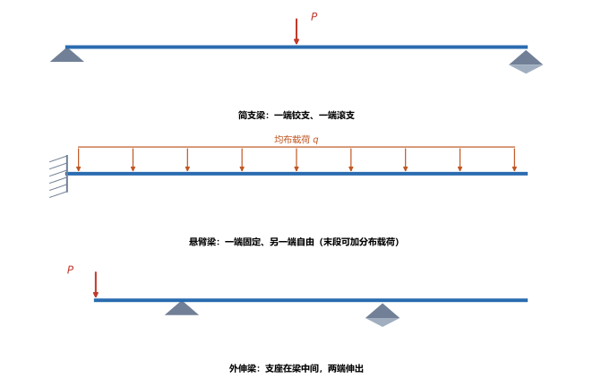
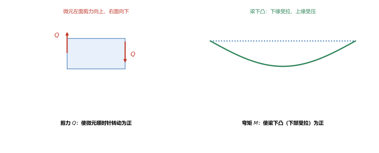
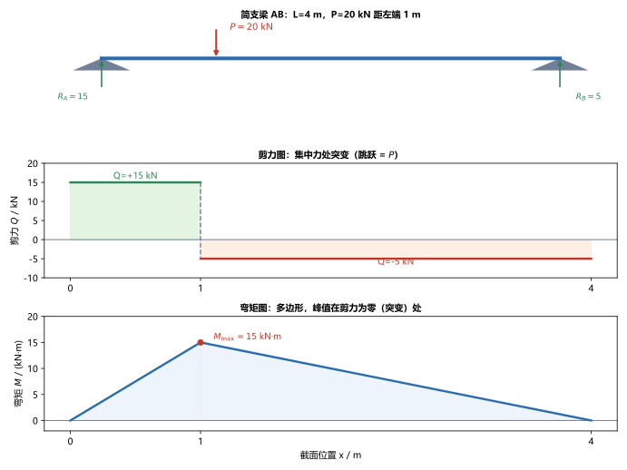

# 第 08 讲：平面弯曲的内力：剪力与弯矩

> **前置**：第 01 讲（截面法）、第 07 讲（截面几何量，本讲暂不直接用，但为后面几讲备好）。
> **预计时间**：约 3 小时（含作业；本讲是全课程最需要动手练画图的一讲）。
>
> **一句话定位**：前几讲处理的都是"沿轴线"的受力（拉压、扭转）。弯曲是第四种基本变形——**力垂直于轴线**压在梁上。本讲先解决弯曲的"内力"：梁内部各截面上有**剪力 $Q$** 和**弯矩 $M$**，把它们的分布画成图，并掌握载荷—剪力—弯矩之间的微分关系。这是弯曲的起点。
>
> **本讲回答什么**：
> 1. 梁有哪几种？支座和载荷怎么归类？静定梁的反力怎么求？
> 2. 弯曲时截面上的内力是什么？$Q$、$M$ 的正负怎么定？
> 3. 剪力图、弯矩图怎么画？为什么"弯矩极值在剪力为零处"？
>
> **这一讲有真实验证**：简支梁受集中力、简支梁受均布载荷、悬臂梁的剪力与弯矩计算，以及微分关系 $dM/dx=Q$、$dQ/dx=q$ 的数值核对（脚本 `scripts/lec08-01_verify_shear_moment.py`）；另有梁类型、正负约定、剪力图弯矩图三张图（`figures/`）。

---

## 引子：一根梁，内部发生了什么

一根简支梁（两端搁在支座上），中间压一个重物。梁没有断，但内部**每一处截面**都在承受两种内力：

- **剪力 $Q$**：截面内、垂直于梁轴线的内力（"想把这个截面两侧上下错开"）；
- **弯矩 $M$**：截面内的力偶（"想让这段梁弯起来"）。

不同位置的 $Q$、$M$ 大小不同——靠近支座和靠近载荷处差别很大。想知道"哪个截面最危险"，就要把 $Q$、$M$ 沿梁长的分布画出来，这就是**剪力图**和**弯矩图**。本讲从头建立这套方法。

---

## 1. 梁、支座与载荷

### 1.1 支座与梁的类型

按支座约束方式：

- **铰支座**：限制平动、允许转动（提供水平与竖向反力）；
- **滚动支座**：只提供竖向反力，允许水平移动与转动；
- **固定端**：限制平动与转动（提供反力 + 反力偶）。

由此得到几种常见梁：

- **简支梁**：一端铰支、一端滚支（最常见）；
- **悬臂梁**：一端固定、另一端自由；
- **外伸梁**：支座在梁的中部，梁的两端伸出支座之外。

> **图 1 怎么读**：从上到下依次是简支梁（铰+滚）、悬臂梁（固定端 + 均布载荷）、外伸梁（支座在中、两端外伸）。

### 1.2 载荷类型

- **集中力**（如吊重、支座反力）；
- **集中力偶**（如作用在梁上的力矩）；
- **分布载荷** $q$：沿梁长连续分布（如自重、雪载），单位 $\mathrm{N/m}$；均匀分布时叫均布载荷。

### 1.3 支座反力：先由整体平衡求

**静定梁**（简支、悬臂、外伸）的支座反力，全部可以由**整体平衡**求出：

$$\sum F_y = 0,\qquad \sum M = 0.$$

求出反力后，才用截面法去求各截面的内力。**顺序不能反**：先反力、后内力。

---

## 2. 剪力与弯矩及其正负约定

### 2.1 用截面法求内力

在某截面处假想切开，取一侧。这一侧的截面上，来自另一侧的作用可以分解为：

- 一个**竖向内力**——**剪力** $Q$；
- 一个**力偶**——**弯矩** $M$。

对取出的这一侧列平衡方程（$\sum F_y=0$、$\sum M=0$），就能解出该截面的 $Q$ 和 $M$。

### 2.2 正负约定

弯矩、剪力的正负必须先约定。本课程采用：

> **剪力 $Q$**：使微元（截取的一小段梁）产生**顺时针转动趋势**的剪力为正。等价地说，正剪力下，微元的**左面剪力向上、右面剪力向下**（口诀"左上右下"）。
>
> **弯矩 $M$**：使梁**下凸**（即**下部受拉、上部受压**）的弯矩为正。

> **图 2 怎么读**：(a) 一小段梁（微元），左面剪力向上、右面向下 → 微元顺时针转 → 正剪力；(b) 梁向下凸出（像一张笑脸），下缘受拉 → 正弯矩。

> **为什么正弯矩规定为"下凸"**：约定本身可以任意选，但要和后面的弯曲应力公式自洽。本课程一律采用"下凸为正"（工科常用）。**务必全程统一**，中途换约定会全错。

---

## 3. 剪力方程、弯矩方程与内力图

### 3.1 写方程、画图

把梁沿轴线分成若干段（分段点是集中力、集中力偶、分布载荷的起止处）。在每段里，令截面位置为 $x$，用截面法写出该段的：

- **剪力方程** $Q(x)$；
- **弯矩方程** $M(x)$。

把它们画在 $x$ 坐标下，就是**剪力图**和**弯矩图**。

### 3.2 算例：简支梁受集中力

（脚本 EXP1，图 3）简支梁 $AB$：跨长 $L = 4\ \mathrm{m}$，集中力 $P = 20\ \mathrm{kN}$，距左端 $a = 1\ \mathrm{m}$（$b = 3\ \mathrm{m}$）。

**第一步，求反力**（整体平衡）：$R_A = \dfrac{Pb}{L} = \dfrac{20\times3}{4} = 15\ \mathrm{kN}$，$R_B = \dfrac{Pa}{L} = \dfrac{20\times1}{4} = 5\ \mathrm{kN}$（$15+5=20=P$ ✓）。

**第二步，分段写内力**（取截面左侧为研究对象）：

- **AC 段**（$0<x<a$）：$Q = R_A = +15\ \mathrm{kN}$，$M = R_A x = 15x$；
- **CB 段**（$a<x<L$）：$Q = R_A - P = -5\ \mathrm{kN}$，$M = R_A x - P(x-a) = 20 - 5x$。

**第三步，作图**：

> **图 3 怎么读**：中间是剪力图——在 $x=1\ \mathrm{m}$（集中力处）从 $+15\ \mathrm{kN}$ 突变为 $-5\ \mathrm{kN}$；下面是弯矩图——两条直线段，在 $x=1\ \mathrm{m}$ 处形成一个**尖峰** $M_{\max} = 15\ \mathrm{kN\cdot m}$。

**两个规律**（本例体现）：

- **集中力处，剪力图突变**，跳跃量等于该集中力（$15 \to -5$，跳跃 $-20 = -P$）；
- **集中力处，弯矩图出现折点（尖峰）**——最大值 $M_{\max} = \dfrac{Pab}{L} = \dfrac{20\times1\times3}{4} = 15\ \mathrm{kN\cdot m}$。

### 3.3 算例：简支梁受均布载荷

（脚本 EXP2）简支梁 $L = 4\ \mathrm{m}$，均布载荷 $q = 10\ \mathrm{kN/m}$：

$$R = \frac{qL}{2} = 20\ \mathrm{kN},\qquad Q(x) = \frac{qL}{2} - qx,\qquad M(x) = \frac{qLx}{2} - \frac{qx^2}{2}.$$

跨中（$x=L/2$）弯矩最大：

$$M_{\max} = \frac{qL^2}{8} = \frac{10\times4^2}{8} = 20\ \mathrm{kN\cdot m}.$$

---

## 4. 载荷、剪力、弯矩之间的微分关系

这是本讲最有用的一条规律。取一段微小的梁 $\mathrm{d}x$，由平衡可以推出：

$$\boxed{\frac{\mathrm{d}Q}{\mathrm{d}x} = q(x),\qquad \frac{\mathrm{d}M}{\mathrm{d}x} = Q(x)}.$$

（$q$ 以向上为正时符号如上，具体符号随约定；本课程按"向上为正"。）

（脚本 EXP4）数值核对：在 AC 段 $M = 15x$ 是直线，$\dfrac{\mathrm{d}M}{\mathrm{d}x} = 15 = Q$，差分实测均值 $15.0$，与剪力完全一致。

### 4.1 由微分关系得到作图规律

| 区段 | 剪力 $Q$ | 弯矩 $M$ |
|---|---|---|
| 无载荷段（$q=0$） | 常数（水平线） | 直线（斜率为 $Q$） |
| 均布载荷段（$q$ 常数） | 斜线 | 抛物线 |
| 集中力处 | **突变**（跳跃 $=P$） | 折点（斜率突变） |
| 集中力偶处 | 不变 | **突变**（跳跃 $=M_0$） |
| $Q=0$ 处 | — | **$M$ 取极值**（最大或最小） |

> **最后一条最重要**：$\dfrac{\mathrm{d}M}{\mathrm{d}x}=Q$，所以 $M$ 的极值点正是 $Q=0$ 的位置。**要找最大弯矩，先找剪力为零的截面。** 这正是图 3 里弯矩峰值出现在集中力处（剪力跨过零）的原因。

---

## 5. 用微分关系快速作图（控制截面法）

熟练后不必逐段列方程，用"控制截面 + 微分关系"更稳妥：

1. **求反力**；
2. **标控制截面**：集中力、集中力偶、分布载荷起止点、梁端点；
3. **逐段定形状**：按 §4.1 的表判断每段的 $Q$、$M$ 是水平线、斜线还是抛物线；
4. **标关键值**：段端点的 $Q$、$M$ 值（由截面法或微分关系积分）；
5. **连图**：突变处画竖线，抛物线按开口方向画。

> **自检口诀**：剪力图"哪里突变？跳到多少？"——突变一定发生在集中力/集中力偶处，跳跃量可反查载荷；弯矩图"哪里是峰值？"——一定在 $Q=0$ 处或突变点。画完对一遍，错了立刻能发现。

---

## 6. 叠加原理作内力图（认识层）

当梁上同时作用多种载荷时，可以**分别作出每种载荷的剪力图、弯矩图，再叠加**（对应位置的纵坐标相加）。依据是小变形假设下的线性叠加。

> **现在只需知道**：叠加法在多载荷时更省事，尤其配合第 11 讲弯曲变形的查表方法。本课先掌握单载荷的作图，叠加在作业里体会。

---

## 7. 本讲的心智模型

把这一讲压缩成一条主线：

> **弯曲内力题 = 先求反力 → 分段写 $Q(x)$、$M(x)$（或按微分关系作图）→ 画剪力图、弯矩图 → 找 $Q=0$ 处的 $M$ 极值。**

遇到一道题，按这个顺序走：

1. **求反力**：整体平衡 $\sum F_y=0$、$\sum M=0$；
2. **分段**：在集中力、力偶、分布载荷起止处断开；
3. **定内力**：每段用截面法（或由微分关系积分）；
4. **作图 + 自检**：集中力处 $Q$ 突变、力偶处 $M$ 突变、均布段抛物、$Q=0$ 处 $M$ 极值。

---

## 8. 小结

- **梁与支座**：铰支/滚支/固定端；**简支梁**（铰+滚）、**悬臂梁**（固定+自由）、**外伸梁**。载荷分集中力、集中力偶、分布载荷。**静定梁反力由整体平衡求出。**
- **弯曲内力**：剪力 $Q$（垂直于轴线的内力）与弯矩 $M$（力偶）。正负约定：**$Q$ 使微元顺时针为正（左上右下）；$M$ 使梁下凸（下部受拉）为正。**
- **内力图**：分段写 $Q(x)$、$M(x)$ 后作图。集中力处 $Q$ **突变**（跳跃 $=P$）、$M$ **折点**；集中力偶处 $M$ **突变**。
- **微分关系**：$\dfrac{\mathrm{d}Q}{\mathrm{d}x}=q$、$\dfrac{\mathrm{d}M}{\mathrm{d}x}=Q$。由此：无载段 $Q$ 常数、$M$ 直线；均布段 $Q$ 斜线、$M$ 抛物线；**$Q=0$ 处 $M$ 取极值。**
- **典型结果**：简支梁中点集中力 $M_{\max}=\dfrac{PL}{4}$、任意位置 $\dfrac{Pab}{L}$；简支梁均布 $M_{\max}=\dfrac{qL^2}{8}$；悬臂端部集中力 $M_{\max}=PL$。
- **叠加**：多载荷时可分别作图再叠加（认识层）。

---

## 9. 作业

### 基础

**Q1. 简支梁中点集中力**：简支梁 $L = 6\ \mathrm{m}$，跨中集中力 $P = 30\ \mathrm{kN}$。求支座反力、剪力方程、最大弯矩。

**参考答案**：

对称，反力 $R_A = R_B = \dfrac{P}{2} = 15\ \mathrm{kN}$。
剪力：左半段 $Q=+15\ \mathrm{kN}$，右半段 $Q=-15\ \mathrm{kN}$（跨中突变 $-P=-30$）。
最大弯矩在跨中：$M_{\max} = \dfrac{PL}{4} = \dfrac{30\times6}{4} = 45\ \mathrm{kN\cdot m}$。
验算：用 $\dfrac{Pab}{L}$（$a=b=3$）得 $\dfrac{30\times3\times3}{6}=45$，一致。

**Q2. 简支梁均布载荷**：简支梁 $L = 6\ \mathrm{m}$，均布载荷 $q = 8\ \mathrm{kN/m}$。求反力与最大弯矩。

**参考答案**：

$R_A = R_B = \dfrac{qL}{2} = \dfrac{8\times6}{2} = 24\ \mathrm{kN}$；
$M_{\max} = \dfrac{qL^2}{8} = \dfrac{8\times36}{8} = 36\ \mathrm{kN\cdot m}$（跨中）。
验算：跨中 $Q(x)=qL/2-qx=24-8\times3=0$，确实剪力为零，故弯矩取极值。

**Q3. 悬臂梁端部集中力**：悬臂梁长 $L = 2\ \mathrm{m}$，自由端集中力 $P = 10\ \mathrm{kN}$。求固定端弯矩。

**参考答案**：

剪力 $Q = -10\ \mathrm{kN}$（全长常量）；弯矩 $M = -Px$，固定端 $|M_{\max}| = PL = 10\times2 = 20\ \mathrm{kN\cdot m}$。
验算：固定端弯矩等于"载荷对固定端的力矩" $=P\cdot L=20\ \mathrm{kN\cdot m}$，与整体平衡一致。

### 提高

**Q4. 非对称集中力**：简支梁 $L = 6\ \mathrm{m}$，集中力 $P = 30\ \mathrm{kN}$ 距左端 $a = 2\ \mathrm{m}$。求反力、剪力突变、最大弯矩。

**参考答案**：

$R_A = \dfrac{Pb}{L} = \dfrac{30\times4}{6} = 20\ \mathrm{kN}$，$R_B = \dfrac{Pa}{L} = \dfrac{30\times2}{6} = 10\ \mathrm{kN}$（$20+10=30$ ✓）。
剪力：AC 段 $Q=+20\ \mathrm{kN}$，CB 段 $Q=20-30=-10\ \mathrm{kN}$；$x=2$ 处突变 $-30=-P$。
最大弯矩在 $x=2$：$M_{\max} = \dfrac{Pab}{L} = \dfrac{30\times2\times4}{6} = 40\ \mathrm{kN\cdot m}$。
验算：$M(2)=R_A\times2=20\times2=40$，与公式一致。

**Q5. 由微分关系求弯矩**：某梁一段内剪力为常数 $Q = +12\ \mathrm{kN}$，该段起点（$x=0$）弯矩 $M = 6\ \mathrm{kN\cdot m}$。求该段弯矩方程，并说明弯矩图的形状。

**参考答案**：

由 $\dfrac{\mathrm{d}M}{\mathrm{d}x}=Q=12$，积分得 $M(x)=12x+C$；代入 $M(0)=6$ 得 $C=6$，故 $M(x)=12x+6\ (\mathrm{kN\cdot m})$。
形状：$Q$ 为常数 → $M$ 是**斜率 $12$ 的直线**。
验算：$M(1)=18$，$\Delta M/\Delta x=(18-6)/1=12=Q$，与微分关系一致。

**Q6. 图形判断**：一根梁的一段上作用均布载荷 $q$（向下）。判断这段的剪力图和弯矩图各是什么形状，并说明弯矩极值在哪。

**参考答案**：

均布载荷段：剪力图是**斜线**（斜率 $=q$），弯矩图是**抛物线**。
弯矩极值出现在该段内**剪力为零**处（$\mathrm{d}M/\mathrm{d}x=Q=0$）。
验算：简支梁均布载荷例子中 $Q$ 从 $+qL/2$ 线性降到 $-qL/2$，在跨中过零，恰是 $M$ 的最大值 $qL^2/8$ 所在。

### 综合

**Q7. 完整作图**：简支梁 $L = 4\ \mathrm{m}$，在距左端 $a = 1\ \mathrm{m}$ 处作用集中力 $P = 24\ \mathrm{kN}$。求反力、作剪力图与弯矩图、给出最大弯矩及其位置。

**参考答案**：

$R_A = \dfrac{Pb}{L} = \dfrac{24\times3}{4} = 18\ \mathrm{kN}$，$R_B = \dfrac{Pa}{L} = \dfrac{24\times1}{4} = 6\ \mathrm{kN}$。
剪力：AC 段 $Q=+18\ \mathrm{kN}$；CB 段 $Q=18-24=-6\ \mathrm{kN}$；$x=1$ 处突变 $-24$。
弯矩：AC 段 $M=18x$（$0\to18$）；CB 段 $M=18x-24(x-1)=24-6x$（$x=1$ 时 $18$，$x=4$ 时 $0$）。
最大弯矩在 $x=1$：$M_{\max}=\dfrac{Pab}{L}=\dfrac{24\times1\times3}{4}=18\ \mathrm{kN\cdot m}$。
验算：$M(1)=18\times1=18$，且此处剪力从 $+18$ 跳到 $-6$（跨零），符合"极值在 $Q$ 变号处"。

**Q8. 开放简答**：为什么最大弯矩一定出现在剪力为零（或变号）的截面？用分段和微分关系解释。

**参考答案**：

因为 $\dfrac{\mathrm{d}M}{\mathrm{d}x}=Q$。在 $Q>0$ 的区段，$M$ 随 $x$ 递增；在 $Q<0$ 的区段，$M$ 递减。所以 $M$ 的"由增转减"只能发生在 $Q$ 由正变负（变号）的截面——那里就是 $M$ 的极大值。同理 $Q$ 由负变正处是 $M$ 的极小值。
若全段 $Q$ 不变号，则 $M$ 单调，极值落在区段端点。
验算（自检方向）：这就是"$\dfrac{\mathrm{d}M}{\mathrm{d}x}=Q$ 找极值"的标准应用——把 $Q=0$ 当成"$M$ 的驻点"，与一元函数求极值完全同构。

---

*下一讲预告——第 09 讲《平面弯曲的正应力》：这一讲求出了截面上的内力（$Q$、$M$）。下一讲把**弯矩 $M$** 变成横截面上的**正应力** $\sigma=\dfrac{My}{I_z}$——这需要第 07 讲的惯性矩 $I_z$，也会推出"中性轴过形心""离中性轴最远处最危险"两条关键结论。*
