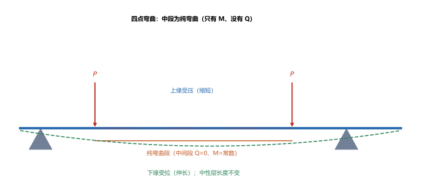
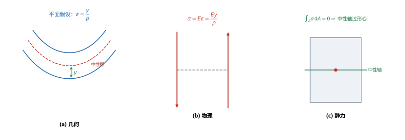
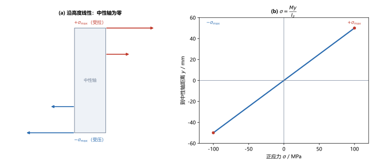

# 第 09 讲：平面弯曲的正应力

> **前置**：第 07 讲（惯性矩 $I_z$、抗弯截面系数）、第 08 讲（弯矩 $M$、剪力图与弯矩图）。
> **预计时间**：约 3 小时（含作业）。
>
> **一句话定位**：第 08 讲求出了梁截面上的**弯矩 $M$**，但那还只是"内力"。本讲把弯矩变成一个"点"的量——横截面上的**正应力** $\sigma=\dfrac{My}{I_z}$。这一步要用第 07 讲的惯性矩 $I_z$，并推出两条关键结论：**中性轴过形心**、**离中性轴最远处最危险**。
>
> **本讲回答什么**：
> 1. 弯矩 $M$ 在横截面上怎么分布成正应力？公式 $\sigma=\dfrac{My}{I_z}$ 是怎么推出来的？
> 2. 中性轴是什么？它凭什么一定过形心？
> 3. 危险点在截面哪里？抗弯强度条件怎么写？
>
> **这一讲有真实验证**：矩形与圆截面的最大正应力、不对称 T 形的上下缘应力、$\sigma=My/I_z$ 的线性分布、强度条件设计尺寸（脚本 `scripts/lec09-01_verify_bending_stress.py`）；另有纯弯曲变形、三步推导、应力线性分布三张图（`figures/`）。

---

## 引子：弯矩 $M$ 到底让截面"受力"成什么样

第 08 讲算出，一根梁的某截面承受弯矩 $M$。但 $M$ 是个内力偶，它到底是**怎么作用在截面每一个点上的**？

答案：弯矩在横截面上"摊"成**正应力**——**一侧受拉、另一侧受压**，中间有一层既不拉也不压。这就是梁弯曲时"上缘皱、下缘绷"的原因。本讲就把这个分布规律推出来。

---

## 1. 纯弯曲与横力弯曲

- **纯弯曲**：某段梁上**剪力为零、弯矩为常数**（例如四点弯曲梁的中间段，或梁上只作用两对力偶的段）。
- **横力弯曲**：截面上同时有剪力 $Q$ 和弯矩 $M$（大多数梁的大多数位置）。

> **图 1 怎么读**：四点弯曲，两处载荷 $P$；两载荷之间的中段剪力为零、弯矩为常数，就是**纯弯曲段**。梁下凸：上缘受压（缩短）、下缘受拉（伸长），中间有一层长度不变——**中性层**。

**为什么先研究纯弯曲**：纯弯曲没有剪力干扰，正应力的推导最干净。得出的 $\sigma=\dfrac{My}{I_z}$ 随后对**横力弯曲**（细长梁）也近似成立（因为切应力对正应力的影响可忽略）。

---

## 2. 纯弯曲正应力的三步推导

推导分三步：**几何 → 物理 → 静力**。这是材料力学推导应力公式的标准套路（第 05 讲扭转也是这么做的）。

### 2.1 几何关系（变形）

由**平面假设**（横截面变形后仍是平面），并观察中性层：距中性层为 $y$ 处的纵向纤维，应变与 $y$ 成正比：

$$\varepsilon = \frac{y}{\rho},$$

其中 $\rho$ 是中性层的曲率半径。

### 2.2 物理关系（胡克定律）

在线弹性范围内 $\sigma = E\varepsilon$，代入上一步：

$$\sigma = E\varepsilon = \frac{E y}{\rho}.$$

这说明**正应力沿截面高度线性分布**：$y$ 越大（离中性轴越远），应力越大。

### 2.3 静力关系（平衡）

截面上没有轴力（纯弯曲），所以正应力合成的轴力必须为零：

$$\int_A \sigma\,\mathrm{d}A = \int_A \frac{E y}{\rho}\,\mathrm{d}A = \frac{E}{\rho}\int_A y\,\mathrm{d}A = 0.$$

而 $\int_A y\,\mathrm{d}A = S_z$ 是截面对中性轴的静矩。由第 07 讲：**静矩为零的轴恰好过形心**——所以**中性轴过形心**。再用"正应力合成弯矩 = $M$"，可得 $\dfrac{1}{\rho} = \dfrac{M}{E I_z}$。

> **图 2 怎么读**：(a) 几何——平面假设给出 $\varepsilon=y/\rho$；(b) 物理——胡克定律给出 $\sigma=Ey/\rho$；(c) 静力——正应力合成的轴力为零，推出中性轴过形心。

把 $\dfrac{1}{\rho} = \dfrac{M}{E I_z}$ 代回 $\sigma = \dfrac{Ey}{\rho}$，就得到**弯曲正应力公式**：

$$\boxed{\sigma = \frac{M y}{I_z}}.$$

---

## 3. 弯曲正应力公式与分布

### 3.1 公式的含义

$$\sigma = \frac{M y}{I_z}:$$

- $M$：该截面的弯矩（第 08 讲求出）；
- $y$：所求点到**中性轴**的距离（中性轴过形心）；
- $I_z$：截面对中性轴的惯性矩（第 07 讲求出）。

**同一截面上，$y$ 越大应力越大**——所以**离中性轴最远处（上、下缘）应力最大**，中性轴上（$y=0$）应力为零。

> **图 3 怎么读**：(a) 横截面上，正应力沿高度**线性**分布：中性轴上为零，向上下缘线性增大，一侧拉（$+$）一侧压（$-$）；(b) $\sigma=\dfrac{My}{I_z}$ 是一条过原点的直线。

### 3.2 符号与判读

- $y$ 以中性轴为原点，向上（或某一约定方向）为正；
- $\sigma$ 的正负表示**拉/压**：正应力为正 = 受拉，为负 = 受压。
- 对**正弯矩（下凸）**：中性轴以上受压、以下受拉。**判断拉压时，先定弯矩正负，再看点在中性轴上方还是下方。**

（脚本 EXP4）矩形 $60\times100$、$M=10\ \mathrm{kN\cdot m}$，沿高度采样：

| $y$ / mm | $+50$ | $+25$ | $0$ | $-25$ | $-50$ |
|---|---|---|---|---|---|
| $\sigma$ / MPa | $+100$ | $+50$ | $0$ | $-50$ | $-100$ |

完全线性——验证 $\sigma=\dfrac{My}{I_z}$。

---

## 4. 抗弯截面系数与强度条件

### 4.1 抗弯截面系数

把最危险处的距离 $y_{\max}$ 与 $I_z$ 合并，定义**抗弯截面系数**：

$$\boxed{W_z = \frac{I_z}{y_{\max}}}.$$

它只与**截面形状**有关。于是最大正应力：

$$\sigma_{\max} = \frac{M}{W_z}.$$

常见截面的 $W_z$：矩形 $W_z=\dfrac{bh^2}{6}$；圆 $W_z=\dfrac{\pi d^3}{32}$（第 07 讲已给）。

### 4.2 弯曲正应力强度条件

$$\boxed{\sigma_{\max} = \frac{M_{\max}}{W_z} \le [\sigma]},$$

其中 $M_{\max}$ 是危险截面（$|M|$ 最大处）的弯矩。**这和拉压、扭转的强度条件结构完全一样**，只是把量换成了抗弯的量。

### 4.3 危险点与不对称截面

- **危险点**在**离中性轴最远**的截面边缘；
- **对上下不对称的截面**（如 T 形），上下缘离中性轴距离不同，**要分别算两个 $W$、分别校核**。

**算例**（脚本 EXP1、EXP3）：

- 矩形 $60\times100$：$W_z=\dfrac{I_z}{50}=\dfrac{5\times10^6}{50}=1\times10^5\ \mathrm{mm^3}$，$M=10\ \mathrm{kN\cdot m}$ → $\sigma_{\max}=\dfrac{10\times10^6}{1\times10^5}=100\ \mathrm{MPa}$；
- T 形（$y_c=70$、$I_z=3.333\times10^6$）：$W_{下}=\dfrac{I_z}{70}=4.76\times10^4$、$W_{上}=\dfrac{I_z}{30}=1.11\times10^5$。同样 $M=10\ \mathrm{kN\cdot m}$：**下缘** $\sigma=\dfrac{10\times10^6}{4.76\times10^4}=210\ \mathrm{MPa}$（受拉），**上缘** $\sigma=\dfrac{10\times10^6}{1.11\times10^5}=90\ \mathrm{MPa}$（受压）。**下缘离中性轴更远、应力更大，是危险点。**

---

## 5. 弯曲正应力的三类问题

和第 03 讲一样，$\sigma_{\max}=\dfrac{M}{W_z}\le[\sigma]$ 对应三类问题：

| 问题 | 已知 | 求 | 操作 |
|---|---|---|---|
| 强度校核 | $M_{\max}$、截面、$[\sigma]$ | 是否安全 | 算 $\sigma_{\max}=M_{\max}/W_z$ 与 $[\sigma]$ 比 |
| 设计截面 | $M_{\max}$、$[\sigma]$ | 所需 $W_z$（进而定尺寸） | $W_z \ge M_{\max}/[\sigma]$ |
| 求许用载荷 | 截面、$[\sigma]$ | 最大允许 $M$ | $M \le [\sigma]W_z$ |

**设计算例**（脚本 EXP5）：$M=12\ \mathrm{kN\cdot m}$、$[\sigma]=160\ \mathrm{MPa}$：

$$W_z \ge \frac{M}{[\sigma]} = \frac{12\times10^6}{160} = 7.5\times10^4\ \mathrm{mm^3}.$$

若取矩形 $h=2b$，则 $W_z=\dfrac{bh^2}{6}=\dfrac{2b^3}{3}\ge 7.5\times10^4$ → $b\ge48.3\ \mathrm{mm}$，取 $b=49\ \mathrm{mm}$、$h=98\ \mathrm{mm}$。

---

## 6. 本讲的心智模型

把这一讲压缩成一条主线：

> **弯曲正应力题 = 由第 08 讲找到危险截面（$|M|$ 最大）→ 用 $\sigma=\dfrac{My}{I_z}$ 求该截面应力 → 最危险处在离中性轴最远处 $\sigma_{\max}=\dfrac{M}{W_z}$ → 与 $[\sigma]$ 比较。**

遇到一道题，按这个顺序走：

1. **找危险截面**：由弯矩图找 $|M|_{\max}$ 的截面；
2. **定中性轴与 $y$**：中性轴过形心（第 07 讲求形心）；
3. **求应力**：$\sigma=\dfrac{My}{I_z}$；最危险边缘 $\sigma_{\max}=\dfrac{M}{W_z}$；
4. **判危险点 + 校核**：不对称截面上下分别算；与 $[\sigma]$ 比较。

---

## 7. 小结

- **纯弯曲**（$Q=0$、$M$ 常数）为正应力推导最干净的场景；结论对细长梁的**横力弯曲**近似成立。
- **三步推导**：几何 $\varepsilon=\dfrac{y}{\rho}$（平面假设）→ 物理 $\sigma=E\varepsilon=\dfrac{Ey}{\rho}$ → 静力 $\displaystyle\int_A\sigma\,\mathrm{d}A=0$ 给出**中性轴过形心**、$\dfrac{1}{\rho}=\dfrac{M}{EI_z}$。
- **弯曲正应力**：$\sigma=\dfrac{My}{I_z}$，沿截面高度**线性**分布；**中性轴处为零，离中性轴最远处最大**。正应力为正表示受拉。
- **抗弯截面系数** $W_z=\dfrac{I_z}{y_{\max}}$，$\sigma_{\max}=\dfrac{M}{W_z}$。
- **强度条件** $\sigma_{\max}=\dfrac{M_{\max}}{W_z}\le[\sigma]$；**危险点**在离中性轴最远处；**不对称截面上下分别算**。
- 常见截面 $W_z$：矩形 $\dfrac{bh^2}{6}$、圆 $\dfrac{\pi d^3}{32}$。三类问题（校核/设计 $W_z\ge M/[\sigma]$/求载荷）与拉压、扭转同构。

---

## 8. 作业

### 基础

**Q1. 矩形截面**：矩形梁 $b = 40\ \mathrm{mm}$、$h = 80\ \mathrm{mm}$，危险截面弯矩 $M = 8\ \mathrm{kN\cdot m}$。求最大弯曲正应力。

**参考答案**：

$I_z=\dfrac{40\times80^3}{12}=1.707\times10^6\ \mathrm{mm^4}$，$W_z=\dfrac{I_z}{40}=4.267\times10^4\ \mathrm{mm^3}$；
$\sigma_{\max}=\dfrac{8\times10^6}{4.267\times10^4}=187.5\ \mathrm{MPa}$。
验算：$W_z=bh^2/6=40\times6400/6=4.267\times10^4$，一致。

**Q2. 圆截面**：圆梁 $d = 60\ \mathrm{mm}$，$M = 4\ \mathrm{kN\cdot m}$。求最大正应力。

**参考答案**：

$W_z=\dfrac{\pi\times60^3}{32}=2.121\times10^4\ \mathrm{mm^3}$；
$\sigma_{\max}=\dfrac{4\times10^6}{2.121\times10^4}=188.6\ \mathrm{MPa}$。
验算：用 $\sigma=\dfrac{M(d/2)}{I_z}$、$I_z=\dfrac{\pi d^4}{64}=6.362\times10^5$，得 $\sigma=\dfrac{4\times10^6\times30}{6.362\times10^5}=188.6\ \mathrm{MPa}$，两路一致。

**Q3. 线性判读**：矩形截面 $h = 100\ \mathrm{mm}$，已知上/下缘最大应力 $\sigma_{\max}=120\ \mathrm{MPa}$。求距中性轴 $y=30\ \mathrm{mm}$ 处的应力。

**参考答案**：

应力沿高度线性，$\sigma=\sigma_{\max}\dfrac{y}{y_{\max}}=120\times\dfrac{30}{50}=72\ \mathrm{MPa}$。
验算：$\dfrac{72}{120}=\dfrac{30}{50}=0.6$，比例一致——线性分布的体现。

### 提高

**Q4. 不对称截面**：T 形（翼缘 $120\times20$ 在上、腹板 $20\times80$ 在下），形心 $y_c=70\ \mathrm{mm}$、$I_z=3.333\times10^6\ \mathrm{mm^4}$。正弯矩 $M=8\ \mathrm{kN\cdot m}$（下凸）。求下缘、上缘正应力，指出危险点。

**参考答案**：

下缘（距中性轴 $70\ \mathrm{mm}$）：$\sigma=\dfrac{8\times10^6\times70}{3.333\times10^6}=168\ \mathrm{MPa}$（拉）；
上缘（距中性轴 $30\ \mathrm{mm}$）：$\sigma=\dfrac{8\times10^6\times30}{3.333\times10^6}=72\ \mathrm{MPa}$（压）。
危险点在**下缘**（离中性轴更远、应力更大）。正弯矩下凸，下缘受拉，故下缘承受最大拉应力。
验算：$168/72=70/30$，与距离比一致。

**Q5. 设计截面**：$M=15\ \mathrm{kN\cdot m}$，$[\sigma]=140\ \mathrm{MPa}$，截面取矩形且 $h=2b$。求最小尺寸。

**参考答案**：

$W_z \ge \dfrac{M}{[\sigma]} = \dfrac{15\times10^6}{140} = 1.071\times10^5\ \mathrm{mm^3}$；
$W_z=\dfrac{bh^2}{6}=\dfrac{2b^3}{3}\ge 1.071\times10^5$ → $b^3 \ge 1.607\times10^5$ → $b\ge54.3\ \mathrm{mm}$，取 $b=55\ \mathrm{mm}$、$h=110\ \mathrm{mm}$。
验算：$W_z=\dfrac{55\times110^2}{6}=1.109\times10^5\ \mathrm{mm^3}$，$\sigma_{\max}=15\times10^6/1.109\times10^5=135.3\le140\ \mathrm{MPa}$。

**Q6. 概念**：为什么中性轴一定过形心？用本讲的静力关系说明。

**参考答案**：

纯弯曲截面上没有轴力，正应力合成的轴力 $\displaystyle\int_A\sigma\,\mathrm{d}A=0$。代入 $\sigma=\dfrac{Ey}{\rho}$（$E$、$\rho$ 与 $A$ 上位置无关）得 $\dfrac{E}{\rho}\displaystyle\int_A y\,\mathrm{d}A=0$，即静矩 $\displaystyle\int_A y\,\mathrm{d}A=0$。由第 07 讲，"静矩为零的轴过形心"，故中性轴过形心。
验算（自检方向）：这与第 07 讲"形心是面积矩的平衡点"是同一件事。

### 综合

**Q7. 完整校核**：第 08 讲的简支梁（$L=4\ \mathrm{m}$、$P=20\ \mathrm{kN}$ 在距左端 $1\ \mathrm{m}$ 处），最大弯矩 $M_{\max}=15\ \mathrm{kN\cdot m}$。梁取矩形 $b=60\ \mathrm{mm}$、$h=100\ \mathrm{mm}$，材料 $[\sigma]=160\ \mathrm{MPa}$。校核弯曲正应力强度。

**参考答案**：

$W_z=\dfrac{60\times100^2}{6}=1\times10^5\ \mathrm{mm^3}$；
$\sigma_{\max}=\dfrac{M_{\max}}{W_z}=\dfrac{15\times10^6}{1\times10^5}=150\ \mathrm{MPa}\le 160\ \mathrm{MPa}$，**安全**（余量 $150/160=0.94$）。
验算：用 $\sigma=\dfrac{M y_{\max}}{I_z}$、$I_z=5\times10^6$、$y_{\max}=50$，得 $\sigma=\dfrac{15\times10^6\times50}{5\times10^6}=150\ \mathrm{MPa}$，一致。

**Q8. 开放简答**：由 $\sigma_{\max}=\dfrac{M}{W_z}$ 看，要提高一根梁的抗弯强度（能承受更大 $M$），可以从哪几个方向入手？

**参考答案**：

- **增大 $W_z$**：换更大的截面，或**在同样用料的条件下把截面形状做得更"抗弯"**（材料多放在离中性轴远处——矩形竖放比横放强、工字形比矩形强）。这是最常用的方向；
- **减小 $M_{\max}$**：合理布置载荷与支座（例如把集中力分散、支座位置优化），降低危险截面的弯矩；
- **换材料**：提高 $[\sigma]$（但受成本和其它性能约束）。
这三条就是第 10 讲"提高弯曲强度的措施"要展开的内容。
验算（自检方向）：$W_z$ 只看截面形状与尺寸，与材料无关；所以"选截面"和"选材料"是两条独立的路——应试时长方形截面"竖放强于横放"正是靠 $W_z=bh^2/6$ 里 $h$ 是平方。

---

*下一讲预告——第 10 讲《弯曲切应力与提高弯曲强度的措施》：本讲处理的是**弯矩**引起的正应力；但横截面上还有**剪力**引起的**切应力**。第 10 讲推出弯曲切应力分布（为什么腹板是主要抗剪部分），并系统给出提高弯曲强度的措施。*
