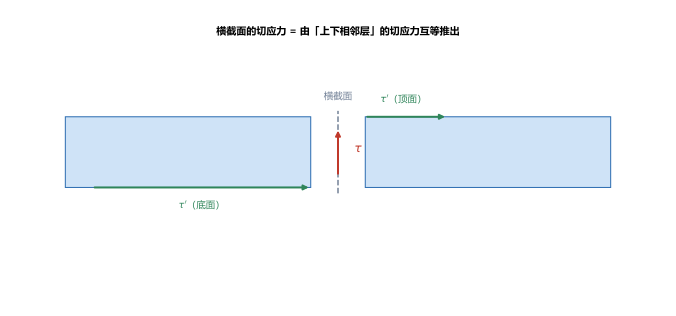
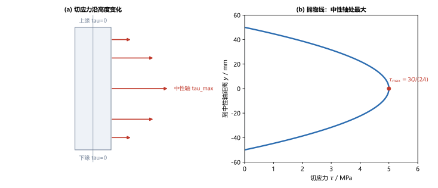
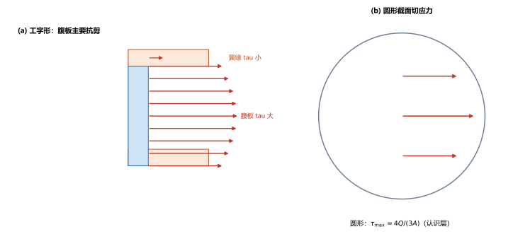

# 第 10 讲：弯曲切应力与提高弯曲强度的措施

> **前置**：第 07 讲（惯性矩、静矩）、第 08 讲（剪力 $Q$）、第 09 讲（弯曲正应力 $\sigma=My/I_z$）。
> **预计时间**：约 2.5 小时（含作业）。
>
> **一句话定位**：第 09 讲处理的是**弯矩 $M$** 引起的**正应力**；但横截面上还有**剪力 $Q$** 引起的**切应力**。本讲把弯曲切应力讲清（为什么中性轴处最大、为什么腹板是主要抗剪部分），再系统给出**提高弯曲强度的措施**，为弯曲块收尾。
>
> **本讲回答什么**：
> 1. 梁里为什么会有切应力？它从哪来？
> 2. 矩形截面的弯曲切应力怎么分布？为什么上下缘为零、中性轴最大？
> 3. 为什么工字梁的腹板主要抗剪？怎样提高一根梁的抗弯强度？
>
> **这一讲有真实验证**：矩形弯曲切应力与 $\tau_{\max}=3Q/(2A)$ 互证、工字梁腹板切应力、圆形截面 $\tau_{\max}=4Q/(3A)$、切应力强度校核（脚本 `scripts/lec10-01_verify_bending_shear.py`）；另有切应力来源、矩形抛物线分布、工字/圆截面三张图（`figures/`）。

---

## 引子：弯矩之外，还有剪力在"错动"截面

第 08 讲告诉我们，梁的截面上既有弯矩 $M$、又有剪力 $Q$。第 09 讲把 $M$ 变成了正应力；那 $Q$ 呢？

$Q$ 在横截面上产生的是**切应力** $\tau$——它想让截面两侧上下"错动"。切应力的分布和正应力完全不同：正应力是"离中性轴越远越大"，而**弯曲切应力恰恰相反——中性轴处最大、上下缘为零**。本讲就来说清这件事，并回答"为什么梁常用工字形/工字形"。

---

## 1. 弯曲切应力的来源

弯曲切应力不是凭空来的，它由**切应力互等定理**（第 02 讲）推出：

取梁的一小段（微段），它的**上、下表面**上如果没有切应力，就无法平衡正应力沿长度方向的变化；而"横截面上的切应力"与"上下表面的切应力"互为**互等**的一对（大小相等、方向指向交线）。于是**横截面上必然存在切应力**。

> **图 1 怎么读**：两段梁在中间截面处切开，横截面上有切应力 $\tau$（红色，竖向）；同时梁的顶面、底面有互等的切应力 $\tau'$（绿色）。三者通过切应力互等相互联系，正是它们的存在，让弯矩能做功、也让梁能"传递"剪力。

> **一句话**：**剪力 $Q$ 的实体，就是横截面上的切应力**——把切应力沿截面加起来，就得到剪力。

---

## 2. 矩形截面弯曲切应力

### 2.1 公式

对矩形截面（宽 $b$、高 $h$），弯曲切应力的公式是：

$$\boxed{\tau = \frac{Q\,S_z^*}{I_z\,b}},$$

其中：

- $Q$：该截面的剪力；
- $I_z$：整个截面对中性轴的惯性矩；
- $b$：所求点处的截面宽度；
- $S_z^*$：**所求点以外（下侧或上侧）那部分面积**对中性轴的**静矩**。

> **$S_z^*$ 是这一讲最容易搞混的量**：它不是整个截面的静矩（那为零），而是"**从所求点切到边缘**的那块面积"的静矩。它随所求点位置变化：越靠近中性轴，这块面积越大、$S_z^*$ 越大。

### 2.2 抛物线分布

对矩形，$S_z^*$ 随到中性轴的距离 $y$ 变化，代进去得到一条**抛物线**：

$$\tau(y) = \frac{Q}{2I_z}\left(\frac{h^2}{4} - y^2\right).$$

- **上下缘**（$y=\pm h/2$）：$\tau = 0$；
- **中性轴**（$y=0$）：$\tau$ 最大，$\boxed{\tau_{\max} = \dfrac{3Q}{2A}}$（$A=bh$）。

> **图 2 怎么读**：(a) 截面上的切应力箭头，上下缘为零、中性轴最长；(b) $\tau$ 沿高度是一条**开口向横轴的抛物线**，峰值在中性轴。

（脚本 EXP1、EXP2）矩形 $60\times100$、$Q=20\ \mathrm{kN}$：$A=6000\ \mathrm{mm^2}$，

$$\tau_{\max} = \frac{3\times20000}{2\times6000} = 5.0\ \mathrm{MPa}.$$

用 $S_z^*$ 公式互证：$S_z^*$（中性轴）$=\dfrac{b(h/2)^2}{2}=75000\ \mathrm{mm^3}$，$\tau=\dfrac{20000\times75000}{5\times10^6\times60}=5.0\ \mathrm{MPa}$，两路一致。

> **为什么上下缘为零**：那里"所求点以外的那块面积"$S_z^*$ 为零（切到边缘没有面积了），所以 $\tau=0$。而中性轴处那块面积最大，所以 $\tau$ 最大。

---

## 3. 截面形状对切应力分布的影响

### 3.1 工字形截面：腹板主要抗剪

工字形截面由上下**翼缘**（薄而宽）和中间**腹板**（窄）组成。把 $\tau=\dfrac{Q S_z^*}{I_z b}$ 用上去：

- 在**翼缘**里：$b$ 很大（翼缘宽）、且 $S_z^*$ 小 → 切应力很小；
- 在**腹板**里：$b$ 很小（腹板窄）→ 即便 $S_z^*$ 差不多，切应力也**大得多**；
- 在**翼缘与腹板交界处**，$b$ 突然变小，切应力**跳变**。

**结论**：**工字梁的剪力绝大部分由腹板承担**（腹板面积只占 ~40%，却承担大部分剪力；翼缘几乎不抗剪）。

> **图 3 怎么读**：(a) 工字（右半）截面，红色箭头表示切应力——腹板里长（大），翼缘里短（小）；(b) 圆截面的切应力也呈抛物线，中性轴处最大。

（脚本 EXP3）工字形（总高 $80$、腹板 $20\times60$）、$Q=20\ \mathrm{kN}$：腹板内最大切应力 $\tau_{\max}=15.86\ \mathrm{MPa}$，远大于翼缘。

> **工程含义**：工字梁的腹板负责抗剪、翼缘负责抗弯（第 09 讲：翼缘离中性轴远、$I_z$ 贡献大）。**"翼缘抗弯、腹板抗剪"的分工**，正是工字形省料的原因。

### 3.2 圆形截面（认识层）

圆截面的弯曲切应力也用同一公式，最大仍在中性轴：

$$\tau_{\max} = \frac{4Q}{3A}\qquad(A=\pi d^2/4).$$

（脚本 EXP4）圆 $d=50$、$Q=20\ \mathrm{kN}$：$\tau_{\max}=13.58\ \mathrm{MPa}$。

> **只需知道**：不同形状的**系数**不同（矩形 $\dfrac{3}{2}$、圆 $\dfrac{4}{3}$），但都遵循"**中性轴处最大、外缘为零**"的规律，且都与 $\dfrac{Q}{A}$ 同量级。

### 3.3 一条统一认识

不管什么截面，弯曲切应力都**集中在中性轴附近**、在远离中性轴处趋于零——因为远离中性轴的地方"上方/下方的面积"趋于零（$S_z^*\to0$）。这与正应力"离中性轴越远越大"恰好相反、互为补充。

---

## 4. 弯曲切应力强度条件

$$\boxed{\tau_{\max} \le [\tau]}.$$

（脚本 EXP5）矩形 $\tau_{\max}=5.0\ \mathrm{MPa} \le [\tau]=60\ \mathrm{MPa}$，**安全**。

> **什么时候必须校核切应力**：大多数**细长梁**（跨长 $\gg$ 截面高）里，最大弯曲正应力远大于切应力，正应力控制设计、切应力可忽略（这也是第 09 讲能把 $\sigma=\dfrac{My}{I_z}$ 用于横力弯曲的原因）。但下列情形**切应力可能是控制条件**，必须专门校核：
> - **短粗梁**（跨长小、截面大）；
> - **薄壁/工字形**截面（腹板薄，$\tau$ 大）；
> - 靠近**集中力或支座**处（$Q$ 大的截面）。

---

## 5. 提高弯曲强度的措施

围绕两个"杠杆"来提高一根梁的抗弯强度（$\sigma_{\max}=\dfrac{M_{\max}}{W_z}\le[\sigma]$）：

### 5.1 合理截面（增大 $W_z$，省料）

在**相同用料的条件下**，把材料放到离中性轴更远处，就能增大 $W_z$：

- **矩形竖放优于横放**：$W_z=\dfrac{bh^2}{6}$ 里 $h$ 是平方，让 $h$ 大、$b$ 小更划算；
- **工字形、箱形优于矩形**：工字形把材料集中在上下翼缘，$I_z$ 大、$W_z/A$ 高（第 07 讲算过：同 $W_t$ 时空心省料约一半，弯曲同理）。

### 5.2 合理布置载荷与支座（减小 $M_{\max}$）

弯矩图是设计的主线：**把载荷分散、把支座挪到合适位置，降低最大弯矩**。例如把一个大集中力分成两个小的、或把支座从两端移到更有利处，都能压低 $M_{\max}$。

### 5.3 变截面梁 / 等强度梁

危险截面以外的材料往往"用不完"，可做成**变截面梁**（截面随位置变化），让各截面应力都接近 $[\sigma]$——这就是**等强度梁**，最省料（如阳台挑梁、汽车板簧）。

> **一句话总结三种措施**：**① 改截面形状（大 $W/A$）；② 改载荷与支座（小 $M_{\max}$）；③ 改沿长度的截面（等强度）。**

---

## 6. 本讲的心智模型

把这一讲压缩成两条线：

> **弯曲切应力**：$\tau=\dfrac{Q S_z^*}{I_z b}$；分布"中性轴最大、外缘为零"；矩形 $\tau_{\max}=\dfrac{3Q}{2A}$。工字梁腹板主要抗剪。
>
> **提高弯曲强度**：增大 $W_z$（选形状）→ 减小 $M_{\max}$（布载荷）→ 变截面（等强度）。

遇到一道题，按这个顺序判断：

1. **是正应力还是切应力问题**？给的是 $M$ 还是 $Q$？
2. **切应力**：$\tau_{\max}=\dfrac{Q S_z^*}{I_z b}$（矩形/圆用系数式）；判断是否需要校核（短粗/薄壁/支座附近）。
3. **正应力**（第 09 讲）：$\sigma_{\max}=\dfrac{M}{W_z}$。

---

## 7. 小结

- **弯曲切应力的来源**：由切应力互等定理推出，横截面上的切应力沿截面加起来就是剪力 $Q$。
- **矩形截面**：$\tau=\dfrac{Q S_z^*}{I_z b}$，**抛物线**分布；**上下缘为零、中性轴最大** $\tau_{\max}=\dfrac{3Q}{2A}$。（$S_z^*$ 是"所求点以外的面积"对中性轴的静矩。）
- **工字形**：**腹板主要抗剪**（$b$ 小、$\tau$ 大），翼缘几乎不抗剪；**交界处 $\tau$ 跳变**。圆形 $\tau_{\max}=\dfrac{4Q}{3A}$（认识层）。
- **规律**：弯曲切应力集中在中性轴附近、外缘趋零——与正应力相反。
- **切应力强度条件** $\tau_{\max}\le[\tau]$；细长梁通常不必校核，**短粗梁、薄壁截面、支座/集中力附近**必须校核。
- **提高弯曲强度的措施**：① 合理截面（增大 $W/A$，如工字/箱形、矩形竖放）；② 合理布置载荷与支座（减小 $M_{\max}$）；③ 变截面梁/等强度梁。

---

## 8. 作业

### 基础

**Q1. 矩形切应力**：矩形梁 $b = 40\ \mathrm{mm}$、$h = 80\ \mathrm{mm}$，截面剪力 $Q = 30\ \mathrm{kN}$。求最大弯曲切应力。

**参考答案**：

$A=40\times80=3200\ \mathrm{mm^2}$；$\tau_{\max}=\dfrac{3Q}{2A}=\dfrac{3\times30000}{2\times3200}=14.06\ \mathrm{MPa}$（中性轴处）。
验算：用 $S_z^*$（中性轴）$=\dfrac{b(h/2)^2}{2}=\dfrac{40\times40^2}{2}=32000$、$I_z=\dfrac{40\times80^3}{12}=1.707\times10^6$，$\tau=\dfrac{30000\times32000}{1.707\times10^6\times40}=14.06\ \mathrm{MPa}$，一致。

**Q2. 圆截面切应力**：圆梁 $d = 60\ \mathrm{mm}$，$Q = 25\ \mathrm{kN}$。求最大切应力。

**参考答案**：

$A=\dfrac{\pi\times60^2}{4}=2827.4\ \mathrm{mm^2}$；$\tau_{\max}=\dfrac{4Q}{3A}=\dfrac{4\times25000}{3\times2827.4}=11.79\ \mathrm{MPa}$。
验算：$\tau_{\max}$ 与 $\dfrac{Q}{A}=8.84\ \mathrm{MPa}$ 同量级（约为其 $4/3$ 倍），合理。

**Q3. 概念**：为什么矩形截面的弯曲切应力在上下缘为零、在中性轴处最大？

**参考答案**：

公式 $\tau=\dfrac{Q S_z^*}{I_z b}$ 中，$S_z^*$ 是"所求点以外（切到边缘）的那部分面积"对中性轴的静矩。
上下缘处"切到边缘"已无面积，$S_z^*=0$，故 $\tau=0$；中性轴处那块面积最大、$S_z^*$ 最大，故 $\tau$ 最大。
验算：代入 $S_z^*$（中性轴）与 $S_z^*=0$（边缘），分别得 $3Q/(2A)$ 与 $0$，与抛物线一致。

### 提高

**Q4. 工字梁切应力**：工字形（翼缘 $80\times10$ 上/下、腹板 $20\times60$），截面剪力 $Q = 30\ \mathrm{kN}$。已知 $I_z=2.333\times10^6\ \mathrm{mm^4}$，$S_z^*$（中性轴）$=3.7\times10^4\ \mathrm{mm^3}$。求腹板内最大切应力。

**参考答案**：

$\tau_{\max}=\dfrac{Q S_z^*}{I_z b}=\dfrac{30000\times3.7\times10^4}{2.333\times10^6\times20}=23.79\ \mathrm{MPa}$。
验算：$\tau_{\max}$ 出现在中性轴（腹板内），量级为 $\dfrac{Q}{A_{腹板}}=\dfrac{30000}{1200}=25\ \mathrm{MPa}$ 附近，合理。

**Q5. 切应力校核**：Q1 的梁，材料许用切应力 $[\tau]=40\ \mathrm{MPa}$。校核切应力强度。

**参考答案**：

$\tau_{\max}=14.06\ \mathrm{MPa}\le40\ \mathrm{MPa}$，**切应力强度安全**。
验算：反代 $Q=\tau_{\max}\cdot2A/3=14.06\times6400/3\times10^{-3}\approx30\ \mathrm{kN}$，与给定一致。

**Q6. 提高强度的措施**：一根梁弯曲正应力超限，请给出三种不换材料、不加大总用料的改进思路。

**参考答案**：

① **改截面形状**：换成工字形/箱形，把材料移到离中性轴更远处，增大 $W_z/A$；
② **合理布置载荷与支座**：把集中力分散、支座位置优化，减小最大弯矩 $M_{\max}$；
③ **变截面（等强度梁）**：只在弯矩大的地方加料、弯矩小的地方减料，让各截面都接近 $[\sigma]$。
验算（自检方向）：三条分别对应公式 $\sigma_{\max}=\dfrac{M_{\max}}{W_z}$ 里的 $W_z$ 与 $M_{\max}$，以及沿长度的分布——覆盖了所有可调的自由度。

### 综合

**Q7. 完整校核**：第 08/09 讲的简支梁（$L=4\ \mathrm{m}$、$P=20\ \mathrm{kN}$ 距左端 $1\ \mathrm{m}$），矩形 $b=60\ \mathrm{mm}$、$h=100\ \mathrm{mm}$。已知 $M_{\max}=15\ \mathrm{kN\cdot m}$、$|Q|_{\max}=15\ \mathrm{kN}$，$[\sigma]=160\ \mathrm{MPa}$、$[\tau]=60\ \mathrm{MPa}$。校核正应力与切应力两类强度。

**参考答案**：

正应力：$W_z=\dfrac{60\times100^2}{6}=1\times10^5\ \mathrm{mm^3}$，$\sigma_{\max}=\dfrac{15\times10^6}{1\times10^5}=150\ \mathrm{MPa}\le160\ \mathrm{MPa}$，**安全**。
切应力：$\tau_{\max}=\dfrac{3\times15000}{2\times6000}=3.75\ \mathrm{MPa}\le60\ \mathrm{MPa}$，**安全**。
结论：两类强度都满足，且正应力占主导（$150/160\gg3.75/60$）——这正是"细长梁由正应力控制"的典型。
验算：$|Q|_{\max}$ 取自第 08 讲剪力图（$+15\ \mathrm{kN}$），$M_{\max}$ 取自弯矩图峰值，两者都是危险截面处的值。

**Q8. 开放简答**：为什么工字形截面能同时很好地抗弯和抗剪？分别用正应力和切应力的分布解释。

**参考答案**：

**抗弯看翼缘**：正应力 $\sigma=\dfrac{My}{I_z}$ 离中性轴越远越大，且 $I_z$ 对远处材料按 $y^2$ 加权——把材料放在远离中性轴的**翼缘**，$I_z$、$W_z$ 大，抗弯强、省料。
**抗剪看腹板**：切应力 $\tau=\dfrac{Q S_z^*}{I_z b}$ 集中在中性轴附近；把中性轴附近做成**窄腹板**，正好让"需要抗剪的部位"有材料，而 $b$ 小使 $\tau$ 集中在这里、翼缘不参与抗剪。
于是工字形把"抗弯"与"抗剪"两种需求分派给了翼缘和腹板，各得其所——这就是它比矩形省料的原因。
验算（自检方向）：对照第 09 讲（正应力线性分布）与本讲（切应力中性轴最大），两者对材料"该放哪"的要求恰好一个在边缘、一个在中间，工字形同时满足。

---

*下一讲预告——第 11 讲《弯曲变形：挠度与转角》：到第 10 讲，弯曲的"强度"（正应力、切应力）讲完了。下一讲转向弯曲的"刚度"——梁弯了多深（挠度）、转了多少（转角），即用挠曲线近似微分方程求弯曲变形。*
