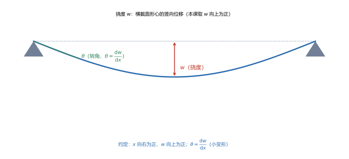
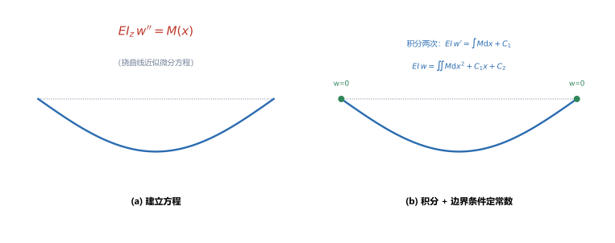
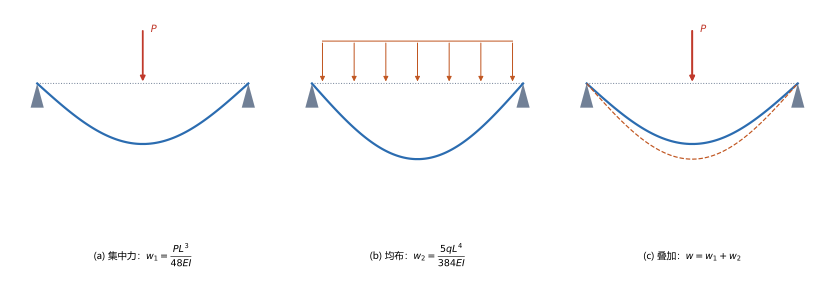

# 第 11 讲：弯曲变形：挠度与转角

> **前置**：第 07 讲（惯性矩 $I_z$）、第 08 讲（弯矩 $M$）、第 09 讲（曲率 $\dfrac{1}{\rho}=\dfrac{M}{EI_z}$）。
> **预计时间**：约 3 小时（含作业）。
>
> **一句话定位**：第 08–10 讲处理的是弯曲的**强度**（应力够不够）；本讲转向弯曲的**刚度**——梁弯了多深（**挠度**）、转了多少（**转角**）。核心是**挠曲线近似微分方程**，以及求挠度的两种方法（积分法、叠加法）；最后给出刚度条件与提高弯曲刚度的措施。
>
> **本讲回答什么**：
> 1. 挠度和转角怎么定义、怎么约定正负？
> 2. 挠曲线近似微分方程 $EI_z w''=M(x)$ 是怎么来的？适用条件是什么？
> 3. 怎么求一根梁的最大挠度？为什么"查表 + 叠加"就够用？
>
> **这一讲有真实验证**：简支梁跨中集中力、简支梁均布、悬臂梁端部集中力的挠度与转角，叠加法，以及积分法与查表结果的互证（脚本 `scripts/lec11-01_verify_deflection.py`）；另有挠度与转角、微分方程与积分法、叠加法三张图（`figures/`）。

---

## 引子：梁"够结实"，但弯得太多了

一根梁第 09、10 讲已经验算了强度——不会被压坏。可是它仍然可能**弯得太多**：机床主轴弯了，加工就不准；楼板垂了，天花板就裂。**强度够、刚度不一定够**（这是第 06 讲扭转时说过的同一件事，弯曲里也一样）。

本讲就把"梁弯了多少"算出来，并回答"弯到什么程度算不合格"。

---

## 1. 挠度与转角

### 1.1 定义

梁受力后，轴线由原来的直线弯成一条曲线，叫**挠曲线**。描述这条曲线用两个量：

- **挠度 $w$**：横截面形心沿**竖向**的位移（单位 mm）；
- **转角 $\theta$**：横截面绕自身转过的角度，等于挠曲线的**斜率**：

$$\theta = \frac{\mathrm{d}w}{\mathrm{d}x}.$$

（小变形下，转角很小，$\tan\theta\approx\theta$。）

> **图 1 怎么读**：简支梁下凸（蓝线），跨中形心竖向位移就是挠度 $w$（红箭头）；梁端截面的转角 $\theta$ 是挠曲线在该处的斜角（绿线所示，此处示意放大）。

### 1.2 正负约定

- $x$ 轴沿梁轴线向右为正；
- **挠度 $w$ 以向上为正**（这样下挠时 $w$ 为负值；工程上说的"挠度 $x$ mm"通常指其大小 $|w|$）；
- **转角 $\theta$ 的正负**与 $\dfrac{\mathrm{d}w}{\mathrm{d}x}$ 一致。

> **务必全程统一约定**：挠度正负号在不同教材可能相反，但本课程一律"$x$ 右为正、$w$ 上为正、$M$ 使梁下凸为正"，后文所有公式都基于这一套。

---

## 2. 挠曲线近似微分方程

### 2.1 从曲率关系推出来

第 09 讲给出了纯弯曲的曲率关系 $\dfrac{1}{\rho}=\dfrac{M}{EI_z}$。另一方面，由微积分，曲线的曲率在小变形下可近似写成

$$\frac{1}{\rho} \approx \frac{\mathrm{d}^2 w}{\mathrm{d}x^2} = w''.$$

两者相等，得到**挠曲线近似微分方程**：

$$\boxed{EI_z\,w'' = M(x)}.$$

> **图 2 怎么读**：(a) 把弯矩 $M(x)$ 与挠曲线二阶导数联系起来——$EI_z w''=M$；(b) 对它积分两次，用边界条件定出常数，得到挠曲线。

### 2.2 适用条件

- **线弹性**（用胡克定律）；
- **小变形**（$w'$ 很小，才能用 $w''$ 近似曲率；也才能把 $M(x)$ 按未变形轴线的坐标写）。

### 2.3 为什么叫"近似"

因为它用了 $w''\approx1/\rho$ 这一步近似（忽略了 $w'^2$ 项）——只在**小变形**下成立。工程梁的挠度通常远小于跨度，这个近似足够好。

> **注意**：$M(x)$ 一般**分段**（第 08 讲：集中力等处分段）。所以 $w''=M/(EI_z)$ 也要**分段积分**，段与段之间用"连续性"衔接（见 §3.1）。

---

## 3. 求挠度的两种方法

### 3.1 积分法

由 $EI_z w''=M(x)$，**积分两次**：

$$EI_z\,w' = \int M(x)\,\mathrm{d}x + C_1,\qquad EI_z\,w = \iint M(x)\,\mathrm{d}x^2 + C_1 x + C_2.$$

两个积分常数 $C_1$、$C_2$ 由**边界条件**（和分段的**连续条件**）确定：

- **边界条件**：铰支座/滚支处 $w=0$；固定端处 $w=0$ **且** $w'=0$；
- **连续条件**：在分段点（如集中力处），两段的 $w$ 和 $w'$ 必须相等（挠曲线不打折、不断裂）。

**算例**（脚本 EXP5）：简支梁均布载荷 $q$、跨度 $L$，积分两次并代入边界条件 $w(0)=w(L)=0$，可得

$$w(x) = \frac{q x}{24EI_z}\left(L^3 - 2Lx^2 + x^3\right),$$

跨中挠度 $w(L/2)=\dfrac{5qL^4}{384EI_z}$。脚本核对：积分得到的跨中挠度与查表公式完全一致（$33.33\ \mathrm{mm}$），且 $w(L)=0$（边界满足）。

### 3.2 叠加法（查表 + 叠加）

逐个积分太累。工程上把**常见梁在常见载荷下的挠度公式列成表**，遇到复杂载荷就**查表 + 叠加**（小变形下线弹性可叠加）。

| 梁与载荷 | 最大挠度 $\lvert w\rvert_{\max}$ | 最大转角 $\lvert\theta\rvert_{\max}$ |
|---|---|---|
| 简支梁，跨中集中力 $P$ | $\dfrac{PL^3}{48EI_z}$ | $\dfrac{PL^2}{16EI_z}$（端部） |
| 简支梁，满跨均布 $q$ | $\dfrac{5qL^4}{384EI_z}$ | $\dfrac{qL^3}{24EI_z}$（端部） |
| 悬臂梁，自由端集中力 $P$ | $\dfrac{PL^3}{3EI_z}$ | $\dfrac{PL^2}{2EI_z}$（自由端） |

> **图 3 怎么读**：(a) 只有跨中集中力时的挠曲线 $w_1$；(b) 只有均布载荷时的挠曲线 $w_2$；(c) 两者同时作用时，挠曲线是 (a)+(b) 的**叠加**，$w=w_1+w_2$（虚线示意两分量）。

（脚本 EXP1–EXP4）取 $E=200\ \mathrm{GPa}$、$I_z=5\times10^6\ \mathrm{mm^4}$、$L=4\ \mathrm{m}$：

- 简支跨中集中力 $P=20\ \mathrm{kN}$：$|w_{\max}|=\dfrac{PL^3}{48EI_z}=26.67\ \mathrm{mm}$，端部 $\theta=0.0200\ \mathrm{rad}=1.15^\circ$；
- 简支均布 $q=10\ \mathrm{kN/m}$：$|w_{\max}|=\dfrac{5qL^4}{384EI_z}=33.33\ \mathrm{mm}$；
- **叠加**（两者同时作用）：$|w_{\max}|=26.67+33.33=60.00\ \mathrm{mm}$。

> **叠加的前提**：线弹性、小变形（第 2.2 节）。超出这个范围（大变形、材料非线性），挠度不再能简单相加。

---

## 4. 弯曲刚度条件

梁的**刚度条件**是挠度和转角不超过允许值：

$$\boxed{w_{\max}\le[w],\qquad \theta_{\max}\le[\theta]},$$

其中 $[w]$、$[\theta]$ 是许用挠度和许用转角（由规范给定，常表示为跨度的分数，如 $[w]=L/400$）。

**例子**：上面简支梁（$L=4\ \mathrm{m}$）的挠度 $26.67\ \mathrm{mm}$。若 $[w]=L/400=10\ \mathrm{mm}$，则 $26.67 > 10$，**刚度不合格**——即使强度可能够，也要加大截面或改材料。

> **和强度条件的区别**：强度条件 $\sigma_{\max}\le[\sigma]$ 管"不断"，刚度条件 $w_{\max}\le[w]$ 管"不变形超限"。两者都要满足（回转第 06 讲扭转的"强度 + 刚度"两条判据）。

---

## 5. 提高弯曲刚度的措施

围绕 $|w|_{\max}\propto\dfrac{1}{EI_z}$ 和载荷如何影响 $M$，有三条路：

- **增大 $EI_z$**：换更大 $E$ 的材料，或**增大惯性矩 $I_z$**（合理截面，如工字形；这与本讲前的"提高弯曲强度"用的是同一个思路，因为 $I_z$ 同时管强度和刚度）；
- **减小 $M_{\max}$ / 合理布置载荷与支座**：载荷越集中、跨度越大，挠度越大；把载荷分散、缩短有效跨度可显著减小挠度（挠度对 $L$ 是 3～4 次方关系，改跨度最灵）；
- **预拱度**：预先让梁向上拱起一点，抵消工作时的下挠（如吊车梁、模板梁）。

> **一句话**：**挠度对跨度 $L$ 极其敏感**（$PL^3/EI$ 量级）——这也是为什么"增大截面"之外，能改跨度/支承方式的场合优先改跨度。

---

## 6. 本讲的心智模型

把这一讲压缩成一条主线：

> **弯曲变形题 = 写出/取到 $M(x)$ → 用 $EI_z w''=M$ 或查表叠加求出 $|w|_{\max}$ → 与许用值比较。**

遇到一道题，按这个顺序走：

1. **拿弯矩 $M(x)$**（第 08 讲）；
2. **选方法**：单载荷查表；多载荷查表 + 叠加；需要精确表达式用积分法；
3. **求 $|w|_{\max}$、$|\theta|_{\max}$**（注意截面 $I_z$ 取对、正负只关心大小）；
4. **刚度校核**：与 $[w]$、$[\theta]$ 比较。

---

## 7. 小结

- **挠度 $w$**（形心竖向位移）与**转角 $\theta=\dfrac{\mathrm{d}w}{\mathrm{d}x}$**；本课约定 $x$ 右为正、**$w$ 向上为正**、$M$ 使梁下凸为正。
- **挠曲线近似微分方程** $EI_z w''=M(x)$：由 $\dfrac{1}{\rho}=\dfrac{M}{EI_z}$ 与 $w''\approx\dfrac{1}{\rho}$ 得到；适用**线弹性 + 小变形**。
- **积分法**：积分两次 + **边界条件**（铰/滚 $w=0$、固定端 $w=0$ 且 $w'=0$）+ **连续条件**定常数；$M(x)$ 分段则分段积分。
- **叠加法**：常见梁挠度表 + 叠加（前提：线弹性、小变形）。三个必记：简支跨中 $\dfrac{PL^3}{48EI_z}$、简支均布 $\dfrac{5qL^4}{384EI_z}$、悬臂端部 $\dfrac{PL^3}{3EI_z}$。
- **刚度条件** $w_{\max}\le[w]$、$\theta_{\max}\le[\theta]$；与强度条件并存，都要满足。
- **提高弯曲刚度**：增大 $EI_z$、减小/分散载荷与跨度、预拱度；其中"改跨度"最有效（挠度对 $L$ 是 3～4 次方）。

---

## 8. 作业

### 基础

**Q1. 简支梁跨中集中力**：简支梁 $L = 2\ \mathrm{m}$，跨中 $P = 30\ \mathrm{kN}$，$E = 200\ \mathrm{GPa}$、$I_z = 5\times10^6\ \mathrm{mm^4}$。求最大挠度。

**参考答案**：

$|w_{\max}|=\dfrac{PL^3}{48EI_z}=\dfrac{30000\times2000^3}{48\times2\times10^5\times5\times10^6}=5.0\ \mathrm{mm}$。
验算：量级 $w/L=5/2000=0.0025$，属小变形，公式可用。

**Q2. 简支梁均布**：同 Q1 的梁，改为满跨均布 $q = 10\ \mathrm{kN/m}$。求最大挠度。

**参考答案**：

$|w_{\max}|=\dfrac{5qL^4}{384EI_z}=\dfrac{5\times10\times2000^4}{384\times2\times10^5\times5\times10^6}=2.08\ \mathrm{mm}$。
验算：均布载荷的挠度通常小于同量级集中力（本例 $2.08<5$），合理。

**Q3. 悬臂梁**：悬臂梁长 $L = 1\ \mathrm{m}$，自由端 $P = 30\ \mathrm{kN}$，$E$、$I_z$ 同前。求自由端挠度。

**参考答案**：

$|w_{\max}|=\dfrac{PL^3}{3EI_z}=\dfrac{30000\times1000^3}{3\times2\times10^5\times5\times10^6}=10.0\ \mathrm{mm}$。
验算：同 $PL^3/(EI)$ 量级下，悬臂（系数 $1/3$）比简支跨中（系数 $1/48$）大得多，本例 $10 > 5$，符合"悬臂更柔"。

### 提高

**Q4. 叠加法**：简支梁 $L=2\ \mathrm{m}$，同时作用跨中集中力 $P=30\ \mathrm{kN}$ 与满跨均布 $q=10\ \mathrm{kN/m}$（$E$、$I_z$ 同前）。求跨中最大挠度。

**参考答案**：

$|w_{\max}|=\dfrac{PL^3}{48EI_z}+\dfrac{5qL^4}{384EI_z}=5.0+2.08=7.08\ \mathrm{mm}$。
验算：两分量都在跨中取最大，可直接相加（叠加前提：线弹性小变形）。

**Q5. 刚度校核**：Q1 的梁，若许用挠度 $[w]=L/500$。校核刚度。

**参考答案**：

$[w]=\dfrac{2000}{500}=4\ \mathrm{mm}$；实际 $|w_{\max}|=5.0\ \mathrm{mm}>4\ \mathrm{mm}$，**刚度不合格**。
验算：需增大 $I_z$（约增大 25%）或减小跨度/载荷——按 $\dfrac{PL^3}{48EI_z}\le\dfrac{L}{500}$ 反解即可。

**Q6. 概念**：用积分法求挠度时，为什么要用"边界条件 + 连续条件"来定积分常数？各举一例。

**参考答案**：

$EI_z w=\iint M\,\mathrm{d}x^2+C_1x+C_2$ 里有两个待定常数，是纯数学积分带来的，必须由物理约束确定。
**边界条件**：简支梁端部 $w=0$；悬臂梁固定端 $w=0$ 且 $w'=0$（既不动也不转）。
**连续条件**：分段点两侧的 $w$ 与 $w'$ 相等（挠曲线连续、光滑不折断）——因为梁是连续的一根。
验算（自检方向）：未知常数个数 = 边界条件的个数，方程才定解，这是标准做法。

### 综合

**Q7. 完整校核**：一根简支梁 $L=4\ \mathrm{m}$，跨中 $P=20\ \mathrm{kN}$，矩形截面 $60\times100$（$I_z=5\times10^6\ \mathrm{mm^4}$），$E=200\ \mathrm{GPa}$。许用挠度 $[w]=L/400$。（1）求 $|w|_{\max}$；（2）校核刚度。

**参考答案**：

(1) $|w_{\max}|=\dfrac{PL^3}{48EI_z}=\dfrac{20000\times4000^3}{48\times2\times10^5\times5\times10^6}=26.67\ \mathrm{mm}$。
(2) $[w]=\dfrac{4000}{400}=10\ \mathrm{mm}$；$26.67>10$，**刚度不合格**。
验算：若要满足 $[w]=10\ \mathrm{mm}$，需 $I_z\ge\dfrac{PL^3}{48E[w]}=\dfrac{20000\times4000^3}{48\times2\times10^5\times10}=1.333\times10^7\ \mathrm{mm^4}$，约为原截面的 2.67 倍——说明本例是**刚度控制**（强度可能早已满足）。

**Q8. 开放简答**：一根梁的强度满足但挠度超限，请给出几种不改材料、尽量省料的改进办法。

**参考答案**：

- **增大 $I_z$（合理截面）**：把截面改成工字形/箱形，或让矩形"竖放"（$I_z=bh^3/12$ 里 $h$ 是三次方），在同样用料下大幅抬高 $I_z$；
- **改变支承/缩短跨度**：加设中间支座，把一跨变两跨——挠度对 $L$ 是 3～4 次方关系，降跨最有效；
- **分散载荷**：把集中力分散、或移到挠度较小处；
- **预拱度**：预先上拱，抵消工作挠度。
验算（自检方向）：这些都作用在 $|w|_{\max}\propto1/(EI_z)$ 与 $PL^3$、$qL^4$ 的因子上一一对号。

---

*下一讲预告——第 12 讲《简单超静定问题》：到这里，静定梁的内力、应力、变形都能算了。但当支座比静定所需的更多时（多余约束），单靠静力平衡方程就解不出来了——这就是**超静定**。第 12 讲用"静力平衡 + 变形协调"补出所缺的条件，并顺带讲温度应力、装配应力与拉压超静定。*
