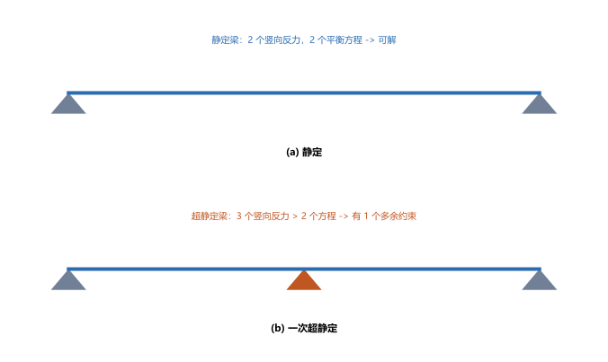
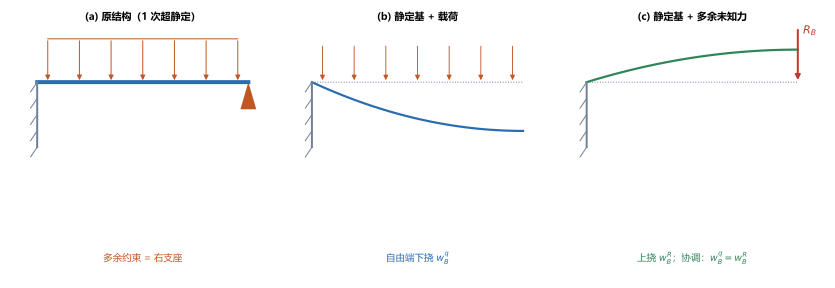
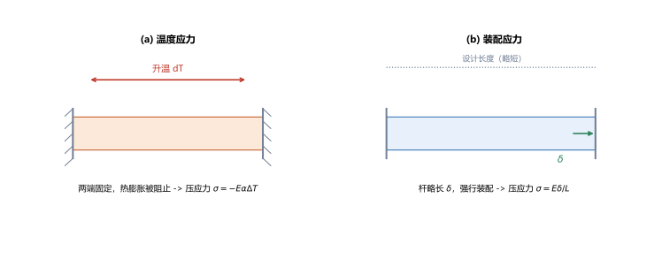

# 第 12 讲：简单超静定问题

> **前置**：第 01 讲（截面法、平衡）、第 03 讲（胡克定律 $\Delta L=NL/(EA)$）、第 08–11 讲（静定梁的内力、应力、变形）。
> **预计时间**：约 3 小时（含作业）。
>
> **一句话定位**：前面几讲处理的都是**静定**构件——未知反力数恰好等于平衡方程数，靠静力平衡就能全解出来。一旦支座比必要的更多（**多余约束**），平衡方程就不够了。本讲给出补足条件的通用思路——**静力平衡 + 变形协调**——并覆盖拉压超静定、温度应力、装配应力与超静定梁。
>
> **本讲回答什么**：
> 1. 什么是超静定？为什么静力平衡解不出来？
> 2. "变形比较法"怎么操作？多余约束处的协调条件怎么写？
> 3. 温度变化、装配误差为什么会"凭空"产生应力？
>
> **这一讲有真实验证**：拉压超静定（两端固定杆）、一次超静定梁（固支+简支）、温度应力、装配应力的数值核对（脚本 `scripts/lec12-01_verify_indeterminate.py`）；另有静定与超静定、变形比较法、温度与装配应力三张图（`figures/`）。

---

## 引子：方程不够用了

一根简支梁：2 个竖向支座反力，2 个平衡方程（$\sum F_y=0$、$\sum M=0$），正好解出——这是**静定**。

现在在梁中间再加一个支座：变成 3 个竖向反力，可平衡方程还是只有 2 个——**未知数多了 1 个，方程不够解**。这就是**超静定**。

问题来了：多出来的这个支座反力，到底等于多少？光靠"力的平衡"永远答不出——因为多出来的约束**不让梁自由变形**，答案藏在"**变形**"里。本讲就补上这条"变形协调"的条件。

---

## 1. 超静定与超静定次数

- **静定**：未知反力数 = 独立平衡方程数，反力可由静力平衡唯一求出；
- **超静定**（静不定）：未知反力数 > 独立平衡方程数；
- **多余约束**：超出维持平衡所必需的那些约束；
- **超静定次数**：多余约束的个数 =（未知反力数）−（平衡方程数）。

> **图 1 怎么读**：(a) 简支梁：2 个竖向反力、2 个方程，静定；(b) 加了中间支座后 3 个竖向反力，多出 1 个约束——**1 次超静定**。

> **区别的本质**：静定结构的反力只依赖"力"，超静定结构的反力还依赖"构件的刚度（变形）"——这也是后面会看到"超静定反力与 $EI$、$EA$ 有关"的原因。

---

## 2. 变形比较法（求解超静定的基本思路）

求解超静定的通用思路四步：

1. **去掉多余约束**，得到一个**静定基**（可以用静定方法分析的结构）；
2. **写变形协调条件**：原结构中多余约束处的位移必须满足的实际条件（例如支座处位移为零）；
3. **用物理关系**（胡克定律/挠度公式）把位移表达成力的函数，得到**补充方程**；
4. **联立**补充方程与原平衡方程，解出全部未知力。

### 2.1 算例：一次超静定梁（固支 + 简支，均布载荷）

一根梁左端**固定**、右端**简支**（"固支简支梁"，propped cantilever），满跨均布载荷 $q$。

**第一步**，取多余约束为**右支座反力 $R_B$**；去掉它，静定基 = **悬臂梁**。

**第二步**，变形协调条件：**B 端位移为零**（原有支座把 B 端钉住）：

$$w_B = 0.$$

**第三步**，用挠度公式叠加。悬臂梁 B 端：

- 均布 $q$ 使 B 端下挠 $w_B^q = \dfrac{qL^4}{8EI_z}$（向下）；
- 力 $R_B$ 使 B 端上挠 $w_B^R = \dfrac{R_B L^3}{3EI_z}$（向上）。

协调 $w_B^q = w_B^R$（下挠量 = 上挠量，净位移为零），解出：

$$\boxed{R_B = \frac{3qL}{8}}.$$

> **图 2 怎么读**：(a) 原超静定结构；(b) 静定基（悬臂梁）在均布载荷下 B 端下挠 $w_B^q$；(c) 静定基在多余未知力 $R_B$ 下 B 端上挠 $w_B^R$。协调条件是 $w_B^q=w_B^R$——这一步把"力的平衡"和"变形"接上了。

（脚本 EXP2）$q=10\ \mathrm{kN/m}$、$L=4\ \mathrm{m}$：$R_B=\dfrac{3\times10\times4}{8}=15\ \mathrm{kN}$。再回代静力平衡，可得固定端弯矩 $M=-\dfrac{qL^2}{8}=-20\ \mathrm{kN\cdot m}$。

> **注意**：$R_B=\dfrac{3qL}{8}$ 与 $EI_z$ **无关**（两边都含 $EI_z$，约掉了）。这是常见结果；但对一般的超静定结构，反力会依赖刚度。

---

## 3. 拉压超静定

同一套逻辑用在拉压杆上。**算例**：一根杆两端固定，在距左端 $a$、距右端 $b$ 处受轴力 $P$（$L=a+b$）。

- **静力平衡**：$R_1 + R_2 = P$（两个未知、一个方程——超静定 1 次）；
- **变形协调**：中间加载点两侧的伸长必须"接得上"，即左段伸长 = 右段缩短（加载点不动），配合胡克定律得 $\dfrac{R_1 a}{EA} = \dfrac{R_2 b}{EA}$，即 $R_1 a = R_2 b$；
- 联立解得：

$$\boxed{R_1 = \frac{Pb}{L},\qquad R_2 = \frac{Pa}{L}}.$$

（脚本 EXP1）$P=30\ \mathrm{kN}$、$a=1\ \mathrm{m}$、$b=2\ \mathrm{m}$：$R_1=\dfrac{30\times2}{3}=20\ \mathrm{kN}$、$R_2=\dfrac{30\times1}{3}=10\ \mathrm{kN}$（$20+10=30$ ✓）。

> **多杆汇交/并联**同理：只要"平衡方程 + 变形协调 + 胡克定律"三样齐备，多根杆的内力就能解出来。**关键是先想清楚"变形怎么协调"**。

---

## 4. 温度应力与装配应力

这两类是"明明没加外载荷，却产生了应力"的典型，根源都是**变形被约束阻止**——所以**只可能出现在超静定结构里**。

### 4.1 温度应力

一根两端固定的杆，温度升高 $\Delta T$。如果让它自由，它会伸长 $\alpha\Delta T L$（$\alpha$ 是线膨胀系数）；但两端被固定、**不让它伸长**，热膨胀被"憋住"，杆内部就产生**压应力**：

$$\boxed{\sigma = -E\alpha\Delta T}$$

（升温受压；降温则受拉）。

（脚本 EXP3）$E=200\ \mathrm{GPa}$、$\alpha=1.2\times10^{-5}/^\circ\mathrm{C}$、$\Delta T=30^\circ\mathrm{C}$：$\sigma=-2\times10^5\times1.2\times10^{-5}\times30=-72\ \mathrm{MPa}$（受压）。

> **注意**：这个应力与杆长、截面积都**无关**，只与材料（$E$、$\alpha$）和温升有关——所以细杆粗杆的温升应力一样大。

### 4.2 装配应力

两根构件若尺寸有微小误差、又必须强行装配，装配后构件会被"强制变形"，从而产生**装配应力**。例如一根杆比设计长度长了 $\delta$，被强行压进两个固定支座之间：

$$\sigma = E\,\frac{\delta}{L}\qquad(\text{杆长了则受压}).$$

> **图 3 怎么读**：(a) 两端固定杆升温，热膨胀被阻止 → 压应力 $\sigma=-E\alpha\Delta T$；(b) 杆比设计长 $\delta$，强行装配 → 压应力 $\sigma=E\delta/L$。

（脚本 EXP4）$\delta=0.2\ \mathrm{mm}$、$L=2000\ \mathrm{mm}$、$E=200\ \mathrm{GPa}$：$\sigma=2\times10^5\times\dfrac{0.2}{2000}=20\ \mathrm{MPa}$。

> **工程含义**：温度应力、装配应力都是"隐形"的——没有外载荷，却可能很大（如长轨、长管道在温差下、或强行装配的构件）。设计超静定结构时必须把它们算进去。

---

## 5. 本讲的心智模型

把这一讲压缩成一条主线：

> **超静定题 = 静力平衡不够时，用"变形协调"补方程：①去多余约束得静定基；②写协调条件（多余约束处位移 = 已知值）；③用物理关系（变形公式）化成力的方程；④与平衡方程联立。**

遇到一道题，按这个顺序走：

1. **数反力、数方程**：判断是否超静定、几次；
2. **选静定基**：去掉多余约束；
3. **写协调条件**：多余约束处的位移约束（常常是"位移为零"）；
4. **用变形公式**把位移换成力，得补充方程；
5. **联立求解**，回代求其余反力/内力/应力。

温度、装配问题的特别之处：**协调条件来自"热膨胀/装配误差被阻止"**，应力由被迫的变形反推。

---

## 6. 小结

- **静定**：反力数 = 平衡方程数；**超静定**：反力数 > 方程数，多出的是**多余约束**，超静定次数 = 反力数 − 方程数。
- **变形比较法四步**：去多余约束得**静定基** → 写**变形协调条件** → 用**物理关系（变形公式）**化位移为力得补充方程 → 与**平衡方程联立**求解。
- **一次超静定梁**（固支+简支、均布 $q$）：$R_B=\dfrac{3qL}{8}$、固定端 $M=-\dfrac{qL^2}{8}$。
- **拉压超静定**（两端固定杆受 $P$）：$R_1=\dfrac{Pb}{L}$、$R_2=\dfrac{Pa}{L}$（平衡 + 变形协调 + 胡克定律）。
- **温度应力** $\sigma=-E\alpha\Delta T$（两端固定、升温受压），与杆长、面积无关。
- **装配应力** $\sigma=E\dfrac{\delta}{L}$（构件长了则受压）。
- **温度/装配应力都只可能出现在超静定结构中**（变形被约束阻止）。

---

## 7. 作业

### 基础

**Q1. 概念**：判断下列结构是静定还是超静定，并说明超静定次数。（1）简支梁；（2）两端固定的杆；（3）固支+简支梁（propped cantilever）。

**参考答案**：

(1) 简支梁：2 个竖向反力、2 个方程 → **静定**。
(2) 两端固定杆：轴向有 2 个反力、轴向平衡方程 1 个 → **1 次超静定**（还有弯曲/转动的多余约束，但就轴向拉压而言是 1 次）。
(3) 固支+简支梁：竖向 3 个反力、方程 2 个 → **1 次超静定**。
验算（自检方向）：超静定次数 = 反力数 − 平衡方程数。

**Q2. 拉压超静定**：一根杆两端固定，$P=40\ \mathrm{kN}$ 作用在距左端 $a=1.5\ \mathrm{m}$、距右端 $b=2.5\ \mathrm{m}$ 处（$L=4\ \mathrm{m}$）。求两端反力。

**参考答案**：

$R_1=\dfrac{Pb}{L}=\dfrac{40\times2.5}{4}=25\ \mathrm{kN}$，$R_2=\dfrac{Pa}{L}=\dfrac{40\times1.5}{4}=15\ \mathrm{kN}$。
验算：$R_1+R_2=40=P$ ✓；且反力与距加载点的距离成正比（离得远的一侧分担更多）。

**Q3. 温度应力**：两端固定的钢杆，$E=200\ \mathrm{GPa}$、$\alpha=1.2\times10^{-5}/^\circ\mathrm{C}$，温度升高 $\Delta T=40^\circ\mathrm{C}$。求温度应力。

**参考答案**：

$\sigma=-E\alpha\Delta T=-2\times10^5\times1.2\times10^{-5}\times40=-96\ \mathrm{MPa}$（受压）。
验算：与杆长、截面积无关，只与 $E$、$\alpha$、$\Delta T$ 有关。

### 提高

**Q4. 一次超静定梁**：固支+简支梁，均布 $q=12\ \mathrm{kN/m}$，跨长 $L=3\ \mathrm{m}$。求多余约束反力 $R_B$ 与固定端弯矩。

**参考答案**：

$R_B=\dfrac{3qL}{8}=\dfrac{3\times12\times3}{8}=13.5\ \mathrm{kN}$；
固定端弯矩 $M=-\dfrac{qL^2}{8}=-\dfrac{12\times3^2}{8}=-13.5\ \mathrm{kN\cdot m}$。
验算：用静力平衡核对——总载荷 $qL=36\ \mathrm{kN}$，$R_B=13.5$，则固定端竖向反力 $=36-13.5=22.5\ \mathrm{kN}$；再由对固定端取矩核对 $M$ 值。

**Q5. 装配应力**：一根钢杆设计长度 $L=1500\ \mathrm{mm}$，实际长了 $\delta=0.3\ \mathrm{mm}$，强行装入两固定支座间，$E=200\ \mathrm{GPa}$。求装配应力。

**参考答案**：

$\sigma=E\dfrac{\delta}{L}=2\times10^5\times\dfrac{0.3}{1500}=40\ \mathrm{MPa}$（受压，因杆偏长被压）。
验算：$\delta/L=2\times10^{-4}$，乘 $E$ 得 40 MPa，量级合理（微小尺寸误差即可产生可观应力）。

**Q6. 概念**：为什么温度应力和装配应力只可能出现在超静定结构里？静定结构会不会有？

**参考答案**：

温度应力、装配应力的本质都是"**构件想变形、但被约束不让变**"，从而在被迫的变形下产生应力。
**静定结构**里，支座约束恰好够维持平衡、没有多余约束——构件可以**自由**膨胀/收缩（只是刚体位移，不影响平衡），不会被"憋住"，所以**不产生**这类应力。
**超静定结构**有多余约束，变形被限制，才会产生。
验算（自检方向）：一句话——"有约束变形的多余约束，才有这类应力"。

### 综合

**Q7. 完整分析**：一根两端固定的钢杆，长 $L=2\ \mathrm{m}$，截面积 $A=400\ \mathrm{mm^2}$，$E=200\ \mathrm{GPa}$、$\alpha=1.2\times10^{-5}/^\circ\mathrm{C}$。温度升高 $\Delta T=25^\circ\mathrm{C}$。（1）求温度应力；（2）求杆内的轴力；（3）若同时承受一个装配误差 $\delta=0.1\ \mathrm{mm}$（杆偏长），两种效应该叠加还是抵消？

**参考答案**：

(1) $\sigma=-E\alpha\Delta T=-2\times10^5\times1.2\times10^{-5}\times25=-60\ \mathrm{MPa}$（受压）。
(2) 轴力 $N=\sigma A=-60\times400=-2.4\times10^4\ \mathrm{N}=-24\ \mathrm{kN}$（压力）。
(3) 装配误差（杆偏长）也产生**压**应力 $\sigma_a=E\delta/L=2\times10^5\times0.1/2000=10\ \mathrm{MPa}$；两者**同号（都压），叠加**，总压应力约 $-70\ \mathrm{MPa}$（**不是抵消，是叠加**——因为它们都由"变形被阻止"产生、方向一致）。
验算：温度效应 −60 与装配效应 −10 相加 −70 MPa；若装配误差是"杆偏短"（被拉长以装配），则装配应力为拉、可与温度压应力部分抵消。

**Q8. 开放简答**：超静定结构明明更难算，为什么工程上还大量使用？说说它的好处与代价。

**参考答案**：

**好处**：
- **更安全**：多余约束提供"备用传力路径"，某处破坏或超载时，内力可以重分布，不至于整体失效（如连续梁、冗余桁架）；
- **刚度更大**：多余约束限制变形，同载荷下挠度更小；
- **可分担**：加上温度、装配效应，多余约束能"约束"住不利变形。
**代价**：
- **计算复杂**（需变形协调）；
- **对支座沉降、温度、装配误差敏感**——静定结构支座沉降不会产生内力，超静定结构会（因为产生了强迫变形）；
- **施工要求高**（尺寸误差会引入装配应力）。
验算（自检方向）：这与本讲"温度/装配应力只出现在超静定"是同一枚硬币的两面——多余约束既带来安全，也带来敏感。

---

*下一讲预告——第 13 讲《应力状态分析》：到这里，拉压、扭转、弯曲各自的应力都讲完了。但一个"点"上往往受多个方向应力（比如弯扭组合），怎么判断它会怎样破坏？第 13 讲从"一点的应力状态"入手，用解析法与应力圆求主应力和最大切应力。*
