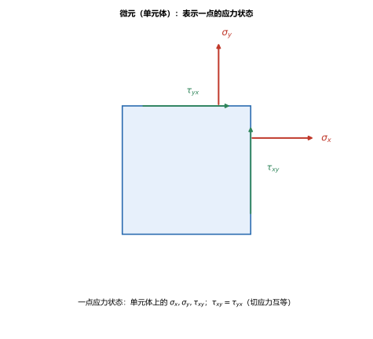
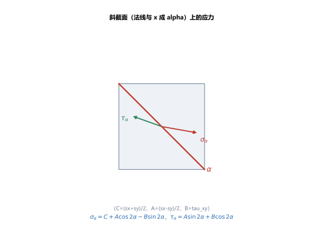
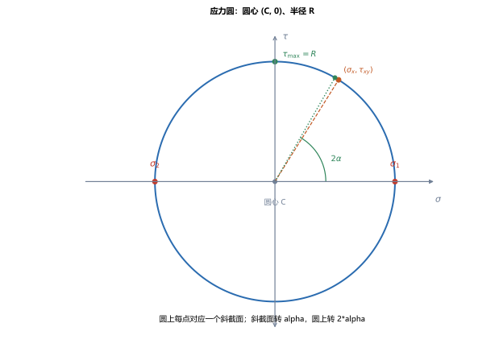

# 第 13 讲：应力状态分析

> **前置**：第 02 讲（斜截面切应力 $\tau_\alpha$ 的正负约定）、第 04 讲（切应力互等）、第 08–12 讲（拉压/扭转/弯曲的应力）。
> **预计时间**：约 3.5 小时（含作业）。
>
> **一句话定位**：前面几讲都是"一根杆/一根梁的某个截面"上的应力。但一个**点**上往往同时受多个方向的应力（弯扭组合、受内压的筒壁都如此），"点的强度"取决于它在**哪个方向**受力最大。本讲把一点的应力状态讲清：单元体、解析法、**主应力与主平面**、**最大切应力**，以及图解法——**应力圆**。这是第 14、15 讲（广义胡克定律、强度理论）的直接基础。
>
> **本讲回答什么**：
> 1. 一点上的应力怎么"完整"描述？为什么过一点不同方向截面上的应力不同？
> 2. 主平面、主应力是什么？最大切应力在哪里？
> 3. 应力圆怎么画、怎么用？它和单元体怎么对应？
>
> **这一讲有真实验证**：斜截面应力的解析法（$\sigma_x=100,\sigma_y=50,\tau_{xy}=40$ 的多角度数值）、主应力与最大切应力、应力圆不变式核对（脚本 `scripts/lec13-01_verify_stress_state.py`）；另有单元体、斜截面解析、应力圆三张图（`figures/`）。

---

## 引子：同一块材料，换个方向切，应力就不一样

第 02 讲讲斜截面时，我们见过：一根受拉的杆，横截面上只有正应力，但在斜截面上却同时有正应力和切应力——**同一个点、不同的截面方向，应力不同**。

这说明"某点应力是 $\sigma$ 多少"这种说法不完整：要描述清楚一点，必须说清**它在各个方向上的应力**。本讲就是把这件事讲全，并回答工程最关心的两个问题——**哪个方向的正应力最大（主应力）**、**哪个方向的切应力最大**，因为它们是判断"会不会坏、怎么坏"的依据。

---

## 1. 一点的应力状态与单元体

### 1.1 单元体

围着一点取一个**无穷小正六面体**（叫**单元体**）作为代表。平面应力状态下，它三个方向的面上有：

- **两个正应力**：$\sigma_x$（垂直于 $x$ 面）、$\sigma_y$；
- **切应力**：$\tau_{xy}$、$\tau_{yx}$，且由**切应力互等定理**（第 04 讲）$\tau_{xy}=\tau_{yx}$。

> **图 1 怎么读**：单元体右面有正应力 $\sigma_x$、切应力 $\tau_{xy}$（向上）；上面有 $\sigma_y$、切应力 $\tau_{yx}$（向右）。两个切应力大小相等、方向使单元体平衡——这就是切应力互等。

### 1.2 正负约定

- **正应力**：拉为正（与第 02 讲一致）；
- **切应力**：使单元体产生**顺时针**转动趋势者为正（与第 02 讲斜截面切应力约定一致）。本讲所有公式按这套约定。

> **一点应力状态** = 这 3 个独立分量 $(\sigma_x,\sigma_y,\tau_{xy})$ 全知道——知道它，就能算出**任意方向**截面上的应力。

---

## 2. 平面应力状态的解析法

### 2.1 斜截面上的应力

设某斜截面的**法线**与 $x$ 轴成 $\alpha$ 角（逆时针为正）。用单元体的平衡（对三角形微元列平衡方程），可得该面上的正应力和切应力：

$$\boxed{\sigma_\alpha = C + A\cos 2\alpha - B\sin 2\alpha},\qquad \boxed{\tau_\alpha = A\sin 2\alpha + B\cos 2\alpha},$$

其中

$$C=\frac{\sigma_x+\sigma_y}{2},\qquad A=\frac{\sigma_x-\sigma_y}{2},\qquad B=\tau_{xy}.$$

（这三个量只是为了书写简洁，本身没有物理含义。）

> **图 2 怎么读**：把单元体沿法线方向 $\alpha$ 的斜截面切开，斜面上有正应力 $\sigma_\alpha$（沿法线）和切应力 $\tau_\alpha$（沿截面）。

### 2.2 数值核对

（脚本 EXP1）取 $\sigma_x=100$、$\sigma_y=50$、$\tau_{xy}=40$（MPa），按上式算不同 $\alpha$ 的斜截面应力：

| $\alpha$ / deg | $0$ | $30$ | $45$ | $60$ | $90$ |
|---|---|---|---|---|---|
| $\sigma_\alpha$ / MPa | $100.00$ | $52.86$ | $35.00$ | $27.86$ | $50.00$ |
| $\tau_\alpha$ / MPa | $40.00$ | $41.65$ | $25.00$ | $1.65$ | $-40.00$ |

可以看到：$\alpha=0$ 时 $\sigma_\alpha=\sigma_x$（原来 $x$ 面）——公式自洽；随 $\alpha$ 变化，$\sigma_\alpha$、$\tau_\alpha$ 都在变，且存在让 $\tau_\alpha$ 接近零的方向（$\alpha=60^\circ$ 时 $1.65\approx0$）。

---

## 3. 主应力与主平面

### 3.1 主平面

上表里，$\alpha=60^\circ$ 附近切应力几乎为零。**切应力恰好为零的那个截面叫主平面**，主平面上的正应力叫**主应力**，记 $\sigma_1$（较大）、$\sigma_2$（较小）。

**主平面方向**（令 $\tau_\alpha=0$）：

$$\tan 2\alpha_p = -\frac{2\tau_{xy}}{\sigma_x-\sigma_y}.$$

### 3.2 主应力的值

把 $\alpha_p$ 代回 $\sigma_\alpha$，或直接用下面公式：

$$\boxed{\sigma_{1,2} = \frac{\sigma_x+\sigma_y}{2} \pm \sqrt{\left(\frac{\sigma_x-\sigma_y}{2}\right)^2 + \tau_{xy}^2}} = C \pm R,$$

其中 $R=\sqrt{A^2+B^2}$。

### 3.3 最大切应力

由 $\tau_\alpha$ 求极值，可得**最大切应力**：

$$\boxed{\tau_{\max} = \sqrt{\left(\frac{\sigma_x-\sigma_y}{2}\right)^2 + \tau_{xy}^2}} = R = \frac{\sigma_1-\sigma_2}{2},$$

它出现在与主平面成 $45^\circ$ 的面上。

（脚本 EXP2、EXP3）同前数据：$C=75$、$R=47.17$ →

$$\sigma_1=122.17\ \mathrm{MPa},\quad \sigma_2=27.83\ \mathrm{MPa},\quad \tau_{\max}=47.17\ \mathrm{MPa},\quad \alpha_p=-29^\circ.$$

> **工程意义**：$\sigma_1$、$\sigma_2$ 是这一点"可能出现的最大/最小正应力"，$\tau_{\max}$ 是"最大切应力"——**材料的破坏（屈服或断裂）正是由它们控制**。所以知道一点应力状态后，真正要看的是它的主应力和最大切应力（第 14、15 讲会用它推强度理论）。

---

## 4. 应力圆（莫尔圆）

解析公式能算，但**画成圆**更直观、更好记——这就是**应力圆**（莫尔圆）。

### 4.1 作法

以 $\sigma$ 为横轴、$\tau$ 为纵轴：

- **圆心**在 $(\dfrac{\sigma_x+\sigma_y}{2},\,0)$，即 $(C,0)$；
- **半径** $R=\sqrt{(\dfrac{\sigma_x-\sigma_y}{2})^2+\tau_{xy}^2}$。

圆上每一点 $(\sigma_\alpha,\tau_\alpha)$ 就对应一个斜截面。

### 4.2 对应关系（关键）

- **单元体转 $\alpha$，应力圆上转 $2\alpha$**（这是莫尔圆最容易记错的地方——**两倍关系**）；
- 圆与 $\sigma$ 轴的**两个交点**，就是**主应力 $\sigma_1$、$\sigma_2$**（该处 $\tau=0$）；
- 圆的**最高/最低点**，就是 $\tau_{\max}=R$（横坐标为 $C$）。

> **图 3 怎么读**：圆心 $C=75$、半径 $R=47.17$。圆与横轴交点即 $\sigma_1=122.17$、$\sigma_2=27.83$；圆的最高点即 $\tau_{\max}=47.17$；点 $(\sigma_x,\tau_{xy})=(100,40)$ 对应 $\alpha=0$ 的截面；斜截面转 $\alpha$，圆上转 $2\alpha$。

（脚本 EXP4）沿所有角度验证 $( \sigma_\alpha-C)^2+\tau_\alpha^2-R^2$ 恒为零——**这就是"这些点都在同一个圆上"的数学证明**（偏差 $1.8\times10^{-12}$，数值误差）。

---

## 5. 本讲的心智模型

把这一讲压缩成一条主线：

> **应力状态题 = 已知 $(\sigma_x,\sigma_y,\tau_{xy})$ → 求 $C$、$R$ → 主应力 $\sigma_{1,2}=C\pm R$、最大切应力 $\tau_{\max}=R$、主方向由 $\tan2\alpha_p=-2\tau_{xy}/(\sigma_x-\sigma_y)$ 定。要某方向 $\alpha$ 的应力，套 $\sigma_\alpha$、$\tau_\alpha$ 公式或读应力圆上 $2\alpha$ 处的点。**

遇到一道题，按这个顺序走：

1. **确定单元体的 $(\sigma_x,\sigma_y,\tau_{xy})$**（含正负号）；
2. **算 $C$、$R$**；
3. **要主应力/最大切应力**：直接 $\sigma_{1,2}=C\pm R$、$\tau_{\max}=R$；
4. **要某斜截面 $\alpha$**：套公式，或在应力圆上找 $2\alpha$ 点；
5. **注意**：单元体转角与应力圆转角是 **2 倍**关系。

---

## 6. 小结

- **一点应力状态**用**单元体**描述：平面应力状态下由 $(\sigma_x,\sigma_y,\tau_{xy})$ 三个分量确定，其中 $\tau_{xy}=\tau_{yx}$（切应力互等）。
- **解析法**：斜截面（法线与 $x$ 成 $\alpha$）上 $\sigma_\alpha=C+A\cos2\alpha-B\sin2\alpha$、$\tau_\alpha=A\sin2\alpha+B\cos2\alpha$，$C=\dfrac{\sigma_x+\sigma_y}{2}$、$A=\dfrac{\sigma_x-\sigma_y}{2}$、$B=\tau_{xy}$。
- **主平面**：$\tau=0$ 的截面，方向 $\tan2\alpha_p=-\dfrac{2\tau_{xy}}{\sigma_x-\sigma_y}$；**主应力** $\sigma_{1,2}=C\pm R$。
- **最大切应力** $\tau_{\max}=R=\dfrac{\sigma_1-\sigma_2}{2}$，在与主平面成 $45^\circ$ 的面上。
- **应力圆**：圆心 $(C,0)$、半径 $R$；圆上点对应斜截面，**单元体转 $\alpha$、圆上转 $2\alpha$**；与横轴交点 = 主应力，最高点 = 最大切应力。
- **意义**：主应力与最大切应力控制材料破坏，是强度理论的基础。

---

## 7. 作业

### 基础

**Q1. 概念**：用单元体说明什么是"一点的应力状态"，并写出平面应力状态下的三个独立分量。

**参考答案**：

一点应力状态 = 过该点**所有方向**截面上应力的总称。用围绕该点取的**无穷小正六面体（单元体）**来代表：平面应力状态下，单元体各面只有 $(\sigma_x,\sigma_y,\tau_{xy})$ 三个独立分量（$\tau_{yx}=\tau_{xy}$ 由切应力互等，不独立）。
验算（自检方向）：三个分量 → 任意方向 $\alpha$ 的 $(\sigma_\alpha,\tau_\alpha)$ 都能算出来，说明信息完备。

**Q2. 主应力与最大切应力**：已知 $\sigma_x=80\ \mathrm{MPa}$、$\sigma_y=-40\ \mathrm{MPa}$、$\tau_{xy}=30\ \mathrm{MPa}$。求主应力与最大切应力。

**参考答案**：

$C=\dfrac{80+(-40)}{2}=20$，$A=\dfrac{80-(-40)}{2}=60$，$B=30$，$R=\sqrt{60^2+30^2}=67.08\ \mathrm{MPa}$；
$\sigma_1=20+67.08=87.08\ \mathrm{MPa}$，$\sigma_2=20-67.08=-47.08\ \mathrm{MPa}$；$\tau_{\max}=R=67.08\ \mathrm{MPa}$。
验算：$\sigma_1-\sigma_2=134.16$，$( \sigma_1-\sigma_2)/2=67.08=\tau_{\max}$ ✓。

**Q3. 主方向**：求 Q2 的主平面方向 $\alpha_p$。

**参考答案**：

$\tan2\alpha_p=-\dfrac{2\tau_{xy}}{\sigma_x-\sigma_y}=-\dfrac{2\times30}{80-(-40)}=-\dfrac{60}{120}=-0.5$ → $2\alpha_p=-26.57^\circ$ → $\alpha_p=-13.28^\circ$。
验算：把 $\alpha_p$ 代回 $\tau_\alpha=A\sin2\alpha+B\cos2\alpha=60\times(-0.447)+30\times0.894=-26.8+26.8\approx0$ ✓（该面 $\tau=0$，是主平面）。

### 提高

**Q4. 斜截面应力**：已知 $\sigma_x=60$、$\sigma_y=20$、$\tau_{xy}=30$（MPa）。求 $\alpha=30^\circ$ 斜截面上的 $\sigma_\alpha$、$\tau_\alpha$。

**参考答案**：

$C=40$、$A=20$、$B=30$；
$\sigma_\alpha=40+20\cos60^\circ-30\sin60^\circ=40+10-25.98=24.02\ \mathrm{MPa}$；
$\tau_\alpha=20\sin60^\circ+30\cos60^\circ=17.32+15=32.32\ \mathrm{MPa}$。
验算：用主应力核对量级——$R=\sqrt{20^2+30^2}=36.06$，$\sigma_{1,2}=40\pm36.06$（即 $76.06$、$3.94$），$\sigma_\alpha=24.02$ 落在 $[\sigma_2,\sigma_1]$ 内 ✓。

**Q5. 应力圆读值**：已知 $C=75$、$R=47.17$。不套公式，直接从应力圆写出 $\sigma_1$、$\sigma_2$、$\tau_{\max}$。

**参考答案**：

圆与 $\sigma$ 轴交点 = 主应力：$\sigma_1=C+R=122.17$、$\sigma_2=C-R=27.83$；
圆的最高点（横坐标 $C$、纵坐标 $R$）= 最大切应力：$\tau_{\max}=R=47.17$。
验算：$\tau_{\max}=(\sigma_1-\sigma_2)/2=(122.17-27.83)/2=47.17$ ✓，与圆的半径一致。

**Q6. 概念**：为什么应力圆上"单元体转 $\alpha$、圆上要转 $2\alpha$"？以 $\alpha=90^\circ$ 验证。

**参考答案**：

因为公式里所有项都是 $\cos2\alpha$、$\sin2\alpha$（**周期为 $180^\circ$**），而不是 $\alpha$ 的 $1$ 倍——根本原因是**应力的对称性**：截面转 $180^\circ$ 后正应力回到原值（两点对面的应力相等），所以应力圆周期是 $180^\circ$，单元体转 $90^\circ$（$\alpha=90^\circ$）对应圆上转 $180^\circ$，从 $(\sigma_x,\tau_{xy})$ 走到 $(\sigma_y,-\tau_{xy})$。
验算：脚本里 $\alpha=0$（$\sigma=100,\tau=40$）与 $\alpha=90$（$\sigma=50,\tau=-40$），正好是圆上相差 $180^\circ$ 的两个点 $(\sigma_x,\tau_{xy})$ 与 $(\sigma_y,-\tau_{yx})$ ✓。

### 综合

**Q7. 完整分析**：已知一点 $\sigma_x=100\ \mathrm{MPa}$、$\sigma_y=50\ \mathrm{MPa}$、$\tau_{xy}=40\ \mathrm{MPa}$。（1）求主应力与最大切应力；（2）求 $\alpha=45^\circ$ 面上的应力；（3）画出应力圆的圆心和半径。

**参考答案**：

(1) $C=75$，$R=\sqrt{25^2+40^2}=47.17$；$\sigma_1=122.17\ \mathrm{MPa}$、$\sigma_2=27.83\ \mathrm{MPa}$、$\tau_{\max}=47.17\ \mathrm{MPa}$。
(2) $\sigma_{45}=75+25\cos90^\circ-40\sin90^\circ=75+0-40=35\ \mathrm{MPa}$；$\tau_{45}=25\sin90^\circ+40\cos90^\circ=25\ \mathrm{MPa}$。
(3) 圆心 $(75,0)$、半径 $47.17$。
验算：$\tau_{45}=25$ 应等于圆上 $2\alpha=90^\circ$ 处点的纵坐标——该点横坐标 $\sigma_{45}=35$、纵坐标 $\tau_{45}=25$，到圆心 $(75,0)$ 的距离 $\sqrt{(75-35)^2+25^2}=\sqrt{1600+625}=\sqrt{2225}=47.17=R$ ✓。

**Q8. 开放简答**：为什么说"求出主应力和最大切应力"才是应力状态分析真正想要的结论？

**参考答案**：

因为**材料的破坏由极值应力控制，而不是任意方向的应力**：
- **正应力极值（主应力 $\sigma_1$）**：脆性材料（如铸铁）在最大拉应力处被拉断——判据是 $\sigma_1$；
- **切应力极值（$\tau_{\max}$）**：塑性材料（如低碳钢）在最大切应力处屈服——判据是 $\tau_{\max}$。
所以无论走解析法还是应力圆，最终要落到的都是 $\sigma_{1,2}=C\pm R$ 与 $\tau_{\max}=R$。
验算（自检方向）：第 14 讲的广义胡克定律、第 15 讲的强度理论都以 $\sigma_1,\sigma_2,\sigma_3$（三向主应力）为输入——这正是本讲结论的延伸用途。

---

*下一讲预告——第 14 讲《三向应力状态与广义胡克定律》：本讲是**平面**应力状态（两个正应力 + 一个切应力）。第 14 讲推广到**三向**（三个正应力 + 三个切应力），给出三向下的主应力与最大切应力，并把胡克定律推广成"广义胡克定律"（一个方向的应力会带动另外两个方向也产生应变），顺带把第 03 讲留下的"泊松比、体积应变"补全。*
