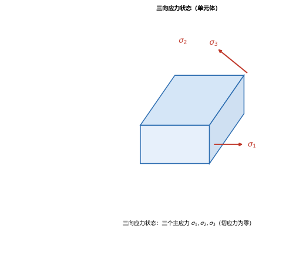
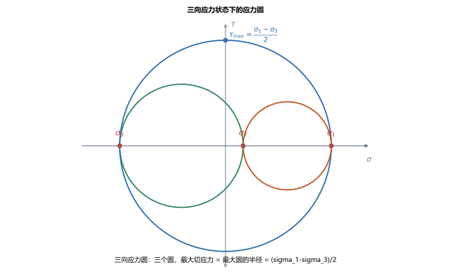
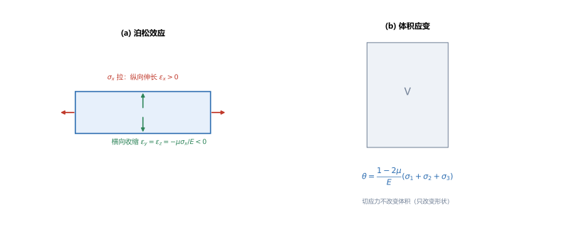

# 第 14 讲：三向应力状态与广义胡克定律

> **前置**：第 03 讲（泊松比 $\mu$、胡克定律 $\varepsilon=\sigma/E$）、第 05 讲（剪切胡克定律 $\tau=G\gamma$）、第 13 讲（平面应力状态、主应力）。
> **预计时间**：约 3 小时（含作业）。
>
> **一句话定位**：第 13 讲是**平面**应力状态（两个正应力 + 一个切应力）。本讲推广到**三向**，给出三向下的主应力、最大切应力与**三向应力圆**；再把胡克定律推广成**广义胡克定律**——一个方向的应力不仅让它自己在那个方向变形，还**连带**在另外两个方向引起应变（这就是泊松效应在一般应力下的样子）。最后把第 03 讲留下的两个钩子补全：**体积应变**与**泊松比的上界**。
>
> **本讲回答什么**：
> 1. 三向应力状态下主应力与最大切应力怎么求？
> 2. 广义胡克定律是什么？三个方向的应变和应力怎么互相牵扯？
> 3. 体积应变怎么算？为什么泊松比不能超过 0.5？
>
> **这一讲有真实验证**：三向主切应力与最大切应力、广义胡克定律的三个正应变、体积应变两法互证、弹性常数关系 $G=E/[2(1+\mu)]$（脚本 `scripts/lec14-01_verify_generalized_hooke.py`）；另有三向单元体、三向应力圆、广义胡克与体积应变三张图（`figures/`）。

---

## 引子：应力不只让"同方向"变形

第 03 讲讲单向拉伸时见过：杆被拉长（$\varepsilon_x$），同时在**横向**收缩（$\varepsilon_y=\varepsilon_z=-\mu\sigma_x/E$）——**一个方向的应力，让另外两个方向也变形了**（泊松效应）。

那么一般的三向应力下，$x$ 方向的应变到底由谁决定？答案是：**被 $\sigma_x$、$\sigma_y$、$\sigma_z$ 三者共同决定**。把这件事写成公式，就是本讲的核心——**广义胡克定律**。它是后面"组合变形"、"能量法"的直接工具。

---

## 1. 三向应力状态

第 13 讲的一点应力状态，如果三个方向都有正应力（且有切应力），就是**三向（空间）应力状态**。和平面一样，总能找到一组**主平面**（切应力为零），使单元体上只剩三个**主应力**，按大小记为

$$\sigma_1 \ge \sigma_2 \ge \sigma_3.$$

> **图 1 怎么读**：三向应力状态下的单元体，三个面上各有一个主应力 $\sigma_1$、$\sigma_2$、$\sigma_3$，主平面上没有切应力。

> **为什么老要归一化到主应力**：因为破坏判据（第 15 讲）只认三个主应力——只要知道 $\sigma_1\ge\sigma_2\ge\sigma_3$，一点的危险程度就定死了。

---

## 2. 三向应力圆与最大切应力

### 2.1 三向应力圆

把三个主应力两两配对，得到**三个应力圆**（第 13 讲的莫尔圆推广）：

- 由 $\sigma_1$、$\sigma_2$ 作一个圆；
- 由 $\sigma_2$、$\sigma_3$ 作一个圆；
- 由 $\sigma_1$、$\sigma_3$ 作一个圆（**最大的**，直径 $=\sigma_1-\sigma_3$）。

> **图 2 怎么读**：横轴上的三个点 $\sigma_3<\sigma_2<\sigma_1$，两两连成三个圆。**最大切应力是最大圆的半径**。

### 2.2 最大切应力

$$\boxed{\tau_{\max} = \frac{\sigma_1-\sigma_3}{2}},$$

即**最大圆与最小圆之间**那个圆的半径——它由最大主应力和最小主应力决定。

（脚本 EXP1）$\sigma_1=100$、$\sigma_2=50$、$\sigma_3=-20$（MPa）：三个主切应力分别为 $\dfrac{100-50}{2}=25$、$\dfrac{50-(-20)}{2}=35$、$\dfrac{100-(-20)}{2}=60$，故 $\tau_{\max}=60\ \mathrm{MPa}$。

> **注意与第 13 讲的区别**：平面应力下 $\tau_{\max}$ 就是那个圆的半径；但**三向**下要比较三个圆、取最大那个——不要只拿 $\sigma_1-\sigma_2$ 去算。

---

## 3. 广义胡克定律

### 3.1 正应力与正应变

单向拉伸时 $\varepsilon_x=\sigma_x/E$（第 03 讲）。三向时，$x$ 方向的应变要**减去** $y$、$z$ 方向应力因泊松效应带来的横向收缩：

$$\boxed{\varepsilon_x = \frac{1}{E}\left[\sigma_x - \mu(\sigma_y+\sigma_z)\right]},$$

同理

$$\varepsilon_y = \frac{1}{E}\left[\sigma_y - \mu(\sigma_z+\sigma_x)\right],\qquad \varepsilon_z = \frac{1}{E}\left[\sigma_z - \mu(\sigma_x+\sigma_y)\right].$$

这就是**广义胡克定律**（正应力部分）。三项形式完全对称，记一个就记住了。

> **怎么理解**：$\varepsilon_x$ 有两个来源——① $\sigma_x$ 让 $x$ 方向伸长（$+\sigma_x/E$）；② $\sigma_y$、$\sigma_z$ 让 $x$ 方向收缩（$-\mu(\sigma_y+\sigma_z)/E$）。符号方向相反，所以是相减。

### 3.2 切应力与切应变

切应变与切应力**一一对应、互不干扰**（第 05 讲的剪切胡克定律）：

$$\gamma_{xy} = \frac{\tau_{xy}}{G},\qquad \gamma_{yz}=\frac{\tau_{yz}}{G},\qquad \gamma_{zx}=\frac{\tau_{zx}}{G}.$$

### 3.3 特例

- **单向拉压**（只有 $\sigma_x$）：$\varepsilon_x=\dfrac{\sigma_x}{E}$、$\varepsilon_y=\varepsilon_z=-\dfrac{\mu\sigma_x}{E}$（回到第 03 讲）；
- **平面应力**（$\sigma_z=0$）：$\varepsilon_x=\dfrac{1}{E}(\sigma_x-\mu\sigma_y)$、$\varepsilon_y=\dfrac{1}{E}(\sigma_y-\mu\sigma_x)$、$\varepsilon_z=-\dfrac{\mu}{E}(\sigma_x+\sigma_y)$——注意**平面应力不等于平面应变**（$\varepsilon_z\ne0$）。

（脚本 EXP2）$\sigma_1=100,\sigma_2=50,\sigma_3=-20$、$E=200\ \mathrm{GPa}$、$\mu=0.3$：

$$\varepsilon_1 = \frac{100-0.3(50-20)}{2\times10^5}=4.55\times10^{-4},\quad \varepsilon_2=1.30\times10^{-4},\quad \varepsilon_3=-3.25\times10^{-4}.$$

### 3.4 适用条件

广义胡克定律的三个正应变式与三个切应变式，只在**线弹性**、**小变形**、**各向同性**材料下成立：

- **线弹性**：应力与应变成正比（超出则失效，如塑性阶段）；
- **小变形**：叠加关系成立（否则应变与位移的关系也变复杂）；
- **各向同性**：各方向弹性性质相同（复合材料、木材等各向异性材料不适用本式，系数更多）。

> 考试与工程中默认满足这三条；一旦材料进入塑性或大变形，就要换用别的本构关系（第 22 讲会提这些接口）。

---

## 4. 体积应变与泊松比的上界

### 4.1 体积应变

**体积应变** $\theta$ 定义为单位体积的体积改变，等于三个正应变之和：

$$\theta = \varepsilon_x+\varepsilon_y+\varepsilon_z.$$

把广义胡克定律三个式子相加，得到

$$\boxed{\theta = \frac{1-2\mu}{E}\left(\sigma_1+\sigma_2+\sigma_3\right)}.$$

（脚本 EXP3）用 EXP2 的数据核对：$\varepsilon_1+\varepsilon_2+\varepsilon_3=2.60\times10^{-4}$，用公式 $\dfrac{(1-2\times0.3)(100+50-20)}{2\times10^5}=2.60\times10^{-4}$——**两法一致**。

> **两个重要结论**：
> - **体积应变只与三个主应力之和（平均应力 $\dfrac{\sigma_1+\sigma_2+\sigma_3}{3}$）有关**，与切应力无关——**切应力只改变形状、不改变体积**；
> - 三向等压（$\sigma_1=\sigma_2=\sigma_3=\sigma_0$）：$\theta=\dfrac{3(1-2\mu)\sigma_0}{E}$，只有体积变化、没有形状改变。

### 4.2 泊松比的上界（补全第 03 讲的钩子）

第 03 讲在讲泊松比 $\mu$ 的取值范围时留了一个钩子：**$\mu$ 不能大于 $0.5$**。现在可以给出理由了：

由 $\theta=\dfrac{1-2\mu}{E}(\sigma_1+\sigma_2+\sigma_3)$，若材料在受拉时**体积不减小**（$\theta\ge0$），则必须有 $1-2\mu\ge0$，即

$$\mu \le 0.5.$$

$\mu=0.5$ 对应"**体积完全不可压缩**"的极限（如橡胶、水近似此值）。实际材料受拉时体积**略微增大**（$\theta>0$），所以 $\mu<0.5$（钢材约 $0.25\sim0.33$）。

> 这与第 03 讲的抓手完全接上了：那时说"不可压缩即 $\theta=0$ → $\mu=0.5$"，现在有了 $\theta$ 的完整表达式，这个上界的来历就清楚了。

---

## 5. 三个弹性常数 $E$、$G$、$\mu$

各向同性材料只有**两个独立**弹性常数，第三个由它们推出。三者关系为

$$\boxed{G = \frac{E}{2(1+\mu)}}.$$

（脚本 EXP4）$E=200\ \mathrm{GPa}$、$\mu=0.3$：$G=\dfrac{2\times10^5}{2\times1.3}=76923\ \mathrm{MPa}$。

> **为什么重要**：$E$、$G$、$\mu$ 知道其中两个就能求第三个。第 05 讲引入的 $G$ 与第 03 讲的 $E$、$\mu$ 至此闭环——它们不是三个独立的数。

> **图 3 怎么读**：(a) 单向拉伸的泊松效应：$\sigma_x$ 拉，纵向伸长 $\varepsilon_x>0$（红），横向收缩 $\varepsilon_y=\varepsilon_z<0$（绿）；(b) 体积应变 $\theta$ 只由三个主应力之和决定，切应力不改变体积。

> **先记一个量，留到后面用**：复杂应力状态下的**应变能（比能）**——即弹性体单位体积储存的变形能——及其分解为"体积改变能"与"形状改变能"，是第 18 讲能量法、以及第 15 讲第四强度理论（畸变能密度）的基础。本讲只需知道它存在，具体表达式到第 18 讲展开。

---

## 6. 本讲的心智模型

把这一讲压缩成一条主线：

> **三向应力/应变题 = 先归一化到主应力 $\sigma_1\ge\sigma_2\ge\sigma_3$ → 用 $\tau_{\max}=\dfrac{\sigma_1-\sigma_3}{2}$ 求最大切应力；用广义胡克定律求各向应变；用 $\theta=\dfrac{1-2\mu}{E}(\sum\sigma)$ 求体积应变；弹性常数用 $G=\dfrac{E}{2(1+\mu)}$ 互算。**

遇到一道题，按这个顺序走：

1. **判断状态**：单向 / 平面 / 三向；
2. **要切应力极值**：三向取 $\tau_{\max}=\dfrac{\sigma_1-\sigma_3}{2}$；
3. **要应变**：套广义胡克定律（注意三项对称、下拉为负）；
4. **要体积应变**：$\theta=\sum\varepsilon=\dfrac{1-2\mu}{E}\sum\sigma$；
5. **常数不够**：用 $G=\dfrac{E}{2(1+\mu)}$ 补。

---

## 7. 小结

- **三向应力状态**：归一化为三个主应力 $\sigma_1\ge\sigma_2\ge\sigma_3$（主平面上无切应力）。
- **三向应力圆**：三个圆；**最大切应力** $\tau_{\max}=\dfrac{\sigma_1-\sigma_3}{2}$（最大圆的半径）。
- **广义胡克定律**（正应力）：$\varepsilon_x=\dfrac{1}{E}[\sigma_x-\mu(\sigma_y+\sigma_z)]$（三式对称）；**切应力** $\gamma=\tau/G$（一一对应、互不干扰）。
- **特例**：单向拉压、平面应力；**平面应力 $\ne$ 平面应变**。
- **体积应变** $\theta=\varepsilon_x+\varepsilon_y+\varepsilon_z=\dfrac{1-2\mu}{E}(\sigma_1+\sigma_2+\sigma_3)$；只与主应力之和有关，切应力不改体积。
- **泊松比上界** $\mu\le0.5$（$\theta\ge0$ 的要求；$\mu=0.5$ 为体积不可压缩极限）——补全第 03 讲钩子。
- **三个弹性常数**：$G=\dfrac{E}{2(1+\mu)}$（各向同性材料只有两个独立常数）。

---

## 8. 作业

### 基础

**Q1. 三向最大切应力**：已知一点 $\sigma_1=120$、$\sigma_2=30$、$\sigma_3=-40$（MPa）。求 $\tau_{\max}$。

**参考答案**：

$\tau_{\max}=\dfrac{\sigma_1-\sigma_3}{2}=\dfrac{120-(-40)}{2}=80\ \mathrm{MPa}$。
验算：三个主切应力为 $(120-30)/2=45$、$(30+40)/2=35$、$(120+40)/2=80$，取最大为 80 ✓（不能只用 $\sigma_1-\sigma_2$）。

**Q2. 广义胡克定律**：$E=200\ \mathrm{GPa}$、$\mu=0.3$，一点 $\sigma_x=120$、$\sigma_y=40$、$\sigma_z=0$（MPa）。求三个正应变。

**参考答案**：

$\varepsilon_x=\dfrac{1}{2\times10^5}[120-0.3(40+0)]=\dfrac{108}{2\times10^5}=5.40\times10^{-4}$；
$\varepsilon_y=\dfrac{1}{2\times10^5}[40-0.3(120+0)]=\dfrac{4}{2\times10^5}=2.00\times10^{-5}$；
$\varepsilon_z=\dfrac{1}{2\times10^5}[0-0.3(120+40)]=\dfrac{-48}{2\times10^5}=-2.40\times10^{-4}$。
验算：$\sum\varepsilon=5.40\times10^{-4}+0.20\times10^{-4}-2.40\times10^{-4}=3.20\times10^{-4}$；公式 $\dfrac{0.4\times160}{2\times10^5}=3.20\times10^{-4}$ ✓。

**Q3. 弹性常数**：$E=200\ \mathrm{GPa}$、$\mu=0.25$。求切变模量 $G$。

**参考答案**：

$G=\dfrac{E}{2(1+\mu)}=\dfrac{2\times10^5}{2\times1.25}=80000\ \mathrm{MPa}$。
验算：$\mu=0.25$ 时 $G/E=1/2.5=0.4$，即 $G=0.4E=80000\ \mathrm{MPa}$ ✓。

### 提高

**Q4. 体积应变**：三向等拉 $\sigma_1=\sigma_2=\sigma_3=100\ \mathrm{MPa}$，$E=200\ \mathrm{GPa}$、$\mu=0.3$。求体积应变 $\theta$。

**参考答案**：

$\theta=\dfrac{1-2\mu}{E}(\sigma_1+\sigma_2+\sigma_3)=\dfrac{0.4\times300}{2\times10^5}=\dfrac{120}{2\times10^5}=6.00\times10^{-4}$。
验算：由 $3(1-2\mu)\sigma_0/E=3\times0.4\times100/2\times10^5=6.00\times10^{-4}$ ✓；此时无形状改变（只胀大）。

**Q5. 平面应力的应变**：平面应力 $\sigma_x=80$、$\sigma_y=-40$（MPa）、$\sigma_z=0$，$E=200\ \mathrm{GPa}$、$\mu=0.3$。求 $\varepsilon_z$，并说明平面应力是不是平面应变。

**参考答案**：

$\varepsilon_z=\dfrac{1}{E}[0-\mu(\sigma_x+\sigma_y)]=\dfrac{-0.3\times(80-40)}{2\times10^5}=\dfrac{-12}{2\times10^5}=-6.0\times10^{-5}$。
$\varepsilon_z\ne0$，所以**平面应力不是平面应变**——平面应力只是 $\sigma_z=0$，但 $z$ 方向仍有应变。
验算：$\varepsilon_x+\varepsilon_y+\varepsilon_z=\dfrac{0.4\times40}{2\times10^5}=8.0\times10^{-5}$，与 $\theta$ 公式一致 ✓。

**Q6. 概念**：为什么泊松比不能大于 0.5？请用体积应变的表达式说明。

**参考答案**：

由 $\theta=\dfrac{1-2\mu}{E}(\sigma_1+\sigma_2+\sigma_3)$，正应力之和为正（受拉）时，$\theta$ 应 $\ge0$（材料受拉体积不会减小到零以下）。
要使 $1-2\mu\ge0$，必须 $\mu\le0.5$。
$\mu=0.5$ 对应 $\theta=0$（体积完全不可压缩）；实际材料 $\mu<0.5$。
验算（自检方向）：$\mu>0.5$ 会让受拉时体积**减小**，物理上不允许，故为上界。

### 综合

**Q7. 完整分析**：一点 $\sigma_1=80$、$\sigma_2=20$、$\sigma_3=-30$（MPa），$E=200\ \mathrm{GPa}$、$\mu=0.3$。（1）求 $\tau_{\max}$；（2）求三个正应变；（3）求体积应变（两法核对）。

**参考答案**：

(1) $\tau_{\max}=\dfrac{80-(-30)}{2}=55\ \mathrm{MPa}$。
(2) $\varepsilon_1=\dfrac{80-0.3(20-30)}{2\times10^5}=\dfrac{83}{2\times10^5}=4.15\times10^{-4}$；$\varepsilon_2=\dfrac{20-0.3(80-30)}{2\times10^5}=\dfrac{5}{2\times10^5}=2.50\times10^{-5}$；$\varepsilon_3=\dfrac{-30-0.3(80+20)}{2\times10^5}=\dfrac{-60}{2\times10^5}=-3.00\times10^{-4}$。
(3) $\sum\varepsilon=4.15\times10^{-4}+0.25\times10^{-4}-3.00\times10^{-4}=1.40\times10^{-4}$；公式 $\dfrac{0.4\times(80+20-30)}{2\times10^5}=\dfrac{28}{2\times10^5}=1.40\times10^{-4}$ ✓。
验算：$\varepsilon_x+\varepsilon_y+\varepsilon_z$ 与 $(1-2\mu)\sum\sigma/E$ 两法一致，说明广义胡克定律与体积应变公式自洽。

**Q8. 开放简答**：为什么"体积应变只与三个主应力之和有关，而与切应力无关"？这对工程有什么意义？

**参考答案**：

**原因**：体积应变 $\theta=\varepsilon_x+\varepsilon_y+\varepsilon_z$ 是三个正应变之和；而切应变（$\gamma_{xy}$ 等）**不出现在**体积应变的表达里——切应力只让单元体**歪斜**（改变形状），不改变各边长度之和，故不改体积。数学上，$\theta=\dfrac{1-2\mu}{E}(\sigma_1+\sigma_2+\sigma_3)$ 只含正应力之和。
**意义**：
- 判断"体积会不会被压小"只看**平均应力**（静水压力）；
- 反过来，**切应力是形状改变（塑性变形）的驱动**，正应力之和是体积改变的驱动——这条在第 15 讲推强度理论时会被用来拆分"体积改变能"与"形状改变能"。
验算（自检方向）：三向等压（纯体积改变）$\theta\ne0$ 但无剪应变；纯剪切（$\sigma_1=-\sigma_3$、$\sigma_2=0$）$\theta=0$ 但形状改变明显——两者正交，互不干扰。

---

*下一讲预告——第 15 讲《强度理论》：有了主应力和广义胡克定律，就能回答"一点在复杂应力下会不会坏"。第 15 讲给出四个常用强度理论（最大拉应力、最大伸长线应变、最大切应力、畸变能密度），说明各适用什么材料，并用来校核薄壁圆筒（内压容器）——这正是第 13、14 讲主应力与体积应变的直接应用。*
