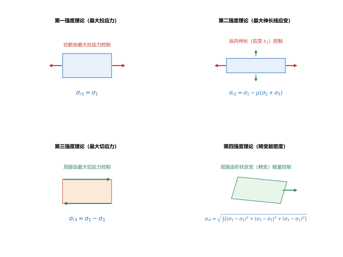
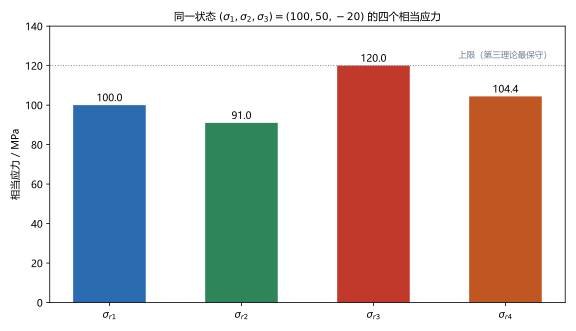
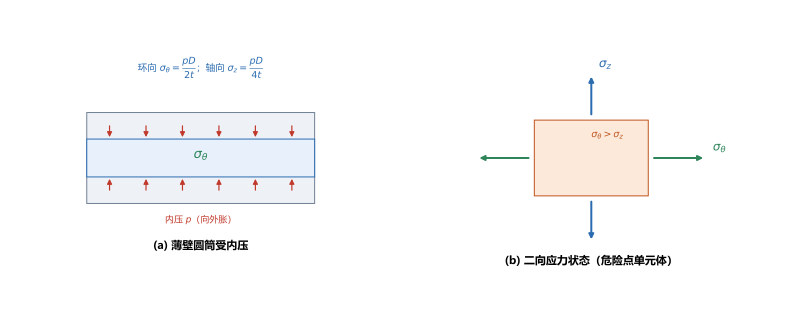

# 第 15 讲：强度理论

> **前置**：第 03 讲（单向强度条件 $\sigma\le[\sigma]$）、第 13 讲（主应力、最大切应力）、第 14 讲（广义胡克定律、体积应变）。
> **预计时间**：约 3 小时（含作业）。
>
> **一句话定位**：第 03 讲起，强度条件 $\sigma\le[\sigma]$ 一直是单向拉伸实验给的。但一点上的真实应力往往是复杂的（三向、含切应力）——**总不能为每种复杂应力组合都做一次实验**。强度理论就是解决这件事：用几种"**破坏原因假设**"，把复杂应力状态折算成一个可以和 $[\sigma]$ 比较的数——**相当应力** $\sigma_r$。最后落到工程上最常见的复杂应力构件——**薄壁圆筒（内压容器）**。
>
> **本讲回答什么**：
> 1. 为什么复杂应力下不能直接用 $\sigma\le[\sigma]$？强度理论在假设什么？
> 2. 四个常用强度理论的相当应力怎么算？各适用于什么材料？
> 3. 受内压的薄壁圆筒怎么校核？
>
> **这一讲有真实验证**：四个相当应力在同一状态下的对比、纯剪切下 $\sigma_{r3}=2\tau$ 与 $\sigma_{r4}=\sqrt3\tau$ 的经典结果、弯扭组合 $\sqrt{\sigma^2+4\tau^2}$ 与 $\sqrt{\sigma^2+3\tau^2}$ 与主应力法互证、薄壁圆筒应力与校核（脚本 `scripts/lec15-01_verify_strength_theory.py`）；另有四个理论的控制因素、相当应力对比、薄壁圆筒三张图（`figures/`）。

---

## 引子：复杂应力下，拿哪个数去和 $[\sigma]$ 比？

第 03 讲的强度条件 $\sigma\le[\sigma]$ 里的 $[\sigma]$，是**单向拉伸实验**测出来的。可实际构件上的一点常常是这样的：第 14 讲的三向主应力 $\sigma_1=100$、$\sigma_2=50$、$\sigma_3=-20$ MPa——**同时有拉、有压、有切应力**。

问题：**这一点的"危险程度"，相当于单向拉伸里的多少 MPa？** 显然不能只看某个方向的应力。这就是**强度理论**要回答的：把复杂应力状态**折算**成一个"等效"的单向应力——**相当应力** $\sigma_r$——然后照旧用 $\sigma_r\le[\sigma]$ 校核。

---

## 1. 为什么需要强度理论

- **单向受力**：直接做拉伸实验，得到 $[\sigma]$，判据 $\sigma\le[\sigma]$；
- **复杂受力**：应力组合无穷多，**不可能穷举实验**。

于是采用"**假设破坏原因**"的思路：先假设材料**因某个因素**而破坏（最大拉应力？最大伸长？最大切应力？还是某种能量？），再让这个因素在复杂应力状态下的值与单向拉伸时的值相等——**由单向实验的 $[\sigma]$ 反推复杂状态的允许范围**。每种假设就是一个**强度理论**。

> **关键理解**：强度理论不是精确的物理定律，而是**工程假设 + 实验校正**的经验规律。不同理论对应不同的破坏机制，所以才有"分材料选用"的说法。

---

## 2. 四个常用强度理论

四个理论都写成"相当应力"的形式（$\sigma_1\ge\sigma_2\ge\sigma_3$ 为三个主应力）：

### 2.1 第一强度理论（最大拉应力理论）

**假设**：材料因**最大拉应力**达到极限而断裂。

$$\boxed{\sigma_{r1} = \sigma_1}.$$

（只要最大拉应力不超过单向拉伸的 $[\sigma]$，就安全。）

### 2.2 第二强度理论（最大伸长线应变理论）

**假设**：材料因**最大伸长线应变**达到极限而断裂。用广义胡克定律（第 14 讲）把应变换成应力：

$$\boxed{\sigma_{r2} = \sigma_1 - \mu(\sigma_2+\sigma_3)}.$$

### 2.3 第三强度理论（最大切应力理论）

**假设**：材料因**最大切应力**达到极限而屈服。由第 13、14 讲 $\tau_{\max}=\dfrac{\sigma_1-\sigma_3}{2}$：

$$\boxed{\sigma_{r3} = \sigma_1 - \sigma_3}.$$

### 2.4 第四强度理论（畸变能密度理论）

**假设**：材料因**形状改变（畸变）能量**达到极限而屈服（体积改变能不参与破坏——第 14 讲"体积应变只与主应力之和有关"的呼应）：

$$\boxed{\sigma_{r4} = \sqrt{\frac{1}{2}\left[(\sigma_1-\sigma_2)^2+(\sigma_2-\sigma_3)^2+(\sigma_3-\sigma_1)^2\right]}}.$$

> **图 1 怎么读**：四个理论对应四种"破坏原因"——(a) 最大拉应力（拉断）；(b) 最大伸长线应变（拉断）；(c) 最大切应力（屈服）；(d) 畸变能密度（屈服）。前两个管**脆性断裂**，后两个管**塑性屈服**。

（脚本 EXP1）$\sigma_1=100$、$\sigma_2=50$、$\sigma_3=-20$、$\mu=0.3$：

| 理论 | $\sigma_{r1}$ | $\sigma_{r2}$ | $\sigma_{r3}$ | $\sigma_{r4}$ |
|---|---|---|---|---|
| 相当应力 / MPa | $100.0$ | $91.0$ | $120.0$ | $104.4$ |

四个值**互不相同**（$120.0 > 104.4 > 100.0 > 91.0$）——同一个应力状态，用不同理论判"危险程度"，结论不同。这就是"选用"的意义。

### 2.5 特殊情形：三向等拉（或等压）

若 $\sigma_1=\sigma_2=\sigma_3=\sigma_0$（三向等拉，或反号的三向等压）：

- $\tau_{\max}=\dfrac{\sigma_1-\sigma_3}{2}=0$，**畸变能也为零**（第 14 讲：只有体积改变、没有形状改变）；
- 于是第三、第四理论都给出 $\sigma_{r3}=0$、$\sigma_{r4}=0$——按屈服判据，**三向等拉不会引起屈服**；
- 但第一理论给出 $\sigma_{r1}=\sigma_0$——所以**脆性材料在三向等拉下仍按拉应力判断**。

> **这解释了两件事**：① 深海或高压容器里的材料能承受极大的静水压力而不"压坏"（$\tau_{\max}=0$，无畸变）；② 脆性材料在拉应力环境下仍可能断裂，与有没有切应力无关。

---

## 3. 相当应力与统一强度条件

四个理论可以写成**统一形式**：

$$\boxed{\sigma_r \le [\sigma]},$$

其中 $\sigma_r$ 按下式计算（四个理论写法的"危险程度折算"）：

| 理论 | $\sigma_r$ 表达式 | 适用材料 |
|---|---|---|
| 第一 | $\sigma_1$ | 脆性材料（拉应力为主的断裂） |
| 第二 | $\sigma_1-\mu(\sigma_2+\sigma_3)$ | 脆性材料（压应力环境下） |
| 第三 | $\sigma_1-\sigma_3$ | 塑性材料（屈服） |
| 第四 | $\sqrt{\frac{1}{2}[(\sigma_1-\sigma_2)^2+(\sigma_2-\sigma_3)^2+(\sigma_3-\sigma_1)^2]}$ | 塑性材料（屈服，更精确） |

> **图 2 怎么读**：同一状态下四个相当应力的大小对比。$\sigma_{r3}$（第三理论）**最大、最保守**，$\sigma_{r4}$ 次之，$\sigma_{r1}$、$\sigma_{r2}$ 更小。

> **重要结论（可当结论记住）**：同一应力状态下，一般有 $\sigma_{r1}\le\sigma_{r3}$、$\sigma_{r4}\le\sigma_{r3}$——**第三理论结果最保守**。四个理论的具体公式只差系数与项，但"谁大谁小"有规律。

---

## 4. 材料选用

- **脆性材料**（铸铁、混凝土、玻璃）：破坏形式是**断裂**（无显著塑性变形）→ 用**第一、第二**理论。默认**第一**；当材料在**压应力**环境里（三个主应力中拉应力小、压应力大），用**第二**更符合实验；
- **塑性材料**（低碳钢、铝合金）：破坏形式是**屈服** → 用**第三、第四**理论。第四更接近实验（尤其在三向接近等拉时），但第三**形式最简单、偏安全**，工程与考试都常用。

> **一句话**：**脆用一二、塑用三四；三向近等拉时第四更准，第三最保守。**

---

## 5. 工程应用：薄壁圆筒（内压容器）

受内压的薄壁圆筒（如锅炉、气瓶、管道）是典型的**二向应力状态**，正好用强度理论校核。

### 5.1 圆筒上的两个主应力

设圆筒**中面直径 $D$**、**壁厚 $t$**（薄壁条件 $t \ll D$）、**内压 $p$**。圆筒壁上：

- **环向（周向）应力**（由半筒的径向平衡）：
$$\sigma_\theta = \frac{pD}{2t};$$
- **轴向应力**（由端盖轴向平衡）：
$$\sigma_z = \frac{pD}{4t}.$$

两者之比：$\sigma_\theta:\sigma_z = 2:1$（**环向是轴向的两倍**）。

> **径向应力** $\sigma_r$ 很小（内壁 $-p$、外壁 0，量级 $\ll\sigma_\theta$），通常忽略——所以是**二向**应力状态，主应力为

$$\sigma_1=\sigma_\theta=\frac{pD}{2t},\quad \sigma_2=\sigma_z=\frac{pD}{4t},\quad \sigma_3=0.$$

> **图 3 怎么读**：(a) 内压 $p$ 使筒壁向外胀，产生环向 $\sigma_\theta$（$pD/2t$）与轴向 $\sigma_z$（$pD/4t$）；(b) 危险点（筒壁）的单元体是**二向**应力状态，$\sigma_\theta>\sigma_z$。

### 5.2 强度校核

塑性材料（如钢制容器）用第三或第四理论：

$$\sigma_{r3}=\sigma_\theta-0=\frac{pD}{2t}\le[\sigma],\qquad
\sigma_{r4}=\sqrt{\sigma_\theta^2+\sigma_z^2-\sigma_\theta\sigma_z}\ \le[\sigma]$$

（第二式是第四理论在 $\sigma_3=0$ 的二向状态下的化简形式。）

（脚本 EXP2）$D=1000\ \mathrm{mm}$、$t=10\ \mathrm{mm}$、$p=1\ \mathrm{MPa}$：

$$\sigma_\theta=\frac{1\times1000}{2\times10}=50\ \mathrm{MPa},\quad \sigma_z=\frac{1\times1000}{4\times10}=25\ \mathrm{MPa},$$

$$\sigma_{r3}=50\ \mathrm{MPa},\qquad \sigma_{r4}=\sqrt{50^2+25^2-50\times25}=\sqrt{1875}=43.3\ \mathrm{MPa}.$$

> **两个必须知道的核对**（脚本 EXP3、EXP4）：
> - **纯剪切**（$\sigma_1=\tau$、$\sigma_2=0$、$\sigma_3=-\tau$）：$\sigma_{r3}=2\tau$、$\sigma_{r4}=\sqrt3\tau\approx1.732\tau$——这是扭转强度条件的来源（第 05 讲的 $\tau_{\max}\le[\tau]$ 与用 $\sigma_{r3}$ 校核是同一件事）；
> - **弯扭组合**（$\sigma_x=\sigma$、$\tau_{xy}=\tau$）：$\sigma_{r3}=\sqrt{\sigma^2+4\tau^2}$、$\sigma_{r4}=\sqrt{\sigma^2+3\tau^2}$——脚本用主应力法独立核对，两法一致（第 16 讲会直接用这两个式子）。

---

## 6. 本讲的心智模型

把这一讲压缩成一条主线：

> **强度理论题 = 先把应力状态归一化到 $\sigma_1\ge\sigma_2\ge\sigma_3$ → 按材料选理论（脆用一二、塑用三四）→ 算相当应力 $\sigma_r$ → 与 $[\sigma]$ 比较。**

遇到一道题，按这个顺序走：

1. **求危险点的主应力**（第 13、14 讲）；
2. **选理论**：脆性材料→第一/第二；塑性材料→第三/第四；
3. **算相当应力**：套上面四个公式之一；
4. **校核**：$\sigma_r\le[\sigma]$；
5. **圆筒题**：先 $\sigma_\theta=\dfrac{pD}{2t}$、$\sigma_z=\dfrac{pD}{4t}$，再回第 2 步。

---

## 7. 小结

- **为什么需要强度理论**：复杂应力状态无法穷举实验，用"破坏原因假设"把复杂应力折算为可与 $[\sigma]$ 比较的**相当应力** $\sigma_r$。
- **四个理论**：第一（最大拉应力）$\sigma_{r1}=\sigma_1$；第二（最大伸长线应变）$\sigma_{r2}=\sigma_1-\mu(\sigma_2+\sigma_3)$；第三（最大切应力）$\sigma_{r3}=\sigma_1-\sigma_3$；第四（畸变能密度）$\sigma_{r4}=\sqrt{\frac{1}{2}\sum(\sigma_i-\sigma_j)^2}$。
- **统一强度条件** $\sigma_r\le[\sigma]$；同一状态下**第三理论最保守**。
- **选用**：脆性材料用第一（或第二）；塑性材料用第三（或第四）。
- **薄壁圆筒**：$\sigma_\theta=\dfrac{pD}{2t}$（环向）、$\sigma_z=\dfrac{pD}{4t}$（轴向），$\sigma_\theta:\sigma_z=2:1$；二向应力状态，按第三/第四校核。
- **两个经典核对**：纯剪切 $\sigma_{r3}=2\tau$、$\sigma_{r4}=\sqrt3\tau$；弯扭组合 $\sigma_{r3}=\sqrt{\sigma^2+4\tau^2}$、$\sigma_{r4}=\sqrt{\sigma^2+3\tau^2}$。

---

## 8. 作业

### 基础

**Q1. 概念**：为什么不能用单向拉伸的 $\sigma\le[\sigma]$ 直接校核复杂应力状态？强度理论的基本思路是什么？

**参考答案**：

单向拉伸的 $[\sigma]$ 只在**单向应力**下有效；复杂应力状态下一点同时有多个方向的应力，**无法穷举实验**确定其"危险"程度。
强度理论的思路：**假设材料因某个因素（最大拉应力 / 最大伸长线应变 / 最大切应力 / 畸变能密度）破坏**，令该因素在复杂状态下的值与单向拉伸时的值相等，从而把复杂应力**折算**为一个等效单向应力——**相当应力** $\sigma_r$，再用 $\sigma_r\le[\sigma]$ 校核。
验算（自检方向）：删掉"折算"这一步就无法比较——所以强度理论的本质是"用简单实验的结果推测复杂状态"。

**Q2. 四个相当应力**：已知 $\sigma_1=120$、$\sigma_2=40$、$\sigma_3=-30$（MPa），$\mu=0.3$。求四个相当应力。

**参考答案**：

$\sigma_{r1}=\sigma_1=120\ \mathrm{MPa}$；
$\sigma_{r2}=120-0.3\times(40-30)=120-3=117\ \mathrm{MPa}$；
$\sigma_{r3}=120-(-30)=150\ \mathrm{MPa}$；
$\sigma_{r4}=\sqrt{\frac{1}{2}[(120-40)^2+(40+30)^2+(-30-120)^2]}=\sqrt{\frac{1}{2}[80^2+70^2+150^2]}=\sqrt{16900}=130\ \mathrm{MPa}$。
验算：$\sigma_{r3}=150$ 最大（第三最保守），$\sigma_{r4}=130$ 次之，与图 2 的大小规律一致。

**Q3. 纯剪切**：某点处于纯剪切状态，$\tau=60\ \mathrm{MPa}$。用第三、第四理论求 $\sigma_{r3}$、$\sigma_{r4}$。

**参考答案**：

纯剪切：$\sigma_1=\tau=60$、$\sigma_2=0$、$\sigma_3=-\tau=-60$。
$\sigma_{r3}=\sigma_1-\sigma_3=120\ \mathrm{MPa}$；
$\sigma_{r4}=\sqrt3\tau=1.732\times60=103.9\ \mathrm{MPa}$。
验算：$\sigma_{r4}=\sqrt{\frac{1}{2}[(60-0)^2+(0+60)^2+(-60-60)^2]}=\sqrt{\frac{1}{2}\times21600}=\sqrt{10800}=103.9$ ✓。

### 提高

**Q4. 薄壁圆筒**：钢制圆筒 $D=800\ \mathrm{mm}$、$t=8\ \mathrm{mm}$、$p=1.5\ \mathrm{MPa}$，取 $\sigma_3=0$。求 $\sigma_\theta$、$\sigma_z$、$\sigma_{r3}$、$\sigma_{r4}$。

**参考答案**：

$\sigma_\theta=\dfrac{pD}{2t}=\dfrac{1.5\times800}{2\times8}=75\ \mathrm{MPa}$；$\sigma_z=\dfrac{1.5\times800}{4\times8}=37.5\ \mathrm{MPa}$；
$\sigma_{r3}=75-0=75\ \mathrm{MPa}$；
$\sigma_{r4}=\sqrt{75^2+37.5^2-75\times37.5}=\sqrt{4218.75}=64.95\ \mathrm{MPa}$。
验算：$\sigma_\theta:\sigma_z=2:1$ ✓（$75=2\times37.5$）。

**Q5. 弯扭组合**：圆轴危险点 $\sigma=80\ \mathrm{MPa}$（弯曲正应力）、$\tau=30\ \mathrm{MPa}$（扭转切应力）。用第三、第四理论求相当应力。

**参考答案**：

$\sigma_{r3}=\sqrt{\sigma^2+4\tau^2}=\sqrt{6400+3600}=\sqrt{10000}=100\ \mathrm{MPa}$；
$\sigma_{r4}=\sqrt{\sigma^2+3\tau^2}=\sqrt{6400+2700}=\sqrt{9100}=95.4\ \mathrm{MPa}$。
验算（自检方向）：先求主应力——$\sigma_{1,2}=\dfrac{80}{2}\pm\sqrt{40^2+30^2}=40\pm50$，即 $90$、$-10$、$0$（排序 $\sigma_1=90,\sigma_2=0,\sigma_3=-10$）；$\sigma_{r3}=90-(-10)=100$ ✓，与公式一致。

**Q6. 概念**：铸铁（脆性）和低碳钢（塑性）分别应选哪几个强度理论？为什么？

**参考答案**：

**铸铁（脆性）**：破坏形式是**断裂**（几乎没有塑性变形），由**拉应力**控制 → 用**第一理论**（最大拉应力）；在压应力为主的环境下用**第二理论**（最大伸长线应变）更符合实验。
**低碳钢（塑性）**：破坏形式是**屈服**（明显塑性变形），由**切应力/畸变能**控制 → 用**第三或第四理论**；第四更接近实验，第三更简单保守。
验算（自检方向）：判据要看"破坏机制"而不是材料名字——选理论的依据是**破坏形式**（断裂 or 屈服）。

### 综合

**Q7. 完整校核**：某钢制薄壁容器（塑性材料，$[\sigma]=120\ \mathrm{MPa}$）$D=1200\ \mathrm{mm}$、$t=10\ \mathrm{mm}$，内压 $p=1.6\ \mathrm{MPa}$。用第三、第四理论校核强度。

**参考答案**：

$\sigma_\theta=\dfrac{1.6\times1200}{2\times10}=96\ \mathrm{MPa}$；$\sigma_z=\dfrac{1.6\times1200}{4\times10}=48\ \mathrm{MPa}$。
$\sigma_{r3}=\sigma_\theta=96\ \mathrm{MPa}\le120\ \mathrm{MPa}$，安全；
$\sigma_{r4}=\sqrt{96^2+48^2-96\times48}=\sqrt{6912}=83.1\ \mathrm{MPa}\le120\ \mathrm{MPa}$，安全。
结论：两种理论都通过，且**第三理论给出更大值（更保守）**。
验算：$\sigma_{r4}=\sqrt{9216+2304-4608}=\sqrt{6912}=83.14$ ✓。

**Q8. 开放简答**：为什么"同一应力状态下第三理论最保守"？这对工程选理论有什么启示？

**参考答案**：

**原因**：第三理论只盯**最大切应力**（$\sigma_1-\sigma_3$，只看两个极端主应力），完全忽略中间主应力 $\sigma_2$ 的有利作用；第四理论则把 $\sigma_2$ 的影响也算进去（含"畸变能"整体）。忽略有利因素 → 估计偏保守。数学上可证明 $\sigma_{r4}\le\sigma_{r3}$（且 $\sigma_{r1}\le\sigma_{r3}$）。
**工程启示**：
- 若**安全第一、计算简单**，用第三理论（起重机、压力容器等保守设计）；
- 若**要充分利用材料、追求精度**，用第四理论；
- 二者相差越大，说明中间主应力 $\sigma_2$ 的作用越显著，第四理论越有优势。
验算（自检方向）：本讲 EXP1 中 $\sigma_{r3}=120$、$\sigma_{r4}=104.4$，差值约 13%——正是 $\sigma_2=50$ 的贡献。

---

*下一讲预告——第 16 讲《组合变形》：单个基本变形（拉压、扭转、弯曲）已经讲完，强度理论也备好了。第 16 讲处理**两种以上基本变形同时出现**的构件（拉弯组合、偏心拉压、弯扭组合），核心做法是"**分解 → 分别算 → 叠加 → 找危险点 → 用强度理论合成**"，正好把第 08–15 讲的工具串联起来。*