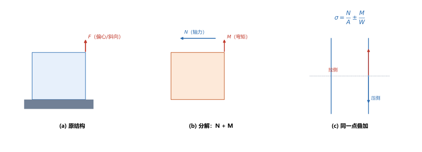
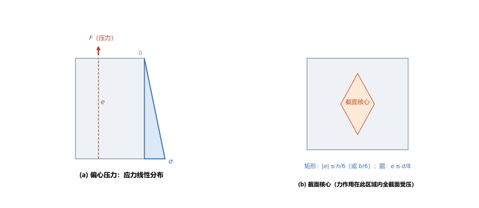
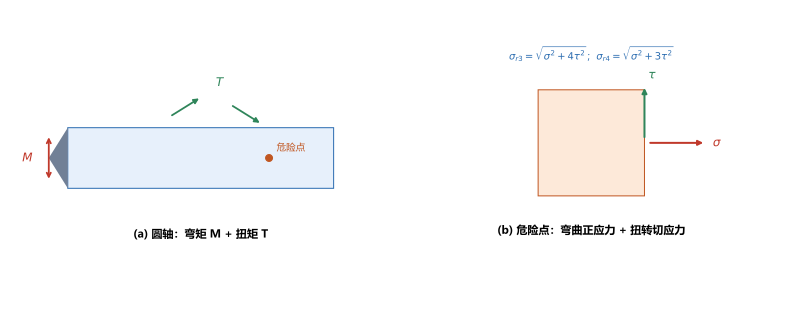

# 第 16 讲：组合变形

> **前置**：第 02–06 讲（拉压、剪切、扭转）、第 08–11 讲（弯曲的应力与变形）、第 13–15 讲（应力状态、强度理论）。
> **预计时间**：约 3 小时（含作业）。
>
> **一句话定位**：前面各讲都是"一种基本变形"（拉压、扭转、弯曲……）。真实构件常常**同时受几种**——杆件偏心受压、传动轴同时受弯与扭。本讲给出通用做法：**分解 → 分别算 → 在同一点叠加 → 找危险点 → 用强度理论合成**。它把第 08–15 讲的工具串成一条完整的解题流水线。
>
> **本讲回答什么**：
> 1. 组合变形要不要重新推公式？为什么可以"分解 + 叠加"？
> 2. 拉（压）弯组合、偏心拉压的应力怎么算？"截面核心"是什么？
> 3. 弯扭组合的圆轴，危险点怎么定、怎么用强度理论校核？
>
> **这一讲有真实验证**：拉弯组合的正负缘应力、偏心压力下应力零线正好落在核心边界（矩形 $h/6$、圆 $d/8$）、弯扭组合 $\sigma_{r3}=\sqrt{\sigma^2+4\tau^2}$ 与 $\sigma_{r4}=\sqrt{\sigma^2+3\tau^2}$（脚本 `scripts/lec16-01_verify_combined_loading.py`）；另有分解与叠加、偏心拉压与截面核心、弯扭组合三张图（`figures/`）。

---

## 引子：一根偏心受压的柱子

一根矩形截面的短柱，压力 $F$ 不作用在形心上，而是偏心一点。这时柱子里同时出现两种效应：**轴向压缩**（$F$ 的轴向分量）和**弯曲**（$F$ 对形心的力矩）。

这种"两种以上基本变形同时出现"的情形就是**组合变形**。好消息是：**不需要发明新公式**——只要把外力**分解**成几种基本载荷，分别用前面学过的公式算应力，再在**同一个点**上**叠加**。本讲就是把这件事的规则、流程和几个典型场景讲清。

---

## 1. 组合变形怎么处理：分解与叠加

### 1.1 通用流程

1. **外力分解**：把载荷分解成产生**基本变形**的几组（轴力、扭矩、弯矩、剪力）；
2. **分别计算**：对每一种基本变形，用前面的公式算出**同一截面、同一点**的应力；
3. **同点叠加**：把该点的各应力**按方向代数和**相加（同方向叠加，不同方向按应力状态处理）；
4. **找危险点**：应力最大的点；
5. **强度合成**：用强度理论（第 15 讲）算相当应力并校核。

> **图 1 怎么读**：(a) 原结构（偏心载荷 $F$）；(b) 分解为轴力 $N$ 与弯矩 $M$；(c) 在同一点上叠加 $\sigma=\dfrac{N}{A}\pm\dfrac{M}{W}$。

### 1.2 为什么能叠加（适用条件）

叠加的依据是**小变形、线弹性**——与第 08 讲的叠加原理、第 11 讲的挠度叠加同源：

- **小变形**：各基本变形引起的变形互不显著耦合（变形前后几何关系近似不变）；
- **线弹性**：应力与载荷成正比。

> **不满足时不能叠加**：大变形、塑性、或几种变形强耦合（如纵横弯曲）的情形，超出本课范围（PLAN 的"不写"清单已登记）。

---

## 2. 拉伸（压缩）与弯曲的组合

**典型构件**：偏心受压柱、承受横向载荷的拉杆。

在横截面上，轴力 $N$ 与弯矩 $M$ 产生的正应力**方向相同（都沿杆轴）**，所以直接代数和：

$$\boxed{\sigma = \frac{N}{A} \pm \frac{M}{W}},$$

其中 $A$ 为截面积、$W$ 为抗弯截面系数（第 09 讲）；"$\pm$"对应截面上**两侧边缘**（一侧两应力叠加、另一侧相减）。

- **危险点**在**弯矩使应力叠加的那一侧边缘**；
- 若两应力**异号**且合成后出现**拉应力**，要注意材料的抗拉能力（脆性材料尤其）。

（脚本 EXP1）矩形柱 $b=100\ \mathrm{mm}$、$h=150\ \mathrm{mm}$，$N=100\ \mathrm{kN}$（拉）、$M=10\ \mathrm{kN\cdot m}$：

$$A=15000\ \mathrm{mm^2},\quad W=\frac{bh^2}{6}=\frac{100\times150^2}{6}=3.75\times10^5\ \mathrm{mm^3},$$

$$\sigma_N=\frac{100\times10^3}{15000}=6.667\ \mathrm{MPa},\qquad \sigma_M=\frac{10\times10^6}{3.75\times10^5}=26.667\ \mathrm{MPa},$$

$$\sigma_{\max}=6.667+26.667=33.33\ \mathrm{MPa}\ (\text{拉侧}),\qquad \sigma_{\min}=6.667-26.667=-20.00\ \mathrm{MPa}\ (\text{压侧}).$$

---

## 3. 偏心拉压与截面核心

### 3.1 偏心拉压的应力

压力 $F$ 偏离形心 $e$（偏心距），则等效于"**轴力 $F$ + 弯矩 $M=Fe$**"，代入 §2 的公式：

$$\boxed{\sigma = -\frac{F}{A} \pm \frac{Fe}{W}}$$

（压力取负）。

（脚本 EXP2）矩形 $b=200$、$h=300$，$F=200\ \mathrm{kN}$（压），偏心距 $e=50\ \mathrm{mm}$：

$$A=60000\ \mathrm{mm^2},\quad W=3.0\times10^6\ \mathrm{mm^3},$$

$$\sigma=-\frac{200\times10^3}{60000}\pm\frac{200\times10^3\times50}{3.0\times10^6}=-3.333\pm3.333.$$

得到 $\sigma$ 分别为 $-6.667$ 与 $0.000\ \mathrm{MPa}$——**一边压、另一边恰好为零**（应力零线正好落在截面边缘）。

### 3.2 截面核心

上例中 $e=50\ \mathrm{mm}$ 恰好使截面上**不再出现拉应力**。这正是**截面核心**的边界。

- **截面核心**：截面上的一个区域，**只要偏心力的作用点落在该区域内，全截面就不会出现拉应力**（只有压应力）；
- 对**矩形**截面：$|e| \le \dfrac{h}{6}$（沿 $h$ 方向）或 $\dfrac{b}{6}$（沿 $b$ 方向）；
- 对**圆形**截面：$e \le \dfrac{d}{8}$。

> **图 2 怎么读**：(a) 偏心压力下截面应力呈**线性分布**（偏心越大，零线越靠近截面内部）；当 $e=h/6$ 时零线正好落在边缘——这就是核心边界；(b) **截面核心**：力作用在这个区域内，全截面受压。

（脚本 EXP3）圆截面 $d=200\ \mathrm{mm}$：核心半径 $e_{\max}=\dfrac{d}{8}=25\ \mathrm{mm}$——代入验证，此时边缘应力恰为零（$=0.0000\ \mathrm{MPa}$），与理论边界吻合。

> **为什么关心截面核心**：脆性材料（砖、石、混凝土）**抗压不抗拉**。让偏心力落在截面核心内，就能保证柱子里**不出现拉应力**，避免被拉裂。这就是砌体柱、桥墩设计的隐含约束。

### 3.3 斜弯曲（认识层）

若横向载荷**不通过截面形心主轴**，梁会在**两个方向同时弯曲**——叫**斜弯曲**。做法同上：把载荷分解到两个主轴方向，分别按第 09 讲算应力，再在危险点叠加 $\sigma=\dfrac{M_z y}{I_z}+\dfrac{M_y z}{I_y}$。

> **只需知道**：斜弯曲 = 两个平面弯曲的叠加，**中线不再在加载平面内**（"斜"由此得名）。本课不深入。

---

## 4. 弯曲与扭转的组合

**典型构件**：传动轴（同时受弯矩 $M$ 与扭矩 $T$）。

### 4.1 危险点与应力

对圆轴，危险点在**弯矩最大截面的表面**（那里弯曲正应力最大、扭转切应力也最大）：

$$\sigma = \frac{M}{W}\ (\text{弯曲正应力}),\qquad \tau = \frac{T}{W_p}\ (\text{扭转切应力}),$$

其中 $W=\dfrac{\pi d^3}{32}$、$W_p=\dfrac{\pi d^3}{16}=2W$。

危险点的应力状态是：**正应力 $\sigma$ 与切应力 $\tau$ 同时存在**——这正是第 13 讲的平面应力状态！

### 4.2 用强度理论合成

先求危险点的主应力（第 13 讲）：$\sigma_{1,3}=\dfrac{\sigma}{2}\pm\sqrt{\left(\dfrac{\sigma}{2}\right)^2+\tau^2}$、$\sigma_2=0$，再代入第三、第四理论（第 15 讲），得到工程上直接可用的**弯扭组合公式**：

$$\boxed{\sigma_{r3}=\sqrt{\sigma^2+4\tau^2}},\qquad \boxed{\sigma_{r4}=\sqrt{\sigma^2+3\tau^2}}.$$

（对圆轴，这是把"求主应力 + 套强度理论"两步合并后的结果，考试里直接用。）

> **图 3 怎么读**：(a) 圆轴同时受弯矩 $M$ 与扭矩 $T$，危险点在表面；(b) 危险点的单元体上，$\sigma$（弯曲）与 $\tau$（扭转）同时作用，用 $\sigma_r=\sqrt{\sigma^2+4\tau^2}$ 或 $\sqrt{\sigma^2+3\tau^2}$ 合成。

（脚本 EXP4）圆轴 $d=60\ \mathrm{mm}$，$M=1.5\ \mathrm{kN\cdot m}$、$T=1.2\ \mathrm{kN\cdot m}$：

$$W=21205.8\ \mathrm{mm^3},\quad W_p=42411.5\ \mathrm{mm^3},$$

$$\sigma=\frac{1.5\times10^6}{21205.8}=70.74\ \mathrm{MPa},\qquad \tau=\frac{1.2\times10^6}{42411.5}=28.29\ \mathrm{MPa},$$

$$\sigma_{r3}=\sqrt{70.74^2+4\times28.29^2}=90.59\ \mathrm{MPa},\qquad \sigma_{r4}=\sqrt{70.74^2+3\times28.29^2}=86.05\ \mathrm{MPa}.$$

> **注意 $W_p=2W$**：圆轴的抗扭截面系数**恰是抗弯截面系数的两倍**——所以同样大小的 $T$ 与 $M$ 引起的 $\tau$ 只有 $\sigma$ 的一半。这个 2 倍关系是圆轴弯扭组合题的常用捷径。

---

## 5. 危险点的定位

组合变形题的成败在"**危险点找对**"。通用判断：

1. **先定危险截面**：各内力分量（$N$、$M$、$T$）最大（或组合最不利）的截面；
2. **再定危险点**：在该截面上，
   - 拉（压）弯组合：**正应力叠加的那侧边缘**；
   - 弯扭组合：**弯矩最大方向对应的表面点**（弯曲正应力最大处的表面）；
   - 双向弯曲（斜弯曲）：截面**角点**（两个方向都取极值）；
3. **核对应力状态**：确定危险点处的 $(\sigma,\tau)$，再用相应强度理论合成。

> **常见错误**：把"截面形心"或"中性轴上的点"当危险点——中性轴上正应力为零，但**切应力最大**；所以要**分别检查几个候选点**，取相当应力最大的那个。

---

## 6. 本讲的心智模型

把这一讲压缩成一条主线：

> **组合变形题 = 分解载荷（N/M/T）→ 分别算同一截面同一点的应力 → 同向代数和、异向组成应力状态 → 定危险点 → 强度理论合成 $\sigma_r\le[\sigma]$。**

遇到一道题，按这个顺序走：

1. **分解**：外力 → 轴力 / 弯矩 / 扭矩；
2. **算内力**：各基本变形的内力（第 02、05、08 讲）；
3. **算应力**：$\dfrac{N}{A}$、$\dfrac{M}{W}$、$\dfrac{T}{W_p}$；
4. **定危险点**：叠加后应力最大处（或角点/表面）；
5. **合成校核**：拉弯用 $\sigma=\dfrac{N}{A}\pm\dfrac{M}{W}$；弯扭用 $\sqrt{\sigma^2+4\tau^2}$（第三）或 $\sqrt{\sigma^2+3\tau^2}$（第四）。

---

## 7. 小结

- **组合变形的通用流程**：分解 → 分别算 → **同点叠加** → 找危险点 → 强度理论合成；依据是小变形 + 线弹性。
- **拉（压）弯组合**：$\sigma=\dfrac{N}{A}\pm\dfrac{M}{W}$；危险点在应力叠加侧边缘。
- **偏心拉压**：$\sigma=-\dfrac{F}{A}\pm\dfrac{Fe}{W}$；**截面核心**内作用时全截面无拉应力；矩形 $|e|\le h/6$（或 $b/6$）、圆 $e\le d/8$。
- **斜弯曲**（认识层）：载荷不过主轴 → 两个平面弯曲叠加。
- **弯扭组合**（圆轴）：$\sigma=\dfrac{M}{W}$、$\tau=\dfrac{T}{W_p}$（$W_p=2W$）；$\sigma_{r3}=\sqrt{\sigma^2+4\tau^2}$、$\sigma_{r4}=\sqrt{\sigma^2+3\tau^2}$。
- **危险点定位**：先定危险截面、再定危险点（叠加侧边缘 / 表面 / 角点），注意中性轴上正应力为零但切应力最大。

---

## 8. 作业

### 基础

**Q1. 拉弯组合**：矩形杆 $b=120\ \mathrm{mm}$、$h=200\ \mathrm{mm}$，$N=150\ \mathrm{kN}$（拉）、$M=12\ \mathrm{kN\cdot m}$。求两侧边缘的正应力。

**参考答案**：

$A=120\times200=24000\ \mathrm{mm^2}$；$W=\dfrac{120\times200^2}{6}=8.0\times10^5\ \mathrm{mm^3}$；
$\sigma_N=\dfrac{150\times10^3}{24000}=6.25\ \mathrm{MPa}$；$\sigma_M=\dfrac{12\times10^6}{8.0\times10^5}=15.0\ \mathrm{MPa}$；
$\sigma_{\max}=6.25+15.0=21.25\ \mathrm{MPa}$（拉侧）；$\sigma_{\min}=6.25-15.0=-8.75\ \mathrm{MPa}$（压侧）。
验算：两侧之和 $21.25+(-8.75)=12.5=2\sigma_N$ ✓（叠加公式的结构）。

**Q2. 偏心压力**：矩形柱 $b=150\ \mathrm{mm}$、$h=250\ \mathrm{mm}$，压力 $F=250\ \mathrm{kN}$，偏心距 $e=30\ \mathrm{mm}$（沿 $h$ 方向）。求两侧边缘应力，并判断是否全截面受压。

**参考答案**：

$A=37500\ \mathrm{mm^2}$；$W=\dfrac{150\times250^2}{6}=1.5625\times10^6\ \mathrm{mm^3}$；
$\sigma=-\dfrac{250\times10^3}{37500}\pm\dfrac{250\times10^3\times30}{1.5625\times10^6}=-6.667\pm4.800$；
得 $\sigma=-1.867\ \mathrm{MPa}$（近侧）与 $-11.467\ \mathrm{MPa}$（远侧）——**两者均为负，全截面受压**。
验算：$h/6=250/6=41.67>e=30$，偏心力在核心内 → 必全截面受压 ✓。

**Q3. 截面核心**：矩形截面 $b=200\ \mathrm{mm}$、$h=300\ \mathrm{mm}$。写出截面核心的范围。

**参考答案**：

沿 $h$ 方向：$|e_h|\le\dfrac{h}{6}=\dfrac{300}{6}=50\ \mathrm{mm}$；沿 $b$ 方向：$|e_b|\le\dfrac{b}{6}=\dfrac{200}{6}=33.3\ \mathrm{mm}$。核心是以形心为中心、半轴 $50\times33.3$ 的菱形。
验算：与 §3.1 的算例吻合——那里 $e=50\ \mathrm{mm}$ 正好使边缘应力为零（核心边界）。

### 提高

**Q4. 弯扭组合**：圆轴 $d=50\ \mathrm{mm}$，$M=1.2\ \mathrm{kN\cdot m}$、$T=0.9\ \mathrm{kN\cdot m}$。求 $\sigma$、$\tau$、$\sigma_{r3}$、$\sigma_{r4}$。

**参考答案**：

$W=\dfrac{\pi\times50^3}{32}=12271.8\ \mathrm{mm^3}$；$W_p=2W=24543.7\ \mathrm{mm^3}$；
$\sigma=\dfrac{1.2\times10^6}{12271.8}=97.79\ \mathrm{MPa}$；$\tau=\dfrac{0.9\times10^6}{24543.7}=36.67\ \mathrm{MPa}$；
$\sigma_{r3}=\sqrt{97.79^2+4\times36.67^2}=\sqrt{14941.7}=122.2\ \mathrm{MPa}$；
$\sigma_{r4}=\sqrt{97.79^2+3\times36.67^2}=\sqrt{13597.0}=116.6\ \mathrm{MPa}$。
验算：$\sigma_{r4}<\sigma_{r3}$ ✓（第 15 讲：第三理论更保守）。

**Q5. 概念**：什么是截面核心？它为什么对脆性材料特别重要？

**参考答案**：

**截面核心**是截面上的一个区域，偏心力作用点落在其中时，**全截面不出现拉应力**（应力零线不进入截面）。矩形核心边界 $|e|\le h/6$（或 $b/6$），圆 $e\le d/8$。
**对脆性材料重要**：砖、石、混凝土等**抗压不抗拉**，一旦出现拉应力就可能被拉裂。把偏心力限制在核心内，就保证柱子只受压、不出现拉应力。
验算（自检方向）：这是"偏心距 → 弯矩 → 一侧拉一侧压"的直接推论；核心就是"零线刚好不出截面"对应的偏心距范围。

**Q6. 概念**：为什么组合变形可以直接把各基本变形的应力相加？什么情况下不行？

**参考答案**：

**可以相加的条件**：**小变形 + 线弹性**。小变形保证各基本变形的几何关系互不耦合（变形前后近似不变），线弹性保证应力与载荷成正比——于是各载荷的效应可以独立分析再线性叠加。
**不行的情况**：大变形（几何非线性）、材料进入塑性（物理非线性）、以及几种变形强耦合的情形（如压弯耦合的纵横弯曲）。
验算（自检方向）：第 08 讲的叠加原理、第 11 讲的挠度叠加、第 12 讲的变形比较法都用了同一前提——本讲是它的第三次应用。

### 综合

**Q7. 完整校核**：矩形截面悬臂柱 $b=100\ \mathrm{mm}$、$h=150\ \mathrm{mm}$，顶部受**偏心压力** $F=120\ \mathrm{kN}$，偏心距 $e=25\ \mathrm{mm}$（沿 $h$ 方向），$[\sigma]=30\ \mathrm{MPa}$（材料抗压较强，按最大压应力校核）。校核强度。

**参考答案**：

$A=15000\ \mathrm{mm^2}$；$W=\dfrac{100\times150^2}{6}=3.75\times10^5\ \mathrm{mm^3}$；
$\sigma=-\dfrac{120\times10^3}{15000}\pm\dfrac{120\times10^3\times25}{3.75\times10^5}=-8.0\pm8.0$；
得 $\sigma=-16.0\ \mathrm{MPa}$（远侧）与 $\sigma=0.0\ \mathrm{MPa}$（近侧）。
最大压应力 $|\sigma|=16.0\ \mathrm{MPa}\le30\ \mathrm{MPa}$，安全。
验算：$e=25<h/6=25$？——$h/6=150/6=25$，**正好在核心边界**，所以近侧应力恰为 0，与 §3.2 的结论一致。

**Q8. 开放简答**：请概述"危险点定位"的一般方法，并说明为什么不能只盯一个点。

**参考答案**：

**一般方法**：
① **定危险截面**——比较各内力分量（$N$、$M$、$T$）沿构件的分布，选最不利截面（可能是合成后最不利，而不一定是单个内力最大的截面）；
② **在危险截面上列候选点**——叠加侧边缘（拉弯）、表面（弯扭）、角点（斜弯曲）；
③ **对每个候选点求应力状态 $(\sigma,\tau)$**，用相应强度理论算相当应力 $\sigma_r$；
④ **取 $\sigma_r$ 最大者为真正的危险点**。
**为什么不能只盯一个点**：
- **中性轴上的点**正应力为零，但**切应力最大**（第 10 讲）——对剪切敏感的材料可能在此危险；
- **截面上不同位置的 $\sigma$ 与 $\tau$ 组合不同**，一个位置的 $\sigma$ 最大、另一个位置的 $\sigma_r$ 最大（弯扭组合时两者通常在表面同一点，但双向弯曲时角点最优）；
- 忽略候选点可能**漏掉真正的控制点**，导致校核偏于不安全。
验算（自检方向）：本讲图 3 的危险点在表面（$\sigma$ 与 $\tau$ 同时最大），而图 2 的危险点在受压最大的边缘——两题的"最危险处"并不相同，正说明必须**逐点核对**。

---

*下一讲预告——第 17 讲《压杆稳定》：到此，强度（会不会坏）与刚度（变形大不大）都讲完了。但细长杆受压时，会在**应力远低于强度极限**的情况下突然弯折失稳——这是另一种完全不同的失效方式。第 17 讲给出欧拉临界力 $P_{cr}=\dfrac{\pi^2EI}{(\mu L)^2}$、柔度 $\lambda$ 判别与压杆稳定校核。*