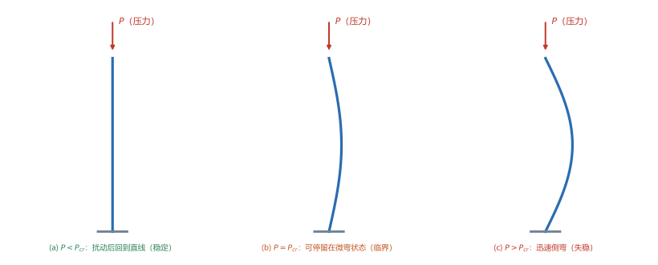
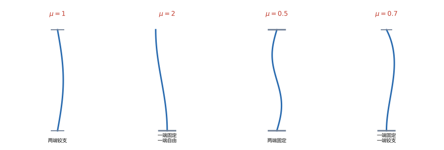
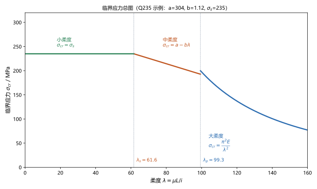

# 第 17 讲：压杆稳定

> **前置**：第 03 讲（压杆强度 $\sigma=\dfrac{N}{A}\le[\sigma]$）、第 07 讲（惯性半径 $i=\sqrt{I/A}$）、第 09–11 讲（弯曲应力与挠曲线）。
> **预计时间**：约 3.5 小时（含作业）。
>
> **一句话定位**：到第 16 讲，"会不会坏（强度）"和"变形大不大（刚度）"都讲完了。但**细长杆受压**还有第三种失效方式：应力还远低于强度极限，杆却**突然侧向弯折**——这叫**失稳**。本讲给出欧拉临界力 $P_{cr}=\dfrac{\pi^2EI}{(\mu L)^2}$、长度系数 $\mu$、柔度 $\lambda$ 的分类判别，以及压杆稳定校核。
>
> **本讲回答什么**：
> 1. 为什么杆"没压坏"却会突然弯掉？临界力是什么？
> 2. 欧拉公式里的长度系数 $\mu$ 怎么取？柔度 $\lambda$ 是什么、为什么要分类？
> 3. 压杆稳定怎么校核？怎样提高稳定性？
>
> **这一讲有真实验证**：柔度与欧拉临界力、四种约束下长度系数对 $P_{cr}$ 的影响（与 $\mu^2$ 成反比）、柔度分界 $\lambda_p$ 与 $\lambda_s$、中柔度直线公式、稳定校核（脚本 `scripts/lec17-01_verify_column_stability.py`）；另有平衡状态、长度系数、临界应力总图三张图（`figures/`）。

---

## 引子：一根"压不坏"的杆突然弯了

一根细长的直杆，轴向压力慢慢加大。按第 03 讲，只要 $\dfrac{P}{A}\le[\sigma]$ 就安全——**可它常常在应力还很低的时候就突然侧向弯折**，然后彻底失去承载能力。

这不是强度问题，是**稳定性**问题。下面把"稳定"这件事讲清。

---

## 1. 稳定平衡、临界状态与失稳

### 1.1 三种状态的物理图像

给压杆一个**微小的侧向扰动**，看它怎么反应：

- **稳定平衡**（$P<P_{cr}$）：扰动撤去后，杆**回到原来的直线**；
- **临界状态**（$P=P_{cr}$）：杆可以**停留在微弯状态**（随遇平衡），这是稳定与不稳定的分界；
- **不稳定平衡**（$P>P_{cr}$）：杆**迅速向侧向弯折**（往往伴随破坏）——即**失稳**。

> **图 1 怎么读**：(a) 压力小于临界力，扰动后回到直线；(b) 恰好等于临界力，杆可停在微弯状态；(c) 超过临界力，杆迅速侧弯。

### 1.2 关键量：临界力

使压杆从稳定转为不稳定的那个压力，叫**临界力** $P_{cr}$。它是压杆**稳定性的承载力上限**——工程上要让工作压力**远低于**它。

> **与强度条件的分工**：强度条件管"压不坏"（短粗杆的主控），稳定条件管"不弯折"（细长杆的主控）。**同一根杆，哪个条件更严要看它"细不细"**——这就是下面"柔度分类"要解决的事。

---

## 2. 欧拉临界力与长度系数

### 2.1 欧拉公式

**欧拉（Euler）**用第 11 讲的挠曲线近似微分方程，对两端铰支的细长压杆推出了临界力：

$$\boxed{P_{cr} = \frac{\pi^2 EI_{\min}}{(\mu L)^2}},$$

其中：

- $E$：材料弹性模量；
- $I_{\min}$：截面**最小**惯性矩（杆会在最"软"的方向弯——所以取最小）；
- $L$：杆长；$\mu$：**长度系数**（下节讲）。

> **推导思路（认识层）**：设杆已微弯，写出挠曲线方程 $EIw''=-Pw$，解出正弦形式的挠曲线，并用力学边界条件定出"只有当 $P$ 取特定值方程才有非零解"——最小的那个值就是 $P_{cr}$。这正是"临界"的数学来源。

（脚本 EXP1）圆截面 $d=30\ \mathrm{mm}$、$L=800\ \mathrm{mm}$、两端铰支（$\mu=1$）、$E=200\ \mathrm{GPa}$：

$$I=\frac{\pi d^4}{64}=39760.8\ \mathrm{mm^4},\quad A=706.9\ \mathrm{mm^2},\quad i=\sqrt{\frac{I}{A}}=7.50\ \mathrm{mm},$$

$$P_{cr}=\frac{\pi^2EI}{L^2}=\frac{9.8696\times2\times10^5\times39760.8}{800^2}=122.63\ \mathrm{kN}.$$

### 2.2 长度系数 $\mu$

不同**支座约束**下，杆的弯曲形状不同，等效成"多大长度的两端铰支杆"也不同——这个换算就用 $\mu$：

| 约束形式 | 长度系数 $\mu$ | 说明 |
|---|---|---|
| 两端铰支 | $1$ | 基准情形 |
| 一端固定、一端自由 | $2$ | 最不利（等效长度翻倍） |
| 两端固定 | $0.5$ | 最有利（等效长度减半） |
| 一端固定、一端铰支 | $0.7$ | 居中 |

> **图 2 怎么读**：四种典型约束的失稳形状与对应的 $\mu$。注意**一端固定一端自由**（悬臂式压杆）的 $\mu=2$——最容易被压弯。

（脚本 EXP2）同一根杆，只改约束：

| $\mu$ | $1$ | $2$ | $0.5$ | $0.7$ |
|---|---|---|---|---|
| $P_{cr}$ / kN | $122.63$ | $30.66$ | $490.53$ | $250.27$ |

**$P_{cr}\propto\dfrac{1}{\mu^2}$**——约束从"两端铰支"改成"两端固定"，$P_{cr}$ 增大到 **4 倍**。

---

## 3. 柔度与临界应力

### 3.1 柔度

把欧拉公式两边除以面积 $A$，并用惯性半径 $i=\sqrt{I/A}$（第 07 讲），得**临界应力**：

$$\sigma_{cr}=\frac{P_{cr}}{A}=\frac{\pi^2 E i^2}{(\mu L)^2}=\frac{\pi^2 E}{\lambda^2},$$

其中定义**柔度**（长细比）：

$$\boxed{\lambda = \frac{\mu L}{i}}$$

- $\lambda$ **越大**，杆**越细长、越容易失稳**（$\sigma_{cr}$ 越小）；
- $\lambda$ 是压杆稳定问题的**唯一无量纲参数**——稳定性只取决于它。

（脚本 EXP1 续）$\lambda=\dfrac{800}{7.5}=106.67$，故 $\sigma_{cr}=\dfrac{\pi^2\times2\times10^5}{106.67^2}=173.5\ \mathrm{MPa}$（与 $P_{cr}/A$ 一致 ✓）。

> **注意**：$i$ 与 $I$ 都要取**最小值**（最弱方向），这样 $\lambda$ 最大、$\sigma_{cr}$ 最小——**按最危险方向判**。

### 3.2 欧拉公式的适用条件

欧拉的推导用了**线弹性**（胡克定律）。所以只有当 $\sigma_{cr}$ **不超过材料的比例极限** $\sigma_p$ 时，欧拉公式才成立：

$$\sigma_{cr}\le\sigma_p \quad\Longrightarrow\quad \lambda\ge\lambda_p=\pi\sqrt{\frac{E}{\sigma_p}}.$$

$\lambda\ge\lambda_p$ 的杆叫**大柔度杆**（细长杆）——只有它们能用欧拉公式。

（脚本 EXP3）Q235 钢：$E=200\ \mathrm{GPa}$、$\sigma_p=200\ \mathrm{MPa}$ → $\lambda_p=\pi\sqrt{\dfrac{2\times10^5}{200}}=99.35$。

---

## 4. 柔度分类与临界应力总图

不同柔度的杆，失稳/破坏的机制不同，公式也不同：

| 类型 | 柔度范围 | 临界应力 | 失效机制 |
|---|---|---|---|
| **大柔度杆**（细长） | $\lambda\ge\lambda_p$ | 欧拉公式 $\sigma_{cr}=\dfrac{\pi^2E}{\lambda^2}$ | **弹性失稳** |
| **中柔度杆**（中等） | $\lambda_s\le\lambda<\lambda_p$ | **经验直线公式** $\sigma_{cr}=a-b\lambda$ | 弹塑性失稳 |
| **小柔度杆**（短粗） | $\lambda<\lambda_s$ | $\sigma_{cr}=\sigma_s$（屈服） | **强度破坏** |

其中 $\lambda_s$ 是"中/小柔度"的分界，由直线公式与屈服极限衔接：$\lambda_s=\dfrac{a-\sigma_s}{b}$。

> **图 3 怎么读**：横轴柔度 $\lambda$、纵轴临界应力 $\sigma_{cr}$。**右侧**（大柔度）是欧拉双曲线；**中间**（中柔度）是下降直线；**左侧**（小柔度）是水平线 $\sigma_s$。整条曲线叫**临界应力总图**——它把所有柔度下的临界应力统一到一张图上。

（脚本 EXP3、EXP4）Q235：$a=304\ \mathrm{MPa}$、$b=1.12\ \mathrm{MPa}$、$\sigma_s=235\ \mathrm{MPa}$：

$$\lambda_s=\frac{304-235}{1.12}=61.61;$$

取中柔度 $\lambda=80$：$\sigma_{cr}=304-1.12\times80=214.4\ \mathrm{MPa}$。

> **工程含义**：**短粗杆按强度算、细长杆按稳定算、中等杆按经验公式算**——三类界限由 $\lambda$ 一分为三，这就是"柔度分类"的用途。

---

## 5. 压杆稳定校核

### 5.1 稳定安全系数法

$$\boxed{n_{st} = \frac{P_{cr}}{P} \ge [n_{st}]}\qquad\text{或}\qquad \sigma = \frac{P}{A}\le[\sigma_{st}]=\frac{\sigma_{cr}}{[n_{st}]}.$$

稳定安全系数 $[n_{st}]$ 通常比强度安全系数**更大**（因为失稳是突然的、后果严重，一般 $[n_{st}]=3\sim5$）。

（脚本 EXP5）上面那根杆（$P_{cr}=122.63\ \mathrm{kN}$），工作压力 $P=100\ \mathrm{kN}$，要求 $[n_{st}]=3$：

$$n_{st}=\frac{122.63}{100}=1.226<3\quad\text{——不安全。}$$

改进：把约束改成一端固定一端铰支（$\mu=0.7$）：$P_{cr}=250.27\ \mathrm{kN}$，$n_{st}=2.50$——**仍不够**（还差一点），需要继续加大截面或进一步约束。

### 5.2 折减系数法（工程简化）

工程规范常用**折减系数 $\varphi$**（$\varphi<1$，与材料、柔度有关）：

$$\sigma=\frac{P}{A}\le \varphi\,[\sigma],$$

其中 $\varphi[\sigma]$ 相当于"按稳定折减后的许用应力"。$\varphi$ 可从规范表格按 $\lambda$ 查取。

> **两种方法的区别**：安全系数法直观（$P$ 与 $P_{cr}$ 比），折减系数法把稳定问题写成了"和强度条件一样的形状"（$\sigma\le\varphi[\sigma]$），便于与其它条件统一处理。考试里两者都常见。

---

## 6. 提高压杆稳定性的措施

由 $P_{cr}=\dfrac{\pi^2EI_{\min}}{(\mu L)^2}$，只有四个可调量：

- **减小 $\mu L$（等效长度）**：**加强约束**（自由端改铰支、加中间支承）——最有效，因为 $P_{cr}$ 与 $(\mu L)^2$ 成反比；
- **增大 $I_{\min}$**：让截面**两个方向惯性矩接近**（否则弱方向先失稳）。**空心圆管**优于实心（同面积下 $I$ 更大、$i$ 更大）；
- **选 $E$ 大的材料**：$P_{cr}\propto E$——但注意：**高强度钢的 $E$ 与普通钢几乎一样**，所以"换高强度钢"对细长杆稳定性**几乎没用**（它只对中、小柔度杆有好处）；
- **避免初弯曲、偏心与局部削弱**：实际杆总有缺陷，会**降低**临界力。

> **一句话**：**改约束 > 改截面形状 > 改材料**；细长杆的稳定性几乎只看"几何参数"（$\mu$、$L$、$I$），不看材料的强度指标。

---

## 7. 本讲的心智模型

把这一讲压缩成一条主线：

> **压杆稳定题 = 算柔度 $\lambda=\dfrac{\mu L}{i}$（取 $I_{\min}$）→ 按 $\lambda$ 分类（大/中/小柔度）→ 选对应公式求 $\sigma_{cr}$、$P_{cr}$ → 用 $n_{st}=\dfrac{P_{cr}}{P}\ge[n_{st}]$ 校核。**

遇到一道题，按这个顺序走：

1. **定 $\mu$**：看约束（$1/2/0.5/0.7$）；
2. **算 $i$**（取最小惯性矩方向）、**算 $\lambda$**；
3. **分类**：$\lambda\ge\lambda_p$ 用欧拉；$\lambda_s\le\lambda<\lambda_p$ 用直线公式；$\lambda<\lambda_s$ 按强度；
4. **求 $P_{cr}$ 或 $\sigma_{cr}$**；
5. **校核**：$n_{st}\ge[n_{st}]$（或 $\sigma\le\varphi[\sigma]$）。

---

## 8. 小结

- **稳定/临界/不稳定平衡**：$P<P_{cr}$ 稳定；$P=P_{cr}$ 临界；$P>P_{cr}$ **失稳**（突然侧弯）。
- **欧拉临界力** $P_{cr}=\dfrac{\pi^2EI_{\min}}{(\mu L)^2}$；**长度系数** $\mu$：两端铰支 $1$、一端固定一端自由 $2$、两端固定 $0.5$、一端固定一端铰支 $0.7$；$P_{cr}\propto\dfrac{1}{\mu^2}$。
- **柔度** $\lambda=\dfrac{\mu L}{i}$（取最弱方向）；**临界应力** $\sigma_{cr}=\dfrac{\pi^2E}{\lambda^2}$。
- **适用条件与分类**：$\lambda\ge\lambda_p=\pi\sqrt{E/\sigma_p}$ 大柔度（欧拉）；$\lambda_s\le\lambda<\lambda_p$ 中柔度（直线公式 $a-b\lambda$）；$\lambda<\lambda_s$ 小柔度（按强度）。
- **临界应力总图**：双曲线 + 直线 + 水平线的三段拼图。
- **校核**：$n_{st}=\dfrac{P_{cr}}{P}\ge[n_{st}]$（$[n_{st}]=3\sim5$）或折减系数法 $\sigma\le\varphi[\sigma]$。
- **提高稳定性**：改约束（减 $\mu L$）最有效 → 改截面（增大 $I_{\min}$、空心）→ 换材料（对细长杆几乎无效，因 $E$ 相同）。

---

## 9. 作业

### 基础

**Q1. 欧拉临界力**：圆截面压杆 $d=20\ \mathrm{mm}$、$L=600\ \mathrm{mm}$、两端铰支（$\mu=1$）、$E=200\ \mathrm{GPa}$。求柔度、临界力与临界应力（并判断欧拉公式是否适用）。

**参考答案**：

$I=\dfrac{\pi\times20^4}{64}=7854.0\ \mathrm{mm^4}$；$A=314.16\ \mathrm{mm^2}$；$i=\dfrac{d}{4}=5.0\ \mathrm{mm}$；
$\lambda=\dfrac{600}{5.0}=120>\lambda_p=99.35$ → **大柔度，欧拉适用**；
$P_{cr}=\dfrac{\pi^2\times2\times10^5\times7854.0}{600^2}=43.07\ \mathrm{kN}$；
$\sigma_{cr}=\dfrac{43.07\times10^3}{314.16}=137.1\ \mathrm{MPa}$（也等于 $\dfrac{\pi^2E}{\lambda^2}=\dfrac{9.8696\times2\times10^5}{14400}=137.1$ ✓）。
验算：两路一致，且 $\sigma_{cr}=137.1<200=\sigma_p$，与"大柔度"判断自洽。

**Q2. 长度系数的影响**：Q1 的杆改为一端固定、一端自由（$\mu=2$）。求 $P_{cr}$。

**参考答案**：

$\lambda=2\times120=240$；$P_{cr}=\dfrac{43.07}{2^2}=10.77\ \mathrm{kN}$（降为原来的 $1/4$）。
验算：$P_{cr}\propto1/\mu^2$，$\mu$ 由 1 变 2 → 除以 4 ✓。

**Q3. 柔度判别**：Q235 压杆（$a=304$、$b=1.12\ \mathrm{MPa}$、$\sigma_s=235$、$\sigma_p=200\ \mathrm{MPa}$）$\lambda=80$。判断类型并求 $\sigma_{cr}$。

**参考答案**：

$\lambda_s=\dfrac{304-235}{1.12}=61.61$、$\lambda_p=99.35$；$61.61\le80<99.35$ → **中柔度杆**；
$\sigma_{cr}=a-b\lambda=304-1.12\times80=214.4\ \mathrm{MPa}$。
验算：$\sigma_{cr}=214.4$ 介于 $\sigma_s=235$ 与 $\sigma_p=200$ 之间——中柔度的特征 ✓。

### 提高

**Q4. 稳定校核与改进**：Q1 的杆（$P_{cr}=43.07\ \mathrm{kN}$，两端铰支），工作压力 $P=30\ \mathrm{kN}$，要求 $[n_{st}]=3$。（1）校核；（2）若不合格，改约束为两端固定（$\mu=0.5$）能否通过？

**参考答案**：

(1) $n_{st}=\dfrac{43.07}{30}=1.436<3$，**不合格**。
(2) $\mu=0.5$：$P_{cr}=\dfrac{43.07}{0.25}=172.3\ \mathrm{kN}$，$n_{st}=\dfrac{172.3}{30}=5.74\ge3$，**通过**。
验算：改约束使 $P_{cr}$ 增大到 4 倍，与 $\mu^2$ 关系一致。

**Q5. 概念**：为什么细长压杆会在应力远低于强度极限时失稳？为什么"换高强度钢"帮不上忙？

**参考答案**：

**失稳的本质**：轴向压力使杆处于"平衡状态"，但这个平衡在 $P>P_{cr}$ 时**不稳定**——任何微小扰动都会被放大成侧弯。$P_{cr}$ 由**几何与弹性**决定（$E$、$I$、$L$、$\mu$），与**材料强度**（$\sigma_s$、$\sigma_b$）完全无关。
**为什么高强度钢没用**：各种钢材的**弹性模量 $E$ 几乎相同**（约 200 GPa）。细长杆的 $P_{cr}=\dfrac{\pi^2EI}{(\mu L)^2}$ 只含 $E$，所以换高强度钢**不提高 $P_{cr}$**（它只对中、小柔度杆的强度失效有好处）。
验算（自检方向）：强度条件 $\sigma=P/A\le[\sigma]$ 里才有 $[\sigma]$；稳定条件里没有——两者"管的量"不同。

**Q6. 概念**：为什么算柔度时要取"最小惯性矩"方向？空心圆管为什么比实心圆管更抗失稳？

**参考答案**：

**取最小 $I$**：杆在**约束最弱的方向**弯（$I$ 最小 → $\lambda$ 最大 → $P_{cr}$ 最小）。稳定性必须按**最危险方向**判，所以取 $I_{\min}$（工程上常做成"两个方向 $I$ 接近"的截面，避免弱方向先失稳）。
**空心优于实心**：同**面积**下，材料放到离形心更远处使 $I$ 更大、$i=\sqrt{I/A}$ 更大 → $\lambda$ 更小 → $\sigma_{cr}$ 更大。这与第 06、07 讲"空心轴抗扭/抗弯更省料"是同一逻辑。
验算（自检方向）：$P_{cr}\propto I$、$\lambda\propto1/i$，两者都随 $I$ 增大而改善。

### 综合

**Q7. 完整分析**：圆截面压杆 $d=30\ \mathrm{mm}$、$L=1000\ \mathrm{mm}$、一端固定一端自由（$\mu=2$）、$E=200\ \mathrm{GPa}$，Q235。（1）求柔度并判类型；（2）求 $P_{cr}$；（3）工作压力 $P=15\ \mathrm{kN}$、$[n_{st}]=3$，校核。

**参考答案**：

(1) $i=\dfrac{30}{4}=7.5\ \mathrm{mm}$；$\lambda=\dfrac{2\times1000}{7.5}=266.67\ge\lambda_p=99.35$ → **大柔度杆**。
(2) $I=\dfrac{\pi\times30^4}{64}=39760.8\ \mathrm{mm^4}$；$P_{cr}=\dfrac{\pi^2\times2\times10^5\times39760.8}{2000^2}=19.62\ \mathrm{kN}$。
(3) $n_{st}=\dfrac{19.62}{15}=1.308<3$，**不合格**。
验算：$\sigma_{cr}=\dfrac{19.62\times10^3}{706.86}=27.8\ \mathrm{MPa}$；也可由 $\dfrac{\pi^2E}{\lambda^2}=\dfrac{9.8696\times2\times10^5}{71111}=27.8$ ✓。

**Q8. 开放简答**：提高压杆稳定性的措施有哪些？哪一条最有效、为什么？

**参考答案**：

由 $P_{cr}=\dfrac{\pi^2EI_{\min}}{(\mu L)^2}$，共四条：
① **减小等效长度 $\mu L$**：加强端部约束（自由端→铰支，$\mu$ 由 2 降为 0.7；铰支→固定，$1\to0.5$），或**加中间横向支承**把长杆分段；
② **增大 $I_{\min}$**：选合理截面（空心、使两方向 $I$ 接近）；
③ **选 $E$ 大的材料**：对细长杆意义有限（钢材 $E$ 基本相同）；
④ **减小初始缺陷**：避免初弯曲、偏心加载、局部削弱。
**最有效的是 ①**：因为 $P_{cr}\propto\dfrac{1}{(\mu L)^2}$，而约束改变能让 $\mu$ 减半（$P_{cr}$ 变 4 倍）甚至把长度分段（$L$ 减半同样 4 倍）；改截面只能"提高 $I$"，量级上远不如改 $\mu L$ 来得快，而且不改变杆长。
验算（自检方向）：本讲 EXP2 中 $\mu$ 从 1 到 0.5，$P_{cr}$ 由 122.63 变 490.53 kN（4 倍）——一次约束改动即翻两番，是最省的改进。

---

*下一讲预告——第 18 讲《能量法》：到这里，强度、刚度、稳定性三条主线都通了。第 18 讲换一套工具：用**应变能**与**功的互等**来求位移——卡氏定理、单位载荷法（莫尔积分）与图形互乘法。它对"形状复杂、用积分法求挠度很麻烦"的构件特别省事，也是第 19 讲力法解超静定的直接工具。*