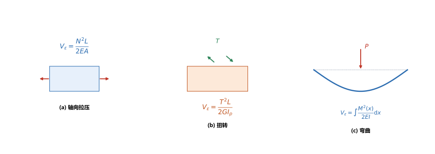
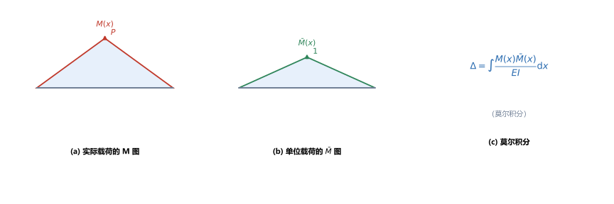
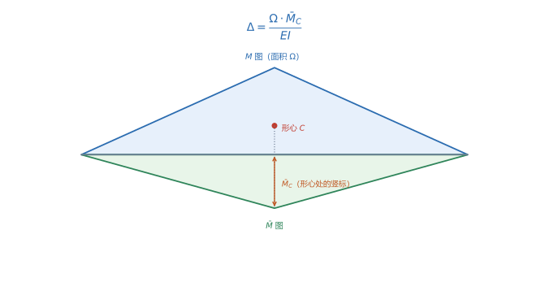

# 第 18 讲：能量法

> **前置**：第 03 讲（拉压变形）、第 05–06 讲（扭转）、第 11 讲（弯曲变形与挠曲线）、第 14 讲（应变能/比能的**认识层**挂钩）。
> **预计时间**：约 3.5 小时（含作业）。
>
> **一句话定位**：到第 17 讲，求位移用的是积分法、叠加法（第 11 讲）——对复杂结构很费事。本讲换一套工具：**能量法**。核心是**应变能**、**功的互等定理**、**单位载荷法（莫尔积分）**与它的速算形式**图形互乘法**。它不只让位移计算省力，还是第 19 讲**力法解超静定**的直接工具。
>
> **本讲回答什么**：
>
> 1. 应变能是什么？与三种基本变形的关系是什么？
> 2. 为什么"能量"能求位移？单位载荷法里的单位力加在哪里？
> 3. 图形互乘怎么乘？什么是二次抛物线特例？
>
> **这一讲有真实验证**：弯曲应变能与 $\dfrac{1}{2}Pw$ 互证、莫尔积分数值积分与查表公式一致、图形互乘与莫尔积分一致、位移互等定理 $\delta_{12}=\delta_{21}$ 数值验证（差为 0）、卡氏定理 $\dfrac{\partial V}{\partial P}$ 与查表一致、二次抛物线特例的 $\dfrac{5}{8}$ 修正系数（脚本 `scripts/lec18-01_verify_energy_methods.py`）；另有应变能、单位载荷法、图形互乘三张图（`figures/`）。

---

## 引子：第 14 讲欠下的那笔"应变能"

第 14 讲在讲完广义胡克定律后，留了一句"**应变能先记着，第 18 讲用**"。现在来还。

直觉上：把一根弹簧拉长，你做了功，能量储存在弹簧里——松手它还能弹回去。**杆件被拉伸、扭转、弯曲时也一样会储存能量**，这份能量叫**应变能**。本讲要说明：① 应变能怎么算；② 更重要的——**为什么"能量"能反过来求出位移**。

---

## 1. 外力功与应变能

### 1.1 外力功与应变能

在**线弹性**范围内，载荷从零**缓慢**加到 $F$，位移从零按比例加到 $\Delta$（载荷-位移图是一条过原点的直线），外力做的功为

$$
W = \frac{1}{2}F\Delta,
$$

这份功全部转化为**应变能** $V_\varepsilon$：

$$
\boxed{V_\varepsilon = W = \frac{1}{2}F\Delta}.
$$

> **为什么有 $\dfrac{1}{2}$**：载荷是**逐渐**加上的，全程平均载荷只有 $\dfrac{F}{2}$，所以功是"$\dfrac{1}{2}\times$最终载荷$\times$最终位移"（三角形面积）。**如果载荷是"先加到 $F$ 再加位移"，功就是 $F\Delta$**——这个区别在冲击问题（第 20 讲）里很关键。

### 1.2 三种基本变形的应变能

把 $F\Delta$ 用各基本变形的内力-变形关系展开（拉压 $\Delta=\dfrac{NL}{EA}$、扭转 $\varphi=\dfrac{TL}{GI_p}$、弯曲用挠曲线微分方程积分），得：

| 基本变形 | 内力      | 应变能                                                              |
| -------- | --------- | ------------------------------------------------------------------- |
| 轴向拉压 | 轴力$N$ | $V_\varepsilon=\dfrac{N^2L}{2EA}$                                 |
| 扭转     | 扭矩$T$ | $V_\varepsilon=\dfrac{T^2L}{2GI_p}$                               |
| 弯曲     | 弯矩$M$ | $V_\varepsilon=\displaystyle\int_L\dfrac{M^2(x)}{2EI}\mathrm{d}x$ |

> **图 1 怎么读**：(a) 拉压、(b) 扭转、(c) 弯曲的应变能公式。共同点：**都正比于"内力平方"、反比于"刚度"**——内力越大、构件越软，储存的应变能越多。

**要点**：

- 应变能是**恒正**的（内力平方）；
- 多种内力同时存在时，**可以相加**（拉压 + 扭转 + 弯曲）：$V_\varepsilon=\sum$ 各项；
- 剪切（剪力 $Q$）引起的应变能通常很小，可忽略。

（脚本 EXP1）简支梁跨中集中力 $P=20\ \mathrm{kN}$、$L=4000\ \mathrm{mm}$、$EI=1\times10^{12}\ \mathrm{N\cdot mm^2}$：

$$
V_\varepsilon=\frac{P^2L^3}{96EI}=2.6667\times10^5\ \mathrm{N\cdot mm}=266.67\ \mathrm{J}.
$$

**互证**：由 $V_\varepsilon=\dfrac{1}{2}Pw_{\max}$、$w_{\max}=\dfrac{PL^3}{48EI}=26.667\ \mathrm{mm}$，得 $\dfrac{1}{2}\times20000\times26.667=2.6667\times10^5\ \mathrm{N\cdot mm}$——**两路一致**。

### 1.3 为什么还要学能量法（相对积分法/叠加法的优势）

第 11 讲的积分法、叠加法已经能求位移，为什么还要能量法？三个理由：

1. **求"任意点、任意方向的位移"方便**：积分法要先分段写出 $M(x)$ 再积分两次定常数；单位载荷法只需**两个弯矩图相乘**；
2. **对复杂结构（曲杆、刚架、桁架、组合结构）特别省力**：不必逐段处理几何边界条件，只做**内力图的积分/互乘**；
3. **同一套工具能做两件事**：既求位移，又能**解超静定**（第 19 讲）——而积分法只能求位移。

---

## 2. 功的互等定理与位移互等定理

### 2.1 功的互等定理

同一线弹性结构上，先加第一组力再加第二组力，与**反过来**加，外力做的总功相等：

$$
F_1\delta_{12}=F_2\delta_{21}.
$$

其中 $\delta_{12}$ 是"**第 2 组力**引起的、沿**第 1 组力**方向的位移"。

### 2.2 位移互等定理

若两组力都取**单位力**（$F_1=F_2=1$），则：

$$
\boxed{\delta_{12} = \delta_{21}}.
$$

**含义**：**1 点加单位力在 2 点引起的位移 = 2 点加单位力在 1 点引起的位移**。这解释了第 12 讲、以及第 19 讲力法中"柔度系数矩阵对称"$\delta_{ij}=\delta_{ji}$ 的来源。

（脚本 EXP4）简支梁上取 1 点在 $L/3$、2 点在 $2L/3$：数值积分的 $\delta_{12}$ 与 $\delta_{21}$ 均为 $9.2181\times10^{-4}\ \mathrm{mm/N}$（**差为 0**）。

---

## 3. 单位载荷法与莫尔积分

### 3.1 原理（为什么能量能求位移）

设结构上先作用**实际载荷**，再在**所求位移的位置、沿所求位移的方向**加一个**单位力**（$1$）。由功的互等定理，可以推出：**所求位移 = 单位力所作的功**。把功写成内力形式，就得到**单位载荷法**：

$$
\boxed{\Delta = \sum\int \frac{F_N \bar{F}_N}{EA}\mathrm{d}x + \sum\int\frac{T\bar{T}}{GI_p}\mathrm{d}x + \sum\int\frac{M\bar{M}}{EI}\mathrm{d}x}
$$

其中：

- $F_N,T,M$：**实际载荷**下的内力；
- $\bar{F}_N,\bar{T},\bar{M}$：**单位力**下的内力；
- 含**求和**是因为要对**每根杆、每一段**分别积分再相加。

对**梁**（弯曲为主）：

$$
\Delta = \int_L \frac{M(x)\bar{M}(x)}{EI}\mathrm{d}x,
$$

这就是**莫尔积分**。

> **图 2 怎么读**：(a) 实际载荷下的弯矩图 $M(x)$；(b) 单位力下的弯矩图 $\bar{M}(x)$；(c) 两者相乘再除以 $EI$ 积分，即所求位移。

### 3.2 步骤（单位力加在哪）

1. **求实际内力图** $M(x)$（第 08 讲的方法）；
2. **去掉实际载荷**，在**所求位移的点**、沿**所求位移的方向**加**单位力**（求挠度加单位集中力；求转角加单位力偶）；
3. **求单位内力图** $\bar{M}(x)$；
4. **积分**（或图形互乘）：$\Delta=\displaystyle\int\dfrac{M\bar{M}}{EI}\mathrm{d}x$，**结果为正表示位移与单位力同向**。

> **最容易错的一步是第 2 步**：单位力的**位置**对着"要求位移的点"、**方向**对着"要求的位移方向"、**类型**对着"要求的位移种类"。求转角时单位力必须是**单位力偶**（不是集中力）。

（脚本 EXP2）简支梁跨中集中力，求**跨中挠度**：加单位力于跨中 → 两个弯矩图都是三角形。数值积分得

$$
w=\int_0^L\frac{M\bar{M}}{EI}\mathrm{d}x=26.6667\ \mathrm{mm},
$$

与第 11 讲查表公式 $\dfrac{PL^3}{48EI}$ 完全一致。

---

## 4. 图形互乘法

逐点积分还是累。**图形互乘法**是莫尔积分在"$EI$ 为常数"时的**速算形式**——把积分变成"两个图形的面积与竖标相乘"。

### 4.1 基本规则（直线图形）

若 $M$ 图与 $\bar{M}$ 图中**至少一个是直线图形**，则

$$
\boxed{\Delta = \frac{\Omega\cdot\bar{M}_C}{EI}},
$$

其中：

- $\Omega$ = 取**直线**图形的面积；
- $\bar{M}_C$ = 另一图形在**直线图形形心**处的竖标（都取直线图形的面积更方便）。

> **图 3 怎么读**：$M$ 图（面积 $\Omega$）取在基线**上方**，$\bar{M}$ 图取在**下方**（两者共用一条基线）。找到 $M$ 图的**形心 $C$**，量出 $\bar{M}$ 图在 $C$ 处的**竖标** $\bar{M}_C$，则 $\Delta=\dfrac{\Omega\cdot\bar{M}_C}{EI}$。

**常用图形的面积与形心**：

| 图形                              | 面积$\Omega$     | 形心位置                                         |
| --------------------------------- | ------------------ | ------------------------------------------------ |
| 矩形（高$h$、长 $L$）         | $hL$             | 正中                                             |
| 三角形（顶点$h$、底 $L$）     | $\dfrac{1}{2}hL$ | 距底边$\dfrac{L}{3}$、距顶点 $\dfrac{2L}{3}$ |
| 标准抛物线（顶点$h$、底 $L$） | $\dfrac{2}{3}hL$ | 距顶点$\dfrac{L}{4}$                           |

（脚本 EXP3）EXP2 的情形：$M$ 图为三角形，$\Omega=\dfrac{1}{2}L\cdot\dfrac{PL}{4}=\dfrac{PL^2}{8}$；两图形同形（都是三角形），$\bar{M}$ 在 $M$ 的形心处竖标为 $\dfrac{1}{3}\times\dfrac{L}{4}\times 2$……更直接地，两个同形三角形互乘用 $\dfrac{L}{3}M_{\max}\bar{M}_{\max}$：

$$
\Delta=\frac{1}{EI}\cdot\frac{L}{3}\cdot M_{\max}\cdot\bar{M}_{\max}=\frac{1}{10^{12}}\cdot\frac{4000}{3}\cdot2\times10^7\cdot1000=26.6667\ \mathrm{mm},
$$

与莫尔积分**一致**。

### 4.2 二次抛物线特例

当 $M$ 图是**标准抛物线**（均布载荷）、$\bar{M}$ 图是**直线**时，直接用 $\Omega\bar{M}_C$ 会**算错**——标准抛物线需要修正：

$$
\boxed{\Delta = \frac{1}{EI}\cdot\frac{5}{8}\cdot\Omega_{\text{抛物线}}\cdot\bar{M}_{\text{抛物线中点}}}
$$

（脚本 EXP6）简支梁均布 $q=10\ \mathrm{N/mm}$，求跨中挠度：$\Omega=\dfrac{2}{3}L\cdot\dfrac{qL^2}{8}=5.3333\times10^{10}$、$\bar{M}_{\text{中点}}=\dfrac{L}{4}=1000$：

$$
\Delta=\frac{1}{10^{12}}\cdot\frac{5}{8}\cdot5.3333\times10^{10}\cdot1000=33.3333\ \mathrm{mm},
$$

与第 11 讲查表公式 $\dfrac{5qL^4}{384EI}=33.3333\ \mathrm{mm}$ **完全一致**——$\dfrac{5}{8}$ 修正系数正确。

> **必须记住的判别**：**"抛物线×直线"要用 $\dfrac{5}{8}$ 规则；"直线×直线"直接 $\Omega\bar{M}_C$。** 分不清二者，图形互乘就会系统性算错。

---

## 5. 卡氏定理

**卡氏（Castigliano）定理**：线弹性结构的应变能 $V_\varepsilon$ 对某个载荷 $F_i$ 的偏导数，等于该载荷作用点沿其方向的位移：

$$
\boxed{\Delta_i = \frac{\partial V_\varepsilon}{\partial F_i}}.
$$

（脚本 EXP5）对上例：$V_\varepsilon=\dfrac{P^2L^3}{96EI}$，故

$$
w=\frac{\partial V_\varepsilon}{\partial P}=\frac{2PL^3}{96EI}=\frac{PL^3}{48EI}=26.6667\ \mathrm{mm},
$$

与查表一致。

> **卡氏定理与单位载荷法的关系**：两者都由能量原理导出，结果一致；**卡氏定理要求"所求位移处确实有对应的载荷"**（若没有，要先加一个虚载荷 $F_i$、求导后再令它为零）；单位载荷法**不用管原有载荷**，更通用。**实际做题优先用单位载荷法/图形互乘**。

---

## 6. 与超静定问题的关系（通往第 19 讲）

第 12 讲解超静定用的是**变形比较法**——那时求位移只能靠查表 + 叠加，遇到复杂结构就吃力。

**能量法给了系统化的解法**：把"多余约束处的位移协调条件"写成莫尔积分，就得到**柔度系数**（第 19 讲的 $\delta_{ij}$）；而**位移互等定理保证柔度系数矩阵对称**（$\delta_{ij}=\delta_{ji}$），使方程组系数减半。这就是第 19 讲**力法**的全部基础。

> **一句话**：**能量法 = 位移计算的通用工具 + 解超静定的系统基础。**

---

## 7. 本讲的心智模型

把这一讲压缩成一条主线：

> **能量法题 = 先算应变能或两个弯矩图（实际 $M$ + 单位 $\bar{M}$）→ 用莫尔积分 / 图形互乘求位移 → 结果为正表示与单位力同向。**

遇到一道题，按这个顺序走：

1. **要位移**：在所求点、沿所求方向、按所求类型加**单位力/单位力偶**；
2. **画两个弯矩图**：$M$（实际）、$\bar{M}$（单位力）；
3. **选择算法**：$(M,\bar{M})$ 都是直线 → $\dfrac{\Omega\bar{M}_C}{EI}$；含**标准抛物线** → 乘 $\dfrac{5}{8}$ 修正；图形复杂 → 直接积分数值算；
4. **求转角**：单位力偶；**求挠度**：单位集中力；
5. **判号**：结果正负 = 与单位力同向/反向。

---

## 8. 小结

- **应变能**：$V_\varepsilon=\dfrac{1}{2}F\Delta$（缓慢加载）；三种基本变形 $V_\varepsilon=\dfrac{N^2L}{2EA}$、$\dfrac{T^2L}{2GI_p}$、$\displaystyle\int\dfrac{M^2}{2EI}\mathrm{d}x$；恒正、可相加。
- **功的互等定理** $F_1\delta_{12}=F_2\delta_{21}$；**位移互等定理** $\delta_{12}=\delta_{21}$。
- **单位载荷法（莫尔积分）** $\Delta=\displaystyle\int\dfrac{M\bar{M}}{EI}\mathrm{d}x$（梁）；**单位力的位置/方向/类型**对准"所求位移"。
- **图形互乘法**：$(\text{直线},\text{直线})\to\dfrac{\Omega\bar{M}_C}{EI}$；$(\text{标准抛物线},\text{直线})\to\dfrac{1}{EI}\cdot\dfrac{5}{8}\Omega\bar{M}_{\text{中点}}$。
- **卡氏定理** $\Delta_i=\dfrac{\partial V_\varepsilon}{\partial F_i}$（要求该处有对应载荷）。
- **意义**：能量法是第 19 讲力法的基础，位移互等保证柔度系数矩阵对称。

---

## 9. 作业

### 基础

**Q1. 应变能与互证**：简支梁跨中集中力 $P=30\ \mathrm{kN}$、$L=3000\ \mathrm{mm}$、$EI=1\times10^{12}\ \mathrm{N\cdot mm^2}$。求最大挠度与弯曲应变能，并用 $V_\varepsilon=\dfrac{1}{2}Pw$ 互证。

**参考答案**：

$w_{\max}=\dfrac{PL^3}{48EI}=\dfrac{30000\times2.7\times10^{10}}{4.8\times10^{13}}=16.875\ \mathrm{mm}$；
$V_\varepsilon=\dfrac{P^2L^3}{96EI}=\dfrac{9\times10^8\times2.7\times10^{10}}{9.6\times10^{13}}=2.53125\times10^5\ \mathrm{N\cdot mm}=253.1\ \mathrm{J}$。
互证：$\dfrac{1}{2}Pw_{\max}=\dfrac{1}{2}\times30000\times16.875=2.53125\times10^5\ \mathrm{N\cdot mm}$ ✓。
验算：两路完全相等，说明应变能公式与挠度公式自洽。

**Q2. 单位载荷法的操作**：要用单位载荷法求"悬臂梁自由端的**转角**"，单位力应该怎么加？

**参考答案**：

在**自由端**加一个**单位力偶**（不是单位集中力）——因为要求的是转角（角位移），与它"共轭"的广义力是力偶。
然后画两个弯矩图：实际载荷的 $M$ 图与单位力偶的 $\bar{M}$ 图，再做 $\displaystyle\int\dfrac{M\bar{M}}{EI}\mathrm{d}x$。
验算（自检方向）：位移与力的"共轭配对"——线位移↔集中力、角位移↔力偶。配错就得到错误结果。

**Q3. 图形互乘**：简支梁满跨均布 $q$，求跨中挠度时应如何用图形互乘？

**参考答案**：

$M$ 图是**标准抛物线**（峰值 $\dfrac{qL^2}{8}$），$\bar{M}$ 图（单位力加跨中）是**三角形**（峰值 $\dfrac{L}{4}$）。
用抛物线特例：$\Delta=\dfrac{1}{EI}\cdot\dfrac{5}{8}\cdot\Omega\cdot\bar{M}_{\text{中点}}$，其中 $\Omega=\dfrac{2}{3}L\cdot\dfrac{qL^2}{8}$。
结果化简即 $\dfrac{5qL^4}{384EI}$。
验算：与第 11 讲查表一致；若误用"$\Omega\bar{M}_C$"而不乘 $\dfrac{5}{8}$，会得到偏大的 $\dfrac{qL^4}{48EI}$（错值）。

### 提高

**Q4. 位移互等**：叙述位移互等定理，并说明它在解超静定时有什么用。

**参考答案**：

**定理**：线弹性结构上，$\delta_{12}=\delta_{21}$——"1 点单位力在 2 点引起的位移"等于"2 点单位力在 1 点引起的位移"（单位力同类型、同方向）。
**用途**：在力法（第 19 讲）里，柔度系数 $\delta_{ij}$ 就是这类位移；互等定理保证 $\delta_{ij}=\delta_{ji}$，使方程组的系数矩阵**对称**，计算量与校核量都减半。
验算：本讲 EXP4 的数值验证（$\delta_{12}=\delta_{21}$，差为 0）即为直接证据。

**Q5. 卡氏定理**：用卡氏定理求简支梁跨中集中力 $P$ 的跨中挠度（$V_\varepsilon=\dfrac{P^2L^3}{96EI}$）。

**参考答案**：

$w=\dfrac{\partial V_\varepsilon}{\partial P}=\dfrac{2PL^3}{96EI}=\dfrac{PL^3}{48EI}$。
代入 $P=20\ \mathrm{kN}$、$L=4000\ \mathrm{mm}$、$EI=10^{12}$：$w=26.6667\ \mathrm{mm}$。
验算：与莫尔积分、图形互乘、第 11 讲查表**四种方法一致**。

**Q6. 概念**：能量法相比积分法，优势在哪里？举两个适合用能量法的场合。

**参考答案**：

**优势**：① 只需做**内力图的积分/互乘**，不必像积分法那样分段写 $M(x)$、积分两次、再用边界条件与连续条件定常数；② 能处理**复杂结构**（曲杆、刚架、桁架、多段变截面）；③ 同一套工具**还能解超静定**。
**适合场合**：① 求**复杂形状结构**上某点的位移（如刚架某节点水平位移）；② 求**某指定点、指定方向**的位移（积分法要把整条挠曲线都求出来，能量法只算那一个数）。
验算（自检方向）：删掉"只算一个数"这一点，能量法的优势就说不清——**"局部化"正是它的核心价值**。

### 综合

**Q7. 完整分析**：悬臂梁长 $L=2000\ \mathrm{mm}$，自由端集中力 $P=10\ \mathrm{kN}$，$EI=1\times10^{12}\ \mathrm{N\cdot mm^2}$。用图形互乘法求自由端挠度。

**参考答案**：

**两个弯矩图**：$M$ 图是顶点在固定端（$M_{\max}=PL=2\times10^7$）、自由端为零的**三角形**；$\bar M$ 图（单位力加在自由端）形状相同（峰值 $L=2000$）。
**面积**：$\Omega=\dfrac{1}{2}L\cdot PL=\dfrac{1}{2}\times2000\times2\times10^7=2\times10^{10}$。
**形心与竖标**：$M$ 图三角形的形心距自由端 $\dfrac{2L}{3}=\dfrac{4000}{3}$，故 $\bar M_C=\dfrac{2L}{3}=1333.3$。

$$
\Delta=\frac{\Omega\bar M_C}{EI}=\frac{2\times10^{10}\times1333.3}{10^{12}}=26.667\ \mathrm{mm}.
$$

验算：与查表 $\dfrac{PL^3}{3EI}=\dfrac{10000\times8\times10^9}{3\times10^{12}}=26.667$ ✓。

**Q8. 开放简答**：请比较积分法、叠加法、能量法三种求位移的方法，并说明各自适合什么情形。

**参考答案**：

| 方法                                                                                                                               | 做法                                 | 适合情形                                               | 局限                                   |
| ---------------------------------------------------------------------------------------------------------------------------------- | ------------------------------------ | ------------------------------------------------------ | -------------------------------------- |
| **积分法**（第 11 讲）                                                                                                       | 积分$EIw''=M$ 两次 + 边界/连续条件 | 需要**整条挠曲线表达式**时（如求最大挠度位置）   | 分段多、常数多、易错                   |
| **叠加法**（第 11 讲）                                                                                                       | 查表 + 叠加                          | **常见梁在常见载荷**下的挠度/转角                | 依赖现成表格，结构一复杂就查不到       |
| **能量法**（本讲）                                                                                                           | 内力图积分 / 图形互乘                | **复杂结构、指定点指定方向**的位移；也用于超静定 | 只给**一个**位移值，不给出挠曲线 |
| **选择准则**：要**函数表达式**→积分法；**常见梁的已知结果**→叠加法；**复杂结构的一个特定位移**→能量法。 |                                      |                                                        |                                        |
| 验算（自检方向）：三者没有优劣，只是"输出形态"不同——积分法给函数、叠加法给已知值、能量法给指定值。                               |                                      |                                                        |                                        |

---

*下一讲预告——第 19 讲《超静定结构的力法与正则方程》：第 12 讲用变形比较法解过一次超静定，但次数一高就凌乱。第 19 讲把它系统化：选**基本体系**、定义**柔度系数** $\delta_{ij}$、写出**正则方程**（一组线性方程），并利用**位移互等**（$\delta_{ij}=\delta_{ji}$）与**对称性**简化——梁、刚架、桁架的超静定都能按同一流程处理。*
