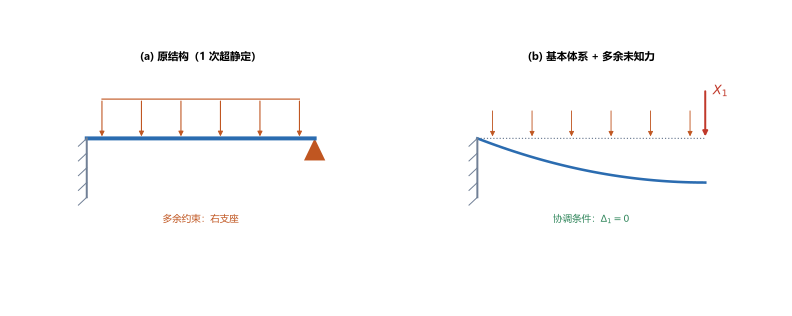
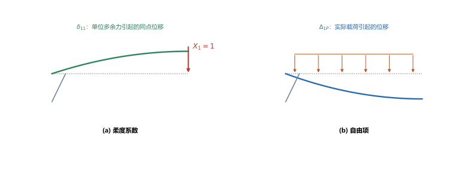
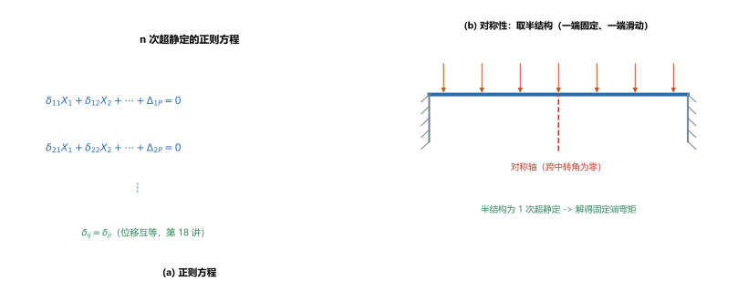

# 第 19 讲：超静定结构的力法与正则方程

> **前置**：第 12 讲（超静定概念、变形比较法）、第 18 讲（能量法、单位载荷法、位移互等定理）。
> **预计时间**：约 3.5 小时（含作业）。
>
> **一句话定位**：第 12 讲用**变形比较法**解过一次超静定，但次数一高就容易乱。本讲把它**系统化**：选**基本体系**、定义**柔度系数** $\delta_{ij}$、统一写成**正则方程**（一组线性方程），并用**位移互等**（$\delta_{ij}=\delta_{ji}$）与**对称性**简化。梁、刚架、桁架的超静定从此走同一套流程。
>
> **本讲回答什么**：
> 1. 力法的"基本体系"与第 12 讲的"静定基"是什么关系？
> 2. 柔度系数 $\delta_{ij}$ 的物理意义是什么？用第 18 讲的什么工具算？
> 3. 正则方程为什么是一组**线性**方程？对称性怎么简化计算？
>
> **这一讲有真实验证**：一次超静定梁的 $\delta_{11}$、$\Delta_{1P}$ 与 $X_1$（$=15\ \mathrm{kN}$，与第 12 讲变形比较法的 $3qL/8$ **一致**）、残差检查、两端固定梁对称性的 $M=-\dfrac{qL^2}{12}$ 与弯矩方程互证、柔度矩阵对称性 $\delta_{12}=\delta_{21}$（差为 0）（脚本 `scripts/lec19-01_verify_force_method.py`）；另有基本体系、柔度系数与自由项、正则方程与对称性三张图（`figures/`）。

---

## 引子：从"一次"到"任意次"

第 12 讲解超静定，做法是"去掉多余约束 → 写变形协调 → 用变形公式化成力 → 联立求解"。对**1 次**超静定，这个流程还算清爽；但如果是 **2 次、3 次**，就要写 2 个、3 个协调条件，还要一个一个凑挠度公式——很容易乱。

第 18 讲的能量法刚好补上了关键缺口：**它能方便地算出任意点、任意方向的位移**。于是就能把"变形协调"写成**统一的方程组**。这就是**力法**。

---

## 1. 力法与基本体系

### 1.1 基本体系

**力法**的第一步和变形比较法一样：**去掉多余约束**。去掉后得到的静定结构，叫**基本体系**（第 12 讲叫"静定基"——**同一件事，两个名字**）。

但与变形比较法不同的是：力法**不把多余约束丢掉**，而是把它对结构的作用**保留为一个未知力** $X_1$（叫**多余未知力**）——这样原结构就等价于"**基本体系 + 多余未知力**"。

> **图 1 怎么读**：(a) 原结构（固支+简支，1 次超静定，多余约束是右支座）；(b) 取基本体系（悬臂梁）+ 多余未知力 $X_1$。**协调条件**是"右端位移为零"（$\Delta_1=0$）。

### 1.2 与变形比较法的关系

| | 变形比较法（第 12 讲） | 力法（本讲） |
|---|---|---|
| 去掉多余约束后 | 叫**静定基** | 叫**基本体系** |
| 多余约束的作用 | 当成一个待求的**力** | 同上（$X_1,X_2,\dots$） |
| 协调条件 | 逐个写（一次一个） | **统一写成方程组**（正则方程） |
| 位移的求法 | 查表 + 叠加 | **能量法**（单位载荷法/图形互乘） |
| 适用次数 | 低次（1~2 次）方便 | **任意次**，流程统一 |

> **一句话**：力法 = 变形比较法的**系统化版本**，配合能量法后能处理任意次超静定。

---

## 2. 柔度系数与自由项

### 2.1 两个量的物理意义

在第 $i$ 个多余约束处，总位移由**两部分叠加**：

$$\Delta_i = \underbrace{\sum_j \delta_{ij}X_j}_{\text{各多余未知力引起}} + \underbrace{\Delta_{iP}}_{\text{实际载荷引起}} = 0.$$

- **柔度系数** $\delta_{ij}$：**第 $j$ 个多余未知力取单位值（$X_j=1$）时，在第 $i$ 个多余约束方向引起的位移**；
  - $\delta_{ii}$：单位力**自身方向**上的位移（恒正）；
  - $\delta_{ij}$（$i\ne j$）：**交叉影响**（可为正、负、零）。
- **自由项** $\Delta_{iP}$：**实际载荷**在第 $i$ 个多余约束方向引起的位移。

> **图 2 怎么读**：(a) 在 $X_1$ 位置加**单位力**，它引起的同点位移就是 $\delta_{11}$；(b) 只留**实际载荷**（均布 $q$），它引起的同点位移就是 $\Delta_{1P}$。

### 2.2 怎么算（用第 18 讲的工具）

柔度系数与自由项**都是位移**，所以直接套第 18 讲的单位载荷法：

$$\delta_{ij} = \int\frac{\bar{M}_i\bar{M}_j}{EI}\mathrm{d}x,\qquad \Delta_{iP} = \int\frac{M_P\bar{M}_i}{EI}\mathrm{d}x,$$

其中 $\bar{M}_i$ 是"第 $i$ 个多余未知力取单位值"时的弯矩图、$M_P$ 是实际载荷的弯矩图。**图简单时直接用图形互乘**（第 18 讲）。

（脚本 EXP1）以 §1 的梁为例（$q=10\ \mathrm{N/mm}$、$L=4000\ \mathrm{mm}$、$EI=1\times10^{12}$）：

$$\delta_{11}=\frac{L^3}{3EI}=\frac{6.4\times10^{10}}{3\times10^{12}}=0.021333\ \mathrm{mm/N},$$

$$\Delta_{1P}=\frac{qL^4}{8EI}=\frac{10\times2.56\times10^{14}}{8\times10^{12}}=320.00\ \mathrm{mm}.$$

---

## 3. 正则方程与求解步骤

### 3.1 正则方程

把每个多余约束处的协调条件 $\Delta_i=0$ 写全，就得到**正则方程**（$n$ 次超静定 = $n$ 个方程）：

$$\left\{\begin{aligned}
\delta_{11}X_1+\delta_{12}X_2+\cdots+\delta_{1n}X_n+\Delta_{1P}&=0\\
\delta_{21}X_1+\delta_{22}X_2+\cdots+\delta_{2n}X_n+\Delta_{2P}&=0\\
&\vdots\\
\delta_{n1}X_1+\delta_{n2}X_2+\cdots+\delta_{nn}X_n+\Delta_{nP}&=0
\end{aligned}\right.$$

**为什么是"线性"的**：位移与力成正比（线弹性），所以每个 $X_j$ 对位移的贡献是 $\delta_{ij}X_j$——**一次项**。因此这永远是**线性方程组**，可以直接解。

**一次超静定**时退化为一个方程：

$$\boxed{\delta_{11}X_1+\Delta_{1P}=0 \;\Longrightarrow\; X_1=-\frac{\Delta_{1P}}{\delta_{11}}}.$$

### 3.2 求解步骤

1. **定超静定次数 $n$**，选**多余未知力** $X_1,\dots,X_n$，得到**基本体系**；
2. **画弯矩图**：$M_P$（实际载荷）+ 各 $\bar{M}_i$（$X_i=1$）；
3. **算系数与自由项**：$\delta_{ij}$、$\Delta_{iP}$（单位载荷法/图形互乘）；
4. **列并解正则方程**，得 $X_1,\dots,X_n$；
5. **叠加求最终内力**：$M=M_P+\sum X_i\bar{M}_i$；
6. **校核**（把解代回协调条件，看残差是否为零）。

### 3.3 算例：一次超静定梁

回到 §1 的梁，只需一个方程：

$$\delta_{11}X_1+\Delta_{1P}=0 \;\Longrightarrow\; X_1=\frac{\Delta_{1P}}{\delta_{11}}=\frac{320.00}{0.021333}=15000\ \mathrm{N}=15\ \mathrm{kN}.$$

而 $\dfrac{3qL}{8}=\dfrac{3\times10\times4000}{8}=15\ \mathrm{kN}$——**与第 12 讲变形比较法的结果完全一致**。

**残差检查**（脚本 EXP3）：$\delta_{11}X_1-\Delta_{1P}=0.000\times10^{0}$——协调条件被精确满足。

> **再看一眼这个数**：$\delta_{11}=\dfrac{L^3}{3EI}$ 来自**悬臂梁端部单位力**的挠度（第 11 讲），$\Delta_{1P}=\dfrac{qL^4}{8EI}$ 来自**悬臂梁均布载荷端部挠度**——力法并没有引入新东西，只是把第 11、18 讲的现成结果组织成了一个方程。

---

## 4. 系数对称性

$$\boxed{\delta_{ij}=\delta_{ji}}$$

**来源**：第 18 讲的**位移互等定理**—— $\delta_{ij}$ 是"$j$ 处单位力在 $i$ 处引起的位移"，$\delta_{ji}$ 反之，两者相等。

**好处**：

- 求系数的工作量**减半**（只算上三角）；
- 方程组系数矩阵**对称**，便于校核与数值求解（对称矩阵有良好性质）。

（脚本 EXP5）用两个单位力偶（分别加在 $L/3$ 与 $2L/3$ 处）验证：$\delta_{12}=\delta_{21}=-2.178\times10^{-10}\ \mathrm{rad/(N\cdot mm)}$，**差为 0**。

> **卡壳时自检**：若算出的 $\delta_{12}\ne\delta_{21}$，一定是**某个弯矩图或符号写错了**——这是免费的校核手段。

---

## 5. 对称性的利用（认识层）

结构**几何对称 + 载荷对称**时，可以只算**一半**（取**半结构**），能大幅减少未知量：

- **对称轴上（载荷对称时）**：截面的**转角为零**、**剪力为零**（可当"滑动支座"处理）；
- **对称轴上（载荷反对称时）**：截面的**挠度为零**（可当"铰支座"处理）。

**例**：两端固定梁受满跨均布 $q$（结构与载荷都对称）→ 对称轴在跨中，取半结构 = "一端固定、一端滑动（转角为零、剪力为零）"的梁，只有 **1 个**多余未知力。解得固定端弯矩：

$$M_{\text{固定}}=-\frac{qL^2}{12},\qquad M_{\text{跨中}}=+\frac{qL^2}{24}.$$

（脚本 EXP4）$q=10\ \mathrm{N/mm}$、$L=4000\ \mathrm{mm}$：$M_{\text{固定}}=-13.33\ \mathrm{kN\cdot m}$、$M_{\text{跨中}}=+6.67\ \mathrm{kN\cdot m}$。

**独立核对**：用弯矩方程 $M(x)=M_{\text{固定}}+\dfrac{qL}{2}x-\dfrac{qx^2}{2}$ 算 $x=L/2$ 处得 $6.667\times10^{6}\ \mathrm{N\cdot mm}$——与 $M_{\text{跨中}}$ 一致。

> **图 3 怎么读**：(a) $n$ 次超静定的正则方程（系数矩阵对称）$(b)$ 两端固定梁的对称性——跨中转角为零，可取半结构（一端固定、一端滑动），容易解。

> **注意适用条件**：对称性简化只对"结构对称 + 载荷对称/反对称"成立。**载荷不对称就不能取半结构**。

---

## 6. 推广：桁架与刚架（简述）

力法的流程对**任何**超静定结构都一样，只是"弯矩图"换成对应的内力：

- **超静定桁架**（多余杆）：$\delta_{ij}=\sum\dfrac{\bar{F}_{Ni}\bar{F}_{Nj}L}{EA}$、$\Delta_{iP}=\sum\dfrac{F_{NP}\bar{F}_{Ni}L}{EA}$（只用**轴力**，逐杆求和，第 18 讲的一般式）；
- **超静定刚架**：以**弯矩**为主（$\int\dfrac{M\bar{M}}{EI}\mathrm{d}x$），必要时加上轴力项；
- **曲杆**：用极坐标写出 $M(\varphi)$ 后同样积分。

> **一句话**：**"力法 = 基本体系 + 柔度系数 + 正则方程"这三件套，不分结构类型**——区别只在"用哪种内力做积分"。

---

## 7. 本讲的心智模型

把这一讲压缩成一条主线：

> **力法题 = 定次数、选多余未知力（得基本体系）→ 画 $M_P$ 与 $\bar{M}_i$ → 用单位载荷法/图形互乘算 $\delta_{ij}$、$\Delta_{iP}$ → 解正则方程 $\sum\delta_{ij}X_j+\Delta_{iP}=0$ → 叠加得内力 → 回代校核。**

遇到一道题，按这个顺序走：

1. **数次数**（第 12 讲的方法）、**选多余未知力**；
2. **画弯矩图**：实际载荷 $M_P$ + 每个单位多余力 $\bar{M}_i$；
3. **算系数**：$\delta_{ij}$（单位力 × 单位力）、$\Delta_{iP}$（实际 × 单位）；利用 $\delta_{ij}=\delta_{ji}$ 少算一半；
4. **解方程**：线性方程组；
5. **叠加 + 校核**：$M=M_P+\sum X_i\bar{M}_i$，残差应约为零。

---

## 8. 小结

- **力法与基本体系**：去掉多余约束得**基本体系**（= 第 12 讲的静定基），把多余约束的作用保留为**多余未知力** $X_i$。
- **柔度系数 $\delta_{ij}$**：$X_j=1$ 时在 $i$ 方向引起的位移；**自由项 $\Delta_{iP}$**：实际载荷在 $i$ 方向引起的位移。两者都用**单位载荷法/图形互乘**算。
- **正则方程**：$\sum_j\delta_{ij}X_j+\Delta_{iP}=0$（$n$ 个方程）；**线性**（因线弹性）；一次超静定时 $X_1=-\dfrac{\Delta_{1P}}{\delta_{11}}$。
- **系数对称性** $\delta_{ij}=\delta_{ji}$（位移互等，第 18 讲）；兼作校核手段。
- **对称性的利用**：结构+载荷对称/反对称时可取**半结构**（对称轴上转角与剪力为零 / 挠度为零）；例：两端固定梁 $M_{\text{固定}}=-\dfrac{qL^2}{12}$。
- **推广**：桁架（轴力项）、刚架（弯矩项为主）、曲杆——流程相同，只是"用哪种内力积分"不同。

---

## 9. 作业

### 基础

**Q1. 概念**：力法的"基本体系"与第 12 讲变形比较法的"静定基"是什么关系？两者处理多余约束的方式有何不同？

**参考答案**：

两者**都是"去掉多余约束后得到的静定结构"**，物理上是同一个东西，只是叫法不同。
**不同**：变形比较法把多余约束的作用直接当"待求反力"，逐个写协调条件；**力法**把多余约束的作用统一表示为**多余未知力** $X_i$，并把所有协调条件**统一写成正则方程组**——流程标准化，因此能处理**任意次**超静定。
验算（自检方向）：本讲算例中力法与变形比较法得到同一个 $X_1=15\ \mathrm{kN}$，说明两者等价。

**Q2. 柔度系数**：悬臂梁长 $L=2000\ \mathrm{mm}$、$EI=1\times10^{12}\ \mathrm{N\cdot mm^2}$，在自由端加竖向多余未知力 $X_1$。求 $\delta_{11}$。

**参考答案**：

$\delta_{11}$ = 单位力作用于自由端时的自由端挠度 $=\dfrac{L^3}{3EI}=\dfrac{8\times10^9}{3\times10^{12}}=2.667\times10^{-3}\ \mathrm{mm/N}$。
验算：与第 11 讲悬臂梁端部挠度公式一致；且 $\delta_{11}>0$（自身方向的柔度恒正）。

**Q3. 一次超静定**：固支+简支梁，均布 $q=12\ \mathrm{kN/m}$、$L=3\ \mathrm{m}$。用一次超静定的正则方程解 $X_1$。

**参考答案**：

基本体系取悬臂梁，$X_1$ 为右端竖向反力。$\delta_{11}=\dfrac{L^3}{3EI}$、$\Delta_{1P}=\dfrac{qL^4}{8EI}$（均布载荷下悬臂端挠度），故
$X_1=\dfrac{\Delta_{1P}}{\delta_{11}}=\dfrac{3qL}{8}=\dfrac{3\times12\times3}{8}=13.5\ \mathrm{kN}$。
验算：与第 12 讲 $R_B=\dfrac{3qL}{8}$ 公式一致。

### 提高

**Q4. 对称性利用**：两端固定梁受满跨均布 $q=15\ \mathrm{kN/m}$、$L=4\ \mathrm{m}$。利用对称性求固定端弯矩与跨中弯矩。

**参考答案**：

结构与载荷都对称 → 取半结构（一端固定、一端滑动，跨中转角为零、剪力为零），解得
$M_{\text{固定}}=-\dfrac{qL^2}{12}=-\dfrac{15\times4^2}{12}=-20\ \mathrm{kN\cdot m}$；$M_{\text{跨中}}=+\dfrac{qL^2}{24}=+10\ \mathrm{kN\cdot m}$。
验算：用弯矩方程 $M(x)=M_{\text{固}}+\dfrac{qL}{2}x-\dfrac{qx^2}{2}$（$x$ 自固定端起），在 $x=L/2=2\ \mathrm{m}$ 处
$M(2)=-20+\dfrac{15\times4}{2}\times2-\dfrac{15\times2^2}{2}=-20+60-30=10\ \mathrm{kN\cdot m}$，与 $M_{\text{跨中}}$ 一致 ✓。

**Q5. 互等定理的用途**：$\delta_{ij}=\delta_{ji}$ 在力法里有什么用？

**参考答案**：

① **减少计算量**：只算上三角（约一半）的柔度系数；
② **作校核**：若算出的 $\delta_{12}\ne\delta_{21}$，必定有弯矩图或符号错误——**免费的纠错手段**；
③ **保证方程组的系数矩阵对称**，便于数值求解（对称矩阵性质好）。
验算：本讲 EXP5 数值验证 $\delta_{12}=\delta_{21}$（差为 0）。

**Q6. 概念**：正则方程为什么一定是**线性**方程组？

**参考答案**：

因为处于**线弹性、小变形**范围：位移与载荷成**正比**。每个 $X_j$ 对 $i$ 方向位移的贡献都是 $\delta_{ij}X_j$（**一次项**），没有 $X^2$、$X_1X_2$ 这类项——所以方程组线性。
一旦进入塑性或大变形，这个正比关系破坏，力法就不再适用（或需迭代）。
验算（自检方向）：本讲两个算例（一次梁、对称半结构）都解的是线性方程。

### 综合

**Q7. 完整分析**：固支+简支梁，$q=10\ \mathrm{N/mm}$、$L=4000\ \mathrm{mm}$、$EI=1\times10^{12}\ \mathrm{N\cdot mm^2}$。（1）求 $\delta_{11}$、$\Delta_{1P}$、$X_1$；（2）写出最终弯矩表达式并求固定端弯矩。

**参考答案**：

(1) $\delta_{11}=\dfrac{L^3}{3EI}=0.021333\ \mathrm{mm/N}$；$\Delta_{1P}=\dfrac{qL^4}{8EI}=320.00\ \mathrm{mm}$；$X_1=\dfrac{\Delta_{1P}}{\delta_{11}}=15000\ \mathrm{N}=15\ \mathrm{kN}$。
(2) 叠加：$M=M_P+X_1\bar{M}$。其中 $M_P=-\dfrac{qx^2}{2}$（悬臂受均布，$x$ 从固定端起）、$\bar{M}=x$，故
$M(x)=-\dfrac{qx^2}{2}+X_1x$。
固定端（$x=0$）：$M=0$；右端（$x=L$）：$M=-\dfrac{qL^2}{2}+X_1L=-\dfrac{10\times1.6\times10^7}{2}+15000\times4000=-8\times10^7+6\times10^7=-2\times10^7\ \mathrm{N\cdot mm}=-20\ \mathrm{kN\cdot m}$。
验算：$-qL^2/8=-20\ \mathrm{kN\cdot m}$ ✓（与第 12 讲的固定端弯矩一致）。

**Q8. 开放简答**：力法适用于哪些结构？它有什么局限？与位移法相比各有什么优势？

**参考答案**：

**适用**：任何**线弹性、小变形**的超静定结构——梁、刚架、桁架、曲杆、组合结构；超静定次数低时尤其方便。
**局限**：
- 超静定**次数高**时，未知量与方程数同时增加（$n$ 次就有 $n$ 个方程），手工计算量大；
- 进入塑性或大变形后失效。
**与位移法比较**：力法以**多余力**为未知量，适合**超静定次数低**的结构；位移法以**节点位移**为未知量，适合**节点少而超静定次数高**的结构（如多层刚架）——两者互补。
验算（自检方向）：本讲算例是"1 次超静定、梁"——正是力法最顺手的场合；若是 10 层刚架，就该换位移法（本课不展开，第 22 讲会提它与结构力学的接口）。

---

*下一讲预告——第 20 讲《动载荷》：到此，所有载荷都是"慢慢地"加上的（静载荷）。但工程上还有**动载荷**——构件在加速运动（如起重机起吊）、或遭遇**冲击**（如落锤、刹车）。第 20 讲给出**动荷系数** $k_d$，把动应力写成"静应力 × 系数"，其中冲击问题的 $k_d=1+\sqrt{1+\dfrac{2h}{\Delta_{st}}}$ ——注意它里面藏着"刚度越大、动应力越大"这个反直觉的结论。*