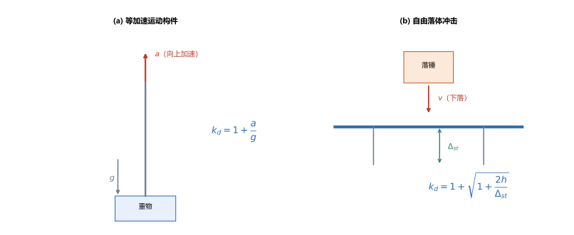
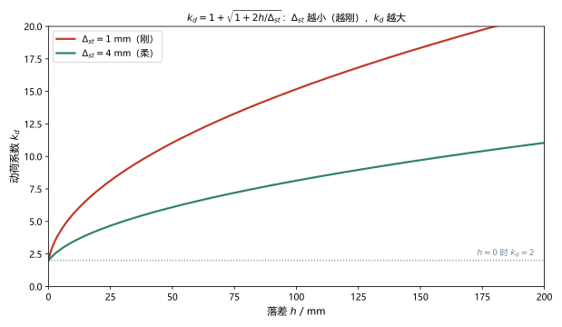
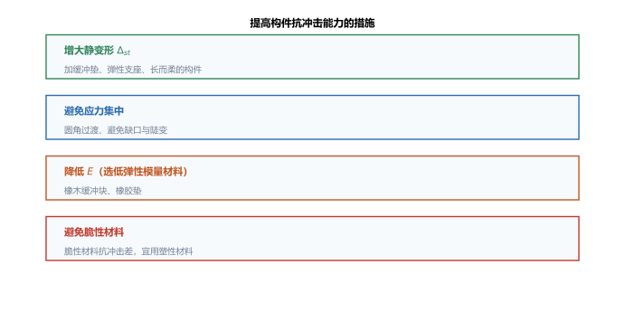

# 第 20 讲：动载荷

> **前置**：第 03–06 讲（拉压、扭转的应力与变形）、第 09–11 讲（弯曲应力与变形）、第 18 讲（能量法，尤其"外力功 $=\dfrac{1}{2}F\Delta$"）。
> **预计时间**：约 3 小时（含作业）。
>
> **一句话定位**：到第 19 讲为止，所有载荷都是**慢慢地、静止地**加上去的（静载荷）。本讲处理**动载荷**——构件在**加速运动**、或遭遇**冲击**。核心工具是**动荷系数 $k_d$**：把动应力写成"静应力 $\times\,k_d$"。冲击的 $k_d=1+\sqrt{1+\dfrac{2h}{\Delta_{st}}}$ 里藏着一个**反直觉结论**：**刚度越大，动应力越大**。
>
> **本讲回答什么**：
> 1. 动载荷与静载荷的本质区别是什么？
> 2. 等加速构件、自由落体冲击的动荷系数各怎么来的？
> 3. 为什么"越刚越危险"？怎样提高构件的抗冲击能力？
>
> **这一讲有真实验证**：等加速动荷系数与动应力、冲击 $k_d$ 与动变形、$h=0$（突加载荷）时 $k_d=2$、刚度对比的**反直觉核对**（$\Delta_{st}=1$ mm 时 $k_d=15.18$ 而 $\Delta_{st}=4$ mm 时 $k_d=8.14$）、冲击能量方程两路互证（脚本 `scripts/lec20-01_verify_dynamic_load.py`）；另有动载荷两类、$k_d$ 曲线、抗冲击措施三张图（`figures/`）。

---

## 引子：静载荷之外

起重机**慢慢**吊起一个重物时，钢索里的拉力就是重物的重量——这是第 03 讲的静载问题。但如果起重机**加速**起吊，钢索里的拉力会**大于**重量；如果重物**自由落下再被刹住**（冲击），拉力会大出**好几倍**。

这类"加载过程本身产生加速度或惯性"的载荷，就是**动载荷**。本讲把它归结为一个**放大系数**。

---

## 1. 动载荷与静载荷的本质区别

| | 静载荷 | 动载荷 |
|---|---|---|
| 加载过程 | 缓慢、无加速度 | 有**加速度**或**速度突变** |
| 惯性力 | 可忽略 | **必须考虑**（就是它放大了应力） |
| 分析方式 | 直接按平衡计算 | 先算**静效应**，再乘**动荷系数** $k_d$ |

**"静载法"的通用思路**（本讲所有公式的总纲）：

$$\boxed{\sigma_d = k_d\,\sigma_{st},\qquad \Delta_d = k_d\,\Delta_{st}},\qquad k_d>1.$$

即：**先用第 03–19 讲的方法算静应力/静变形，再乘以动荷系数**。不同动载荷的差别只在 $k_d$ 的算法。

> **为什么可以这样处理**：线弹性范围内应力与变形成正比；动载荷只是把"载荷"换成了"载荷 + 惯性力"，而后者仍与载荷成正比（对等加速与冲击都成立）。所以整条链上乘一个系数即可。

---

## 2. 等加速运动构件的动应力

### 2.1 动荷系数

一根杆以加速度 $a$ **向上**吊起重物。取重物为研究对象：除重力外，还需要一个**惯性力** $ma$ 才能产生加速度。于是杆的内力（拉力）为

$$F_d = m(g+a) = F_{st}\left(1+\frac{a}{g}\right),$$

故**等加速构件的动荷系数**：

$$\boxed{k_d = 1+\frac{a}{g}}.$$

- **向上加速**（$a>0$）：$k_d>1$，应力放大；
- **向下加速**（$a<0$，如吊重物下降）：$k_d<1$，应力减小；
- **匀速**（$a=0$）：$k_d=1$，回到静载。

> **图 1 怎么读**：(a) 等加速起吊：加速度 $a$ 向上（红），重力加速度 $g$ 向下（灰），两者叠加给钢索的拉力 $F_d=m(g+a)$；(b) 自由落体冲击：重物以速度 $v$ 下落撞击梁，梁产生**静变形** $\Delta_{st}$（下方绿色双箭头）与**动变形** $\Delta_d$。

### 2.2 算例

（脚本 EXP1）$a=2\ \mathrm{m/s^2}$、$g=9.8\ \mathrm{m/s^2}$：

$$k_d=1+\frac{2}{9.8}=1.2041.$$

若某杆的静应力 $\sigma_{st}=100\ \mathrm{MPa}$，则动应力

$$\sigma_d=1.2041\times100=120.41\ \mathrm{MPa}.$$

> **注意**：$k_d$ 与"加速度大小"有关，与"截面尺寸"无关——所以**加速起吊时不能只按重量选钢索**，必须乘 $k_d$。

---

## 3. 冲击问题

### 3.1 问题与假设

重物从高度 $h$ **自由落下**，撞击一个弹性构件（梁、杆、弹簧等）。构件在冲击过程中产生的最大变形 $\Delta_d$、最大应力 $\sigma_d$ 是多少？

**简化假设**（第 4 节会再总结）：

1. **不计冲击物（落体）本身的变形**，视为刚体；
2. **不计构件质量**（惯性），全部动能由被击点吸收；
3. **冲击过程中构件始终处于线弹性状态**；
4. **冲击瞬间动能全部转化为构件的应变能**（忽略接触过程中的能量损耗）。

### 3.2 动荷系数的推导（能量法）

设构件在**静载荷** $P_{st}$ 下的静变形为 $\Delta_{st}$（即落体重量静止放上去时的变形）。冲击过程中，重物的重力做总功为 $P_{st}(h+\Delta_d)$（下落高度 $h$ + 构件被压下的 $\Delta_d$），这些功全部转化为构件的应变能 $\dfrac{1}{2}k\Delta_d^2$（$k=P_{st}/\Delta_{st}$ 为构件刚度）：

$$P_{st}(h+\Delta_d) = \frac{1}{2}k\Delta_d^2.$$

代入 $P_{st}=k\Delta_{st}$，两边除以 $k$：

$$2\Delta_{st}h + 2\Delta_{st}\Delta_d = \Delta_d^2,$$

解这个关于 $\Delta_d$ 的二次方程（取正根）：

$$\Delta_d = \Delta_{st}\left[1+\sqrt{1+\frac{2h}{\Delta_{st}}}\right].$$

于是**动荷系数**：

$$\boxed{k_d = \frac{\Delta_d}{\Delta_{st}} = 1+\sqrt{1+\frac{2h}{\Delta_{st}}}}.$$

（脚本 EXP5）能量方程两路核对：$P_{st}(h+\Delta_d)=122099.8\ \mathrm{N\cdot mm}$，$\dfrac{1}{2}k\Delta_d^2=122099.8\ \mathrm{N\cdot mm}$——**完全相等**。

### 3.3 算例与两个特例

（脚本 EXP2、EXP3）$h=100\ \mathrm{mm}$、$\Delta_{st}=2\ \mathrm{mm}$：

$$k_d=1+\sqrt{1+\frac{2\times100}{2}}=1+\sqrt{101}=11.0499,$$

$$\Delta_d=k_d\Delta_{st}=11.0499\times2=22.10\ \mathrm{mm}.$$

若 $\sigma_{st}=30\ \mathrm{MPa}$，则 $\sigma_d=11.0499\times30=331.50\ \mathrm{MPa}$——**放大了 11 倍**。

**两个必须记住的特例**：

- **$h=0$（突加载荷）**：$k_d=1+\sqrt{1}=2$。即**把重物"突然放上去"（不抬高），动应力是静应力的 2 倍**；
- **$h$ 很大**：$k_d\approx\sqrt{2h/\Delta_{st}}$，$k_d$ 与 $\sqrt{h}$ 成正比、与 $\dfrac{1}{\sqrt{\Delta_{st}}}$ 成正比。

> **图 2 怎么读**：$k_d$ 随落差 $h$ 增大而增大；$h=0$ 时所有曲线的起点都是 $k_d=2$。**同样落差下，$\Delta_{st}$ 小的（更刚的）构件 $k_d$ 更大**——红线（$\Delta_{st}=1$ mm）始终高于绿线（$\Delta_{st}=4$ mm）。

### 3.4 反直觉结论：越刚越危险

从 $k_d=1+\sqrt{1+\dfrac{2h}{\Delta_{st}}}$ 看：**$\Delta_{st}$ 越小（构件越刚），$k_d$ 越大，动应力越大**。

（脚本 EXP4）同样落差 $h=100\ \mathrm{mm}$：

| | $\Delta_{st}$ | $k_d$ |
|---|---|---|
| 刚性件 | $1.0\ \mathrm{mm}$ | $15.18$ |
| 柔性件 | $4.0\ \mathrm{mm}$ | $8.14$ |

**为什么**：冲击的能量必须由构件的**变形**吸收。**刚的构件变形小、吸收能量的"容量"小**，只能靠"把应力抬得更高"来储存同样的能量。这与静载的直觉（越刚越好）**完全相反**。

> **工程含义**：**抗冲击设计要"以柔克刚"**——加缓冲垫、弹性支座、让构件长而柔。

---

## 4. 冲击问题的简化假定与边界

前面推导用了 4 条简化假设（§3.1），使用时必须清楚它们的**边界**：

- **"不计构件质量"**：若构件本身很重（如长梁、长杆），它分担的动能不可忽略，实际 $k_d$ 会比公式**小**（公式偏保守）；
- **"不计落体变形"**：若落体是软的（如橡胶锤），实际 $k_d$ 会**小**；
- **"线弹性"**：若冲击引起塑性变形，能量被塑性变形吸收，$\sigma_d$ 不再按本公式算；
- **"动能全部转为应变能"**：忽略了接触处的**局部塑性、摩擦与声发射**等损耗，故公式结果是**偏安全的上限**。

**另外两类动载荷（认识层）**：

- **突然刹车**：作水平运动的构件（如起重机小车）突然刹车，重物因惯性产生**水平冲击**，与自由落体冲击**同一套方法**（把 $h$ 换成"制动距离"或"由速度折算的等效高度"）；
- **水平冲击**：公式形式上与竖向冲击相同（只需把"落差"换成速度项）。

---

## 5. 提高构件抗冲击能力的措施

由 $k_d=1+\sqrt{1+\dfrac{2h}{\Delta_{st}}}$ 和 $\sigma_d=k_d\sigma_{st}$，可得到方向明确的三条（外加一条材料选择）：

> **图 3 怎么读**：提高抗冲击能力的四条措施——增大静变形、避免应力集中、降低 $E$、避免脆性材料。

1. **增大静变形 $\Delta_{st}$**（**最主要的一条**）：加缓冲垫、弹性支座；把"短粗"构件换成"长而柔"的构件。**注意这条与"提高刚度"相反**——这正是 §3.4 反直觉结论的直接运用；
2. **避免应力集中**：冲击时应力集中处的峰值更高，用圆角过渡、避免缺口；
3. **降低弹性模量 $E$**：$\Delta_{st}\propto\dfrac{1}{E}$，低 $E$ 材料（橡胶垫、木材缓冲块）能显著增大 $\Delta_{st}$、降低 $k_d$（这也解释了为什么缓冲件从不用"高强度钢"）；
4. **避免脆性材料**：脆性材料塑性差、吸收冲击能量能力弱，冲击下容易突然断裂。**抗冲击构件优先用塑性材料**。

> **一句话**：**冲击防护的核心是"用变形换应力"**——让构件在可以承受的范围内多变形，把冲击能量"软着陆"消化掉。

---

## 6. 本讲的心智模型

把这一讲压缩成一条主线：

> **动载荷题 = 先算静应力/静变形（第 03–19 讲的工具）→ 按动载荷类型算 $k_d$（等加速 $1+\dfrac{a}{g}$；冲击 $1+\sqrt{1+\dfrac{2h}{\Delta_{st}}}$）→ 乘上去得动应力/动变形 → 与许用值比较。**

遇到一道题，按这个顺序走：

1. **判断类型**：等加速 / 冲击 / 突然刹车（水平冲击）；
2. **算静效应**：$\sigma_{st}$、$\Delta_{st}$（用前面各讲的方法）；
3. **算 $k_d$**：套对应公式；
4. **乘起来**：$\sigma_d=k_d\sigma_{st}$、$\Delta_d=k_d\Delta_{st}$；
5. **校核**：$\sigma_d\le[\sigma]$。

---

## 7. 小结

- **动载荷**：加载过程产生加速度或速度突变，**须计入惯性**；统一用**静载法**处理：$\sigma_d=k_d\sigma_{st}$、$\Delta_d=k_d\Delta_{st}$。
- **等加速构件**：$k_d=1+\dfrac{a}{g}$（向上加速放大、向下减小、匀速为 1）。
- **自由落体冲击**：$k_d=1+\sqrt{1+\dfrac{2h}{\Delta_{st}}}$；$h=0$（突加载荷）时 $k_d=2$；$h$ 大时 $k_d\approx\sqrt{\dfrac{2h}{\Delta_{st}}}$。
- **反直觉结论**：**$\Delta_{st}$ 越小（越刚）→ $k_d$ 越大 → 动应力越大**——冲击设计要"以柔克刚"。
- **简化假定与边界**：落体为刚体、不计构件质量、线弹性、动能全转应变能（结果偏安全）；突然刹车/水平冲击同一套方法（认识层）。
- **提高抗冲击能力**：**增大 $\Delta_{st}$**（最有效）→ 避免应力集中 → 降低 $E$ → 避免脆性材料。

---

## 8. 作业

### 基础

**Q1. 概念**：动载荷与静载荷的本质区别是什么？为什么动载荷可以用"静应力 $\times\,k_d$"来求？

**参考答案**：

**本质区别**：动载荷的加载过程产生**加速度或速度突变**，因此构件内除了外载荷，还要承受**惯性力**；静载荷缓慢施加，惯性可忽略。
**为什么能乘系数**：在**线弹性**范围内，应力与载荷成正比；动载荷相当于把"载荷"换成"载荷 + 惯性力"，而惯性力也与载荷成正比（等加速时 $\propto ma$、冲击时 $\propto$ 动能）。于是整条链上乘一个系数 $k_d$ 即可。
验算（自检方向）：$a=0$ 时 $k_d=1$、$h=0$ 且按静放时 $k_d=1$——都退化回静载，公式自洽。

**Q2. 等加速构件**：起重机以 $a=3\ \mathrm{m/s^2}$ 向上起吊，构件静应力 $\sigma_{st}=80\ \mathrm{MPa}$。求动荷系数与动应力。

**参考答案**：

$k_d=1+\dfrac{a}{g}=1+\dfrac{3}{9.8}=1.3061$；
$\sigma_d=1.3061\times80=104.49\ \mathrm{MPa}$。
验算：$a=0$ 时 $k_d=1$；$a>0$ 时 $k_d>1$——方向正确。

**Q3. 冲击**：重物自 $h=50\ \mathrm{mm}$ 自由落下冲击一根梁，梁的静变形 $\Delta_{st}=2\ \mathrm{mm}$、静应力 $\sigma_{st}=40\ \mathrm{MPa}$。求 $k_d$、$\Delta_d$、$\sigma_d$。

**参考答案**：

$k_d=1+\sqrt{1+\dfrac{2\times50}{2}}=1+\sqrt{51}=8.1414$；
$\Delta_d=k_d\Delta_{st}=8.1414\times2=16.28\ \mathrm{mm}$；
$\sigma_d=k_d\sigma_{st}=8.1414\times40=325.66\ \mathrm{MPa}$。
验算：$\dfrac{2h}{\Delta_{st}}=50$，$\sqrt{51}=7.1414$，加 1 得 $8.1414$ ✓。

### 提高

**Q4. 反直觉**：同一落差下，为什么"刚性构件"的动应力反而比"柔性构件"大？用公式与物理直觉各解释一遍。

**参考答案**：

**公式**：$k_d=1+\sqrt{1+\dfrac{2h}{\Delta_{st}}}$——$\Delta_{st}$ 在**分母**，故 $\Delta_{st}$ 越小 $k_d$ 越大。
**物理直觉**：冲击的能量必须由构件的**变形**吸收（$\dfrac{1}{2}k\Delta_d^2$）。**刚的构件变形能力小**，同样的能量只能靠"把应力抬得更高"来储存，所以动应力更大。这与静载下"越刚越好"完全相反。
验算：本讲 EXP4 中 $\Delta_{st}=1$ mm 的 $k_d=15.18$，$\Delta_{st}=4$ mm 的 $k_d=8.14$——同一落差，刚性件动荷系数几乎翻倍。

**Q5. 措施**：某构件的抗冲击能力不足（$\sigma_d$ 超限），请给出三种改进方案并说明原理。

**参考答案**：

① **增大静变形 $\Delta_{st}$**（最有效）：加缓冲垫/弹性支座，或把构件做得长而柔。原理：$k_d$ 随 $\Delta_{st}$ 增大而减小；
② **避免应力集中**：把尖角改成圆角、去掉缺口。原理：冲击时应力峰值出现在应力集中处，降低集中系数直接降低 $\sigma_d$ 的峰值；
③ **改用低 $E$ 材料或加缓冲层**：$\Delta_{st}\propto\dfrac{1}{E}$，低 $E$ 材料能增大 $\Delta_{st}$。
（补充：避免脆性材料，因其塑性差、吸能能力弱。）
验算（自检方向）：三条都作用在 $\sigma_d=k_d\sigma_{st}$ 的两个因子上——要么减小 $k_d$（①②③），要么降低 $\sigma_{st}$。

**Q6. 概念**：$h=0$ 时 $k_d=2$，这个"2 倍"意味着什么？请举一个工程场景。

**参考答案**：

**含义**：**突加载荷**（把重物"突然放上去"、不抬高）产生的动应力是静应力的 **2 倍**。
**为什么是 2**：$h=0$ 时能量方程 $P_{st}\Delta_d=\dfrac{1}{2}k\Delta_d^2$，解得 $\Delta_d=2\Delta_{st}$——重物下落一段后停住，实际变形是静变形的两倍。
**工程场景**：起重机**把重物快速放到地面（尚未完全卸载就松钩）**、或**把重物突然放到结构上**，都属于突加载荷。因此设计支承时应考虑 2 倍静载。
验算：代入 $h=0$：$k_d=1+\sqrt{1+0}=2$ ✓。

### 综合

**Q7. 完整校核**：起重机以 $a=2\ \mathrm{m/s^2}$ 起吊一根钢杆，静载 $F=50\ \mathrm{kN}$、截面积 $A=500\ \mathrm{mm^2}$，$[\sigma]=140\ \mathrm{MPa}$。校核动应力强度。

**参考答案**：

静应力 $\sigma_{st}=\dfrac{50\times10^3}{500}=100\ \mathrm{MPa}$；
$k_d=1+\dfrac{2}{9.8}=1.2041$；
$\sigma_d=k_d\sigma_{st}=1.2041\times100=120.41\ \mathrm{MPa}\le140\ \mathrm{MPa}$，**安全**。
验算：余量 $\dfrac{140-120.41}{140}=14\%$——注意若加速度再大（如 $a=4\ \mathrm{m/s^2}$），$k_d=1.408$、$\sigma_d=140.8\ \mathrm{MPa}$ 就**刚好超限**——说明加速起吊对许用值余量要求更高。

**Q8. 开放简答**：冲击问题的四个简化假设各自会造成"偏安全"还是"偏危险"的结果？

**参考答案**：

① **不计落体变形**：真实落体会吸一部分能量 → 实际 $\sigma_d$ 更小 → 公式**偏安全**；
② **不计构件质量**：真实构件会分担动能 → 实际 $\sigma_d$ 更小 → 公式**偏安全**；
③ **线弹性假定**：真实构件若进入塑性会吸能 → 实际 $\sigma_d$ 更小（但塑性变形本身可能就是失效）→ 从"峰值应力"角度**偏安全**；
④ **动能全转应变能**：忽略接触处局部塑性、摩擦、声损耗 → 实际被吸收的能量更少 → 公式**偏安全**。
**结论**：四个假设都使公式给出**偏保守（偏安全）**的上限——这正是工程上可以直接用它的原因。
验算（自检方向）：假设的方向都是"忽略有利因素"（吸能机制），故结果必然偏大。

---

*下一讲预告——第 21 讲《交变应力与疲劳强度》：动载荷是"载荷在动"，而本讲的**交变应力**是"载荷**反复**变化"（如转轴每转一圈，截面上一点就经历一次拉压交替）。这种反复下，**应力远低于强度极限**构件也会断裂——叫**疲劳破坏**。第 21 讲给出循环特征 $r$、S-N 曲线与持久极限 $\sigma_{-1}$，以及影响持久极限的三类系数与疲劳强度校核。*