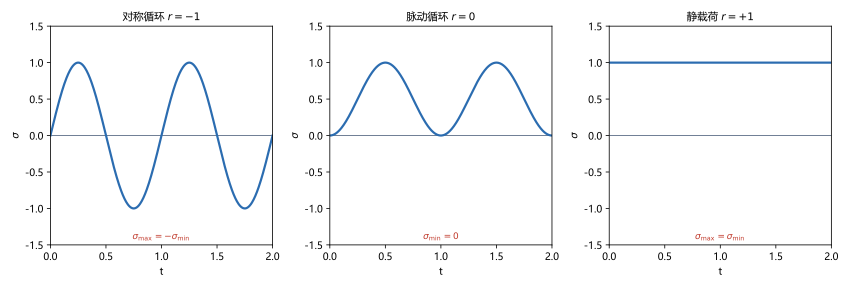
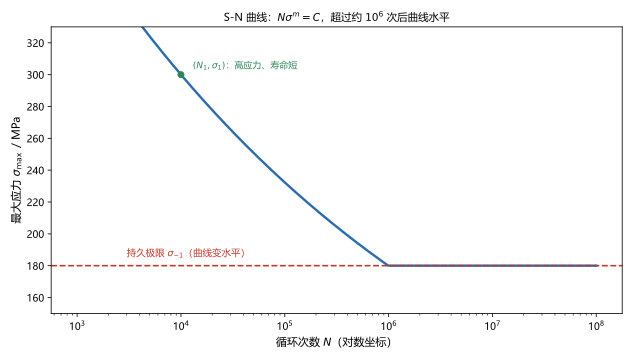
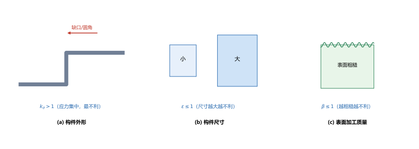

# 第 21 讲：交变应力与疲劳强度

> **前置**：第 03 讲（强度条件）、第 09/16 讲（弯曲与组合变形的应力）、第 20 讲（动载荷：载荷"在动"）。
> **预计时间**：约 3 小时（含作业）。
>
> **一句话定位**：第 20 讲是"载荷在动"，本讲是"载荷**反复**变"——**交变应力**。在这种反复作用下，构件会在**应力远低于强度极限**时突然断裂，叫**疲劳破坏**。本讲给出应力循环的描述（循环特征 $r$）、S-N 曲线与**持久极限** $\sigma_{-1}$，以及从材料到构件的三类**修正系数**和疲劳强度校核。
>
> **本讲回答什么**：
> 1. 为什么应力远低于强度极限也会断？疲劳破坏有什么特征？
> 2. 交变应力怎么描述？S-N 曲线为什么在某个应力后就水平了？
> 3. 材料的持久极限与构件的持久极限为什么不一样？怎么校核？
>
> **这一讲有真实验证**：循环特征（对称 $-1$、脉动 $0$、静载 $+1$）、平均应力与应力幅的分解与回代互证、S-N 幂律 $N\sigma^m=C$ 的双路计算、构件持久极限的三系数修正、疲劳校核（脚本 `scripts/lec21-01_verify_fatigue.py`）；另有三种应力循环、S-N 曲线、三个影响系数三张图（`figures/`）。

---

## 引子：一根"绰绰有余"的轴，转了几百万转就断了

一根转轴，按第 09 讲算出的最大弯曲正应力 $\sigma_{\max}=60\ \mathrm{MPa}$，而材料的强度极限 $\sigma_b=600\ \mathrm{MPa}$——**安全系数 10，怎么看都没问题**。

可是转轴每转一圈，截面上的某一点就要经历一次"**受拉 → 受压 → 受拉**"的循环。转了 $10^7$ 圈之后，这根轴**在应力只有 $\sigma_b$ 的十分之一时就断了**。

这就是**疲劳破坏**。它不遵守前面所有讲的强度条件——因为那些条件针对的都是**静载荷或一次加载**。

---

## 1. 疲劳破坏的特征

**疲劳**：构件在**交变应力**长期作用下，应力远低于强度极限时发生的突然断裂。

### 1.1 三个特征

1. **应力远低于 $\sigma_b$（甚至低于 $\sigma_s$）**——**不能用静强度条件解释**；
2. **需要一定循环次数**——不是一次就断，而是经历 $10^4\sim10^7$ 次不等的循环；
3. **断口有独特的两个区**：
   - **光滑区**：裂纹**萌生并缓慢扩展**留下的痕迹（表面被反复摩擦挤压而光亮）；
   - **粗糙区（晶粒状/纤维状）**：最后**突然断裂**的断面。

### 1.2 为什么应力低也会断

**裂纹的萌生与扩展**：交变应力在**应力集中处**（缺口、圆角、表面划痕、夹杂）反复"启闭"微裂纹，使其**逐步扩展**。当剩余截面不足以承受载荷时，构件**突然断裂**。

> **为什么"反复"才危险**：一次加载时，微裂纹张开后不会继续扩展（或很快被压合）；反复加载则每次都推动裂纹前端前进一点点——**累积**到临界尺寸就断。所以疲劳本质上是**损伤累积**过程，不是"当次应力够不够"的问题。

---

## 2. 交变应力与应力循环

一个**应力循环**由两个数描述：最大应力 $\sigma_{\max}$ 与最小应力 $\sigma_{\min}$（代数值）。

**循环特征**：

$$\boxed{r = \frac{\sigma_{\min}}{\sigma_{\max}}},$$

同时分解出**平均应力**与**应力幅**：

$$\sigma_m = \frac{\sigma_{\max}+\sigma_{\min}}{2},\qquad \sigma_a = \frac{\sigma_{\max}-\sigma_{\min}}{2}.$$

（脚本 EXP2）$\sigma_{\max}=120$、$\sigma_{\min}=-40$：$\sigma_m=40$、$\sigma_a=80$。**回代互证**：$\sigma_m+\sigma_a=120=\sigma_{\max}$、$\sigma_m-\sigma_a=-40=\sigma_{\min}$ ✓。

### 2.1 三种典型循环

| 类型 | 特征 | 循环特征 $r$ |
|---|---|---|
| **对称循环** | $\sigma_{\max}=-\sigma_{\min}$，$\sigma_m=0$ | $r=-1$ |
| **脉动循环** | $\sigma_{\min}=0$，$\sigma_m=\sigma_a=\dfrac{\sigma_{\max}}{2}$ | $r=0$ |
| **静载荷** | $\sigma_{\max}=\sigma_{\min}$，$\sigma_a=0$ | $r=+1$ |

> **图 1 怎么读**：(a) 对称循环（$r=-1$）：应力在两个方向等幅交替，平均应力为零；(b) 脉动循环（$r=0$）：在 0 与最大值之间往返；(c) 静载荷（$r=+1$）：应力恒定。

（脚本 EXP1）四组数据核对：$(100,-100)\to r=-1.00$、$(100,0)\to r=0.00$、$(100,50)\to r=0.50$、$(100,100)\to r=1.00$。

> **$r$ 从 $-1$ 到 $+1$**：越接近 $-1$，越"对称、越危险"；到 $+1$ 就是静载（无疲劳问题）。

---

## 3. S-N 曲线与持久极限

### 3.1 S-N 曲线

对一批同样的试件，施加**不同应力水平**的交变载荷，记录**断裂前的循环次数 $N$**，把（$\sigma$，$N$）画在**半对数坐标**（$N$ 取对数）上，得到 **S-N 曲线**（疲劳曲线）。

实验规律：**应力越低，寿命越长**。常用幂律拟合：

$$N\,\sigma^m = C\quad\Longrightarrow\quad \sigma = \left(\frac{C}{N}\right)^{1/m},$$

其中 $m$、$C$ 是材料常数（钢材 $m\approx 9$）。

（脚本 EXP3）取 $m=9$、已知 $\sigma_1=300\ \mathrm{MPa}$ 时 $N_1=10^4$：

$$\sigma_2 = 300\times\left(\frac{10^4}{10^6}\right)^{1/9}=179.85\ \mathrm{MPa}.$$

**双路核对**：由 $C=\sigma_1^mN_1=1.9683\times10^{26}$ 反算 $\sigma_2=(C/N_2)^{1/9}=179.85$——**两路一致**。

### 3.2 持久极限

对钢材，S-N 曲线在 $N$ 超过约 $10^6$（~$10^7$）后**趋于水平**——说明存在一个"**低于它就永不疲劳断裂**"的应力水平，叫**持久极限**（疲劳极限）：

$$\boxed{\sigma_{-1}}\qquad(\text{对称循环下，}r=-1).$$

> **图 2 怎么读**：横轴是循环次数（**对数坐标**）、纵轴是最大应力。曲线随时间下降，到约 $10^6$ 次后**变水平**——水平段对应的应力就是持久极限 $\sigma_{-1}$。

**关键性质**：**只要工作应力不超过持久极限，构件就不会疲劳破坏**——这就是"无限寿命设计"的依据。

> **为什么会有水平段**：应力太低时，微裂纹前端的驱动力不足以推动它继续扩展——裂纹"停住"了。所以低于 $\sigma_{-1}$ 的循环次数理论上**无限**。

---

## 4. 材料的持久极限与构件的持久极限

### 4.1 两者为什么不同

S-N 曲线测的是**光滑小试件**（标准试样）。实际构件与它有三点不同：

1. **有应力集中**（缺口、键槽、圆角、螺纹）；
2. **尺寸更大**；
3. **表面状态不同**（粗糙、加工痕迹、腐蚀）。

这三点都会**降低**疲劳强度——所以要**逐项修正**。

### 4.2 三个修正系数

$$\boxed{(\sigma_{-1})_{\text{构件}} = \sigma_{-1}\cdot\frac{\varepsilon\,\beta}{k_\sigma}},$$

| 系数 | 名称 | 典型值 | 物理含义 |
|---|---|---|---|
| $k_\sigma$ | **有效应力集中系数** | $>1$ | 缺口处的应力峰值，**最不利的因素**（在分母） |
| $\varepsilon$ | **尺寸系数** | $\le1$ | 尺寸越大，缺陷概率越高、疲劳强度越低 |
| $\beta$ | **表面质量系数** | $\le1$ | 表面越粗糙/有加工损伤，疲劳强度越低 |

> **图 3 怎么读**：(a) 构件外形（缺口/圆角）→ 有效应力集中系数 $k_\sigma>1$，是**分母**（最不利）；(b) 构件尺寸 → 尺寸系数 $\varepsilon\le1$；(c) 表面加工质量 → 表面质量系数 $\beta\le1$。

（脚本 EXP4）$\sigma_{-1}=250\ \mathrm{MPa}$、$k_\sigma=2.0$、$\varepsilon=0.8$、$\beta=0.85$：

$$(\sigma_{-1})_{\text{构件}} = 250\times\frac{0.8\times0.85}{2.0}=85.00\ \mathrm{MPa}.$$

> **注意**：**材料的** $\sigma_{-1}=250$ MPa 修正到**构件**只剩 **85 MPa**——**降到 1/3 都不到**。这解释了为什么"按材料数据算够、实际却疲劳断裂"很常见：**构件与试件不是一回事**。

---

## 5. 对称循环下的疲劳强度校核

工程上最常见的是**对称循环**（转轴就是典型）。校核采用**安全系数法**：

$$\boxed{n = \frac{(\sigma_{-1})_{\text{构件}}}{\sigma_{\max}} \ge [n]},$$

（对称循环下 $\sigma_{\max}=\sigma_a$，所以也可写成 $n=\dfrac{(\sigma_{-1})_{\text{构件}}}{\sigma_a}$。）

安全系数 $[n]$ 通常取 **$1.4\sim1.8$**（比静强度安全系数大，因为疲劳是突然破坏且影响因素多）。

（脚本 EXP5）$(\sigma_{-1})_{\text{构件}}=85\ \mathrm{MPa}$、$[n]=1.5$：

- 若工作应力幅 $\sigma_a=50\ \mathrm{MPa}$：$n=\dfrac{85}{50}=1.700\ge1.5$，**安全**；
- 若 $\sigma_a=70\ \mathrm{MPa}$：$n=\dfrac{85}{70}=1.214<1.5$，**不合格**。

> **与静强度校核的差别**：静强度比的是"**极限应力/工作应力**"；疲劳校核比的是"**修正后的持久极限/工作应力幅**"——**多了一道"从材料到构件"的修正工序**（第 4 节），且安全系数通常更大。

---

## 6. 提高疲劳强度的措施

从 $(\sigma_{-1})_{\text{构件}}=\sigma_{-1}\dfrac{\varepsilon\beta}{k_\sigma}$ 出发，四条：

1. **降低应力集中（最有效）**：$k_\sigma$ 在**分母**——加大圆角半径、避免尖角缺口、键槽与螺纹处用卸载槽、孔边倒圆。**优先改 $k_\sigma$**；
2. **提高表面质量**：精加工、抛光、避免车刀痕迹与碰伤（提高 $\beta$）；进一步可用**表面强化**（喷丸、滚压、表面淬火、渗碳），使表层产生**残余压应力**，能显著提高疲劳强度（比单纯提高 $\beta$ 更有效）；
3. **选疲劳强度高的材料**：$(\sigma_{-1})$ 与 $\sigma_b$ 大致同向（钢材 $\sigma_{-1}\approx0.4\sim0.5\sigma_b$）——比第 17 讲的稳定性好，**疲劳问题换材料是有效的**；
4. **避免腐蚀与温度等环境损伤**：腐蚀会大幅降低疲劳强度。

> **一句话**：**疲劳裂纹从表面和应力集中处起——所以"改外形 + 改表面"就是最直接的两招**。

---

## 7. 本讲的心智模型

把这一讲压缩成一条主线：

> **疲劳题 = 算交变应力（$\sigma_{\max}$、$\sigma_{\min}$、$r$、$\sigma_a$）→ 从 S-N 曲线取材料持久极限 $\sigma_{-1}$ → 用三个系数修正成构件持久极限 → $n=\dfrac{(\sigma_{-1})_{\text{构件}}}{\sigma_a}\ge[n]$。**

遇到一道题，按这个顺序走：

1. **判断是否疲劳问题**：载荷是否**反复**（$r\ne+1$）？循环次数是否很高（$>10^4$）？
2. **算循环参数**：$\sigma_{\max}$、$\sigma_{\min}$、$\sigma_m$、$\sigma_a$、$r$；
3. **取材料持久极限**：查材料手册或 S-N 曲线（对称循环取 $\sigma_{-1}$；一般循环需先转换到等效对称循环）；
4. **修正成构件持久极限**：$\dfrac{\varepsilon\beta}{k_\sigma}$；
5. **校核**：$n\ge[n]$（$[n]=1.4\sim1.8$）。

---

## 8. 小结

- **疲劳破坏**：交变应力长期作用下、应力**远低于** $\sigma_b$ 时的突然断裂；需要一定循环次数；断口有**光滑区 + 粗糙区**。
- **交变应力的描述**：$\sigma_{\max}$、$\sigma_{\min}$、**循环特征** $r=\dfrac{\sigma_{\min}}{\sigma_{\max}}$、$\sigma_m$、$\sigma_a$；**对称循环** $r=-1$、**脉动循环** $r=0$、**静载** $r=+1$。
- **S-N 曲线** $N\sigma^m=C$（半对数坐标）；超过约 $10^6$ 次后**变水平**，水平段对应**持久极限** $\sigma_{-1}$——低于它就不疲劳破坏。
- **材料 vs 构件**：$(\sigma_{-1})_{\text{构件}}=\sigma_{-1}\dfrac{\varepsilon\beta}{k_\sigma}$；$k_\sigma>1$（应力集中，最不利）、$\varepsilon\le1$（尺寸）、$\beta\le1$（表面质量）。
- **对称循环校核**：$n=\dfrac{(\sigma_{-1})_{\text{构件}}}{\sigma_a}\ge[n]$，$[n]=1.4\sim1.8$。
- **提高疲劳强度**：降低应力集中（最有效）→ 提高表面质量/表面强化 → 选高疲劳强度材料 → 防腐蚀。

---

## 9. 作业

### 基础

**Q1. 概念**：为什么应力远低于强度极限，构件还会疲劳断裂？疲劳断口为什么分"光滑区"和"粗糙区"？

**参考答案**：

**机理**：交变应力在应力集中处反复"启闭"微裂纹，每次都推动裂纹前端前进一点，**损伤逐步累积**；剩余截面不足时突然断裂。所以疲劳不是"当次应力是否够"的问题，而是**累积损伤**问题。
**断口两区**：**光滑区**是裂纹**缓慢扩展**阶段反复摩擦挤压形成的；**粗糙区**是最后**突然撕裂**的断面。看见"光滑区+粗糙区"就是疲劳断裂的判据。
验算（自检方向）：静载断口是单一粗糙断面或明显颈缩，与疲劳断口形态不同。

**Q2. 循环参数**：某点 $\sigma_{\max}=150\ \mathrm{MPa}$、$\sigma_{\min}=-50\ \mathrm{MPa}$。求 $r$、$\sigma_m$、$\sigma_a$。

**参考答案**：

$r=\dfrac{\sigma_{\min}}{\sigma_{\max}}=\dfrac{-50}{150}=-0.333$；
$\sigma_m=\dfrac{150+(-50)}{2}=50\ \mathrm{MPa}$；$\sigma_a=\dfrac{150-(-50)}{2}=100\ \mathrm{MPa}$。
验算：$\sigma_m+\sigma_a=150=\sigma_{\max}$ ✓；$\sigma_m-\sigma_a=-50=\sigma_{\min}$ ✓。

**Q3. 概念**：材料的持久极限与构件的持久极限为什么不同？三个修正系数各在分子还是分母？

**参考答案**：

**不同**：S-N 曲线测的是**光滑小试件**；实际构件有**应力集中**、**尺寸更大**、**表面状态差**，这三点都降低疲劳强度。
**系数位置**：$(\sigma_{-1})_{\text{构件}}=\sigma_{-1}\dfrac{\varepsilon\beta}{k_\sigma}$——**$k_\sigma$（有效应力集中系数）在分母**（唯一大于 1 的量，最不利）；$\varepsilon$（尺寸系数）、$\beta$（表面质量系数）在分子（均不大于 1）。
验算：本讲 EXP4 中材料值 250 MPa 修正后只剩 85 MPa。

### 提高

**Q4. 构件持久极限**：$\sigma_{-1}=300\ \mathrm{MPa}$、$k_\sigma=1.6$、$\varepsilon=0.78$、$\beta=0.9$。求构件的持久极限。

**参考答案**：

$(\sigma_{-1})_{\text{构件}}=300\times\dfrac{0.78\times0.9}{1.6}=300\times\dfrac{0.702}{1.6}=131.63\ \mathrm{MPa}$。
验算：$\dfrac{131.63}{300}=0.4388$，即修正后降到材料的 43.9%——与"构件远差于试件"的定性一致。

**Q5. 疲劳校核**：Q4 的构件，工作应力幅 $\sigma_a=90\ \mathrm{MPa}$，$[n]=1.6$。校核（对称循环）。

**参考答案**：

$n=\dfrac{(\sigma_{-1})_{\text{构件}}}{\sigma_a}=\dfrac{131.63}{90}=1.4625<1.6$，**不合格**。
改进方向：加大圆角（降 $k_\sigma$）、表面强化（提高 $\beta$）、或降低工作应力。
验算：若要 $n\ge1.6$，需 $(\sigma_{-1})_{\text{构件}}\ge90\times1.6=144\ \mathrm{MPa}$，即需在现有基础上再提高约 9.4%。

**Q6. 概念**：为什么"尺寸越大，疲劳强度越低"？

**参考答案**：

两个原因：① **缺陷概率**——体积越大，含有夹杂、气孔、微裂纹等**危险缺陷**的概率越高，最弱环节更弱；② **应力梯度**——大尺寸构件中，表层高应力区的**体积更大**（受高应力作用的材料更多），更容易萌生裂纹。
所以尺寸系数 $\varepsilon\le1$，且随尺寸增大而减小。
验算（自检方向）：这与第 17 讲"提高稳定性"里"尺寸影响不大"是不同机制——那里看的是几何刚度，这里看的是**材料缺陷统计**。

### 综合

**Q7. 完整校核**：转轴某危险点 $\sigma_{-1}=280\ \mathrm{MPa}$、$k_\sigma=1.8$、$\varepsilon=0.8$、$\beta=0.85$，工作应力幅 $\sigma_a=60\ \mathrm{MPa}$（对称循环），$[n]=1.5$。校核疲劳强度。

**参考答案**：

$(\sigma_{-1})_{\text{构件}}=280\times\dfrac{0.8\times0.85}{1.8}=280\times\dfrac{0.68}{1.8}=105.78\ \mathrm{MPa}$；
$n=\dfrac{105.78}{60}=1.763\ge1.5$，**安全**。
验算：余量 $\dfrac{1.763-1.5}{1.5}=17.5\%$；若 $\sigma_a$ 提高到 70 MPa，$n=1.511$ 就接近下限——说明疲劳设计的余量要留足。

**Q8. 开放简答**：提高构件疲劳强度的措施有哪些？哪一条最有效、为什么？

**参考答案**：

① **降低应力集中**（加大圆角、去尖角、卸载槽）：$k_\sigma$ 在**分母**且通常 $1.5\sim3$，直接改动即大幅提升；
② **提高表面质量 / 表面强化**（精加工、抛光、喷丸、滚压、表面淬火、渗碳）：提高 $\beta$ 并在表层引入**残余压应力**，可显著提高疲劳强度；
③ **选疲劳强度高的材料**：$\sigma_{-1}\approx(0.4\sim0.5)\sigma_b$，换材料有效（与第 17 讲"换材料对稳定性无用"形成对比）；
④ **防腐蚀、避免碰伤与温度损伤**。
**最有效的是 ①**：因为疲劳裂纹几乎总从**应力集中处**的**表面**萌生——先掐掉萌生源，收益最大、成本最低；②是它的直接补充（同属"表面工程"）。
验算（自检方向）：④ 条分别作用在公式 $(\sigma_{-1})_{\text{构件}}=\sigma_{-1}\varepsilon\beta/k_\sigma$ 的四个量上，其中 $k_\sigma$ 的典型变化幅度最大，故 ① 收益最高。

---

*下一讲预告——第 22 讲《与后续的接口》（本课末讲）：到这里，材料力学的主干就讲完了——静强度、刚度、稳定性、复杂应力、能量法与超静定、动载荷与疲劳。末讲不再讲新公式，而是给出一张"**地图**"：这门课的三条基本假设（连续、均匀、各向同性）与平面假设、小变形假设，在下游的**结构力学、弹性力学、塑性力学、有限元法、断裂力学**里分别是怎么被"松绑"的；以及遇到更复杂的工程问题时，该往哪个方向继续学。*