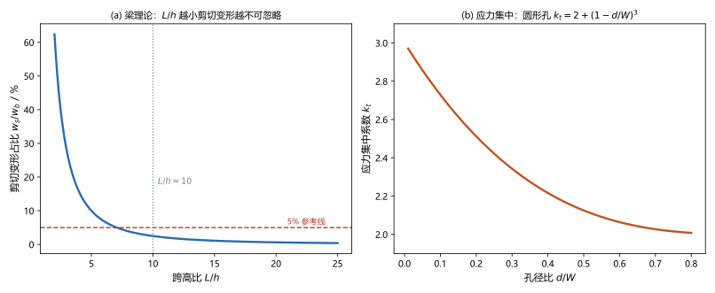
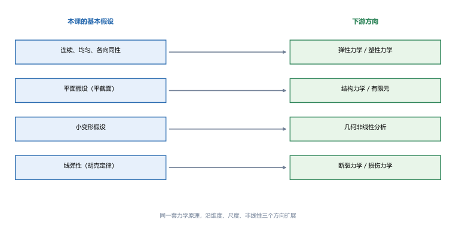
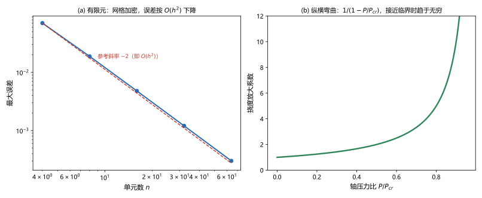

# 第 22 讲：与后续的接口

> **前置**：全课程 01–21 讲。
> **预计时间**：约 2 小时（含作业）。
>
> **一句话定位**：这是**末讲**，不再引入新公式。它回答一个学完后必然要问的问题：**"这套课用的假设，在什么问题上会不够用？不够用了该往哪里去？"** 本讲把材料力学放进"变形体力学"的整体图景里，给出**假设 → 松绑方向**的对应关系，并用**可量化的数字**说明每条假设在哪里开始失效。
>
> **本讲回答什么**：
> 1. 本课的基本假设，在哪些问题上会失效？失效的**临界量级**是多少？
> 2. 结构力学、弹性力学、塑性力学、有限元法、断裂力学与材料力学是什么关系？
> 3. 要深入某个方向，该从哪接着学？
>
> **这一讲有真实验证**：梁理论适用边界（剪切变形占比随跨高比变化的**细长界限**）、应力集中（均匀假设失效，峰值应力是均匀估计的 **3.35 倍**）、纵横弯曲放大系数（小变形/线性叠加失效，$P/P_{cr}=0.9$ 时放大 **10 倍**）、有限元收敛（离散逼近连续场，误差按 $O(h^2)$ 下降）（脚本 `scripts/lec22-01_verify_interfaces.py`）；另有假设-松绑地图、两条假设的失效边界、有限元收敛与纵横弯曲放大三张图（`figures/`）。

---

## 引子：这门课其实一直在"用假设换简单"

回头看整个课程，每一讲都在做同一件事：**用一组假设，把问题简化到可以手算**。

- "平截面假设" → 弯曲正应力能写成 $\sigma=\dfrac{My}{I_z}$（第 09 讲）；
- "小变形假设" → 挠曲线能近似成 $w''\approx\dfrac{1}{\rho}$（第 11 讲），叠加原理能用（第 08、16 讲）；
- "连续、均匀、各向同性" → 一个 $E$、一个 $\mu$ 就描述材料（第 14 讲）；
- "线弹性" → 应力与应变成正比（第 03 讲）。

这些假设**不是永远成立**的。本讲要做的，是把"它们在哪儿开始不成立"讲清楚，并给出**量级**。

---

## 1. 假设的边界：四条假设在哪里失效

### 1.1 平面假设（梁理论）——跨高比的界限

第 09–11 讲的梁理论（Euler–Bernoulli）**完全忽略了剪切变形**。考虑剪切后（Timoshenko 梁，认识层），简支梁受均布载荷的挠度会多出一项，剪切变形与弯曲变形之比约为

$$\frac{w_s}{w_b}\approx 11.52\,\frac{I}{AL^2}\cdot\frac{E}{G}\quad(\text{矩形截面}).$$

对矩形截面（$\mu=0.3$）代入 $I/A=\dfrac{h^2}{12}$、$E/G=2(1+\mu)=2.6$：

（脚本 EXP1）

| 跨高比 $L/h$ | $20$ | $10$ | $5$ | $2$ |
|---|---|---|---|---|
| $w_s/w_b$ | $0.62\%$ | $2.50\%$ | $9.98\%$ | $62.40\%$ |

> **结论**：**$L/h\ge10$ 时剪切影响小于 3%**——这就是工程上"细长梁"的经验界限，也是本课$L/h$ 较大的例题都能直接用梁理论的原因。**一旦 $L/h$ 降到 5 以下（短粗梁），剪切变形不可忽略**，必须换 Timoshenko 梁或直接做三维分析（弹性力学/有限元）。

### 1.2 连续、均匀、各向同性——应力集中

第 09 讲的弯曲正应力沿截面**线性**分布，前提是"材料连续均匀、截面无突变"。但如果构件上有**孔、缺口、圆角**呢？

以带中心圆孔的有限宽受拉板为例（认识层，Heywood 近似）：

$$k_t = 2+\left(1-\frac{d}{W}\right)^3.$$

（脚本 EXP2）$W=100\ \mathrm{mm}$、$d=30\ \mathrm{mm}$、$t=10\ \mathrm{mm}$、$P=100\ \mathrm{kN}$：

$$k_t=2.343,\quad \sigma_{net}=\frac{P}{(W-d)t}=142.86\ \mathrm{MPa},\quad \sigma_{\max}=k_t\sigma_{net}=334.71\ \mathrm{MPa}.$$

而按"均匀假设"估算是 $\dfrac{P}{Wt}=100\ \mathrm{MPa}$——**峰值是它的 3.35 倍**。

> **结论**：**平均应力永远低估峰值应力**。孔边、缺口根部的真实应力可达平均值的 3 倍以上——这是第 21 讲疲劳裂纹总从"应力集中处"萌生的直接原因，也是"均匀假设"最常被打破的地方。

### 1.3 小变形与线性叠加——纵横弯曲

第 16 讲用"分解 + 叠加"处理组合变形，前提是**小变形**。但如果构件**同时受压和受弯**（纵横弯曲/梁柱），轴向压力会把横向挠度**放大**：

$$w = \frac{w_0}{1-P/P_{cr}},$$

其中 $w_0$ 是纯横向载荷下的挠度，$P_{cr}$ 是第 17 讲的欧拉临界力。

> **图 2 怎么读**：(a) 剪切变形占比随跨高比下降而急剧上升，$L/h=10$ 处约 2.5%；(b) 应力集中系数随孔径比变化——孔越小越接近无限宽板的 $k_t=3$。

（脚本 EXP3）

| $P/P_{cr}$ | $0$ | $0.25$ | $0.5$ | $0.75$ | $0.9$ |
|---|---|---|---|---|---|
| 放大系数 | $1.000$ | $1.333$ | $2.000$ | $4.000$ | $10.000$ |

> **结论**：轴压力达到临界力的 **一半**，挠度就翻倍；到 **90%**，放大 **10 倍**。**此时"分解 + 叠加"完全失效**——压力与弯曲强烈耦合，必须用非线性（几何非线性）方法。

### 1.4 线弹性——塑性力学与断裂力学

到第 15 讲的强度理论为止，都假设"应力不超过弹性范围"。一旦进入**塑性**：

- 应力-应变不再成正比，**叠加原理失效**（第 16 讲的前提没了），力法（第 19 讲）也不再线性；
- 但塑性变形能**重分布应力**（塑性铰、极限承载）——这是**塑性力学/塑性极限分析**的内容，重要结论是"**按弹性算的峰值应力未必危险**"；
- 若构件已有裂纹，问题从"应力是否超限"变成"**裂纹是否会扩展**"——这是**断裂力学**（用应力强度因子 $K$、断裂韧度 $K_{IC}$），与第 21 讲疲劳（裂纹缓慢扩展）互为补充。

---

## 2. 下游地图：从材料力学到变形体力学

> **图 1 怎么读**：左边是本课四条基本假设，右边是"松绑"它们的下游方向——同一套力学原理（平衡 + 几何 + 本构）沿**维度、尺度、非线性**三个方向扩展。

| 下游方向 | 与本课的关系 | 松绑了什么 | 典型问题 |
|---|---|---|---|
| **结构力学** | 把第 12、19 讲的超静定**系统化**——用矩阵方法统一处理梁、刚架、桁架 | 不松绑假设，改**换工具**（矩阵位移法） | 多层刚架内力、影响线 |
| **弹性力学** | 不再假设"平截面"与"杆件"，直接解三维（或二维）连续体的平衡、几何、本构方程 | **平面假设**、**杆件简化** | 孔边应力、接触问题、厚壁筒 |
| **塑性力学** | 把本构关系从线弹性换成塑性 | **线弹性** | 极限承载、成形、安定性 |
| **有限元法** | 把连续体**离散**成有限个单元，用计算机求解——第 18 讲的能量原理是它的理论基础 | **解析可解性**（改数值） | 任意复杂结构 |
| **断裂力学** | 研究**已有裂纹**的扩展条件 | **材料连续性** | 裂纹扩展、剩余寿命 |
| **疲劳（第 21 讲）** | 交变载荷下的损伤累积 | **单次加载** | 转轴、焊接节点 |
| **实验应力分析** | 用电测、光弹、数字图像等方法**实测**应力 | 不依赖解析解 | 实测验证、复杂构件 |

---

## 3. 有限元是不是把材料力学替代了？

这是学完后最常出现的疑问。答案：**不是替代，是"两层的分工"**。

**有限元做的是"算得更精细"，材料力学做的是"判断得更快"**：

1. **有限元也需要本构关系**——里面用的 $E$、$\mu$、$[\sigma]$、强度理论、疲劳判据，**全都是本课的内容**；
2. **有限元的输出是"数字"，判断仍是"本课的事"**——机器给出应力场，但"这个数危不危险"要靠第 15 讲的强度理论、第 17 讲的稳定判据、第 21 讲的疲劳曲线；
3. **手算估计仍然是第一道关口**——工程师先用手算估出量级与危险位置，再用有限元精算；不会手算的人，**无法判断有限元结果是否合理**。

**有限元的数学基础正是本课第 18 讲**：它把结构的总势能写成节点位移的函数，令其对位移的变分为零（等价于 $\dfrac{\partial V}{\partial F}$ 的思路），得到线性方程组——**与你第 19 讲解正则方程的过程，本质是同一件事，只是规模从 2 个未知数变成 $10^5$ 个**。

> **图 3 怎么读**：(a) 有限元的误差随单元加密按 $O(h^2)$ 下降（双对数坐标下斜率 $-2$）——**网格越细越准，但要付出计算量代价**；(b) 纵横弯曲放大系数 $1/(1-P/P_{cr})$ 在接近临界力时急剧发散。

（脚本 EXP4）用线性单元插值 $\sin(\pi x)$（代表"离散逼近连续场"）：

| 单元数 $n$ | $4$ | $8$ | $16$ | $32$ |
|---|---|---|---|---|
| 最大误差 | $0.07038$ | $0.01885$ | $0.00479$ | $0.00120$ |
| 误差比（相邻两级） | — | $3.73$ | $3.93$ | $3.98$ |

误差比**趋近于 4**，即单元加密一倍、误差降到 $1/4$——这就是 $O(h^2)$ 收敛。它说明**离散化误差是可控制的**，这正是有限元能放心用于工程的原因。

---

## 4. 接口清单：想深入某方向，从哪接着学

| 你想解决的问题 | 需要的工具 | 建议的下一步 |
|---|---|---|
| 多层刚架、连续梁的内力与位移 | 矩阵位移法（与第 19 讲力法互补） | 《结构力学》后半（位移法、矩阵分析） |
| 孔边、接触、厚壁构件的精确应力 | 三维/二维连续体方程 | 《弹性力学》 |
| 结构进入塑性的承载能力 | 塑性本构与极限分析 | 《塑性力学》 |
| 任意复杂结构的应力/位移 | 离散化 + 计算机求解 | 《有限元法》（重点：第 18 讲能量原理是其基础） |
| 已有裂纹会不会扩展 | 应力强度因子、断裂韧度 | 《断裂力学》 |
| 交变载荷下的寿命 | S-N、损伤累积（第 21 讲已有入门） | 《疲劳与断裂》 |
| 实验验证 | 应变片、光弹、DIC | 《实验力学》 |
| 温度、时间相关的变形（蠕变、粘弹性） | 本构关系扩展 | 《粘弹性力学》 |

> **选择原则**：**先问"是哪条假设不够用了"**——平面假设不够→弹性力学；线弹性不够→塑性力学；解析解求不出→有限元；材料不连续→断裂力学。**问题决定方向**。

---

## 5. 全课程回顾：一条主线与三根支柱

把 22 讲串起来看，这门课的组织结构是清楚的：

### 5.1 一条主线

> **取构件 → 求内力（截面法）→ 求应力（几何+物理+静力三步）→ 求变形（积分/叠加/能量）→ 判危险（强度/刚度/稳定/疲劳）**

这条主线在**拉压、剪切、扭转、弯曲**四种基本变形里各走了一遍（第 02–11 讲），然后：

- **截面几何**（第 07 讲）为它提供 $A$、$I_z$、$W_z$、$i$ 等"几何量"；
- **应力状态与强度理论**（第 13–15 讲）把"一点"的复杂应力归一到**相当应力**；
- **超静定**（第 12、19 讲）解决"方程不够"的结构；
- **组合变形**（第 16 讲）把几种基本变形"分解 + 叠加"；
- **压杆稳定**（第 17 讲）处理另一种失效机制；
- **能量法**（第 18 讲）换一套工具求位移、并支撑力法；
- **动载荷与疲劳**（第 20–21 讲）处理"动的"和"反复的"载荷。

### 5.2 三根支柱

| 支柱 | 内容 | 代表讲次 |
|---|---|---|
| **三项基本关系** | 平衡（静力）、几何（变形协调）、物理（本构） | 贯穿全课；第 03、09、13、14 讲最典型 |
| **两类判据** | 强度（会不会坏）与刚度（变形超不超限） | 第 03、06、11 讲；稳定与疲劳是补充 |
| **两种工具** | 解析法（微分/积分）与能量法 | 第 11 讲 vs 第 18 讲 |

> **这三根支柱在下游全都保留**——变的只是"假设放宽多少、方程复杂多少"。**这就是为什么材料力学是变形体力学的入门课**。

---

## 6. 本讲的心智模型

把这一讲压缩成一条主线：

> **遇到本课解决不了的问题，先问"是哪条假设不够用了"**：平截面不够→弹性力学；小变形不够→几何非线性；线弹性不够→塑性力学；材料连续不够→断裂力学；解析解求不出→有限元。**问题决定方向**。

遇到一个"超出范围"的问题，按这个顺序走：

1. **定位失效的假设**：平面假设？小变形？线弹性？连续性？
2. **判断量级**：是否真的超出（如 $L/h\ge10$ 仍可用梁理论、孔边 $k_t$ 是否可查表修正）；
3. **选择工具**：能修正的修正（应力集中系数、动荷系数、疲劳系数都是"在本课框架内修正"）；不能修正的换体系；
4. **保持对结果的判断力**：无论用什么工具，**平衡、几何、本构三条关系与两类判据永远是你判断结果合理性的依据**。

---

## 7. 小结

- **本课的四条基本假设**及各自的失效边界：**平面假设**（$L/h<10$ 时剪切变形不可忽略，$L/h=5$ 已近 10%）；**连续均匀各向同性**（孔边峰值应力可达均匀估计的 **3 倍以上**）；**小变形**（轴压达 $0.5P_{cr}$ 时挠度翻倍、$0.9P_{cr}$ 时放大 10 倍）；**线弹性**（进入塑性后叠加失效）。
- **下游地图**：结构力学（超静定系统化）、弹性力学（松绑平面假设与杆件简化）、塑性力学（松绑线弹性）、有限元法（连续体离散）、断裂力学（已有裂纹）、疲劳（第 21 讲）、实验应力分析。同一套力学原理沿**维度、尺度、非线性**扩展。
- **有限元不替代材料力学**：有限元用本课的本构与判据、以第 18 讲能量原理为数学基础；**手算估计仍是判断有限元结果合理性的前提**。
- **误差可控**：有限元离散误差按 $O(h^2)$ 下降（实测误差比趋近 4）。
- **全课主线**：取构件 → 求内力 → 求应力 → 求变形 → 判危险；**三根支柱**是三项基本关系、两类判据、两种工具。
- **选方向的准则**：先问"哪条假设不够用了"，**问题决定方向**。

---

## 8. 作业

### 基础

**Q1. 概念**：本课用了哪四条基本假设？各自对应哪一类"松绑"它的下游方向？

**参考答案**：

① **平面假设（平截面）** → 松绑方向：**弹性力学**（直接解连续体，不再假设平截面）；
② **连续、均匀、各向同性** → 松绑方向：**弹性力学 / 塑性力学 / 断裂力学**（各向异性材料、含缺陷材料）；
③ **小变形假设** → 松绑方向：**几何非线性分析**（纵横弯曲、大挠度）；
④ **线弹性（胡克定律）** → 松绑方向：**塑性力学 / 粘弹性力学**。
补充：**杆件简化**（一维构件）也在弹性力学/有限元里被松绑（变为三维或一般结构）。
验算（自检方向）：每条假设都能对上一类"它不成立时的现象"——这就是判据。

**Q2. 数值**：矩形截面梁 $L/h=8$、$\mu=0.3$。求剪切变形占弯曲变形的比例。

**参考答案**：

$\dfrac{w_s}{w_b}\approx 11.52\dfrac{I}{AL^2}\cdot\dfrac{E}{G}=11.52\times\dfrac{h^2}{12L^2}\times2(1+\mu)=2.496\left(\dfrac{h}{L}\right)^2$；
代入 $h/L=1/8$：$2.496\times\dfrac{1}{64}=0.0390=3.90\%$。
验算：$L/h=8$ 介于 5（9.98%）与 10（2.50%）之间，$3.90\%$ 合理 ✓。

**Q3. 概念**：有限元法是不是可以取代材料力学？说明两者在工程流程中的分工。

**参考答案**：

**不能取代，是两层分工**：
① 有限元内部用的**本构关系**（$E$、$\mu$）与**判据**（$[\sigma]$、强度理论、稳定、疲劳）**全部来自材料力学**；
② 有限元输出的是一堆**数字**，判断"危不危险、哪里危险"仍是材料力学的任务；
③ **手算估计是使用有限元的前提**——先用本课方法估算量级与危险位置，才能判断有限元结果是否合理（网格误差、边界条件设置错误都可能给出"看起来很合理"的错值）。
验算（自检方向）：有限元的数学基础是第 18 讲的能量原理——它用的是本课的工具，不是替代品。

### 提高

**Q4. 假设定位**：下列问题分别"打破了本课的哪条假设"，该往哪个方向深入？
（1）平板上的圆孔边应力；（2）细长压杆在横向载荷下的挠度接近临界状态；（3）已存在裂纹的构件是否安全；（4）厚度较大的圆筒受内压。

**参考答案**：

(1) **连续均匀假设 + 平面假设**（孔边应力集中）→ **弹性力学**（或用应力集中系数在本课框架内修正）；
(2) **小变形假设**（纵横弯曲，压力与弯曲耦合，叠加失效）→ **几何非线性分析 / 稳定理论**；
(3) **材料连续性假设**（已有裂纹，问题从"应力超限"变为"裂纹是否扩展"）→ **断裂力学**；
(4) **平面假设 + 薄壁假设**（厚壁筒沿壁厚应力变化显著，不能按薄壁 $\sigma=pD/2t$ 处理）→ **弹性力学**（厚壁筒 Lamé 解）。
验算（自检方向）：每题先找"哪条假设被打破"，方向自然确定。

**Q5. 数值**：某构件含中心圆孔，$W=80\ \mathrm{mm}$、$d=24\ \mathrm{mm}$、$t=8\ \mathrm{mm}$、$P=80\ \mathrm{kN}$。求 $k_t$、净截面应力与峰值应力，并与均匀估计比较。

**参考答案**：

$k_t=2+\left(1-\dfrac{24}{80}\right)^3=2+0.7^3=2.343$；
$\sigma_{net}=\dfrac{80\times10^3}{(80-24)\times8}=\dfrac{80000}{448}=178.57\ \mathrm{MPa}$；
$\sigma_{\max}=2.343\times178.57=418.4\ \mathrm{MPa}$；
均匀估计 $\sigma=\dfrac{80\times10^3}{80\times8}=125.0\ \mathrm{MPa}$，峰值是它的 $\dfrac{418.4}{125.0}=3.35$ 倍。
验算：$d/W$ 与 EXP2 相同（0.3），故 $k_t$ 相同（2.343）；峰值/均匀的倍数也相同（3.35）✓——**倍数只取决于几何比例**。

**Q6. 概念**：为什么说"先问哪条假设不够用了"是最好的选方向准则？举两个例子。

**参考答案**：

因为**每条假设对应一类现象、一类数学工具**：假设失效 → 现象出现 → 工具确定。这样选方向不靠"哪个名字听起来高级"，而靠**问题本身**。
**例 1**：梁很粗（$L/h=3$），手算挠度总对不上实测 → "平面假设不够用" → 换 Timoshenko 梁或三维弹性力学；
**例 2**：构件有裂纹还能用很久，但按强度早已"超限" → "连续性假设不够用" → 学断裂力学（裂纹不扩展就不算失效）。
验算（自检方向）：两个例子里，**"症状"都直接指向了一条假设**——这就是准则的可操作性。

### 综合

**Q7. 综合**：请用"平衡、几何、物理"三项基本关系，说明本课在**拉压**（第 02–03 讲）与**弯曲正应力**（第 09 讲）两处是如何走同一条推导路线的。

**参考答案**：

**拉压**（第 02–03 讲）：① **静力**（平衡）——截面法求轴力 $N$；② **几何**——平面假设 ⇒ 各纤维应变相同 $\varepsilon=\dfrac{\Delta L}{L}$；③ **物理**——胡克定律 $\sigma=E\varepsilon$，合成得 $\sigma=\dfrac{N}{A}$。
**弯曲正应力**（第 09 讲）：① **静力**——截面法求弯矩 $M$；② **几何**——平面假设 ⇒ $\varepsilon=\dfrac{y}{\rho}$（线性分布）；③ **物理**——$\sigma=E\varepsilon=\dfrac{Ey}{\rho}$；再用静力（$\int\sigma\mathrm{d}A=0$ 与合成弯矩 $=M$）定出中性轴位置与 $\dfrac{1}{\rho}=\dfrac{M}{EI_z}$，得 $\sigma=\dfrac{My}{I_z}$。
**共同点**：**都是"静力求内力 → 几何定分布 → 物理连应力应变 → 回到静力定常数"**——这就是本课最核心的推导套路，第 05 讲（扭转）、第 13 讲（应力状态）也走同一条路。
验算（自检方向）：两处的"几何"步骤都用平面假设、"物理"步骤都用胡克定律——这正是"三根支柱"里的前两根。

**Q8. 开放简答**：学完这门课，请给自己列一份"能力清单"与"待补清单"。

**参考答案**：

**能力清单（应当能独立完成）**：
① 用截面法求任意静定构件的内力图；② 对拉压/扭转/弯曲算应力与变形（含组合变形与组合截面）；③ 对一点做应力状态分析、求主应力与最大切应力；④ 选合适的强度理论做强度校核；⑤ 做刚度、稳定、疲劳三类校核；⑥ 用能量法（单位载荷/图形互乘）求位移；⑦ 用力法解低次超静定。
**待补清单（本课有意留下的接口）**：
① 高次超静定的矩阵方法（结构力学）；② 连续体的精确解（弹性力学）；③ 塑性/断裂（塑性力学、断裂力学）；④ 数值实现（有限元）；⑤ 实测手段（实验力学）。
**自我检验的判据**：能否对任一新问题**说清"它属于哪类、用哪条假设、按什么路线算、结果量级是多少"**——能做到，说明这门课真正学通了。
验算（自检方向）：把"能力清单"逐条对照本课 22 讲的作业——**每一讲留的作业就是这条能力的检查点**。

---

*末讲结语：材料力学只处理"一根杆"层面的问题，但它把**变形体力学最根本的三条关系、两类判据与两种工具**完整地示范了一遍。下游方向不是另起一套，只是在更少假设、更复杂几何上重走同一条路。**把"假设—关系—判据"这条线守住，往后学什么都不会迷路。***