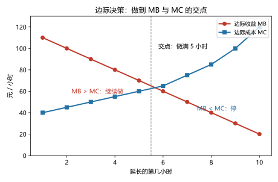
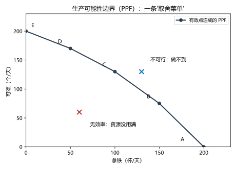

# 第 01 讲：经济学十大原理与经济学思维

> **前置**：无，这是全课程第一讲。
> **预计时间**：约 2.5 小时（含作业）。
>
> **一句话定位**：这一讲是全课程唯一的"世界观 + 工具箱"讲——先给你一副看世界的眼镜（四把钥匙：取舍、机会成本、边际、激励），再给一套做分析的规矩（模型、生产可能性边界、实证与规范、因果与相关）。之后 18 讲都是这套框架的放大镜。
>
> **本讲回答什么**：
> 1. 经济学到底研究什么？为什么它管得这么宽？
> 2. "成本""理性""边际"这些词在经济学里到底是什么意思？
> 3. 模型这么简化，凭什么有用？
> 4. 经济学家的分歧从哪来？什么样的说法是可靠的？
>
> **这一讲有真实验证**：民宿"深夜特价"订单的平均账 vs 边际账（脚本 `scripts/lec01-01_verify_marginal_decision.py`）；"做到哪一小时停"的最优点扫描（同脚本）；PPF 上的机会成本递增（`scripts/lec01-02_verify_ppf.py`）。

## 本讲怎么走（脉络图）

```
引子：一张让人犹豫的报价单（300 元的订单，接不接？）
  │
  ├─ 1. 稀缺：一切从这里开始（原理 1）
  ├─ 2. 机会成本：账要算到没看见的那一边（原理 2）
  ├─ 3. 边际决策：本讲的核心一把钥匙（原理 3，引子在这里收尾）
  ├─ 4. 激励：规则一变，行为就变（原理 4）
  ├─ 5. 三条大结论与生产率（原理 5-8；两条宏观原理的归属）
  ├─ 6. 经济学家的工具箱：模型、循环流量图、PPF、实证与规范
  ├─ 7. 因果 vs 相关：别被新闻骗了
  └─ 常见误区 → 本讲小结 → 掌握度自测 → 作业
```

> 下一站：§引子。我们从一个真实会让人纠结的决策开始——把它算清楚，比背下十条原理更能说明"经济学思维"是什么。

---

## 引子：一张让人犹豫的报价单

晚上十一点，你的民宿（一共 10 间房，挂牌价 800 元/晚）接到一个电话：有人想以 **300 元**的价格订明天一晚。明天只订出去两间，大半房间都空着。

接，还是不接？你脑子里有两个声音在打架：

- **声音一（"亏本论"）**："300 元？我每天的房租、阿姨工资加起来雷打不动 4000 元，就算全住满也得摊 400 元一间，再加上清洁、水电、早餐的开销——300 元明显不够本。不接！"
- **声音二（"空着论"）**："反正房间空着，空一晚就是一分钱没有。有人出 300，好歹是 300。"

两个声音都有道理，但至少有一个是错的。**这道题的正确答案不靠经验也不靠性格，靠一套固定的算账动作**——本讲第 3 节会用这把钥匙把它算到分毫不差（剧透：应当接）。而那套动作，先要从一个更根本的问题开始：经济学到底在研究什么？

---

## 1. 稀缺：一切从这里开始

### 1.1 经济学研究什么（先破除一个误会）

如果你以为"经济学 = 研究钱"，那这讲的第一件事就是把它纠正过来：

> **经济学（economics）研究的是：在资源稀缺的条件下，人们（以及家庭、企业、政府）如何做选择，这些选择如何相互作用，以及结果如何。**

主角是**选择**，不是钱。钱只是选择的一种筹码、一种度量；稀缺的不只是钱，还有时间、精力、土地、注意力、清洁的空气。所以经济学才"管得宽"——只要一样东西稀缺，关于它的选择就在经济学的射程内。你看，这跟"炒股""理财"是两回事（那些是金融学与个人理财的领地，经济学是它们背后更基础的那层逻辑）。

**稀缺（scarcity）** 这个词要先说准：它不是"很少"，而是"**不够免费地满足所有人的全部欲望**"。一杯水在自来水龙头下不稀缺，在沙漠里稀缺；阳光通常不稀缺，但"不受污染的晴天"在大城市就稀缺。判断标准是：**要不要竞争、要不要付出代价才能得到**。

### 1.2 取舍：天下没有免费午餐（原理 1）

> **原理 1：人们面临权衡取舍（trade-off）。**

想得到一样东西，就必须放弃另一样。这不是谁的恶意，是稀缺的直接推论：资源只有一份，用在这里就不能用在那里。三个层级的例子：

- **个人**：周末的 48 小时，复习经济学多一点，复习高数就少一点；刷剧多一点，睡眠就少一点。
- **企业**：一间店面，做堂食多一点，做外卖窗口就少一点。
- **社会**：政府预算多修一条地铁，可能就少建一所学校；环保标准定得严一点，工厂的合规成本就高一点。

"天下没有免费午餐"是经济学最著名的格言，它的准确含义是：**就算午餐不标价，它也一定在花别的东西**——比如排队的时间、别人的补贴、环境的质量。至于"别的东西"到底怎么算，那是下一节的主题。

### 1.3 效率与平等：一块饼的两个问题（取舍的社会版）

在社会层面，最常见的取舍发生在两个目标之间：

- **效率（efficiency）**：把饼做到最大——资源都用上、不浪费。判断标准是"能不能在不损害任何人的前提下再让谁变好一点"，做不到，就叫有效率。
- **平等（equality）**：饼分得均匀——大家的份额差距别太大。

这两个目标经常打架：把高收入者的钱通过税收转移给低收入者（更平等），通常会削弱"多劳多得"的激励、让饼略小（更没效率）。争论"该多均一点还是多留激励空间"，是全社会最核心的政策辩论之一——你以后看新闻里的税收、福利、最低工资之争，认准这个结构就不会迷路。本课程后面会反复遇到它（第 05、07、16 讲）。

### 1.4 十大原理速览：先看一遍全地图

下面是这门学科最著名的"十条原理"，本书把它们当**全景地图**用：现在只求你混个眼熟，别背。它们不是十条独立口号，而是同一套思维方式的十个投影。看的时候注意最后一列——每条原理在哪一讲展开。

| 组 | 原理 | 一句话说清 | 本课程在哪展开 |
|---|---|---|---|
| 怎么决策 | 1 人们面临权衡取舍 | 要得到，就必须放弃 | §1（本讲） |
| | 2 一种东西的成本，是为了得到它而放弃的东西 | 成本 = 放弃的次优选项 | §2（本讲）；第 11 讲深化 |
| | 3 理性人考虑边际量 | 决策看"下一单位"，不看平均数 | §3（本讲）；第 12、13、17 讲深化 |
| | 4 人们会对激励做出反应 | 规则变，行为就变 | §4（本讲）；第 05、07 讲深化 |
| 怎么互动 | 5 贸易能使每个人的状况变得更好 | 交换不是零和 | §5（本讲）；第 02 讲展开、第 08 讲深化 |
| | 6 市场通常是组织经济活动的一种好方法 | 价格引导分散的买卖 | §5（本讲）；第 03–06 讲展开、第 09、10 讲讲边界 |
| | 7 政府有时可以改善市场结果 | 产权、失灵、平等 | §5（本讲）；第 05、09、10、16 讲展开 |
| 整体如何运行 | 8 一国生活水平取决于它生产物品与服务的能力 | 生产率是长期繁荣之源 | §5（本讲） |
| | 9 政府发行过多货币时，物价上升 | 货币与通胀 | 宏观经济学卷（本课程只登记归属） |
| | 10 社会面临通货膨胀与失业之间的短期权衡取舍 | 短期波动中的取舍 | 宏观经济学卷（本课程只登记归属） |

两条纪律说明：

1. **前八条都在本课程射程内**，其中第 1–4 条（怎么决策）是本讲主体，第 5–8 条本讲先给直觉版、后面各有专讲深化。
2. 第 9、10 条属于**宏观经济学**（研究经济整体的通胀、失业、增长），本课程不展开——但宏观的地基就是微观，所以将来学宏观时你会发现整本教材都踩在你现在学的这几讲上。

> 下一站：地图有了，从第一格走起。原理 2 说"成本是放弃的东西"——这句话每个字都认识，但它到底在纠正什么？§2 从一张电影票开始算账。

---

## 2. 机会成本：账要算到没看见的那一边

### 2.1 成本不只是"花的钱"

先做个小实验。看一场电影，花了你什么？

- 票钱 45 元——大家都想得到；
- 2 个小时的晚上——容易被忽略。

但假设那 2 小时原本是你接一个翻译活的时间（能赚 200 元），那么**这场电影的真实成本是 245 元**，不是 45 元。这就是本节的第一个结论：

> **机会成本（opportunity cost）：为了得到某样东西，所必须放弃的东西的价值。**
>
> 经济学里的"成本"，一律指机会成本——它以**你放弃了什么**来衡量，而不是以**你掏了多少钱**来衡量。

为什么经济学坚持这么算？因为"掏了多少钱"只是放弃的一种形态。想想这三种情形：

- **例子 1（掏钱的）**：买一台电脑 6000 元，成本是 6000 元——因为这笔钱本来可以买别的。
- **例子 2（不掏钱但真花钱的）**：你开小店用的是**自家的门面**，不交租金。但会计上"零租金"不等于经济学上"零成本"：这间门面本来可以出租，每月能收 5000 元租金——这 5000 元就是你用它的机会成本。**没掏钱的东西同样有成本**，这是经济学与日常记账最大的分歧点之一。
- **例子 3（时间与精力）**：自己擦一天玻璃省了 300 元家政费，但耗掉了一天年假。省了钱，也花了成本。

### 2.2 手算练习：读一年大学的成本是多少

请先自己算，再往下对答案。清单如下（一年为限）：

- 学费：6000 元
- 书本与耗材：800 元
- 住宿舍：3000 元（如果不上学，你会住家里，不花钱）
- 伙食费：12000 元（不管上不上学，吃的开销差不多）
- 兼职收入损失：50000 元（不上学的话这份兼职是稳的）

**参考答案**：

- 学费 6000 + 书本 800 = **6800 元**：直接算，没争议。
- 宿舍 3000：**算**。不上学的方案里你住家里不花钱，所以这 3000 是"因为上学而多出来的"，要计入（若两种方案都住同一间出租屋，则住宿不入账——关键看"因这个选择而变化多少"，见 §2.4）。
- 伙食费 12000：**不算**。上不上学都要吃饭，这顿开销不因选择改变——哪怕它是"花出去的钱"。
- 兼职损失 50000：**算**，而且通常是最大的一块。这才是"读大学很贵"的主要来源。

于是这一年的机会成本 ≈ 6800 + 3000 + 50000 = **59800 元**。注意两件事：第一，租金式的"放弃的兼职"没有票据，却占了大头；第二，**所有"两个方案里都会发生"的开销，一律不进来**。

### 2.3 机会成本的三层结构（怎么算不遗漏）

把上面的练习整理成一张可操作的清单——算任何机会成本，过这三层：

| 层 | 内容 | 例子 |
|---|---|---|
| ① 显性支出 | 直接掏出去的钱 | 学费、票钱、材料费 |
| ② 隐性占用 | 没掏钱、但被你占用的资源本可产生的收益 | 自家门面本可收的租金、自己的时间本可赚的钱 |
| ③ 放弃的次优选项 | 在所有被放弃的选项里，**价值最高的那一个** | 去打工 vs 读研 vs 旅居——只取其中你本来最想做的那件 |

第 ③ 层有个常见错误要当场立牌：**机会成本不是"所有没选选项的总和"，而是次优（第二好）那一个**。选择读研，代价是"你放弃的诸选项里最好的那个"，不是把打工、旅居、创业的收益全加起来——它们互相是替代方案，你本来就不可能同时都要。

### 2.4 两条纪律：增量原则与沉没成本

**纪律一：只算"因这个选择而变化的"部分（增量原则）。**

§2.2 里住宿算、伙食不算，判据都是同一句话：**做一个选择 vs 不做，哪些账会变？**变了的才算。这条纪律现在看起来平淡，它是引子那道题的关键，也是第 3 节"边际"的先声——本质上，"边际决策"就是这个原则在"多一单位"上的应用。

**纪律二：已经花掉且收不回的钱，不再进入"要不要继续"的决策。**

电影票 45 元已经买了，开场十分钟发现是烂片。此时"走不走"的决策里，45 元**不应该**参与——它已经花了，走或不走都收不回。你就该只问："剩下一个半小时，留下来 vs 去做别的事，哪个更值？" 这种"已经付出、与当下决策无关"的支出叫**沉没成本（sunk cost）**——这个词现在混个脸熟即可，第 12 讲会给它正式立传（它坑人坑得最深）。

### 2.5 态度表

| 内容 | 态度 |
|---|---|
| 定义"成本 = 放弃的次优选项" | **能复述 + 能辨析**（判断题、例析题的高频考点） |
| 三层结构 ①显性 / ②隐性 / ③次优 | **会套用**：给一个场景，能把三层都点出来 |
| 增量原则 | **焊成直觉**：每次算账先问"哪里会变" |
| 沉没成本 | 知道有这回事，能识别；推导与深挖留给第 12 讲 |

> 下一站：账会算了，但"该做多少"还没解决——比如让你纠结的不是"做不做"，而是"做到哪一步停"。这需要本讲的核心钥匙：边际。§3 先回引子，把那通深夜电话的账算完。

---

## 3. 边际决策：本讲的核心一把钥匙

### 3.1 先澄清："理性人"不是你以为的那个意思

在动用核心钥匙之前，得先拆掉一个误会。

> **原理 3 的主角——"理性人"（rational people）——指的是：在给定的约束下，系统地、有目的地做到尽可能好的人。**

它**不是**说你只认钱（感情、名誉、公平感、慈善，都是偏好的一部分，都在"尽可能好"的射程里）；也**不是**说你永不犯错（它是一个"人会有意朝目标优化"的简化假设，不是道德评价，也不是说人像计算器）。经济学用这个简化来推导行为——它靠不靠得住、哪里会失灵，第 17、18 讲会用一整段来检查。现在你只要记住：**理性 = 有目标、会算账，不是冷血、也不是全知**。

### 3.2 "边际"是什么：下一个单位

> **边际变动（marginal change）：对现有行动方案做的小小增量调整。**
>
> "边际"这个词，请一律读成"**下一单位**"：多做一件、少做一件、多开一小时、多收一位客人。

如果你想用最少的字学会整门课，就这两行：

- **边际收益（marginal benefit，缩写 MB）**：多做**一单位**带来的额外收益；
- **边际成本（marginal cost，缩写 MC）**：多做**一单位**带来的额外成本；
- **决策规则：MB > MC 就做，MB < MC 就别做。**

注意里面的"额外"二字——它比较的永远不是"总共赚多少 vs 总共花多少"，而是"**下一单位**会多赚多少 vs 多花多少"。这跟 §2.4 的增量原则是同一句话："只看因这个决定而变的部分。"

> **微积分视角（可选，不看不影响）**：学过导数的话，边际量就是导数——总收益 $R(q)$ 的边际收益是 $R'(q)$，总成本 $C(q)$ 的边际成本是 $C'(q)$；"最优在 MB = MC"就是净收益 $N(q)=R(q)-C(q)$ 的最大值点满足 $N'(q)=0$。这一行不是新知识，只是把上面的"大白话"翻译成微积分——两种语言随时可以互译，答题用哪个都行。后续各讲会沿用这个"小框"格式，把更适合用导数一眼看透的地方补上。

### 3.3 引子收尾：把那通电话的账算完

现在把引子那两个声音逐一对账。设定回顾：10 间房；**每天雷打不动的开支 4000 元**（房租、阿姨工资——不管住几间都发生）；**每多住一间才发生的开支 110 元**（清洁、水电、早餐）；今晚已确定入住 2 间，每间 800 元；深夜来电想以 300 元住第 3 间。

**声音一（"亏本论"）错在哪？**

它把"每天全部开支"摊到每间房上算"平均成本"。但请回头看增量原则：那 4000 元**接不接这个电话都照付**——它不因这个决策而改变。不因决策改变的钱，就不进这个决策的账。

**正确的算法：比较"接"与"不接"两个方案的总利润**（脚本 `lec01-01` 实测）：

| 方案 | 收入 | 每天固定开支 | 该方案的边际开支 | 利润 |
|---|---|---|---|---|
| 不接 | 2 × 800 = 1600 | −4000 | 2 × 110 = −220 | **−2620** |
| 接 | 1600 + 300 = 1900 | −4000 | 3 × 110 = −330 | **−2430** |
| 差值 | +300 | 不变（不参与） | −110 | **+190** |

两方案一减，答案干净利落：**接单让利润改善 190 元 = 报价 300 − 边际成本 110**。所以应当接。

顺便把差额的逻辑说透：**2602 元里的 4000 元、以及"住不住都要付"的一切，在两个方案里完全相同，减的时候自动消失**——你根本不需要关心它们。真正的决策只比较"变的那部分"：多收 300，多花 110，净改善 190。这也正是"平均账"把它自己算糊涂的地方：把不变的开支摊进决策，等于给两个方案同时加同一个数，徒增噪音。

**那"空着论"（声音二）全对吗？**

它对了一多半：房间真空着时，接待这单的边际成本只有 110，300 比 110 大，接单是净改善——它抓住了"边际"。但它有一个盲区要补上：**如果今晚这间房本来很可能被 800 元的客人订走**，那么接 300 的隐性代价就不止 110 了——还有**放弃的那位 800 元客人**（这正是 §2 的机会成本）。淡季空置率高时这个代价小到可以忽略；旺季它巨大。所以现实里的"深夜特价"是**只在卖不动的时段投放**的：用错了时段（把旺季客房也放出特价），"空着论"就真的亏了。

至此你还收获一个大结论：**机会成本与边际决策是同一条原则的两个说法**——都要问"变化在哪"。这也是为什么它们被放在同一讲里当"四把钥匙"的前两把。

### 3.4 做到哪一步停：MB = MC

引子的问题是"接，还是不接"（二选一）。更常见的问题是连续量的：**做到哪一步停？** 用实验说话。

一家小店考虑把营业时间逐小时延长。市场调研给出了每小时的两个数字（脚本 `lec01-01` 实测）：

- 每延一小时带来的额外收入（边际收益 MB）是**递减**的：110、100、90、80、70、60、50、40、30、20 元——越晚客人越少。
- 每延一小时的额外成本（边际成本 MC）是**递增**的：40、45、50、55、60、65、75、85、100、120 元——越晚加班费、电费越贵。

逐小时做"MB vs MC"对照：

| 小时 | 边际收益 MB | 边际成本 MC | 该小时净得 | 累计净得 |
|---|---|---|---|---|
| 1 | 110 | 40 | +70 | +70 |
| 2 | 100 | 45 | +55 | +125 |
| 3 | 90 | 50 | +40 | +165 |
| 4 | 80 | 55 | +25 | +190 |
| **5** | **70** | **60** | **+10** | **+200 ← 最大** |
| 6 | 60 | 65 | −5 | +195 |
| 7 | 50 | 75 | −25 | +170 |
| 8 | 40 | 85 | −45 | +125 |
| 9 | 30 | 100 | −70 | +55 |
| 10 | 20 | 120 | −100 | −45 |



> **图 1 怎么读**：横轴是"延长的第几小时"，红点是每小时的边际收益（一路下降），蓝方块是边际成本（一路上升），两者在第 5.5 小时附近相交（虚线）。**交点左侧**（MB > MC）：延长是有正贡献的；**交点右侧**（MB < MC）：每多延一小时都在倒贴。最优是"做到 MB ≥ MC 的最后一个完整单位"——本题里就是**做满 5 小时**。

这张表值得读三遍，因为它杀死了两种思维习惯：

- **"全有全无"思维**：把两种极端都算一遍——全延 10 小时，总收益 650、总成本 695、总账 **−45**（确实不该全延）；但"一小时都不延"同样不是答案——那会错过前 5 小时的 **+200**。决策不在"做"与"不做"两端，**在中间的交点**。
- **"只捡大的"直觉**：有人会想"第 5 小时净得才 +10，做了多寒酸，干脆只延 4 小时"。错——+10 仍然是**正**贡献，做满 5 小时的累计 +200 恰恰比 4 小时的 +190 多。**只要 MB ≥ MC，就继续；别嫌贡献小。**（当然，MB 恰好等于 MC 时做不做都行，累计一样。）

把规则收拢成一句话，焊进脑子：

> **做到 MB ≥ MC 的最后一个单位为止。**（连续可调版本：做到二者相等那一点。）

### 3.5 水与钻石之谜：边际思维的成名战

两百年前的经济学家被一个现象难住：**水是命根子，却便宜；钻石没什么用，却天价。** 如果你以为"价格反映'东西有多重要'"，这题无解。

用边际思维，一秒化解：

- **水的总量大得离谱**，你早就喝到"够了"——所以**下一杯**水的额外价值（边际价值）很低，在管够的地方接近于零。
- **钻石的总量稀少**，人们远远没"够"——每多一枚钻石的额外价值仍然很高。

价格由**边际**上的买卖双方顶出来（下一讲开始会反复见到），而不是由"总的重要性"决定。所以：**救命的水便宜，无用的钻石贵——荒谬吗？在边际上看，一点也不。** 这是边际思维最著名的应用，也是考试最爱用的辨析题（"钻石与水悖论"）。

### 3.6 边际思维：态度与防错

| 内容 | 态度 |
|---|---|
| "边际 = 下一单位"；MB 与 MC | **焊成直觉 + 能套用**（全课程最高频的思维工具，没有之一） |
| 决策规则"做到 MB ≥ MC 的最后一个单位" | **能复述、能看图、能算表** |
| 与平均思维、全有全无思维的区分 | 见到"摊到每件上""做 vs 不做"式的分析就警觉 |

两条防错口诀：

1. **决策看下一单位，不看平均数**（引子声音一的坟头草已经三米高了）；
2. **不在两端找答案，在交点找答案**（全留全无都是懒）。

> 下一站：算账的"尺子"备好了。但人会发呆——也得有东西推一把。四把钥匙的最后一把：激励。规则一变，人的行为就变，§4 去看几场"规则改了，众生皆变"的好戏。

---

## 4. 激励：规则一变，行为就变

### 4.1 什么是激励

> **激励（incentive）：引起人行动的某种东西——punishments and rewards，惩罚或奖励。**

说白了：人们会比较行为的成本与好处，好处变大（或代价变小）就多做，好处变小（或代价变大）就少做。这不神秘，神秘的是**规则设计者常常忘记它**。

- **正激励**：涨薪、奖金、补贴、优惠券、点赞。
- **负激励**：罚款、涨价、征税、差评、坐牢风险。

### 4.2 价格是最普遍的激励

超市苹果涨价，你少买几个；果农多种几棵——**同一件事（涨价）对买卖双方是相反的激励**（买家被劝退，卖家被吸引）。这一条是整个第 03 讲的种子：**价格为什么能把千万人的行为调节得井井有条，就靠它在两边施加方向相反的激励**。

### 4.3 激励的连锁反应：政策的意外后果

激励分析最值钱的用途，是**预判政策效果**——因为政策改了规则，就改了激励，就改了行为。两个例子：

**例 1：限价让"想帮的人"排队。** 某热门景区规定矿泉水不得超过 2 元。听起来是保护游客，但山上的摊主没了利润激励：要么干脆不卖，要么搞"限购"。结果游客省了钱吗？也许省了 3 元，却可能要多爬两公里找水、或者买"2 元的水 + 10 元的杯子"。**价格被摁住了，稀缺没有消失**——它会从"价格"这个出口挤出到别的出口（排队、搭售、黑市、质量下降）。价格管制的完整分析是第 05 讲的主菜，此处你只需先记下这个直觉：**摁住价格 ≠ 消灭代价**。

**例 2：指标激励什么，就得到什么——但可能只有那个指标。** 公司按"接电话数量"考核客服，客服就会挂电话快——顺便挂断客户的耐心。人的行为会对准指标本身（而不一定是老板真正想要的东西）。所以**设计激励时，必须问："按这个规则，理性人会怎么钻空子？"** 这不是道德批判，而是激励分析的日常动作。

### 4.4 直接激励与间接激励

同一条规则，往往同时撒下好几张激励的网：

- 对塑料袋收费（直接激励：少用袋子）；
- 同时激励了：自带购物袋的习惯、可降解袋产业、有人开始偷拿别家的袋子（间接激励——防不胜防的那些）。

**分析任何政策，列全"它改变了谁的哪些行为的成本/收益"，包括你不希望被改变的那些人。** 这是 §4 留给你的作业式习惯。

> 下一站：四把钥匙集齐（取舍、机会成本、边际、激励）。§5 把镜头拉远，看这三条"社会级"的结论：贸易、市场、政府——以及决定生活水平的那个终极变量。

---

## 5. 三条大结论与生产率

四把钥匙是"怎么算"的问题。下面四条原理（5–8）是"世界怎么运行"的问题——每一条都先给直觉版本，后面的专讲再逐一展开。

### 5.1 贸易能使每个人的状况变得更好（原理 5，直觉版）

先拆掉一个直觉钉子：**"做买卖，总有一方占便宜吧？"** 那是把两件事混在了一起。

- **竞争**（超市 vs 超市）确实残酷：你多卖一瓶我就少卖一瓶，近乎零和。
- **交换**（超市 vs 你）完全不同：你愿意花 5 元买一瓶它标价 5 元的水，说明这瓶水在你心里**不止** 5 元，在它那里**不到** 5 元——一笔交易做完，双方都觉得自己赚了。

交换的本质是**把东西从"评价低"的人手里挪到"评价高"的人手里，挪完之后双方都更好**。所以楼下便利店不会种菜、你不会看店，各自干好自己的事再交换，两边的日子都比"什么都自己干"更滋润。这就是"贸易能使人人受益"的直觉版本——第 02 讲会用一张产能表把这个直觉**算到分毫不差**（包括一个反直觉的情形：就算你样样都比别人强，贸易照样对你有好处）。

### 5.2 市场通常是组织经济活动的一种好方法（原理 6）

一个城市每天需要多少杯奶茶？没人"规划"过这个数字：多了就有店亏本退出，少了就有利润吸引新店进来。千万个素不相识的人，通过**价格**这个信号大致协调好了彼此的买卖——经济学把这个现象叫**"看不见的手"（invisible hand）**。

价格的三种角色（先混个脸熟，第 03 讲细讲）：

1. **信号**：谁缺货、谁过剩（价格涨=紧俏）；
2. **激励**：该多做什么、少做什么（涨价劝退买家、召唤卖家）；
3. **分配**：最后东西归谁（出得起价的人得到）。

注意原理 6 里"**通常**"两个字的分量——市场不是"永远"好。它有三个著名的失灵方向（外部性、公共品、市场势力），分别在第 09、10、13 讲会看到它们失灵的样子。考试里"市场总是有效的吗"的答案永远是"不"。

### 5.3 政府有时可以改善市场结果（原理 7）

既然市场通常好、有时坏，政府的角色就清楚了。三个正当理由：

1. **保护产权与法治**——市场的前提。合同要算数、东西要确权，否则没人敢交易。这是"看不见的手"能运转的土壤。
2. **纠正市场失灵**——外部性（污染）、公共品（国防）、市场势力（垄断）：市场自己搞不定，政府可能搞得好（也可能搞不好，具体政策在第 05/09/10/13 讲逐一分析）。
3. **促进平等**——市场按"出价能力"分配，结果可能过于悬殊；再分配（税与福利）是政府的手（第 16 讲）。

同样注意"**有时**"两个字：政府也面临信息不足、激励扭曲（回到 §4.3 的教训）、被利益集团俘获等问题。**"政府能改善"不等于"政府总能改善"**——经济学对市场与政府是"也…也…"的态度，而不是站队。

### 5.4 生产率：生活水平的终极变量（原理 8）

> **生产率（productivity）：每单位劳动时间所生产的物品与服务量。**

为什么说它"决定"生活水平？因为长远看，**一个社会能消费的，最终受限于它能生产的**。生产率翻倍，同样的工时就能换来两倍的物品与服务——这是生活水平长期上涨的唯一引擎。国家之间贫富差距的长期大头，也要在生产率上找原因（技术、设备、教育、制度），而不是"资源多寡""勤劳程度"的刻板印象。

一个提醒：本课程剩下的每一讲，其实都在讲"生产率这台机器"的不同零件——企业怎么高效组织生产（11–14 讲）、要素与激励（15–17 讲）、信息与制度（18 讲）。所以这条原理是全景图里离"钱"最远、却最重要的一条。

### 5.5 两条宏观原理的归属（原理 9、10）

最后两条原理——"政府印钞过多则物价上升"（通胀）与"通胀与失业的短期取舍"——属于**宏观经济学**：研究对象不是某个市场的茶杯与咖啡，而是价格总水平、失业率、经济增长这些"整体"变量。本课程不展开它们，只在这里登记归属；将来学宏观时，它们的微观地基（价格、预期、激励）正是你现在踩的这块地板。

### 5.6 回看一眼那张地图

到这里，十大原理你已经全部见过了：1–4 是四把钥匙（§1–4），5–8 是世界的运行规律（§5），9–10 交给宏观卷。回过头再看 §1.4 的表格，它应该已经**不再是一堆口号**，而是"这套学科打算解释什么的目录"——这就是"经济学世界观"的雏形。

> 下一站：世界观装好了。但这门学科"怎么干活"——它用什么工具、遵守什么规矩？§6 开工具箱。

---

## 6. 经济学家的工具箱

### 6.1 经济学家也做科学：假设不是撒谎

物理学有实验室，经济学家的"实验室"往往是历史和现实数据（福气是：有的问题能真做实验，§7 会讲）。方法论的大致流程是：**观察现象 → 提出理论（通常是一个"模型"）→ 拿数据检验 → 修正理论**。

这里的核心问题是：**经济学家的模型充满"不真实"的假设（人理性、信息完美、市场完全竞争……），凭什么还指望它有用？**

用"地图"来回答（这是经济学里最有名的一个类比，值得留下）：地铁线路图假设"城市是平的、街道都是直线"——每个假设都不真实，但你从没听谁说"这图没法用"。为什么？因为**它把"换乘结构"这个要紧的东西留下，把地形这个不要紧的东西砍掉了**。经济模型也一样：

- **好假设的标准**：在你要回答的这个问题上，它抓住了主要矛盾、砍掉了次要枝节；
- 同一个经济体，研究"失业"和研究"通胀"可能需要**不同的假设组合**——没有适用一切问题的万能模型；
- 所以"假设不真实 → 理论没用"这个推理是错的（考试爱考的说法辨析）。报时的时候，把地球当圆球还是平面，取决于你要什么精度。

### 6.2 第一个模型：循环流量图

模型长什么样？从最宏观的一张开始。想象把整个经济体浓缩成两群人——**家庭**（拥有并出卖劳动、土地、资本的人）和**企业**（组织生产的人）——他们之间有两条市场：

```
 ┌──────────────────── 产品市场 ────────────────────┐
 │  物品与服务：家庭 ←──── 企业        （实物方向）   │
 │  消费支出  ：家庭 ────→ 企业        （货币方向）   │
 └───────────────────────┬──────────────────────────┘
                         │
               [家庭]    │    [企业]
                         │
 ┌───────────────────────┴──────────────────────────┐
 │  劳动、土地与资本：家庭 ────→ 企业   （实物方向）  │
 │  工资、租金、利润：家庭 ←──── 企业   （货币方向）  │
 └──────────────────── 要素市场 ────────────────────┘
```

> **这张图怎么读**：上下两条"环"其实是**同一批交易的两种视角**。在产品市场，企业把物品与服务交给家庭，家庭把消费支出交给企业；在要素市场（买卖劳动、土地、资本的场所），家庭把劳动、土地与资本交给企业，企业把工资、租金、利润付给家庭（这是家庭的收入）。**实物流与货币流永远一对一对地反向流动。**

用途：这张图是宏观经济学的地基（GDP、收入循环将来都在上面数钱）；对微观的提醒是一条朴素但重要的格言——**你花的每一笔钱，都是别人的收入**（第 03、06 讲分析市场时会反复回到这层"循环"直觉）。

### 6.3 第二个模型：生产可能性边界（PPF）

现在缩小镜头，看"一个生产者能产出什么"。同一份资源（时间、人手、设备）可以安排在不同产品上，把**所有"把资源用到极限"的产出组合**连起来，就得到：

> **生产可能性边界（production possibilities frontier，PPF）：给定资源与技术，一个经济体能生产的各种产品组合的"边界菜单"。**

用一家饮品小店的产能数据说话（脚本 `lec01-02` 实测）：它每天的可选组合（拿铁杯数，可颂个数）为

| 点 | 拿铁（杯/天） | 可颂（个/天） |
|---|---|---|
| A | 200 | 0 |
| B | 150 | 75 |
| C | 100 | 130 |
| D | 50 | 170 |
| E | 0 | 200 |



> **图 2 怎么读**：横轴拿铁、纵轴可颂。**在线上**（A–E 五个点连成的折线，真实世界里是平滑的曲线）：资源已经用满，**有效**；**在线内**（如红叉 (60, 60)）：还能多做点东西却闲着，**无效率**；**在线外**（如蓝叉 (130, 130)）：现有资源根本做不到，**不可行**。这条线就是"取舍菜单"：想吃更多可颂，就得往菜单下段走、少做拿铁。

**菜单的"标价"是什么？看斜率——机会成本。**

逐段算一次（脚本 `lec01-02` 实测）：

| 段 | 拿铁变化 | 可颂变化 | 每多 1 个可颂的代价（机会成本） |
|---|---|---|---|
| A→B | −50 杯 | +75 个 | 50/75 ≈ **0.667 杯** |
| B→C | −50 杯 | +55 个 | 50/55 ≈ **0.909 杯** |
| C→D | −50 杯 | +40 个 | 50/40 = **1.250 杯** |
| D→E | −50 杯 | +30 个 | 50/30 ≈ **1.667 杯** |

看出来了吗：**每多要一点点可颂，放弃的拿铁越来越多——机会成本递增**。这正是 PPF 为什么是"弯的"（向原点弓出）的原因，也是考试画图题最爱的原理点。为什么必然递增？机制很朴素：**资源不是万能的**——

- 开始减产拿铁时，你放掉的是那些**本来就不擅长做拿铁**的资源（比如不熟悉拉花的新手、下午的空闲时段），让它们去做可颂，代价小（0.667 杯）；
- 越往后，你只能用**越来越擅长做拿铁**的资源去做可颂（王牌咖啡师、黄金时段），代价自然越来越大（1.667 杯）。

**推论（反向同理）**：从中点"往回"每多要一杯拿铁，代价（以可颂计）也是越走越贵。两端之间的某一点，正是这家店实际会选择的位置——至于选哪个点？那由价格、成本和偏好共同决定（后面的课会讲），**PPF 本身只说"可行"，不说"最优"**。

最后，PPF 会**移动**：设备升级、人员培训、管理改进（技术或资源变多）→ 整条边界**外移**——这就是"经济增长"最微观的画像。

### 6.4 微观与宏观：显微镜与广角

- **微观经济学（microeconomics）**：研究家庭与企业如何决策、如何在市场上互动（本课程全部内容）。
- **宏观经济学（macroeconomics）**：研究经济整体——通胀、失业、增长（下一门课）。

两者的关系不是"两个学科"，而是**两档镜头**：宏观的一切规律都由微观行为聚合而来（比如"物价总水平"是无数种价格的某种加权）。这也是为什么学宏观前要先有这块微观地基。

### 6.5 实证与规范：小心"应该"混进"是什么"

经济学家的表述有两类，处理方式完全不同：

> **实证表述（positive statement）**：描述世界**是什么、会怎样**——原则上可以用数据验证对错。
> **规范表述（normative statement）**：主张世界**应该怎样**——含价值判断，数据不能单独裁决。

对照着感受一下：

| 例句 | 类型 | 说明 |
|---|---|---|
| "提高最低工资使青年失业率上升 2%" | 实证 | 可检验：拿数据看失业率变没变 2% |
| "政府应该提高最低工资" | 规范 | "应该"背后是价值判断（保护低收入者 vs 就业机会，谁优先） |
| "所有人都该学经济学" | 规范 | 无法用数据直接证明对错 |

两个常见坑：

1. **披着实证皮的规范**："这么征税显然不公平"——"显然"里藏着价值观，它其实是规范句，别拿它当数据结论用。
2. **拿价值观躲数据**：面对"政策 X 的实测效果是 Y"这种可检验的命题，拒绝看数据、只喊立场——这是把实证问题拖进价值争吵。

### 6.6 经济学家为什么吵架

看到两个经济学家意见相左，先分清他们在哪一层分歧：

1. **科学判断分歧**（可收敛）：理论谁更适用、关键参数到底多大、结论能外推多远——这类分歧随着数据积累会逐步缩小；
2. **价值观分歧**（不收敛）：平等与效率各打几折、个人与集体的边界——这类分歧靠辩论与政治过程消化，不存在"用数据证伪"的终点。

另外戳破一个流行错觉：**"经济学家永远吵个不停、什么共识都没有"是夸大的**。在大量基础问题上（稀缺、贸易互利、价格机制、激励反应……），共识相当牢固。考试里别写"经济学家没有定论，所以我也不知道"——那是没学会本讲的样子。

> 下一站：工具箱摆好了。最后一节讲一条比工具更重要的"防骗指南"——新闻里最常用来糊弄你的那件事：把相关当因果。

---

## 7. 因果 vs 相关：别被新闻骗了

### 7.1 一个值得警惕的开场数据

统计显示：**冰淇淋卖得越多的月份，溺水事故也越多。** 有人据此提议禁售冰淇淋吗？没有——但你要知道，新闻里每天都有**同一逻辑**的推断在流通。

两个词先分清楚：

- **相关（correlation）**：两件事同涨同落（数据上一起动）；
- **因果（causation）**：一件事**导致**了另一件。

"相关不等于因果"这句话人人会说，但真到看数据时，"不等于"三个字太单薄。下面把最常见的三个坑挖开看。

### 7.2 三个坑

**坑一：遗漏变量（第三只手）。** 冰淇淋与溺水没有因果关系——**天气热**同时推动了两件事：想吃冰淇淋、想下水游泳。那个被漏掉的"第三只手"（气温），叫**遗漏变量**。

- 经济学版：研究发现"家庭藏书多的孩子成绩好"——是书本身让孩子变聪明，还是"家里有藏书"背后共同的第三只手（父母的教育资源与重视程度）？

**坑二：反向因果（顺序搞反）。** 数据只显示"两件事相关"，不保证方向：

- "治安好的城市警察多"——是警察多了治安才好，还是治安差的城市才需要（并拨款雇）更多警察？
- "好的医院多的城市，病人也多"——医院吸引病人，还是病人聚向医院？

**坑三：选择性偏差（两组本来就不可比）。** "名校毕业生收入比普通高校高 40%"——名校教出来的？还是名校**录取的本就是**平均水平更高的人，这批人不上名校也大概率赚得多？注意"毕业生样本"是**自选的**：能被名校录取本身就是一道筛选。

三个坑的共同根子是一件事：**没有"可比的两组"**——要么有第三只手干扰，要么方向颠倒，要么两组人根本不是同一种人。

### 7.3 怎么破：先过三问，再看武器

看到"数据显示 A 与 B 有关"，先问三个问题：

1. **还有没有别的共同原因**在同时推动 A 和 B？（遗漏变量）
2. **方向能反过来吗？** 会不会其实是 B 影响 A？（反向因果）
3. **这两组人本来就一样吗？** 还是自选分组？（选择性）

至于"怎么拿到真答案"，工具箱里有三件武器（现在只要求你知道它们叫什么、干什么用）：

- **控制变量**：不比"全体"，比"条件相当的两组"（同龄、同城、同行业……）；
- **自然实验**：某个政策或事件近似随机地改变了一部分人的处境，于是形成天然对照组（如某地区突然调整了最低工资）；
- **随机对照实验（randomized controlled trial，RCT）**：研究者主动把对象随机分到两组——因果识别的黄金标准。

> **非可忽略声明**：以上都只是"直觉层"版本。识别因果的正经技术（回归、双重差分、断点回归等）属于**计量经济学**的地盘，本课程不展开。本讲对你的最低要求是：**看到相关性报道，先过一遍三问**；能做到这一点，你就已经比那些标题党强了。

### 7.4 为什么这一节对经济学特别重要

回到 §6.5：实证表述"原则上可用数据检验"——但数据给的大多是"相关"。**能不能把相关升级为因果，决定了一条实证结论立不立得住**。政策辩论里，"我有个数据"很多时候其实只是"我有个相关"——现在你有工具当场验货了。这也是原理级提醒：**"看数据"不自动等于"讲科学"**。

---

## 常见误区（本节零新知识，只破误）

> 以下每条只是"对答案 + 校准"，没有新知识——每一句都已在正文系统小节里教过。按最容易犯的顺序排：

1. **"经济学 = 研究钱 / 炒股 / 看财经新闻"**（§1.1）。错。它研究稀缺条件下的选择；钱只是其中一种筹码。
2. **"成本就是花出去的钱"**（§2.1）。错。经济学里成本 = 放弃的次优选项的价值，没掏钱的资源（自家门面、你的时间）照样有成本。
3. **"机会成本 = 所有没选选项的总和"**（§2.3）。错。只算价值最高的那一个（次优），它们互相替代、不可能同时拥有。
4. **"已经花的钱也要算进'要不要继续'"**（§2.4）。错。收不回的就是沉没成本，不进入此后的决策（深挖见第 12 讲）。
5. **"理性人 = 只认钱的冷血计算机"**（§3.1）。错。理性 = 有目标、会算账；情感偏好也在目标里，也不保证不犯错。
6. **"决策要按平均成本算"**（§3.3）。错。看边际：引子那晚的 4000 元摊到哪儿都不该进决策——它不因决策改变。
7. **"第 5 小时才赚 10 元，不值得做"**（§3.4）。错。只要 MB ≥ MC 就继续，小贡献也是贡献；决策不在两端，在交点。
8. **"限价 / 免费 / 补贴只有好处"**（§4.3）。错。激励会拐弯：价格被摁住，代价会从别处冒出来（排队、搭售、质量下降）。
9. **"市场总是有效"或"市场永远失灵"**（§5.2）。都不对。原理里的字眼是"通常"与"有时"——两边都要加者注意。
10. **"经济学家没有共识，所以怎么写都对"**（§6.6）。错。基础层面共识牢固；分歧要么在科学判断（可用数据收敛），要么在价值观（本就无对错）。
11. **"数据显示相关 = 因果"**（§7）。错。先过三问：遗漏变量？方向反了？两组可比吗？

## 本讲小结

一页纸的骨架：

- **经济学**研究"稀缺条件下的选择"。稀缺 → 取舍 → 一切从这里长出来。
- **机会成本 = 放弃的次优选项**：三层账（显性 / 隐性 / 次优）；纪律是**增量原则**（只算会变的部分）与**沉没成本不参与**。
- **边际 = 下一单位**；MB、MC；**做到 MB ≥ MC 的最后一个单位**。平均思维与全有全无思维是两大坑。水贵钻石的反面：价格在边际上定。
- **激励**：规则变、行为变；分析政策时列全所有被改变的激励，包括不希望的。
- **大结论**：贸易双赢（非零和）；市场"通常"好，三大失灵是边界；政府"有时"能改善（产权 / 失灵 / 平等）；生产率决定生活水平。宏观两条原理登记归属。
- **工具箱**：模型是地图，假设为简化；循环流量图（两条环流：实物与货币反向）；**PPF**——有效 / 无效率 / 不可行，斜率 = 机会成本，弯的原因是机会成本递增；微观与宏观是两档镜头；实证 vs 规范；经济学家分歧的两种来源。
- **因果 vs 相关**：三坑（遗漏变量 / 反向因果 / 选择性）；三问+三武器（控制变量 / 自然实验 / RCT）直觉版。

## 掌握度自测

- [ ] 我能用一句话说清"经济学研究什么"，并举一个"稀缺 → 取舍"的日常例子。
- [ ] 我能默写机会成本的定义，并用三层结构为一个场景算账（包含至少一项隐性成本）。
- [ ] 我能用增量原则解释："读大学的成本里为什么伙食费不算、放弃的兼职算"。
- [ ] 我能说清"边际"是什么，并在一张 MB/MC 表上找出最优点、写出检查规则（含"第 5 小时只有 +10 为什么还做"）。
- [ ] 我能解释为什么"全延"和"一小时不延"都错，并用"交点"思维复述决策规则。
- [ ] 我能给一条政策举出至少两"层"激励反应（直接 + 意外/间接）。
- [ ] 我能复述"贸易—市场—政府"三原理的一句话版本，并说出"通常 / 有时"两个限定词为什么必须存在。
- [ ] 我能画/描述 PPF，标出三个位置（有效 / 无效率 / 不可行），并解释"为什么它是弯的"（机会成本递增的机制）。
- [ ] 我能区分实证与规范（各举一例），并说出经济学家分歧的两种来源。
- [ ] 看到"A 与 B 相关"的说法，我能马上给出至少两个"可能不是因果"的理由。
- [ ] 我能复跑 `scripts/lec01-01` 与 `lec01-02`，并解释输出里的每一个数字（-2620、+190、+200、−45、0.667→1.667……）。

## 作业

> 答案只能用**已教概念**（本讲范围：稀缺与取舍、机会成本与增量原则、沉没成本概念提及、边际与 MB/MC、激励、三条大结论、生产率、模型与假设、循环流量图、PPF、实证与规范、因果与相关三坑）。先独立做，再对答案。

### 基础

**Q1. 概念辨析**：判断下列说法对不对，并给一句话理由。

(a) "小张花 3000 元买了台相机，这 3000 元就是他使用这台相机的成本。"
(b) "小李用自己的房子开店，不用交租金，所以房子这项没有成本。"
(c) "电影票已经买了，虽然看了 20 分钟发现很难看，但为了不浪费票钱，应该硬着头皮看完。"
(d) "小王放弃了周末能赚 200 元的兼职去做志愿者，那 200 元是他做志愿者的成本之一。"

**参考答案**：

(a) 不准确、不完整。3000 元只是显性支出；成本要以"放弃了什么"衡量——这 3000 元本来可以买别的（次优用途的价值也是成本的一部分），如果还占了你的时间，时间也算。
(b) 错。房子没掏租金，但本可出租/他用——**放弃的租金收入**就是这间房的隐性成本（机会成本）。没付钱 ≠ 没成本。
(c) 错。票钱已花且收不回，是**沉没成本**，不参与"留下还是走"的决策；此刻只该比较"剩下的时间怎么用更值"。
(d) 对。放弃的兼职收入（次优选项）正是志愿者活动的机会成本之一。
验算：四小题都能用同一句话判定——"这项支出/资源是否因这个选择而变化或被放弃"。

**Q2. 计算·书店咖啡角**：一家书店想开辟咖啡角，用自有的 20 平米空置区（该区若出租，月租 4000 元）；咖啡师月工资 5000 元；设备折旧与原料每月 6000 元；老板每月额外投入 10 小时（这 10 小时本来的用途是选书，价值 2000 元）。问：按经济学的口径，咖啡角每月的成本是多少？把每项归到"三层结构"里。

**参考答案**：
机会成本全部相加：4000（放弃的租金——隐性）+ 5000（工资——显性）+ 6000（设备原料——显性）+ 2000（老板时间——隐性/放弃的次优用途）= **17000 元/月**。
验算：三层结构清点——显性 11000（5000+6000）；隐性 6000（4000+2000）；次优项已含在隐性里，无需重复加。

**Q3. 计算·边际表**：某摊主考虑逐单位增加备货。第 k 个单位的边际收益与边际成本如下：

| 单位 k | 1 | 2 | 3 | 4 | 5 | 6 | 7 | 8 |
|---|---|---|---|---|---|---|---|---|
| 边际收益 MB | 90 | 80 | 70 | 60 | 50 | 40 | 30 | 20 |
| 边际成本 MC | 30 | 35 | 40 | 45 | 55 | 60 | 65 | 70 |

问：最优备货量是多少？用"检查规则"说明你停下来的理由，并算累计净得。

**参考答案**：
逐单位比较：第 4 单位 MB=60 ≥ MC=45，该做；第 5 单位 MB=50 < MC=55，该停。所以**做 4 个单位**，累计净得 = (90−30)+(80−35)+(70−40)+(60−45) = 60+45+30+15 = **150**。
验算：把累计写成表——70 → 115 → 145 → 150 → 145（第 5 单位后开始下降），150 恰在 k=4 处最大，与规则一致。

### 提高

**Q4. 计算·摄影棚的傍晚订单**：某摄影工作室的影棚每天雷打不动开支 600 元（场地折旧、设备维护）；每多拍一单的成本 80 元（摄影师加班费+布景）；今天已确定 1 单收入 500 元；傍晚有客户想以 200 元加拍一单。

(1) 接不接？把两个方案的利润算出来。
(2) 若这个时段"几乎确定"能等到一个 500 元的正常客户，结论会变吗？为什么？

**参考答案**：
(1) 不接：500 − 600 − 80 = **−180**；接：700 − 600 − 160 = **−60**；接单改善 **+120 元**（= 200 − 80）。应当接。
(2) 会变。那样一来，200 元订单的真实代价就不止 80 元了——还有**放弃的 500 元客户**（机会成本≈500）：接特价单净得 200−80=120，留给正常客户净得 500−80=420 > 120，所以这个时段**不该**接特价——"空着论"只在"真的卖不动"时成立。
验算：(1) 的差值 +120 与"报价 200 − 边际成本 80"一致；(2) 与引子里"深夜特价只在卖不动时段投"同一条逻辑。

**Q5. 计算·PPF**：某工坊生产木桌（T）与木架（S），日产能组合为：(10,0)、(8,3)、(6,5)、(4,6)、(0,7)。

(1) 从最左到最右，逐段算"每多 1 个架子要放弃几张桌子"；
(2) 判断 (7,4) 在线上、线内还是线外？(9,2) 呢？(5,4) 呢？

**参考答案**：
(1) 逐段机会成本：
- (10,0)→(8,3)：放 2 张桌、得 3 个架 → 2/3 ≈ **0.667 张**；
- (8,3)→(6,5)：放 2、得 2 → **1.0 张**；
- (6,5)→(4,6)：放 2、得 1 → **2.0 张**；
- (4,6)→(0,7)：放 4、得 1 → **4.0 张**。
机会成本从 0.667 递增到 4——与 PPF 向原点弓出一致。
(2) (7,4)：落在 (8,3)–(6,5) 段的中点上（T=7 时线上 S=4）→ **在线上（有效）**；
(9,2)：在 (10,0)–(8,3) 段，T=9 时线上 S=1.5 < 2 → **线外（不可行）**；
(5,4)：在 (6,5)–(4,6) 段，T=5 时线上 S=5.5 > 4 → **线内（无效率，还有资源没用满）**。
验算：三个点的判定都化为"同 T 下比较 S 与线上值"，一遍过。

**Q6. 简答·表述分类**：把下面五句话分为"实证"或"规范"，一句话说明理由。

(a) "外卖平台把抽成提高到 20% 后，中小商家的平均利润率下降了约 X%。"
(b) "平台应该把抽成降到 10%。"
(c) "对含糖饮料征税会减少含糖饮料的销量。"
(d) "政府不该让房价继续上涨。"
(e) "公平比效率更重要。"

**参考答案**：
(a) 实证——"降了多少"可拿数据核验。
(b) 规范——"应该降"是价值主张（谁该得利），数据裁决不了。
(c) 实证——"征税→销量变化"可实测检验（注意：即使实际上检验发现结论相反，它依然是实证命题）。
(d) 规范——"不该"含价值判断（房价"应该"如何本身就是目标之争）。
(e) 规范——两种价值孰轻孰重，属于价值观分歧（§6.6 的第二种分歧）。
验算：判据一条——"能拿数据判对错吗？"能 → 实证；不能（或不止） → 规范。

### 综合（回扣本讲主任务）

**Q7. 一张新的"深夜报价单"**：你的度假屋共 5 间，每天固定开支 1500 元；每多住一间，边际成本 90 元；旺季挂牌价 600 元。现在来一个 250 元的订单，请分两种情境给出结论并算账：

(1) **淡季**：今天只订出去 1 间，往后几天都空得慌；
(2) **旺季**：今天订出去 3 间，且这个时段"几乎确定"能再等到 600 元的客人。

**参考答案**：
(1) **接**。不接：1×600 − 1500 − 90 = **−990**；接：850 − 1500 − 180 = **−830**；改善 **+160**（=250 − 90）。淡季空着的机会成本≈0，边际账说了算。
(2) **不接**。比较"卖 250"与"留给 600 客人"：卖 250 净得 250 − 90 = **+160**；留给 600 的净得 600 − 90 = **+510**。把房间用掉的机会成本≈500 元（放弃的 600 客人），250 元的报价过不了这条线。
验算：(1) 与引子的 190 元逻辑同型（价 − 边际成本）；(2) 与 Q4(2) 同型（"空着论"的边界）。两问合起来就是本讲两把钥匙（边际 + 机会成本）的联合作业——**同一张报价单，答案取决于"下一个更好的用途存不存在"**。

**Q8. 开放简答·数据的陷阱**：某研究发现"每周喝三次以上咖啡的人，平均收入比不喝咖啡的人高 15%"，有媒体标题为"喝咖啡能提高收入"。请用本讲工具写三条质疑（每条指出一个坑 + 一句话解释），并给出一句总结论。

**参考答案**：
1. **遗漏变量**：白领、大城市、高压岗位的人更常喝咖啡，而这些特征本身就关联更高收入——"职业与城市"这只第三只手可能同时推动了喝咖啡与收入。
2. **反向因果**：也可能是收入高的人在工作节奏与社交场景上更消费咖啡（开会、商务），即"收入 → 咖啡习惯"的方向同样成立。
3. **选择性偏差**：能形成"每周喝三次咖啡"习惯的群体（负担能力、生活方式）与"不喝"群体本来就不是随机两组，收入差异可能早在喝咖啡之前就存在。
总结论：这条数据最多说明"喝咖啡"与"收入高"在人群中**相关**；要主张因果，需要控制变量、自然实验或随机实验级别的证据。在看到那类证据之前，"喝咖啡提高收入"是过度解读。
验算：三条质疑分别命中 §7.2 的三个坑；结尾必须落在"相关 vs 因果"的分界上，不能写成"咖啡一定有用/一定没用"。

---

*下一讲预告：第 02 讲《相互依存与贸易的好处》——本讲 §5.1 立了个"贸易双赢"的旗帜，下一讲用一张算到分毫的产能表把这面旗插稳，包括那个最反直觉的结论：就算你样样都比对手强，贸易照样让你赚。*