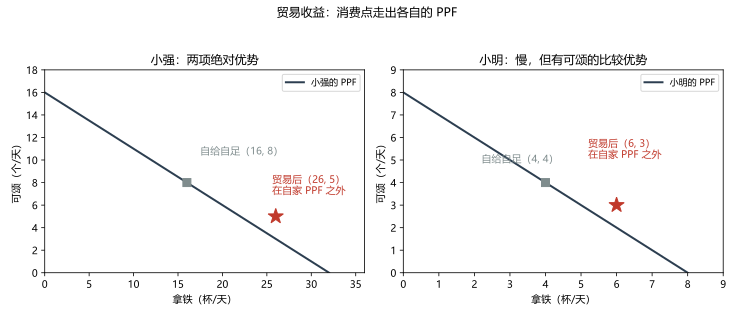
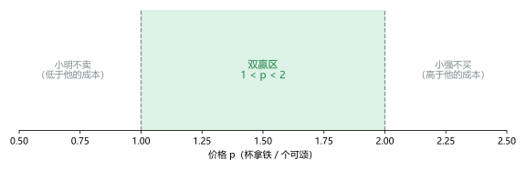

# 第 02 讲：相互依存与贸易的好处

> **前置**：第 01 讲（稀缺、机会成本、PPF、贸易互利原理的直觉版）。
> **预计时间**：约 2 小时（含作业）。
>
> **一句话定位**：第 01 讲留下了一个承诺——"贸易能使双方的状况变好"。本讲把这句承诺算到分毫：怎么判"谁该做什么"，专业化到底让双方各多赚多少，价格为什么必然落在一个人区间里。
>
> **本讲回答什么**：
>
> 1. 凭什么说贸易不是零和？双方为什么会自愿交换？
> 2. 绝对优势与比较优势差在哪？判定用什么算法？
> 3. 样样都强的人，为什么也应该参与分工？
> 4. 贸易价格为什么落在区间里？区间之内，好处怎么分？
>
> **这一讲有真实验证**：比较优势判定（脚本 `scripts/lec02-01_verify_comparative_advantage.py` 实验 1）；贸易收益折算与"走出自家 PPF"检验（实验 2）；价格意愿扫描（实验 3）。配图 2 张。

## 本讲怎么走（脉络图）

```
引子：一场"不公平"的谈判（小强的直觉 vs 小明的方案）
  │
  ├─ 1. 相互依存：你没有一天是"自己养活自己"
  ├─ 2. 绝对优势 vs 比较优势：比的不是同一个东西
  ├─ 3. 用机会成本判定比较优势（手算三步）
  ├─ 4. 样样都强，也要贸易吗？（边界）
  ├─ 5. 贸易收益：消费点走出自家 PPF（实验 + 图 1）
  ├─ 6. 价格谈判桌：双赢区间（实验 + 图 2）
  ├─ 7. 应用与政策启示：比较优势的用武之地
  └─ 常见误区 → 本讲小结 → 掌握度自测 → 作业
```

> 下一站：§引子。先看一场争论——小明的方案听起来像在占便宜，算完账你会发现他其实是对的。

---

## 引子：一场"不公平"的谈判

小强和小明是合租的室友，周末要请假去市集摆一天的早餐摊，卖两样东西：**拿铁**和**可颂**。两人的产能（一整天全负荷）：

- **小强**手脚快：一整天全做拿铁能出 **32 杯**；全做可颂能出 **16 个**。
- **小明**慢一些：一整天全做拿铁能出 **8 杯**；全做可颂能出 **8 个**。

晚上盘账时，两人吵了起来：

- **小强**说："我两样都比你快。最简单——我全包了，你负责叫卖。"
- **小明**说："我有个更好的方案：我专做可颂，你专做拿铁，然后我们交换着用。"
- **小强**皱眉："等等——我做可颂也比你快（16 比 8），把可颂让给你做，这不是明摆着浪费吗？你在薅我羊毛吧？"

看起来，小强的怀疑很有道理：**明明是"每样都慢"的人，凭什么让他来负责一整个产品？** 但是请先忍住直觉判断——本讲结束时，你会亲手把这道账算出来，结论是：**小明的方案让两边都赚，包括小强**。这个反直觉的结论背后，是整门课最著名的概念之一：**比较优势（comparative advantage）**。而要把它讲清楚，得先从一个更朴素的事实说起。

---

## 1. 相互依存：你没有一天是"自己养活自己"

### 1.1 相互依存是常态，不是缺陷

看看你今天的早餐：咖啡的豆子来自某个高原的农户，牛奶来自牧场，面包来自面粉厂和烘焙店，就连"自己做"的那部分，用的水、电、燃气也来自别人的劳动。经济学把这种状态叫：

> **相互依存（interdependence）：人们依靠许多其他人来提供自己需要的物品与服务。**

它的反面是**自给自足（autarky）**——一切都自己生产。自给自足听着"硬气"，但只要算一笔账就知道它有多贵：一个人又要种粮、又要织布、又要盖房、又要造电……每一项都从头学、从头干，最终的产量一定少得可怜。**现代人的生活水平，恰恰建立在"不做绝大部分事情"上。**

### 1.2 分工为什么提高生产率

专业化与分工（division of labor）自古就是财富的来源，它的产能红利至少有三条：

1. **熟能生巧**：重复一项工作，速度与质量都会上升；
2. **省去切换成本**：在不同任务间跳来跳去，本身是消耗；
3. **重新配置的收益——本讲的主角**：把每一项工作交给"做它**代价**相对更低"的人，即使每个人的技艺完全不变，总产量也能上升。

前两条是"技巧"层面的，第三条是"逻辑"层面的——本讲接下来的实验**故意假设两人的技艺完全不变**（产能数字锁定），单独把第三条算给你看：光靠"谁做什么"的重新安排，就能凭空多出产出。

### 1.3 那"谁做什么"到底该听谁的

排序方式有三种候选，难度递增：

- 直觉一："谁快谁全包"（小强的方案）；
- 直觉二："各做各的，谁也不欠谁"（自给自足）；
- 正确答案：**按"比较优势"分工**——它不是看谁强，而是看"谁做某样东西的代价相对低"。

下面两节把这个算法拆开。

> 下一站："绝对优势"和"比较优势"听起来像同义词——恰恰不是。§2 先把两个词钉死。

---

## 2. 绝对优势与比较优势：比的不是同一个东西

### 2.1 两个定义

> **绝对优势（absolute advantage）：用**同样的资源**能产出更多（或同样的产出用更少资源）的能力。**

判断"绝对优势"就用产能数字直接比大小：小强一天 32 杯拿铁、小明 8 杯——**拿铁上，小强有绝对优势**；可颂 16 比 8——**可颂上，小强也有绝对优势**。

> **比较优势（comparative advantage）：做某样东西**机会成本更低**的能力。**

机会成本（第 01 讲的老朋友：放弃的次优选项）在这里的意思是"做 1 单位这个东西要放弃多少另一件东西"。判断"比较优势"比的是四个"代价数字"，不是四个"产量数字"。

### 2.2 两者为什么会分家

关键洞察：**绝对优势衡量"水平"（生产力高低），比较优势衡量"相对结构"（代价的相对高低）**。一个人完全可能"样样都快"，但只要他"快得不均匀"，比较优势就只会落在其中一样上。

拿小强看：他一小时能做 4 杯拿铁或者 2 个可颂——**做 1 个可颂，等于放弃 2 杯拿铁**；小明一小时 1 杯拿铁或者 1 个可颂——**做 1 个可颂，只等于放弃 1 杯拿铁**。小明的可颂"更便宜"（以拿铁计价）！原因不是小明手巧，而是小明的**时间不值钱**：他的时间花在拿铁上本来也产不出多少，所以挪去烤可颂，损失小。

反过来看拿铁：小强的 1 杯拿铁只代表放弃 0.5 个可颂；小明要放弃整 1 个。**拿铁的比较优势在小强手里。**

### 2.3 一条必读的推理：比较优势必然"一人一边"

两种产品的情形下，有一条干净的数学事实：**两个人不可能在同一件产品上都拥有比较优势**。理由是一句话的"倒数关系"：

- 设小强做 1 个可颂的代价是 $a$ 杯拿铁，那么他做 1 杯拿铁的代价必然是 $1/a$ 个可颂；
- 小明同理，做 1 个可颂代价 $b$ 杯拿铁、1 杯拿铁代价 $1/b$ 个可颂；
- 如果 $a < b$（小明的可颂代价更大、即可颂比较优势在小强），那么必然 $1/a > 1/b$——拿铁的比较优势就落到小明手里。

换句话说：**"你在这件事上相对便宜"与"你在那件事上相对便宜"不可能同时成立**。所以"谁做什么"这个问题**永远有答案**：不管人们强弱如何悬殊，每一项产品总能找到它"相对最便宜的生产者"。这是分工与贸易能扩展到全球的原因。

### 2.4 记忆锚与态度

| 概念     | 一句话记忆 | 用什么比     | 决定什么                           |
| -------- | ---------- | ------------ | ---------------------------------- |
| 绝对优势 | "谁产出多" | 产量数字     | 谁的收入水平高（谁富）             |
| 比较优势 | "谁代价小" | 机会成本数字 | **谁该做什么**（贸易的基础） |

> 本讲算式采用了一个简化：假设两人的"转换率"不变（产能线性、机会成本恒定），这样比较优势的算术最干净。现实里的 PPF 是第 01 讲那条"凹曲线"（机会成本随产量变化），比较优势依然存在，只是改用"每一段各自的代价"来判断——结构一模一样，计算多几步而已。

> 下一站：把定义变成一套人人能照着走的算法——§3 手算一遍。

---

## 3. 用机会成本判定比较优势（手算三步）

### 3.1 三步算法

1. **算**：为每一样产品，算出每人"多做 1 单位"要放弃多少"另一件"（机会成本）；
2. **比**：同一样产品，比较两人的机会成本数字；
3. **定**：数字小的人，在这件产品上有比较优势。

### 3.2 把小强、小明过一遍（脚本实测数据）

产能表（一整天全做一样时）：

|      | 全做拿铁 | 全做可颂 |
| ---- | -------- | -------- |
| 小强 | 32 杯    | 16 个    |
| 小明 | 8 杯     | 8 个     |

**第 1 步，算机会成本**（脚本 `lec02-01` 实验 1 实测）：

|      | 1 个可颂的代价            | 1 杯拿铁的代价              |
| ---- | ------------------------- | --------------------------- |
| 小强 | 32/16 =**2 杯拿铁** | 16/32 =**0.5 个可颂** |
| 小明 | 8/8 =**1 杯拿铁**   | 8/8 =**1 个可颂**     |

（算法演示：小强的整个一天只有两种用法——32 杯拿铁或 16 个可颂。做 16 个可颂就意味着放弃全部 32 杯拿铁，摊到每个可颂头上就是 2 杯。）

**第 2 步、第 3 步，对比并判定**：

- 拿铁：小强 0.5 个可颂 vs 小明 1 个可颂 → **小强**的机会成本低，拿铁的比较优势在小强；
- 可颂：小强 2 杯拿铁 vs 小明 1 杯拿铁 → **小明**的机会成本低，可颂的比较优势在小明。

交叉验证 §2.3 的推理：比较优势恰好"一人一边"✓。

### 3.3 一个必须盯住的对比

**绝对优势全在小强**（32 > 8，16 > 8），但**比较优势得分给小明一半**。这不是文字游戏——它在下一节直接决定"分工方案"，并让两边都赚。考试里的概念辨析题、"谁出口谁进口"的计算题，考的几乎都是这一个分家点。

> 下一站：有人会问——"样样都强的人到底亏在哪？我做可颂明明也比他快。" §4 专门盯住这个问题。

---

## 4. 样样都强，也要贸易吗？（边界）

### 4.1 强者的困惑

小强的疑惑值得正面回答："我做一个可颂只要半小时（他 1 小时能出 2 个），小明要 1 小时。**我明明连可颂都比小明快，让我放弃可颂，我图什么？**"

回答的钥匙还是"代价"：

- 小强那"半个小时"是**从拿铁里抠出来的**：他每做 1 个可颂，就少做 2 杯拿铁——**代价是 2 杯拿铁**；
- 小明做 1 个可颂的半小时……他做 1 个可颂要 1 小时，代价是少做 1 杯拿铁——**代价是 1 杯拿铁**。

于是：**让小明做可颂，小强每让出 1 个可颂的位置，就给自己腾出了"2 杯拿铁"的产能，而只需要用 1 杯多一点的拿铁去换回 1 个可颂**（具体价格见 §6）。便宜的那个"差价"，就是强者也受益的来源。

### 4.2 比较优势与"强弱"无关

把 §4.1 抽象成一句话：

> **比较优势不看"你能不能做"，只看"你做它要放弃什么"。** 你的其他选择越值钱，你亲自做"杂事"的代价就越高——这与你的手速快不快无关，而取决于你手速的**分布**。

现实映照：高薪医生请助理录入病历（医生的时间机会成本是他自己的门诊收入）；管理者把可以做但耗时的琐事外包；"全能选手"依然会和队友分工——逻辑都在这里。

### 4.3 边界情形：什么时候"贸易无收益"

如果两人的机会成本**完全一样**（比如小明也恰好是"32 杯或 16 个"的产能），那么 §2.3 的"倒数关系"两侧全部相等——**谁也谈不上有比较优势**，专业化不会改变总产量，贸易的"重新配置收益"为零（此时交换若还有意义，只能来自偏好的差异，本讲不展开）。

一句话记住：**比较优势的"几乎总存在"不是空话**——只要两人的代价结构有一丝不同，就有一份可赚的贸易收益；差异越大，赚得越多。

> 下一站：道理讲完了，把账本摊开——§5 用实验数字看看专业化之后两边到底多赚了多少。

---

## 5. 贸易收益：消费点走出自家 PPF

### 5.1 先把两个"基准方案"摆上桌

回到引子。假设两人各自生活的基准是**"各花一半时间做两样"**（这个"一半时间"是人为约定的对比基准，为了公平起见让两人一开始都有两样东西可消费）：

- **方案 A（自给自足）**：小强 16 杯拿铁 + 8 个可颂；小明 4 杯拿铁 + 4 个可颂。两人合计 **20 杯 + 12 个**。
- **方案 B（专业化）**：小强全做拿铁 **32 杯**；小明全做可颂 **8 个**。合计 **32 杯 + 8 个**。

停一下——先对方案 B 保持警惕：它的总量结构变了（拿铁多了 12 杯，可颂少了 4 个）。**"总量结构不同的两个方案，不能直接比大小"**：多出来的拿铁和多出来的可颂不是同一种东西，谁敢说 32+8 一定"多于"20+12？所以真正的比较必须落到**"每个人最后消费到什么、值不值"**上。

### 5.2 加上交换，看看每个人手里剩什么

专业化之后东西都堆在"产地"：拿铁全在小强手里、可颂全在小明手里。现在让他们按 $p = 1.2$（1 个可颂换 1.2 杯拿铁）成交一笔：**小明拿出 5 个可颂，换回 6 杯拿铁**（5 × 1.2 = 6）。

交换后的最终消费（脚本 `lec02-01` 实验 2 实测）：

|      | 拿铁                     | 可颂                   |
| ---- | ------------------------ | ---------------------- |
| 小强 | 32 − 6 =**26 杯** | 0 + 5 =**5 个**  |
| 小明 | 0 + 6 =**6 杯**    | 8 − 5 =**3 个** |

### 5.3 折算检验：每一笔交换都比"自制"划算

判断"赚没赚"，不看心情，用**各自的机会成本**折算——把交出去的东西换算成"要是自己做要花多少代价"：

|      | 交出了什么 | 自制这些的代价            | 换回了什么 | 结果                    |
| ---- | ---------- | ------------------------- | ---------- | ----------------------- |
| 小强 | 6 杯拿铁   | 6 × 0.5 = 3 个可颂的产能 | 5 个可颂   | **净赚 2 个可颂** |
| 小明 | 5 个可颂   | 5 × 1 = 5 杯拿铁的产能   | 6 杯拿铁   | **净赚 1 杯拿铁** |

两张都赚，一笔交易里没有输家——**这就是"贸易不是零和"的算术版本**。机制也清楚了：价格卡在两人机会成本之间（1 < 1.2 < 2），卖方的售价高于自己的成本、买方的买价低于自己的成本，两边各自都"捡到了差价"。

### 5.4 一个更直观的检验：走出自家 PPF

还记得第 01 讲的 PPF 吗——那是"自力更生的极限"。把两人贸易后的消费包放上去检验（"占用自家产能的百分比"算法：一件产品消费量 ÷ 自己全天产能，两种产品相加）：

- **小强**：26/32 + 5/16 = 81.25% + 31.25% = **112.5% > 100%** —— 这个消费组合，小强光靠自己**做不到**；
- **小明**：6/8 + 3/8 = **112.5% > 100%** —— 同样，自力做不到。



> **图 1 怎么读**：左右两图分别是小强和小明的 PPF（深色直线：自力能达到的极限）。灰色方块是"自给自足"基准点（在线上）；**红色星号是贸易后的消费点——都在各自 PPF 的"外侧"**（自力达不到的区域）。贸易把两个人的"能吃到的东西"同时推到了各自极限之外。

把 §5.3 和 §5.4 合起来，"贸易收益（gains from trade）"的准确含义是两条：

1. **消费上**：双方都能消费到"自力达不到的组合"（点落在自家 PPF 之外）；
2. **交换上**：每一笔成交对双方都比"自制替代"划算（价格落在双方机会成本之间使然）。

### 5.5 三条诚实的边界

讲"双赢"最怕讲成鸡汤，把边界钉死：

1. **不是"每种东西都变多"**：专业化让总产出结构改变（本例拿铁变多、可颂总数变少），收益体现在"按价值折算"和"消费组合"上，不体现在"样样都涨"。
2. **"比自制划算"不等于"比任何自给方案都好"**：具体满意不满意，取决于各人偏好——但交换是自愿的，**自愿成交本身就说明双方自己觉得值**。
3. **收益的"分配"依托价格**：同一个双赢区间，$p$ 偏 1.2 时小强赚得多（2 个），$p$ 偏 1.8 时小明赚得多——双赢的"蛋糕切法"由价格决定（下一节）。

> 下一站：那个关键的 1.2 是怎么来的？为什么不能是 0.8 或者 2.5？§6 把"价格谈判桌"摆开。

---

## 6. 价格谈判桌：双赢区间

### 6.1 从两边的"底线"夹出区间

交换的价码 $p$（1 个可颂值几杯拿铁）定在多少，双方才肯成交？先看各自的底线——**底线就是各自的机会成本**：

- **小明（卖方）的底线是 1**：他自制 1 个可颂的代价是 1 杯拿铁。售价低于 1，他不如"自己留着时间做拿铁"；所以他要 $p > 1$。
- **小强（买方）的上限是 2**：他自制 1 个可颂的代价是 2 杯拿铁。买价高于 2，他不如"自己做"；所以他要 $p < 2$。

两个条件叠起来：

> **双赢区间：$1 < p < 2$。** 左端是卖方的机会成本，右端是买方的机会成本——这就是"贸易价格必然落在双方机会成本之间"这句考试高频话的来源。

### 6.2 扫描验证：把价格从 0.5 扫到 2.5（实验 3 实测）

对 1 个可颂的交易：小明的赚头（以拿铁计）= $p - 1$；小强的赚头 = $2 - p$：

| 价格$p$      | 小明赚头 | 小强赚头 | 成交吗       |
| -------------- | -------- | -------- | ------------ |
| 0.50           | −0.50   | +1.50    | 小明不干     |
| 0.75           | −0.25   | +1.25    | 小明不干     |
| 1.00           | 0.00     | +1.00    | 打平（勉强） |
| **1.20** | +0.20    | +0.80    | ✅ 双方都干  |
| **1.50** | +0.50    | +0.50    | ✅ 双方都干  |
| 1.75           | +0.75    | +0.25    | ✅ 双方都干  |
| 2.00           | +1.00    | 0.00     | 打平（勉强） |
| 2.50           | +1.50    | −0.50   | 小强不干     |



> **图 2 怎么读**：横轴是价格 $p$（杯拿铁 / 个可颂）。绿色区带 $1 < p < 2$ 是双方都愿成交的"双赢区"；左侧（$p < 1$）卖方小明不干（低于他的成本），右侧（$p > 2$）买方小强不干（高于他的成本）。我们的成交价 1.2 就落在带内偏左——所以那一笔里小强赚 2 个、小明赚 1 个。

### 6.3 区间之内，好处怎么分

表格里有一行值得圈出来：**$p = 1.5$ 时两人各赚 0.5**——区间中点恰好平分好处。由此得到一条市场直觉：

- $p$ 越靠近 1（贴近卖方成本）→ 好处越偏买方；
- $p$ 越靠近 2（贴近买方成本）→ 好处越偏卖方；
- 谁在谈判里更强势、谁更急着成交，就把价格往对自己有利的一侧推。

**而现实里这个"谁推得动"的问题，由供求和竞争来回答**——这正是第 03 讲的整场戏：价格既不是某个人的仁慈，也不是谁的独裁，它是买卖双方在市场上"碰"出来的。

### 6.4 两个易错点

1. **端点别背反**：左端是"卖方的成本"、右端是"买方的成本"——两个成本属于不同的人，先想清楚"谁卖谁买"，再写区间。
2. **"0.5"与"1"别混**：本题里价格以"杯拿铁/个可颂"计价，说的是"可颂的价格"；要写"拿铁的价格"（以可颂计时）它就是倒数区间——**换计价单位要整体换**，别把两套数字混着写。

> 下一站：最后把镜头拉远——比较优势这套逻辑，在现实里都出现在哪、又常被怎么误解。

---

## 7. 应用与政策启示：比较优势的用武之地

### 7.1 三个日常场景

- **职业与团队**：分工不是"谁强谁上"，而是"谁的代价结构适合哪一格"——团队里的全能选手把杂活让出去、自己啃硬骨头，往往正是最优配置。
- **雇佣与外包**：老板付你工资"高于你自己做的代价"，你接活"低于老板自己做的代价"——区间逻辑处处存在。
- **国家之间**：把"小强、小明"换成"两国"，逻辑一模一样。不同的只是现实多了货币、关税、政治与分配问题——这些细节是第 08 讲的主菜（关税的赢家输家），本讲记住"结构同构"即可。

### 7.2 破误："进口挤压国货 = 吃亏"

这句话错在把两件事混为一谈（第 01 讲 §5.1 也提过）：

- **竞争**（国货 vs 进口货）确实激烈——有输有赢；
- **交换**（买方与卖方之间）却遵循本节的双赢机制——价格落在双方机会成本之间，双方自愿成交就是双方都赚。

再补一记"小强逻辑"：再强的经济体也有"代价结构"——它在某些产品上的机会成本必然偏高，把那些产品交给别人做，自己专注"相对最便宜"的位置，总收益为正。

### 7.3 但必须守住这条边界（考试与现实的共同考点）

**比较优势原理说的是"贸易的总收益为正"，从来说的不是"每个人都受益"。** 被进口替代的行业里，工人和老板的损失是真实的——那是**分配问题**，需要用转岗、再培训、补偿等政策去应对，而不是拿"总收益为正"去捂住受损者的嘴。第 08 讲会把"赢家与输家"逐个点名算账。

### 7.4 一个可以随身带的提问方式

以后遇到"这个活我该自己做还是买/外包/找人合作"的问题，就问一句：**"我做它的机会成本是多少——比对方的报价高还是低？"** 这句话就是本讲全部内容的日常版。

---

## 常见误区（本节零新知识，只破误）

> 每条都已在正文系统小节教过，这里只做对答案与校准：

1. **"贸易是零和，总有一方被占便宜"**（§5.3）。错。价格落在双方机会成本之间时，成交对双方都比自制划算——两边各自捡到"差价"。
2. **"谁强谁全包"**（§4）。错。比较优势看代价结构不看强弱；强者把"相对更亏的活"让出去，反而多赚。
3. **"绝对优势就是比较优势"**（§2、§3.3）。错。一个比产量（谁富），一个比机会成本（谁做什么）；小强两项绝对优势，却只有拿铁的比较优势。
4. **"专业化以后每种东西都会变多"**（§5.1、§5.5）。错。专业化会改变产出结构；收益体现在"消费组合走出 PPF"和"交换比自制划算"上。
5. **"价格靠嘴硬，谁横听谁的"**（§6.3）。不准确。价格必然落在双方机会成本夹出的区间内（否则一方退出）；区间内的具体位置才由谈判力、供求、竞争决定。
6. **"进口多就是吃亏"**（§7.2）。错。交换不是竞争；比较优势是相对的，"对方样样都强"不等于"我方无位置"。
7. **"两人机会成本相同也照样有贸易收益"**（§4.3）。错。机会成本完全相同就没有"重新配置"的空间，专业化不改变总产量。

## 本讲小结

一页纸的骨架：

- **相互依存**是现代生活的常态；分工的三条红利：熟能生巧、省切换、**比较优势的重新配置**（本讲主角）。
- **绝对优势**（谁产量多）≠ **比较优势**（谁机会成本低）。**贸易的基础是后者**。
- **判定三步**：算机会成本 → 同产品比大小 → 小者有比较优势。两种产品下比较优势**必然一人一边**（倒数关系）。
- **强者也不例外**：你的其他选择越值钱，亲自做杂事的代价越高——强者把"相对更亏的活"让出去，腾出的产能换回更便宜的东西。
- **贸易收益**：专业化 + 交换让双方**消费点走出自家 PPF**；每笔成交对双方都比自制划算。
- **价格区间**：贸易价格落在"**卖方机会成本**"与"**买方机会成本**"之间；区间内位置决定好处怎么分（现实里由供求竞争决定）。
- **边界**：总收益为正 ≠ 人人受益；受损者的分配问题要认真对待（第 08 讲）。

## 掌握度自测

- [ ] 我能复述"相互依存"与"自给自足"，并说出分工提高生产率的三条来源。
- [ ] 我能区分绝对优势与比较优势，各用一句话说清"比的是什么、决定的是什么"。
- [ ] 给一张两人的产能表，我能独立走完"算机会成本 → 比大小 → 定比较优势"的三步。
- [ ] 我能复述"比较优势必然一人一边"的倒数关系推理，并解释为什么"样样都强的人"也参与分工。
- [ ] 我能解释"机会成本完全相同 ⇒ 无贸易收益"这条边界。
- [ ] 我能用"折算检验"证明一笔具体交易对买卖双方都比自制划算（各赚多少）。
- [ ] 我能用"产能占用率"判断一个消费组合是否"自力可达"（>100% 即走出 PPF）。
- [ ] 我能推导贸易价格区间的两个端点，并说清区间内的价格位置如何分配好处。
- [ ] 我能对"进口挤压国货 = 吃亏"的说法给出三条反驳，并补充"受损者是分配问题"这条边界。
- [ ] 我能复跑 `scripts/lec02-01` 并解释输出里的每一个数字（2.000、0.500、112.5%、1.2、±0.5……）。

## 作业

> 答案只能用**已教概念**（本讲范围：相互依存、专业化、绝对优势、比较优势、机会成本、贸易收益、价格区间、PPF 与产能占用）。先独立做，再对答案。

### 基础

**Q1. 计算·两位手艺人**：阿珍一天能做 20 件毛衣或 40 条围巾；阿强一天能做 10 件毛衣或 10 条围巾。

(1) 算四个机会成本（两种产品各两个方向）；
(2) 判定各自比较优势；
(3) 谁在哪些产品上有绝对优势？

**参考答案**：
(1) 阿珍：1 件毛衣 = 40/20 = 2 条围巾；1 条围巾 = 20/40 = 0.5 件毛衣。阿强：1 件毛衣 = 10/10 = 1 条围巾；1 条围巾 = 10/10 = 1 件毛衣。
(2) 毛衣：阿珍 2 条 vs 阿强 1 条 → 阿强机会成本低，**毛衣的比较优势在阿强**；围巾：阿珍 0.5 件 vs 阿强 1 件 → 阿珍机会成本低，**围巾的比较优势在阿珍**。
(3) 阿珍两项都多（20>10、40>10）——**两项绝对优势都在阿珍**。
验算：比较优势"一人一边"（阿强拿毛衣）✓，与倒数关系不矛盾：阿珍强而不均。

**Q2. 概念辨析**：判断对错并给一句话理由。

(a) "绝对优势就是比较优势的另一种说法。"
(b) "一个人在所有产品上都有绝对优势，他就不可能从贸易中获益。"
(c) "两人机会成本完全相同，专业化仍能提高总产量。"
(d) "比较优势说的是'谁更强'。"

**参考答案**：
(a) 错。绝对优势比产量（生产力水平），比较优势比机会成本（相对代价结构）；完全可以"样样绝对优势、却只占一边比较优势"。
(b) 错。比较优势几乎总是"一人一边"（§2.3）；强者仍是"做自己比较优势的产品 + 交换"比自给自足赚（§4.1 的差价逻辑）。
(c) 错。机会成本相同 = 没有比较优势 = 重新配置无空间，专业化不改变总产量（§4.3）。
(d) 错。比较优势与强弱无关，只说"谁做某样东西的代价相对更低"。

**Q3. 计算·夹出价格区间**：接 Q1，两人按比较优势分工：**阿珍专做围巾、阿强专做毛衣**，然后交换。记 1 条围巾的价格为 $p$（单位：件毛衣/条围巾）。

(1) 阿珍（卖方）能接受的最低条件是什么？
(2) 阿强（买方）能接受的最高条件是什么？
(3) 写出双赢区间，并各用一句话解释两端。

**参考答案**：
(1) 阿珍自制 1 条围巾的代价是 0.5 件毛衣，要价需 $p > 0.5$。
(2) 阿强自制 1 条围巾的代价是 1 件毛衣，出价需 $p < 1$。
(3) **双赢区间：$0.5 < p < 1$**。左端 0.5 = 卖方的机会成本（低于它卖方不如自己做）；右端 1 = 买方的机会成本（高于它买方不如自己做）。
验算：取中间值 $p = 0.6$，对 10 条围巾的交易——阿珍收 6 件毛衣（自制围巾的代价 5 件，赚 1 件）；阿强付 6 件毛衣（自制围巾的代价 6 条，得 10 条，赚 4 条）——双方都赚 ✓。

### 提高

**Q4. 计算·验证一笔成交**：接 Q3，两人按 $p = 0.6$ 成交：**阿珍交出 10 条围巾，换回 6 件毛衣**。

(1) 写出两人交换后的最终消费量（用"专业化产量 ± 交换量"展示）；
(2) 用折算检验分别算两人"净赚"多少；
(3) 检查该价格是否落在 Q3 的区间内。

**参考答案**：
(1) 阿珍专做围巾 40 条：交 10 条、收 6 件毛衣 → **30 条围巾 + 6 件毛衣**；阿强专做毛衣 10 件：交 6 件、收 10 条围巾 → **4 件毛衣 + 10 条围巾**。
(2) 阿珍：交出 10 条围巾的自制代价 = 5 件毛衣的产能；换回 6 件 → **净赚 1 件毛衣**。阿强：交出 6 件毛衣的自制代价 = 6 条围巾的产能；换回 10 条 → **净赚 4 条围巾**。
(3) $0.6 \in (0.5, 1)$ ✓ 落在双赢区间内；且 $p=0.6$ 靠近左端（卖方成本），好处更多偏买方阿强（他赚 4 条 vs 阿珍赚 1 件当量）——与 §6.3 的"位置决定分配"一致。

**Q5. 说法辨析**：判断下面三句话，各给一句话理由。

(a) "交换中总有一方吃亏。"
(b) "处处都慢的人参与分工只会拖累别人。"
(c) "贸易的好处只体现在'生产得更快'上。"

**参考答案**：
(a) 错。价格落在双方机会成本之间时，双方成交都比自制划算（§5.3 折算）。
(b) 错。"慢"只影响绝对优势；比较优势看代价结构，慢的人往往在一件产品上"相对没那么吃亏"（小明做可颂），参与分工反而创造收益（§4）。
(c) 错。本讲实验的前提正是"产能（技艺）完全不变"——光靠"谁做什么"的重新配置（比较优势），收益就出现了（§1.2、§5）。

**Q6. 计算·PPF 检验**：某咖啡师一天的产能：60 杯咖啡或 30 份点心。判断下列消费组合"自力能不能达到"，达到的算出剩余产能：

(1) 45 杯咖啡 + 10 份点心；
(2) 40 杯咖啡 + 8 份点心；
(3) 30 杯咖啡 + 20 份点心。

**参考答案**：
产能占用率 = 咖啡量/60 + 点心量/30：
(1) 45/60 + 10/30 = 75% + 33.3% = **108.3% > 100%** → 自力做不到；
(2) 40/60 + 8/30 = 66.7% + 26.7% = **93.3% ≤ 100%** → 自力可以达到，还剩 6.7% 产能（约 4 杯咖啡或 2 份点心的当量）；
(3) 30/60 + 20/30 = 50% + 66.7% = **116.7% > 100%** → 自力做不到。
验算：判据与 §5.4 完全一致——"两种产品的产能占用相加是否超过 100%"。

### 综合（回扣本讲主任务）

**Q7. 一张完整的账本**：程序员小程一天能写 120 行代码，或做 4 张海报；设计师小设一天能写 40 行代码，或做 4 张海报。两人想合伙接一个项目。

(1) 算两人的机会成本表；
(2) 判定比较优势；海报上谁有绝对优势？
(3) 写出"以代码行数计价的海报价格"的双赢区间；
(4) 有人提议按 **1 张海报 = 20 行代码** 成交：小设交 2 张海报、换 40 行代码。验证双方净赚，并与"各花一半时间"的自给自足情形对比最终消费。

**参考答案**：
(1) 小程：1 张海报 = 120/4 = **30 行代码**；1 行代码 = 4/120 = **1/30 张海报**。小设：1 张海报 = 40/4 = **10 行代码**；1 行代码 = **1/10 张海报**。
(2) 海报：小设 10 行 vs 小程 30 行 → **海报的比较优势在小设**；代码：小程 1/30 张 vs 小设 1/10 张 → **代码的比较优势在小程**。海报的绝对优势：两人都是 4 张/天，**打平**——不构成绝对优势差异，但比较优势仍在小设（他的"都做海报"意味着放弃的代码更少）。这正是"两个概念不在一个维度上"的活例子。
(3) 卖方小设的底线：$p > 10$（自制海报的代价）；买方小程的上限：$p < 30$（自制海报的代价）。双赢区间：**$10 < p < 30$**（行代码/张）。
(4) 价格 20 ∈ (10, 30) ✓。净赚折算：小设交出 2 张海报，自制代价 = 2 × 10 = 20 行；换回 40 行 → **净赚 20 行**；小程交出 40 行，自制代价 = 40/30 ≈ 1.33 张海报；换回 2 张 → **净赚约 0.67 张海报（= 20 行当量）**。对照自给自足（各花一半时间）：小程 60 行 + 2 张、小设 20 行 + 2 张；贸易后：小程 **80 行 + 2 张**（代码 +20）、小设 **40 行 + 2 张**（代码 +20）——**海报数量不变，两人各多 20 行代码**。干净的双赢。
验算：总账回头核一遍——专业化产出 120 行 + 4 张 vs 自给合计 80 行 + 4 张：代码多 40 行、海报持平；交换后两人各分得 +20 行 ✓。

**Q8. 简答·一段评论的反驳**：某评论员写道："Y 国什么东西都能造得比我们便宜，长此以往我们的产业都要完蛋——贸易就是吃亏。" 请写三条反驳（每条一句话点中机制），再补充一条"这条评论中值得认真对待的合理关切"。

**参考答案**：

1. **比较优势是相对的**：对方样样有绝对优势，不等于我方到处没有比较优势——我方仍在"自己相对最不亏"的产品上有位置（小明之于小强）。
2. **贸易不是零和**：价格落在双方机会成本之间的交换，对双方都比自制划算——"便宜"不等于"吃亏"。
3. **"凭什么便宜"要看代价结构**：对方"什么都便宜"往往意味着它的资源在其他用途上放弃了更多（机会成本逻辑）——便宜是它的比较优势的结果，不是我方被掠夺的证据。
4. **合理关切**：受进口替代冲击的行业与工人确实会受损——这是**分配问题**（需要转岗、再培训、补偿等政策），而不是"贸易吃亏"论；把它当成"总收益为负"来论证则是偷换概念。第 08 讲会细算赢家输家。
   验算：三条反驳分别命中 §7.2 的三个机制（相对性、非零和、代价结构）；第 4 条与 §7.3 的边界一致。

---

*下一讲预告：第 03 讲《供给与需求的市场力量》——本讲说"价格落在双方机会成本之间、由供求决定"，下一讲把那对"供求"正式请上台：价格到底是怎么被千万人"碰"出来的，一条曲线怎么移动，均衡为什么稳定。*
